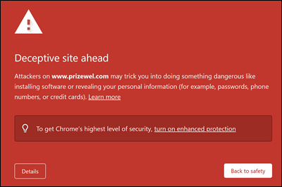
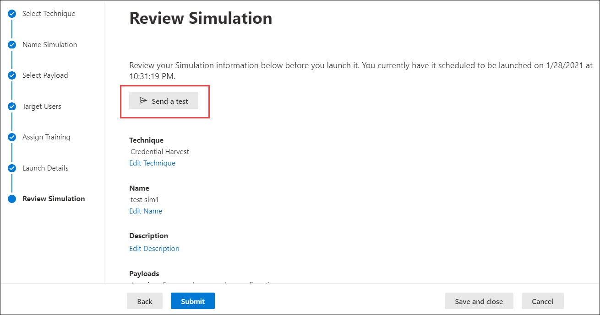

# Implementación y preguntas más frecuentes del aprendizaje de simulación de ataques  Attack simulation training deployment considerations and FAQ

El entrenamiento de simulación de ataques [ya está disponible en general.](https://techcommunity.microsoft.com/t5/microsoft-security-and/attack-simulation-training-in-microsoft-defender-for-office-365/ba-p/2037291)Attack simulation training is now [generally available](https://techcommunity.microsoft.com/t5/microsoft-security-and/attack-simulation-training-in-microsoft-defender-for-office-365/ba-p/2037291). El aprendizaje de simulación de ataques permite a Microsoft 365 E5 o Microsoft Defender para las organizaciones del Plan 2 de Office 365 medir y administrar los riesgos de ingeniería social al permitir la creación y administración de simulaciones de suplantación de identidad (phishing) con tecnología de cargas de suplantación de identidad sin armas del mundo real.Attack simulation training enables Microsoft 365 E5 or Microsoft Defender for Office 365 Plan 2 organizations to measure and manage social engineering risk by allowing the creation and management of phishing simulations that are powered by real-world, de-weaponized phishing payloads. El aprendizaje hiperespacio, impartido en asociación con la seguridad de Terranova, ayuda a mejorar el conocimiento y cambiar el comportamiento de los empleados.Hyper-targeted training, delivered in partnership with Terranova security, helps improve knowledge and change employee behavior.

Para obtener más información sobre cómo empezar con el aprendizaje de simulación de ataques, consulta [Introducción al entrenamiento de simulación de ataques.](attack-simulation-training-get-started.md)For more information about getting started with Attack simulation training, see [Get started using Attack simulation training](attack-simulation-training-get-started.md).

Aunque toda la experiencia de creación y programación de simulación se ha diseñado para que fluya libremente y sin fricción, la ejecución de simulaciones a escala empresarial a menudo requiere planeación.While the whole simulation creation and scheduling experience has been designed to be free-flowing and frictionless, running simulations at an enterprise scale often requires planning. Este artículo ayuda a abordar desafíos específicos que vemos cuando nuestros clientes ejecutan simulaciones en sus propios entornos.This article helps address specific challenges that we see as our customers run simulations in their own environments.

## Problemas con las experiencias del usuario finalIssues with end user experiences

### Direcciones URL de simulación de suplantación de identidad bloqueadas por Google Caja fuerte exploraciónPhishing simulation URLs blocked by Google Safe Browsing

Un servicio de reputación de direcciones URL puede identificar una o varias de las direcciones URL que usa el entrenamiento de simulación de ataques como no seguras.A URL reputation service might identify one or more of the URLs that are used by Attack simulation training as unsafe. Google Caja fuerte Exploración en Google Chrome bloquea algunas de las direcciones URL de suplantación de identidad simuladas con un **mensaje de** sitio engañoso.Google Safe Browsing in Google Chrome blocks some of the simulated phishing URLs with a **Deceptive site ahead** message. Aunque trabajamos con muchos proveedores de reputación de direcciones URL para permitir siempre nuestras direcciones URL de simulación, no siempre tenemos cobertura completa.While we work with many URL reputation vendors to always allow our simulation URLs, we don't always have full coverage.

Tenga en cuenta que este problema no afecta Microsoft Edge.Note that this issue does not affect Microsoft Edge.

Como parte de la fase de planeación, asegúrese de comprobar la disponibilidad de la dirección URL en los exploradores web compatibles antes de usar la dirección URL en una campaña de suplantación de identidad.As part of the planning phase, be sure to check the availability of the URL in your supported web browsers before you use the URL in a phishing campaign. Si Google bloquea las direcciones URL Caja fuerte [exploración,](https://support.google.com/chrome/a/answer/7532419) sigue estas instrucciones de Google para permitir el acceso a las direcciones URL.If the URLs are blocked by Google Safe Browsing, [follow this guidance](https://support.google.com/chrome/a/answer/7532419) from Google to allow access to the URLs.

Consulta Introducción [al aprendizaje de simulación de ataque](attack-simulation-training-get-started.md) para obtener la lista de direcciones URL que usa actualmente el entrenamiento de simulación de ataques.Refer to [Get started using Attack simulation training](attack-simulation-training-get-started.md) for the list of URLs that are currently used by Attack simulation training.

### Direcciones URL de administrador y simulación de suplantación de identidad bloqueadas por soluciones de proxy de red y controladores de filtroPhishing simulation and admin URLs blocked by network proxy solutions and filter drivers

Las direcciones URL de simulación de suplantación de identidad (phishing) y las direcciones URL de administrador pueden bloquearse o eliminarse mediante los filtros o dispositivos de seguridad intermedios.Both phishing simulation URLs and admin URLs might be blocked or dropped by your intermediate security devices or filters. Por ejemplo:For example:

- FirewallsFirewalls
- Soluciones de Firewall de aplicaciones web (WAF)Web Application Firewall (WAF) solutions
- Controladores de filtro de terceros (por ejemplo, filtros de modo kernel)Third-party filter drivers (for example, kernel mode filters)

Aunque hemos visto pocos clientes bloqueados en esta capa, esto sucede.While we have seen few customers being blocked at this layer, it does happen. Si tiene problemas, considere la posibilidad de configurar las siguientes direcciones URL para omitir el examen de los dispositivos de seguridad o filtros según sea necesario:If you encounter problems, consider configuring the following URLs to bypass scanning by your security devices or filters as required:

- Las direcciones URL de suplantación de identidad simuladas, como se describe en [Introducción al aprendizaje de simulación de ataques.](attack-simulation-training-get-started.md)The simulated phishing URLs as described in [Get started using Attack simulation training](attack-simulation-training-get-started.md).
- <https://security.microsoft.com/attacksimulator>
- <https://security.microsoft.com/attacksimulationreport>
- <https://security.microsoft.com/trainingassignments>

### Mensajes de simulación no entregados a todos los usuarios dirigidosSimulation messages not delivered to all targeted users

Es posible que el número de usuarios que reciben realmente los mensajes de correo electrónico de simulación sea menor que el número de usuarios dirigidos por la simulación.It's possible that the number of users who actually receive the simulation email messages is less than the number of users who were targeted by the simulation. Los siguientes tipos de usuarios se excluirán como parte de la validación de destino:The following types of users will be excluded as part of target validation:

- Direcciones de correo electrónico de destinatarios no válidas.Invalid recipient email addresses.
- Usuarios invitados.Guest users.
- Usuarios que ya no están activos en Azure Active Directory (Azure AD).Users that are no longer active in Azure Active Directory (Azure AD).

Solo se incluirán en las simulaciones los usuarios válidos que no sean invitados con un buzón válido.Only valid, non-guest users with a valid mailbox will be included in simulations. Si usa grupos de distribución o grupos de seguridad habilitados para correo para dirigirse a los usuarios, puede usar el cmdlet [Get-DistributionGroupMember](/powershell/module/exchange/get-distributiongroupmember) en [Exchange Online PowerShell](/powershell/exchange/connect-to-exchange-online-powershell) para ver y validar miembros del grupo de distribución.If you use distribution groups or mail-enabled security groups to target users, you can use the [Get-DistributionGroupMember](/powershell/module/exchange/get-distributiongroupmember) cmdlet in [Exchange Online PowerShell](/powershell/exchange/connect-to-exchange-online-powershell) to view and validate distribution group members.

## Problemas con los informes de aprendizaje de simulación de ataquesIssues with Attack simulation training reporting

### Los informes de aprendizaje de simulación de ataques no contienen detalles de actividadAttack simulation training reports do not contain any activity details

El aprendizaje de simulación de ataques incluye información amplia y útil que te mantiene informado del progreso de preparación de amenazas de tus empleados.Attack simulation training comes with rich, actionable insights that keep you informed of the threat readiness progress of your employees. Si los informes de aprendizaje de simulación de ataque no se rellenan con datos, compruebe que la búsqueda del registro de auditoría está activada en su organización (está activada de forma predeterminada).If Attack simulation training reports are not populated with data, verify that audit log search is turned on in your organization (it's on by default).

El entrenamiento de simulación de ataque requiere la búsqueda del registro de auditoría para que los eventos se puedan capturar, grabar y leer de nuevo.Audit log search is required by Attack simulation training so events can be captured, recorded, and read back. Desactivar la búsqueda del registro de auditoría tiene las siguientes consecuencias para el aprendizaje de simulación de ataques:Turning off audit log search has the following consequences for Attack simulation training:

- Los datos de informes no están disponibles en todos los informes.Reporting data is not available across all reports. Los informes aparecerán vacíos.The reports will appear empty.
- Las asignaciones de aprendizaje se bloquean, ya que los datos no están disponibles.Training assignments are blocked, because data is not available.

Para activar o desactivar la búsqueda del registro de auditoría, vea Activar o desactivar la búsqueda del registro [de auditoría.](../../compliance/turn-audit-log-search-on-or-off.md)To turn on audit log search, see [Turn audit log search on or off](../../compliance/turn-audit-log-search-on-or-off.md).

> [!NOTE]
> Los detalles de actividad vacíos también pueden deberse a que no se asignan licencias E5 a los usuarios.Empty activity details can also be caused by no E5 licenses being assigned to users. Compruebe que al menos una licencia de E5 está asignada a un usuario activo para asegurarse de que los eventos de informes se capturan y se registran.Verify at least one E5 license is assigned to an active user to ensure that reporting events are captured and recorded.

### Los informes de simulación no se actualizan inmediatamenteSimulation reports are not updated immediately

Los informes de simulación detallados no se actualizan inmediatamente después de iniciar una campaña.Detailed simulation reports are not updated immediately after you launch a campaign. No se preocupe; se espera este comportamiento.Don't worry; this behavior is expected.

Cada campaña de simulación tiene un ciclo de vida.Every simulation campaign has a lifecycle. Cuando se crea por primera vez, la simulación se encuentra en **el estado Programado.**When first created, the simulation is in the **Scheduled** state. Cuando se inicia la simulación, se pasa al **estado En** curso.When the simulation starts, it transitions to the **In progress** state. Cuando se completa, la simulación pasa al **estado Completado.**When completed, the simulation transitions to the **Completed** state.

Mientras una simulación está en **estado programado,** los informes de simulación estarán en su mayoría vacíos.While a simulation is in the **Scheduled** state, the simulation reports will be mostly empty. Durante esta fase, el motor de simulación está resolviendo las direcciones de correo electrónico del usuario de destino, expandiendo grupos de distribución, quitando usuarios invitados de la lista, etc.:During this stage, the simulation engine is resolving the target user email addresses, expanding distribution groups, removing guest users from the list, etc.:

Una vez que la simulación entra en la **fase en** curso, observará que la información empieza a engañarse en los informes:Once the simulation enters the **In progress** stage, you will notice information starting to trickle into the reporting:

Los informes de simulación individuales pueden tardar hasta 30 minutos en actualizarse después de la transición al **estado En** curso.It can take up to 30 minutes for the individual simulation reports to update after the transition to the **In progress** state. Los datos del informe siguen compilando hasta que la simulación alcanza el **estado Completado.**The report data continues to build until the simulation reaches the **Completed** state. Las actualizaciones de informes se producen en los siguientes intervalos:Reporting updates occur at the following intervals:

- Cada 10 minutos durante los primeros 60 minutos.Every 10 minutes for the first 60 minutes.
- Cada 15 minutos después de 60 minutos hasta 2 días.Every 15 minutes after 60 minutes until 2 days.
- Cada 30 minutos después de 2 días hasta 7 días.Every 30 minutes after 2 days until 7 days.
- Cada 60 minutos después de 7 días.Every 60 minutes after 7 days.

Los widgets de la **página Información** general proporcionan una instantánea rápida de la posición de seguridad basada en simulación de la organización con el tiempo.Widgets on the **Overview** page provide a quick snapshot of your organization's simulation-based security posture over time. Dado que estos widgets reflejan la posición general de seguridad y el recorrido con el tiempo, se actualizan después de que se complete cada campaña de simulación.Because these widgets reflect your overall security posture and journey over time, they're updated after each simulation campaign is completed.

> [!NOTE]
> Puede usar la opción **Exportar** en las distintas páginas de informes para extraer datos.You can use the **Export** option on the various reporting pages to extract data.

### Los mensajes notificados como suplantación de identidad por parte de los usuarios no aparecen en los informes de simulaciónMessages reported as phishing by users aren't appearing in simulation reports

Los informes de simulación en el entrenamiento del simulador de ataque proporcionan detalles sobre la actividad del usuario.Simulation reports in Attack simulator training provide details on user activity. Por ejemplo:For example:

- Usuarios que han hecho clic en el vínculo del mensaje.Users who clicked on the link in the message.
- Usuarios que entregaron sus credenciales.Users who gave up their credentials.
- Usuarios que informaron del mensaje como suplantación de identidad.Users who reported the message as phishing.

Si los mensajes que los usuarios han notificado como suplantación de identidad no se capturan en los informes de simulación de simulación de ataque, puede haber una regla de flujo de correo de Exchange (también conocida como regla de transporte) que bloquee la entrega de los mensajes notificados a Microsoft.If messages that users reported as phishing aren't captured in Attack simulation training simulation reports, there might be an Exchange mail flow rule (also known as a transport rule) that's blocking the delivery of the reported messages to Microsoft. Compruebe que las reglas de flujo de correo no bloquean la entrega a las siguientes direcciones de correo electrónico:Verify that any mail flow rules aren't blocking delivery to the following email addresses:

- junk@office365.microsoft.comjunk@office365.microsoft.com
- abuse@messaging.microsoft.comabuse@messaging.microsoft.com
- phish@office365.microsoft.comphish@office365.microsoft.com
- no \_ junk@office365.microsoft.comnot\_junk@office365.microsoft.com

## Otras preguntas más frecuentesOther frequently asked questions

### P: ¿Cuál es el método recomendado para dirigirse a los usuarios para campañas de simulación?Q: What is the recommended method to target users for simulation campaigns?

A: Hay varias opciones disponibles para los usuarios de destino:A: Several options are available to target users:

- Incluya todos los usuarios (actualmente disponibles para organizaciones con menos de 40 000 usuarios).Include all users (currently available to organizations with less than 40,000 users).
- Elija usuarios específicos.Choose specific users.
- Seleccione usuarios de un archivo CSV.Select users from a CSV file.
- Destino basado en grupos de Azure AD.Azure AD group-based targeting.

Hemos encontrado que las campañas en las que los grupos de Azure AD identifican a los usuarios dirigidos suelen ser más fáciles de administrar.We've found that campaigns where the targeted users are identified by Azure AD groups are generally easier to manage.

### P: ¿Hay límites en la segmentación de usuarios al importar desde un CSV o agregar usuarios?Q: Are there any limits in targeting users while importing from a CSV or adding users?

A: El límite para importar destinatarios desde un archivo CSV o agregar destinatarios individuales a una simulación es de 40 000.A: The limit for importing recipients from a CSV file or adding individual recipients to a simulation is 40,000.

Un destinatario puede ser un usuario individual o un grupo.A recipient can be an individual user or a group. Un grupo puede contener cientos o miles de destinatarios, por lo que un límite real no se coloca en el número de usuarios individuales.A group might contain hundreds or thousands of recipients, so an actual limit isn't placed on the number of individual users.

Administrar un archivo CSV grande o agregar muchos destinatarios individuales puede resultar engorroso.Managing a large CSV file or adding many individual recipients can be cumbersome. El uso de grupos de Azure AD simplificará la administración general de la simulación.Using Azure AD groups will simplify the overall management of the simulation.

### P: ¿Microsoft proporciona cargas en otros idiomas?Q: Does Microsoft provide payloads in other languages?

A: Actualmente, hay 5 cargas localizadas disponibles.A: Currently, there are 5 localized payloads available. Hemos observado que las traducciones directas o automáticas de cargas existentes a otros idiomas provocarán imprecisiones y una menor relevancia.We've noticed than any direct or machine translations of existing payloads to other languages will lead to inaccuracies and decreased relevance.

Dicho esto, puede crear su propia carga en el idioma que prefiera con la experiencia de creación de carga personalizada.That being said, you can create your own payload in the language of your choice using the custom payload authoring experience. También se recomienda encarecidamente que recolecte las cargas existentes que se usaron para dirigirse a los usuarios en una geografía específica.We also strongly recommend that you harvest existing payloads that were used to target users in a specific geography. En otras palabras, deja que los atacantes localicen el contenido por ti.In other words, let the attackers localize the content for you.

### P: ¿Cómo puedo cambiar a otros idiomas para mi experiencia de aprendizaje y portal de administración?Q: How can I switch to other languages for my admin portal and training experience?

A: En Microsoft 365 o Office 365, la configuración de idioma es específica y centralizada para cada cuenta de usuario.A: In Microsoft 365 or Office 365, language configuration is specific and centralized for each user account. Para obtener instrucciones sobre cómo cambiar la configuración de idioma, vea Cambiar el idioma de presentación y la zona horaria [en Microsoft 365 para empresas](https://support.microsoft.com/office/6f238bff-5252-441e-b32b-655d5d85d15b).For instructions on how to change your language setting, see [Change your display language and time zone in Microsoft 365 for Business](https://support.microsoft.com/office/6f238bff-5252-441e-b32b-655d5d85d15b).

Tenga en cuenta que el cambio de configuración puede tardar hasta 30 minutos en sincronizarse en todos los servicios.Note that the configuration change might take up to 30 minutes to synchronize across all services.

### P: ¿Puedo desencadenar una simulación de prueba para comprender cómo es antes de iniciar una campaña completa?Q: Can I trigger a test simulation to understand what it looks like prior to launching a full-fledged campaign?

A: ¡Sí se puede!A: Yes you can! En la última página **Revisar simulación** del asistente para crear una nueva simulación, hay una opción para **Enviar una prueba**.On the very last **Review Simulation** page in the wizard to create a new simulation, there's an option to **Send a test**. Esta opción enviará un mensaje de simulación de suplantación de identidad (phishing) de ejemplo al usuario que ha iniciado sesión actualmente.This option will send a sample phishing simulation message to the currently logged in user. Después de validar el mensaje de suplantación de identidad en la Bandeja de entrada, puede enviar la simulación.After you validate the phishing message in your Inbox, you can submit the simulation.

### P: ¿Puedo dirigirme a usuarios que pertenecen a un inquilino diferente como parte de la misma campaña de simulación?Q: Can I target users that belong to a different tenant as part of the same simulation campaign?

R: No.A: No. Actualmente, no se admiten simulaciones entre inquilinos.Currently, cross-tenant simulations are not supported. Compruebe que todos los usuarios de destino se encuentran en el mismo espacio empresarial.Verify that all of your targeted users are in the same tenant. Los usuarios entre inquilinos o usuarios invitados se excluirán de la campaña de simulación.Any cross-tenant users or guest users will be excluded from the simulation campaign.

### P: ¿Cómo funciona la entrega consciente de la región?Q: How does region aware delivery work?

A: La entrega consciente de región usa el atributo TimeZone del buzón del usuario de destino y la lógica "no antes" para determinar cuándo entregar el mensaje.A: Region aware delivery uses the TimeZone attribute of the targeted user's mailbox and 'not before' logic to determine when to deliver the message. Por ejemplo, considere el siguiente escenario:For example, consider the following scenario:

- A las 7:00 a.m. en la zona horaria del Pacífico (UTC-8), un administrador crea y programa una campaña para que comience a las 9:00 a.m. del mismo día.At 7:00 AM in the Pacific time zone (UTC-8), an admin creates and schedules a campaign to start at 9:00 AM on the same day.
- UserA está en la zona horaria oriental (UTC-5).UserA is in the Eastern time zone (UTC-5).
- UserB también está en la zona horaria del Pacífico.UserB is also in the Pacific time zone.

A las 9:00 a.m. del mismo día, el mensaje de simulación se envía a UserB.At 9:00 AM on the same day, the simulation message is sent to UserB. Con la entrega consciente de la región, el mensaje no se envía a UserA el mismo día, ya que la hora del Pacífico de las 9:00 a.m. es a las 12:00 p.m. hora del este.With region-aware delivery, the message is not sent to UserA on the same day, because 9:00 AM Pacific time is 12:00 PM Eastern time. En su lugar, el mensaje se envía a UserA a las 9:00 a.m. hora del este del día siguiente.Instead, the message is sent to UserA at 9:00 AM Eastern time on the following day.

Por lo tanto, en la ejecución inicial de una campaña con la entrega consciente de región habilitada, puede parecer que el mensaje de simulación se envió solo a los usuarios de una zona horaria específica.So, on the initial run of a campaign with region aware delivery enabled, it might appear that the simulation message was sent only to users in a specific time zone. Pero, a medida que pase el tiempo y más usuarios entren en el ámbito, los usuarios dirigidos aumentarán.But, as time passes and more users come into scope, the targeted users will increase.