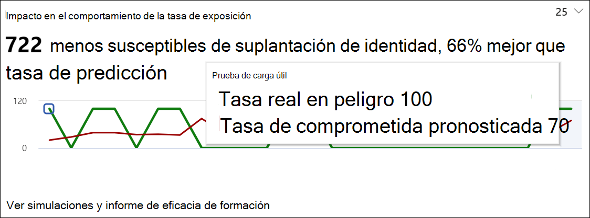
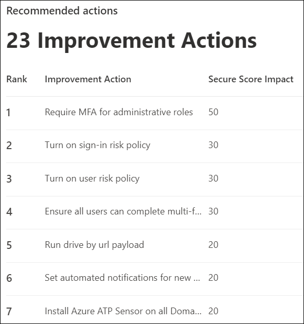

# Obtenga información a través de la formación de simulación de ataquesGain insights through Attack simulation training

Dentro del aprendizaje de simulación de ataque, Microsoft le proporciona información basada en los resultados de simulaciones y aprendizajes que los empleados han pasado.Within Attack simulation training, Microsoft provides you with insights based on outcomes of simulations and trainings that employees went through. Estas conclusiones le ayudarán a mantenerse informado sobre el progreso de preparación de amenazas de sus empleados, así como a recomendar los siguientes pasos para preparar mejor a los empleados y su entorno para los ataques.These insights will help keep you informed on the threat readiness progress of your employees, as well as recommend next steps to better prepare your employees and your environment for attacks.

Estamos trabajando continuamente en la expansión de los conocimientos que están disponibles para usted.We are continuously working on expanding the insights that are available to you. El impacto del comportamiento y las acciones recomendadas están disponibles actualmente.Behavior impact and recommended actions are currently available. Para empezar, dirígete a Formación de simulación de ataques en el Centro de seguridad [de Microsoft 365](https://security.microsoft.com/attacksimulator?viewid=overview).To start, head over to [Attack simulation training in the Microsoft 365 security center](https://security.microsoft.com/attacksimulator?viewid=overview).

## Impacto del comportamiento en la tasa de compromisoBehavior impact on compromise rate

En la **pestaña Información general** del aprendizaje de simulación de ataque, encontrarás el impacto del comportamiento en la tarjeta de tasa **de** compromiso.On the **Overview** tab of Attack simulation training, you'll find the **behavior impact on compromise rate** card. Esta tarjeta muestra cómo los empleados trataron las simulaciones que ejecutó en contraste con la tasa **de compromiso predicho.**This card shows how employees dealt with the simulations you ran in contrast to the **predicted compromise rate**. Puede usar estas perspectivas para realizar un seguimiento del progreso en la preparación de amenazas de los empleados mediante la ejecución de varias simulaciones en los mismos grupos de empleados.You can use these insights to track progress in employees threat readiness by running multiple simulations against the same groups of employees.

En el gráfico puede ver:In the graph you can see:

- **Tasa de compromiso** predicho que refleja la tasa de compromiso promedio para las simulaciones que usan el mismo tipo de carga en otros inquilinos de Microsoft 365 que usan el aprendizaje de simulación de ataques.**Predicted compromise rate** which reflects the average compromise rate for simulations using the same type of payload across other Microsoft 365 tenants that use Attack simulation training.
- **La tasa de compromiso real** refleja el porcentaje de empleados que han caído en la simulación.**Actual compromise rate** reflects the percentage of employees that fell for the simulation.

Además, refleja la diferencia entre el número real de empleados comprometidos por el ataque y la tasa de compromiso `<number> less susceptible to phishing` predicho.Additionally, `<number> less susceptible to phishing` reflects the difference between actual number of employees compromised by the attack and the predicted compromise rate. Es menos probable que este número de empleados se vea comprometido por ataques similares en el futuro, mientras que indica cómo lo hacían los empleados en general en contraste con la tasa de `<percent%> better than predicted rate` compromiso predicho.This number of employees is less likely to be compromised by similar attacks in the future, while `<percent%> better than predicted rate` indicates how employees did overall in contrast with the predicted compromise rate.

> [!div class="mx-imgBorder"]
> 

Para ver un informe más detallado, haga clic **en Ver simulaciones y informe de eficacia de aprendizaje.**To see a more detailed report, click **View simulations and training efficacy report**. Este informe proporciona la misma información con contexto adicional de la propia simulación (por ejemplo, la técnica de simulación y el total de usuarios dirigidos).This report provides the same information with additional context from the simulation itself (for example, simulation technique and total users targeted).

## Acciones recomendadasRecommended actions

En la [ **pestaña Simulaciones,**](https://security.microsoft.com/attacksimulator?viewid=simulations)la selección de una simulación le llevará a los detalles de la simulación, donde encontrará la **sección Acciones recomendadas.**On the [**Simulations** tab](https://security.microsoft.com/attacksimulator?viewid=simulations), selecting a simulation will take you to the simulation details, where you'll find the **Recommended actions** section.

En la sección acciones recomendadas se detallan las recomendaciones disponibles en [Puntuación segura de Microsoft](../defender/microsoft-secure-score.md).The recommended actions section details recommendations as available in [Microsoft Secure Score](../defender/microsoft-secure-score.md). Estas recomendaciones se basan en la carga usada en la simulación y le ayudarán a proteger a sus empleados y su entorno.These recommendations are based on the payload used in the simulation, and will help you protect your employees and your environment. Hacer clic en cada acción de mejora le llevará a sus detalles.Clicking on each improvement action will take you to its details.

> [!div class="mx-imgBorder"]
> 

## Vínculos relacionadosRelated Links

[Introducción al uso de aprendizaje de simulación de ataquesGet started using Attack simulation training](attack-simulation-training-get-started.md)

[Crear una simulación de ataque de suplantación de identidadCreate a phishing attack simulation](attack-simulation-training.md)

[crear una carga para entrenar a sus personascreate a payload for training your people](attack-simulation-training-payloads.md)
