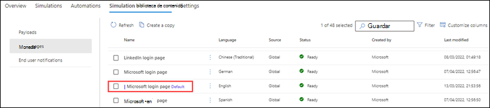

# Páginas de inicio de sesión en el aprendizaje de simulación de ataques

**Se aplica a** [Microsoft Defender para Office 365 plan 2](defender-for-office-365.md)

En Entrenamiento de simulación de ataque en Microsoft 365 E5 o Microsoft Defender para Office 365 Plan 2, las páginas de inicio de sesión se muestran a los usuarios en simulaciones que usan la **cosecha de credenciales** y **El vínculo en** [técnicas de ingeniería social de datos adjuntos](attack-simulation-training.md#select-a-social-engineering-technique).

Para ver las páginas de inicio de sesión disponibles, abra el portal de Microsoft 365 Defender en <https://security.microsoft.com>, vaya a Email & pestaña \> **De colaboración** \> **Entrenamiento de simulación de ataque** \> **biblioteca de contenido de Simulación** y, a continuación, seleccione **Páginas de inicio de sesión**. Para ir directamente a la pestaña **Biblioteca de contenido de simulación** , donde puede seleccionar **Páginas de inicio de sesión**, use <https://security.microsoft.com/attacksimulator?viewid=simulationcontentlibrary>.

**Las páginas de inicio de sesión** tienen dos pestañas:

- **Páginas de inicio de sesión globales**: contiene las páginas de inicio de sesión integradas y no modificables. Hay cuatro páginas de inicio de sesión integradas localizadas en más de 12 idiomas:
  - **Página de inicio de sesión de GitHub**
  - **Página de inicio de sesión de LinkedIn**
  - **Página de inicio de sesión de Microsoft**
  - **Página de inicio de sesión sin marca**

- **Páginas de inicio de sesión de inquilino**: contiene las páginas de inicio de sesión personalizadas que ha creado.

Se muestra la siguiente información para cada página de inicio de sesión:

- **Nombre**
- **Language**
- **Origen**: para las páginas de inicio de sesión integradas, el valor es **Global**. Para las páginas de inicio de sesión personalizadas, el valor es **Inquilino**.
- **Estado**: **Listo** o **Borrador**.
- **Creado por**: para las páginas de inicio de sesión integradas, el valor es **Microsoft**. Para las páginas de inicio de sesión personalizadas, el valor es el UPN del usuario que creó la página de inicio de sesión.
- **Última modificación**

Para buscar una página de inicio de sesión en la lista, use el  **Cuadro de búsqueda** para buscar el nombre de la página de inicio de sesión.

Haga clic en  **Filtre** para filtrar las páginas de inicio de sesión por **idioma** o **estado**.

Para quitar una o varias columnas que se muestran, haga clic en  **Personalizar columnas**.

Al seleccionar una página de inicio de sesión de la lista, aparece un control flotante de detalles con la siguiente información:

-  **Editar** solo está disponible en páginas de inicio de sesión personalizadas en la pestaña **Páginas de inicio de sesión de inquilino** .
-  **Marque como valor predeterminado** para que esta página de inicio de sesión sea la selección predeterminada en **Recopilación de credenciales** o **Vínculo en cargas de datos adjuntos**  o [automatizaciones de carga](attack-simulation-training-payload-automations.md). Si la página de inicio de sesión ya es la predeterminada,  **Marcar como valor predeterminado** no está disponible.
- **Pestaña Vista previa** : vea la página de inicio de sesión como la verán los usuarios. Los vínculos **página 1** y **página 2** están disponibles en la parte inferior de la página para las páginas de inicio de sesión de dos páginas.
- **Pestaña Detalles** : vea los detalles de la página de inicio de sesión:
  - **Descripción**
  - **Estado**: **Listo** o **Borrador**.
  - **Origen de página de inicio de sesión**: para las páginas de inicio de sesión integradas, el valor es **Global**. Para las páginas de inicio de sesión personalizadas, el valor es **Inquilino**.
  - **Modificado por**
  - **Language**
  - **Última modificación**

## Crear páginas de inicio de sesión

1. En el portal de Microsoft 365 Defender en <https://security.microsoft.com>, vaya a **Email & pestaña** \> biblioteca de contenido Entrenamiento de simulación de ataque **colaboración**  \> \> y, a continuación, seleccione **Páginas de inicio de sesión**. Para ir directamente a la pestaña **Biblioteca de contenido de simulación** , donde puede seleccionar **Páginas de inicio de sesión**, use <https://security.microsoft.com/attacksimulator?viewid=simulationcontentlibrary>.
Puede crear páginas de inicio de sesión personalizadas en las siguientes ubicaciones:

   Haga clic en  **Cree una nueva** para iniciar el asistente para crear la página de inicio de sesión del usuario final.

   > [!NOTE]
   >  **Crear nuevo** también está disponible durante el paso de selección de carga útil de la creación de una simulación o automatización de simulación. Para obtener más información, vea [Crear una simulación: Seleccionar una página de inicio de sesión y carga útil](attack-simulation-training.md#select-a-payload-and-login-page) y [Crear una automatización de simulación: Seleccionar una carga y una página de inicio de sesión](attack-simulation-training-simulation-automations.md#select-a-payload-and-login-page).
   >
   > En cualquier momento durante el asistente para la creación, puede hacer clic en **Guardar y cerrar** para guardar el progreso y continuar configurando la página de inicio de sesión más adelante. Para seleccionar dónde lo dejó, seleccione la página de inicio de sesión en la pestaña **Páginas de inicio de sesión del inquilino** en **Páginas de inicio de sesión** y, a continuación, haga clic en  **Edición**. La página de inicio de sesión parcialmente completada tendrá el valor **Estado** **Borrador**.

2. En la **página Definir detalles para el inicio de sesión** , configure los siguientes valores:
   - **Nombre**: escriba un nombre único.
   - **Descripción**: escriba una descripción opcional.

   Cuando termine, haga clic en **Siguiente**.

3. En la **página Configurar inicio de sesión** , configure los siguientes valores:

   - **Seleccionar un idioma**: los valores disponibles son **: chino (simplificado)**, **chino (tradicional)**, **inglés**, **francés**, **alemán**, **italiano**, **japonés**, **coreano**, **portugués**, **ruso**, **español** y **holandés**.

   - **Convierta esta página en la página de inicio de sesión predeterminada**: si selecciona esta opción, la página de inicio de sesión será la selección predeterminada en **Recopilación de credenciales** o **Vínculo en cargas de datos adjuntos**  o [automatizaciones de carga](attack-simulation-training-payload-automations.md).

   - **Crear un inicio de sesión de dos páginas**: si no selecciona esta opción, la página de inicio de sesión es una página. Si selecciona esta opción, aparecen las pestañas **Página 1** y **Página 2** para configurar por separado.

     - En la pestaña **Texto** , hay disponible un editor de texto enriquecido para crear la página de inicio de sesión.

       - Use el control **Etiqueta dinámica** para personalizar la página de inicio de sesión insertando las etiquetas disponibles:
         - **Insertar nombre de usuario**: el valor que se agrega en el cuerpo del mensaje es `${userName}`.
         - **Insertar correo electrónico**: el valor que se agrega en el cuerpo del mensaje es `${emailAddress}`.
         - **Insertar fecha**: el valor que se agrega en el cuerpo del mensaje es `${date|MM/dd/yyyy|offset}`.

       - Use el control **Usar desde predeterminado** para seleccionar una página de inicio de sesión integrada con la que empezar como plantilla.

       - El control **de botón Agregar siguiente** solo está disponible en la **página 1** de inicios de sesión de dos páginas. El texto predeterminado del botón es **Siguiente** , pero puede cambiarlo.

       - El control **de botón Agregar compromiso** está disponible en inicios de sesión de una página o en la **página 2** de inicios de sesión de dos páginas. El texto predeterminado del botón es **Enviar**, pero puede cambiarlo.

     - En la pestaña **Código** , puede ver y modificar el código HTML directamente. El formato y otros controles como **etiqueta dinámica** y **Usar de forma predeterminada** o **el botón Agregar compromiso** no están disponibles.

   - Use el botón **Vista previa de la página de inicio de sesión** en la parte superior de la página para revisar la página de inicio de sesión.

   Cuando termine, haga clic en **Siguiente**.

4. En la **página Revisar inicio de sesión** , puede revisar los detalles de la página de inicio de sesión.

   Puede seleccionar **Editar** en cada sección para modificar la configuración dentro de la sección. También puede hacer clic en **Volver atrás** o seleccionar la página específica del asistente.

   Cuando haya terminado, haga clic en **Enviar**.

5. En la **página \<Name\> Nuevo inicio de sesión creado** , puede usar los vínculos para crear una nueva página de inicio de sesión, iniciar una simulación o ver todas las páginas de inicio de sesión.

   Cuando haya terminado, haga clic en **Listo**.

De nuevo en la pestaña **Páginas de inicio de sesión del inquilino** en **Páginas** de inicio de sesión, la página de inicio de sesión que ha creado ahora es una lista.

## Modificar páginas de inicio de sesión

No se pueden modificar las páginas de inicio de sesión integradas en la pestaña **Páginas de inicio de sesión globales** . Solo puede modificar páginas de inicio de sesión personalizadas en la pestaña **Páginas de inicio de sesión del inquilino** .

Para modificar una página de inicio de sesión personalizada existente en la pestaña **Páginas de inicio de sesión del inquilino** , realice uno de los pasos siguientes:

- Seleccione la página de inicio de sesión de la lista haciendo clic en la casilla. Haga clic en el  **Icono de edición** que aparece.
- Haga clic en **⋮** (**Acciones**) entre los valores **nombre** e **idioma** de la página de inicio de sesión de la lista y, a continuación, seleccione  **Edición**.
- Seleccione la página de inicio de sesión de la lista haciendo clic en el nombre. En el control flotante de detalles que se abre, haga clic en  **Edición**.

El asistente para la página de inicio de sesión se abre con la configuración y los valores de la página de inicio de sesión seleccionada. Los pasos son los mismos que se describen en la sección [Crear páginas de inicio de sesión](#create-login-pages) .

## Copiar páginas de inicio de sesión

Para copiar una página de inicio de sesión existente en las **pestañas Páginas de inicio de sesión del inquilino** o **Páginas de inicio de sesión globales** , realice uno de los pasos siguientes:

- Seleccione la página de inicio de sesión de la lista haciendo clic en la casilla y, a continuación, haga clic en el  **Cree un icono de copia** que aparezca.
- Haga clic **en ⋮** (**Acciones**) entre los valores **Nombre** e **Idioma** de la página de inicio de sesión de la lista y, a continuación, seleccione  **Cree una copia**.

El asistente para la página de inicio de sesión se abre con la configuración y los valores de la página de inicio de sesión seleccionada. Los pasos son los mismos que se describen en la sección [Crear páginas de inicio de sesión](#create-login-pages) .

> [!NOTE]
> Al copiar una página de inicio de sesión integrada en la pestaña **Páginas de inicio de sesión globales** , asegúrese de cambiar el valor **Nombre** . Este paso garantiza que la copia se guarda como una página de inicio de sesión personalizada en la pestaña **Páginas de inicio de sesión del inquilino** .
>
> El control **Usar desde predeterminado** en la página **Configurar inicio de sesión** en el asistente para página de inicio de sesión permite copiar el contenido de una página de inicio de sesión integrada.

## Quitar páginas de inicio de sesión

No puede quitar las páginas de inicio de sesión integradas de la pestaña **Páginas de inicio de sesión globales** . Solo puede quitar páginas de inicio de sesión personalizadas en la pestaña **Páginas de inicio de sesión del inquilino** .

Para quitar una página de inicio de sesión personalizada existente de la pestaña **Páginas de inicio de sesión del inquilino** , realice uno de los pasos siguientes:

- Seleccione la página de inicio de sesión de la lista haciendo clic en la casilla y, a continuación, haga clic en el  **Icono de eliminación** que aparece.
- Haga clic **en ⋮** (**Acciones**) entre los valores **Nombre** e **Idioma** de la página de inicio de sesión de la lista y, a continuación, seleccione  **Eliminar**.

## Convertir una página de inicio de sesión en la predeterminada

La página de inicio de sesión predeterminada es la selección predeterminada que se usa en **Credential harvest** o **Link en cargas de datos adjuntos**  o [automatizaciones de carga](attack-simulation-training-payload-automations.md).

Para que una página de inicio de sesión sea la predeterminada en las **pestañas Páginas de inicio de sesión del inquilino** o **Páginas de inicio de sesión globales** , realice uno de los pasos siguientes:

- Seleccione la página de inicio de sesión de la lista haciendo clic en la casilla. Haga clic en el  **Marque como icono predeterminado** que aparece.
- Haga clic en **⋮** (**Acciones**) entre los valores **Nombre** e **Idioma** de la página de inicio de sesión de la lista y, a continuación, seleccione  **Marque como valor predeterminado**.
- Seleccione la página de inicio de sesión de la lista haciendo clic en el nombre. En el control flotante de detalles que se abre, haga clic en  **Marque como valor predeterminado**.
- Seleccione **Convertir esta página en la página de inicio de sesión predeterminada** en la página **Configurar inicio de sesión** del asistente al [crear o modificar una página de inicio de sesión](#create-login-pages).

> [!NOTE]
> Los procedimientos anteriores no están disponibles si la página de inicio de sesión ya es la predeterminada.
>
> La página de inicio de sesión predeterminada también está marcada en la lista, aunque es posible que tenga que ampliar la columna **Nombre** para verla:
>
> 

## Vínculos relacionados

[Introducción al uso de aprendizaje de simulación de ataques](attack-simulation-training-get-started.md)

[Creación de una simulación de ataque de suplantación de identidad (phishing)](attack-simulation-training.md)

[Automatizaciones de simulación para Entrenamiento de simulación de ataque](attack-simulation-training-simulation-automations.md)
