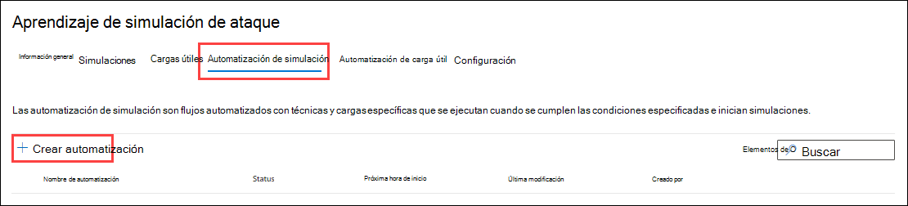

# Automatización de carga útil para el aprendizaje de simulación de ataques

**Se aplica a** [Microsoft Defender para Office 365 plan 2](defender-for-office-365.md)

En el curso de simulación de ataques en Microsoft 365 E5 o Microsoft Defender para el Plan 2 de Office 365, las automatizacións de carga (también conocidas como recolección de _carga)_ recopilan información de mensajes de suplantación de identidad reales que los usuarios de la organización han notificado. Aunque el número de estos mensajes es probablemente bajo en la organización, puede especificar las condiciones que debe buscar en los ataques de suplantación de identidad (por ejemplo, destinatarios, técnica de ingeniería social, información del remitente, etc.). A continuación, el entrenamiento de simulación de ataque imitará los mensajes y cargas que se usan en el ataque para iniciar automáticamente simulaciones inofensivas para usuarios dirigidos.

Para crear una automatización de carga, siga estos pasos:

1. En el portal Microsoft 365 Defender en , vaya a Correo electrónico & de aprendizaje de simulación de <https://security.microsoft.com/>  \>  \> **ataques De** carga.

   Para ir directamente a la **pestaña Automatización de carga,** use <https://security.microsoft.com/attacksimulator?viewid=payloadautomation> .

2. En la **pestaña Automatización de carga,** seleccione  **Crear simulación**.

   

3. Se abrirá el Asistente para creación. El resto de este artículo describe las páginas y la configuración que contienen.

> [!NOTE]
> En cualquier momento durante el asistente  para la creación de simulación, puede hacer clic en Guardar y cerrar para guardar el progreso y continuar configurando la simulación más adelante. La simulación incompleta tiene el **valor de Estado** **Borrador** en la **ficha Simulaciones.** Puede elegir dónde lo dejó seleccionando la simulación y haciendo clic  **Edite** simulation.## Name y describa la simulación.

## Nombre de automatización

En la **página Nombre de** automatización, configure las siguientes opciones:

- **Nombre:** escriba un nombre descriptivo único para la simulación.
- **Descripción:** escriba una descripción detallada opcional para la simulación.

Cuando termine, haga clic en **Siguiente**.

## Condiciones de ejecución

En la **página Condiciones de** ejecución, seleccione las condiciones del ataque de suplantación de identidad real que determina cuándo se ejecutará la automatización.

Puede usar cada condición solo una vez. Varias condiciones usan lógica AND ( \<Condition1\> y \<Condition2\> ).

 **Agregar condición**.

- **No. de los usuarios destinados a la campaña:** Configure las siguientes opciones:
  - **Igual a**, **Less than**, **Greater than**, Less than or equal **to**, or Greater than or **equal to**.
  - **Escriba valor:** el número de usuarios a los que se ha dirigido la campaña de suplantación de identidad.
- **Campañas con una técnica de phishing específica:** seleccione uno de los valores disponibles:
  - **Recolección de credenciales**
  - **Datos adjuntos de malware**
  - **Vínculo en datos adjuntos**
  - **Vínculo a malware**
  - **Dirección URL de unidad por**
- **Dominio de remitente específico:** escriba un valor de dominio de correo electrónico del remitente (por ejemplo, contoso.com).
- **Nombre de remitente específico:** escriba un valor de nombre de remitente.
- **Correo electrónico de remitente** específico: escriba una dirección de correo electrónico del remitente.
- **Destinatarios de usuarios y grupos específicos:** empiece a escribir el nombre o la dirección de correo electrónico del usuario o grupo. Cuando aparezca, selecciónelo.

Para quitar una condición después de agregarla, haga clic en .

Cuando termine, haga clic en **Siguiente**.

## Revisar la automatización

En la **página Revisar automatización,** puede revisar los detalles de la automatización de carga.

Puede seleccionar **Editar** en cada sección para modificar la configuración dentro de la sección. También puede hacer clic en **Volver atrás** o seleccionar la página específica del asistente.

Cuando haya terminado, haga clic en **Enviar**.
