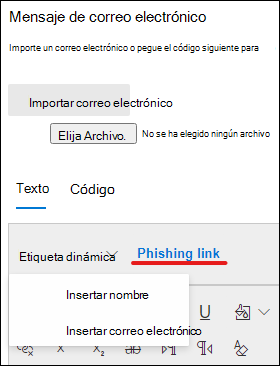

# Crear una carga personalizada para la simulación de ataques formación

Microsoft ofrece un sólido catálogo de carga útil para diversas técnicas de ingeniería social que se emparejan con el entrenamiento de simulación de ataques. Sin embargo, es posible que desee crear cargas personalizadas que funcionen mejor para su organización. En este artículo se describe cómo crear una carga útil en el aprendizaje de simulación de ataques en Microsoft Defender para Office 365.

Puede crear una carga haciendo clic en **Crear** una carga en la pestaña [Cargas **dedicadas**](https://security.microsoft.com/attacksimulator?viewid=payload) o en el Asistente para la creación [de simulación.](attack-simulation-training.md#selecting-a-payload)

El primer paso del asistente te hará seleccionar un tipo de carga. **Actualmente, solo está disponible el correo electrónico.**

A continuación, seleccione una técnica asociada. Vea más detalles sobre técnicas en [Seleccionar una técnica de ingeniería social.](attack-simulation-training.md#selecting-a-social-engineering-technique)

En el siguiente paso, asigne un nombre a la carga. Opcionalmente, puede darle una descripción.

## Configurar la carga

Ahora es el momento de crear la carga útil. Introduzca el nombre del remitente, la dirección de correo electrónico y el asunto del correo electrónico en la **sección Detalles del** remitente. Elige una dirección URL de suplantación de identidad de la lista proporcionada. Esta dirección URL se incrustará más adelante en el cuerpo del mensaje.

> [!TIP]
> Puede elegir un correo electrónico interno para el remitente de la carga, lo que hará que la carga aparezca como procedente de otro empleado de la empresa. Esto aumentará la susceptibilidad a la carga y ayudará a instruir a los empleados sobre el riesgo de amenazas internas.

Hay disponible un editor de texto enriquecido para crear la carga. También puedes importar un correo electrónico que hayas creado de antemano. A medida que cree el cuerpo del correo electrónico, aproveche las etiquetas dinámicas **para** personalizar el correo electrónico a sus destinos. Haga clic en el vínculo de suplantación de identidad **(phishing)** para agregar la dirección URL de suplantación de identidad previamente seleccionada en el cuerpo del mensaje.

> [!TIP]
> Para ahorrar tiempo, active la opción para reemplazar todos los vínculos del mensaje **de correo electrónico por el vínculo de suplantación de identidad**.

Una vez que haya terminado de compilar la carga a su gusto, haga clic en **Siguiente.**

## Agregar indicadores

Los indicadores ayudarán a los empleados que pasan por la simulación de ataques a comprender la pista que pueden buscar en ataques futuros. Para empezar, haga clic **en Agregar indicador.**

Selecciona un indicador que quieras usar en la lista desplegable. Esta lista está conservada para contener las pistas más comunes que aparecen en los mensajes de correo electrónico de suplantación de identidad. Una vez seleccionada, asegúrese de que la ubicación del indicador esté establecida en **Desde el** cuerpo del correo electrónico y haga clic en **Seleccionar texto.** Resalte la parte de la carga en la que aparece este indicador y haga clic **en Seleccionar**.

Agrega una descripción personalizada para describir el indicador y haz clic en el marco de vista previa del indicador para ver una vista previa del indicador. Una vez hecho esto, haga clic **en Agregar**. Repite estos pasos hasta que hayas cubierto todos los indicadores de la carga.

## Revisar la carga

Has terminado de compilar la carga útil. Ahora es el momento de revisar los detalles y ver una vista previa de la carga. La vista previa incluirá todos los indicadores que hayas creado. Puedes editar cada parte de la carga a partir de este paso. Una vez satisfecho, puedes **enviar la** carga.

> [!IMPORTANT]
> Las cargas que haya creado tendrán **tenant** como origen. Al seleccionar cargas, asegúrese de no filtrar el espacio **empresarial.**

## Vínculos relacionados

[Introducción al uso de aprendizaje de simulación de ataques](attack-simulation-training-get-started.md)

[Crear una simulación de ataque de suplantación de identidad](attack-simulation-training.md)

[Obtenga información a través de la formación de simulación de ataques](attack-simulation-training-insights.md)
