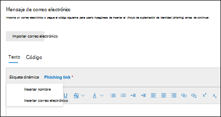
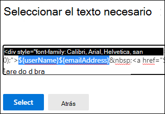

# Crear cargas personalizadas para el entrenamiento de simulación de ataque en Defender para Office 365

**Se aplica a** [Microsoft Defender para Office 365 plan 2](defender-for-office-365.md)

En el aprendizaje de simulación de ataques, una _carga_ es el mensaje de correo electrónico de suplantación de identidad (phishing) y las páginas web que se presentan a los usuarios en simulaciones. El aprendizaje de simulación de ataques en Microsoft 365 E5 o Microsoft Defender para Office 365 Plan 2 ofrece un sólido catálogo de cargas integradas para las técnicas de ingeniería social disponibles. Sin embargo, es posible que desee crear cargas personalizadas que funcionen mejor para su organización.

En este artículo se describe cómo crear sus propias cargas en el entrenamiento de simulación de ataques. Puede crear cargas personalizadas en las siguientes ubicaciones:

- La **pestaña Cargas:** en el portal de Microsoft 365 Defender en , vaya a Correo electrónico & de aprendizaje de simulación <https://security.microsoft.com/> de  \>  \> **ataques de** colaboración. Para ir directamente a la **pestaña Payloads,** use <https://security.microsoft.com/attacksimulator?viewid=payload> .
- Durante la creación de la simulación: puede crear cargas personalizadas en la página **Seleccionar** una carga (la tercera página) del asistente para la creación de simulación. Para obtener más información, vea [Simulate a phishing attack in Defender for Office 365](attack-simulation-training.md).

Para obtener información de introducción sobre el aprendizaje de simulación de ataques, consulta [Introducción al aprendizaje de simulación de ataques.](attack-simulation-training-get-started.md)

> [!NOTE]
> Ciertas marcas comerciales, logotipos, símbolos, insignias y otros identificadores de origen reciben una protección mayor en virtud de leyes y leyes locales, estatales y federales. El uso no autorizado de estos indicadores puede someter a los usuarios a sanciones, incluidas las multas penales. Aunque no es una lista extensa, esto incluye los precintos presidencial, vicepresidenta y congresional, la CIA, el FBI, la Seguridad Social, Medicare y Medicaid, el Servicio de Ingresos Internos de estados Unidos y los Juegos Olímpicos. Más allá de estas categorías de marcas comerciales, el uso y modificación de cualquier marca comercial de terceros conlleva una cantidad inherente de riesgo. Usar sus propias marcas comerciales y logotipos en una carga sería menos arriesgado, especialmente cuando su organización permite el uso. Si tiene más preguntas sobre lo que es o no es apropiado usar al crear o configurar una carga, consulte con sus asesores legales.

## Crear una carga

Después de hacer clic  **Cree una carga desde** la pestaña **Cargas** del **** entrenamiento de simulación de ataque o en la página Seleccionar una carga del asistente para la creación de la simulación, se inicia el asistente para la creación de carga y se describe en esta sección.

### Seleccionar un tipo de carga

En la **página Seleccionar tipo,** el único valor que puede seleccionar actualmente es **Correo electrónico**.

Haga clic en **Siguiente**.

### Seleccionar una técnica de ingeniería social

En la **página Seleccionar técnica,** las opciones disponibles son las mismas que en la página [Seleccionar técnica](attack-simulation-training.md#select-a-social-engineering-technique) del asistente para la creación de simulación:

- **Recolección de credenciales**
- **Datos adjuntos de malware**
- **Vínculo en datos adjuntos**
- **Vínculo a malware**
- **Dirección URL de unidad por**

Cuando termine, haga clic en **Siguiente**.

### Nombre y descripción de la carga

En la **página Nombre de carga,** configure las siguientes opciones:

- **Nombre:** escriba un nombre descriptivo único para la carga.
- **Descripción:** escriba una descripción detallada opcional de la carga.

Cuando termine, haga clic en **Siguiente**.

## Configurar la carga

En la **página Configurar carga** útil, es el momento de compilar la carga. Muchas de las opciones de configuración disponibles están determinadas por la selección realizada en la página **Técnica** de selección (por ejemplo, vínculos frente a datos adjuntos).

- **Sección Detalles del** remitente: Configure las siguientes opciones:
  - **Nombre De**
  - **Use el nombre como nombre para mostrar:** de forma predeterminada, esta configuración no está seleccionada.
  - **Desde correo** electrónico: si elige una dirección de correo electrónico interna para el remitente de la carga, la carga aparecerá procedente de un compañero empleado. Esta dirección de correo electrónico del remitente aumentará la susceptibilidad de un usuario a la carga útil y ayudará a educar a los empleados sobre el riesgo de amenazas internas.
  - **Asunto del correo electrónico**

- **Sección Detalles de** datos adjuntos: Esta sección solo está disponible si seleccionó Datos adjuntos de **malware** **,** Vínculo en datos adjuntos o Vínculo a **malware** en la **página Seleccionar** técnica. Configure las siguientes opciones:
  - **Asigne un nombre a los datos adjuntos**
  - **Seleccione un tipo de datos adjuntos:** Actualmente, el único valor disponible es **Docx**.

- **Sección Vínculo para datos** adjuntos: esta sección solo está disponible si seleccionó Vincular a **malware** en la **página Seleccionar** técnica. En el cuadro Seleccionar una dirección URL que desea que sea su vínculo de datos adjuntos de **malware,** seleccione una de las direcciones URL disponibles (las mismas direcciones URL que se describen para la sección vínculo **Phishing).**

  Más adelante, insertará la dirección URL en el cuerpo del mensaje.

- **Sección vínculo de suplantación** de identidad: esta sección solo está disponible si seleccionó **Credential harvest**, **Link in attachment** o **Drive-by URL** en la página Seleccionar **técnica.**

  Para **Credential harvest** o **Drive-by URL**, el nombre del cuadro es Select a URL you want to be your **phishing link**. Más adelante, insertará la dirección URL en el cuerpo del mensaje.

  Para **Vínculo en datos adjuntos**, el nombre del cuadro es Seleccionar una dirección URL en estos datos adjuntos que desea que sea su vínculo de **suplantación de identidad**. Más adelante, insertará la dirección URL en los datos adjuntos.

  Seleccione uno de los valores de dirección URL disponibles:
  
  - <https://www.mcsharepoint.com>
  - <https://www.attemplate.com>
  - <https://www.doctricant.com>
  - <https://www.mesharepoint.com>
  - <https://www.officence.com>
  - <https://www.officenced.com>
  - <https://www.officences.com>
  - <https://www.officentry.com>
  - <https://www.officested.com>
  - <https://www.prizegives.com>
  - <https://www.prizemons.com>
  - <https://www.prizewel.com>
  - <https://www.prizewings.com>
  - <https://www.shareholds.com>
  - <https://www.sharepointen.com>
  - <https://www.sharepointin.com>
  - <https://www.sharepointle.com>
  - <https://www.sharesbyte.com>
  - <https://www.sharession.com>
  - <https://www.sharestion.com>
  - <https://www.templateau.com>
  - <https://www.templatent.com>
  - <https://www.templatern.com>
  - <https://www.windocyte.com>

  > [!NOTE]
  > Un servicio de reputación de direcciones URL puede identificar una o varias de estas direcciones URL como no seguras. Compruebe la disponibilidad de la dirección URL en los exploradores web compatibles antes de usar la dirección URL en una simulación. Para obtener más información, consulta [Phishing simulation URLs blocked by Google Caja fuerte Browsing](attack-simulation-training-faq.md#phishing-simulation-urls-blocked-by-google-safe-browsing).

- **Sección Contenido de** datos adjuntos: esta sección solo está disponible si seleccionó Vincular en datos **adjuntos** en la **página Seleccionar** técnica.

  Hay disponible un editor de texto enriquecido para crear el contenido en la carga de datos adjuntos del archivo.

  Use el **control de vínculo Phishing** para agregar la dirección URL de suplantación de identidad seleccionada anteriormente en los datos adjuntos.

- Configuración común:
  - **Agregar etiquetas**
  - **Tema**: Los valores disponibles **son:** Activación de cuenta **,** Verificación de cuenta **,** Facturación **,** Limpiar correo **,** Documento recibido , **Gastos**, **Fax** **,** Informe de finanzas , **Mensajes** entrantes **,** Factura **,** Elemento recibido **,** Alerta de inicio de sesión , **Correo** recibido , **Otros** **,** Contraseña , **Pago**, **Nómina**, **Oferta** personalizada , **Cuarentena** , **Trabajo remoto**, Revisar **mensaje,** Actualización de **seguridad**, **Servicio** suspendido , **Firma** requerida, Actualizar buzón de **correo Storage**, Comprobar **buzón** de correo o Correo de **voz**.
  - **Marca**: Los valores disponibles son: **American Express**, **Capital One**, **DHL**, **DocuSign**, **Dropbox**, **Facebook**, **First American**, **Microsoft**, **Netflix**, **Scotiabank**, **SendGrid**, **Stewart Title**, **Tesco**, **Wells Fargo**, **Syrinx Cloud**, u **Other**.
  - **Industria**: Los valores disponibles **son:** Banca **,** Servicios empresariales **,** Servicios de consumo **,** Educación **,** Energía **,** Construcción , **Consultoría** **,** Servicios financieros , **Gobierno**, **Hospitalidad** **,** Seguros , **Legales**, **Servicios de** mensajería , **SERVICIOS** DE IT , **Salud**, **Fabricación,** **Retail,** **Telecom,** **Bienes** raíces, o **Otros**.
  - **Evento actual:** los valores disponibles **son Sí** o **No**.
  - **Polémico:** los valores disponibles **son Sí** o **No**.

- **Sección Idioma:** seleccione el idioma de la carga. Los valores disponibles son: **inglés**  **,** español **,** alemán , japonés **,** francés **,** portugués **,** neerlandés **,** italiano **,** sueco , chino **(simplificado)** **,** noruego **Bokmål**, polaco **,** ruso **,** **finlandés**, coreano **,** turco **,** húngaro **,** hebreo **,** tailandés **,** árabe **,** **vietnamita**, eslovaco , **griego**, **indonesio**, **rumano**, **esloveno,** **croata,** **catalán** u **otro**.

- **Sección Mensaje de correo** electrónico:

  - Puede hacer clic **en Importar correo electrónico** y, a continuación, elegir archivo para importar un archivo de mensaje de texto sin formato existente. 

  - En la **pestaña Texto,** hay disponible un editor de texto enriquecido para crear la carga del mensaje de correo electrónico.

    - Use el control **de etiqueta dinámica** para personalizar el mensaje de correo electrónico de cada usuario insertando las etiquetas disponibles:
      - **Nombre de** inserción: el valor que se agrega en el cuerpo del mensaje es `${userName}` .
      - **Insertar correo** electrónico: el valor que se agrega en el cuerpo del mensaje es `${emailAddress}` .

      

      **Control de vínculo de** suplantación de identidad: este control solo está disponible si seleccionó **Credential harvest**, Link in **attachment** o **Drive-by URL** en la página **Seleccionar técnica.** Use este control para insertar la dirección URL que seleccionó anteriormente en la sección vínculo **Phishing.**

      **Control de vínculo de datos adjuntos** de malware: este control solo está disponible si seleccionó Vincular a **malware** en la **página Seleccionar** técnica. Use este control para insertar la dirección URL que seleccionó anteriormente en la **sección Vínculo para datos adjuntos.**

      Si hace clic en **Vínculo de suplantación** de identidad o Vínculo de datos adjuntos de **malware,** se abrirá un cuadro de diálogo que le pedirá que asigne un nombre al vínculo. Cuando haya terminado, haga clic en **Confirmar**.

      El valor que se agrega en el cuerpo del mensaje (visible en la **pestaña** Código) es `<a href="${phishingUrl}" target="_blank">Name value you specified</a>` .

  - En la **pestaña** Código, puede ver y modificar el código HTML directamente. El formato y otros controles como **etiqueta dinámica** y vínculo **de suplantación** de identidad o vínculo de datos **adjuntos de malware** no están disponibles.

  - La **alternancia** Reemplazar todos los vínculos del mensaje de correo electrónico con el vínculo de suplantación de identidad puede ahorrar tiempo reemplazando todos los vínculos del mensaje por el vínculo **Phishing** seleccionado anteriormente o **Vínculo** para la dirección URL de datos adjuntos. Para ello, alterna la configuración en el  .

Cuando termine, haga clic en **Siguiente**.

## Agregar indicadores a pistas de suplantación de identidad

> [!NOTE]
> Los indicadores no están disponibles si seleccionó Datos adjuntos de **malware** o **Vincular** a malware en la página **Seleccionar técnica.**

Los indicadores ayudan a los empleados a pasar por la simulación de ataques para identificar los signos narradores de los mensajes de suplantación de identidad.

En la **página Agregar indicadores,** haga clic **en Agregar indicador**. En el menú desplegable que aparece, configure las siguientes opciones:

- **Nombre del indicador** **y ubicación del indicador:** estos valores están interrelacionados. El lugar donde se puede colocar el indicador depende del propio indicador. Los valores disponibles se describen en la tabla siguiente:

   

  ****

  |Nombre del indicador|Ubicación del indicador|
  |---|---|
  |**Tipo de datos adjuntos**|Cuerpo del mensaje|
  |**Detalles de distracción**|Cuerpo del mensaje|
  |**Suplantación de dominio**|Cuerpo del mensaje 
 Desde dirección de correo electrónico|
  |**Saludo genérico**|Cuerpo del mensaje|
  |**Recursos humanitarios**|Cuerpo del mensaje|
  |**Incoherencia**|Cuerpo del mensaje|
  |**Falta de detalles del remitente**|Cuerpo del mensaje|
  |**Lenguaje legal**|Cuerpo del mensaje|
  |**Oferta de tiempo limitado**|Cuerpo del mensaje|
  |**Imitación de logotipo o marca fechada**|Cuerpo del mensaje|
  |**Imita un proceso de trabajo o de negocio**|Cuerpo del mensaje|
  |**Personal de marca no/mínimo**|Cuerpo del mensaje|
  |**Poses as friend, colleague, supervisor, or authority figure**|Cuerpo del mensaje|
  |**Solicitud de información confidencial**|Cuerpo del mensaje|
  |**Iconos e indicadores de seguridad**|Cuerpo del mensaje 
 Asunto de mensaje|
  |**Nombre para mostrar del remitente y dirección de correo electrónico**|Nombre De 
 Desde dirección de correo electrónico|
  |**Sentido de urgencia**|Cuerpo del mensaje 
 Asunto de mensaje|
  |**Irregularidades ortográficas y gramaticales**|Cuerpo del mensaje 
 Asunto de mensaje|
  |**Lenguaje amenazante**|Cuerpo del mensaje 
 Asunto de mensaje|
  |**Demasiado buena para ser ofertas verdaderas**|Cuerpo del mensaje|
  |**Diseño o formato de aspecto no profesional**|Cuerpo del mensaje|
  |**Hipervínculo de dirección URL**|Cuerpo del mensaje|
  |**Eres especial**|Cuerpo del mensaje|
  |
  
  Esta lista está curada para contener las pistas más comunes que aparecen en los mensajes de suplantación de identidad.

  Si selecciona el asunto del mensaje de correo electrónico o el cuerpo del mensaje como la ubicación del indicador, hay disponible **un botón Seleccionar** texto. Haga clic en este botón para seleccionar el texto en el asunto del mensaje o el cuerpo del mensaje donde desea que aparezca el indicador. Cuando haya terminado, haga clic en **Seleccionar**.

  

  - **Descripción del** indicador: puede aceptar la descripción predeterminada del indicador o personalizarla.

  - **Vista previa del** indicador: para ver cómo es el indicador actual, haga clic en esta sección.

  Cuando haya terminado, haga clic en **Agregar**

Repita los pasos de esta sección para agregar varios indicadores.

Para editar un indicador existente, selecciónelo en la lista y, a continuación, haga clic  **Editar carga**.

Para eliminar un indicador existente, selecciónelo en la lista y, a continuación, haga clic  **Eliminar**.

Cuando termine, haga clic en **Siguiente**.

## Revisar carga

En la **página Revisar carga,** puede revisar los detalles de la carga.

Haga clic en  **Enviar un botón de** prueba para enviar una copia del correo electrónico de carga a usted mismo (el usuario que ha iniciado sesión actualmente) para su inspección.

Haga clic en  **El botón indicador** de vista previa abre la carga en un control desplegable de vista previa. La vista previa incluye todos los indicadores de carga que ha creado.

En la página **Principal de carga de revisión,** puede seleccionar **Editar** en cada sección para modificar la configuración de la sección. También puede hacer clic en **Volver atrás** o seleccionar la página específica del asistente.

Cuando haya terminado, haga clic en **Enviar**. En la página de confirmación que aparece, haga clic en **Listo**.

> [!IMPORTANT]
> Las cargas que haya creado tendrán el valor **Tenant** para la **propiedad Source.** Al crear simulaciones y seleccionar cargas, asegúrese de no filtrar el valor **de** origen **Inquilino**.

## Vínculos relacionados

[Introducción al uso de aprendizaje de simulación de ataques](attack-simulation-training-get-started.md)

[Crear una simulación de ataque de suplantación de identidad](attack-simulation-training.md)

[Obtenga información a través de la formación de simulación de ataques](attack-simulation-training-insights.md)
