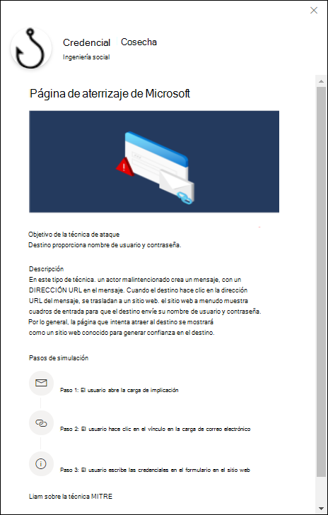
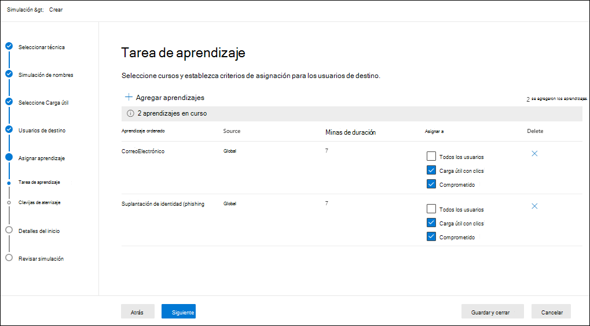

# Automatización de la simulación para el aprendizaje de simulación de ataques

**Se aplica a** [Microsoft Defender para Office 365 plan 2](defender-for-office-365.md)

Para obtener información de introducción sobre el aprendizaje de simulación de ataques, consulta [Introducción al aprendizaje de simulación de ataques](attack-simulation-training-get-started.md).

Para crear una automatización de simulación, siga estos pasos:

1. En el portal Microsoft 365 Defender en <https://security.microsoft.com/>, vaya a **Correo electrónico &** \>  \> la pestaña Aprendizaje de simulación de **ataques Simulación de** simulación.

   Para ir directamente a la pestaña **Simulation automations** , use <https://security.microsoft.com/attacksimulator?viewid=simulationautomation>.

2. En la **pestaña Automatización de Simulation** , seleccione  **Crear automatización**.

   

3. Se abrirá el Asistente para creación. El resto de este artículo describe las páginas y la configuración que contienen.

> [!NOTE]
> En cualquier momento durante el asistente para la creación de simulación, puede hacer clic en Guardar y cerrar para guardar el progreso y continuar configurando la simulación más adelante. La simulación incompleta tiene el **valor de Estado** **Borrador** en la **ficha Simulaciones** . Puede elegir dónde lo dejó seleccionando la simulación y haciendo clic en  **Edite** simulation.## Name y describa la simulación.

## Nombre y descripción de la automatización de simulación

En la **página Nombre de** automatización, configure las siguientes opciones:

- **Nombre**: escriba un nombre descriptivo único para la simulación.
- **Descripción**: escriba una descripción detallada opcional para la simulación.

Cuando termine, haga clic en **Siguiente**.

## Seleccionar una o varias técnicas de ingeniería social

En la página Seleccionar técnicas de ingeniería **social** , seleccione una o varias de las técnicas de ingeniería social disponibles, que se han seleccionado en el marco de&[CK® de MITRE ATT](https://attack.mitre.org/techniques/enterprise/). Hay diferentes cargas disponibles para distintas técnicas. Las siguientes técnicas de ingeniería social están disponibles:

- **Recolección de credenciales**: intenta recopilar credenciales llevando a los usuarios a un sitio web de aspecto conocido con cuadros de entrada para enviar un nombre de usuario y una contraseña.
- **Datos adjuntos de malware**: agrega datos adjuntos malintencionados a un mensaje. Cuando el usuario abre los datos adjuntos, se ejecuta código arbitrario que ayudará al atacante a poner en peligro el dispositivo del destino.
- **Vínculo en datos adjuntos**: un tipo de híbrido de recolección de credenciales. Un atacante inserta una dirección URL en un archivo adjunto de correo electrónico. La dirección URL dentro de los datos adjuntos sigue la misma técnica que la recolección de credenciales.
- **Vínculo a malware**: ejecuta código arbitrario desde un archivo hospedado en un servicio de uso compartido de archivos conocido. El mensaje enviado al usuario contendrá un vínculo a este archivo malintencionado. Abrir el archivo y ayudar al atacante a poner en peligro el dispositivo del destino.
- **Dirección URL de** unidad por: la dirección URL malintencionada del mensaje lleva al usuario a un sitio web familiar que ejecuta o instala código en el dispositivo del usuario de forma silenciosa.

Si hace **clic en el** vínculo Ver detalles de la descripción, se abrirá un desplegable de detalles que describe la técnica y los pasos de simulación que resultan de la técnica.

Cuando termine, haga clic en **Siguiente**.

## Seleccionar cargas

En la **página Seleccionar cargas** , seleccione una de las siguientes opciones:

- **Selección manual**
- **Randomize**

Si selecciona **Randomize**, no hay nada que configurar en esta página, por lo que haga clic **en Siguiente** para continuar.

Si selecciona **Manualmente,** debe seleccionar una o más cargas de la lista. Se muestran los siguientes detalles para ayudarle a elegir:

- **Nombre de carga**
- **Técnica**: debe seleccionar al menos una carga por técnica seleccionada en la página anterior.
- **Idioma**: el idioma del contenido de carga. El catálogo de carga útil (global) de Microsoft proporciona cargas en más de 10 idiomas que también se pueden filtrar.
- **Tasa de clics**: cuántas personas han hecho clic en esta carga.
- **Tasa de compromiso predicho**: datos históricos de la carga en Microsoft 365 que predice el porcentaje de personas que se verán comprometidas por esta carga.
- **Las simulaciones iniciadas** cuentan el número de veces que se usó esta carga en otras simulaciones.

En el icono  **Cuadro** de búsqueda, puede escribir parte del nombre de carga y presionar Entrar para filtrar los resultados.

Si hace clic **en Filtrar**, estarán disponibles los siguientes filtros:

- **Complejidad**: se calcula en función del número de indicadores de la carga útil que indican un posible ataque (errores ortográficos, urgencia, etc.). Más indicadores son más fáciles de identificar como un ataque e indican menor complejidad. Los valores disponibles son los siguientes:
  - **Baja**
  - **Media**
  - **Alta**
- **Source**: indica si la carga se creó en la organización o si forma parte del catálogo de carga preexistnte de Microsoft. Los valores válidos son:
  - **Global**
  - **Espacio empresarial**
  - **Todo**
- **Idioma**: los valores disponibles **son: inglés****, español****, alemán**, **japonés, francés****, portugués****,** neerlandés **, italiano****, sueco****, chino** **(** simplificado), **noruego Bokmål****, polaco****, ruso****, finlandés****,** **coreano, turco****, húngaro****, hebreo**, **tailandés**, **árabe**, **vietnamita****, eslovaco**, **griego**, **indonesio**, **rumano**, **esloveno**, **croata**, **catalán** y **otros**.
- **Agregar etiquetas**
- **Filtrar por** tema: Los valores disponibles **son: Activación** de la **cuenta, Verificación** de **cuenta,** Facturación **, Limpiar** **correo, Documento** recibido, **Gastos**, **Fax****, Informe** de finanzas, **Mensajes** entrantes **, Factura**, **Elementos** recibidos **, Alerta** de inicio de sesión, **Correo** **recibido, Contraseña**, **Pago**, **Nómina**, **Oferta** **personalizada, Cuarentena**, **Trabajo remoto**, **Mensaje de revisión**, **Actualización de seguridad**, **Servicio** suspendido, **Firma** requerida, **Actualizar almacenamiento de buzones Comprobar buzón** **de correo**, Correo de voz y **Otros**.
- **Filtro por** marca: Los valores disponibles son: **American Express**, **Capital One**, **DHL**, **DocuSign**, **Dropbox**, **Facebook**, **First American**, **Microsoft**, **Netflix**, **Scotiabank**, **SendGrid**, **Stewart Title**, **Tesco**, **Wells Fargo**, **Syrinx Cloud** y **Other**.
- **Filtro por** sector: Los valores disponibles **son: Banca****, Servicios** empresariales **, Servicios** de **consumo, Educación****, Energía****, Construcción**, **Consultoría****, Servicios** financieros, **Gobierno**, **Hospitalidad**, **Seguros**, **Legal**, **Servicios de** **mensajería, IT**, **Salud**, **Fabricación**, **Retail**, **Telecomunicaciones**, **Bienes** raíces, y **Otros**.
- **Evento actual**: los valores disponibles son **Sí** o **No**.
- **Polémico**: los valores disponibles **son Sí** o **No**.

Cuando haya terminado de configurar los filtros, haga clic **en Aplicar**, **Cancelar** o **Borrar filtros**.

Si selecciona una carga de la lista haciendo clic en el nombre, los detalles sobre la carga se muestran en un desplegable:

- La **pestaña Información** general contiene un ejemplo y otros detalles sobre la carga.
- La **pestaña Simulaciones iniciadas** contiene el nombre **de la simulación**, la tasa de **clics**, **la velocidad comprometida** y la **acción**.

Cuando termine, haga clic en **Siguiente**.

## Usuarios de destino

En la **página Usuarios de** destino, seleccione quién recibirá la simulación. Configure una de las siguientes opciones:

- **Incluir todos los usuarios de la organización**: los usuarios afectados se muestran en listas de 10. Puede usar los botones **Siguiente** **y Anterior** directamente debajo de la lista de usuarios para desplazarse por la lista. También puede usar el icono  **Icono** de búsqueda en la página para buscar usuarios afectados.
- **Incluir solo usuarios y grupos específicos**: elija una de las siguientes opciones:
  -  **Agregar usuarios**: **en el menú** desplegable Agregar usuarios que aparece, puede encontrar usuarios y grupos en función de los siguientes criterios:
    - **Usuarios o grupos**: en el icono  **Busque usuarios y grupos** en el cuadro, puede escribir parte del nombre  o la  dirección de correo electrónico del usuario o grupo y, a continuación, presione ENTRAR. Puede seleccionar algunos o todos los resultados. Cuando haya terminado, haga clic **en Agregar x usuarios**.

      > [!NOTE]
      > Al hacer **clic en el** botón Agregar filtros para volver a las opciones **Filtrar** usuarios por categorías, se borrarán los usuarios o grupos seleccionados en los resultados de búsqueda.

    - **Filtrar usuarios por categorías**: seleccione entre ninguna, algunas o todas las opciones siguientes:
      - **Grupos de usuarios sugeridos**: seleccione entre los siguientes valores:
        - **Todos los grupos de usuarios sugeridos**
        - **Usuarios no dirigidos por una simulación en los últimos tres meses**
        - **Reincidentes**
      - **Departamento**: use las siguientes opciones:
        - **Búsqueda**: en el icono  **En el cuadro** Buscar por departamento, puede escribir parte del valor departamento y, a continuación, presionar Entrar. Puede seleccionar algunos o todos los resultados.
        - Seleccionar **todo el departamento**
        - Seleccione los valores de Departamento existentes.
      - **Título**: use las siguientes opciones:
        - **Búsqueda**: en el icono  **Busque por cuadro Título** , puede escribir parte del valor Título y, a continuación, presione ENTRAR. Puede seleccionar algunos o todos los resultados.
        - Seleccionar **todo el título**
        - Seleccione los valores de Título existentes.

      

      Después de identificar los criterios, los usuarios afectados se muestran en la  sección Lista de usuarios que aparece, donde puede seleccionar algunos o todos los destinatarios detectados.

      Cuando haya terminado, haga clic en **Aplicar(x)** y, a continuación, haga clic **en Agregar usuarios x**.

  De vuelta en la **página Principal de los usuarios de** destino, puede usar el icono  **Cuadro** de búsqueda para buscar usuarios afectados. También puede hacer clic en  **Eliminar** para quitar usuarios específicos.

-  **Importar**: en el cuadro de diálogo que se abre, especifique un archivo CSV que contenga una dirección de correo electrónico por línea.

  Después de encontrar una selección del archivo CSV, la lista de usuarios se importa y se muestra en la **página Usuarios dirigidos** . Puede usar el icono  **Cuadro** de búsqueda para buscar usuarios afectados. También puede hacer clic en  **Eliminar** para quitar usuarios específicos.

Cuando termine, haga clic en **Siguiente**.

## Asignar formación

En la **página Asignar aprendizaje** , puede asignar cursos para la simulación. Se recomienda asignar formación para cada simulación, ya que los empleados que pasan por el aprendizaje son menos propensos a ataques similares. Estas son las opciones de configuración disponibles:

- **Seleccionar preferencia de contenido de aprendizaje**: elija una de las siguientes opciones:
  - **Experiencia de aprendizaje de Microsoft**: este es el valor predeterminado que tiene las siguientes opciones asociadas para configurar:
    - Seleccione una de las siguientes opciones:
      - **Asignarme formación**: este es el valor predeterminado y recomendado. Asignamos formación en función de los resultados de simulación y aprendizaje anteriores de un usuario, y puede revisar las selecciones en los pasos siguientes del asistente.
      - **Seleccione los cursos y** módulos de aprendizaje: si selecciona este valor, podrá ver el contenido recomendado, así como todos los cursos y módulos disponibles en el siguiente paso del asistente.
    - **Fecha de vencimiento**: elija uno de los siguientes valores:
      - **30 días después de que finalice la simulación**: este es el valor predeterminado.
      - **15 días después de que finalice la simulación**
      - **7 días después de que finalice la simulación**
  - **Redirigir a una dirección URL personalizada**: este valor tiene las siguientes opciones asociadas para configurar:
    - **Dirección URL de aprendizaje** personalizada (obligatorio)
    - **Nombre de aprendizaje personalizado** (obligatorio)
    - **Descripción del aprendizaje personalizado**
    - **Duración del aprendizaje personalizado (en minutos):** El valor predeterminado es 0, lo que significa que no hay una duración especificada para el aprendizaje.
    - **Fecha de vencimiento**: elija uno de los siguientes valores:
      - **30 días después de que finalice la simulación**: este es el valor predeterminado.
      - **15 días después de que finalice la simulación**
      - **7 días después de que finalice la simulación**
  - **Sin formación**: si selecciona este valor, la única opción de la página es el botón  Siguiente que le llevará a la página [**De aterrizaje**](#landing-page).

### Asignación de aprendizaje

> [!NOTE]
> La **página Asignación de** aprendizaje solo está disponible si seleccionó **Experiencia de aprendizaje de Microsoft** \> **Seleccione** los cursos y módulos de aprendizaje en la página anterior.

En la **página Asignación de** aprendizaje, seleccione los cursos que desea agregar a la simulación haciendo clic en  **Agregar cursos**.

En el **control desplegable** Agregar aprendizaje que aparece, puede seleccionar los cursos que se van a usar en las siguientes pestañas disponibles:

- **Ficha** Recomendada: muestra los entrenamientos integrados recomendados en función de la configuración de simulación. Estos son los mismos cursos que se habrían asignado si seleccionaste Asignar **aprendizaje para mí** en la página anterior.
- **Pestaña Todos los entrenamientos** : muestra todos los cursos integrados que están disponibles.

  Se muestra la siguiente información para cada aprendizaje:

  - **Nombre de la formación**
  - **Source**: el valor es **Global**.
  - **Duración (minutos)**
  - **Vista** previa: haga clic en **el botón Vista** previa para ver el aprendizaje.

  En el icono  **Cuadro** de búsqueda, puede escribir parte del nombre del aprendizaje y presionar Entrar para filtrar los resultados en la pestaña actual.

  Selecciona todos los cursos que quieras incluir en la pestaña actual y, a continuación, haz clic en **Agregar**.

De vuelta en la **página principal de la asignación de** aprendizaje, se muestran los entrenamientos seleccionados. Se muestra la siguiente información para cada aprendizaje:

- **Nombre de la formación**
- **Source**
- **Duración (minutos)**

Para cada aprendizaje de la lista, debe seleccionar quién obtiene el aprendizaje seleccionando valores en la columna **Asignar a** :

- **Todos los usuarios**

  o uno o ambos de los siguientes valores:

- **Carga clicked**
- **Comprometida**

Si no quieres usar un aprendizaje que se muestra, haz clic en  **Eliminar**.

Cuando termine, haga clic en **Siguiente**.

### Página de aterrizaje

En la **página Página de** aterrizaje, se configura la página web a la que se va a llevar el usuario si abre la carga en la simulación.

- **Seleccionar preferencia de página de aterrizaje**: Los valores disponibles dependen de las selecciones anteriores en la página [Seleccionar cargas](#select-payloads) , como se describe en la tabla siguiente:

   

  ****

  |Selección en la página Seleccionar cargas|Valores disponibles para Seleccionar preferencia de página de aterrizaje|
  |---|---|
  |Selección manual|Usar la página de aterrizaje predeterminada de Microsoft 
 Crear su propia página de aterrizaje 
 Usar una dirección URL personalizada 
 **Nota**: El **valor Usar una dirección URL** personalizada no está disponible si seleccionó previamente Datos [adjuntos](#select-one-or-more-social-engineering-techniques) de **malware** o Vincular a **malware** en la página Seleccionar técnicas de ingeniería social.|
  |Randomize|Usar la página de aterrizaje predeterminada de Microsoft|
  |

  En la siguiente lista **se** describen los valores de preferencia seleccionar página de aterrizaje disponibles y su configuración asociada:

  - **Use la página de aterrizaje predeterminada de Microsoft**. Este es el valor predeterminado y da como resultado una acción de indicador de carga, logotipo y plantilla predeterminada de Microsoft que se aplica a todas las cargas.

    Debe configurar las siguientes opciones adicionales en la página **Página de** aterrizaje:

    - **Seleccionar diseño de página de aterrizaje**: seleccione una de las 5 plantillas de página de aterrizaje disponibles.
    - **Agregar logotipo****: haga clic** en Examinar para buscar y seleccionar un archivo .png, .jpeg o .gif para agregar a todas las cargas seleccionadas por Microsoft. Para quitar el logotipo, haga clic en **Quitar**.
    - **Indicadores de carga**: esta configuración no está disponible si seleccionó previamente Datos adjuntos de **malware** o **Vincular a malware** en la página [Seleccionar técnicas de ingeniería](#select-one-or-more-social-engineering-techniques) social.

      Seleccione **Agregar indicadores de carga al correo electrónico** para ayudar a los usuarios a aprender a identificar mensajes de suplantación de identidad.

    Puede obtener una vista previa de los resultados haciendo clic en el **botón Abrir panel de vista previa** en el centro de la página. En el menú desplegable de vista previa que aparece, puedes usar **Seleccionar carga para** obtener una vista previa para ver cómo es cada carga.

  - **Cree su propia página de aterrizaje**: este valor da como resultado una acción de indicador de carga única que se aplica a las cargas seleccionadas.

    Debe configurar las siguientes opciones adicionales en la página **Página de** aterrizaje:

    - **Indicadores de carga**: esta configuración no está disponible si seleccionó previamente Datos adjuntos de **malware** o **Vincular a malware** en la página [Seleccionar técnicas de ingeniería](#select-one-or-more-social-engineering-techniques) social.

      Seleccione **Agregar indicadores de carga al correo electrónico** para ayudar a los usuarios a aprender a identificar mensajes de suplantación de identidad.

    - Contenido de la página: hay dos pestañas disponibles:

      - **Texto**: hay disponible un editor de texto enriquecido para crear la página de aterrizaje. Además de la configuración típica de fuente y formato, están disponibles las siguientes opciones:
        - **Etiqueta dinámica**: seleccione entre las siguientes etiquetas:
          - **Username**
          - **Nombre del remitente de correo electrónico**
          - **Dirección de correo electrónico del remitente**
          - **Asunto del correo electrónico**
          - **Contenido de correo electrónico**
        - **Usar de forma predeterminada**: seleccione una de las 5 plantillas de página de aterrizaje disponibles para empezar. Puede modificar el texto y el diseño en el área de edición. Para restablecer la página de aterrizaje al texto predeterminado y al diseño de la plantilla, haga clic **en Restablecer como predeterminado**.
        - **Vínculo de aprendizaje**: en el cuadro de diálogo Dirección **URL** de aprendizaje de nombre que aparece, escriba un título de vínculo para  el vínculo de aprendizaje y, a continuación, haga clic en Confirmar para agregar el vínculo a la página de aterrizaje.
      - **Código**: puede ver y modificar el código HTML directamente.

      Puede obtener una vista previa de los resultados haciendo clic en el **botón Abrir panel de vista previa** en el centro de la página. En el menú desplegable de vista previa que aparece, puedes usar **Seleccionar carga para** obtener una vista previa para ver cómo es cada carga.

  - **Usar una dirección URL personalizada**: agregue la dirección URL en el cuadro **Escribir la dirección URL** de la página de aterrizaje personalizada que aparece. No hay otras opciones disponibles en la página.

Cuando termine, haga clic en **Siguiente**.

## Seleccionar notificación de usuario final

En la **página Seleccionar notificación de usuario final** , seleccione una de las siguientes opciones de notificación:

- **No entregar notificaciones**: haga clic **en Continuar** en el cuadro de diálogo de alerta que aparece. Si seleccionas esta opción, te llevaremos a la página [programación de Simulation](#simulation-schedule) al hacer clic en **Siguiente**.

- **Notificación predeterminada de Microsoft (recomendada):** La siguiente configuración adicional está disponible en la página:
  - **Seleccionar idioma predeterminado**: los valores disponibles son: chino **(simplificado),** chino **(tradicional),****inglés, francés****, alemán****, italiano****, japonés****, coreano****, portugués****, ruso****,** **español** y **neerlandés**.
  - De forma predeterminada, la única notificación disponible para seleccionar es **la notificación de refuerzo positivo de Microsoft**. La siguiente información está disponible para la notificación:
    - **Notificaciones** (nombre): el valor es notificación **de refuerzo positivo predeterminada de Microsoft**.
    - **Idioma**: si la notificación contiene varias traducciones, los dos primeros idiomas se muestran directamente. Para ver los idiomas restantes, mantenga el mouse sobre el icono numérico (por ejemplo, **+10**).
    - **Tipo**: el valor es **Refuerzo positivo**.
    - **Preferencias de** entrega: seleccione entre los siguientes valores:
      - **No entregar**
      - **Entrega después de que finalice la campaña**
      - **Entregar durante la campaña**
    - **Entregar a**: El valor no **es aplicable**.
    - **Acciones**: si hace clic en el icono  **Icono** ver, aparece **la página Revisar** notificación con la siguiente información:
      - **Pestaña Vista** previa: ver el mensaje de notificación. Para ver el mensaje en diferentes idiomas, use el **cuadro Seleccionar idioma** .
      - **Ficha Detalles** : Ver detalles sobre la notificación:
        - **Descripción de notificación**
        - **Origen**: para las notificaciones integradas, el valor es **Global**. Para las notificaciones personalizadas, el valor es **Tenant**.
        - **Tipo de notificación**
        - **Modificado por**
        - **Última modificación**

        Cuando haya terminado, haga clic en **Cerrar**.

  Si seleccionas esta opción, te llevaremos a la página [programación de Simulation](#simulation-schedule) al hacer clic en **Siguiente**.

- **Notificaciones de usuario final personalizadas**: al hacer clic en **Siguiente, se** le envía a  la página Notificación de refuerzo positivo, tal como se describe en la siguiente sección, donde puede seleccionar entre notificaciones existentes o crear nuevas notificaciones.

Cuando termine, haga clic en **Siguiente**.

### Notificación de refuerzo positivo

La **página Notificación de refuerzo** positivo solo está disponible si seleccionó Notificaciones **personalizadas del** usuario final en la página anterior.

- **Preferencias de** entrega: seleccione uno de los siguientes valores:
  - **No entregar**
  - **Entregar después de que el usuario informa de que finaliza una campaña y suplantación de identidad**
  - **Entregar inmediatamente después de que el usuario informe de una suplantación de identidad**

- **Seleccionar una notificación de refuerzo positivo**: puede seleccionar una notificación existente o crear una nueva notificación de tipo **Notificación** de refuerzo positivo para usar:
  - Para seleccionar una notificación existente, haga clic en el área en blanco junto al nombre de la notificación. Si hace clic en el nombre de la notificación, la notificación se selecciona y aparece un menú desplegable de vista previa. Para anular la selección de la notificación, desactive la casilla situada junto a la notificación.
  - Para buscar una notificación existente, use el icono  **Cuadro** de búsqueda para buscar el nombre.
  - Para crear una nueva notificación, haga clic en  **Crear nuevo**.
  - Para modificar una notificación personalizada existente, selecciónelo y, a continuación, haga clic en  **Editar notificación**.

#### Crear nuevo asistente para notificaciones

Si ha hecho clic en  **Crear nuevo** en la página **Notificación de refuerzo** positivo, se abre un asistente para creación de notificaciones.

Los pasos de creación son idénticos como se describe [en Crear notificaciones de usuario final](attack-simulation-traning-end-user-notifications.md#create-end-user-notifications).

> [!NOTE]
> En la **página Definir detalles** , asegúrese de seleccionar el valor **Notificación de refuerzo positivo** para **Seleccionar tipo de notificación**. No selecciones Notificación **de Simulación**.

Cuando haya terminado, volverá a la página Notificación de refuerzo positivo,  donde la notificación que acaba de crear aparecerá ahora en la lista Seleccionar una notificación **de refuerzo** positiva.

- Para crear una nueva notificación, haga clic en .
- Para modificar la notificación o agregar traducciones adicionales, seleccione la notificación de la lista y, a continuación, haga clic en  **Edit notification** to start the notification wizard as previously described (with most values already filled in). Si la notificación ya tiene traducciones para los 12 idiomas admitidos, no puede agregar más traducciones.

Seleccione la notificación que desea usar y, a continuación, haga clic en **Siguiente**.

## Programación de simulación

En la **página Programación de** Simulación, seleccione uno de los siguientes valores:

- **Randomized**: todavía necesita seleccionar la programación en la página siguiente, pero las simulaciones se iniciarán en momentos aleatorios con la programación.
- **Fixed**

Cuando termine, haga clic en **Siguiente**.

## Detalles de programación

Lo que ve en la **página Detalles de programación** depende de si seleccionó **Randomized** o **Fixed** en la página anterior.

- **Randomized**: las siguientes opciones de configuración están disponibles:
  - **Sección inicio de** simulación: Configure la siguiente configuración:
    - **Seleccione la fecha desde la que desea que comiencen las simulaciones**
  - **Sección Ámbito de simulación** : Configure las siguientes opciones:
    - **Seleccione los días de la semana en los que pueden** iniciarse las simulaciones: Seleccione uno o más días de la semana.
    - **Escriba el número máximo de simulaciones** que se pueden iniciar entre las fechas de inicio y finalización: escriba un valor de 1 a 10.
    - **Aleatorizar las horas de envío**: seleccione esta configuración para aleatorizar las horas de envío.
  - **Sección final de** simulación: Configure la siguiente configuración:
    - **Seleccione la fecha en la que desea que finalicen las simulaciones**

- **Corregido**: La siguiente configuración está disponible:
  - **Sección inicio de** simulación: Configure la siguiente configuración:
    - **Seleccione la fecha desde la que desea que comiencen las simulaciones**
  - **Sección Periodicidad** de simulación: Configure las siguientes opciones:
    - **Seleccione si desea que las simulaciones se inicien semanalmente o mensualmente**: Seleccione uno de los siguientes valores:
      - **Semanalmente**: este es el valor predeterminado.
      - **Mensualmente**
    - **Escriba con qué frecuencia en semanas desea que se** repitan las simulaciones: Escriba un valor de 1 a 99 semanas.
    - **Seleccione el día de la semana desde el que desea que comiencen las simulaciones**
  - **Sección final de** simulación: Seleccione uno de los siguientes valores:
    - **Seleccione la fecha en la que desea que finalicen las simulaciones**
    - **Escriba el número de repeticiones de las simulaciones que se ejecutarán antes** de finalizar: Escriba un valor de 1 a 10.

Cuando termine, haga clic en **Siguiente**.

## Detalles del inicio

En la **página Detalles del** inicio, configure las siguientes opciones adicionales para la automatización:

- **Use cargas únicas en simulaciones dentro de una automatización**: de forma predeterminada, esta configuración no está seleccionada.
- **Infractores reincidentes de** destino: de forma predeterminada, esta configuración no está seleccionada. Si lo selecciona, configure la siguiente configuración que aparece:
  - **Escriba el número máximo de veces que un** usuario puede ser dirigido dentro de esta automatización: escriba un valor de 1 a 10.
- **Enviar correo electrónico de simulación en función** de la configuración de zona horaria actual del usuario desde Outlook aplicación web: de forma predeterminada, esta configuración no está seleccionada.
- **Mostrar la página de datos intersticiales** de la técnica de unidad por: esta configuración solo está disponible si seleccionó dirección **URL** de unidad por en la página Seleccionar técnicas **[de ingeniería social](#select-one-or-more-social-engineering-techniques)** . De forma predeterminada, la configuración está activa ().

## Revisar la automatización de simulación

En la **página Revisar automatización de simulación** , puede revisar los detalles de la automatización de la simulación.

Puede seleccionar **Editar** en cada sección para modificar la configuración dentro de la sección. También puede hacer clic en **Volver atrás** o seleccionar la página específica del asistente.

Cuando haya terminado, haga clic en **Enviar**.
