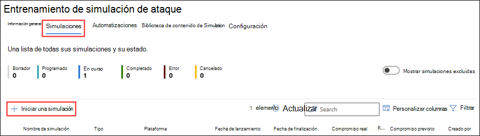
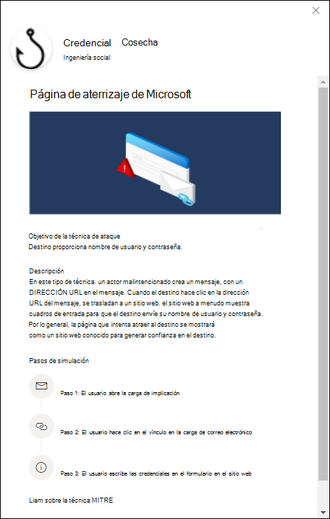
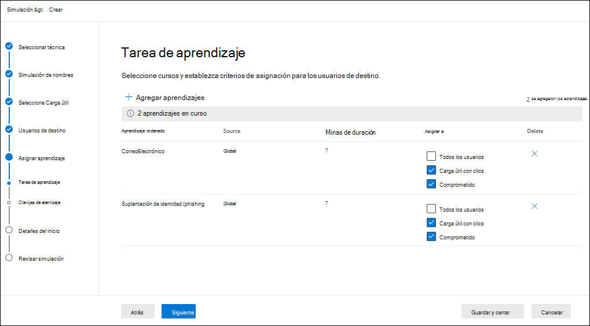
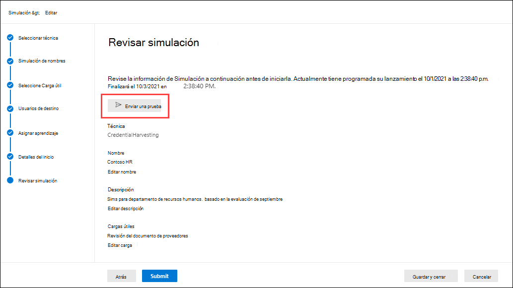

# Simular un ataque de suplantación de identidad en Defender para Office 365

**Se aplica a** [Microsoft Defender para Office 365 plan 2](defender-for-office-365.md)

El aprendizaje de simulación de ataques en Microsoft Defender Office 365 plan 2 o Microsoft 365 E5 permite ejecutar simulaciones de ciberataque benignas en su organización. Estas simulaciones prueban sus directivas y prácticas de seguridad, así como capacitan a sus empleados para aumentar su concienciación y disminuir su susceptibilidad a los ataques. En este artículo se explica cómo crear un ataque de suplantación de identidad simulado mediante el entrenamiento de simulación de ataques.

Para obtener información de introducción sobre el aprendizaje de simulación de ataques, consulta [Introducción al aprendizaje de simulación de ataques.](attack-simulation-training-get-started.md)

Para iniciar un ataque de suplantación de identidad simulada, siga estos pasos:

1. En el portal Microsoft 365 Defender, vaya a La pestaña Simulaciones de aprendizaje de simulación de & de colaboración de <https://security.microsoft.com/>  \>  \>  correo electrónico.

   Para ir directamente a la **pestaña Simulaciones,** use <https://security.microsoft.com/attacksimulator?viewid=simulations> .

2. En la **pestaña Simulaciones,** seleccione  **Inicie una simulación**.

   

3. Se abrirá el Asistente para creación de simulación. El resto de este artículo describe las páginas y la configuración que contienen.

> [!NOTE]
> En cualquier momento durante el asistente  para la creación de simulación, puede hacer clic en Guardar y cerrar para guardar el progreso y continuar configurando la simulación más adelante. La simulación incompleta tiene el **valor de Estado** **Borrador** en la **ficha Simulaciones.** Puede elegir dónde lo dejó seleccionando la simulación y haciendo clic  **Editar** simulación.

## Seleccionar una técnica de ingeniería social

En la **página Seleccionar** técnica, seleccione una técnica de ingeniería social disponible, que se ha seleccionado en el marco de trabajo&[CK ® MITRE ATT](https://attack.mitre.org/techniques/enterprise/). Hay diferentes cargas disponibles para distintas técnicas. Las siguientes técnicas de ingeniería social están disponibles:

- **Recolección de credenciales:** intenta recopilar credenciales llevando a los usuarios a un sitio web de aspecto conocido con cuadros de entrada para enviar un nombre de usuario y una contraseña.
- **Datos adjuntos de malware:** agrega datos adjuntos malintencionados a un mensaje. Cuando el usuario abre los datos adjuntos, se ejecuta código arbitrario que ayudará al atacante a poner en peligro el dispositivo del destino.
- **Vínculo en datos adjuntos:** un tipo de híbrido de recolección de credenciales. Un atacante inserta una dirección URL en un archivo adjunto de correo electrónico. La dirección URL dentro de los datos adjuntos sigue la misma técnica que la recolección de credenciales.
- **Vínculo a malware:** ejecuta código arbitrario desde un archivo hospedado en un servicio de uso compartido de archivos conocido. El mensaje enviado al usuario contendrá un vínculo a este archivo malintencionado. Abrir el archivo y ayudar al atacante a poner en peligro el dispositivo del destino.
- **Dirección URL de** unidad por: la dirección URL malintencionada del mensaje lleva al usuario a un sitio web familiar que ejecuta o instala código de forma silenciosa en el dispositivo del usuario.

Si hace clic **en** el vínculo Ver detalles de la descripción, se abrirá un desplegable de detalles que describe la técnica y los pasos de simulación que resultan de la técnica.

Cuando termine, haga clic en **Siguiente**.

## Nombre y descripción de la simulación

En la **página Simulación** de nombre, configure las siguientes opciones:

- **Nombre:** escriba un nombre descriptivo único para la simulación.
- **Descripción:** escriba una descripción detallada opcional para la simulación.

Cuando termine, haga clic en **Siguiente**.

## Seleccionar una carga

En la **página Seleccionar carga,** debe seleccionar una carga existente de la lista o crear una nueva carga.

Los siguientes detalles se muestran en la lista de cargas que le ayudarán a elegir:

- **Nombre**
- **Language:** el idioma del contenido de carga. El catálogo de carga útil (global) de Microsoft proporciona cargas en más de 10 idiomas que también se pueden filtrar.
- **Tasa de clics:** cuántas personas han hecho clic en esta carga.
- **Tasa de compromiso predicho:** datos históricos de la carga en Microsoft 365 que predice el porcentaje de personas que se verán comprometidas por esta carga.
- **Las simulaciones iniciadas** cuentan el número de veces que se usó esta carga en otras simulaciones.

En el  **Cuadro** de búsqueda, puede escribir parte del nombre de carga y presionar Entrar para filtrar los resultados.

Si hace clic **en Filtrar,** estarán disponibles los siguientes filtros:

- **Complejidad:** se calcula en función del número de indicadores de la carga útil que indican un posible ataque (errores ortográficos, urgencia, etc.). Más indicadores son más fáciles de identificar como un ataque e indican menor complejidad. Los valores disponibles son los siguientes:
  - **Baja**
  - **Media**
  - **Alta**
- **Source:** indica si la carga se creó en la organización o si forma parte del catálogo de carga preexistnte de Microsoft. Los valores admitidos son:
  - **Global** (integrado)
  - **Inquilino** (personalizado)
  - **Todo**
- **Idioma:** los valores disponibles son: **chino (simplificado),** chino **(tradicional),** inglés **,** francés **,** alemán **,** **italiano,** **japonés,** **coreano,** **portugués,** **ruso,** **español** y **neerlandés.**
- **Agregar etiquetas**
- **Filtrar por** **tema:** Los valores disponibles son: Activación de la cuenta **,** Verificación de cuenta **,** Facturación **,** Limpiar correo **,** Documento recibido , **Gastos**, **Fax** **,** Informe de finanzas , **Mensajes** entrantes **,** Factura , **Elementos** recibidos **,** Alerta de inicio de sesión , **Correo** recibido **,** Contraseña **,** **Pago**, Nómina , **Oferta** personalizada , **Cuarentena**, **Trabajo remoto**, **Mensaje de revisión,** Actualización de **seguridad,** **Servicio** suspendido, **Firma** requerida, Actualizar almacenamiento de buzones De correo Detección de **buzones** de **correo,** Correo de voz y **Otros**.
- **Filtro por** marca: Los valores disponibles son: **American Express**, Capital **One**, **DHL**, **DocuSign**, **Dropbox**, **Facebook**, **First American**, **Microsoft**, **Netflix**, **Scotiabank**, **SendGrid**, **Stewart Title**, **Tesco**, **Wells Fargo**, **Syrinx Cloud** y **Other**.
- **Filtro por** industria: Los valores disponibles **son:** Banca **,** Servicios empresariales **,** Servicios de consumo **,** Educación **,** Energía **,** Construcción , **Consultoría** **,** Servicios financieros , **Gobierno**, **Hospitalidad**, **Seguros**, **Legal**, **Servicios** de mensajería , **IT**, **Salud**, **Fabricación**, **Retail**, **Telecom**, **Bienes raíces**, y **Otros**.
- **Evento actual:** los valores disponibles **son Sí** o **No**.
- **Polémico:** los valores disponibles **son Sí** o **No**.

Cuando haya terminado de configurar los filtros, haga clic **en Aplicar,** **Cancelar** o **Borrar filtros**.

Si selecciona una carga de la lista, los detalles sobre la carga se muestran en un menú desplegable:

- La **pestaña Información** general contiene un ejemplo y otros detalles sobre la carga.
- La **pestaña Simulaciones iniciadas** contiene el nombre **de simulación**, la tasa **de clics,** la **velocidad comprometida** y la **acción**.

Si selecciona una carga de la lista haciendo clic en el nombre, un icono Enviar una carga  **Enviar un botón de** prueba aparece en la página principal, donde puede enviar una copia del correo electrónico de carga a usted mismo (el usuario que ha iniciado sesión actualmente) para su inspección.

Para crear su propia carga, haga clic  **Crear una carga**. Para obtener más información, vea [Create custom payloads for Attack simulation training](attack-simulation-training-payloads.md).

Cuando termine, haga clic en **Siguiente**.

## Usuarios de destino

En la **página Usuarios de** destino, seleccione quién recibirá la simulación. Configure una de las siguientes opciones:

- **Incluir todos los usuarios de la organización:** los usuarios afectados se muestran en listas de 10. Puede usar los botones **Siguiente** **y Anterior** directamente debajo de la lista de usuarios para desplazarse por la lista. También puede usar el  **Icono** de búsqueda en la página para buscar usuarios afectados.
- **Incluir solo usuarios y grupos específicos:** elija una de las siguientes opciones:
  -  **Agregar usuarios:** en **el** menú desplegable Agregar usuarios que aparece, puede encontrar usuarios y grupos en función de los siguientes criterios:
    - **Usuarios o grupos:** en el  **Busque usuarios y grupos** en el cuadro,  puede escribir parte del nombre o la dirección de correo electrónico del usuario o grupo y, a continuación, presione ENTRAR.  Puede seleccionar algunos o todos los resultados. Cuando haya terminado, haga clic **en Agregar x usuarios**.

      > [!NOTE]
      > Al hacer **clic en el** botón Agregar filtros para volver a las opciones **Filtrar** usuarios por categorías, se borrarán los usuarios o grupos seleccionados en los resultados de búsqueda.

    - **Filtrar usuarios por categorías:** seleccione entre ninguna, algunas o todas las opciones siguientes:
      - **Grupos de usuarios sugeridos:** seleccione entre los siguientes valores:
        - **Todos los grupos de usuarios sugeridos**
        - **Usuarios no dirigidos por una simulación en los últimos tres meses**
        - **Reincidentes**
      - **Departamento:** use las siguientes opciones:
        - **Buscar:** en el  **En el cuadro** Buscar por departamento, puede escribir parte del valor departamento y, a continuación, presionar Entrar. Puede seleccionar algunos o todos los resultados.
        - Seleccionar **todo el departamento**
        - Seleccione los valores de Departamento existentes.
      - **Título:** use las siguientes opciones:
        - **Buscar:** en el  **Busque por cuadro Título,** puede escribir parte del valor Título y, a continuación, presione ENTRAR. Puede seleccionar algunos o todos los resultados.
        - Seleccionar **todo el título**
        - Seleccione los valores de Título existentes.

      

      Después de identificar los criterios, los  usuarios afectados se muestran en la sección Lista de usuarios que aparece, donde puede seleccionar algunos o todos los destinatarios detectados.

      Cuando haya terminado, haga clic **en Aplicar(x)** y, a continuación, haga clic **en Agregar usuarios x**.

  De vuelta en la **página Principal de los usuarios de** destino, puede usar el icono  **Cuadro** de búsqueda para buscar usuarios afectados. También puede hacer clic en  **Eliminar** para quitar usuarios específicos.

-  **Importar:** en el cuadro de diálogo que se abre, especifique un archivo CSV que contenga una dirección de correo electrónico por línea.

  Después de encontrar una selección del archivo CSV, la lista de usuarios se importa y se muestra en la **página Usuarios dirigidos.** Puede usar el icono  **Cuadro** de búsqueda para buscar usuarios afectados. También puede hacer clic en  **Eliminar** para quitar usuarios específicos.

Cuando termine, haga clic en **Siguiente**.

## Asignar formación

En la **página Asignar aprendizaje,** puede asignar cursos para la simulación. Se recomienda asignar formación para cada simulación, ya que los empleados que pasan por el aprendizaje son menos propensos a ataques similares. Estas son las opciones de configuración disponibles:

- **Seleccionar preferencia de contenido de aprendizaje:** elija una de las siguientes opciones:
  - **Experiencia de aprendizaje de Microsoft:** este es el valor predeterminado que tiene las siguientes opciones asociadas para configurar:
    - Seleccione una de las siguientes opciones:
      - **Asignarme formación:** este es el valor predeterminado y recomendado. Asignamos formación en función de los resultados de simulación y aprendizaje anteriores de un usuario, y puede revisar las selecciones en los pasos siguientes del asistente.
      - **Seleccionar cursos y** módulos de aprendizaje: si selecciona este valor, podrá ver el contenido recomendado, así como todos los cursos y módulos disponibles en el siguiente paso del asistente.
    - **Fecha de vencimiento:** elija uno de los siguientes valores:
      - **30 días después de que finalice la** simulación: este es el valor predeterminado.
      - **15 días después de que finalice la simulación**
      - **7 días después de que finalice la simulación**
  - **Redirigir a una dirección URL personalizada:** este valor tiene las siguientes opciones asociadas para configurar:
    - **Dirección URL de aprendizaje** personalizada (obligatorio)
    - **Nombre de aprendizaje personalizado** (obligatorio)
    - **Descripción del aprendizaje personalizado**
    - **Duración del aprendizaje personalizado (en minutos):** el valor predeterminado es 0, lo que significa que no hay una duración especificada para el aprendizaje.
    - **Fecha de vencimiento:** elija uno de los siguientes valores:
      - **30 días después de que finalice la** simulación: este es el valor predeterminado.
      - **15 días después de que finalice la simulación**
      - **7 días después de que finalice la simulación**
  - **Sin formación:** si selecciona este valor, la única  opción de la página es el botón Siguiente que le llevará a la página [**De aterrizaje.**](#landing-page)

### Asignación de aprendizaje

> [!NOTE]
> La **página Asignación de** aprendizaje solo está disponible si seleccionó Experiencia de aprendizaje de **Microsoft** Seleccione los cursos y módulos de aprendizaje en \>  la página anterior.

En la **página Asignación de** aprendizaje, seleccione los cursos que desea agregar a la simulación haciendo clic  **Agregar aprendizajes**.

En el **control desplegable** Agregar aprendizaje que aparece, puede seleccionar los cursos que se van a usar en las siguientes pestañas disponibles:

- **Ficha** Recomendada: muestra los entrenamientos integrados recomendados en función de la configuración de simulación. Estos son los mismos cursos que se habrían asignado si seleccionaste Asignar **aprendizaje para mí** en la página anterior.
- **Pestaña Todos los entrenamientos:** muestra todos los cursos integrados que están disponibles.

  Se muestra la siguiente información para cada aprendizaje:

  - **Nombre de la formación**
  - **Source:** el valor es **Global**.
  - **Duración (minutos)**
  - **Vista** previa: haga clic en **el botón Vista** previa para ver el aprendizaje.

  En el  **Cuadro** de búsqueda, puede escribir parte del nombre del aprendizaje y presionar Entrar para filtrar los resultados en la pestaña actual.

  Seleccione todos los entrenamientos que desee incluir en la pestaña actual y, a continuación, haga clic en **Agregar**.

De vuelta en la **página principal de la asignación de** aprendizaje, se muestran los entrenamientos seleccionados. Se muestra la siguiente información para cada aprendizaje:

- **Nombre de la formación**
- **Source**
- **Duración (minutos)**

Para cada aprendizaje de la lista, debe seleccionar quién obtiene el aprendizaje seleccionando valores en la columna **Asignar a:**

- **Todos los usuarios**

  o uno o ambos de los siguientes valores:

- **Carga clicked**
- **Comprometida**

Si no quieres usar un entrenamiento que se muestra, haz clic en  **Eliminar**.

Cuando termine, haga clic en **Siguiente**.

### Página de aterrizaje

En la **página Página de** aterrizaje, se configura la página web a la que se va a llevar el usuario si abre la carga en la simulación.

- **Seleccionar preferencia de página de aterrizaje:** los valores disponibles son:
  - **Usar la página de aterrizaje predeterminada de Microsoft:** este es el valor predeterminado que tiene las siguientes opciones asociadas para configurar:
    - **Seleccionar diseño de página de aterrizaje:** seleccione una de las plantillas disponibles.
    - **Agregar logotipo:** haga clic **en Examinar** para buscar y seleccionar un .png, .jpeg o .gif archivo.
    - **Agregar indicadores de carga al correo** electrónico: seleccione esta configuración para ayudar a los usuarios a aprender a identificar mensajes de suplantación de identidad.

    Para obtener una vista previa de los resultados, haga clic en el **botón Abrir panel** de vista previa en la parte inferior de la página.

  - **Usar una dirección URL** personalizada: si selecciona este valor, debe agregar la dirección URL en el cuadro Escriba la dirección **URL** de la página de aterrizaje personalizada que aparece. No hay otras opciones disponibles en la página.
  - **Crear su propia página de aterrizaje:** este valor tiene las siguientes opciones asociadas para configurar:
    - **Agregar indicadores de carga al correo** electrónico: seleccione esta configuración para ayudar a los usuarios a aprender a identificar mensajes de suplantación de identidad.
    - Contenido de la página: hay dos pestañas disponibles:
      - **Texto:** hay disponible un editor de texto enriquecido para crear la página de aterrizaje. Además de la configuración típica de fuente y formato, están disponibles las siguientes opciones:
        - **Etiqueta dinámica:** seleccione entre las siguientes etiquetas:
          - **Username**
          - **Nombre del remitente de correo electrónico**
          - **Dirección de correo electrónico del remitente**
          - **Asunto del correo electrónico**
          - **Contenido de correo electrónico**
        - **Usar de forma predeterminada:** seleccione una plantilla disponible para empezar. Puede modificar el texto y el diseño en el área de edición. Para restablecer la página de aterrizaje al texto predeterminado y el diseño de la plantilla, haga clic **en Restablecer a valor predeterminado**.
    - **Código:** puede ver y modificar el código HTML directamente.

    Puede obtener una vista previa de los resultados haciendo clic en el **botón Abrir panel** de vista previa en el centro de la página.

Cuando termine, haga clic en **Siguiente**.

> [!NOTE]
> Ciertas marcas comerciales, logotipos, símbolos, insignias y otros identificadores de origen reciben una protección mayor en virtud de leyes y leyes locales, estatales y federales. El uso no autorizado de estos indicadores puede someter a los usuarios a sanciones, incluidas las multas penales. Aunque no es una lista extensa, esto incluye los precintos presidencial, vicepresidenta y congresional, la CIA, el FBI, la Seguridad Social, Medicare y Medicaid, el Servicio de Ingresos Internos de estados Unidos y los Juegos Olímpicos. Más allá de estas categorías de marcas comerciales, el uso y modificación de cualquier marca comercial de terceros conlleva una cantidad inherente de riesgo. Usar sus propias marcas comerciales y logotipos en una carga sería menos arriesgado, especialmente cuando su organización permite el uso. Si tiene más preguntas sobre lo que es o no es apropiado usar al crear o configurar una carga, consulte con sus asesores legales.

## Detalles del inicio

En la **página Detalles de** inicio, elija cuándo iniciar la simulación y cuándo finalizar la simulación. Dejaremos de capturar la interacción con esta simulación después de la fecha de finalización especificada.

Estas son las opciones de configuración disponibles:

- Elija uno de los siguientes valores:
  - **Inicie esta simulación tan pronto como termine**
  - **Programar esta simulación para iniciarla más adelante:** este valor tiene las siguientes opciones asociadas para configurar:
    - **Seleccionar fecha de inicio**
    - **Seleccionar hora de inicio**
- **Configure el número de días para finalizar la simulación después** de : El valor predeterminado es 2.
- **Habilitar la entrega de zonas horarias conscientes** de la región: entregue mensajes de ataque simulados a sus empleados durante el horario laboral según su región.

Cuando termine, haga clic en **Siguiente**.

## Simulación de revisión

En la **página Revisar simulación,** puede revisar los detalles de la simulación.

Haga clic en  **Enviar un botón de** prueba para enviar una copia del correo electrónico de carga a usted mismo (el usuario que ha iniciado sesión actualmente) para su inspección.

Puede seleccionar **Editar** en cada sección para modificar la configuración dentro de la sección. También puede hacer clic en **Volver atrás** o seleccionar la página específica del asistente.

Cuando haya terminado, haga clic en **Enviar**.

