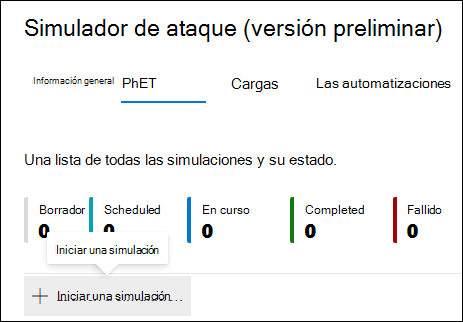
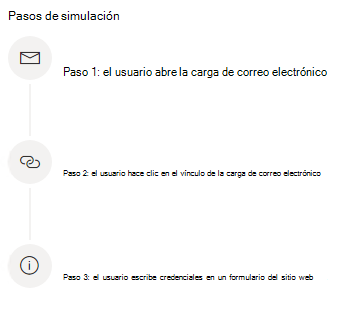
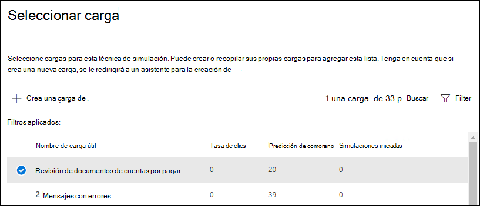
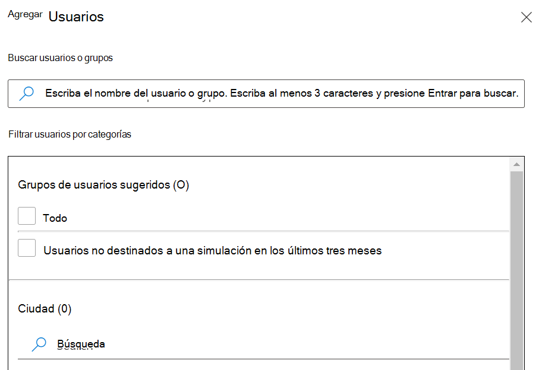
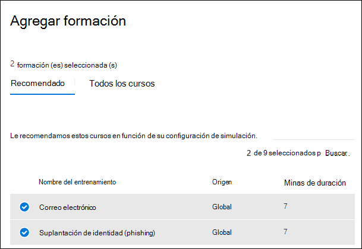

# Simular un ataque de suplantación de identidad

La formación en simulación de ataques en Microsoft Defender para Office 365 le permite ejecutar simulaciones de ciberataques benignas en su organización para probar sus directivas y prácticas de seguridad, así como entrenar a sus empleados para aumentar su concienciación y disminuir su susceptibilidad a los ataques. Este artículo le guiará a través de la creación de un ataque de suplantación de identidad simulado mediante el entrenamiento de simulación de ataques.

Para obtener información de introducción sobre el aprendizaje de simulación de ataques, consulta [Introducción al aprendizaje de simulación de ataques.](attack-simulation-training-get-started.md)

Para iniciar un ataque de suplantación de identidad simulada, abra el Centro de seguridad de [Microsoft 365,](https://security.microsoft.com/) **vaya a** Aprendizaje de simulación de ataques de colaboración de correo electrónico & y cambie a la pestaña \>  [**Simulaciones.**](https://security.microsoft.com/attacksimulator?viewid=simulations)

En **Simulaciones,** seleccione **+ Iniciar una simulación**.

> [!NOTE]
> En cualquier momento durante la creación de la simulación, puede guardar y cerrar para continuar configurando la simulación más adelante.

## Selección de una técnica de ingeniería social

Seleccione entre 4 técnicas diferentes, seleccionadas en el marco de trabajo&[MITRE ATT ® CK](https://attack.mitre.org/techniques/enterprise/). Hay diferentes cargas disponibles para diferentes técnicas:

- **Credential harvest** attempts to collect credentials by taking users to a well-known looking website with input boxes to submit a username and password.
- **Los datos adjuntos** de malware agregan datos adjuntos malintencionados a un mensaje. Cuando el usuario abre los datos adjuntos, se ejecuta código arbitrario que ayudará al atacante a poner en peligro el dispositivo del destino.
- **Vínculo en datos adjuntos** es un tipo de híbrido de recolección de credenciales. Un atacante inserta una dirección URL en un archivo adjunto de correo electrónico. La dirección URL dentro de los datos adjuntos sigue la misma técnica que la recolección de credenciales.
- **El vínculo al malware** ejecutará código arbitrario desde un archivo hospedado en un servicio de uso compartido de archivos conocido. El mensaje enviado al usuario contendrá un vínculo a este archivo malintencionado. Abrir el archivo y ayudar al atacante a poner en peligro el dispositivo del destino.
- **La dirección URL de** unidad por es donde la dirección URL malintencionada del mensaje lleva al usuario a un sitio web de aspecto familiar que ejecuta o instala código de forma silenciosa en el dispositivo del usuario.

> [!TIP]
> Al hacer clic **en Ver detalles** dentro de la descripción de cada técnica, se mostrará más información y los pasos de simulación de la técnica.
>
> 

Después de seleccionar la técnica y hacer clic en **Siguiente,** asigne a la simulación un nombre y, opcionalmente, una descripción.

## Selección de una carga

A continuación, deberá seleccionar una carga del catálogo de carga existente.

Las cargas tienen varios puntos de datos que le ayudarán a elegir:

- **La tasa de clics** cuenta cuántas personas han hecho clic en esta carga.
- **La tasa de compromiso** predicho predice el porcentaje de personas que se verán comprometidas por esta carga en función de los datos históricos de la carga en Microsoft Defender para clientes de Office 365.
- **Las simulaciones iniciadas** cuentan el número de veces que se usó esta carga en otras simulaciones.
- **La** complejidad , **disponible** a través de filtros, se calcula en función del número de indicadores dentro de la carga que apunta a que se trata de un ataque. Más indicadores llevan a una complejidad menor.
- **Source**, disponible **a** través de filtros , indica si la carga se creó en el espacio empresarial o forma parte del catálogo de carga preexistnte (global) de Microsoft.

Seleccione una carga de la lista para ver una vista previa de la carga con información adicional sobre ella.

Si quieres crear tu propia carga, lee crear una [carga para el entrenamiento de simulación de ataque.](attack-simulation-training-payloads.md)

## Identificación de audiencia

Ahora es el momento de seleccionar la audiencia de esta simulación. Puede elegir incluir todos **los usuarios de la organización** o incluir solo usuarios y grupos **específicos.**

Cuando elige incluir **solo usuarios y** grupos específicos, puede:

- **Agregue usuarios**, lo que le permite aprovechar la búsqueda de su espacio empresarial, así como las capacidades avanzadas de búsqueda y filtrado, como dirigirse a usuarios que no han sido dirigidos por una simulación en los últimos 3 meses.
  
- **Importar desde CSV** permite importar un conjunto predefinido de usuarios para esta simulación.

## Asignar formación

Se recomienda asignar formación para cada simulación, ya que los empleados que pasan por el aprendizaje son menos propensos a ataques similares.

Puede elegir que se le asigne formación o seleccionar cursos de formación y módulos usted mismo.

Seleccione la **fecha de vencimiento del entrenamiento** para asegurarse de que los empleados finalicen su formación de forma oportuna.

> [!NOTE]
> Si elige seleccionar cursos y módulos usted mismo, podrá ver el contenido recomendado, así como todos los cursos y módulos disponibles.
>
> 

En los pasos siguientes,  tendrás que agregar cursos si optas por seleccionarlo tú mismo y personalizar la página de aterrizaje del entrenamiento. Podrás obtener una vista previa de la página de aterrizaje del entrenamiento, así como cambiar el encabezado y el cuerpo de la página.

## Detalles de inicio y revisión

Ahora que todo está configurado, puede iniciar esta simulación inmediatamente o programarla para una fecha posterior. También tendrá que elegir cuándo finalizar esta simulación. Dejaremos de capturar la interacción con esta simulación más allá de la hora seleccionada.

**Habilite la entrega de zona horaria consciente de** la región para entregar mensajes de ataque simulados a sus empleados durante sus horas de trabajo en función de su región.

Una vez que haya terminado, haga clic en **Siguiente** y revise los detalles de la simulación. Haga clic **en Editar** en cualquiera de las partes para volver atrás y cambiar los detalles que necesiten cambiar. Una vez hecho esto, haga clic **en Enviar**.
