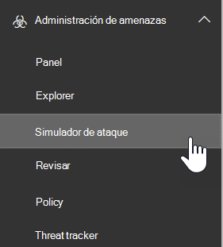

# Simulador de ataque en ATPAttack Simulator in ATP

**Resumen** Si es administrador global o administrador de seguridad y su organización tiene Office 365 Advanced Threat Protection Plan 2, que incluye la [investigación de amenazas y las capacidades de respuesta](office-365-ti.md), puede usar simulador de ataque para ejecutar escenarios de ataque realistas en su organización.**Summary** If you are a global administrator or a security administrator and your organization has Office 365 Advanced Threat Protection Plan 2, which includes [Threat Investigation and Response capabilities](office-365-ti.md), you can use Attack Simulator to run realistic attack scenarios in your organization. Esto puede ayudarle a identificar y buscar usuarios vulnerables antes de que un ataque real afecte a los resultados finales.This can help you identify and find vulnerable users before a real attack impacts your bottom line. Lea este artículo para obtener más información.Read this article to learn more.

## ¿Qué necesita saber antes de comenzar?What do you need to know before you begin?

- Para abrir el centro de seguridad & cumplimiento, vaya <https://protection.office.com/>a.To open the Security & Compliance Center, go to <https://protection.office.com/>. El simulador de ataques está disponible en **simulador de ataques**de **Administración** \> de amenazas.Attack simulator is available at **Threat management** \> **Attack simulator**.

  

- Para obtener más información acerca de la disponibilidad de un simulador de ataque en distintas suscripciones de Microsoft 365, consulte [Office 365 Advanced Threat Protection Service Description](https://docs.microsoft.com/office365/servicedescriptions/office-365-advanced-threat-protection-service-description).For more information about the availability of Attack Simulator across different Microsoft 365 subscriptions, see [Office 365 Advanced Threat Protection service description](https://docs.microsoft.com/office365/servicedescriptions/office-365-advanced-threat-protection-service-description).

- Debe ser miembro de los grupos de roles **Administración** de la organización o **Administrador de seguridad** .You need to be a member of the **Organization Management** or **Security Administrator** role groups. Para obtener más información acerca de los grupos de roles en el centro de seguridad & cumplimiento, consulte [Permissions in the security & Compliance Center](permissions-in-the-security-and-compliance-center.md).For more information about role groups in the Security & Compliance Center, see [Permissions in the Security & Compliance Center](permissions-in-the-security-and-compliance-center.md).

- La cuenta debe estar configurada para la autenticación multifactor (MFA) con el fin de crear y administrar campañas en el simulador de ataques.Your account needs to be configured for multi-factor authentication (MFA) to create and manage campaigns in Attack Simulator. Para obtener instrucciones, vea [set up multi-factor Authentication](https://docs.microsoft.com/office365/admin/security-and-compliance/set-up-multi-factor-authentication).For instructions, see [Set up multi-factor authentication](https://docs.microsoft.com/office365/admin/security-and-compliance/set-up-multi-factor-authentication).

Para que un ataque se inicie correctamente, asegúrese de que la cuenta que usa para ejecutar ataques simulados esté usando la autenticación multifactor.For an attack to be successfully launched, make sure that the account you are using to run simulated attacks is using multi-factor authentication. Además, debe ser administrador global o administrador de seguridad.In addition, you must be a global administrator or a security administrator. (Para obtener más información acerca de los roles y los permisos, consulte [permisos en el centro de seguridad & cumplimiento](permissions-in-the-security-and-compliance-center.md)).(To learn more about roles and permissions, see [Permissions in the Security & Compliance Center](permissions-in-the-security-and-compliance-center.md).)

- Las campañas de suplantación de identidad recopilarán y procesarán eventos durante 30 días.Phishing campaigns will collect and process events for 30 days. Los datos históricos de la campaña estarán disponibles hasta 90 días después de iniciar la campaña.Historical campaign data will be available for up to 90 days after you launch the campaign.

- No hay cmdlets de PowerShell correspondientes para el simulador de ataques.There are no corresponding PowerShell cmdlets for Attack Simulator.

## Campañas de "Spear phishing"Spear phishing campaigns

La *suplantación de identidad (phishing)* es un término genérico para los ataques de correo electrónico que intentan robar información confidencial en los mensajes que parecen ser de remitentes legítimos o de confianza.*Phishing* is a generic term for email attacks that try to steal sensitive information in messages that appear to be from legitimate or trusted senders. La *suplantación de identidad (Spear phishing* ) es un ataque de suplantación de identidad (phishing) orientado a los destinatarios de destino (normalmente, después del reconocimiento de los destinatarios por parte del atacante).*Spear phishing* is a targeted phishing attack that uses very focused and customized content that's specifically tailored to the targeted recipients (typically, after reconnaissance on the recipients by the attacker).

- Es administrador global o administrador de seguridadYou are a global administrator or security administrator

En el simulador de ataque, hay disponibles dos tipos diferentes de campañas de "Spear phishing":In Attack Simulator, two different types of spear phishing campaigns are available:

- El [acceso condicional/autenticación multifactor](https://docs.microsoft.com/office365/admin/security-and-compliance/set-up-multi-factor-authentication) está activado, al menos para la cuenta de administrador global y los administradores de seguridad que van a usar el simulador de ataques.[Multi-factor authentication/Conditional Access](https://docs.microsoft.com/office365/admin/security-and-compliance/set-up-multi-factor-authentication) is turned on, for at least the global administrator account and security administrators who will be using Attack Simulator. (Idealmente, el acceso condicional/autenticación multifactor está activado para todos los usuarios de la organización).(Ideally, multi-factor authentication/conditional access is turned on for all users in your organization.)

  - Una página predeterminada en la que se explica que se trataba de una sola prueba y ofrece sugerencias para reconocer los mensajes de suplantación de identidad.A default page that explains this was a just a test, and gives tips for recognizing phishing messages.

    

  - Una página personalizada (URL) que especifique.A custom page (URL) that you specify.

- **Spear phishing (datos adjuntos)**: el ataque intenta convencer a los destinatarios para que abran un archivo adjunto. docx o. pdf en el mensaje.**Spear phishing (attachment)**: The attack tries to convince the recipients to open a .docx or .pdf attachment in the message. Los datos adjuntos incluyen el mismo contenido del vínculo de suplantación de identidad (phishing\<) predeterminado\>, pero la primera frase comienza por "nombre para mostrar, se ve este mensaje como un mensaje de correo electrónico reciente abierto...".The attachment contains the same content from the default phishing link, but the first sentence starts with "\<Display Name\>, you are seeing this message as a recent email message you opened...".

> [!NOTE]
> Actualmente, las campañas de suplantación de identidad de Spear en el simulador de ataque no expiran.Currently, spear phishing campaigns in Attack Simulator don't expire.

### Crear una campaña de "Spear phishing"Create a spear phishing campaign

Una parte importante de cualquier campaña de "Spear phishing" es la apariencia del mensaje de correo electrónico que se envía a los destinatarios de destino.An important part of any spear phishing campaign is the look and feel of the email message that's sent to the targeted recipients. Para crear y configurar el mensaje de correo electrónico, tiene estas opciones:To create and configure the email message, you have these options:

- **Usar una plantilla de correo electrónico integrada**: hay disponibles dos plantillas integradas: **Premio regalo** y **actualización de nóminas**.**Use a built-in email template**: Two built-in templates are available: **Prize Giveaway** and **Payroll Update**. Puede personalizar aún más algunas, todas o ninguna de las propiedades de correo electrónico de la plantilla al crear e iniciar la campaña.You can further customize some, all, or none of the email properties from the template when you create and launch the campaign.

- **Cree una plantilla de correo electrónico reutilizable**: una vez que haya creado y guardado la plantilla de correo electrónico, puede usarla de nuevo en las campañas de suplantación de identidad de Spear futuras.**Create a reusable email template**: After you create and save the email template, you can use it again in future spear phishing campaigns. Puede personalizar aún más algunas, todas o ninguna de las propiedades de correo electrónico de la plantilla al crear e iniciar la campaña.You can further customize some, all, or none of the email properties from the template when you create and launch the campaign.

- **Crear el mensaje de correo electrónico en el asistente**: puede crear el mensaje de correo electrónico directamente en el asistente mientras crea e inicia la campaña de Spear phishing.**Create the email message in the wizard**: You can create the email message directly in the wizard as you create and launch the spear phishing campaign.

#### Paso 1 (opcional): crear una plantilla de correo electrónico personalizadaStep 1 (Optional): Create a custom email template

Si va a utilizar una de las plantillas integradas o va a crear el mensaje de correo electrónico directamente en el asistente, puede omitir este paso.If you're going to use one of the built-in templates or create the email message directly in the wizard, you can skip this step.

1. En el centro de seguridad & cumplimiento, vaya a **simulador de ataques**de **Administración** \> de amenazas.In the Security & Compliance Center, go to **Threat management** \> **Attack simulator**.

2. En la página **Simulate Attacks** , en las secciones de **Spear phishing (credenciales cosecha)** o **Spear phishing (datos adjuntos)** , haga clic en **detalles de ataque**.On the **Simulate attacks** page, in either the **Spear Phishing (Credentials Harvest)** or **Spear Phishing (Attachment)** sections, click **Attack Details**.

   No importa dónde cree la plantilla.It doesn't matter where you create the template. Las opciones disponibles en la plantilla son las mismas para ambos tipos de ataques de suplantación de identidad.The available options in the template are the same for both types of phishing attacks.

3. En la **página Detalles del ataque** que se abre, en la sección plantillas de **suplantación de identidad** , en el área **crear plantillas** , haga clic en **nueva plantilla**.In the **Attack details** page that opens, in the **Phishing Templates** section, in the **Create Templates** area, click **New Template**.

4. El Asistente para **Configurar plantillas de suplantación de identidad** se inicia en un nuevo flotante.The **Configure Phishing Template** wizard starts in a new flyout. En el paso **iniciar** , escriba un nombre para mostrar único para la plantilla y, a continuación, haga clic en **siguiente**.In the **Start** step, enter a unique display name for the template, and then click **Next**.

5. En el paso **configurar detalles de correo electrónico** , configure las siguientes opciones:In the **Configure email details** step, configure the following settings:

   - **From (nombre)**: el nombre para mostrar que se usa para el remitente del mensaje.**From (Name)**: The display name that's used for the message sender.

   - **From (email)**: la dirección de correo electrónico del remitente.**From (Email)**: The sender's email address.

   - **Dirección URL del servidor de inicio de sesión de phishing**: haga clic en el menú desplegable y seleccione una de las direcciones URL disponibles de la lista.**Phishing Login Server URL**: Click the drop down and select one of the available URLs from the list. Esta es la dirección URL a la que se verá tentado a los usuarios en hacer clic.This is the URL that users will be tempted to click. Las opciones son:The choices are:

     - <http://portal.docdeliveryapp.com>
     - <http://portal.docdeliveryapp.net>
     - <http://portal.docstoreinternal.com>
     - <http://portal.docstoreinternal.net>
     - <http://portal.hardwarecheck.net>
     - <http://portal.hrsupportint.com>
     - <http://portal.payrolltooling.com>
     - <http://portal.payrolltooling.net>
     - <http://portal.prizegiveaway.net>
     - <http://portal.prizesforall.com>
     - <http://portal.salarytoolint.com>
     - <http://portal.salarytoolint.net>

     > [!NOTE]
     > <ul><li>Todas las direcciones URL son intencionadamente http, no HTTPS.All of the URLs are intentionally http, not https.</li><li>Un servicio de reputación de dirección URL puede identificar una o varias de estas direcciones URL como no seguras.A URL reputation service might identify one or more of these URLs as unsafe. Compruebe la disponibilidad de la dirección URL en los exploradores Web admitidos antes de usar la dirección URL en una campaña de suplantación de identidad (phishing).Check the availability of the URL in your supported web browsers before you use the URL in a phishing campaign.</li></ul>

   - **Dirección URL de la página de aterrizaje personalizada**: escriba una página de aterrizaje opcional en la que se tomen los usuarios si hacen clic en el vínculo phishing y escriben sus credenciales.**Custom Landing Page URL**: Enter an optional landing page where users are taken if they click the phishing link and enter their credentials. Este vínculo reemplaza la página de aterrizaje predeterminada.This link replaces the default landing page. Por ejemplo, si tiene un entrenamiento de conciencia interno, puede especificar esta dirección URL aquí.For example, if you have internal awareness training, you can specify that URL here.

   - **Categoría**: Actualmente, no se usa esta configuración (se ignora cualquier cosa que haya escrito).**Category**: Currently, this setting isn't used (anything you enter is ignored).

   - **Subject**: el campo **Subject** del mensaje de correo electrónico.**Subject**: The **Subject** field of the email message.

   Cuando termine, haga clic en **Siguiente**.When you're finished, click **Next**.

6. En el paso de **redacción de correo electrónico** , cree el cuerpo del mensaje del mensaje de correo electrónico.In the **Compose email** step, create the message body of the email message. Puede usar la pestaña **correo electrónico** (un editor HTML enriquecido) o la ficha **origen** (código HTML sin formato).You can use the **Email** tab (a rich HTML editor) or the **Source** tab (raw HTML code).

   El formato HTML puede ser tan sencillo o complejo como sea necesario.The HTML formatting can be as simple or complex as you need it to be. Puede insertar imágenes y texto para mejorar la increíbleidad del mensaje en el cliente de correo electrónico del destinatario.You can insert images and text to enhance the believability of the message in the recipient's email client.

   - `${username}`inserta el nombre del destinatario.`${username}` inserts the recipient's name.

   - `${loginserverurl}`inserta el valor de la **dirección URL del servidor de inicio de sesión de suplantación de identidad** del paso anterior.`${loginserverurl}` inserts the **Phishing Login Server URL** value from the previous step.

   Cuando termine, haga clic en **Siguiente**.When you're finished, click **Next**.

7. En el paso **confirmar** , haga clic en **Finalizar**.In the **Confirm** step, click **Finish**.

#### Paso 2: crear e iniciar la campaña de suplantación de identidad de SpearStep 2: Create and launch the spear phishing campaign

1. En el centro de seguridad & cumplimiento, vaya a **simulador de ataques**de **Administración** \> de amenazas.In the Security & Compliance Center, go to **Threat management** \> **Attack simulator**.

2. En la página **simular ataques** , realice una de las siguientes selecciones en función del tipo de campaña que desee crear:On the **Simulate attacks** page, make one of the following selections based on the type of campaign you want to create:

   - En la sección **Spear phishing (credenciales cosecha)** , haga clic en **iniciar ataque** o en **ataque de inicio**de detalles \> de **ataque** .In the **Spear Phishing (Credentials Harvest)** section, click **Launch Attack** or click **Attack Details** \> **Launch Attack**.

   - En la sección **Spear phishing (datos adjuntos)** , haga clic en **iniciar ataque** o en **ataque de inicio**de detalles \> de **ataque** .In the **Spear Phishing (Attachment)** section, click **Launch Attack** or click **Attack Details** \> **Launch Attack**.

3. El Asistente para **configurar un ataque de suplantación de identidad** se inicia en un nuevo flotante.The **Configure Phishing Attack** wizard starts in a new flyout. En el paso **iniciar** , siga uno de estos pasos:In the **Start** step, do one of the following steps:

   - En el cuadro **nombre** , escriba un nombre para mostrar único para la campaña.In the **Name** box, enter a unique display name for the campaign. No haga clic en **Usar plantilla**, ya que creará el mensaje de correo electrónico más adelante en el asistente.Don't click **Use Template**, because you'll create the email message later in the wizard.

   - Haga clic en **Usar plantilla** y seleccione una plantilla de correo electrónico integrada o personalizada.Click **Use Template** and select a built-in or custom email template. Una vez seleccionada la plantilla, el cuadro **nombre** se rellena automáticamente en función de la plantilla, pero puede cambiar el nombre.After you select the template, the **Name** box is automatically filled based on the template, but you can change the name.

   

   Cuando termine, haga clic en **Siguiente**.When you're finished, click **Next**.

4. En el paso **destinatarios de destino** , siga uno de estos pasos:In the **Target recipients** step, do one of the following steps:

   - Haga clic en **Libreta de direcciones** para seleccionar los destinatarios (usuarios o grupos) de la campaña.Click **Address Book** to select the recipients (users or groups) for the campaign. Cada destinatario de destino debe tener un buzón de correo de Exchange Online.Each targeted recipient must have an Exchange Online mailbox. Si hace clic en **filtrar** y **aplicar** sin especificar ningún criterio de búsqueda, todos los destinatarios se devuelven y se agregan a la campaña.If you click **Filter** and **Apply** without entering a search criteria, all recipients are returned and added to the campaign.

   - Haga clic en **importar** y, a continuación, en importar **archivo** para importar un archivo de valores separados por comas (CSV) o archivos separados por líneas de direcciones de correo electrónico.Click **Import** then **File Import** to import a comma-separated value (CSV) or line-separated file of email addresses. Cada línea debe contener la dirección de correo electrónico del destinatario.Each line must contain the recipient's email address.

   Cuando termine, haga clic en **Siguiente**.When you're finished, click **Next**.

5. En el paso **configurar detalles de correo electrónico** , configure las siguientes opciones:In the **Configure email details** step, configure the following settings:

   Si seleccionó una plantilla en el paso **iniciar** , la mayoría de estos valores ya están configurados, pero puede cambiarlos.If you selected a template in the **Start** step, most of these values are already configured, but you can change them.

   - **From (nombre)**: el nombre para mostrar que se usa para el remitente del mensaje.**From (Name)**: The display name that's used for the message sender.

   - **From (email)**: la dirección de correo electrónico del remitente.**From (Email)**: The sender's email address. Puede escribir una dirección de correo electrónico real o falsa desde el dominio de correo electrónico de su organización o puede escribir una dirección de correo electrónico externa real o falsa.You can enter a real or fake email address from your organization's email domain, or you can enter a real or fake external email address. Una dirección de correo electrónico de remitente válida de la organización se resolverá realmente en el cliente de correo electrónico del destinatario.A valid sender email address from your organization will actually resolve in the recipient's email client.

   - **Dirección URL del servidor de inicio de sesión de phishing**: haga clic en el menú desplegable y seleccione una de las direcciones URL disponibles de la lista.**Phishing Login Server URL**: Click the drop down and select one of the available URLs from the list. Esta es la dirección URL a la que se verá tentado a los usuarios en hacer clic.This is the URL that users will be tempted to click. Las opciones son:The choices are:

     - <http://portal.docdeliveryapp.com>
     - <http://portal.docdeliveryapp.net>
     - <http://portal.docstoreinternal.com>
     - <http://portal.docstoreinternal.net>
     - <http://portal.hardwarecheck.net>
     - <http://portal.hrsupportint.com>
     - <http://portal.payrolltooling.com>
     - <http://portal.payrolltooling.net>
     - <http://portal.prizegiveaway.net>
     - <http://portal.prizesforall.com>
     - <http://portal.salarytoolint.com>
     - <http://portal.salarytoolint.net>

     > [!NOTE]
     > <ul><li>Todas las direcciones URL son intencionadamente http, no HTTPS.All of the URLs are intentionally http, not https.</li><li>Un servicio de reputación de dirección URL puede identificar una o varias de estas direcciones URL como no seguras.A URL reputation service might identify one or more of these URLs as unsafe. Compruebe la disponibilidad de la dirección URL en los exploradores Web admitidos antes de usar la dirección URL en una campaña de suplantación de identidad (phishing).Check the availability of the URL in your supported web browsers before you use the URL in a phishing campaign.</li><li>Es necesario que seleccione una dirección URL.You are required to select a URL. En el caso de las campañas de <b>"Spear phishing" (datos adjuntos)</b> , puede quitar el vínculo del cuerpo del mensaje en el paso siguiente (de lo contrario, el mensaje contendrá tanto un vínculo <b>como</b> datos adjuntos).For <b>Spear Phishing (Attachment)</b> campaigns, you can remove the link from the body of the message in the next step (otherwise, the message will contain both a link <b>and</b> an attachment).</li></ul>

   - **Tipo de datos adjuntos**: esta configuración solo está disponible en las campañas de **"Spear phishing" (datos adjuntos)** .**Attachment Type**: This setting is only available in **Spear Phishing (Attachment)** campaigns. Haga clic en la lista desplegable y seleccione **. DOCX** o **. PDF** de la lista.Click the drop down and select **.DOCX** or **.PDF** from the list.

   - **Nombre de datos adjuntos**: esta configuración solo está disponible en las campañas de **"Spear phishing" (datos adjuntos)** .**Attachment Name**: This setting is only available in **Spear Phishing (Attachment)** campaigns. Escriba un nombre de archivo para los datos adjuntos. docx o. pdf.Enter a filename for the .docx or .pdf attachment.

   - **Dirección URL de la página de aterrizaje personalizada**: escriba una página de aterrizaje opcional en la que se tomen los usuarios si hacen clic en el vínculo phishing y escriben sus credenciales.**Custom Landing Page URL**: Enter an optional landing page where users are taken if they click the phishing link and enter their credentials. Este vínculo reemplaza la página de aterrizaje predeterminada.This link replaces the default landing page. Por ejemplo, si tiene un entrenamiento de conciencia interno, puede especificar esta dirección URL aquí.For example, if you have internal awareness training, you can specify that URL here.

   - **Subject**: el campo **Subject** del mensaje de correo electrónico.**Subject**: The **Subject** field of the email message.

   Cuando termine, haga clic en **Siguiente**.When you're finished, click **Next**.

6. En el paso de **redacción de correo electrónico** , cree el cuerpo del mensaje del mensaje de correo electrónico.In the **Compose email** step, create the message body of the email message. Si seleccionó una plantilla en el paso **iniciar** , el cuerpo del mensaje ya está configurado, pero puede personalizarlo.If you selected a template in the **Start** step, the message body is already configured, but you can customize it. Puede usar la pestaña **correo electrónico** (un editor HTML enriquecido) o la ficha **origen** (código HTML sin formato).You can use the **Email** tab (a rich HTML editor) or the **Source** tab (raw HTML code).

   El formato HTML puede ser tan sencillo o complejo como sea necesario.The HTML formatting can be as simple or complex as you need it to be. Puede insertar imágenes y texto para mejorar la increíbleidad del mensaje en el cliente de correo electrónico del destinatario.You can insert images and text to enhance the believability of the message in the recipient's email client.

   - `${username}`inserta el nombre del destinatario.`${username}` inserts the recipient's name.

   - `${loginserverurl}`inserta el valor **URL del servidor de inicio de sesión de suplantación de identidad** .`${loginserverurl}` inserts the **Phishing Login Server URL** value.

   Para las campañas de **"Spear phishing" (datos adjuntos)** , debe quitar el vínculo del cuerpo del mensaje (de lo contrario, el mensaje contendrá tanto un vínculo **como** datos adjuntos y los clics de vínculo no se realizará el seguimiento en una campaña de datos adjuntos).For **Spear Phishing (Attachment)** campaigns, you should remove the link from the body of the message (otherwise, the message will contain both a link **and** an attachment, and link clicks aren't tracked in an attachment campaign).

   

   Cuando termine, haga clic en **Siguiente**.When you're finished, click **Next**.

7. En el paso **confirmar** , haga clic en **Finalizar** para iniciar la campaña.In the **Confirm** step, click **Finish** to launch the campaign. El mensaje de suplantación de identidad se entrega a los destinatarios de destino.The phishing message is delivered to the targeted recipients.

## Campañas de ataque con contraseñaPassword attack campaigns

Un *ataque de contraseña* intenta adivinar las contraseñas de las cuentas de usuario de una organización, normalmente después de que el atacante haya identificado una o varias cuentas de usuario válidas.A *password attack* tries to guess passwords for user accounts in an organization, typically after the attacker has identified one or more valid user accounts.

En el simulador de ataque, hay disponibles dos tipos diferentes de campañas para ataques con contraseña para que pueda probar la complejidad de las contraseñas de los usuarios:In Attack Simulator, two different types of password attack campaigns are available for you to test the complexity of your users' passwords:

- **Contraseña de fuerza bruta (ataque de diccionario)**: una *fuerza bruta* o un ataque de *Diccionario* usa un archivo de Diccionario de gran tamaño de contraseñas en una cuenta de usuario con la esperanza de que uno de ellos trabaje (muchas contraseñas con una cuenta).**Brute force password (dictionary attack)**: A *brute force* or *dictionary* attack uses a large dictionary file of passwords on a user account with the hope that one of them will work (many passwords against one account). Los bloqueos de contraseñas incorrectos ayudan a impedir ataques de contraseñas de fuerza bruta.Incorrect password lock-outs help deter brute force password attacks.

  Para el ataque de diccionario, puede especificar una o varias contraseñas para probarlas (especificadas manualmente o en un archivo cargado) y puede especificar uno o varios usuarios.For the dictionary attack, you can specify one or many passwords to try (manually entered or in an uploaded file), and you can specify one or many users.

- **Ataque por pulverización de contraseñas**: un ataque *rociado de contraseñas* usa la misma contraseña cuidadosamente considerada con una lista de cuentas de usuario (una contraseña en muchas cuentas).**Password spray attack**: A *password spray* attack uses the same carefully considered password against a list of user accounts (one password against many accounts). Los ataques por pulverización de contraseña son más difíciles de detectar que los ataques de fuerza bruta de contraseña (la probabilidad de que aumente el éxito cuando un atacante prueba una contraseña entre docenas o cientos de cuentas sin el riesgo de que se bloquee el bloqueo de contraseña incorrecto del usuario).Password spray attacks are harder to detect than brute force password attacks (the probability of success increases when an attacker tries one password across dozens or hundreds of accounts without the risk of tripping the user's incorrect password lock-out).

  Para el ataque con aerosol de contraseña, solo puede especificar una contraseña para probar y puede especificar uno o varios usuarios.For the password spray attack, you can only specify one password to try, and you can specify one or many users.

> [!NOTE]
> Los ataques de contraseñas en el simulador de ataque pasan las solicitudes de nombre de usuario y contraseña básicas de autenticación a un extremo, por lo que también funcionan con otros métodos de autenticación (AD FS, sincronización de hash de contraseña, paso a través, PingFederate, etc.).The password attacks in Attack Simulator pass username and password Basic auth requests to an endpoint, so they also work with other authentication methods (AD FS, password hash sync, pass-through, PingFederate, etc.). Para los usuarios con la MFA habilitada, aunque el ataque de contraseña intente su contraseña real, el intento se registrará siempre como un error (es decir, los usuarios de MFA nunca aparecerán en el recuento **correcto de intentos** de la campaña).For users that have MFA enabled, even if the password attack tries their actual password, the attempt will always register as a failure (in other words, MFA users will never appear in the **Successful attempts** count of the campaign). Este es el resultado esperado.This is the expected result. MFA es un método principal para ayudar a proteger contra ataques de contraseñas.MFA is a primary method to help protect against password attacks.

### Crear e iniciar una campaña de ataque con contraseñaCreate and launch a password attack campaign

1. En el centro de seguridad & cumplimiento, vaya a **simulador de ataques**de **Administración** \> de amenazas.In the Security & Compliance Center, go to **Threat management** \> **Attack simulator**.

2. En la página **simular ataques** , realice una de las siguientes selecciones en función del tipo de campaña que desee crear:On the **Simulate attacks** page, make one of the following selections based on the type of campaign you want to create:

   - En la sección **contraseña de fuerza bruta (ataque de diccionario)** , haga clic en **iniciar ataque** o en **ataque de inicio**de detalles \> de **ataque** .In the **Brute Force Password (Dictionary Attack)** section, click **Launch Attack** or click **Attack Details** \> **Launch Attack**.

   - en la **sección ataque por pulverización de contraseña** , haga clic en **iniciar ataque** o en **ataque de inicio**de detalles \> de **ataque** .in the **Password spray attack** section, click **Launch Attack** or click **Attack Details** \> **Launch Attack**.

3. El Asistente para **configurar un ataque de contraseña** comienza en un nuevo control flotante.The **Configure Password Attack** wizard starts in a new flyout. En el paso **iniciar** , escriba un nombre para mostrar único para la campaña y, a continuación, haga clic en **siguiente**.In the **Start** step, enter a unique display name for the campaign, and then click **Next**.

4. En el paso **usuarios de destino** , siga uno de estos pasos:In the **Target users** step, do one of the following steps:

   - Haga clic en **Libreta de direcciones** para seleccionar los destinatarios (usuarios o grupos) de la campaña.Click **Address Book** to select the recipients (users or groups) for the campaign. Cada destinatario de destino debe tener un buzón de correo de Exchange Online.Each targeted recipient must have an Exchange Online mailbox. Si hace clic en **filtrar** y **aplicar** sin especificar ningún criterio de búsqueda, todos los destinatarios se devuelven y se agregan a la campaña.If you click **Filter** and **Apply** without entering a search criteria, all recipients are returned and added to the campaign.

   - Haga clic en **importar** y, a continuación, en importar **archivo** para importar un archivo de valores separados por comas (CSV) o archivos separados por líneas de direcciones de correo electrónico.Click **Import** then **File Import** to import a comma-separated value (CSV) or line-separated file of email addresses. Cada línea debe contener la dirección de correo electrónico del destinatario.Each line must contain the recipient's email address.

   Cuando termine, haga clic en **Siguiente**.When you're finished, click **Next**.

5. En el paso **elegir configuración de ataque** , elija qué hacer en función del tipo de campaña:In the **Choose attack settings** step, choose what to do based on the campaign type:

   - **Contraseña de fuerza bruta (ataque de diccionario)**: realice uno de los pasos siguientes:**Brute Force Password (Dictionary Attack)**: Do either of the following steps:

     - **Escriba las contraseñas manualmente**: en el cuadro **presione Entrar para agregar una contraseña** , escriba una contraseña y, a continuación, presione Entrar.**Enter passwords manually**: In the **Press enter to add a password** box, type a password and then press ENTER. Repita este paso tantas veces como sea necesario.Repeat this step as many times as necessary.

     - **Cargar contraseñas desde un archivo de diccionario**: haga clic en **cargar** para importar un archivo de texto existente que contenga una contraseña en cada línea y una última línea en blanco.**Upload passwords from a dictionary file**: Click **Upload** to import an existing text file that contains one password on each line and a blank last line. El archivo de texto debe tener un tamaño de 10 MB o menos, y no puede contener más de 30000 contraseñas.The text file must be 10 MB or less in size, and can't contain more than 30000 passwords.

   - **Ataque por pulverizador de contraseña**: en **las contraseñas que se van a usar en el cuadro ataque** , escriba una contraseña.**Password spray attack**: In **The password(s) to use in the attack** box, enter one password.

   Cuando termine, haga clic en **Siguiente**.When you're finished, click **Next**.

6. En el paso **confirmar** , haga clic en **Finalizar** para iniciar la campaña.In the **Confirm** step, click **Finish** to launch the campaign. Las contraseñas especificadas se prueban en los usuarios especificados.The passwords you specified are tried on users you specified.

## Ver los resultados de la campañaView campaign results

Después de iniciar una campaña, puede comprobar el progreso y los resultados en la Página principal de **ataques de simulación** .After you launch a campaign, you can check the progress and results on the main **Simulate attacks** page.

Las campañas activas mostrarán una barra de estado, un valor porcentual completado y el recuento de (usuarios completados) de (total de usuarios) ".Active campaigns will show a status bar, a completed percentage value and "(completed users) of (total users)" count. Al hacer clic en el botón **Actualizar** se actualizará el progreso de las campañas activas.Clicking the **Refresh** button will update the progress of any active campaigns. También puede hacer clic en **Finalizar** para detener una campaña activa.You can also click **Terminate** to stop an active campaign.

Una vez finalizada la campaña, el estado cambia a **ataque completado**.When the campaign is finished, the status changes to **Attack completed**. Puede ver los resultados de la campaña realizando una de las acciones siguientes:You can view the results of the campaign by doing either of the following actions:

- En la página principales **ataques de simulación** , haga clic en **Ver informe** bajo el nombre de la campaña.On the main **Simulate attacks** page, click **View Report** under the name of the campaign.

- En la página principales **ataques de simulación** , haga clic en detalles de **ataque** en la sección para el tipo de ataque.On the main **Simulate attacks** page, click **Attack Details** in the section for the type of attack. En la página **detalles de ataque** que se abre, seleccione la campaña en la sección historial de **ataques** .On the **Attack details** page that opens, select the campaign in the **Attack History** section.

Cualquiera de las acciones anteriores le llevará a una página denominada **detalles del ataque**.Either of the previous actions will take you to a page named **Attack details**. La información disponible en esta página para cada tipo de campaña se describe en las secciones siguientes.The information that's available on this page for each type of campaign is described in the following sections.

### Resultados de la campaña de Spear phishing (recopilación de credenciales)Spear Phishing (Credentials Harvest) campaign results

La siguiente información está disponible en la página **detalles de ataque** para cada campaña:The following information is available on the **Attack details** page for each campaign:

- La duración (fecha y hora de inicio y fecha de finalización) de la campaña.The duration (start date/time and end date/time) of the campaign.

- **Total de usuarios a los que se destina****Total users targeted**

- **Intentos correctos**: el número de usuarios que hizo clic en el vínculo **y** escribió sus credenciales (*cualquier* valor de nombre de usuario y contraseña).**Successful attempts**: The number of users who clicked the link **and** entered their credentials (*any* username and password value).

- **Tasa general de éxito**: porcentaje calculado por el **Successful attempts** / **número total de usuarios a los**que se ha dirigido correctamente.**Overall Success Rate**: A percentage that's calculated by **Successful attempts** / **Total users targeted**.

- **Clic más rápido**: Cuánto tiempo tardó el primer usuario en hacer clic en el vínculo después de iniciar la campaña.**Fastest Click**: How long it took the first user to click the link after you launched the campaign.

- **Promedio haga clic**en: cantidad de tiempo que tardó en hacer que todos los usuarios haga clic en el vínculo dividido por el número de usuarios que hizo clic en el vínculo.**Average Click**: The sum of how long it took everyone to click the link divided by the number of users who clicked the link.

- **Tasa de éxito**: un porcentaje calculado por (número de usuarios que hizo clic en el vínculo)/ **total de usuarios dirigidos**.**Click Success Rate**: A percentage that's calculated by (number of users who clicked the link) / **Total users targeted**.

- **Credenciales más rápidas**: Cuánto tiempo tardó el primer usuario en escribir sus credenciales después de iniciar la campaña.**Fastest Credentials**: How long it took the first user to enter their credentials after you launched the campaign.

- **Promedio de credenciales**: la suma de cuánto tiempo tardó en escribir sus credenciales dividida por el número de usuarios que escribieron sus credenciales.**Average Credentials**: The sum of how long it took everyone to enter their credentials divided by the number of users who entered their credentials.

- **Tasa de éxito**de la credencial: porcentaje calculado por (número de usuarios que han especificado sus credenciales)/ **total de usuarios a los**que se destina.**Credential Success Rate**: A percentage that's calculated by (number of users who entered their credentials) / **Total users targeted**.

- Gráfico de barras que muestra el **vínculo en** el que se hizo clic y los números de **credenciales especificados** por día.A bar graph that shows the **Link clicked** and **Credential supplied** numbers per day.

- Un gráfico circular que muestra el **vínculo en**el que se hizo clic, las **credenciales suministradas**y **ninguno** de los porcentajes de la campaña.A circle graph that shows the **Link clicked**, **Credential supplied**, and **None** percentages for the campaign.

- La sección **usuarios comprometidos** muestra los detalles de los usuarios que hacer clic en el vínculo:The **Compromised Users** section lists the details of the users who clicked the link:

  - La dirección de correo electrónico del usuarioThe user's email address

  - Fecha y hora en que hizo clic en el vínculo.The date/time when they clicked the link.

  - La dirección IP del cliente.The client IP address.

  - Detalles sobre la versión del usuario de Windows y el explorador Web.Details about the user's version of Windows and web browser.

  Puede hacer clic en **exportar** para exportar los resultados a un archivo CSV.You can click **Export** to export the results to a CSV file.

### Resultados de la campaña de Spear phishing (datos adjuntos)Spear Phishing (Attachment) campaign results

La siguiente información está disponible en la página **detalles de ataque** para cada campaña:The following information is available on the **Attack details** page for each campaign:

- La duración (fecha y hora de inicio y fecha de finalización) de la campaña.The duration (start date/time and end date/time) of the campaign.

- **Total de usuarios a los que se destina****Total users targeted**

- **Intentos correctos**: el número de usuarios que abrieron o descargaron y abrieron los datos adjuntos (la vista previa no cuenta).**Successful attempts**: The number of users who opened or downloaded and opened the attachment (preview doesn't count).

- **Tasa general de éxito**: porcentaje calculado por el **Successful attempts** / **número total de usuarios a los**que se ha dirigido correctamente.**Overall Success Rate**: A percentage that's calculated by **Successful attempts** / **Total users targeted**.

- **Tiempo de apertura de datos adjuntos más rápido**: Cuánto tiempo tardó el primer usuario en abrir los datos adjuntos después de iniciar la campaña.**Fastest attachment open time**: How long it took the first user to open the attachment after you launched the campaign.

- **Tiempo medio de apertura de datos adjuntos**: la suma de la duración de la apertura de los datos adjuntos por el número de usuarios que abrieron los datos adjuntos.**Average attachment open time**: The sum of how long it took everyone to open the attachment divided by the number of users who opened the attachment.

- **Tasa de éxito de apertura de datos adjuntos**: porcentaje calculado por (número de usuarios que abrieron los datos adjuntos)/ **total de usuarios dirigidos**.**Attachment open success rate**: A percentage that's calculated by (number of users who opened the attachment) / **Total users targeted**.

### Resultados de la campaña de contraseña de fuerza bruta (ataque de diccionario)Brute Force Password (Dictionary Attack) campaign results

La siguiente información está disponible en la página **detalles de ataque** para cada campaña:The following information is available on the **Attack details** page for each campaign:

- La duración (fecha y hora de inicio y fecha de finalización) de la campaña.The duration (start date/time and end date/time) of the campaign.

- **Total de usuarios a los que se destina****Total users targeted**

- **Intentos correctos**: el número de usuarios que se encontraron que utilizaban una de las contraseñas especificadas.**Successful attempts**: The number of users who were found to be using one of the specified passwords.

- **Tasa general de éxito**: porcentaje calculado por el **Successful attempts** / **número total de usuarios a los**que se ha dirigido correctamente.**Overall Success Rate**: A percentage that's calculated by **Successful attempts** / **Total users targeted**.

- La sección **usuarios comprometidos** muestra las direcciones de correo electrónico de los usuarios afectados.The **Compromised Users** section lists the email addresses of the affected users. Puede hacer clic en **exportar** para exportar los resultados a un archivo CSV.You can click **Export** to export the results to a CSV file.

### Resultados de la campaña de ataque con aerosol de contraseñaPassword spray attack campaign results

La siguiente información está disponible en la página **detalles de ataque** para cada campaña:The following information is available on the **Attack details** page for each campaign:

- La duración (fecha y hora de inicio y fecha de finalización) de la campaña.The duration (start date/time and end date/time) of the campaign.

- **Total de usuarios a los que se destina****Total users targeted**

- **Intentos correctos**: el número de usuarios que se encontraron que usaban la contraseña especificada.**Successful attempts**: The number of users who were found to be using the specified password.

- **Tasa general de éxito**: porcentaje calculado por el **Successful attempts** / **número total de usuarios a los**que se ha dirigido correctamente.**Overall Success Rate**: A percentage that's calculated by **Successful attempts** / **Total users targeted**.
