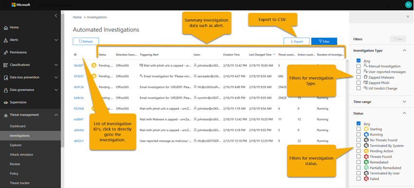

# Investigación y respuesta automatizadas (AIR) en Office 365Automated Investigation and Response (AIR) in Office 365

Las capacidades de investigación y respuesta automatizadas (AIR) le permiten ejecutar procesos de investigación automatizada en respuesta a amenazas bien conocidas que existen actualmente.Automated Investigation and Response (AIR) capabilities enable you to run automated investigation processes in response to well known threats that exist today. AIR puede ayudar al equipo de operaciones de seguridad a operar de manera más eficiente y efectiva.AIR can help your security operations team operate more efficiently and effectively.
- Para obtener información general sobre cómo funciona AIR, use este artículo.To get an overview how AIR works, use this article.
- Para empezar a usar AIR, consulte [investigar y responder automáticamente a amenazas en Office 365](office-365-air.md).To get started using AIR, see [Automatically investigate and respond to threats in Office 365](office-365-air.md).

> [!TIP]
> ¿Tiene Microsoft 365 E5 o Microsoft 365 E3 junto con la protección de la identidad y contra amenazas?Do you have Microsoft 365 E5 or Microsoft 365 E3 together with Identity & Threat Protection? Considere probar la [Protección contra amenazas de Microsoft](../mtp/microsoft-threat-protection.md).Consider trying [Microsoft Threat Protection](../mtp/microsoft-threat-protection.md).

## Flujo general de aireThe overall flow of AIR

En un nivel alto, el flujo de aire funciona de la siguiente manera:At a high level, the AIR flow works like this:

|FasePhase  |Qué implicaWhat's involved  |
|---------|---------|
|1 1     |Un evento de Office desencadena una [alerta](#alerts) y una guía de [seguridad](#security-playbooks) inicia una investigación automatizada de las alertas seleccionadas.An [alert](#alerts) is triggered by an Office event and a [security playbook](#security-playbooks) initiates an automated investigation for selected alerts.   Como alternativa, un analista de seguridad puede [iniciar una investigación automatizada manualmente](#example-a-security-administrator-triggers-an-investigation-from-threat-explorer)desde un correo electrónico desde el [Explorador](threat-explorer.md).Alternately, a security analyst can [start an automated investigation manually](#example-a-security-administrator-triggers-an-investigation-from-threat-explorer), from an email from [Explorer](threat-explorer.md).        |
|2 2     |Mientras se ejecuta una investigación automatizada, recopila datos adicionales sobre el correo electrónico y las entidades relacionadas con ese correo electrónico: archivos, direcciones URL y destinatarios.While an automated investigation runs, it gathers additional data about the email and the entities related to that email – files, URLs, and recipients.  El ámbito de la investigación puede aumentar, a medida que se desencadenen nuevas alertas relacionadas.The investigation's scope can increase, as new related alerts are triggered.         |
|3 3     |Durante y después de una investigación automatizada, [los detalles y los resultados](#investigation-graph) están disponibles para su visualización.During and after an automated investigation, [details and results](#investigation-graph) are available to view. Los resultados incluyen [acciones recomendadas](#recommended-actions) que se pueden llevar a cabo para responder y corregir cualquier amenaza que se detectó.Results include [recommended actions](#recommended-actions) that can be taken to respond and remediate any threats that were found. Además, hay disponible un registro de la [Guía](#playbook-log) que realiza un seguimiento de la actividad de la investigación.In addition, an [playbook log](#playbook-log) is available that tracks all investigation activity.  Si su organización usa una solución de informes personalizada o una solución de terceros, puede [usar la API de actividad de administración de Office 365](office-365-air.md#use-the-office-365-management-activity-api-for-custom-or-third-party-reporting-solutions) para ver información sobre las amenazas y las investigaciones automatizadas.If your organization is using a custom reporting solution or a third-party solution, you can [use the Office 365 Management Activity API](office-365-air.md#use-the-office-365-management-activity-api-for-custom-or-third-party-reporting-solutions) to view information about automated investigations and threats.         |
|4 4     |El equipo de operaciones de seguridad revisa los resultados de la investigación y las recomendaciones y aprueba las acciones de corrección.Your security operations team reviews the investigation results and recommendations, and approves remediation actions. En Office 365, las acciones de corrección solo se realizan tras la aprobación del equipo de seguridad de la organización.In Office 365, remediation actions are taken only upon approval by your organization's security team.         |

En las secciones siguientes se proporcionan más detalles sobre el aire, incluidos detalles sobre las alertas, las guías de seguridad y los detalles de la investigación.The following sections provide more details about AIR, including details about alerts, security playbooks, and investigation details. Además, se incluyen dos ejemplos de cómo funciona AIR en este artículo.In addition, two examples of how AIR works are included in this article. Para empezar a usar AIR, consulte [investigar y responder automáticamente a amenazas en Office 365](office-365-air.md).To get started using AIR, see [Automatically investigate and respond to threats in Office 365](office-365-air.md).

## AlertasAlerts

Las [alertas](../../compliance/alert-policies.md#viewing-alerts) representan desencadenadores de flujos de trabajo del equipo de operaciones de seguridad para respuesta ante incidentes.[Alerts](../../compliance/alert-policies.md#viewing-alerts) represent triggers for security operations team workflows for incident response. Establecer prioridades en el conjunto de alertas adecuadas para la investigación, a la vez que asegurarse de que no hay amenazas sin direcciones, supone un reto.Prioritizing the right set of alerts for investigation, while making sure no threats are unaddressed is challenging. Cuando las investigaciones en las alertas se realizan manualmente, los equipos de operaciones de seguridad deben buscar y correlacionar las entidades (como contenido, dispositivos y usuarios) en riesgo de amenazas.When investigations into alerts are performed manually, Security Operations teams must hunt and correlate entities (such as content, devices and users) at risk from threats. Estas tareas y flujos de trabajo pueden ser muy lentos y implican varias herramientas y sistemas.Such tasks and workflows can be very time consuming and involve multiple tools and systems. Con AIR, la investigación y la respuesta para Office 365 los eventos de seguridad se automatizan haciendo que las alertas de administración de amenazas y seguridad clave desencadenen las guías de respuesta de seguridad automáticamente.With AIR, investigation and response for Office 365 security events are automated by having key security and threat management alerts trigger security response playbooks automatically. 

Actualmente, las alertas generadas a partir de los siguientes tipos de directivas de alerta se investigan automáticamente:Currently for AIR, alerts generated from the following kinds of alert policies are auto-investigated:  

- Se ha detectado un clic en una dirección URL potencialmente malintencionadaA potentially malicious URL click was detected
- Correo electrónico notificado por el usuario como phish \*Email reported by user as phish\*
- Mensajes de correo electrónico que contienen malware quitados después de la entrega \*Email messages containing malware removed after delivery\*
- Mensajes de correo electrónico que contienen direcciones URL de phish quitadas después de la entrega \*Email messages containing phish URLs removed after delivery\*
- Patrones de envío de correo electrónico sospechosos detectados #Suspicious email sending patterns detected#
- El usuario restringió el envío de correo electrónico #User restricted from sending email#

> [!NOTE]
> A las alertas marcadas con un asterisco (\*) se les asigna una gravedad *informativa* en las respectivas directivas de alerta en el centro de seguridad & cumplimiento, con las notificaciones de correo electrónico desactivadas.The alerts marked with an asterisk (\*) are assigned an *Informational* severity in the respective alert policies within the Security & Compliance Center, with email notifications turned off. Las notificaciones por correo electrónico se pueden activar a través de la configuración de la [Directiva de alerta](../../compliance/alert-policies.md#alert-policy-settings).Email notifications can be turned on through [Alert policy configuration](../../compliance/alert-policies.md#alert-policy-settings). Las alertas marcadas con un hash (#) están normalmente disponibles como alertas asociadas con las guías de vista previa pública.Alerts marked with a hash (#) are generally available alerts associated with public preview playbooks.

Para ver las alertas, en el centro de seguridad & cumplimiento, elija **alertas** > **Ver alertas**.To view alerts, in the Security & Compliance Center, choose **Alerts** > **View alerts**. Seleccione una alerta para ver sus detalles y, desde allí, use el vínculo **Ver investigación** para ir a la [investigación](#investigation-graph)correspondiente.Select an alert to view its details, and from there, use the **View investigation** link to go to the corresponding [investigation](#investigation-graph).  

> [!NOTE]
> Las alertas informativas están ocultas de forma predeterminada en la vista de alertas.Informational alerts are hidden in the alert view by default. Para verlos, cambie el filtrado de alertas para incluir alertas informativas.To see them, change the alert filtering to include informational alerts.

Si su organización administra sus alertas de seguridad a través de un sistema de administración de alertas, un sistema de administración de servicios o un sistema de administración de eventos e información de seguridad (SIEM), puede enviar alertas de Office 365 a ese sistema mediante una notificación por correo electrónico o a través de la [API de actividad de administración de office 365](https://docs.microsoft.com/office/office-365-management-api/office-365-management-activity-api-reference).If your organization manages your security alerts through an alert management system, service management system, or Security Information and Event Management (SIEM) system, you can send Office 365 alerts to that system via either email notification or via the [Office 365 Management Activity API](https://docs.microsoft.com/office/office-365-management-api/office-365-management-activity-api-reference). Las notificaciones de alerta de investigación a través de correo electrónico o API incluyen vínculos para acceder a las alertas en el centro de seguridad & cumplimiento, lo que permite que el administrador de seguridad asignado navegue rápidamente a la investigación.The investigation alert notifications via email or API include links to access the alerts in the Security & Compliance Center, enabling the assigned security administrator to navigate quickly to the investigation.

 

## Guías de seguridadSecurity playbooks

Las guías de seguridad son directivas de back-end que se encuentran en el corazón de la automatización de la protección contra amenazas avanzada de Office y en la protección contra amenazas de Microsoft.Security playbooks are back-end policies that are at the heart of automation in Office Advanced Threat Protection and Microsoft Threat Protection. Las guías de seguridad que se proporcionan en AIR se basan en escenarios comunes de seguridad de todo el mundo y se desarrollan en función de los comentarios de los equipos de operaciones de seguridad.The security playbooks provided in AIR are based on common real-world security scenarios and developed based on feedback from Security Operations teams. Una guía de seguridad se inicia automáticamente cuando se desencadenan alertas específicas dentro de la organización.A security playbook is launched automatically when specific alerts are triggered within your organization. Una vez que se activa la alerta, el sistema de investigación y respuesta automatizada (AIR) ejecuta la guía asociada.Once the alert triggers, the associated playbook is run by the Automated Investigation and Response (AIR) system. La investigación avanza paso a paso por el análisis de la alerta basándose en la guía de la alerta en particular, examinando todos los metadatos asociados (incluidos los mensajes de correo electrónico, usuarios, asuntos, remitentes, etc.).The investigation steps through analysis of the alert based on that particular alert's playbook, looking at all the associated metadata (including email messages, users, subjects, senders, etc.). Basándose en los resultados de la guía de investigación, AIR recomienda un conjunto de acciones que el equipo de seguridad de la organización puede llevar a cabo para controlar y mitigar la amenaza.Based on the investigation playbook's findings, AIR recommends a set of actions that your organization's security team can take to control and mitigate the threat. 

Las guías de seguridad que recibirá con AIR están diseñadas para enfrentarse a las amenazas más frecuentes que las organizaciones detectan actualmente con el correo electrónico.The security playbooks you'll get with AIR are designed to tackle the most frequent threats that organizations encounter today with email. Se basan en la información de las operaciones de seguridad y los equipos de respuesta ante incidentes, incluidos los que ayudan a defender a Microsoft y a los activos de nuestros clientes.They're based on input from Security Operations and Incident Response teams, including those who help defend Microsoft and our customers' assets.

### Las guías de seguridad se implementan en fasesSecurity playbooks are rolling out in phases

Como parte de AIR, las guías de seguridad se implementan en fases.As part of AIR, security playbooks are rolling out in phases. La fase 1 suele estar disponible e incluye varias guías que proporcionan recomendaciones para las acciones que los administradores de seguridad pueden revisar y aprobar:Phase 1 is now generally available and includes several playbooks that provide recommendations for actions that security administrators can review and approve:
- Mensaje de phish notificado por el usuarioUser-reported phish message
- Dirección URL haga clic en cambiar veredictoURL click verdict change
- Malware detectado después de la entrega (ZAP de malware)Malware detected post-delivery (Malware ZAP)
- Phish detectado tras entrega tras entrega (ZAP de Phish)Phish detected post-delivery ZAP (Phish ZAP)

La fase 1 también incluye compatibilidad para las investigaciones de correo electrónico desencadenadas por el administrador (mediante el [Explorador de amenazas](threat-explorer.md)).Phase 1 also includes support for administrator triggered e-mail investigations (using [Threat Explorer](threat-explorer.md)).

La fase 2 está ahora en progreso con las siguientes guías en la **versión preliminar pública**y se proporcionan recomendaciones para acciones y para ayudar a los administradores de seguridad en la investigación de problemas:Phase 2 is now progress with the following playbooks in **public preview**, providing recommendations for actions and aiding security administrators in investigating issues:
- Usuario notificado como comprometida (vista previa pública)User reported as compromised (public preview)

Las guías adicionales se publicarán cuando se completen.Further playbooks will be released as they are completed. Visite el [mapa de ruta de Microsoft 365](https://www.microsoft.com/microsoft-365/roadmap) para ver lo que más está previsto y próximamente.Visit the [Microsoft 365 Roadmap](https://www.microsoft.com/microsoft-365/roadmap) to see what else is planned and coming soon.

### Las guías incluyen investigación y recomendacionesPlaybooks include investigation and recommendations

En AIR, cada guía de seguridad incluye:In AIR, each security playbook includes: 
- una investigación raíz de las entidades de un correo electrónico (archivos, direcciones URL, destinatarios, direcciones IP, etc.)a root investigation of an email's entities (files, URLs, recipients, IP addresses, etc.),
- mayor búsqueda de mensajes de correo electrónico similares recibidos por la organizaciónfurther hunting for similar emails received by the organization 
- pasos que hay que seguir para identificar y correlacionar otras posibles amenazas ysteps taken to identify and correlate other potential threats, and 
- acciones recomendadas de corrección de amenazas.recommended threat remediation actions.

Cada paso de alto nivel incluye una serie de subpasos que se ejecutan para proporcionar una respuesta profunda, detallada y exhaustiva a las amenazas.Each high-level step includes a number of substeps that are executed to provide a deep, detailed, and exhaustive response to threats.

## Investigaciones automatizadasAutomated investigations

La página investigaciones automatizadas muestra las investigaciones de su organización y sus Estados actuales.The automated investigations page shows your organization's investigations and their current states.

 
  
Puede:You can:
- Vaya directamente a una investigación (seleccione un **identificador de investigación**).Navigate directly to an investigation (select an **Investigation ID**).
- Aplicar filtros.Apply filters. Elija entre el **tipo de investigación**, **el intervalo de tiempo**, el **Estado**o una combinación de estos.Choose from **Investigation Type**, **Time range**, **Status**, or a combination of these.
- Exporte los datos a un archivo. csv.Export the data to a .csv file.

El estado de la investigación indica el progreso del análisis y las acciones.The investigation status indicates the progress of the analysis and actions. A medida que se ejecuta la investigación, el estado cambia para indicar si se han encontrado amenazas y si se han aprobado las acciones.As the investigation runs, status changes to indicate whether threats were found, and whether actions have been approved. 

|EstadoStatus  |Qué significaWhat it means  |
|---------|---------|
|IniciandoStarting | La investigación se pone en cola para comenzar prontoThe investigation is queued to begin soon |
|En funcionamientoRunning | La investigación se ha iniciado y está llevando a cabo el análisis.The investigation has started and is conducting its analysis |
|No se encontraron amenazasNo Threats Found | La investigación ha completado el análisis y no se han encontrado amenazasThe investigation has completed its analysis and no threats were found |
|Finalizado por el sistemaTerminated By System | La investigación no se cerró y caducó después de 7 díasThe investigation was not closed and expired after 7 days |
|Acción pendientePending Action | La investigación detectó amenazas con acciones recomendadas.The investigation found threats with actions recommended.  La investigación continúa ejecutándose después de haber encontrado las amenazas iniciales y las acciones recomendadas, por lo que debe comprobar el registro antes de aprobar las acciones para ver si los analizadores todavía están en curso.The investigation continues running after it's found initial threats and recommended actions, so you should check the log before approving actions to see if analyzers are still in-progress. |
|Amenazas encontradasThreats Found | La investigación detectó amenazas, pero las amenazas no tienen acciones disponibles en el aire.The investigation found threats, but the threats do not have actions available within AIR.  Estas son las acciones del usuario en las que aún no hay ninguna acción de la dirección del aire.These are user actions where there is no direction AIR action yet. |
|CorregidoRemediated | La investigación ha finalizado y se ha corregido completamente (se han aprobado todas las acciones)The investigation finished and was fully remediated (all actions were approved) |
|Parcialmente remediadoPartially Remediated | La investigación ha finalizado y algunas de las acciones recomendadas se han aprobadoThe investigation finished and some of the recommended actions were approved |
|Finalizada por el usuarioTerminated By User | Un administrador terminó la investigación.An admin terminated the investigation |
|ErrorFailed | Se ha producido un error durante la investigación que ha evitado que se alcance una conclusión en las amenazasAn error occurred during the investigation that prevented it from reaching a conclusion on threats |
|En cola por limitaciónQueued By Throttling | La investigación está esperando el análisis debido a las limitaciones del procesamiento del sistema (para proteger el rendimiento del servicio)The investigation is waiting for analysis due to system processing limitations (to protect service performance) |
|Terminado con la limitaciónTerminated By Throttling | La investigación no se pudo completar en el tiempo suficiente debido a las limitaciones de procesamiento del sistema y el volumen de investigación.The investigation could not be completed in sufficient time due to investigation volume and system processing limitations. Puede reactivar la investigación seleccionando el correo electrónico en el explorador y seleccionando la acción investigar.You can retrigger the investigation by selecting the email in Explorer and selecting the Investigate action. |

### Gráfico de investigaciónInvestigation graph

Al abrir una investigación específica, verá la página gráfico de investigación.When you open a specific investigation, you see the investigation graph page. En esta página se muestran todas las entidades distintas: mensajes de correo electrónico, usuarios (y sus actividades) y dispositivos que se investigaron automáticamente como parte de la alerta que se activó.This page shows all the different entities: email messages, users (and their activities), and devices that were automatically investigated as part of the alert that was triggered.

Puede:You can:
- Obtenga información general visual de la investigación actual.Get a visual overview of the current investigation.
- Ver un resumen de la duración de la investigación.View a summary of the investigation duration.
- Seleccione un nodo de la visualización para ver los detalles de ese nodo.Select a node in the visualization to view details for that node.
- Seleccione una pestaña en la parte superior para ver los detalles de esa pestaña.Select a tab across the top to view details for that tab.

### Investigación de alertasAlert investigation

En la pestaña **alertas** de una investigación, puede ver las alertas relevantes para la investigación.On the **Alerts** tab for an investigation, you can see alerts relevant to the investigation. Los detalles incluyen la alerta que desencadenó la investigación y otras alertas correlacionadas, como el inicio de sesión peligroso, las infracciones de directivas de DLP, etc., que están relacionadas con la investigación.Details include the alert that triggered the investigation and other correlated alerts, such as risky sign-in, DLP policy violations, etc., that are correlated to the investigation. En esta página, un analista de seguridad también puede ver detalles adicionales de alertas individuales.From this page, a security analyst can also view additional details on individual alerts.

Puede:You can:
- Obtenga información general visual de la alerta desencadenadora actual y de cualquier alerta asociada.Get a visual overview of the current triggering alert and any associated alerts.
- Seleccione una alerta de la lista para abrir una página emergente que muestre los detalles de la alerta completa.Select an alert in the list to open a fly-out page that shows full alert details.

### Investigación de correo electrónicoEmail investigation

En la pestaña **correo electrónico** de una investigación, puede ver los correos electrónicos originales y los clústeres de correo electrónico similar identificados como parte de la investigación.On the **Email** tab for an investigation, you can see the original emails and the clusters of similar email identified as part of the investigation. 

Dado el volumen total de correo electrónico que los usuarios de una organización envían y reciben, además de la naturaleza multiusuario de las comunicaciones y los ataques de correo electrónico, el proceso deGiven the sheer volume of email that users in an organization send and receive, plus the multi-user nature of email communications and attacks, the process of 
- agrupación de mensajes de correo electrónico en función de atributos similares de un encabezado, cuerpo, dirección URL y datos adjuntos del mensaje;clustering email messages based on similar attributes from a message header, body, URL, and attachments; 
- separar el correo electrónico malintencionado del correo electrónico bueno; yseparating malicious email from the good email; and 
- realizar acciones en mensajes de correo electrónico malintencionadostaking action on malicious email messages 

puede tardar mucho tiempo.can take significant time. AIR ahora automatiza este proceso, lo que ahorra tiempo y esfuerzo del equipo de seguridad de su organización.AIR now automates this process, saving your organization's security team time and effort. 

Se pueden identificar dos tipos diferentes de clústeres de correo electrónico durante el paso de análisis de correo electrónico: clústeres de similitud y clústeres de indicadores.Two different types of email clusters may be identified during the email analysis step: similarity clusters and indicator clusters. 
- Los clústeres de similitud son mensajes de correo electrónico que se identifican mediante la búsqueda de correos electrónicos con atributos de remitente y contenido similares.Similarity clusters are email messages identified by hunting for emails with similar sender and content attributes. Estos clústeres se evalúan para contenido malintencionado en función de las comprobaciones de detección originales.These clusters are evaluated for malicious content based on the original detection findings. Los clústeres de correo electrónico que contienen suficientes detecciones de correo malintencionado se consideran malintencionados.Email clusters that contain enough malicious email detections are considered malicious.
- Los clústeres de indicadores son mensajes de correo electrónico que se identifican mediante la búsqueda de la misma entidad de indicador (hash de archivo o dirección URL) del correo electrónico original.Indicator clusters are email messages that are identified by hunting for the same indicator entity (file hash or URL) from the original email. Cuando la entidad de archivo/URL original se identifica como malintencionada, AIR aplica el veredicto del indicador a todo el clúster de mensajes de correo electrónico que contengan esa entidad.When the original file/URL entity is identified as malicious, AIR applies the indicator verdict to the entire cluster of email messages containing that entity. Un archivo identificado como malware significa que el clúster de mensajes de correo electrónico que contiene ese archivo se trata como mensajes de correo electrónico de malware.A file identified as malware means that the cluster of email messages containing that file are treated as malware email messages.

El objetivo de la agrupación en clústeres es buscar y encontrar otros mensajes de correo electrónico relacionados que envía el mismo remitente como parte de un ataque o una campaña.The goal of clustering is to hunt and find other related email messages that are sent by the same sender as part of an attack or a campaign.  En algunos casos, el correo electrónico legítimo puede desencadenar una investigación (por ejemplo, un usuario informa de un correo electrónico de marketing).In some cases, legitimate email may trigger an investigation (e.g. a user reports a marketing email).  En estos escenarios, el clúster de correo electrónico debe identificar que los clústeres de correo electrónico no son malintencionados; cuando lo hace correctamente, **no** indicará una amenaza ni recomendará la eliminación del correo electrónico.In these scenarios, the email clustering should identify that email clusters are not malicious – when it appropriately does so, it will **not** indicate a threat nor will it recommend email removal.

La pestaña **correo** electrónico también muestra los elementos de correo electrónico relacionados con la investigación, como los detalles de correo electrónico notificados por el usuario, el correo electrónico original que se ha notificado, los mensajes de correo electrónico que se han zapped debido a malware/phish, etc.The **Email** tab also shows email items related to the investigation, such as the user-reported email details, the original email reported, the email message(s) zapped due to malware/phish, etc.

El recuento de correo electrónico identificado en la ficha correo electrónico representa actualmente la suma total de todos los mensajes de correo electrónico que se muestran en la ficha **correo electrónico** . Como los mensajes de correo electrónico están presentes en varios clústeres, el número total real de mensajes de correo electrónico identificados (y afectados por acciones de corrección) es el número de mensajes de correo electrónico únicos que aparecen en todos los mensajes de correo electrónico de los destinatarios y los clústeres originales.The email count identified on the email tab currently represents the sum total of all email messages shown on the **Email** tab. Because email messages are present in multiple clusters, the actual total count of email messages identified (and affected by remediation actions) is the count of unique email messages present across all of the clusters and original recipients' email messages. 

Tanto Explorer como AIR cuentan los mensajes de correo electrónico por destinatario, ya que los veredictos de seguridad, las acciones y las ubicaciones de entrega varían según cada destinatario.Both Explorer and AIR count email messages on a per recipient basis, since the security verdicts, actions, and delivery locations vary on a per recipient basis. Por lo tanto, un correo electrónico original enviado a tres usuarios cuenta como un total de tres mensajes de correo electrónico en lugar de un mensaje de correo electrónico.Thus an original email sent to three users count as a total of three email messages instead of one email. Nota puede haber casos en los que un mensaje de correo se cuente dos o más veces, ya que el correo electrónico puede tener varias acciones en él y puede haber varias copias del correo electrónico una vez que se produzcan todas las acciones.Note there may be cases where an email gets counted two or more times, since the email may have multiple actions on it and there may be multiple copies of the email once all actions occur. Por ejemplo, un correo electrónico de malware que se detecta al entregar puede dar como resultado un correo electrónico bloqueado (en cuarentena) y un correo electrónico reemplazado (el archivo de amenaza se reemplaza con un archivo de advertencia y, a continuación, se entrega en el buzón del usuario).For example, a malware email that is detected at delivery may result in both a blocked (quarantined) email and a replaced email (threat file replaced with a warning file, then delivered to user's mailbox). Dado que hay literalmente dos copias del correo electrónico en el sistema, es posible que ambas se cuenten en el recuento de clústeres.Since there are literally two copies of the email in the system, both might be counted in cluster counts. 

Los recuentos de correo electrónico se calculan en el momento de la investigación y algunos recuentos se vuelven a calcular al abrir controles flotantes de investigación (según una consulta subyacente).Email counts are calculated at the time of the investigation and some counts are recalculated when you open investigation flyouts (based on an underlying query). Los recuentos de correo electrónico que se muestran para los clústeres de correo electrónico en la ficha correo electrónico y el valor de cantidad de correo electrónico que se muestra en el control flotante de clúster se calculan en el momento de la investigación y no cambian.The email counts shown for the email clusters on the email tab and the email quantity value shown on cluster flyout are calculated at the time of investigation and do not change. El recuento de correo electrónico que se muestra en la parte inferior de la ficha correo electrónico del control flotante del clúster de correo electrónico y el número de mensajes de correo electrónico que se muestran en el explorador reflejan los mensajes de correo electrónico recibidos después del análisis inicial de la investigación.The email count shown at the bottom of the email tab of the email cluster flyout and the count of email messages shown in Explorer reflect email messages received after the investigation's initial analysis. Por lo tanto, un clúster de correo electrónico que muestra una cantidad original de 10 mensajes de correo electrónico mostraría un total de 15 en la lista de correo electrónico a menos de 15 mensajes de correo electrónico entre la fase de análisis de la investigación y cuando el administrador Revise la investigación.Thus an email cluster that shows an original quantity of 10 email messages would show an email list total of 15 when five more email messages arrive between the investigation analysis phase and when the admin reviews the investigation.  Asimismo, las investigaciones antiguas pueden comenzar con recuentos mayores que las consultas del explorador, ya que ATP P2 expira los datos después de 7 días para las pruebas y 30 días para las licencias de pago.Likewise old investigations may start having bigger counts than Explorer queries show, since ATP P2 expires data after 7 days for trials and 30 days for paid licenses.  Mostrar recuentos históricos y actuales en vistas diferentes se realiza para indicar el impacto del correo electrónico en el momento de la investigación y el impacto actual hasta el momento en que se ejecuta la corrección.Showing both count historical and current counts in different views is done to indicate the email impact at the time of investigation and the current impact up until the time that remediation is run.

Como ejemplo, considere el siguiente escenario.As an example, consider the following scenario. El primer clúster de tres mensajes de correo electrónico se consideró phish.The first cluster of three email messages were deemed to be phish. Se ha encontrado otro clúster de mensajes similares con la misma dirección IP y asunto, y se ha considerado malintencionado, ya que algunos de ellos se identificaron como phish durante la detección inicial.Another cluster of similar messages with the same IP and subject was found and considered malicious, as some of them were identified as phish during initial detection. 

Puede:You can:
- Obtenga información general visual de los resultados y amenazas de clúster actuales encontrados.Get a visual overview of the current clustering results and threats found.
- Haga clic en una entidad de clúster o en una lista de amenazas para abrir una página emergente que muestre los detalles de alerta completos.Click a cluster entity or a threat list to open a fly-out page that shows the full alert details.
- Para investigar más detalladamente el clúster de correo electrónico, haga clic en el vínculo "abrir en el explorador" que se encuentra en la parte superior de la pestaña "detalles del clúster de correo electrónico"Further investigate the email cluster by clicking the 'Open in Explorer' link at the top of the 'Email cluster details' tab

> [!NOTE]
> En el contexto del correo electrónico, es posible que vea una superficie de amenaza con anomalías de volumen como parte de la investigación.In the context of email, you may see a volume anomaly threat surface as part of the investigation. Una anomalía de volumen indica un pico en mensajes de correo electrónico similares en torno a la hora del evento de investigación en comparación con los plazos anteriores.A volume anomaly indicates a spike in similar email messages around the investigation event time compared to earlier timeframes. Este pico en el tráfico de correo electrónico con características similares (por ejemplo, el asunto y el dominio del remitente, la similitud de cuerpo y la IP del remitente) es el principio del inicio de las campañas de correo electrónico o de los ataques.This spike in email traffic with similar characteristics (e.g. subject and sender domain, body similarity and sender IP) is typical of the start of email campaigns or attacks. Sin embargo, las campañas de correo electrónico masivos, de correo no deseado y legítimas suelen compartir estas características.However, bulk, spam, and legitimate email campaigns commonly share these characteristics. Las anomalías de volumen representan una amenaza potencial y, en consecuencia, podrían ser menos graves en comparación con amenazas de malware o phish identificadas mediante motores antivirus, detonación o reputación malintencionada.Volume anomalies represent a potential threat, and accordingly could be less severe compared to malware or phish threats that are identified using anti-virus engines, detonation or malicious reputation.

### Investigación del usuarioUser investigation

En la pestaña **usuarios** , puede ver todos los usuarios identificados como parte de la investigación.On the **Users** tab, you can see all the users identified as part of the investigation. Las cuentas de usuario aparecen en la investigación cuando hay un evento o una indicación de que esas cuentas de usuario podrían verse afectadas o en peligro.User accounts appear in the investigation when there is an event or indication that those user accounts might be affected or compromised.

Por ejemplo, en la siguiente imagen, AIR ha identificado indicadores de peligro y anomalías en función de una nueva regla de bandeja de entrada creada.For example, in the following image, AIR has identified indicators of compromise and anomalies based on a new inbox rule that was created. Hay disponibles detalles adicionales (evidencia) de la investigación en vistas detalladas de esta ficha. los indicadores de exposición y anomalías también pueden incluir detecciones de anomalías de [Microsoft Cloud App Security](https://docs.microsoft.com/cloud-app-security).Additional details (evidence) of the investigation are available through detailed views within this tab. Indicators of compromise and anomalies may also include anomaly detections from [Microsoft Cloud App Security](https://docs.microsoft.com/cloud-app-security).

Puede:You can:
- Obtenga una introducción visual de los resultados de usuario identificados y los riesgos encontrados.Get a visual overview of identified user results and risks found.
- Seleccione un usuario para abrir una página emergente que muestre todos los detalles de la alerta.Select a user to open a fly-out page that shows the full alert details.

### Investigación de máquinaMachine investigation

En la pestaña **máquinas** , puede ver todos los equipos identificados como parte de la investigación.On the **Machines** tab, you can see all the machines identified as part of the investigation. 

Como parte de las guías, AIR correlaciona las amenazas de correo electrónico con los dispositivos (por ejemplo, malware zapped).As part of some playbooks, AIR correlates email threats to devices (e.g. Zapped malware). Por ejemplo, una investigación pasa un hash de archivo malintencionado entre en [Microsoft defender ATP](https://docs.microsoft.com/windows/security/threat-protection/microsoft-defender-atp/microsoft-defender-advanced-threat-protection
) para investigar.For example, an investigation passes a malicious file hash across to [Microsoft Defender ATP](https://docs.microsoft.com/windows/security/threat-protection/microsoft-defender-atp/microsoft-defender-advanced-threat-protection
) to investigate. Esto permite la investigación automatizada de las máquinas pertinentes para los usuarios, para ayudar a garantizar que las amenazas se dirijan en la nube y en los extremos.This allows for automated investigation of relevant machines for your users, to help ensure that threats are addressed both in the cloud and across your endpoints. 

Puede:You can:
- Obtenga información general visual de las amenazas y los equipos actuales encontrados.Get a visual overview of the current machines and threats found.
- Seleccione un equipo para abrir una vista en la investigación de [ATP de Microsoft defender](https://docs.microsoft.com/windows/security/threat-protection/microsoft-defender-atp/automated-investigations) relacionada en el centro de seguridad de Microsoft defender.Select a machine to open a view that into the related [Microsoft Defender ATP investigations](https://docs.microsoft.com/windows/security/threat-protection/microsoft-defender-atp/automated-investigations) in the Microsoft Defender Security Center.

### Investigación de entidadesEntity investigation

En la pestaña **entidades** , puede ver las entidades identificadas y analizadas como parte de la investigación.On the **Entities** tab, you can see the entities identified and analyzed as part of the investigation. 

Aquí, puede ver las entidades investigadas y los detalles de los tipos de entidades, como los mensajes de correo electrónico, los clústeres, las direcciones IP, los usuarios, etc.Here, you can see the investigated entities and details of the types of entities, such as email messages, clusters, IP addresses, users, and more. También puede ver cuántas entidades se han analizado y las amenazas que se han asociado a cada una de ellas.You can also see how many entities were analyzed, and the threats that were associated with each. 

Puede:You can:
- Obtenga información general visual de las entidades de investigación y las amenazas encontradas.Get a visual overview of the investigation entities and threats found.
- Seleccione una entidad para abrir una página emergente que muestre los detalles de la entidad relacionada.Select an entity to open a fly-out page that shows the related entity details.

### Registro de la guíaPlaybook log

En la pestaña **registro** , puede ver todos los pasos de la guía que se han producido durante la investigación.On the **Log** tab, you can see all the playbook steps that have occurred during the investigation. El registro captura un inventario completo de todos los analizadores y las acciones completadas por las capacidades de investigación automática de Office 365 como parte del aire.The log captures a complete inventory of all analyzers and actions completed by Office 365 auto-investigation capabilities as part of AIR. Proporciona una vista clara de todos los pasos realizados, incluida la propia acción, una descripción y la duración de la real desde el principio hasta el final.It provides a clear view of all the steps taken, including the action itself, a description, and the duration of the actual from start to finish. 

Puede:You can:
- Vea una descripción general visual de los pasos de la guía realizados.Get see a visual overview of the playbook steps taken.
- Exporte los resultados a un archivo CSV.Export the results to a CSV file.
- Filtrar la vista.Filter the view.

|AnálisisAnalyzer | DescripciónDescription |
|-----|-----|
|Investigación de violaciones de DLPDLP violations investigation |Investigue las infracciones detectadas por la prevención de pérdida de datos (DLP) de [Office 365](../../compliance/data-loss-prevention-policies.md)Investigate any violations detected by [Office 365 Data Loss Prevention](../../compliance/data-loss-prevention-policies.md) (DLP) |
|Extracción de indicadores de correo electrónicoEmail indicators extraction |Extraer indicadores desde el encabezado, el cuerpo y el contenido de un mensaje de correo electrónico para su investigaciónExtract indicators from the header, body, and content of an email message for investigation |
|Reputación de hash de archivoFile Hash Reputation |Detectar anomalías en función de los hash de archivo para los usuarios y equipos de la organizaciónDetect anomalies based on file hashes for users and machines in your organization |
|Identificación del clúster de correoMail cluster identification |Análisis del clúster de correo electrónico basado en el encabezado, el cuerpo, el contenido y las direcciones URLEmail cluster analysis based on header, body, content, and URLs |
|Análisis del volumen del clúster de correoMail cluster volume analysis |Análisis de clúster de correo electrónico basado en patrones de volumen de flujo de correo salienteEmail cluster analysis based on outbound mail flow volume patterns |
|Investigación de delegación de correoMail delegation investigation |Investigar el acceso de delegación de correo para los buzones de usuario relacionados con esta investigaciónInvestigate mail delegation access for user mailboxes related to this investigation |
|Investigación de reglas de reenvío de correoMail forwarding rules investigation |Investigar las reglas de reenvío de correo de los buzones de usuario relacionados con esta investigaciónInvestigate any mail forwarding rules for user mailboxes related to this investigation |
|Malware detectado que ha perdidoMissed malware detected |Detectar malware omitido entregado al buzón del usuario en su organizaciónDetect missed malware delivered to user's mailbox in your organization |
|Detonación a peticiónOn-demand detonation |Detonación a petición activado para mensajes de correo electrónico, datos adjuntos y direcciones URLOn-demand detonation triggered for email messages, attachments, and URLs |
|Investigación de anomalías de correo salienteOutbound mail anomaly investigation |Detectar anomalías basadas en patrones de envío de flujo de correo históricos para los usuarios de la organizaciónDetect anomalies based on historical mail flow sending patterns for users in your organization |
|Investigación de anomalías de correo no deseado y de malware salienteOutbound malware and spam anomaly investigation |Detección de malware, phish o correo no deseado dentro de la organización y salientes procedentes de los usuarios de la organizaciónDetect intra-org and outbound malware, phish, or spam originating from users in your organization |
|Investigación del dominio del remitenteSender domain investigation |Comprobación bajo demanda de la reputación del dominio del [gráfico de seguridad inteligente de Microsoft](https://www.microsoft.com/security/operations/intelligence) y orígenes de inteligencia de amenazas externosOn-demand check of domain reputation from the [Microsoft Intelligent Security Graph](https://www.microsoft.com/security/operations/intelligence) and external threat intelligence sources |
|Investigación de IP del remitenteSender IP investigation | Comprobación bajo demanda de la reputación de IP del [gráfico de seguridad inteligente de Microsoft](https://www.microsoft.com/security/operations/intelligence) y orígenes de inteligencia de amenazas externosOn-demand check of IP reputation from the [Microsoft Intelligent Security Graph](https://www.microsoft.com/security/operations/intelligence) and external threat intelligence sources |
|URL hace clic en investigaciónURL clicks investigation | Investigar los clics de los usuarios protegidos por los [vínculos seguros de ATP de Office 365](atp-safe-links.md) en su organizaciónInvestigate clicks  from users protected by [Office 365 ATP Safe Links](atp-safe-links.md) in your organization |
|Investigación de reputación de dirección URLURL reputation investigation |Comprobación bajo demanda de reputación de dirección URL del [gráfico de seguridad inteligente de Microsoft](https://www.microsoft.com/security/operations/intelligence) y orígenes de inteligencia de amenazas externosOn-demand check on URL reputation from the [Microsoft Intelligent Security Graph](https://www.microsoft.com/security/operations/intelligence) and external threat intelligence sources |
|Investigación de actividad de usuarioUser activity investigation |Analizar anomalías de actividad de usuario en [Microsoft Cloud App Security](https://docs.microsoft.com/cloud-app-security/what-is-cloud-app-security)Analyze user activity anomalies in [Microsoft Cloud App Security](https://docs.microsoft.com/cloud-app-security/what-is-cloud-app-security) |
|Extracción de indicadores de correo electrónico notificados por el usuarioUser-reported emails indicators extraction |Extraer indicadores del encabezado, el cuerpo y el contenido del [correo electrónico notificado](enable-the-report-message-add-in.md) por el usuario para su investigaciónExtract indicators from the header, body, and content of [user-reported email](enable-the-report-message-add-in.md) for investigation |

### Acciones recomendadasRecommended actions

En la ficha **acciones** , puede ver todas las acciones de la guía que se recomiendan para la corrección después de que la investigación haya finalizado.On the **Actions** tab, you can see all the playbook actions that are recommended for remediation after the investigation has completed. 

Acciones Capture los pasos que Microsoft recomienda realizar al final de una investigación.Actions capture the steps Microsoft recommends you take at the end of an investigation. Puede realizar acciones de corrección aquí si selecciona una o varias acciones.You can take remediation actions here by selecting one or more actions. Al hacer clic en **aprobar** se permite comenzar la corrección.Clicking **Approve** allows remediation to begin. (Es necesario disponer de los permisos adecuados: el rol "buscar y purgar" es necesario para ejecutar acciones desde el explorador y el aire).(Appropriate permissions are needed - the 'Search And Purge' role is required to run actions from Explorer and AIR). Por ejemplo, un lector de seguridad puede ver las acciones pero no aprobarlas.For example, a Security Reader can view actions but not approve them. Nota: no es necesario aprobar todas las acciones.Note: You do not have to approve every action. Si no está de acuerdo con la acción recomendada o su organización no elige determinados tipos de acciones, puede optar por **rechazar** las acciones o simplemente omitirlas y no realizar ninguna acción.If you do not agree with the recommended action or your organization does not choose certain types of actions, then you can choose to **Reject** the actions or simply ignore them and take no action. La aprobación o el rechazo de todas las acciones permite que la investigación se cierre completamente (el estado pasa a ser corregido), mientras que dejar algunas acciones incompletas da como resultado un cambio en el estado de la investigación a un estado parcialmente corregido.Approving and/or rejecting all actions lets the investigation fully close (status becomes remediated), while leaving some actions incomplete results in the investigation status changing to a partially remediated state.

Puede:You can:
- Obtenga información general visual de las acciones recomendadas de la guía.Get a visual overview of the playbook-recommended actions.
- Seleccione una sola acción o varias acciones.Select a single action or multiple actions.
- Aprobar o rechazar acciones recomendadas con comentarios.Approve or reject recommended actions with comments.
- Exporte los resultados a un archivo CSV.Export the results to a CSV file.
- Filtrar la vista.Filter the view.

## Acciones de correcciónRemediation actions

Cuando se ejecuta una investigación automatizada o se ha completado, normalmente verá una o más acciones de corrección.When an automated investigation is running or has completed, you will typically see one or more remediation actions. En la siguiente tabla se enumeran las posibles acciones de corrección de Office 365 AIR.The following table lists possible remediation actions in Office 365 AIR.

|AcciónAction | DescripciónDescription |
|-----|-----|
|Bloquear URL (tiempo de clic)Block URL (time-of-click) |Protéjase contra mensajes de correo electrónico y documentos que contienen direcciones URL malintencionadas.Protect against emails and documents that contain malicious URLs. Esto permite el bloqueo de vínculos malintencionados y de todas las páginas web relacionadas a través de [vínculos seguros](atp-safe-links.md) cuando el usuario hace clic en un vínculo de un archivo existente de Office o en un mensaje de correo electrónico anterior.This enables the blocking of malicious links and any related webpages via [Safe Links](atp-safe-links.md) when the user clicks a link in an existing Office file or in an older email message. |
|Correo electrónico de eliminación de softwareSoft delete email  |Eliminar temporalmente mensajes de correo electrónico específicos del buzón de un usuarioSoft delete specific email messages from a user's mailbox|
|Eliminación temporal de clústeres de correo electrónicoSoft delete email clusters  |Eliminación temporal de mensajes de correo malintencionado que coinciden con una consulta de los buzones de todos los usuariosSoft delete malicious email messages matching a query from all users' mailboxes|
|Desactivar el reenvío de correo externoTurn off external mail forwarding |Quita la regla de reenvío del buzón de un usuario final específico.Removes forwarding rule from a specific end user's mailbox|

## Ejemplo: un mensaje de phish notificado por el usuario inicia una guía de investigaciónExample: A user-reported phish message launches an investigation playbook

Cuando un usuario de la organización envía un mensaje de correo electrónico y lo notifica a Microsoft mediante el [complemento de mensajes de informe para Outlook o Outlook Web App](enable-the-report-message-add-in.md), el informe también se envía al sistema y es visible en el explorador en la vista notificada por el usuario.When a user in your organization submits an email message and reports it to Microsoft by using the [Report Message add-in for Outlook or Outlook Web App](enable-the-report-message-add-in.md), the report is also sent to your system and is visible in Explorer in the User-reported view. Este mensaje de usuario ha informado ahora de una alerta informativa basada en el sistema, que inicia automáticamente la guía de la investigación.This user-reported message now triggers a system-based informational alert, which automatically launches the investigation playbook.

Durante la fase de investigación raíz, se evalúan varios aspectos del correo electrónico.During the root investigation phase, various aspects of the email are assessed. Entre ellos se incluyen:These include:
- Una determinación del tipo de amenaza que podría ser;A determination about what type of threat it might be;
- Quién lo envió;Who sent it;
- Dónde se envió el correo electrónico desde (infraestructura de envío);Where the email was sent from (sending infrastructure);
- Si se han entregado o bloqueado otras instancias del correo electrónico;Whether other instances of the email were delivered or blocked;
- Una evaluación de nuestros analistas;An assessment from our analysts;
- Si el correo electrónico está asociado con alguna de las campañas conocidas;Whether the email is associated with any known campaigns;
- etc.and more.

Una vez completada la investigación raíz, la guía proporciona una lista de las acciones recomendadas que se deben realizar en el correo electrónico original y las entidades asociadas con ella.After the root investigation is complete, the playbook provides a list of recommended actions to take on the original email and entities associated with it.
  
A continuación, se ejecutan varios pasos de investigación y de búsqueda de amenazas:Next, several threat investigation and hunting steps are executed:

- Los mensajes de correo electrónico similares se identifican mediante búsquedas de clúster de correo electrónico.Similar email messages are identified via email cluster searches.
- La señal se comparte con otras plataformas, como [ATP de Microsoft defender](https://docs.microsoft.com/windows/security/threat-protection/microsoft-defender-atp/microsoft-defender-advanced-threat-protection).The signal is shared with other platforms, such as [Microsoft Defender ATP](https://docs.microsoft.com/windows/security/threat-protection/microsoft-defender-atp/microsoft-defender-advanced-threat-protection).
- Se determina si algún usuario ha hecho clic en cualquier vínculo malintencionado en mensajes de correo electrónico sospechosos.A determination is made on whether any users have clicked through any malicious links in suspicious email messages.
- Una comprobación se realiza a través de Office 365 Exchange Online Protection ([EOP](exchange-online-protection-eop.md)) y de la protección contra amenazas avanzada ([ATP](office-365-atp.md)) de Office 365 para ver si hay otros mensajes similares detectados por los usuarios.A check is done across Office 365 Exchange Online Protection ([EOP](exchange-online-protection-eop.md)) and Office 365 Advanced Threat Protection ([ATP](office-365-atp.md)) to see if there are any other similar messages reported by users.
- Se realiza una comprobación para ver si un usuario se ha puesto en peligro.A check is done to see if a user has been compromised. Esta comprobación aprovecha las señales de Office 365, [Microsoft Cloud App Security](https://docs.microsoft.com/cloud-app-security)y [Azure Active Directory](https://docs.microsoft.com/azure/active-directory), correlacionando las anomalías relacionadas con las actividades de los usuarios.This check leverages signals across Office 365, [Microsoft Cloud App Security](https://docs.microsoft.com/cloud-app-security), and [Azure Active Directory](https://docs.microsoft.com/azure/active-directory), correlating any related user activity anomalies. 

Durante la fase de caza, los riesgos y las amenazas se asignan a varios pasos de caza.During the hunting phase, risks and threats are assigned to various hunting steps. 

La corrección es la fase final de la guía.Remediation is the final phase of the playbook. Durante esta fase, se realizan pasos de corrección que se basan en las fases de investigación y de caza.During this phase, remediation steps are taken, based on the investigation and hunting phases. 

## Ejemplo: un administrador de seguridad desencadena una investigación desde el explorador de amenazasExample: A security administrator triggers an investigation from Threat Explorer

Además de las investigaciones automáticas desencadenadas por una alerta, el equipo de operaciones de seguridad de la organización puede desencadenar una investigación automática desde una vista del [Explorador de amenazas](threat-explorer.md).In addition to automatic investigations that are triggered by an alert, your organization's security operations team can trigger an automatic investigation from a view in [Threat Explorer](threat-explorer.md).

Por ejemplo, supongamos que está viendo datos en el explorador acerca de los mensajes detectados por el usuario.For example, suppose that you are viewing data in Explorer about user-reported messages. Puede seleccionar un elemento de la lista de resultados y, a continuación, hacer clic en **investigar** en el menú Acción (siempre que tenga permisos de corrección apropiados).You can select an item in the list of results, and then click **Investigate** from the action menu (assuming you have appropriate remediation permissions).

Como otro ejemplo, supongamos que está viendo datos sobre los mensajes de correo electrónico que se detectan como que contienen malware y que se detectan varios mensajes de correo electrónico que contienen malware.As another example, suppose you are viewing data about email messages detected as containing malware, and there are several email messages detected as containing malware. Puede seleccionar la pestaña **correo electrónico** , seleccionar uno o más mensajes de correo electrónico y, a continuación, en el menú **acciones** , seleccione **investigar**.You can select the **Email** tab, select one or more email messages, and then, on the **Actions** menu, select **Investigate**. 

De forma similar a las guías activadas por una alerta, las investigaciones automáticas que se desencadenan desde una vista del explorador incluyen una investigación raíz, pasos para identificar y correlacionar amenazas y las acciones recomendadas para mitigar esas amenazas.Similar to playbooks triggered by an alert, automatic investigations that are triggered from a view in Explorer include a root investigation, steps to identify and correlate threats, and recommended actions to mitigate those threats.

## Cómo obtener aireHow to get AIR

Office 365 AIR está incluido en las siguientes suscripciones:Office 365 AIR is included in the following subscriptions:

- Microsoft 365 E5Microsoft 365 E5
- Office 365 E5Office 365 E5
- Protección contra amenazas de MicrosoftMicrosoft Threat Protection
- Protección contra amenazas avanzada de Office 365 (plan 2)Office 365 Advanced Threat Protection Plan 2

Si no tiene ninguna de estas suscripciones, [inicie una prueba gratuita](https://go.microsoft.com/fwlink/p/?LinkID=698279&culture=en-US&country=US).If you don't have any of these subscriptions, [start a free trial](https://go.microsoft.com/fwlink/p/?LinkID=698279&culture=en-US&country=US).

Para obtener más información acerca de la disponibilidad de características, visite la [característica disponibilidad en los planes de protección contra amenazas avanzada (ATP)](https://docs.microsoft.com/office365/servicedescriptions/office-365-advanced-threat-protection-service-description#feature-availability-across-advanced-threat-protection-atp-plans).To learn more about feature availability, visit the [Feature availability across Advanced Threat Protection (ATP) plans](https://docs.microsoft.com/office365/servicedescriptions/office-365-advanced-threat-protection-service-description#feature-availability-across-advanced-threat-protection-atp-plans).

## Permisos necesarios para usar capacidades de AIRRequired permissions to use AIR capabilities

Los permisos se conceden a través de determinadas funciones, como las que se describen en la tabla siguiente:Permissions are granted through certain roles, such as those that are described in the following table: 

|TareaTask |Roles necesariosRole(s) required |
|--|--|
|Para configurar las características de AIRTo set up AIR features |Una de las siguientes funciones:One of the following roles:  - **Administrador global**- **Global Administrator** - **Administrador de seguridad**- **Security Administrator**  Estos roles se pueden asignar en [Azure Active Directory](https://docs.microsoft.com/azure/active-directory/users-groups-roles/directory-assign-admin-roles) o en el [centro de seguridad & cumplimiento de Office 365](https://docs.microsoft.com/microsoft-365/security/office-365-security/permissions-in-the-security-and-compliance-center).These roles can be assigned in [Azure Active Directory](https://docs.microsoft.com/azure/active-directory/users-groups-roles/directory-assign-admin-roles) or in the [Office 365 Security & Compliance Center](https://docs.microsoft.com/microsoft-365/security/office-365-security/permissions-in-the-security-and-compliance-center). |
|Para aprobar o rechazar las acciones recomendadasTo approve or reject recommended actions|Una de las siguientes funciones, asignada en [Azure Active Directory](https://docs.microsoft.com/azure/active-directory/users-groups-roles/directory-assign-admin-roles) o en el [centro de seguridad & cumplimiento de Office 365](https://docs.microsoft.com/microsoft-365/security/office-365-security/permissions-in-the-security-and-compliance-center)):One of the following roles, assigned in [Azure Active Directory](https://docs.microsoft.com/azure/active-directory/users-groups-roles/directory-assign-admin-roles) or in the [Office 365 Security & Compliance Center](https://docs.microsoft.com/microsoft-365/security/office-365-security/permissions-in-the-security-and-compliance-center)): - **Administrador global**- **Global Administrator**  - **Administrador de seguridad**- **Security Administrator** - **Lector de seguridad**- **Security Reader**  --- y ------ and --- - **Búsqueda y depuración** (este rol solo se asigna en el [centro de cumplimiento de & de seguridad de Office 365](https://docs.microsoft.com/microsoft-365/security/office-365-security/permissions-in-the-security-and-compliance-center).- **Search and Purge** (this role is assigned only in the [Office 365 Security & Compliance Center](https://docs.microsoft.com/microsoft-365/security/office-365-security/permissions-in-the-security-and-compliance-center). Es posible que tenga que crear un nuevo grupo de funciones y agregar el rol de búsqueda y depuración al nuevo grupo de roles.You might have to create a new role group there and add the Search and Purge role to that new role group.)

## Siguientes pasosNext steps

- [Introducción al uso de AIR en Office 365Get started using AIR in Office 365](office-365-air.md)
- [Obtener información sobre AIR en ATP de Microsoft defenderLearn about AIR in Microsoft Defender ATP](https://docs.microsoft.com/windows/security/threat-protection/microsoft-defender-atp/automated-investigations) 
- [Visite el plan de desarrollo de Microsoft 365 para ver lo que estará próximamente y que se implementaráVisit the Microsoft 365 Roadmap to see what's coming soon and rolling out](https://www.microsoft.com/microsoft-365/roadmap?filters=)

## Vea tambiénSee also

- [Protección contra amenazas de MicrosoftMicrosoft Threat Protection](../mtp/microsoft-threat-protection.md)
- [Investigación y corrección automáticas (AIR) en protección contra amenazas de MicrosoftAutomated investigation and remediation (AIR) in Microsoft Threat Protection](../mtp/mtp-autoir.md)
