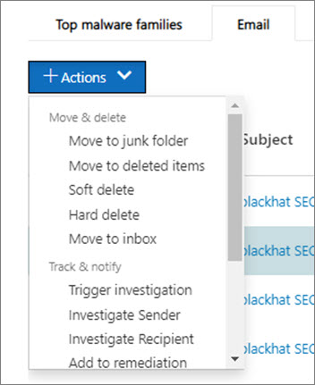

# Cómo funciona la investigación y la respuesta automatizadas en Microsoft defender para Office 365

[!INCLUDE [Microsoft 365 Defender rebranding](../includes/microsoft-defender-for-office.md)]

A medida que se activen las alertas de seguridad, el equipo de operaciones de seguridad será el encargado de consultar esas alertas y tomar las medidas necesarias para proteger su organización. A veces, los equipos de operaciones de seguridad pueden sentirse abrumados por el volumen de alertas que se desencadenan. La funcionalidad de investigación y respuesta automatizada (AIR) de Microsoft defender para Office 365 puede ayudarle.

AIR permite que el equipo de operaciones de seguridad funcione de forma más eficiente y eficaz. Las capacidades de AIR incluyen procesos de investigación automatizada en respuesta a amenazas bien conocidas que existen en la actualidad. Acciones de corrección adecuadas esperando la aprobación, lo que permite al equipo de operaciones de seguridad responder a amenazas detectadas.

En este artículo se describe cómo funciona AIR a través de varios ejemplos. Cuando esté listo para empezar a usar AIR, consulte [investigar y responder automáticamente a amenazas](office-365-air.md).

- [Ejemplo 1: un mensaje de phish notificado por el usuario inicia una guía de investigación](#example-a-user-reported-phish-message-launches-an-investigation-playbook)
- [Ejemplo 2: un administrador de seguridad desencadena una investigación desde el explorador de amenazas](#example-a-security-administrator-triggers-an-investigation-from-threat-explorer)
- [Ejemplo 3: un equipo de operaciones de seguridad integra AIR con su SIEM mediante la API de actividad de administración 365 de Office](#example-a-security-operations-team-integrates-air-with-their-siem-using-the-office-365-management-activity-api)

## Ejemplo: un mensaje de phish notificado por el usuario inicia una guía de investigación

Supongamos que un usuario de su organización recibe un correo electrónico que piensa que es un intento de suplantación de identidad. El usuario, entrenado para informar de estos mensajes, usa el [complemento de mensajes de informe](enable-the-report-message-add-in.md) para enviarlo a Microsoft para su análisis. El envío también se envía a su sistema y es visible en el explorador en la vista **envíos** (antes denominada **"vista notificada por el usuario"** ). Además, el mensaje notificado por el usuario ahora desencadena una alerta informativa basada en el sistema, que inicia automáticamente la guía de la investigación.

Durante la fase de investigación raíz, se evalúan varios aspectos del correo electrónico. Estos aspectos incluyen:

- Una determinación del tipo de amenaza que podría ser;
- Quién lo envió;
- Dónde se envió el correo electrónico desde (infraestructura de envío);
- Si se han entregado o bloqueado otras instancias del correo electrónico;
- Una evaluación de nuestros analistas;
- Si el correo electrónico está asociado con alguna de las campañas conocidas;
- etc.

Una vez completada la investigación raíz, la guía proporciona una lista de las acciones recomendadas que se deben realizar en el correo electrónico original y las entidades asociadas con ella.
  
A continuación, se ejecutan varios pasos de investigación y de búsqueda de amenazas:

- Los mensajes de correo electrónico similares se identifican mediante búsquedas de clúster de correo electrónico.
- La señal se comparte con otras plataformas, como [Microsoft defender para el punto de conexión](https://docs.microsoft.com/windows/security/threat-protection/microsoft-defender-atp/microsoft-defender-advanced-threat-protection).
- Se determina si algún usuario ha hecho clic en cualquier vínculo malintencionado en mensajes de correo electrónico sospechosos.
- Una comprobación se realiza a través de Exchange Online Protection ([EOP](exchange-online-protection-overview.md)) y ([Microsoft Defender para Office 365](office-365-atp.md)) para ver si hay otros mensajes similares que hayan informado los usuarios.
- Se realiza una comprobación para ver si un usuario se ha puesto en peligro. Esta comprobación aprovecha las señales de Office 365, [Microsoft Cloud App Security](https://docs.microsoft.com/cloud-app-security)y [Azure Active Directory](https://docs.microsoft.com/azure/active-directory), correlacionando las anomalías relacionadas con las actividades de los usuarios.

Durante la fase de caza, los riesgos y las amenazas se asignan a varios pasos de caza. 

La corrección es la fase final de la guía. Durante esta fase, se realizan pasos de corrección que se basan en las fases de investigación y de caza. 

## Ejemplo: un administrador de seguridad desencadena una investigación desde el explorador de amenazas

Además de las investigaciones automatizadas que se desencadenan por una alerta, el equipo de operaciones de seguridad de la organización puede desencadenar una investigación automatizada desde una vista en el [Explorador de amenazas](threat-explorer.md).  Esta investigación también crea una alerta, de modo que los incidentes de Microsoft defender y las herramientas de SIEM externa puedan ver que se ha desencadenado esta investigación. 

Por ejemplo, supongamos que usa la vista de **malware** en el explorador. Mediante las pestañas debajo del gráfico, seleccione la pestaña **correo electrónico** . Si selecciona uno o más elementos de la lista, se activa el botón **+ acciones** . 

Mediante el menú **acciones** , puede seleccionar la **investigación de desencadenadores**.

De forma similar a las guías activadas por una alerta, las investigaciones automáticas que se desencadenan desde una vista del explorador incluyen una investigación raíz, pasos para identificar y correlacionar amenazas y las acciones recomendadas para mitigar esas amenazas.

## Ejemplo: un equipo de operaciones de seguridad integra AIR con su SIEM mediante la API de actividad de administración 365 de Office

Las funcionalidades de AIR de Microsoft defender para Office 365 incluyen [informes & detalles](air-view-investigation-results.md) que los equipos de operaciones de seguridad pueden usar para supervisar y solucionar amenazas. Pero también puede integrar las capacidades de AIR con otras soluciones. Algunos ejemplos son un sistema de administración de eventos e información de seguridad (SIEM), un sistema de administración de casos o una solución de informes personalizada. Estos tipos de integraciones se pueden realizar mediante el uso de la [API de actividad de administración 365 de Office](https://docs.microsoft.com/office/office-365-management-api/office-365-management-activity-api-reference). 

Por ejemplo, recientemente, una organización estableció una forma de que su equipo de operaciones de seguridad vea las alertas de phish notificadas por el usuario que ya se procesaron por vía aérea. Su solución integra alertas relevantes con el servidor SIEM de la organización y su sistema de administración de casos. La solución reduce en gran medida el número de falsos positivos para que su equipo de operaciones de seguridad pueda centrar su tiempo y esfuerzo en amenazas reales. Para obtener más información sobre esta solución personalizada, vea blog de la [comunidad tecnológica: mejorar la efectividad de su SOC con Microsoft defender para Office 365 y la API de administración de O365](https://techcommunity.microsoft.com/t5/microsoft-security-and/improve-the-effectiveness-of-your-soc-with-office-365-atp-and/ba-p/1525185).

## Siguientes pasos

- [Empezar a usar AIR](office-365-air.md)

- [Visite el plan de desarrollo de Microsoft 365 para ver lo que se ha planeado y lanzado pronto](https://www.microsoft.com/microsoft-365/roadmap?filters=)

- [Obtenga más información sobre las capacidades de investigación y respuesta automatizadas en Microsoft 365 defender](https://docs.microsoft.com/microsoft-365/security/mtp/mtp-autoir)
