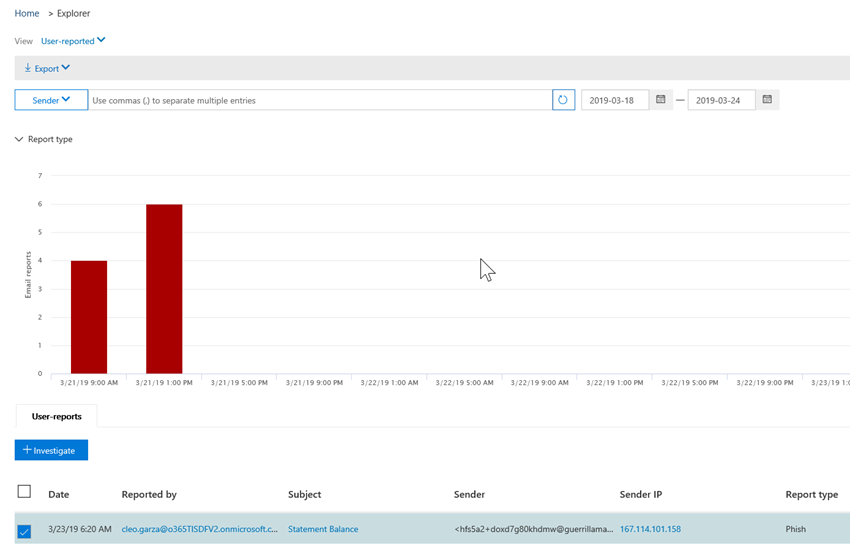

# Investigación y respuesta automatizadas (AIR) en Office 365Automated investigation and response (AIR) in Office 365

A medida que se activen las alertas de seguridad, el equipo de operaciones de seguridad será el encargado de consultar esas alertas y tomar las medidas necesarias para proteger su organización.As security alerts are triggered, it's up to your security operations team to look into those alerts and take steps to protect your organization. A veces, los equipos de operaciones de seguridad pueden sentirse abrumados por el volumen de alertas que se desencadenan.Sometimes, security operations teams can feel overwhelmed by the volume of alerts that are triggered. La funcionalidad de investigación y respuesta automatizada (AIR) de Office 365 puede ser de ayuda.Automated investigation and response (AIR) capabilities in Office 365 can help. AIR permite que el equipo de operaciones de seguridad funcione de forma más eficiente y eficaz.AIR enables your security operations team to operate more efficiently and effectively. Las capacidades de AIR incluyen procesos de investigación automatizada en respuesta a amenazas bien conocidas que existen en la actualidad.AIR capabilities include automated investigation processes in response to well known threats that exist today. Acciones de corrección adecuadas esperando la aprobación, lo que permite al equipo de operaciones de seguridad responder a amenazas detectadas.Appropriate remediation actions await approval, enabling your security operations team to respond to detected threats. 

En este artículo se proporciona información general sobre AIR y sus componentes.This article provides an overview of AIR and its components. Cuando esté listo para empezar a usar AIR, vea [investigar y responder automáticamente a amenazas en Office 365](office-365-air.md).When you're ready to get started using AIR, see [Automatically investigate and respond to threats in Office 365](office-365-air.md).

> [!TIP]
> ¿Tiene Microsoft 365 E5 o Microsoft 365 E3 junto con la protección de la identidad y contra amenazas?Do you have Microsoft 365 E5 or Microsoft 365 E3 together with Identity & Threat Protection? Considere probar la [Protección contra amenazas de Microsoft](../mtp/microsoft-threat-protection.md).Consider trying [Microsoft Threat Protection](../mtp/microsoft-threat-protection.md).

## A un alto nivelAt a high level

A medida que se activen las alertas, las guías de seguridad entrarán en vigor.As alerts are triggered, security playbooks go into effect. En función de la situación, puede comenzar un [proceso de investigación automatizada](https://docs.microsoft.com/microsoft-365/security/office-365-security/office-365-air) .Depending on the situation, an [automated investigation process](https://docs.microsoft.com/microsoft-365/security/office-365-security/office-365-air) can begin. Durante y después de una investigación automatizada, se recomiendan [las acciones de corrección](air-remediation-actions.md) .During and after an automated investigation, [remediation actions](air-remediation-actions.md) are recommended. No se realiza automáticamente ninguna acción en la protección contra amenazas avanzada de Office 365.No actions are taken automatically in Office 365 Advanced Threat Protection. El equipo de operaciones de seguridad revisa y, a continuación, [aprueba o rechaza cada acción de corrección](air-remediation-actions.md#approve-or-reject-pending-actions)y, cuando se lleva a cabo, finaliza cada investigación.Your security operations team reviews, and then [approves or rejects each remediation action](air-remediation-actions.md#approve-or-reject-pending-actions), and when this is done, each investigation completes. Se realiza el seguimiento y la visualización de todas estas actividades en el centro de seguridad & cumplimiento de Office 365 (vea [Ver detalles de una investigación](air-view-investigation-results.md#view-details-of-an-investigation)).All of these activities are tracked and viewable in the Office 365 Security & Compliance Center (see [View details of an investigation](air-view-investigation-results.md#view-details-of-an-investigation)).

En las secciones siguientes se proporcionan más detalles sobre las alertas, las guías de seguridad y ejemplos de aire en funcionamiento.The following sections provide more details about alerts, security playbooks, and examples of AIR in action.

## AlertasAlerts

Las [alertas](../../compliance/alert-policies.md#viewing-alerts) representan desencadenadores de flujos de trabajo del equipo de operaciones de seguridad para respuesta ante incidentes.[Alerts](../../compliance/alert-policies.md#viewing-alerts) represent triggers for security operations team workflows for incident response. Establecer prioridades en el conjunto de alertas adecuadas para la investigación, a la vez que asegurarse de que no hay amenazas sin direcciones, supone un reto.Prioritizing the right set of alerts for investigation, while making sure no threats are unaddressed is challenging. Cuando las investigaciones en las alertas se realizan manualmente, los equipos de operaciones de seguridad deben buscar y correlacionar las entidades (como contenido, dispositivos y usuarios) en riesgo de amenazas.When investigations into alerts are performed manually, Security Operations teams must hunt and correlate entities (such as content, devices and users) at risk from threats. Estas tareas y flujos de trabajo pueden ser muy lentos y implican varias herramientas y sistemas.Such tasks and workflows can be very time consuming and involve multiple tools and systems. Con AIR, la investigación y la respuesta para Office 365 los eventos de seguridad se automatizan haciendo que las alertas de administración de amenazas y seguridad clave desencadenen las guías de respuesta de seguridad automáticamente.With AIR, investigation and response for Office 365 security events are automated by having key security and threat management alerts trigger security response playbooks automatically. 

Actualmente, las alertas generadas a partir de los siguientes tipos de directivas de alerta se investigan automáticamente:Currently for AIR, alerts generated from the following kinds of alert policies are auto-investigated:  

- Se ha detectado un clic en una dirección URL potencialmente malintencionadaA potentially malicious URL click was detected
- Correo electrónico notificado por el usuario como phish \*Email reported by user as phish\*
- Mensajes de correo electrónico que contienen malware quitados después de la entrega \*Email messages containing malware removed after delivery\*
- Mensajes de correo electrónico que contienen direcciones URL de phish quitadas después de la entrega \*Email messages containing phish URLs removed after delivery\*
- Patrones de envío de correo electrónico sospechosos detectados #Suspicious email sending patterns detected#
- El usuario restringió el envío de correo electrónico #User restricted from sending email#

> [!NOTE]
> A las alertas marcadas con un asterisco (\*) se les asigna una gravedad *informativa* en las respectivas directivas de alerta en el centro de seguridad & cumplimiento, con las notificaciones de correo electrónico desactivadas.The alerts marked with an asterisk (\*) are assigned an *Informational* severity in the respective alert policies within the Security & Compliance Center, with email notifications turned off. Las notificaciones por correo electrónico se pueden activar a través de la configuración de la [Directiva de alerta](../../compliance/alert-policies.md#alert-policy-settings).Email notifications can be turned on through [Alert policy configuration](../../compliance/alert-policies.md#alert-policy-settings). Las alertas marcadas con un hash (#) están normalmente disponibles como alertas asociadas con las guías de vista previa pública.Alerts marked with a hash (#) are generally available alerts associated with public preview playbooks.

Para ver las alertas, en el centro de seguridad & cumplimiento, elija **alertas** > **Ver alertas**.To view alerts, in the Security & Compliance Center, choose **Alerts** > **View alerts**. Seleccione una alerta para ver sus detalles y, desde allí, use el vínculo **Ver investigación** para ir a la [investigación](air-view-investigation-results.md#investigation-graph)correspondiente.Select an alert to view its details, and from there, use the **View investigation** link to go to the corresponding [investigation](air-view-investigation-results.md#investigation-graph).  

> [!NOTE]
> Las alertas informativas están ocultas de forma predeterminada en la vista de alertas.Informational alerts are hidden in the alert view by default. Para verlos, cambie el filtrado de alertas para incluir alertas informativas.To see them, change the alert filtering to include informational alerts.

Si su organización administra sus alertas de seguridad a través de un sistema de administración de alertas, un sistema de administración de servicios o un sistema de administración de eventos e información de seguridad (SIEM), puede enviar alertas de Office 365 a ese sistema mediante una notificación por correo electrónico o a través de la [API de actividad de administración de office 365](https://docs.microsoft.com/office/office-365-management-api/office-365-management-activity-api-reference).If your organization manages your security alerts through an alert management system, service management system, or Security Information and Event Management (SIEM) system, you can send Office 365 alerts to that system via either email notification or via the [Office 365 Management Activity API](https://docs.microsoft.com/office/office-365-management-api/office-365-management-activity-api-reference). Las notificaciones de alerta de investigación a través de correo electrónico o API incluyen vínculos para acceder a las alertas en el centro de seguridad & cumplimiento, lo que permite que el administrador de seguridad asignado navegue rápidamente a la investigación.The investigation alert notifications via email or API include links to access the alerts in the Security & Compliance Center, enabling the assigned security administrator to navigate quickly to the investigation.

 

## Guías de seguridadSecurity playbooks

Las guías de seguridad son directivas de back-end que se encuentran en el corazón de la automatización de la protección contra amenazas avanzada de Office y en la protección contra amenazas de Microsoft.Security playbooks are back-end policies that are at the heart of automation in Office Advanced Threat Protection and Microsoft Threat Protection. Las guías de seguridad que se proporcionan en AIR se basan en escenarios comunes de seguridad de todo el mundo y se desarrollan en función de los comentarios de los equipos de operaciones de seguridad.The security playbooks provided in AIR are based on common real-world security scenarios and developed based on feedback from Security Operations teams. Una guía de seguridad se inicia automáticamente cuando se desencadenan alertas específicas dentro de la organización.A security playbook is launched automatically when specific alerts are triggered within your organization. Una vez que se activa la alerta, el sistema de investigación y respuesta automatizada (AIR) ejecuta la guía asociada.Once the alert triggers, the associated playbook is run by the Automated Investigation and Response (AIR) system. La investigación avanza paso a paso por el análisis de la alerta basándose en la guía de la alerta en particular, examinando todos los metadatos asociados (incluidos los mensajes de correo electrónico, usuarios, asuntos, remitentes, etc.).The investigation steps through analysis of the alert based on that particular alert's playbook, looking at all the associated metadata (including email messages, users, subjects, senders, etc.). Basándose en los resultados de la guía de investigación, AIR recomienda un conjunto de acciones que el equipo de seguridad de la organización puede llevar a cabo para controlar y mitigar la amenaza.Based on the investigation playbook's findings, AIR recommends a set of actions that your organization's security team can take to control and mitigate the threat. 

Las guías de seguridad que recibirá con AIR están diseñadas para enfrentarse a las amenazas más frecuentes que las organizaciones detectan actualmente con el correo electrónico.The security playbooks you'll get with AIR are designed to tackle the most frequent threats that organizations encounter today with email. Se basan en la información de las operaciones de seguridad y los equipos de respuesta ante incidentes, incluidos los que ayudan a defender a Microsoft y a los activos de nuestros clientes.They're based on input from Security Operations and Incident Response teams, including those who help defend Microsoft and our customers' assets.

### Las guías de seguridad se implementan en fasesSecurity playbooks are rolling out in phases

Como parte de AIR, las guías de seguridad se implementan en fases.As part of AIR, security playbooks are rolling out in phases. La fase 1 suele estar disponible e incluye varias guías que proporcionan recomendaciones para las acciones que los administradores de seguridad pueden revisar y aprobar:Phase 1 is now generally available and includes several playbooks that provide recommendations for actions that security administrators can review and approve:
- Mensaje de phish notificado por el usuarioUser-reported phish message
- Dirección URL haga clic en cambiar veredictoURL click verdict change
- Malware detectado después de la entrega (ZAP de malware)Malware detected post-delivery (Malware ZAP)
- Phish detectado tras entrega tras entrega (ZAP de Phish)Phish detected post-delivery ZAP (Phish ZAP)

La fase 1 también incluye compatibilidad para las investigaciones de correo electrónico desencadenadas por el administrador (mediante el [Explorador de amenazas](threat-explorer.md)).Phase 1 also includes support for administrator triggered e-mail investigations (using [Threat Explorer](threat-explorer.md)).

La fase 2 está ahora en progreso con las siguientes guías en la **versión preliminar pública**y se proporcionan recomendaciones para acciones y para ayudar a los administradores de seguridad en la investigación de problemas:Phase 2 is now progress with the following playbooks in **public preview**, providing recommendations for actions and aiding security administrators in investigating issues:
- Usuario notificado como comprometida (vista previa pública)User reported as compromised (public preview)

Las guías adicionales se publicarán cuando se completen.Further playbooks will be released as they are completed. Visite el [mapa de ruta de Microsoft 365](https://www.microsoft.com/microsoft-365/roadmap) para ver lo que más está previsto y próximamente.Visit the [Microsoft 365 Roadmap](https://www.microsoft.com/microsoft-365/roadmap) to see what else is planned and coming soon.

### Las guías incluyen investigación y recomendacionesPlaybooks include investigation and recommendations

En AIR, cada guía de seguridad incluye:In AIR, each security playbook includes: 
- una investigación raíz de las entidades de un correo electrónico (archivos, direcciones URL, destinatarios, direcciones IP, etc.)a root investigation of an email's entities (files, URLs, recipients, IP addresses, etc.),
- mayor búsqueda de mensajes de correo electrónico similares recibidos por la organizaciónfurther hunting for similar emails received by the organization 
- pasos que hay que seguir para identificar y correlacionar otras posibles amenazas ysteps taken to identify and correlate other potential threats, and 
- acciones recomendadas de corrección de amenazas.recommended threat remediation actions.

Cada paso de alto nivel incluye una serie de subpasos que se ejecutan para proporcionar una respuesta profunda, detallada y exhaustiva a las amenazas.Each high-level step includes a number of substeps that are executed to provide a deep, detailed, and exhaustive response to threats.

## Ejemplo: un mensaje de phish notificado por el usuario inicia una guía de investigaciónExample: A user-reported phish message launches an investigation playbook

Cuando un usuario de la organización envía un mensaje de correo electrónico y lo notifica a Microsoft mediante el [complemento de mensajes de informe para Outlook o Outlook Web App](enable-the-report-message-add-in.md), el informe también se envía al sistema y es visible en el explorador en la vista notificada por el usuario.When a user in your organization submits an email message and reports it to Microsoft by using the [Report Message add-in for Outlook or Outlook Web App](enable-the-report-message-add-in.md), the report is also sent to your system and is visible in Explorer in the User-reported view. Este mensaje de usuario ha informado ahora de una alerta informativa basada en el sistema, que inicia automáticamente la guía de la investigación.This user-reported message now triggers a system-based informational alert, which automatically launches the investigation playbook.

Durante la fase de investigación raíz, se evalúan varios aspectos del correo electrónico.During the root investigation phase, various aspects of the email are assessed. Entre ellos se incluyen:These include:
- Una determinación del tipo de amenaza que podría ser;A determination about what type of threat it might be;
- Quién lo envió;Who sent it;
- Dónde se envió el correo electrónico desde (infraestructura de envío);Where the email was sent from (sending infrastructure);
- Si se han entregado o bloqueado otras instancias del correo electrónico;Whether other instances of the email were delivered or blocked;
- Una evaluación de nuestros analistas;An assessment from our analysts;
- Si el correo electrónico está asociado con alguna de las campañas conocidas;Whether the email is associated with any known campaigns;
- etc.and more.

Una vez completada la investigación raíz, la guía proporciona una lista de las acciones recomendadas que se deben realizar en el correo electrónico original y las entidades asociadas con ella.After the root investigation is complete, the playbook provides a list of recommended actions to take on the original email and entities associated with it.
  
A continuación, se ejecutan varios pasos de investigación y de búsqueda de amenazas:Next, several threat investigation and hunting steps are executed:

- Los mensajes de correo electrónico similares se identifican mediante búsquedas de clúster de correo electrónico.Similar email messages are identified via email cluster searches.
- La señal se comparte con otras plataformas, como [ATP de Microsoft defender](https://docs.microsoft.com/windows/security/threat-protection/microsoft-defender-atp/microsoft-defender-advanced-threat-protection).The signal is shared with other platforms, such as [Microsoft Defender ATP](https://docs.microsoft.com/windows/security/threat-protection/microsoft-defender-atp/microsoft-defender-advanced-threat-protection).
- Se determina si algún usuario ha hecho clic en cualquier vínculo malintencionado en mensajes de correo electrónico sospechosos.A determination is made on whether any users have clicked through any malicious links in suspicious email messages.
- Una comprobación se realiza a través de Office 365 Exchange Online Protection ([EOP](exchange-online-protection-eop.md)) y de la protección contra amenazas avanzada ([ATP](office-365-atp.md)) de Office 365 para ver si hay otros mensajes similares detectados por los usuarios.A check is done across Office 365 Exchange Online Protection ([EOP](exchange-online-protection-eop.md)) and Office 365 Advanced Threat Protection ([ATP](office-365-atp.md)) to see if there are any other similar messages reported by users.
- Se realiza una comprobación para ver si un usuario se ha puesto en peligro.A check is done to see if a user has been compromised. Esta comprobación aprovecha las señales de Office 365, [Microsoft Cloud App Security](https://docs.microsoft.com/cloud-app-security)y [Azure Active Directory](https://docs.microsoft.com/azure/active-directory), correlacionando las anomalías relacionadas con las actividades de los usuarios.This check leverages signals across Office 365, [Microsoft Cloud App Security](https://docs.microsoft.com/cloud-app-security), and [Azure Active Directory](https://docs.microsoft.com/azure/active-directory), correlating any related user activity anomalies. 

Durante la fase de caza, los riesgos y las amenazas se asignan a varios pasos de caza.During the hunting phase, risks and threats are assigned to various hunting steps. 

La corrección es la fase final de la guía.Remediation is the final phase of the playbook. Durante esta fase, se realizan pasos de corrección que se basan en las fases de investigación y de caza.During this phase, remediation steps are taken, based on the investigation and hunting phases. 

## Ejemplo: un administrador de seguridad desencadena una investigación desde el explorador de amenazasExample: A security administrator triggers an investigation from Threat Explorer

Además de las investigaciones automáticas desencadenadas por una alerta, el equipo de operaciones de seguridad de la organización puede desencadenar una investigación automática desde una vista del [Explorador de amenazas](threat-explorer.md).In addition to automatic investigations that are triggered by an alert, your organization's security operations team can trigger an automatic investigation from a view in [Threat Explorer](threat-explorer.md).

Por ejemplo, supongamos que está viendo datos en el explorador acerca de los mensajes detectados por el usuario.For example, suppose that you are viewing data in Explorer about user-reported messages. Puede seleccionar un elemento de la lista de resultados y, a continuación, hacer clic en **investigar** en el menú Acción (siempre que tenga permisos de corrección apropiados).You can select an item in the list of results, and then click **Investigate** from the action menu (assuming you have appropriate remediation permissions).

Como otro ejemplo, supongamos que está viendo datos sobre los mensajes de correo electrónico que se detectan como que contienen malware y que se detectan varios mensajes de correo electrónico que contienen malware.As another example, suppose you are viewing data about email messages detected as containing malware, and there are several email messages detected as containing malware. Puede seleccionar la pestaña **correo electrónico** , seleccionar uno o más mensajes de correo electrónico y, a continuación, en el menú **acciones** , seleccione **investigar**.You can select the **Email** tab, select one or more email messages, and then, on the **Actions** menu, select **Investigate**. 

De forma similar a las guías activadas por una alerta, las investigaciones automáticas que se desencadenan desde una vista del explorador incluyen una investigación raíz, pasos para identificar y correlacionar amenazas y las acciones recomendadas para mitigar esas amenazas.Similar to playbooks triggered by an alert, automatic investigations that are triggered from a view in Explorer include a root investigation, steps to identify and correlate threats, and recommended actions to mitigate those threats.

## Cómo obtener aireHow to get AIR

Office 365 AIR está incluido en las siguientes suscripciones:Office 365 AIR is included in the following subscriptions:

- Microsoft 365 E5Microsoft 365 E5
- Office 365 E5Office 365 E5
- Protección contra amenazas de MicrosoftMicrosoft Threat Protection
- Protección contra amenazas avanzada de Office 365 (plan 2)Office 365 Advanced Threat Protection Plan 2

Si no tiene ninguna de estas suscripciones, [inicie una prueba gratuita](https://go.microsoft.com/fwlink/p/?LinkID=698279&culture=en-US&country=US).If you don't have any of these subscriptions, [start a free trial](https://go.microsoft.com/fwlink/p/?LinkID=698279&culture=en-US&country=US).

Para obtener más información acerca de la disponibilidad de características, visite la [característica disponibilidad en los planes de protección contra amenazas avanzada (ATP)](https://docs.microsoft.com/office365/servicedescriptions/office-365-advanced-threat-protection-service-description#feature-availability-across-advanced-threat-protection-atp-plans).To learn more about feature availability, visit the [Feature availability across Advanced Threat Protection (ATP) plans](https://docs.microsoft.com/office365/servicedescriptions/office-365-advanced-threat-protection-service-description#feature-availability-across-advanced-threat-protection-atp-plans).

## Permisos necesarios para usar capacidades de AIRRequired permissions to use AIR capabilities

Los permisos se conceden a través de determinadas funciones, como las que se describen en la tabla siguiente:Permissions are granted through certain roles, such as those that are described in the following table: 

|TareaTask |Roles necesariosRole(s) required |
|--|--|
|Para configurar las características de AIRTo set up AIR features |Una de las siguientes funciones:One of the following roles:  - **Administrador global**- **Global Administrator** - **Administrador de seguridad**- **Security Administrator**  Estos roles se pueden asignar en [Azure Active Directory](https://docs.microsoft.com/azure/active-directory/users-groups-roles/directory-assign-admin-roles) o en el [centro de seguridad & cumplimiento de Office 365](https://docs.microsoft.com/microsoft-365/security/office-365-security/permissions-in-the-security-and-compliance-center).These roles can be assigned in [Azure Active Directory](https://docs.microsoft.com/azure/active-directory/users-groups-roles/directory-assign-admin-roles) or in the [Office 365 Security & Compliance Center](https://docs.microsoft.com/microsoft-365/security/office-365-security/permissions-in-the-security-and-compliance-center). |
|Para aprobar o rechazar las acciones recomendadasTo approve or reject recommended actions|Una de las siguientes funciones, asignada en [Azure Active Directory](https://docs.microsoft.com/azure/active-directory/users-groups-roles/directory-assign-admin-roles) o en el [centro de seguridad & cumplimiento de Office 365](https://docs.microsoft.com/microsoft-365/security/office-365-security/permissions-in-the-security-and-compliance-center)):One of the following roles, assigned in [Azure Active Directory](https://docs.microsoft.com/azure/active-directory/users-groups-roles/directory-assign-admin-roles) or in the [Office 365 Security & Compliance Center](https://docs.microsoft.com/microsoft-365/security/office-365-security/permissions-in-the-security-and-compliance-center)): - **Administrador global**- **Global Administrator**  - **Administrador de seguridad**- **Security Administrator** - **Lector de seguridad**- **Security Reader**  --- y ------ and --- - **Búsqueda y depuración** (este rol solo se asigna en el [centro de cumplimiento de & de seguridad de Office 365](https://docs.microsoft.com/microsoft-365/security/office-365-security/permissions-in-the-security-and-compliance-center).- **Search and Purge** (this role is assigned only in the [Office 365 Security & Compliance Center](https://docs.microsoft.com/microsoft-365/security/office-365-security/permissions-in-the-security-and-compliance-center). Es posible que tenga que crear un nuevo grupo de funciones y agregar el rol de búsqueda y depuración al nuevo grupo de roles.You might have to create a new role group there and add the Search and Purge role to that new role group.)

## Pasos siguientesNext steps

- [Introducción al uso de AIR en Office 365Get started using AIR in Office 365](office-365-air.md)

- [Visite el plan de desarrollo de Microsoft 365 para ver lo que estará próximamente y que se implementaráVisit the Microsoft 365 Roadmap to see what's coming soon and rolling out](https://www.microsoft.com/microsoft-365/roadmap?filters=)

