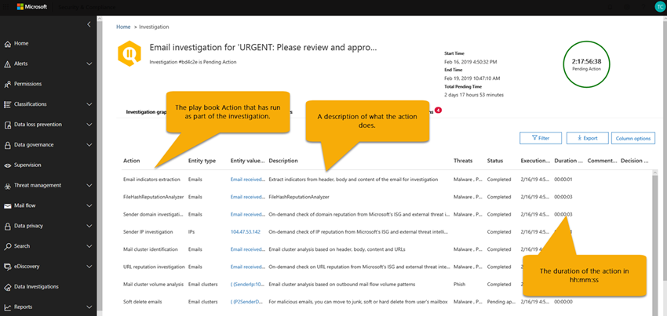

# Investigación y respuesta automatizadas (AIR) en Office 365

Las capacidades de investigación y respuesta automatizadas (AIR) le permiten ejecutar procesos de investigación automatizada en respuesta a amenazas bien conocidas que existen actualmente. AIR puede ayudar al equipo de operaciones de seguridad a operar de manera más eficiente y efectiva.
- Para obtener información general sobre cómo funciona AIR, use este artículo.
- Para empezar a usar AIR, consulte [investigar y responder automáticamente a amenazas en Office 365](office-365-air.md).

> [!TIP]
> ¿Tiene Microsoft 365 E5 o Microsoft 365 E3 junto con la protección de la identidad y contra amenazas? Considere probar la [Protección contra amenazas de Microsoft](../mtp/microsoft-threat-protection.md).

## Flujo general de aire

En un nivel alto, el flujo de aire funciona de la siguiente manera:

|Fase  |Qué implica  |
|---------|---------|
|1      |Un evento de Office desencadena una [alerta](#alerts) y una guía de [seguridad](#security-playbooks) inicia una investigación automatizada de las alertas seleccionadas.   Como alternativa, un analista de seguridad puede [iniciar una investigación automatizada manualmente](#example-a-security-administrator-triggers-an-investigation-from-threat-explorer)desde un correo electrónico desde el [Explorador](threat-explorer.md).        |
|2      |Mientras se ejecuta una investigación automatizada, recopila datos adicionales sobre el correo electrónico y las entidades relacionadas con ese correo electrónico: archivos, direcciones URL y destinatarios.  El ámbito de la investigación puede aumentar, a medida que se desencadenen nuevas alertas relacionadas.         |
|3      |Durante y después de una investigación automatizada, [los detalles y los resultados](#investigation-graph) están disponibles para su visualización. Los resultados incluyen [acciones recomendadas](#recommended-actions) que se pueden llevar a cabo para responder y corregir cualquier amenaza que se detectó. Además, hay disponible un registro de la [Guía](#playbook-log) que realiza un seguimiento de la actividad de la investigación.  Si su organización usa una solución de informes personalizada o una solución de terceros, puede [usar la API de actividad de administración de Office 365](office-365-air.md#use-the-office-365-management-activity-api-for-custom-or-third-party-reporting-solutions) para ver información sobre las amenazas y las investigaciones automatizadas.         |
|4      |El equipo de operaciones de seguridad revisa los resultados de la investigación y las recomendaciones y aprueba las acciones de corrección. En Office 365, las acciones de corrección solo se realizan tras la aprobación del equipo de seguridad de la organización.         |

En las secciones siguientes se proporcionan más detalles sobre el aire, incluidos detalles sobre las alertas, las guías de seguridad y los detalles de la investigación. Además, se incluyen dos ejemplos de cómo funciona AIR en este artículo. Para empezar a usar AIR, consulte [investigar y responder automáticamente a amenazas en Office 365](office-365-air.md).

## Alertas

Las [alertas](../../compliance/alert-policies.md#viewing-alerts) representan desencadenadores de flujos de trabajo del equipo de operaciones de seguridad para respuesta ante incidentes. Establecer prioridades en el conjunto de alertas adecuadas para la investigación, a la vez que asegurarse de que no hay amenazas sin direcciones, supone un reto. Cuando las investigaciones en las alertas se realizan manualmente, los equipos de operaciones de seguridad deben buscar y correlacionar las entidades (como contenido, dispositivos y usuarios) en riesgo de amenazas. Estas tareas y flujos de trabajo pueden ser muy lentos y implican varias herramientas y sistemas. Con AIR, la investigación y la respuesta para Office 365 los eventos de seguridad se automatizan haciendo que las alertas de administración de amenazas y seguridad clave desencadenen las guías de respuesta de seguridad automáticamente. 

Actualmente, las alertas generadas a partir de los siguientes tipos de directivas de alerta se investigan automáticamente:  

- Se ha detectado un clic en una dirección URL potencialmente malintencionada
- Correo electrónico notificado por el usuario como phish *
- Mensajes de correo electrónico que contienen malware quitados después de la entrega *
- Mensajes de correo electrónico que contienen direcciones URL de phish quitadas después de la entrega *
- Patrones de envío de correo electrónico sospechosos detectados #
- El usuario restringió el envío de correo electrónico #

> [!NOTE]
> A las alertas marcadas con un asterisco (*) se les asigna una gravedad *informativa* en las respectivas directivas de alerta en el centro de seguridad & cumplimiento, con las notificaciones de correo electrónico desactivadas. Las notificaciones por correo electrónico se pueden activar a través de la configuración de la [Directiva de alerta](../../compliance/alert-policies.md#alert-policy-settings). Las alertas marcadas con un hash (#) están normalmente disponibles como alertas asociadas con las guías de vista previa pública.

Para ver las alertas, en el centro de seguridad & cumplimiento, elija **alertas** > **Ver alertas**. Seleccione una alerta para ver sus detalles y, desde allí, use el vínculo **Ver investigación** para ir a la [investigación](#investigation-graph)correspondiente.  

> [!NOTE]
> Las alertas informativas están ocultas de forma predeterminada en la vista de alertas. Para verlos, cambie el filtrado de alertas para incluir alertas informativas.

Si su organización administra sus alertas de seguridad a través de un sistema de administración de alertas, un sistema de administración de servicios o un sistema de administración de eventos e información de seguridad (SIEM), puede enviar alertas de Office 365 a ese sistema mediante una notificación por correo electrónico o a través de la [API de actividad de administración de office 365](https://docs.microsoft.com/office/office-365-management-api/office-365-management-activity-api-reference). Las notificaciones de alerta de investigación a través de correo electrónico o API incluyen vínculos para acceder a las alertas en el centro de seguridad & cumplimiento, lo que permite que el administrador de seguridad asignado navegue rápidamente a la investigación.

 

## Guías de seguridad

Las guías de seguridad son directivas de back-end que se encuentran en el corazón de la automatización de la protección contra amenazas avanzada de Office y en la protección contra amenazas de Microsoft. Las guías de seguridad que se proporcionan en AIR se basan en escenarios comunes de seguridad de todo el mundo y se desarrollan en función de los comentarios de los equipos de operaciones de seguridad. Una guía de seguridad se inicia automáticamente cuando se desencadenan alertas específicas dentro de la organización. Una vez que se activa la alerta, el sistema de investigación y respuesta automatizada (AIR) ejecuta la guía asociada. La investigación avanza paso a paso por el análisis de la alerta basándose en la guía de la alerta en particular, examinando todos los metadatos asociados (incluidos los mensajes de correo electrónico, usuarios, asuntos, remitentes, etc.). Basándose en los resultados de la guía de investigación, AIR recomienda un conjunto de acciones que el equipo de seguridad de la organización puede llevar a cabo para controlar y mitigar la amenaza. 

Las guías de seguridad que recibirá con AIR están diseñadas para enfrentarse a las amenazas más frecuentes que las organizaciones detectan actualmente con el correo electrónico. Se basan en la información de las operaciones de seguridad y los equipos de respuesta ante incidentes, incluidos los que ayudan a defender a Microsoft y a los activos de nuestros clientes.

### Las guías de seguridad se implementan en fases

Como parte de AIR, las guías de seguridad se implementan en fases. La fase 1 suele estar disponible e incluye varias guías que proporcionan recomendaciones para las acciones que los administradores de seguridad pueden revisar y aprobar:
- Mensaje de phish notificado por el usuario
- Dirección URL haga clic en cambiar veredicto
- Malware detectado después de la entrega (ZAP de malware)
- Phish detectado tras entrega tras entrega (ZAP de Phish)

La fase 1 también incluye compatibilidad para las investigaciones de correo electrónico desencadenadas por el administrador (mediante el [Explorador de amenazas](threat-explorer.md)).

La fase 2 está ahora en progreso con las siguientes guías en la **versión preliminar pública**y se proporcionan recomendaciones para acciones y para ayudar a los administradores de seguridad en la investigación de problemas:
- Usuario notificado como comprometida (vista previa pública)

Las guías adicionales se publicarán cuando se completen. Visite el [mapa de ruta de Microsoft 365](https://www.microsoft.com/microsoft-365/roadmap) para ver lo que más está previsto y próximamente.

### Las guías incluyen investigación y recomendaciones

En AIR, cada guía de seguridad incluye: 
- una investigación raíz de las entidades de un correo electrónico (archivos, direcciones URL, destinatarios, direcciones IP, etc.)
- mayor búsqueda de mensajes de correo electrónico similares recibidos por la organización 
- pasos que hay que seguir para identificar y correlacionar otras posibles amenazas y 
- acciones recomendadas de corrección de amenazas.

Cada paso de alto nivel incluye una serie de subpasos que se ejecutan para proporcionar una respuesta profunda, detallada y exhaustiva a las amenazas.

## Investigaciones automatizadas

La página investigaciones automatizadas muestra las investigaciones de su organización y sus Estados actuales.

 
  
Puede:
- Vaya directamente a una investigación (seleccione un **identificador de investigación**).
- Aplicar filtros. Elija entre el **tipo de investigación**, **el intervalo de tiempo**, el **Estado**o una combinación de estos.
- Exporte los datos a un archivo. csv.

El estado de la investigación indica el progreso del análisis y las acciones. A medida que se ejecuta la investigación, el estado cambia para indicar si se han encontrado amenazas y si se han aprobado las acciones. 

|Estado  |Qué significa  |
|---------|---------|
|Iniciando | La investigación se pone en cola para comenzar pronto |
|En funcionamiento | La investigación se ha iniciado y está llevando a cabo el análisis. |
|No se encontraron amenazas | La investigación ha completado el análisis y no se han encontrado amenazas |
|Finalizado por el sistema | La investigación no se cerró y caducó después de 7 días |
|Acción pendiente | La investigación detectó amenazas con acciones recomendadas.  La investigación continúa ejecutándose después de haber encontrado las amenazas iniciales y las acciones recomendadas, por lo que debe comprobar el registro antes de aprobar las acciones para ver si los analizadores todavía están en curso. |
|Amenazas encontradas | La investigación detectó amenazas, pero las amenazas no tienen acciones disponibles en el aire.  Estas son las acciones del usuario en las que aún no hay ninguna acción de la dirección del aire. |
|Corregido | La investigación ha finalizado y se ha corregido completamente (se han aprobado todas las acciones) |
|Parcialmente remediado | La investigación ha finalizado y algunas de las acciones recomendadas se han aprobado |
|Finalizada por el usuario | Un administrador terminó la investigación. |
|Failed | Se ha producido un error durante la investigación que ha evitado que se alcance una conclusión en las amenazas |
|En cola por limitación | La investigación está esperando el análisis debido a las limitaciones del procesamiento del sistema (para proteger el rendimiento del servicio) |
|Terminado con la limitación | La investigación no se pudo completar en el tiempo suficiente debido a las limitaciones de procesamiento del sistema y el volumen de investigación. Puede reactivar la investigación seleccionando el correo electrónico en el explorador y seleccionando la acción investigar. |

### Gráfico de investigación

Al abrir una investigación específica, verá la página gráfico de investigación. En esta página se muestran todas las entidades distintas: mensajes de correo electrónico, usuarios (y sus actividades) y dispositivos que se investigaron automáticamente como parte de la alerta que se activó.

Puede:
- Obtenga información general visual de la investigación actual.
- Ver un resumen de la duración de la investigación.
- Seleccione un nodo de la visualización para ver los detalles de ese nodo.
- Seleccione una pestaña en la parte superior para ver los detalles de esa pestaña.

### Investigación de alertas

En la pestaña **alertas** de una investigación, puede ver las alertas relevantes para la investigación. Los detalles incluyen la alerta que desencadenó la investigación y otras alertas correlacionadas, como el inicio de sesión peligroso, las infracciones de directivas de DLP, etc., que están relacionadas con la investigación. En esta página, un analista de seguridad también puede ver detalles adicionales de alertas individuales.

Puede:
- Obtenga información general visual de la alerta desencadenadora actual y de cualquier alerta asociada.
- Seleccione una alerta de la lista para abrir una página emergente que muestre los detalles de la alerta completa.

### Investigación de correo electrónico

En la pestaña **correo electrónico** de una investigación, puede ver los correos electrónicos originales y los clústeres de correo electrónico similar identificados como parte de la investigación. 

Dado el volumen total de correo electrónico que los usuarios de una organización envían y reciben, además de la naturaleza multiusuario de las comunicaciones y los ataques de correo electrónico, el proceso de 
- agrupación de mensajes de correo electrónico en función de atributos similares de un encabezado, cuerpo, dirección URL y datos adjuntos del mensaje; 
- separar el correo electrónico malintencionado del correo electrónico bueno; y 
- realizar acciones en mensajes de correo electrónico malintencionados 

puede tardar mucho tiempo. AIR ahora automatiza este proceso, lo que ahorra tiempo y esfuerzo del equipo de seguridad de su organización. 

Se pueden identificar dos tipos diferentes de clústeres de correo electrónico durante el paso de análisis de correo electrónico: clústeres de similitud y clústeres de indicadores. 
- Los clústeres de similitud son mensajes de correo electrónico que se identifican mediante la búsqueda de correos electrónicos con atributos de remitente y contenido similares. Estos clústeres se evalúan para contenido malintencionado en función de las comprobaciones de detección originales. Los clústeres de correo electrónico que contienen suficientes detecciones de correo malintencionado se consideran malintencionados.
- Los clústeres de indicadores son mensajes de correo electrónico que se identifican mediante la búsqueda de la misma entidad de indicador (hash de archivo o dirección URL) del correo electrónico original. Cuando la entidad de archivo/URL original se identifica como malintencionada, AIR aplica el veredicto del indicador a todo el clúster de mensajes de correo electrónico que contengan esa entidad. Un archivo identificado como malware significa que el clúster de mensajes de correo electrónico que contiene ese archivo se trata como mensajes de correo electrónico de malware.

El objetivo de la agrupación en clústeres es buscar y encontrar otros mensajes de correo electrónico relacionados que envía el mismo remitente como parte de un ataque o una campaña.  En algunos casos, el correo electrónico legítimo puede desencadenar una investigación (por ejemplo, un usuario informa de un correo electrónico de marketing).  En estos escenarios, el clúster de correo electrónico debe identificar que los clústeres de correo electrónico no son malintencionados; cuando lo hace correctamente, **no** indicará una amenaza ni recomendará la eliminación del correo electrónico.

La pestaña **correo** electrónico también muestra los elementos de correo electrónico relacionados con la investigación, como los detalles de correo electrónico notificados por el usuario, el correo electrónico original que se ha notificado, los mensajes de correo electrónico que se han zapped debido a malware/phish, etc.

El recuento de correo electrónico identificado en la ficha correo electrónico representa actualmente la suma total de todos los mensajes de correo electrónico que se muestran en la ficha **correo electrónico** . Como los mensajes de correo electrónico están presentes en varios clústeres, el número total real de mensajes de correo electrónico identificados (y afectados por acciones de corrección) es el número de mensajes de correo electrónico únicos que aparecen en todos los mensajes de correo electrónico de los destinatarios y los clústeres originales. 

Tanto Explorer como AIR cuentan los mensajes de correo electrónico por destinatario, ya que los veredictos de seguridad, las acciones y las ubicaciones de entrega varían según cada destinatario. Por lo tanto, un correo electrónico original enviado a tres usuarios cuenta como un total de tres mensajes de correo electrónico en lugar de un mensaje de correo electrónico. Nota puede haber casos en los que un mensaje de correo se cuente dos o más veces, ya que el correo electrónico puede tener varias acciones en él y puede haber varias copias del correo electrónico una vez que se produzcan todas las acciones. Por ejemplo, un correo electrónico de malware que se detecta al entregar puede dar como resultado un correo electrónico bloqueado (en cuarentena) y un correo electrónico reemplazado (el archivo de amenaza se reemplaza con un archivo de advertencia y, a continuación, se entrega en el buzón del usuario). Dado que hay literalmente dos copias del correo electrónico en el sistema, es posible que ambas se cuenten en el recuento de clústeres. 

Los recuentos de correo electrónico se calculan en el momento de la investigación y algunos recuentos se vuelven a calcular al abrir controles flotantes de investigación (según una consulta subyacente). Los recuentos de correo electrónico que se muestran para los clústeres de correo electrónico en la ficha correo electrónico y el valor de cantidad de correo electrónico que se muestra en el control flotante de clúster se calculan en el momento de la investigación y no cambian. El recuento de correo electrónico que se muestra en la parte inferior de la ficha correo electrónico del control flotante del clúster de correo electrónico y el número de mensajes de correo electrónico que se muestran en el explorador reflejan los mensajes de correo electrónico recibidos después del análisis inicial de la investigación. Por lo tanto, un clúster de correo electrónico que muestra una cantidad original de 10 mensajes de correo electrónico mostraría un total de 15 en la lista de correo electrónico a menos de 15 mensajes de correo electrónico entre la fase de análisis de la investigación y cuando el administrador Revise la investigación.  Asimismo, las investigaciones antiguas pueden comenzar con recuentos mayores que las consultas del explorador, ya que ATP P2 expira los datos después de 7 días para las pruebas y 30 días para las licencias de pago.  Mostrar recuentos históricos y actuales en vistas diferentes se realiza para indicar el impacto del correo electrónico en el momento de la investigación y el impacto actual hasta el momento en que se ejecuta la corrección.

Como ejemplo, considere el siguiente escenario. El primer clúster de tres mensajes de correo electrónico se consideró phish. Se ha encontrado otro clúster de mensajes similares con la misma dirección IP y asunto, y se ha considerado malintencionado, ya que algunos de ellos se identificaron como phish durante la detección inicial. 

Puede:
- Obtenga información general visual de los resultados y amenazas de clúster actuales encontrados.
- Haga clic en una entidad de clúster o en una lista de amenazas para abrir una página emergente que muestre los detalles de alerta completos.
- Para investigar más detalladamente el clúster de correo electrónico, haga clic en el vínculo "abrir en el explorador" que se encuentra en la parte superior de la pestaña "detalles del clúster de correo electrónico"

> [!NOTE]
> En el contexto del correo electrónico, es posible que vea una superficie de amenaza con anomalías de volumen como parte de la investigación. Una anomalía de volumen indica un pico en mensajes de correo electrónico similares en torno a la hora del evento de investigación en comparación con los plazos anteriores. Este pico en el tráfico de correo electrónico con características similares (por ejemplo, el asunto y el dominio del remitente, la similitud de cuerpo y la IP del remitente) es el principio del inicio de las campañas de correo electrónico o de los ataques. Sin embargo, las campañas de correo electrónico masivos, de correo no deseado y legítimas suelen compartir estas características. Las anomalías de volumen representan una amenaza potencial y, en consecuencia, podrían ser menos graves en comparación con amenazas de malware o phish identificadas mediante motores antivirus, detonación o reputación malintencionada.

### Investigación del usuario

En la pestaña **usuarios** , puede ver todos los usuarios identificados como parte de la investigación. Las cuentas de usuario aparecen en la investigación cuando hay un evento o una indicación de que esas cuentas de usuario podrían verse afectadas o en peligro.

Por ejemplo, en la siguiente imagen, AIR ha identificado indicadores de peligro y anomalías en función de una nueva regla de bandeja de entrada creada. Hay disponibles detalles adicionales (evidencia) de la investigación en vistas detalladas de esta ficha. los indicadores de exposición y anomalías también pueden incluir detecciones de anomalías de [Microsoft Cloud App Security](https://docs.microsoft.com/cloud-app-security).

Puede:
- Obtenga una introducción visual de los resultados de usuario identificados y los riesgos encontrados.
- Seleccione un usuario para abrir una página emergente que muestre todos los detalles de la alerta.

### Investigación de máquina

En la pestaña **máquinas** , puede ver todos los equipos identificados como parte de la investigación. 

Como parte de las guías, AIR correlaciona las amenazas de correo electrónico con los dispositivos (por ejemplo, malware zapped). Por ejemplo, una investigación pasa un hash de archivo malintencionado entre en [Microsoft defender ATP](https://docs.microsoft.com/windows/security/threat-protection/microsoft-defender-atp/microsoft-defender-advanced-threat-protection
) para investigar. Esto permite la investigación automatizada de las máquinas pertinentes para los usuarios, para ayudar a garantizar que las amenazas se dirijan en la nube y en los extremos. 

Puede:
- Obtenga información general visual de las amenazas y los equipos actuales encontrados.
- Seleccione un equipo para abrir una vista en la investigación de [ATP de Microsoft defender](https://docs.microsoft.com/windows/security/threat-protection/microsoft-defender-atp/automated-investigations) relacionada en el centro de seguridad de Microsoft defender.

### Investigación de entidades

En la pestaña **entidades** , puede ver las entidades identificadas y analizadas como parte de la investigación. 

Aquí, puede ver las entidades investigadas y los detalles de los tipos de entidades, como los mensajes de correo electrónico, los clústeres, las direcciones IP, los usuarios, etc. También puede ver cuántas entidades se han analizado y las amenazas que se han asociado a cada una de ellas. 

Puede:
- Obtenga información general visual de las entidades de investigación y las amenazas encontradas.
- Seleccione una entidad para abrir una página emergente que muestre los detalles de la entidad relacionada.

### Registro de la guía

En la pestaña **registro** , puede ver todos los pasos de la guía que se han producido durante la investigación. El registro captura un inventario completo de todos los analizadores y las acciones completadas por las capacidades de investigación automática de Office 365 como parte del aire. Proporciona una vista clara de todos los pasos realizados, incluida la propia acción, una descripción y la duración de la real desde el principio hasta el final. 

Puede:
- Vea una descripción general visual de los pasos de la guía realizados.
- Exporte los resultados a un archivo CSV.
- Filtrar la vista.

|Análisis | Descripción |
|-----|-----|
|Investigación de violaciones de DLP |Investigue las infracciones detectadas por la prevención de pérdida de datos (DLP) de [Office 365](../../compliance/data-loss-prevention-policies.md) |
|Extracción de indicadores de correo electrónico |Extraer indicadores desde el encabezado, el cuerpo y el contenido de un mensaje de correo electrónico para su investigación |
|Reputación de hash de archivo |Detectar anomalías en función de los hash de archivo para los usuarios y equipos de la organización |
|Identificación del clúster de correo |Análisis del clúster de correo electrónico basado en el encabezado, el cuerpo, el contenido y las direcciones URL |
|Análisis del volumen del clúster de correo |Análisis de clúster de correo electrónico basado en patrones de volumen de flujo de correo saliente |
|Investigación de delegación de correo |Investigar el acceso de delegación de correo para los buzones de usuario relacionados con esta investigación |
|Investigación de reglas de reenvío de correo |Investigar las reglas de reenvío de correo de los buzones de usuario relacionados con esta investigación |
|Malware detectado que ha perdido |Detectar malware omitido entregado al buzón del usuario en su organización |
|Detonación a petición |Detonación a petición activado para mensajes de correo electrónico, datos adjuntos y direcciones URL |
|Investigación de anomalías de correo saliente |Detectar anomalías basadas en patrones de envío de flujo de correo históricos para los usuarios de la organización |
|Investigación de anomalías de correo no deseado y de malware saliente |Detección de malware, phish o correo no deseado dentro de la organización y salientes procedentes de los usuarios de la organización |
|Investigación del dominio del remitente |Comprobación bajo demanda de la reputación del dominio del [gráfico de seguridad inteligente de Microsoft](https://www.microsoft.com/security/operations/intelligence) y orígenes de inteligencia de amenazas externos |
|Investigación de IP del remitente | Comprobación bajo demanda de la reputación de IP del [gráfico de seguridad inteligente de Microsoft](https://www.microsoft.com/security/operations/intelligence) y orígenes de inteligencia de amenazas externos |
|URL hace clic en investigación | Investigar los clics de los usuarios protegidos por los [vínculos seguros de ATP de Office 365](atp-safe-links.md) en su organización |
|Investigación de reputación de dirección URL |Comprobación bajo demanda de reputación de dirección URL del [gráfico de seguridad inteligente de Microsoft](https://www.microsoft.com/security/operations/intelligence) y orígenes de inteligencia de amenazas externos |
|Investigación de actividad de usuario |Analizar anomalías de actividad de usuario en [Microsoft Cloud App Security](https://docs.microsoft.com/cloud-app-security/what-is-cloud-app-security) |
|Extracción de indicadores de correo electrónico notificados por el usuario |Extraer indicadores del encabezado, el cuerpo y el contenido del [correo electrónico notificado](enable-the-report-message-add-in.md) por el usuario para su investigación |

### Acciones recomendadas

En la ficha **acciones** , puede ver todas las acciones de la guía que se recomiendan para la corrección después de que la investigación haya finalizado. 

Acciones Capture los pasos que Microsoft recomienda realizar al final de una investigación. Puede realizar acciones de corrección aquí si selecciona una o varias acciones. Al hacer clic en **aprobar** se permite comenzar la corrección. (Es necesario disponer de los permisos adecuados: el rol "buscar y purgar" es necesario para ejecutar acciones desde el explorador y el aire). Por ejemplo, un lector de seguridad puede ver las acciones pero no aprobarlas. Nota: no es necesario aprobar todas las acciones. Si no está de acuerdo con la acción recomendada o su organización no elige determinados tipos de acciones, puede optar por **rechazar** las acciones o simplemente omitirlas y no realizar ninguna acción. La aprobación o el rechazo de todas las acciones permite que la investigación se cierre completamente (el estado pasa a ser corregido), mientras que dejar algunas acciones incompletas da como resultado un cambio en el estado de la investigación a un estado parcialmente corregido.

Puede:
- Obtenga información general visual de las acciones recomendadas de la guía.
- Seleccione una sola acción o varias acciones.
- Aprobar o rechazar acciones recomendadas con comentarios.
- Exporte los resultados a un archivo CSV.
- Filtrar la vista.

## Acciones de corrección

Cuando se ejecuta una investigación automatizada o se ha completado, normalmente verá una o más acciones de corrección. En la siguiente tabla se enumeran las posibles acciones de corrección de Office 365 AIR.

|Acción | Descripción |
|-----|-----|
|Bloquear URL (tiempo de clic) |Protéjase contra mensajes de correo electrónico y documentos que contienen direcciones URL malintencionadas. Esto permite el bloqueo de vínculos malintencionados y de todas las páginas web relacionadas a través de [vínculos seguros](atp-safe-links.md) cuando el usuario hace clic en un vínculo de un archivo existente de Office o en un mensaje de correo electrónico anterior. |
|Correo electrónico de eliminación de software  |Eliminar temporalmente mensajes de correo electrónico específicos del buzón de un usuario|
|Eliminación temporal de clústeres de correo electrónico  |Eliminación temporal de mensajes de correo malintencionado que coinciden con una consulta de los buzones de todos los usuarios|
|Desactivar el reenvío de correo externo |Quita la regla de reenvío del buzón de un usuario final específico.|

## Ejemplo: un mensaje de phish notificado por el usuario inicia una guía de investigación

Cuando un usuario de la organización envía un mensaje de correo electrónico y lo notifica a Microsoft mediante el [complemento de mensajes de informe para Outlook o Outlook Web App](enable-the-report-message-add-in.md), el informe también se envía al sistema y es visible en el explorador en la vista notificada por el usuario. Este mensaje de usuario ha informado ahora de una alerta informativa basada en el sistema, que inicia automáticamente la guía de la investigación.

Durante la fase de investigación raíz, se evalúan varios aspectos del correo electrónico. Entre ellos se incluyen:
- Una determinación del tipo de amenaza que podría ser;
- Quién lo envió;
- Dónde se envió el correo electrónico desde (infraestructura de envío);
- Si se han entregado o bloqueado otras instancias del correo electrónico;
- Una evaluación de nuestros analistas;
- Si el correo electrónico está asociado con alguna de las campañas conocidas;
- etc.

Una vez completada la investigación raíz, la guía proporciona una lista de las acciones recomendadas que se deben realizar en el correo electrónico original y las entidades asociadas con ella.
  
A continuación, se ejecutan varios pasos de investigación y de búsqueda de amenazas:

- Los mensajes de correo electrónico similares se identifican mediante búsquedas de clúster de correo electrónico.
- La señal se comparte con otras plataformas, como [ATP de Microsoft defender](https://docs.microsoft.com/windows/security/threat-protection/microsoft-defender-atp/microsoft-defender-advanced-threat-protection).
- Se determina si algún usuario ha hecho clic en cualquier vínculo malintencionado en mensajes de correo electrónico sospechosos.
- Una comprobación se realiza a través de Office 365 Exchange Online Protection ([EOP](exchange-online-protection-eop.md)) y de la protección contra amenazas avanzada ([ATP](office-365-atp.md)) de Office 365 para ver si hay otros mensajes similares detectados por los usuarios.
- Se realiza una comprobación para ver si un usuario se ha puesto en peligro. Esta comprobación aprovecha las señales de Office 365, [Microsoft Cloud App Security](https://docs.microsoft.com/cloud-app-security)y [Azure Active Directory](https://docs.microsoft.com/azure/active-directory), correlacionando las anomalías relacionadas con las actividades de los usuarios. 

Durante la fase de caza, los riesgos y las amenazas se asignan a varios pasos de caza. 

La corrección es la fase final de la guía. Durante esta fase, se realizan pasos de corrección que se basan en las fases de investigación y de caza. 

## Ejemplo: un administrador de seguridad desencadena una investigación desde el explorador de amenazas

Además de las investigaciones automáticas desencadenadas por una alerta, el equipo de operaciones de seguridad de la organización puede desencadenar una investigación automática desde una vista del [Explorador de amenazas](threat-explorer.md).

Por ejemplo, supongamos que está viendo datos en el explorador acerca de los mensajes detectados por el usuario. Puede seleccionar un elemento de la lista de resultados y, a continuación, hacer clic en **investigar** en el menú Acción (siempre que tenga permisos de corrección apropiados).

Como otro ejemplo, supongamos que está viendo datos sobre los mensajes de correo electrónico que se detectan como que contienen malware y que se detectan varios mensajes de correo electrónico que contienen malware. Puede seleccionar la pestaña **correo electrónico** , seleccionar uno o más mensajes de correo electrónico y, a continuación, en el menú **acciones** , seleccione **investigar**. 

De forma similar a las guías activadas por una alerta, las investigaciones automáticas que se desencadenan desde una vista del explorador incluyen una investigación raíz, pasos para identificar y correlacionar amenazas y las acciones recomendadas para mitigar esas amenazas.

## Cómo obtener aire

Office 365 AIR está incluido en las siguientes suscripciones:

- Microsoft 365 E5
- Office 365 E5
- Protección contra amenazas de Microsoft
- Protección contra amenazas avanzada de Office 365 (plan 2)

Si no tiene ninguna de estas suscripciones, [inicie una prueba gratuita](https://go.microsoft.com/fwlink/p/?LinkID=698279&culture=en-US&country=US).

Para obtener más información acerca de la disponibilidad de características, visite la [característica disponibilidad en los planes de protección contra amenazas avanzada (ATP)](https://docs.microsoft.com/office365/servicedescriptions/office-365-advanced-threat-protection-service-description#feature-availability-across-advanced-threat-protection-atp-plans).

## Permisos necesarios para usar capacidades de AIR

Los permisos se conceden a través de determinadas funciones, como las que se describen en la tabla siguiente: 

|Tarea |Roles necesarios |
|--|--|
|Para configurar las características de AIR |Una de las siguientes funciones:  - **Administrador global** - **Administrador de seguridad**  Estos roles se pueden asignar en [Azure Active Directory](https://docs.microsoft.com/azure/active-directory/users-groups-roles/directory-assign-admin-roles) o en el [centro de seguridad & cumplimiento de Office 365](https://docs.microsoft.com/microsoft-365/security/office-365-security/permissions-in-the-security-and-compliance-center). |
|Para aprobar o rechazar las acciones recomendadas|Una de las siguientes funciones, asignada en [Azure Active Directory](https://docs.microsoft.com/azure/active-directory/users-groups-roles/directory-assign-admin-roles) o en el [centro de seguridad & cumplimiento de Office 365](https://docs.microsoft.com/microsoft-365/security/office-365-security/permissions-in-the-security-and-compliance-center)): - **Administrador global**  - **Administrador de seguridad** - **Lector de seguridad**  --- y --- - **Búsqueda y depuración** (este rol solo se asigna en el [centro de cumplimiento de & de seguridad de Office 365](https://docs.microsoft.com/microsoft-365/security/office-365-security/permissions-in-the-security-and-compliance-center). Es posible que tenga que crear un nuevo grupo de funciones y agregar el rol de búsqueda y depuración al nuevo grupo de roles.

## Siguientes pasos

- [Introducción al uso de AIR en Office 365](office-365-air.md)
- [Obtener información sobre AIR en ATP de Microsoft defender](https://docs.microsoft.com/windows/security/threat-protection/microsoft-defender-atp/automated-investigations) 
- [Visite el plan de desarrollo de Microsoft 365 para ver lo que estará próximamente y que se implementará](https://www.microsoft.com/microsoft-365/roadmap?filters=)

## Vea también

- [Protección contra amenazas de Microsoft](../mtp/microsoft-threat-protection.md)
- [Investigación y corrección automáticas (AIR) en protección contra amenazas de Microsoft](../mtp/mtp-autoir.md)
