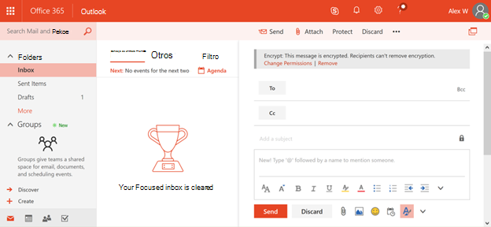

# <a name="protection-features-in-azure-information-protection-rolling-out-to-existing-tenants"></a>Características de protección de Azure Information Protection que se implementarán para los inquilinos existentes

[!INCLUDE [Microsoft 365 Defender rebranding](../includes/microsoft-defender-for-office.md)]

**Se aplica a**
- [Plan 2 de Microsoft Defender para Office 365](https://go.microsoft.com/fwlink/?linkid=2148715)
- [Microsoft 365 Defender](https://go.microsoft.com/fwlink/?linkid=2118804)

Para ayudar con el paso inicial en la protección de la información, a partir de julio de 2018 todos los inquilinos elegibles de Azure Information Protection tendrán las características de protección de Azure Information Protection activadas de forma predeterminada. Las características de protección de Azure Information Protection anteriormente se conocían en Office 365 como Rights Management o Azure RMS. Si su organización tiene un plan de servicio de Office E3 o un plan de servicio superior, ahora podrá empezar a proteger la información a través de Azure Information Protection al implantar estas características.

## <a name="changes-beginning-july-1-2018"></a>Cambios a partir del 1 de julio de 2018

A partir del 1 de julio de 2018, Microsoft habilitará la funcionalidad de protección en Azure Information Protection para todas las organizaciones con uno de los siguientes planes de suscripción:

- El cifrado de mensajes de Office 365 se ofrece como parte de Office 365 E3 y E5, Microsoft E3 y E5, Office 365 A1, A3 y A5, y Office 365 G3 y G5. No necesita licencias adicionales para recibir las nuevas funcionalidades de protección con tecnología de Azure Information Protection.

- También puede agregar Azure Information Protection Plan 1 a los siguientes planes para recibir las nuevas capacidades de cifrado de mensajes de Office 365: Exchange Online Plan 1, Exchange Online Plan 2, Office 365 F1, Microsoft 365 Empresa Basic, Microsoft 365 Empresa Standard u Office 365 Enterprise E1.

- Cada usuario que se beneficie del cifrado de mensajes de Office 365 debe tener una licencia para que esté cubierto por la característica.

- Para obtener la lista completa, consulte las [descripciones del](https://docs.microsoft.com/office365/servicedescriptions/exchange-online-service-description/exchange-online-service-description) servicio de Exchange Online para el cifrado de mensajes de Office 365.

Los administradores de inquilinos pueden comprobar el estado de protección en el portal de administradores de Office 365.


## <a name="why-are-we-making-this-change"></a>¿Por qué estamos realizando este cambio?

El cifrado de mensajes de Office 365 aprovecha las capacidades de protección de Azure Information Protection. En el centro de las mejoras recientes en el cifrado de mensajes de Office 365 y nuestras inversiones más amplias en la protección de la información en Microsoft 365, estamos haciendo que sea más fácil para las organizaciones activar y usar nuestras capacidades de protección, ya que históricamente, las tecnologías de cifrado han sido difíciles de configurar. Al activar las características de protección de Azure Information Protection de forma predeterminada, puede empezar rápidamente a proteger los datos confidenciales.

## <a name="does-this-impact-me"></a>¿Esto me afecta?

Si su organización ha adquirido una licencia válida de Office 365, este cambio afectará a su espacio empresarial.

> [!IMPORTANT]
> Si usa Active Directory Rights Management Services (AD RMS) en su entorno local, debe optar por no participar en este cambio inmediatamente o migrar a Azure Information Protection antes de que se realice este cambio en los próximos 30 días. Para obtener información sobre cómo optar por no participar, consulte "Uso AD RMS, ¿cómo puedo optar por no participar?". más adelante en este artículo. Si prefiere migrar, consulte [Migración de AD RMS a Azure Information Protection.](https://docs.microsoft.com/azure/information-protection/plan-design/migrate-from-ad-rms-to-azure-rms)

## <a name="can-i-use-azure-information-protection-with-active-directory-rights-management-services-ad-rms"></a>¿Puedo usar Azure Information Protection con Active Directory Rights Management Services (AD RMS)?

No. Este no es un escenario de implementación compatible. Sin realizar los pasos adicionales de no participación, es posible que algunos equipos empiecen automáticamente a usar el servicio Azure Rights Management y también se conecten al clúster de AD RMS. Este escenario no es compatible y tiene resultados no confiables, por lo que es importante que opte por no participar en este cambio en los próximos 30 días antes de que se presenten estas nuevas características. Para obtener información sobre cómo optar por no participar, consulte "Uso AD RMS, ¿cómo puedo optar por no participar?". más adelante en este artículo. Si prefiere migrar, consulte [Migración de AD RMS a Azure Information Protection.](https://docs.microsoft.com/azure/information-protection/plan-design/migrate-from-ad-rms-to-azure-rms)

## <a name="how-do-i-know-if-im-using-ad-rms"></a>¿Cómo sé si estoy usando AD RMS?

Siga estas instrucciones en la preparación del entorno para Azure Rights Management cuando también tenga [Active Directory Rights Management Services (AD RMS)](https://docs.microsoft.com/azure/information-protection/deploy-use/prepare-environment-adrms) para comprobar si ha implementado AD RMS:

1. Aunque es opcional, la mayoría de las implementaciones de AD RMS publican el punto de conexión de servicio (SCP) en Active Directory para que los equipos de dominio puedan detectar el clúster de AD RMS.

   Use editor ADSI para ver si tiene un SCP publicado en Active Directory: CN=Configuración [nombre del servidor], CN=Servicios, CN=RightsManagementServices, CN=SCP

2. Si no usa un SCP, los equipos Windows que se conectan a un clúster de AD RMS deben configurarse para la detección del servicio del lado cliente o la redirección de licencias mediante el Registro de Windows: `HKEY_LOCAL_MACHINE\SOFTWARE\Microsoft\MSIPC\ServiceLocation or HKEY_LOCAL_MACHINE\SOFTWARE\Wow6432Node\Microsoft\MSIPC\ServiceLocation` .

Para obtener más información acerca de estas configuraciones del Registro, vea Habilitar la detección de servicios del lado cliente mediante el registro de [Windows](https://docs.microsoft.com/azure/information-protection/rms-client/client-deployment-notes#enabling-client-side-service-discovery-by-using-the-windows-registry) y redirigir el tráfico del servidor [de licencias.](https://docs.microsoft.com/azure/information-protection/rms-client/client-deployment-notes#redirecting-licensing-server-traffic)

## <a name="i-use-ad-rms-how-do-i-opt-out"></a>Uso AD RMS, ¿cómo puedo optar por no participar?

Para no participar en el próximo cambio, siga estos pasos:

1. Con una cuenta de trabajo o escuela que tenga permisos de administrador global en su organización, inicie una sesión de Windows PowerShell y conéctese a Exchange Online. Para obtener instrucciones, consulte [Conexión a Exchange Online PowerShell](https://docs.microsoft.com/powershell/exchange/connect-to-exchange-online-powershell).

2. Ejecute el cmdlet Set-IRMConfiguration con la siguiente sintaxis:

  ```powershell
  Set-IRMConfiguration -AutomaticServiceUpdateEnabled $false
  ```

## <a name="what-can-i-expect-after-this-change-has-been-made"></a>¿Qué puedo esperar después de realizar este cambio?

Una vez habilitado, siempre que no haya optado por no participar, puede empezar a usar la nueva versión de Cifrado de mensajes de Office 365 que se anunció en [Microsoft Ignite 2017](https://techcommunity.microsoft.com/t5/Security-Privacy-and-Compliance/Email-Encryption-and-Rights-Protection/ba-p/110801) y aprovecha las capacidades de cifrado y protección de Azure Information Protection.



Para obtener más información sobre las nuevas mejoras, vea Cifrado de mensajes de [Office 365.](../../compliance/ome.md)
