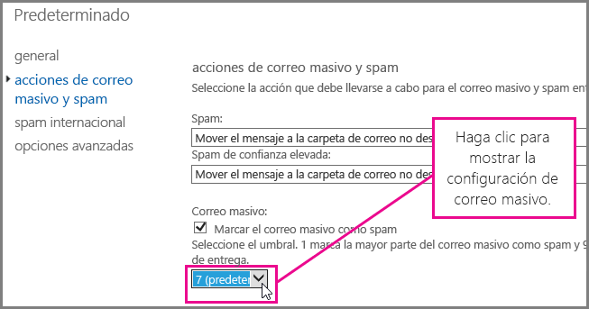
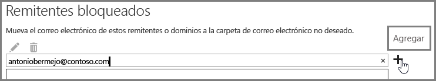

# <a name="customize-the-anti-spam-filter-with-these-settings"></a>Personalizar el filtro contra correo no deseado con esta configuración

Un administrador puede usar varias configuraciones del filtro de correo no deseado para impedir que el correo no deseado se envíe a las bandejas de entrada de los usuarios. El filtro de correo no deseado mejorará y podrá bloquear el correo no deseado e impedir los mensajes de falsos negativos si usa las opciones que se indican aquí. En este contexto, un falso negativo hace referencia a los mensajes masivos o de correo no deseado que se envían a la bandeja de entrada de un usuario.

## <a name="block-ip-addresses-with-a-connection-filter"></a>Bloquear direcciones IP con un filtro de conexión

Personalice el filtro de correo no deseado al agregar la dirección IP del remitente a la lista de direcciones IP bloqueadas del filtro de conexión:

1. Obtenga los encabezados del mensaje que quiere bloquear en su cliente de correo, como Outlook o Outlook en la Web (anteriormente conocido como Outlook Web App), como se describe en [Analizador de encabezados de mensaje](https://support.office.com/article/cd039382-dc6e-4264-ac74-c048563d212c).

2. Busque la dirección IP después de la etiqueta CIP en el encabezado X-Forefront-Antispam-Report con el [Analizador de encabezados de mensaje](https://testconnectivity.microsoft.com/?tabid=mha) o de forma manual.

3. Para agregar la dirección IP a la lista de direcciones IP bloqueadas, siga los pasos que se indican en “Usar el EAC para editar la directiva de filtro de conexión predeterminada” en [Configurar la directiva de filtro de conexiones](configure-the-connection-filter-policy.md).

### <a name="block-bulk-mail-with-mail-flow-rules-transport-rules-or-the-spam-filter"></a>Bloquear el correo masivo con reglas de flujo de correo (reglas de transporte) o el filtro de correo no deseado

¿Es el correo no deseado principalmente correo masivo (por ejemplo, boletines o promociones)? Puede personalizar el filtro de correo no deseado si [Usa reglas de flujo de correo para configurar el filtro de mensajes de correo masivo](use-transport-rules-to-configure-bulk-email-filtering.md) o activa la opción **Correo masivo** en la [Configuración del filtro avanzado del correo no deseado (ASF) en Office 365](advanced-spam-filtering-asf-options.md). Para comenzar, en el centro de administración de Exchange, haga clic en **Protección** \> **Filtro de contenido** y luego haga doble clic en la directiva de filtro que quiera ajustar. Haga clic en **Acciones de correo no deseado y masivo** para ajustar la configuración, como se muestra aquí.



### <a name="block-email-spam-using-spam-filter-block-lists"></a>Bloquear el correo no deseado con listas de bloqueados de filtro de correo no deseado

[Configure las directivas de filtro de correo no deseado en Office 365](configure-your-spam-filter-policies.md) para agregar la dirección del remitente a la lista de remitentes bloqueados o el dominio a la lista de dominios bloqueados en el filtro de correo no deseado. Los correos electrónicos de un remitente o dominio que se encuentre en la lista de bloqueados del filtro de correo no deseado se marcarán como correo no deseado.

## <a name="email-users-can-also-help-ensure-that-false-negative-and-email-spam-is-blocked-with-spam-filter"></a>Los usuarios de correo electrónico también pueden asegurarse de que los falsos negativos y el correo no deseado se bloqueen con un filtro de correo no deseado.

Facilitará los esfuerzos contra el correo no deseado para impedir falsos negativos y correo masivo si pide a los usuarios que agreguen la dirección del remitente de correo no deseado a su lista de remitentes bloqueados en [Outlook](https://support.office.com/article/5ae3ea8e-cf41-4fa0-b02a-3b96e21de089) o en [Outlook en la Web](https://support.office.com/article/db786e79-54e2-40cc-904f-d89d57b7f41d). En Outlook en la Web, haga clic en **Configuración** \> **Opciones** \> **Bloquear o permitir** y luego agregue la dirección a la lista de **Remitentes bloqueados**, como se muestra aquí.



> [!NOTE]
> Para obtener más información sobre las listas de remitentes seguros, vea [Crear listas de remitentes seguros en Office 365](create-safe-sender-lists-in-office-365.md).

## <a name="eop-only-customers-set-up-directory-synchronization"></a>Solo clientes de EOP: configurar la sincronización de directorios

Para evitar falsos negativos de correo no deseado, sincronice la configuración del usuario con el servicio mediante la sincronización de directorios para asegurarse de que se respeten los remitentes bloqueados. Para obtener más información, vea “Usar la sincronización de directorios para administrar los usuarios de correo” en Administrar usuarios de correo en EOP.

## <a name="eop-only-customers-who-are-not-using-directory-synchronization"></a>Solo clientes de EOP que no usen la sincronización de directorios

El servicio EOP se diseñó para respetar las listas de remitentes bloqueados y seguros del usuario (si la información se compartió con el servicio). Si es cliente de EOP y usa Outlook, pero no configuró la sincronización de directorios para sincronizar los usuarios con Office 365, puede impedir que se entreguen los mensajes en las bandejas de entrada de los usuarios con los remitentes bloqueados. Pero puede que tenga que configurar algunas reglas de flujo del correo de Exchange en los casos siguientes:

- Si un mensaje pasa un filtrado de correo no deseado normal mediante EOP y, después, se entrega en un servidor Exchange local y EOP asigna un veredicto de correo no deseado de SCL 1-4 (correo deseado), la lista de remitentes bloqueados local de los usuarios invalidará el veredicto de filtro de correo no deseado de EOP y lo entregará en la carpeta Correo no deseado.

- Si a un mensaje en EOP se le asigna un SCL -1 mediante una regla de flujo del correo de Exchange o porque la dirección IP o dominio se encuentran en la lista de permitidos, el valor de SCL se propagará al servidor Exchange local mediante conectores. En este caso, no se exigirá la lista de remitentes bloqueados del usuario. Para que Outlook exija el uso de la lista de remitentes bloqueados local del usuario, puede crear una regla de flujo del correo local que establezca el valor de SCL a 0.

### <a name="to-set-up-a-mail-flow-rule-to-stop-messages-from-being-delivered-to-your-users-inbox-by-using-the-blocked-senders-list"></a>Cómo configurar una regla de flujo del correo para que los mensajes no se envíen a la bandeja de entrada de los usuarios mediante la lista de remitentes bloqueados

1. Abra el Shell de administración de Exchange del servidor local. Para obtener información sobre cómo abrir el Shell en la organización de Exchange local, vea [Abrir el Shell de administración de Exchange](https://docs.microsoft.com/powershell/exchange/exchange-server/open-the-exchange-management-shell).

2. Ejecute este comando para enrutar los mensajes de correo no deseado filtrados por contenido a la carpeta Correo no deseado para actualizar el valor de SCL en todos los mensajes marcados con SCL -1:

   ```powershell
   New-TransportRule "NameForRule" -HeaderContainsMessageHeader "X-Forefront-Antispam-Report" -HeaderContainsWords "SCL:-1" -SetSCL 0
   ```

   Como el valor de SCL es 0 en el servidor Exchange local, el correo deseado se entregará en las bandejas de entrada de los usuarios, pero se permitirá que la lista de remitentes bloqueados local de los usuarios los envíe a la carpeta Correo no deseado. Si usa una cuarentena de correo no deseado en EOP, aún es posible que los remitentes que se encuentren en la lista segura del usuario se identifiquen como correo no deseado y se envíen a la cuarentena. Si usa la carpeta Correo no deseado en el buzón local, esto permitirá la entrega en la bandeja de entrada para los remitentes seguros.

> [!WARNING]
> Si usa una regla de flujo del correo para cambiar el valor de SCL a 0 (o a cualquier valor distinto de -1), se aplicarán en el mensaje todas las opciones de correo no deseado de Outlook. Esto quiere decir que se respetarán las listas seguras y de bloqueados, pero los mensajes que no tengan direcciones en las listas de remitentes seguros o bloqueados podrían marcarse como correo no deseado al procesar el filtro de correo no deseado del lado cliente. Si quiere que Outlook procese las listas seguras y de bloqueados, pero no usa el filtro de correo no deseado de lado cliente, necesita establecer la opción en “Sin filtrado automático” en Opciones de correo no deseado de Outlook. “Sin filtrado automático” es la opción predeterminada en las versiones más recientes de Outlook, pero necesita confirmar que se aplicó esta opción para asegurarse de que el filtro de correo no deseado de lado cliente no se aplique en los mensajes. Como administrador, puede exigir que se deshabilite el filtrado de correo no deseado de Outlook si sigue las instrucciones que se indican en [Outlook: Configuración de directiva para deshabilitar la interfaz de usuario de correo no deseado y el mecanismo de filtrado](https://support.microsoft.com/kb/2180568).

## <a name="see-also"></a>Consulta también

[Protección contra el correo no deseado para el correo electrónico de Microsoft](anti-spam-protection.md)

[Impedir falsos positivos de correo electrónico marcado como correo no deseado con una lista segura u otras técnicas](prevent-email-from-being-marked-as-spam.md)
