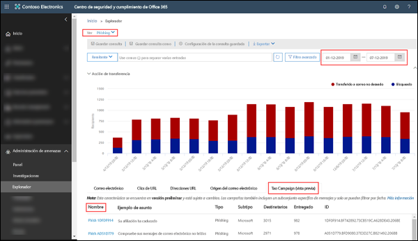
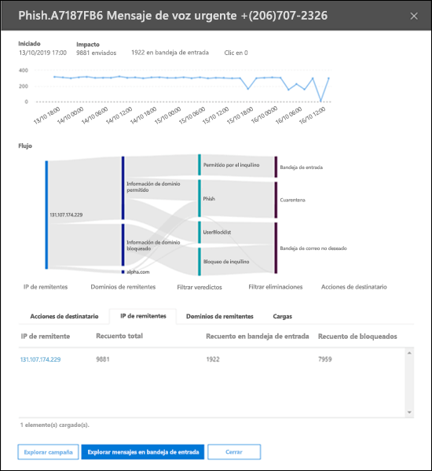
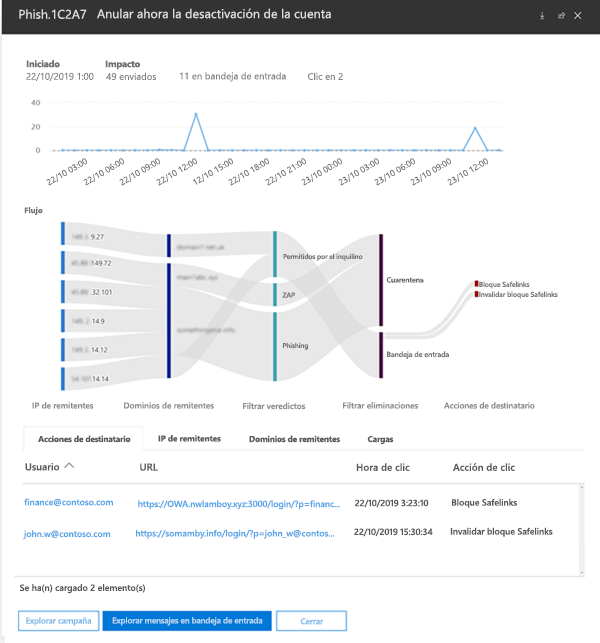

# Vistas de la campaña en ATP de Office 365

> [!NOTE]
> Las características descritas en este tema se encuentran actualmente en fase preliminar y están sujetas a cambios.

Vistas de la campaña es una característica de la Protección contra amenazas avanzada (ATP) del Centro de seguridad y cumplimiento de Office 365 que identifica y categoriza los ataques de suplantación de identidad en el servicio. Vistas de la campaña puede ayudarle a:

- Investigar y responder eficazmente a los ataques de suplantación de identidad.

- Entender mejor el alcance del ataque.

- Proporcionar información a los responsables de la toma de decisiones.

La característica Vistas de la campaña le permite obtener una perspectiva general del ataque más completa y más rápidamente.

## ¿Qué es una campaña?

Una campaña es un ataque de correo electrónico coordinado contra una o varias organizaciones. Hoy en día, los ataques de correo electrónico de robo de credenciales y datos empresariales son un negocio lucrativo y extendido. A pesar de los esfuerzos por aumentar las tecnologías para detener los ataques, los atacantes son lo suficientemente sofisticados como para modificar sus métodos y garantizar que sigan siendo eficaces.

Para identificar las campañas, Microsoft aprovecha la experiencia y la gran cantidad de datos de protección contra suplantación de identidades, correo electrónico no deseado y malware que ha adquirido con el servicio de Office 365 en todo el mundo. La información del ataque se analiza y clasifica en función de varios factores. Por ejemplo:

- **Origen del ataque**: direcciones IP de origen y dominios de correo electrónico del remitente.

- **Propiedades del mensaje del ataque**: contenido, estilo y tono de los mensajes del ataque.

- **Los destinatarios del ataque**: dominios de destinatarios, funciones de trabajo de los destinatarios (administradores, ejecutivos, etc.), tipos de empresa (grandes, pequeñas, públicas, privadas, etc.) y sectores.

- **Carga del ataque**: vínculos o datos adjuntos malintencionados u otras cargas.

## Vistas de la campaña en el Centro de seguridad y cumplimiento de Office 365

Vistas de la campaña está disponible en el [Centro de seguridad y cumplimiento](https://docs.microsoft.com/microsoft-365/compliance/go-to-the-securitycompliance-center) en las siguientes ubicaciones:

- **Administración de amenazas** \> **Explorador** \> **Ver** \> **Suplantación de identidad** \> **Campaña principal (versión preliminar)**

- **Administración de amenazas** \> **Explorador** \> **Ver** \> **Todo el correo electrónico** \> **Campaña principal (versión preliminar)**

> [!TIP]
> Actualmente, el único filtro que está disponible es el de intervalo de fechas. Si no ve ningún dato de la campaña, pruebe a cambiar el intervalo de fechas.

La página de información general muestra la siguiente información sobre la campaña:

- **Nombre**

- **Asunto de ejemplo**: línea de asunto de uno de los mensajes de la campaña. Tenga en cuenta que no _todos_ los mensajes de la campaña tienen necesariamente esta línea de asunto.

- **Tipo**: actualmente, este valor será siempre **Suplantación de identidad**.

- **Subtipo**: si está disponible, la marca a la que la campaña está dirigiendo los ataques de suplantación de identidad. Cuando la detección se lleva a cabo por medio de la tecnología de ATP, se agrega el prefijo **ATP-** al valor del subtipo.

- **Destinatarios**: el número de usuarios a los que se ha dirigido esta campaña.

- **Entregados**: el número de usuarios que han recibido mensajes de esta campaña en sus buzones de correo.

- **Id.**: el identificador único de la campaña.

Al hacer clic en el nombre de una campaña, se muestran los detalles de la campaña en un control flotante.

## Detalles de la campaña

En la vista de detalles de la campaña se muestra una gran cantidad de información sobre la campaña:

- Información de la campaña:

  - **Id.**: el mismo identificador único de la campaña de la pantalla de información general.

  - **Iniciada** y **Finalizada**: el filtro del intervalo de fechas que se ha seleccionado.

  - **Impacto**: el número de mensajes enviados en el intervalo de fechas que se ha seleccionado, cuántos se han entregado en la bandeja de entrada y cuántos usuarios han hecho clic en la URL de carga del mensaje de suplantación de identidad.

  - Una escala de tiempo de la actividad de la campaña: cuándo comenzó y finalizó la campaña y el volumen de mensajes a lo largo del tiempo.

### Flujo de la campaña

Los detalles importantes sobre la campaña se presentan en un diagrama de flujo horizontal (conocido como diagrama de _Sankey_) en la sección **Flujo**. Estos detalles pueden ayudarle a comprender los elementos de la campaña y su posible impacto en la organización.

Si coloca el puntero del mouse sobre una de las bandas horizontales del diagrama, verá el número de mensajes relacionados (por ejemplo, mensajes de una IP de origen en particular, mensajes de la dirección IP de origen con el dominio de remitente especificado, etc.).

El diagrama contiene la información siguiente:

- **IP de remitentes**

- **Dominios de remitente**

- **Veredictos de filtro**: los valores que se muestran aquí están relacionados con los datos de protección contra suplantación de identidad y correo no deseado disponibles, tal y como se describe en [Encabezados de mensajes de correo no deseado](anti-spam-message-headers.md). Aquí son de especial interés los valores **Permitidos por el inquilino**, que significa que determinada configuración de la organización permitió que pasara un mensaje de que de otra forma habría sido bloqueado por el servicio (por ejemplo, un dominio de la lista de remitentes permitidos).

  - **Bloqueados por el inquilino**: este valor indica que determinada configuración de la organización (por ejemplo, una entrada de dominio de la [lista de remitentes bloqueados](create-block-sender-lists-in-office-365.md)) detectó el mensaje y determinó su ubicación de entrega. En el caso de los mensajes que no se hayan puesto en cuarentena, revise la configuración de remitentes bloqueados para determinar por qué se entregó el mensaje.

  - **Detectados**

  - **Permitidos por el inquilino**

- **Ubicaciones de entrega**: probablemente querrá investigar los mensajes que se entregaron a los destinatarios (ya sea en la bandeja de entrada o en la carpeta de correo no deseado), incluso aunque los usuarios no hayan hecho clic en la URL de carga del mensaje. También puede eliminar los mensajes en cuarentena de la [Cuarentena de mensajes de correo electrónico en Office 365](quarantine-email-messages.md).

  - **Carpeta de correo no deseado**

  - **Cuarentena**

  - **Bandeja de entrada**

#### Clics de URL

Siempre existe la posibilidad de que los destinatarios interactúen con los mensajes entregados en su bandeja de entrada o en su carpeta de correo electrónico no deseado (es decir, que hagan clic en la URL malintencionada del mensaje). Si no lo han hecho, es un pequeño éxito, aunque tendrá que determinar por qué se entregó en sus buzones el mensaje perjudicial en primer lugar.

Si un usuario hace clic en la URL malintencionada, las acciones se muestran en el área de **Clics de URL** del diagrama.

- **Bloqueo de Vínculos seguros**: este valor indica que el destinatario hizo clic en la URL de carga del mensaje, pero las directivas de [Vínculos seguros de ATP](atp-safe-links.md) de la organización la bloquearon.

- **Anulación de bloqueo de Vínculos seguros**: este valor también indica que el destinatario hizo clic en la URL de carga del mensaje y las directivas de Vínculos seguros de ATP intentaron detenerla, pero se permitió la invalidación del bloqueo. Debe investigar las [directivas de Vínculos seguros](set-up-atp-safe-links-policies.md) de la organización para ver por qué los usuarios pueden invalidar el veredicto de Vínculos seguros y hacer clic en direcciones URL malintencionadas.

### Pestañas

En la vista de detalles de la campaña hay varias pestañas que permiten investigar más a fondo la campaña.

- **Clics de URL**: si no se hizo clic en la URL de carga del mensaje de suplantación de identidad, esta sección estará en blanco. Si un usuario pudo hacer clic en la URL,

  - **Usuario**\*

  - **URL**\*

  - **Hora del clic**

  - **Acción del clic**

- **IP de remitentes**

  - **IP del remitente**\*

  - **Recuento total**

  - **Recuento de entregados en bandeja de entrada**

  - **Recuento de bloqueados**

  - **Aprobados por SPF**

- **Remitentes**

  - **Remitente**

  - **Recuento total**

  - **Recuento de entregados en bandeja de entrada**

  - **Recuento de bloqueados**

  - **Aprobados por DKIM**

  - **Aprobados por DMARC**

- **Cargas**

  - **URL**\*

  - **Recuento total**

\* Al hacer clic en este valor, se abre un nuevo control flotante que contiene más detalles sobre el elemento especificado (usuario, URL, etc.) en la parte superior de la vista de detalles de la campaña. Para volver a la vista de detalles de la campaña, haga clic en **Hecho** en el nuevo control flotante.

### Botones

Los botones de la vista de detalles de la campaña le permiten usar todo el potencial del Explorador de amenazas para investigar más a fondo la campaña.

- **Explorar campaña**: abre una nueva pestaña de búsqueda del Explorador de amenazas con el valor **Id. de campaña** como filtro de búsqueda.

- **Explorar mensajes de la bandeja de entrada**: abre una nueva pestaña de búsqueda del Explorador de amenazas con **Id. de campaña** y **Ubicación de entrega: Bandeja de entrada** como filtro de búsqueda.
