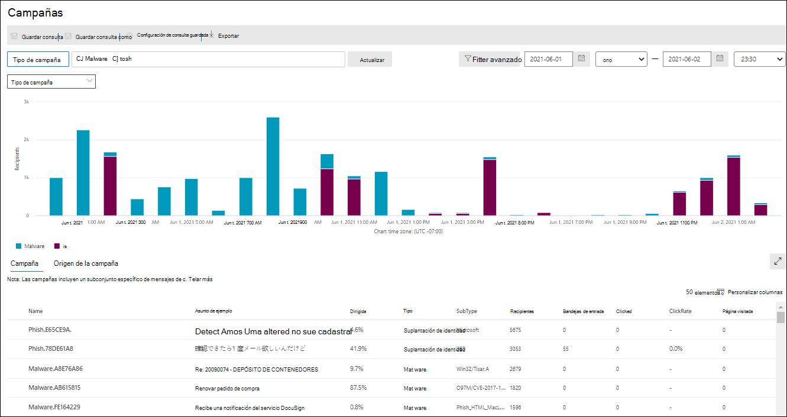
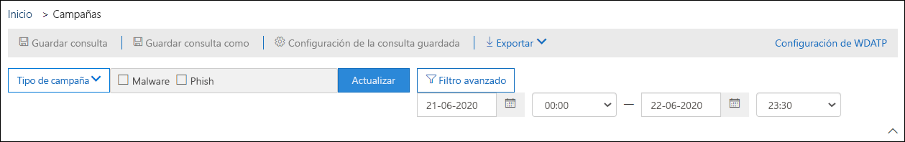
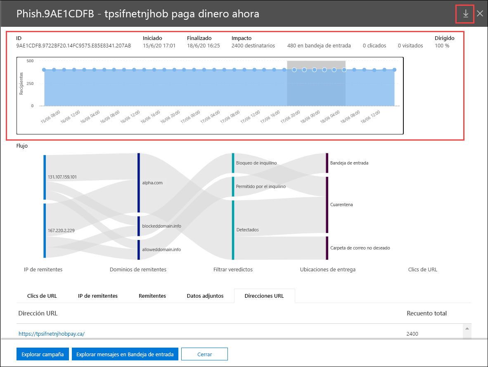

# Vistas de campaña en Microsoft Defender para Office 365

[!INCLUDE [Microsoft 365 Defender rebranding](../includes/microsoft-defender-for-office.md)]

**Se aplica a**
- [Plan 2 de Microsoft Defender para Office 365](office-365-atp.md)

Vistas de campaña es una característica de Microsoft Defender para Office 365 Plan 2 (por ejemplo, Microsoft 365 E5 u organizaciones con un complemento defender para Office 365 Plan 2). Las vistas de campaña en el Centro de & de seguridad identifican y clasifican los ataques de suplantación de identidad en el servicio. Vistas de la campaña puede ayudarle a:

- Investigar y responder eficazmente a los ataques de suplantación de identidad.
- Entender mejor el alcance del ataque.
- Proporcionar información a los responsables de la toma de decisiones.

La característica Vistas de la campaña le permite obtener una perspectiva general del ataque más completa y más rápidamente.

## ¿Qué es una campaña?

Una campaña es un ataque de correo electrónico coordinado contra una o varias organizaciones. Los ataques de correo electrónico que roban credenciales y datos de la empresa son un sector grande y a gran tamaño. A medida que las tecnologías aumentan para detener los ataques, los atacantes modifican sus métodos para garantizar el éxito continuo.

Microsoft aprovecha la gran cantidad de datos contra suplantación de identidad, correo no deseado y antimalware en todo el servicio para ayudar a identificar las campañas. Analizamos y clasificamos la información de ataque según varios factores. Por ejemplo:

- **Origen de ataque:** las direcciones IP de origen y los dominios de correo electrónico del remitente.
- **Propiedades del** mensaje: el contenido, el estilo y el tono de los mensajes.
- **Destinatarios del mensaje:** cómo se relacionan los destinatarios. Por ejemplo, dominios de destinatarios, funciones de trabajo de destinatarios (administradores, ejecutivos, etc.), tipos de compañía (grandes, pequeñas, públicas, privadas, etc.) y sectores.
- **Carga de ataque:** vínculos malintencionados, datos adjuntos u otras cargas en los mensajes.

Una campaña puede ser de corta duración o puede abarcar varios días, semanas o meses con períodos activos e inactivos. Es posible que se haya iniciado una campaña en una organización específica o que la organización sea parte de una campaña más grande en varias empresas.

## Vistas de la campaña en el Centro de & cumplimiento

Vistas de la campaña está disponible en  el Centro [de & cumplimiento en](https://protection.office.com) las \> **campañas** de administración de amenazas o directamente en <https://protection.office.com/campaigns> .

También puedes acceder a vistas de campaña desde:

- **Administración de amenazas** \> **Explorador** \> **Vista** \> **Campañas**
- **Administración de amenazas** \> **Explorador** \> **Vista** \> **Todo el correo electrónico** \> **Pestaña Campaña**
- **Administración de amenazas** \> **Explorador** \> **Vista** \> **Phishing** \> **Pestaña Campaña**
- **Administración de amenazas** \> **Explorador** \> **Vista** \> **Malware** \> **Pestaña Campaña**

Para obtener acceso a las vistas de campaña, debe ser  miembro de los grupos de roles Administración de la **organización,** Administrador de seguridad o Lector de seguridad en el Centro de & Cumplimiento. Para más información, consulte [Permisos en el Centro de seguridad y cumplimiento](permissions-in-the-security-and-compliance-center.md).

## Introducción a las campañas

La página de información general muestra información sobre todas las campañas.

En la pestaña **Campaña** predeterminada, el área Tipo **de** campaña muestra un gráfico de barras que muestra el número de destinatarios por día. De forma predeterminada, el gráfico muestra los datos **de phishing** **y malware.**

> [!TIP]
> Si no ve ningún dato de campaña, pruebe a cambiar el intervalo de fechas o [los filtros.](#filters-and-settings)

El resto de la página de información general muestra la siguiente información en la **pestaña Campaña:**

- **Nombre**

- **Asunto de ejemplo**: línea de asunto de uno de los mensajes de la campaña. Tenga en cuenta que todos los mensajes de la campaña no tendrán necesariamente el mismo asunto.

- **Dirigido:** porcentaje calculado por: (el número de destinatarios de la campaña de la organización) / (el número total de destinatarios de la campaña en todas las organizaciones del servicio). Este valor indica el grado en que la campaña se dirige solo a su organización (un valor más alto) frente a otras organizaciones del servicio (un valor inferior).

- **Tipo:** este valor es **Phish** o **Malware.**

- **Subtipo:** este valor contiene más detalles sobre la campaña. Por ejemplo:
  - **Suplantación** de identidad : si está disponible, la marca que esta campaña está suplantación de identidad. Por ejemplo, `Microsoft` , , , o `365` `Unknown` `Outlook` `DocuSign` .
  - **Malware:** por ejemplo, `HTML/PHISH` o `HTML/<MalwareFamilyName>` .

  Cuando esté disponible, la marca que esta campaña suplanta. Cuando la detección está controlada por la tecnología Defender para Office 365, el prefijo **ATP-** se agrega al valor de subtipo.

- **Destinatarios**: el número de usuarios a los que se ha dirigido esta campaña.

- **Bandeja de entrada:** el número de usuarios que recibieron mensajes de esta campaña en su Bandeja de entrada (no entregados a su carpeta de correo no deseado).

- **Clicked**: The number of users that clicked on the URL or opened the attachment in the phishing message.

- **Tasa de clics:** porcentaje calculado por "**Bandeja** de entrada en la que se  /  **hizo clic".** Este valor es un indicador de la efectividad de la campaña. En otras palabras, si los destinatarios pudieron identificar el mensaje como suplantación de identidad (phishing) y si no han hecho clic en la dirección URL de carga.

  Ten en cuenta **que la tasa de** clics no se usa en las campañas de malware.

- **Visitado:** cuántos usuarios llegaron realmente al sitio web de carga. Si hay valores **clicked,** pero vínculos seguros bloquearon el acceso al sitio web, este valor será cero.

La **pestaña Origen de** la campaña muestra los orígenes de mensajes en un mapa del mundo.

### Filtros y configuración

En la parte superior de la página Vistas de campaña, hay varias opciones de filtro y consulta que te ayudarán a encontrar y aislar campañas específicas.

El filtrado más básico que puede hacer es la fecha y hora de inicio y la fecha y hora de finalización.

Para filtrar aún más la vista, puede hacer una  sola propiedad con varios valores filtrando haciendo clic en el botón Tipo de campaña, realizando la selección y, a continuación, haciendo clic en **Actualizar**.

Las propiedades de campaña filtrables que están disponibles en el botón **Tipo** de campaña se describen en la siguiente lista:

- **Básico:**
  - **Tipo de campaña:** Seleccionar **malware** o **suplantación de identidad**. Borrar las selecciones tiene el mismo resultado que seleccionar ambas.
  - **Nombre de la campaña**
  - **Subtipo campaña**
  - **Remitente**
  - **Destinatarios**
  - **Dominio del remitente**
  - **Asunto**
  - **Nombres de archivos adjuntos**
  - **Familia de malware**
  - **Etiquetas:** usuarios o grupos a los que se ha aplicado la etiqueta de usuario especificada (incluidas las cuentas de prioridad). Para obtener más información acerca de las etiquetas de usuario, vea [Etiquetas de usuario.](user-tags.md)
  - **Invalidaciones del sistema**
  - **Acción de entrega**
  - **Acción adicional**
  - **Directionality**
  - **Tecnología de detección**
  - **Ubicación de entrega original**
  - **Ubicación de entrega más reciente**
  - **Invalidaciones del sistema**

- **Avanzadas:**
  - **Identificador de mensaje de Internet:** disponible en el **campo de encabezado Id.** de mensaje en el encabezado del mensaje. Un valor de ejemplo es `<08f1e0f6806a47b4ac103961109ae6ef@server.domain>` (tenga en cuenta los corchetes angulares).
  - **Id. de mensaje** de red: valor GUID que está disponible en el campo de encabezado **X-MS-Exchange-Organization-Network-Message-Id** en el encabezado del mensaje.
  - **IP del remitente**
  - **Datos adjuntos SHA256**: Para encontrar el valor hash SHA256 de un archivo en Windows, ejecute el siguiente comando en un símbolo del sistema: `certutil.exe -hashfile "<Path>\<Filename>" SHA256` .
  - **Id. de clúster**
  - **Id. de directiva de alerta**
  - **Señal de DIRECCIÓN URL de ZAP**

- **Direcciones URL:**
  - **Dominio de dirección URL**
  - **Ruta de acceso y dominio de dirección URL**
  - **URL**
  - **Ruta de acceso de dirección URL**
  - **Veredicto de clic**

Para obtener un filtrado más avanzado, incluido el filtrado por varias propiedades, puede hacer clic en el botón filtro **avanzado** para crear una consulta. Las mismas propiedades de campaña están disponibles, pero con las siguientes mejoras:

- Puede hacer clic **en Agregar una condición** para seleccionar varias condiciones.
- Puede elegir el **operador And** o **Or** entre condiciones.
- Puede seleccionar el elemento **de grupo Condición** en la parte inferior de la lista de condiciones para formar condiciones compuestas complejas.

Cuando haya terminado, haga clic en el **botón** Consulta.

Después de crear un filtro básico o avanzado, puede guardarlo mediante Guardar consulta **o** **Guardar consulta como**. Más adelante, cuando vuelva a vistas de campaña, puede cargar un filtro guardado haciendo clic en **Configuración de consulta guardada.**

Para exportar el gráfico o la lista de campañas, haga clic en Exportar **y** seleccione Exportar datos **del gráfico** o Exportar lista **de campañas.**

Si tienes una suscripción de Microsoft Defender para puntos de conexión, puedes hacer clic en Configuración de **MDE** para conectar o desconectar la información de campañas con Microsoft Defender para Endpoint. Para obtener más información, vea [Integrar Microsoft Defender para Office 365 con Microsoft Defender para Endpoint.](integrate-office-365-ti-with-wdatp.md)

## Detalles de la campaña

Al hacer clic en el nombre de una campaña, los detalles de la campaña aparecen en un menú desplegable.

### Información de la campaña

En la parte superior de la vista de detalles de la campaña, está disponible la siguiente información de campaña:

- **Identificador:** identificador de campaña único.

- **Iniciado y** **finalizado:** la fecha de inicio y la fecha de finalización de la campaña. Tenga en cuenta que estas fechas pueden extenderse más allá de las fechas de filtro que seleccionó en la página de información general.

- **Impacto:** esta sección contiene los siguientes datos para el filtro de intervalo de fechas que seleccionó (o que seleccione en la escala de tiempo):
  - El número total de destinatarios.
  - El número de mensajes que se enviaron "Bandeja de entrada" (es decir, entregados a la Bandeja de entrada, no a la carpeta Correo no deseado).
  - Cuántos usuarios han hecho clic en la carga de la dirección URL en el mensaje de suplantación de identidad.
  - Cuántos usuarios visitaron la dirección URL.

- **Dirigido:** porcentaje calculado por: (el número de destinatarios de la campaña de la organización) / (el número total de destinatarios de la campaña en todas las organizaciones del servicio). Ten en cuenta que este valor se calcula durante toda la duración de la campaña y no cambia en función de los filtros de fecha.

- Una escala de tiempo interactiva de la actividad de la campaña: la escala de tiempo muestra la actividad durante toda la duración de la campaña. De forma predeterminada, el área sombreada incluye el filtro de intervalo de fechas que seleccionó en la introducción. Puede hacer clic y arrastrar para seleccionar un punto inicial y un punto final específicos, lo que cambiará los datos que se muestran en el área de impacto y en el resto de la página, como se describe en las secciones <u>siguientes.  </u>

En la barra de título, puedes hacer clic en el botón Descargar escritura de campaña para descargar el icono de escritura de campaña para descargar los detalles de la campaña en un documento de Word (de forma predeterminada, denominado   CampaignReport.docx). Ten en cuenta que la descarga contiene detalles durante toda la duración de la campaña (no solo las fechas de filtro que seleccionaste).

### Flujo de la campaña

En medio de la vista de detalles de la  campaña, los detalles importantes sobre la campaña se presentan en la sección Flujo en un diagrama de flujo horizontal (conocido como diagrama _de Sankey)._ Estos detalles pueden ayudarle a comprender los elementos de la campaña y su posible impacto en la organización.

> [!TIP]
> La información que se muestra en el diagrama de **flujo** se controla mediante el intervalo de fechas sombreado en la escala de tiempo, tal como se describe en la sección anterior.

Si coloca el puntero del mouse sobre una de las bandas horizontales del diagrama, verá el número de mensajes relacionados (por ejemplo, mensajes de una IP de origen en particular, mensajes de la dirección IP de origen con el dominio de remitente especificado, etc.).

El diagrama contiene la información siguiente:

- **IP de remitentes**
- **Dominios de remitente**
- **Veredictos de** filtro: los valores de veredicto están relacionados con los veredictos de filtrado de correo no deseado y de suplantación de identidad disponibles, tal como se describe en los encabezados de mensajes contra correo [no deseado.](anti-spam-message-headers.md) Los valores disponibles se describen en la tabla siguiente:

  ****

  |Valor|Veredicto de filtro de correo no deseado|Descripción|
  |---|---|---|
  |**Permitido**|`SFV:SKN` 
 `SFV:SKI`|El mensaje se marcó como correo no deseado o omitió el filtrado antes de ser evaluado por el filtrado de correo no deseado. Por ejemplo, una regla de flujo de correo (también conocida como regla de transporte) marcó el mensaje como correo no deseado. 
 El mensaje omitió el filtrado de correo no deseado por otros motivos. Por ejemplo, el remitente y el destinatario parecen estar en la misma organización.|
  |**Bloqueado**|`SFV:SKS`|El mensaje se marcó como correo no deseado antes de ser evaluado por el filtrado de correo no deseado. Por ejemplo, por una regla de flujo de correo.|
  |**Detectados**|`SFV:SPM`|El mensaje se marcó como correo no deseado por el filtro de correo no deseado.|
  |**No detectado**|`SFV:NSPM`|El mensaje se marcó como correo no deseado mediante el filtrado de correo no deseado.|
  |**Publicado**|`SFV:SKQ`|El mensaje omitió el filtrado de correo no deseado porque se soltó de la cuarentena.|
  |**Espacio empresarial permitido**\*|`SFV:SKA`|El mensaje omitió el filtrado de correo no deseado debido a la configuración de una directiva contra correo no deseado. Por ejemplo, el remitente estaba en la lista de remitentes permitidos o en la lista de dominios permitidos.|
  |**Bloque de inquilinos**\*\*|`SFV:SKA`|El filtrado de correo no deseado bloqueó el mensaje debido a la configuración de una directiva contra correo no deseado. Por ejemplo, el remitente estaba en la lista de remitentes permitidos o en la lista de dominios permitidos.|
  |**User Allow**\*|`SFV:SFE`|El mensaje omitió el filtrado de correo no deseado porque el remitente estaba en la lista de remitentes seguros de un usuario.|
  |**Bloqueo de usuarios**\*\*|`SFV:BLK`|El mensaje se bloqueó mediante el filtrado de correo no deseado porque el remitente estaba en la lista de remitentes bloqueados de un usuario.|
  |**ZAP**|n/a|[La purga automática (ZAP) de](zero-hour-auto-purge.md) cero horas movió el mensaje entregado a la carpeta o cuarentena de correo no deseado. La acción se configura en la directiva contra correo no deseado.|
  |

  \* Revise las directivas contra correo no deseado, ya que es probable que el servicio haya bloqueado el mensaje permitido.

  \*\* Revise las directivas contra correo no deseado, ya que estos mensajes deben estar en cuarentena, no entregarse.

- Ubicaciones de **entrega:** es probable que desee investigar los mensajes que se entregaron a los destinatarios (ya sea a la bandeja de entrada o a la carpeta Correo no deseado), incluso si los usuarios no han hecho clic en la dirección URL de carga del mensaje. También puede quitar los mensajes en cuarentena de la cuarentena. Para obtener más información, vea [Mensajes de correo electrónico en cuarentena en EOP.](quarantine-email-messages.md)
  - **Carpeta eliminada**
  - **Dropped**
  - **Externo:** el destinatario se encuentra en la organización de correo electrónico local en entornos híbridos.
  - **Failed**
  - **Reenviado**
  - **Bandeja de entrada**
  - **Carpeta de correo no deseado**
  - **Cuarentena**
  - **Desconocido**

- **Clics de dirección URL:** estos valores se describen en la siguiente sección.

> [!NOTE]
> En todas las capas que contienen más de 10 elementos, se muestran los 10 elementos principales, mientras que el resto se agrupan en **Otros.**

#### Clics de URL

Cuando se entrega un mensaje de suplantación de identidad (phishing) a la bandeja de entrada o a la carpeta de correo no deseado de un destinatario, siempre existe la posibilidad de que el usuario haga clic en la dirección URL de carga. No hacer clic en la dirección URL es una pequeña medida de éxito, pero debe determinar por qué el mensaje de suplantación de identidad se entregó incluso al buzón.

Si un usuario hizo clic en la dirección URL de carga en el mensaje de suplantación de identidad( phishing), las acciones se muestran en el área de **clics** de url del diagrama en la vista de detalles de la campaña.

- **Permitido**
- **BlockPage:** el destinatario hizo clic en la dirección URL de carga, pero su acceso al sitio web malintencionado fue bloqueado por una directiva [de](atp-safe-links.md) vínculos seguros de su organización.
- **BlockPageOverride:** el destinatario hizo clic en la dirección URL de carga del mensaje, Vínculos seguros intentó detenerlos, pero se les permitió invalidar el bloque. Inspeccione las [directivas de vínculos seguros](set-up-atp-safe-links-policies.md) para ver por qué los usuarios pueden invalidar el veredicto de vínculos seguros y continuar hasta el sitio web malintencionado.
- **PendingDetonationPage:** Datos adjuntos seguros en Microsoft Defender para Office 365 está en proceso de abrir e investigar la dirección URL de carga en un entorno de equipo virtual.
- **PendingDetonationPageOverride:** se permitió al destinatario invalidar el proceso de detonación de carga y abrir la dirección URL sin esperar los resultados.

### Pestañas

Las pestañas de la vista de detalles de la campaña te permiten investigar aún más la campaña.

> [!TIP]
> La información que se muestra en las pestañas se controla mediante el intervalo de fechas sombreado en la escala de tiempo, tal como se describe en la sección Información [de la campaña.](#campaign-information)

- **Clics en la** dirección URL: si los usuarios no han hecho clic en la dirección URL de carga del mensaje, esta sección estará en blanco. Si un usuario pudo hacer clic en la dirección URL, se rellenarán los siguientes valores:
  - **Usuario**\*
  - **URL**\*
  - **Hora de clic**
  - **Veredicto de clic**

- **IP de remitentes**
  - **IP del remitente**\*
  - **Recuento total**
  - **Bandeja de entrada**
  - **Sin bandeja de entrada**
  - **SPF pasado:** el remitente se autenticó mediante el marco [de directivas de remitente (SPF).](how-office-365-uses-spf-to-prevent-spoofing.md) Un remitente que no pasa la validación de SPF indica un remitente no autenticado o el mensaje está suplantando a un remitente legítimo.

- **Remitentes**
  - **Remitente:** es la dirección de remitente real en el comando SMTP MAIL FROM, que no es necesariamente la dirección de correo electrónico De: que los usuarios ven en sus clientes de correo electrónico.
  - **Recuento total**
  - **Bandeja de entrada**
  - **Sin bandeja de entrada**
  - **DKIM pasado:** el remitente se autenticó mediante el correo identificado de claves de dominio [(DKIM).](support-for-validation-of-dkim-signed-messages.md) Un remitente que no pasa la validación DKIM indica un remitente no autenticado o el mensaje está suplantando a un remitente legítimo.
  - **DMARC pasado:** el remitente se autenticó mediante autenticación de mensajes basada en dominio, informes y [conformidad (DMARC).](use-dmarc-to-validate-email.md) Un remitente que no pasa la validación de DMARC indica un remitente no autenticado o el mensaje está suplantando a un remitente legítimo.

- **Datos adjuntos**
  - **Filename**
  - **SHA256**
  - **Familia de malware**
  - **Recuento total**

- **URL**
  - **URL**\*
  - **Recuento total**

\* Al hacer clic en este valor, se abre un nuevo control flotante que contiene más detalles sobre el elemento especificado (usuario, URL, etc.) en la parte superior de la vista de detalles de la campaña. Para volver a la vista de detalles de la campaña, haga clic en **Hecho** en el nuevo control flotante.

### Botones

Los botones de la vista de detalles de la campaña le permiten usar todo el potencial del Explorador de amenazas para investigar más a fondo la campaña.

- **Explorar campaña**: abre una nueva pestaña de búsqueda del Explorador de amenazas con el valor **Id. de campaña** como filtro de búsqueda.
- **Explorar mensajes en bandeja de entrada:** abre  una nueva pestaña de búsqueda del Explorador de amenazas con el identificador de campaña y la ubicación de **entrega: Bandeja** de entrada como filtro de búsqueda.
