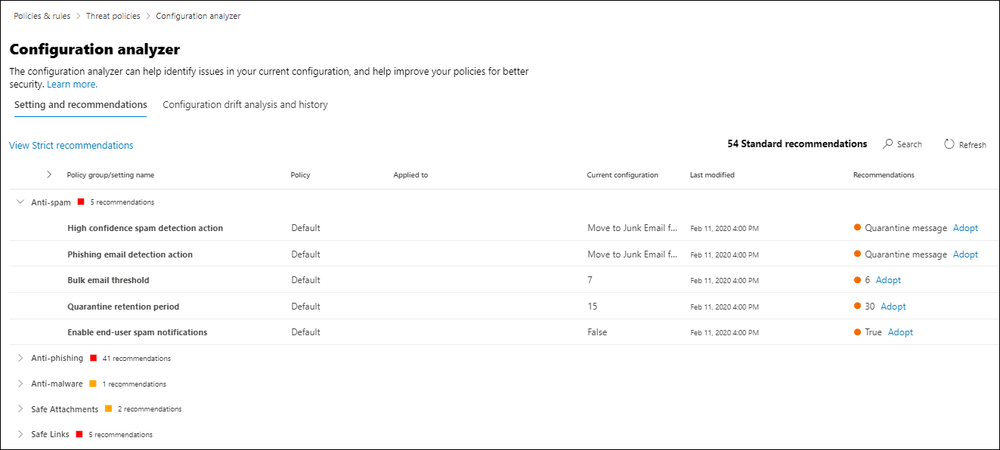

# Analizador de configuración para directivas de protección en EOP y Microsoft Defender para Office 365

[!INCLUDE [Microsoft 365 Defender rebranding](../includes/microsoft-defender-for-office.md)]

**Se aplica a**
- [Exchange Online Protection](https://go.microsoft.com/fwlink/?linkid=2148611)
- [Plan 1 y Plan 2 de Microsoft Defender para Office 365](https://go.microsoft.com/fwlink/?linkid=2148715)
- [Microsoft 365 Defender](https://go.microsoft.com/fwlink/?linkid=2118804)

El analizador de configuración del Centro de seguridad y cumplimiento de & proporciona una ubicación central para buscar y corregir directivas de seguridad en las que la configuración se encuentra por debajo de la configuración de protección estándar y de perfil de protección estricta en directivas de seguridad [preestablecidas.](preset-security-policies.md)

El analizador de configuración analiza los siguientes tipos de directivas:

- **Directivas de Exchange Online Protection (EOP):** esto incluye organizaciones de Microsoft 365 con buzones de Exchange Online y organizaciones EOP independientes sin buzones de Exchange Online:

  - [Directivas contra correo no deseado.](configure-your-spam-filter-policies.md)
  - [Directivas antimalware](configure-anti-malware-policies.md).
  - [Directivas de protección contra suplantación de identidad de EOP.](set-up-anti-phishing-policies.md#spoof-settings)

- Directivas de Microsoft Defender para **Office 365:** esto incluye las organizaciones con suscripciones de complemento de Microsoft 365 E5 o Defender para Office 365:

  - Directivas contra la suplantación de identidad en Microsoft Defender para Office 365, que incluyen:

    - La misma [configuración de suplantación](set-up-anti-phishing-policies.md#spoof-settings) de identidad que están disponibles en las directivas contra la suplantación de identidad de EOP.
    - [Configuración de suplantación](set-up-anti-phishing-policies.md#impersonation-settings-in-anti-phishing-policies-in-microsoft-defender-for-office-365)
    - [Umbrales avanzados de suplantación de identidad](set-up-anti-phishing-policies.md#advanced-phishing-thresholds-in-anti-phishing-policies-in-microsoft-defender-for-office-365)

  - [Directivas de vínculos seguros.](set-up-atp-safe-links-policies.md)

  - [Directivas de datos adjuntos seguros.](set-up-atp-safe-attachments-policies.md)

Los **valores de** configuración **de** directiva Estándar y Estricto que se usan como líneas base se describen en Configuración recomendada para EOP y Microsoft Defender para la seguridad de [Office 365.](recommended-settings-for-eop-and-office365-atp.md)

## ¿Qué necesita saber antes de comenzar?

- Abra el Centro de seguridad y cumplimiento en <https://protection.office.com/>. Para ir directamente a la **página Analizador de configuración,** use <https://protection.office.com/configurationAnalyzer> .

- Para conectarse al PowerShell de Exchange Online, consulte [Conectarse a PowerShell de Exchange Online](https://docs.microsoft.com/powershell/exchange/connect-to-exchange-online-powershell).

- Necesita que se le asignen permisos en el Centro de seguridad y cumplimiento para poder realizar los procedimientos de este artículo:
  - Para usar el analizador de configuración **y** realizar actualizaciones de  las directivas de seguridad, debe ser miembro de los grupos de roles Administración de la organización o **Administrador de** seguridad.
  - Para obtener acceso de solo lectura al analizador de configuración, debe ser miembro de los grupos de roles Lector **global** o **Lector de** seguridad.

  Para obtener más información, vea [Permisos en el Centro de seguridad y cumplimiento](permissions-in-the-security-and-compliance-center.md).

  > [!NOTE]
  >  
  > - Agregar usuarios al rol correspondiente de Azure Active Directory en el Centro de administración de Microsoft 365 otorga a los usuarios los permisos necesarios en el Centro de seguridad y cumplimiento _y_ permisos para otras características de Microsoft 365. Para obtener más información, vea [Sobre los roles de administrador](https://docs.microsoft.com/microsoft-365/admin/add-users/about-admin-roles).
  > 
  > - El grupo de roles **Administración de organización de solo lectura** en [Exchange Online](https://docs.microsoft.com/Exchange/permissions-exo/permissions-exo#role-groups) también proporciona acceso de solo lectura a la característica.

## Usar el analizador de configuración en el Centro de & cumplimiento

En el Centro de & cumplimiento, vaya al Analizador **de** configuración de \> **directivas** de administración \> **de amenazas.**

El analizador de configuración tiene dos pestañas principales:

- **Configuración y recomendaciones:** elige Estándar o Estricto y compara dicha configuración con las directivas de seguridad existentes. En los resultados, puedes ajustar los valores de la configuración para que suban al mismo nivel que Estándar o Estricto.

- **Historial y análisis de deriva de** configuración: esta vista le permite realizar un seguimiento de los cambios de directiva con el tiempo.

### Ficha Configuración y recomendaciones en el analizador de configuración

De forma predeterminada, la pestaña se abre en la comparación con el perfil de protección estándar. Puede cambiar a la comparación del perfil de protección Estricto haciendo clic **en Ver estrictas recomendaciones**. Para volver atrás, seleccione **Ver recomendaciones estándar.**

De forma predeterminada, la columna Nombre de grupo **o** configuración de directiva contiene una vista contraida de los distintos tipos de directivas de seguridad y el número de configuraciones que deben mejorarse (si las hay). Los tipos de directivas son:

- **Contra correo no deseado**
- **Anti-phishing**
- **Antimalware**
- **Datos adjuntos seguros** de ATP (si su suscripción incluye Microsoft Defender para Office 365)
- **Vínculos seguros de ATP** (si su suscripción incluye Microsoft Defender para Office 365)

En la vista predeterminada, todo está contraído. Junto a cada directiva, hay un resumen de los resultados de comparación de las directivas (que puedes modificar) y la configuración de las directivas correspondientes para los perfiles de protección Estándar o Estricto (que no puedes modificar). Verá la siguiente información para el perfil de protección con el que está comparando:

- **Verde:** todas las configuraciones de todas las directivas existentes son al menos tan seguras como el perfil de protección.
- **Ámbar:** un número reducido de configuraciones en las directivas existentes no son tan seguras como el perfil de protección.
- **Rojo:** un número significativo de configuraciones en las directivas existentes no son tan seguras como el perfil de protección. Puede ser unas pocas opciones de configuración en muchas directivas o muchas opciones de configuración en una directiva.

Para comparaciones favorables, verá el texto: **Todas las opciones de configuración siguen las** \<**Standard** or **Strict**\> **recomendaciones.** De lo contrario, verás el número de opciones de configuración recomendadas para cambiar.

Si expandes el **nombre de configuración o** grupo de directivas, se revelan todas las directivas y la configuración asociada en cada directiva específica que requiera atención. O bien, puede expandir un tipo específico de directiva (por **ejemplo,** Contra correo electrónico no deseado) para ver solo la configuración de esos tipos de directivas que requieren su atención.

Si la comparación no tiene recomendaciones para la mejora (verde), expandir la directiva no revela nada. Si hay alguna cantidad de recomendaciones para la mejora (ámbar o rojo), se revelan las configuraciones que requieren atención y la información correspondiente se muestra en las siguientes columnas:

- Nombre de la configuración que requiere tu atención. Por ejemplo, en la captura de pantalla anterior, es el umbral **de correo electrónico** masivo en una directiva contra correo no deseado.

- **Directiva:** nombre de la directiva afectada que contiene la configuración.

- **Se aplica a:** el número de usuarios a los que se aplican las directivas afectadas.

- **Configuración actual:** el valor actual de la configuración.

- **Última modificación:** la fecha en que se modificó la directiva por última vez.

- **Recomendaciones:** el valor de la configuración en el perfil de protección Estándar o Estricto. Para cambiar el valor de la configuración de la directiva para que coincida con el valor recomendado en el perfil de protección, haga clic en **Adoptar**. Si el cambio se realiza correctamente, verá el mensaje: **Recomendaciones aprobadas correctamente.** Haga **clic en** Actualizar para ver el número reducido de recomendaciones y la eliminación de la fila de configuración o directiva específica de los resultados.

### Análisis de deriva de configuración e ficha historial en el analizador de configuración

Esta pestaña le permite realizar un seguimiento de los cambios realizados en las directivas de seguridad personalizadas. De forma predeterminada, se muestra la siguiente información:

- **Última modificación**
- **Modificado por**
- **Nombre de configuración**
- **Directiva**
- **Tipo**

Para filtrar los resultados, haga clic en **Filtrar**. En el **menú** desplegable Filtros que aparece, puede seleccionar entre los filtros siguientes:

- **Hora de inicio** y **hora de finalización** (fecha)
- **Protección estándar o** **protección estricta**

Para exportar los resultados a un archivo .csv, haga clic en **Exportar**.

