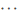

# <a name="configure-anti-phishing-policies-in-microsoft-defender-for-office-365"></a><span data-ttu-id="69d6a-103">Configurar directivas contra suplantación de identidad en Microsoft Defender para Office 365</span><span class="sxs-lookup"><span data-stu-id="69d6a-103">Configure anti-phishing policies in Microsoft Defender for Office 365</span></span>

[!INCLUDE [Microsoft 365 Defender rebranding](../includes/microsoft-defender-for-office.md)]

<span data-ttu-id="69d6a-104">**Se aplica a**</span><span class="sxs-lookup"><span data-stu-id="69d6a-104">**Applies to**</span></span>
- [<span data-ttu-id="69d6a-105">Plan 1 y Plan 2 de Microsoft Defender para Office 365</span><span class="sxs-lookup"><span data-stu-id="69d6a-105">Microsoft Defender for Office 365 plan 1 and plan 2</span></span>](defender-for-office-365.md)
- [<span data-ttu-id="69d6a-106">Microsoft 365 Defender</span><span class="sxs-lookup"><span data-stu-id="69d6a-106">Microsoft 365 Defender</span></span>](../defender/microsoft-365-defender.md)

<span data-ttu-id="69d6a-107">Las directivas contra suplantación de identidad en [Microsoft Defender](defender-for-office-365.md) para Office 365 pueden ayudar a proteger su organización de ataques de suplantación de identidad malintencionados y otros tipos de ataques de suplantación de identidad.</span><span class="sxs-lookup"><span data-stu-id="69d6a-107">Anti-phishing policies in [Microsoft Defender for Office 365](defender-for-office-365.md) can help protect your organization from malicious impersonation-based phishing attacks and other types of phishing attacks.</span></span> <span data-ttu-id="69d6a-108">Para obtener más información acerca de las diferencias entre las directivas contra suplantación de identidad en Exchange Online Protection (EOP) y las directivas contra suplantación de identidad en Microsoft Defender para Office 365, vea [Protección](anti-phishing-protection.md)contra la suplantación de identidad .</span><span class="sxs-lookup"><span data-stu-id="69d6a-108">For more information about the differences between anti-phishing policies in Exchange Online Protection (EOP) and anti-phishing policies in Microsoft Defender for Office 365, see [Anti-phishing protection](anti-phishing-protection.md).</span></span>

<span data-ttu-id="69d6a-109">Los administradores pueden ver, editar y configurar (pero no eliminar) la directiva contra suplantación de identidad predeterminada.</span><span class="sxs-lookup"><span data-stu-id="69d6a-109">Admins can view, edit, and configure (but not delete) the default anti-phishing policy.</span></span> <span data-ttu-id="69d6a-110">Para mayor granularidad, también puede crear directivas personalizadas contra la suplantación de identidad que se aplican a usuarios, grupos o dominios específicos de la organización.</span><span class="sxs-lookup"><span data-stu-id="69d6a-110">For greater granularity, you can also create custom anti-phishing policies that apply to specific users, groups, or domains in your organization.</span></span> <span data-ttu-id="69d6a-111">Las directivas personalizadas siempre tienen prioridad sobre las directivas predeterminadas, pero su prioridad (el orden de ejecución) se puede cambiar.</span><span class="sxs-lookup"><span data-stu-id="69d6a-111">Custom policies always take precedence over the default policy, but you can change the priority (running order) of your custom policies.</span></span>

<span data-ttu-id="69d6a-112">Puede configurar directivas contra la suplantación de identidad en Defender para Office 365 en el centro de seguridad de Microsoft 365 o en PowerShell Exchange Online.</span><span class="sxs-lookup"><span data-stu-id="69d6a-112">You can configure anti-phishing policies in Defender for Office 365 in the Microsoft 365 security center or in Exchange Online PowerShell.</span></span>

<span data-ttu-id="69d6a-113">Para obtener información sobre cómo configurar las directivas contra suplantación de identidad más limitadas que están disponibles en Exchange Online Protection (es decir, organizaciones sin Defender para Office 365), vea [Configure anti-phishing policies in EOP](configure-anti-phishing-policies-eop.md).</span><span class="sxs-lookup"><span data-stu-id="69d6a-113">For information about configuring the more limited in anti-phishing policies that are available in Exchange Online Protection (that is, organizations without Defender for Office 365), see [Configure anti-phishing policies in EOP](configure-anti-phishing-policies-eop.md).</span></span>

<span data-ttu-id="69d6a-114">Los elementos básicos de una directiva contra la suplantación de identidad son:</span><span class="sxs-lookup"><span data-stu-id="69d6a-114">The basic elements of an anti-phishing policy are:</span></span>

- <span data-ttu-id="69d6a-115">**La directiva contra suplantación de** identidad : especifica las protecciones de suplantación de identidad (phishing) que se habilitarán o deshabilitarán y las acciones que se aplicarán a las opciones.</span><span class="sxs-lookup"><span data-stu-id="69d6a-115">**The anti-phish policy**: Specifies the phishing protections to enable or disable, and the actions to apply options.</span></span>
- <span data-ttu-id="69d6a-116">**La regla contra suplantación de** identidad : especifica la prioridad y los filtros de destinatarios (a quién se aplica la directiva) para una directiva contra suplantación de identidad.</span><span class="sxs-lookup"><span data-stu-id="69d6a-116">**The anti-phish rule**: Specifies the priority and recipient filters (who the policy applies to) for an anti-phish policy.</span></span>

<span data-ttu-id="69d6a-117">La diferencia entre estos dos elementos no es obvia al administrar directivas contra suplantación de identidad en el centro de seguridad:</span><span class="sxs-lookup"><span data-stu-id="69d6a-117">The difference between these two elements isn't obvious when you manage anti-phishing policies in the security center:</span></span>

- <span data-ttu-id="69d6a-118">Al crear una directiva, está creando una regla contra suplantación de identidad (phish) y la directiva contra suplantación de identidad asociada al mismo tiempo con el mismo nombre para ambos.</span><span class="sxs-lookup"><span data-stu-id="69d6a-118">When you create a policy, you're actually creating an anti-phish rule and the associated anti-phish policy at the same time using the same name for both.</span></span>
- <span data-ttu-id="69d6a-119">Al modificar una directiva, la configuración relacionada con el nombre, la prioridad, la habilitada o deshabilitada y los filtros de destinatarios modifican la regla contra suplantación de identidad.</span><span class="sxs-lookup"><span data-stu-id="69d6a-119">When you modify a policy, settings related to the name, priority, enabled or disabled, and recipient filters modify the anti-phish rule.</span></span> <span data-ttu-id="69d6a-120">Todas las demás opciones modifican la directiva contra suplantación de identidad asociada.</span><span class="sxs-lookup"><span data-stu-id="69d6a-120">All other settings modify the associated anti-phish policy.</span></span>
- <span data-ttu-id="69d6a-121">Al quitar una directiva, se quitan la regla contra phishing y la directiva contra suplantación de identidad asociada.</span><span class="sxs-lookup"><span data-stu-id="69d6a-121">When you remove a policy, the anti-phish rule and the associated anti-phish policy are removed.</span></span>

<span data-ttu-id="69d6a-122">En Exchange Online PowerShell, administra la directiva y la regla por separado.</span><span class="sxs-lookup"><span data-stu-id="69d6a-122">In Exchange Online PowerShell, you manage the policy and the rule separately.</span></span> <span data-ttu-id="69d6a-123">Para obtener más información, vea la sección [Use Exchange Online PowerShell to configure anti-phishing policies](#use-exchange-online-powershell-to-configure-anti-phishing-policies) más adelante en este artículo.</span><span class="sxs-lookup"><span data-stu-id="69d6a-123">For more information, see the [Use Exchange Online PowerShell to configure anti-phishing policies](#use-exchange-online-powershell-to-configure-anti-phishing-policies) section later in this article.</span></span>

<span data-ttu-id="69d6a-124">Cada organización de Defender para Office 365 tiene una directiva contra la suplantación de identidad integrada denominada Office365 AntiPhish Default que tiene estas propiedades:</span><span class="sxs-lookup"><span data-stu-id="69d6a-124">Every Defender for Office 365 organization has a built-in anti-phishing policy named Office365 AntiPhish Default that has these properties:</span></span>

- <span data-ttu-id="69d6a-125">La directiva se aplica a todos los destinatarios de la organización, aunque no haya ninguna regla contra la suplantación de identidad (filtros de destinatarios) asociada a la directiva.</span><span class="sxs-lookup"><span data-stu-id="69d6a-125">The policy is applied to all recipients in the organization, even though there's no anti-phish rule (recipient filters) associated with the policy.</span></span>
- <span data-ttu-id="69d6a-126">La directiva tiene un valor de prioridad personalizado **Mínimo** que no se puede modificar (la directiva siempre se aplica en último lugar).</span><span class="sxs-lookup"><span data-stu-id="69d6a-126">The policy has the custom priority value **Lowest** that you can't modify (the policy is always applied last).</span></span> <span data-ttu-id="69d6a-127">Las directivas personalizadas que cree siempre tendrán una prioridad mayor.</span><span class="sxs-lookup"><span data-stu-id="69d6a-127">Any custom policies that you create always have a higher priority.</span></span>
- <span data-ttu-id="69d6a-128">La directiva es la directiva predeterminada (la propiedad **IsDefault** tiene el valor `True`), y no puede eliminar esta directiva predeterminada.</span><span class="sxs-lookup"><span data-stu-id="69d6a-128">The policy is the default policy (the **IsDefault** property has the value `True`), and you can't delete the default policy.</span></span>

<span data-ttu-id="69d6a-129">Para aumentar la eficacia de la protección contra suplantación de identidad en Defender para Office 365, puede crear directivas contra suplantación de identidad personalizadas con una configuración más estricta que se aplique a usuarios o grupos de usuarios específicos.</span><span class="sxs-lookup"><span data-stu-id="69d6a-129">To increase the effectiveness of anti-phishing protection in Defender for Office 365, you can create custom anti-phishing policies with stricter settings that are applied to specific users or groups of users.</span></span>

## <a name="what-do-you-need-to-know-before-you-begin"></a><span data-ttu-id="69d6a-130">¿Qué necesita saber antes de comenzar?</span><span class="sxs-lookup"><span data-stu-id="69d6a-130">What do you need to know before you begin?</span></span>

- <span data-ttu-id="69d6a-131">Puede abrir el Centro de seguridad en <https://security.microsoft.com/>.</span><span class="sxs-lookup"><span data-stu-id="69d6a-131">You open the security center at <https://security.microsoft.com/>.</span></span> <span data-ttu-id="69d6a-132">Para ir directamente a la **página Anti-phishing,** use <https://security.microsoft.com/antiphishing> .</span><span class="sxs-lookup"><span data-stu-id="69d6a-132">To go directly to the **Anti-phishing** page, use <https://security.microsoft.com/antiphishing>.</span></span>

- <span data-ttu-id="69d6a-133">Para conectarse al PowerShell de Exchange Online, consulte [Conectarse a PowerShell de Exchange Online](/powershell/exchange/connect-to-exchange-online-powershell).</span><span class="sxs-lookup"><span data-stu-id="69d6a-133">To connect to Exchange Online PowerShell, see [Connect to Exchange Online PowerShell](/powershell/exchange/connect-to-exchange-online-powershell).</span></span>

- <span data-ttu-id="69d6a-134">Debe tener permisos asignados en la **Exchange Online** antes de poder realizar los procedimientos de este artículo:</span><span class="sxs-lookup"><span data-stu-id="69d6a-134">You need to be assigned permissions in **Exchange Online** before you can do the procedures in this article:</span></span>
  - <span data-ttu-id="69d6a-135">Para agregar, modificar y eliminar directivas contra suplantación de identidad, debe ser miembro de los grupos de roles **Administración** de la organización o Administrador **de** seguridad.</span><span class="sxs-lookup"><span data-stu-id="69d6a-135">To add, modify, and delete anti-phishing policies, you need to be a member of the **Organization Management** or **Security Administrator** role groups.</span></span>
  - <span data-ttu-id="69d6a-136">Para obtener acceso de solo lectura a directivas contra suplantación de identidad, debe ser miembro de los grupos de roles Lector **global** o Lector **de** <sup>\*</sup> seguridad.</span><span class="sxs-lookup"><span data-stu-id="69d6a-136">For read-only access to anti-phishing policies, you need to be a member of the **Global Reader** or **Security Reader** role groups<sup>\*</sup>.</span></span>

  <span data-ttu-id="69d6a-137">Para obtener más información, consulte los [permisos en Exchange Online](/exchange/permissions-exo/permissions-exo).</span><span class="sxs-lookup"><span data-stu-id="69d6a-137">For more information, see [Permissions in Exchange Online](/exchange/permissions-exo/permissions-exo).</span></span>

  <span data-ttu-id="69d6a-138">**Notas**:</span><span class="sxs-lookup"><span data-stu-id="69d6a-138">**Notes**:</span></span>

  - <span data-ttu-id="69d6a-139">Agregar usuarios al rol de Azure Active Directory correspondiente en el Centro de administración de Microsoft 365 proporciona a los usuarios los permisos necesarios _y_ los permisos para otras características de Microsoft 365.</span><span class="sxs-lookup"><span data-stu-id="69d6a-139">Adding users to the corresponding Azure Active Directory role in the Microsoft 365 admin center gives users the required permissions _and_ permissions for other features in Microsoft 365.</span></span> <span data-ttu-id="69d6a-140">Para obtener más información, vea [Sobre los roles de administrador](../../admin/add-users/about-admin-roles.md).</span><span class="sxs-lookup"><span data-stu-id="69d6a-140">For more information, see [About admin roles](../../admin/add-users/about-admin-roles.md).</span></span>
  - <span data-ttu-id="69d6a-141">El grupo de roles **Administración de organización de solo lectura** en [Exchange Online](/Exchange/permissions-exo/permissions-exo#role-groups) también proporciona acceso de solo lectura a la característica.</span><span class="sxs-lookup"><span data-stu-id="69d6a-141">The **View-Only Organization Management** role group in [Exchange Online](/Exchange/permissions-exo/permissions-exo#role-groups) also gives read-only access to the feature.</span></span>

- <span data-ttu-id="69d6a-142">Para obtener información sobre la configuración recomendada para las directivas contra suplantación de identidad en Defender para Office 365, consulte [Anti-phishing policy in Defender for Office 365 settings](recommended-settings-for-eop-and-office365.md#anti-phishing-policy-settings-in-microsoft-defender-for-office-365).</span><span class="sxs-lookup"><span data-stu-id="69d6a-142">For our recommended settings for anti-phishing policies in Defender for Office 365, see [Anti-phishing policy in Defender for Office 365 settings](recommended-settings-for-eop-and-office365.md#anti-phishing-policy-settings-in-microsoft-defender-for-office-365).</span></span>

- <span data-ttu-id="69d6a-143">Permitir hasta 30 minutos para que se aplique una directiva nueva o actualizada.</span><span class="sxs-lookup"><span data-stu-id="69d6a-143">Allow up to 30 minutes for a new or updated policy to be applied.</span></span>

- <span data-ttu-id="69d6a-144">Para obtener información sobre dónde se aplican las directivas contra suplantación de identidad en la canalización de filtrado, vea [Order and precedence of email protection](how-policies-and-protections-are-combined.md).</span><span class="sxs-lookup"><span data-stu-id="69d6a-144">For information about where anti-phishing policies are applied in the filtering pipeline, see [Order and precedence of email protection](how-policies-and-protections-are-combined.md).</span></span>

## <a name="use-the-security-center-to-create-anti-phishing-policies"></a><span data-ttu-id="69d6a-145">Usar el centro de seguridad para crear directivas contra suplantación de identidad</span><span class="sxs-lookup"><span data-stu-id="69d6a-145">Use the security center to create anti-phishing policies</span></span>

<span data-ttu-id="69d6a-146">La creación de una directiva contra suplantación de identidad personalizada en el centro de seguridad crea la regla contra suplantación de identidad (phishing) y la directiva contra suplantación de identidad asociada al mismo tiempo con el mismo nombre para ambos.</span><span class="sxs-lookup"><span data-stu-id="69d6a-146">Creating a custom anti-phishing policy in the security center creates the anti-phish rule and the associated anti-phish policy at the same time using the same name for both.</span></span>

1. <span data-ttu-id="69d6a-147">En el centro de seguridad, vaya a Correo electrónico **& directivas** de colaboración & De directivas de amenazas de reglas \>  \>  \>  sección \> **Anti-phishing**.</span><span class="sxs-lookup"><span data-stu-id="69d6a-147">In the security center, go to **Email & Collaboration** \> **Policies & Rules** \> **Threat policies** \> **Policies** section \> **Anti-phishing**.</span></span>

2. <span data-ttu-id="69d6a-148">En la **página Anti-phishing,** haga clic  **Crear**.</span><span class="sxs-lookup"><span data-stu-id="69d6a-148">On the **Anti-phishing** page, click  **Create**.</span></span>

3. <span data-ttu-id="69d6a-149">Se abrirá el asistente para directivas.</span><span class="sxs-lookup"><span data-stu-id="69d6a-149">The policy wizard opens.</span></span> <span data-ttu-id="69d6a-150">En la **página Nombre de directiva,** configure estas opciones:</span><span class="sxs-lookup"><span data-stu-id="69d6a-150">On the **Policy name** page, configure these settings:</span></span>
   - <span data-ttu-id="69d6a-151">**Nombre**: escriba un nombre único y descriptivo para la directiva.</span><span class="sxs-lookup"><span data-stu-id="69d6a-151">**Name**: Enter a unique, descriptive name for the policy.</span></span>
   - <span data-ttu-id="69d6a-152">**Descripción**: escriba una descripción opcional para la directiva.</span><span class="sxs-lookup"><span data-stu-id="69d6a-152">**Description**: Enter an optional description for the policy.</span></span>

   <span data-ttu-id="69d6a-153">Cuando termine, haga clic en **Siguiente**.</span><span class="sxs-lookup"><span data-stu-id="69d6a-153">When you're finished, click **Next**.</span></span>

4. <span data-ttu-id="69d6a-154">En la página **Usuarios, grupos y dominios** que aparece, identifique los destinatarios internos a los que se aplica la directiva (condiciones de destinatario):</span><span class="sxs-lookup"><span data-stu-id="69d6a-154">On the **Users, groups, and domains** page that appears, identify the internal recipients that the policy applies to (recipient conditions):</span></span>
   - <span data-ttu-id="69d6a-155">**Usuarios**: los buzones, usuarios de correo o contactos de correo especificados de su organización.</span><span class="sxs-lookup"><span data-stu-id="69d6a-155">**Users**: The specified mailboxes, mail users, or mail contacts in your organization.</span></span>
   - <span data-ttu-id="69d6a-156">**Grupos**: los grupos de distribución, los grupos de seguridad habilitados para correo electrónico o los Grupos de Microsoft 365 especificados de la organización.</span><span class="sxs-lookup"><span data-stu-id="69d6a-156">**Groups**: The specified distribution groups, mail-enabled security groups, or Microsoft 365 Groups in your organization.</span></span>
   - <span data-ttu-id="69d6a-157">**Dominios**: todos los destinatarios de los [dominios aceptados](/exchange/mail-flow-best-practices/manage-accepted-domains/manage-accepted-domains) especificados en la organización.</span><span class="sxs-lookup"><span data-stu-id="69d6a-157">**Domains**: All recipients in the specified [accepted domains](/exchange/mail-flow-best-practices/manage-accepted-domains/manage-accepted-domains) in your organization.</span></span>

   <span data-ttu-id="69d6a-158">Haga clic en el cuadro correspondiente, comience a escribir un valor y seleccione el valor que desee de los resultados.</span><span class="sxs-lookup"><span data-stu-id="69d6a-158">Click in the appropriate box, start typing a value, and select the value that you want from the results.</span></span> <span data-ttu-id="69d6a-159">Repita este proceso tantas veces como sea necesario.</span><span class="sxs-lookup"><span data-stu-id="69d6a-159">Repeat this process as many times as necessary.</span></span> <span data-ttu-id="69d6a-160">Para quitar un valor existente, haga clic en Quitar</span><span class="sxs-lookup"><span data-stu-id="69d6a-160">To remove an existing value, click remove</span></span>  <span data-ttu-id="69d6a-162">junto al valor.</span><span class="sxs-lookup"><span data-stu-id="69d6a-162">next to the value.</span></span>

   <span data-ttu-id="69d6a-163">Para los usuarios o grupos, puede usar la mayoría de los identificadores (nombre, nombre para mostrar, alias, dirección de correo electrónico, nombre de cuenta, etc.), pero el nombre para mostrar correspondiente se muestra en los resultados.</span><span class="sxs-lookup"><span data-stu-id="69d6a-163">For users or groups, you can use most identifiers (name, display name, alias, email address, account name, etc.), but the corresponding display name is shown in the results.</span></span> <span data-ttu-id="69d6a-164">Para los usuarios, escriba un asterisco (\*) para ver todos los valores disponibles.</span><span class="sxs-lookup"><span data-stu-id="69d6a-164">For users, enter an asterisk (\*) by itself to see all available values.</span></span>

   <span data-ttu-id="69d6a-165">Varios valores en la misma condición usan la lógica OR (por ejemplo, _\<recipient1\>_ o _\<recipient2\>_).</span><span class="sxs-lookup"><span data-stu-id="69d6a-165">Multiple values in the same condition use OR logic (for example, _\<recipient1\>_ or _\<recipient2\>_).</span></span> <span data-ttu-id="69d6a-166">Hay diferentes condiciones que usan la lógica AND (por ejemplo, _\<recipient1\>_ y _\<member of group 1\>_).</span><span class="sxs-lookup"><span data-stu-id="69d6a-166">Different conditions use AND logic (for example, _\<recipient1\>_ and _\<member of group 1\>_).</span></span>

   - <span data-ttu-id="69d6a-167">**Excluir estos usuarios, grupos y dominios**: para agregar excepciones a los destinatarios internos a los que se aplica la directiva (excepciones de destinatarios), seleccione esta opción y configure las excepciones.</span><span class="sxs-lookup"><span data-stu-id="69d6a-167">**Exclude these users, groups, and domains**: To add exceptions for the internal recipients that the policy applies to (recpient exceptions), select this option and configure the exceptions.</span></span> <span data-ttu-id="69d6a-168">La configuración y el comportamiento se muestran exactamente igual que las condiciones.</span><span class="sxs-lookup"><span data-stu-id="69d6a-168">The settings and behavior are exactly like the conditions.</span></span>

   <span data-ttu-id="69d6a-169">Cuando termine, haga clic en **Siguiente**.</span><span class="sxs-lookup"><span data-stu-id="69d6a-169">When you're finished, click **Next**.</span></span>

5. <span data-ttu-id="69d6a-170">En la **página de protección de & de** suplantación de identidad que aparece, configure las siguientes opciones:</span><span class="sxs-lookup"><span data-stu-id="69d6a-170">On the **Phishing threshold & protection** page that appears, configure the following settings:</span></span>

   - <span data-ttu-id="69d6a-171">**Umbral de correo electrónico de** suplantación de identidad : use el control deslizante para seleccionar uno de los siguientes valores:</span><span class="sxs-lookup"><span data-stu-id="69d6a-171">**Phishing email threshold**: Use the slider to select one of the following values:</span></span>
     - <span data-ttu-id="69d6a-172">**1- Estándar** (este es el valor predeterminado).</span><span class="sxs-lookup"><span data-stu-id="69d6a-172">**1 - Standard** (This is the default value.)</span></span>
     - <span data-ttu-id="69d6a-173">**2 : agresivo**</span><span class="sxs-lookup"><span data-stu-id="69d6a-173">**2 - Aggressive**</span></span>
     - <span data-ttu-id="69d6a-174">**3: más agresivo**</span><span class="sxs-lookup"><span data-stu-id="69d6a-174">**3 - More aggressive**</span></span>
     - <span data-ttu-id="69d6a-175">**4: más agresivo**</span><span class="sxs-lookup"><span data-stu-id="69d6a-175">**4 - Most aggressive**</span></span>

     <span data-ttu-id="69d6a-176">Para obtener más información, consulte [Advanced phishing thresholds in anti-phishing policies in Microsoft Defender for Office 365](set-up-anti-phishing-policies.md#advanced-phishing-thresholds-in-anti-phishing-policies-in-microsoft-defender-for-office-365).</span><span class="sxs-lookup"><span data-stu-id="69d6a-176">For more information, see [Advanced phishing thresholds in anti-phishing policies in Microsoft Defender for Office 365](set-up-anti-phishing-policies.md#advanced-phishing-thresholds-in-anti-phishing-policies-in-microsoft-defender-for-office-365).</span></span>

   - <span data-ttu-id="69d6a-177">**Suplantación:** esta configuración es una condición para la directiva que identifica remitentes específicos para buscar (individualmente o por dominio) en la dirección De de los mensajes entrantes.</span><span class="sxs-lookup"><span data-stu-id="69d6a-177">**Impersonation**: These settings are a condition for the policy that identifies specific senders to look for (individually or by domain) in the From address of inbound messages.</span></span> <span data-ttu-id="69d6a-178">Para obtener más información, vea Configuración de suplantación en directivas contra suplantación de identidad en [Microsoft Defender para Office 365](set-up-anti-phishing-policies.md#impersonation-settings-in-anti-phishing-policies-in-microsoft-defender-for-office-365).</span><span class="sxs-lookup"><span data-stu-id="69d6a-178">For more information, see [Impersonation settings in anti-phishing policies in Microsoft Defender for Office 365](set-up-anti-phishing-policies.md#impersonation-settings-in-anti-phishing-policies-in-microsoft-defender-for-office-365).</span></span>

     > [!NOTE]
     >
     > - <span data-ttu-id="69d6a-179">En cada directiva contra phishing, puede especificar un máximo de 60 usuarios protegidos (direcciones de correo electrónico del remitente).</span><span class="sxs-lookup"><span data-stu-id="69d6a-179">In each anti-phishing policy, you can specify a maximum of 60 protected users (sender email addresses).</span></span> <span data-ttu-id="69d6a-180">No puede especificar el mismo usuario protegido en varias directivas.</span><span class="sxs-lookup"><span data-stu-id="69d6a-180">You can't specify the same protected user in multiple policies.</span></span>
     >
     > - <span data-ttu-id="69d6a-181">La protección de suplantación de usuario no funciona si el remitente y el destinatario se han comunicado previamente por correo electrónico.</span><span class="sxs-lookup"><span data-stu-id="69d6a-181">User impersonation protection does not work if the sender and recipient have previously communicated via email.</span></span> <span data-ttu-id="69d6a-182">Si el remitente y el destinatario nunca se han comunicado por correo electrónico, el mensaje se identificará como un intento de suplantación.</span><span class="sxs-lookup"><span data-stu-id="69d6a-182">If the sender and recipient have never communicated via email, the message will be identified as an impersonation attempt.</span></span>

     - <span data-ttu-id="69d6a-183">**Permitir a los usuarios proteger:** el valor predeterminado está desactivado (no seleccionado).</span><span class="sxs-lookup"><span data-stu-id="69d6a-183">**Enable users to protect**: The default value is off (not selected).</span></span> <span data-ttu-id="69d6a-184">Para activarla, active la casilla y, a continuación, haga clic en el vínculo Administrar **(nn) remitentes** que aparece.</span><span class="sxs-lookup"><span data-stu-id="69d6a-184">To turn it on, select the check box, and then click the **Manage (nn) sender(s)** link that appears.</span></span>

       <span data-ttu-id="69d6a-185">En el control desplegable Administrar **remitentes** para protección de suplantación que aparece, siga estos pasos:</span><span class="sxs-lookup"><span data-stu-id="69d6a-185">In the **Manage senders for impersonation protection** flyout that appears, do the following steps:</span></span>

       - <span data-ttu-id="69d6a-186">**Remitentes internos:** haga clic  **interno**.</span><span class="sxs-lookup"><span data-stu-id="69d6a-186">**Internal senders**: Click  **Select internal**.</span></span> <span data-ttu-id="69d6a-187">En el **control desplegable Agregar remitentes** internos que aparece, haga clic en el cuadro y seleccione un usuario interno de la lista.</span><span class="sxs-lookup"><span data-stu-id="69d6a-187">In the **Add internal senders** flyout that appears, click in the box and select an internal user from the list.</span></span> <span data-ttu-id="69d6a-188">Puede filtrar la lista escribiendo el usuario y, a continuación, seleccionando el usuario en los resultados.</span><span class="sxs-lookup"><span data-stu-id="69d6a-188">You can filter the list by typing the user, and then selecting the user from the results.</span></span> <span data-ttu-id="69d6a-189">Puede usar la mayoría de los identificadores (nombre, nombre para mostrar, alias, dirección de correo electrónico, nombre de cuenta, etc.), pero el nombre para mostrar correspondiente se muestra en los resultados.</span><span class="sxs-lookup"><span data-stu-id="69d6a-189">You can use most identifiers (name, display name, alias, email address, account name, etc.), but the corresponding display name is shown in the results.</span></span>

         <span data-ttu-id="69d6a-190">Repita este paso tantas veces como sea necesario.</span><span class="sxs-lookup"><span data-stu-id="69d6a-190">Repeat this step as many times as necessary.</span></span> <span data-ttu-id="69d6a-191">Para quitar un valor existente, haga clic en Quitar</span><span class="sxs-lookup"><span data-stu-id="69d6a-191">To remove an existing value, click remove</span></span>  <span data-ttu-id="69d6a-193">junto al valor.</span><span class="sxs-lookup"><span data-stu-id="69d6a-193">next to the value.</span></span>

         <span data-ttu-id="69d6a-194">Cuando haya terminado, haga clic en **Agregar**</span><span class="sxs-lookup"><span data-stu-id="69d6a-194">When you're finished, click **Add**</span></span>

       - <span data-ttu-id="69d6a-195">**Remitentes externos:** haga clic  **externo**.</span><span class="sxs-lookup"><span data-stu-id="69d6a-195">**External senders**: Click  **Select external**.</span></span> <span data-ttu-id="69d6a-196">En el control desplegable Agregar **remitentes externos** que  aparece, escriba un nombre para mostrar en el cuadro Agregar un nombre y una dirección de correo electrónico en el cuadro Agregar un correo electrónico vacío y, **a** continuación, haga clic en **Agregar**.</span><span class="sxs-lookup"><span data-stu-id="69d6a-196">In the **Add external senders** flyout that appears, enter a display name in the **Add a name** box and an email address in the **Add a vaild email** box, and then click **Add**.</span></span>

         <span data-ttu-id="69d6a-197">Repita este paso tantas veces como sea necesario.</span><span class="sxs-lookup"><span data-stu-id="69d6a-197">Repeat this step as many times as necessary.</span></span> <span data-ttu-id="69d6a-198">Para quitar un valor existente, haga clic en Quitar</span><span class="sxs-lookup"><span data-stu-id="69d6a-198">To remove an existing value, click remove</span></span>  <span data-ttu-id="69d6a-200">junto al valor.</span><span class="sxs-lookup"><span data-stu-id="69d6a-200">next to the value.</span></span>

         <span data-ttu-id="69d6a-201">Cuando haya terminado, haga clic en **Agregar**</span><span class="sxs-lookup"><span data-stu-id="69d6a-201">When you're finished, click **Add**</span></span>

       <span data-ttu-id="69d6a-202">En el control desplegable Administrar **remitentes** para suplantación, puede quitar entradas seleccionando una o más entradas de la lista.</span><span class="sxs-lookup"><span data-stu-id="69d6a-202">Back on the **Manage senders for impersonation** flyout, you can remove entries by selecting one or more entries from the list.</span></span> <span data-ttu-id="69d6a-203">Puede buscar entradas mediante el cuadro   buscar.</span><span class="sxs-lookup"><span data-stu-id="69d6a-203">You can search for entries using the  **Search** box.</span></span>

       <span data-ttu-id="69d6a-204">Después de seleccionar al menos una entrada, aparece el icono Quitar usuarios seleccionados Quitar usuarios seleccionados, que puede usar para   seleccionadas.</span><span class="sxs-lookup"><span data-stu-id="69d6a-204">After you select at least one entry, the  **Remove selected users** icon appears, which you can use to remove the selected entries.</span></span>

       <span data-ttu-id="69d6a-205">Cuando haya terminado, haga clic en **Listo**.</span><span class="sxs-lookup"><span data-stu-id="69d6a-205">When you're finished, click **Done**.</span></span>

     - <span data-ttu-id="69d6a-206">**Habilitar dominios para proteger:** el valor predeterminado está desactivado (no seleccionado).</span><span class="sxs-lookup"><span data-stu-id="69d6a-206">**Enable domains to protect**: The default value is off (not selected).</span></span> <span data-ttu-id="69d6a-207">Para activarla, active la casilla y, a continuación, configure una o ambas opciones de configuración que aparecen:</span><span class="sxs-lookup"><span data-stu-id="69d6a-207">To turn it on, select the check box, and then configure one or both of the following settings that appear:</span></span>
       - <span data-ttu-id="69d6a-208">**Incluir los dominios que tengo:** para activar esta configuración, active la casilla.</span><span class="sxs-lookup"><span data-stu-id="69d6a-208">**Include the domains I own**: To turn this setting on, select the check box.</span></span> <span data-ttu-id="69d6a-209">Para ver los dominios que posee, haga clic **en Ver mis dominios**.</span><span class="sxs-lookup"><span data-stu-id="69d6a-209">To view the domains that you own, click **View my domains**.</span></span>
       - <span data-ttu-id="69d6a-210">**Incluir dominios personalizados:** para activar esta configuración, active la casilla y, a continuación, haga clic en el vínculo Administrar **(nn)** dominios personalizados que aparece.</span><span class="sxs-lookup"><span data-stu-id="69d6a-210">**Include custom domains**: To turn this setting on, select the check box, and then click the **Manage (nn) custom domain(s)** link that appears.</span></span> <span data-ttu-id="69d6a-211">En el control desplegable Administrar dominios **personalizados** para protección de suplantación que aparece, haga clic  **dominios**.</span><span class="sxs-lookup"><span data-stu-id="69d6a-211">In the **Manage custom domains for impersonation protection** flyout that appears, click  **Add domains**.</span></span>

         <span data-ttu-id="69d6a-212">En **el** control desplegable Agregar dominios personalizados que aparece, haga clic en el cuadro Dominio, escriba un valor y, a continuación, presione Entrar o seleccione el valor que se muestra debajo del cuadro. </span><span class="sxs-lookup"><span data-stu-id="69d6a-212">In the **Add custom domains** flyout that appears, click in the **Domain** box, enter a value, and then press Enter or select the value that's displayed below the box.</span></span> <span data-ttu-id="69d6a-213">Repita este paso tantas veces como sea necesario.</span><span class="sxs-lookup"><span data-stu-id="69d6a-213">Repeat this step as many times as necessary.</span></span> <span data-ttu-id="69d6a-214">Para quitar un valor existente, haga clic en Quitar en  junto al valor.</span><span class="sxs-lookup"><span data-stu-id="69d6a-214">To remove an existing value, click remove  next to the value.</span></span>

         <span data-ttu-id="69d6a-215">Cuando haya terminado, haga clic en **Agregar dominios**</span><span class="sxs-lookup"><span data-stu-id="69d6a-215">When you're finished, click **Add domains**</span></span>

         > [!NOTE]
         > <span data-ttu-id="69d6a-216">Puede tener un máximo de 50 dominios en todas las directivas contra suplantación de identidad.</span><span class="sxs-lookup"><span data-stu-id="69d6a-216">You can have a maximum of 50 domains in all anti-phishing policies.</span></span>

       <span data-ttu-id="69d6a-217">En el **control** desplegable Administrar dominios personalizados para suplantación, puede quitar entradas seleccionando una o más entradas de la lista.</span><span class="sxs-lookup"><span data-stu-id="69d6a-217">Back on the **Manage custom domains for impersonation** flyout, you can remove entries by selecting one or more entries from the list.</span></span> <span data-ttu-id="69d6a-218">Puede buscar entradas mediante el cuadro   buscar.</span><span class="sxs-lookup"><span data-stu-id="69d6a-218">You can search for entries using the  **Search** box.</span></span>

       <span data-ttu-id="69d6a-219">Después de seleccionar al menos una entrada, aparece el icono Eliminar dominios Eliminar, que puede usar   seleccionadas.</span><span class="sxs-lookup"><span data-stu-id="69d6a-219">After you select at least one entry, the  **Delete** icon appears, which you can use to remove the selected entries.</span></span>

   - <span data-ttu-id="69d6a-220">**Agregar remitentes y** dominios de confianza: : especifique excepciones de protección de suplantación para la directiva haciendo clic en Administrar **(nn) remitentes** de confianza y dominios .</span><span class="sxs-lookup"><span data-stu-id="69d6a-220">**Add trusted senders and domains**: : Specify impersonation protection exceptions for the policy by clicking on **Manage (nn) trusted sender(s) and domain(s)**.</span></span> <span data-ttu-id="69d6a-221">En el control desplegable Administrar dominios **personalizados** para protección de suplantación que aparece, configure las siguientes opciones:</span><span class="sxs-lookup"><span data-stu-id="69d6a-221">In the **Manage custom domains for impersonation protection** flyout that appears, configure the following settings:</span></span>
      - <span data-ttu-id="69d6a-222">**Remitentes:** compruebe que la **pestaña** Remitente está seleccionada y haga clic  .</span><span class="sxs-lookup"><span data-stu-id="69d6a-222">**Senders**: Verify the **Sender** tab is selected and click .</span></span> <span data-ttu-id="69d6a-223">En el control desplegable Agregar **remitentes de** confianza que aparece, escriba una dirección de correo electrónico en el cuadro y, a continuación, haga clic en **Agregar**.</span><span class="sxs-lookup"><span data-stu-id="69d6a-223">In the **Add trusted senders** flyout that appears, enter an email address in the box and then click **Add**.</span></span> <span data-ttu-id="69d6a-224">Repita este paso tantas veces como sea necesario.</span><span class="sxs-lookup"><span data-stu-id="69d6a-224">Repeat this step as many times as necessary.</span></span> <span data-ttu-id="69d6a-225">Para quitar una entrada existente, haga clic  entrada.</span><span class="sxs-lookup"><span data-stu-id="69d6a-225">To remove an existing entry, click  for the entry.</span></span>

        <span data-ttu-id="69d6a-226">Cuando haya terminado, haga clic en **Agregar**.</span><span class="sxs-lookup"><span data-stu-id="69d6a-226">When you're finished, click **Add**.</span></span>

      - <span data-ttu-id="69d6a-227">**Dominios:** seleccione la **pestaña Dominio** y haga clic en Agregar dominios  .</span><span class="sxs-lookup"><span data-stu-id="69d6a-227">**Domains**: Select the **Domain** tab and click .</span></span>
  
        <span data-ttu-id="69d6a-228">En **el** control desplegable Agregar dominios de  confianza que aparece, haga clic en el cuadro Dominio, escriba un valor y, a continuación, presione Entrar o seleccione el valor que se muestra debajo del cuadro.</span><span class="sxs-lookup"><span data-stu-id="69d6a-228">In the **Add trusted domains** flyout that appears, click in the **Domain** box, enter a value, and then press Enter or select the value that's displayed below the box.</span></span> <span data-ttu-id="69d6a-229">Repita este paso tantas veces como sea necesario.</span><span class="sxs-lookup"><span data-stu-id="69d6a-229">Repeat this step as many times as necessary.</span></span> <span data-ttu-id="69d6a-230">Para quitar un valor existente, haga clic en Quitar en  junto al valor.</span><span class="sxs-lookup"><span data-stu-id="69d6a-230">To remove an existing value, click remove  next to the value.</span></span>

        <span data-ttu-id="69d6a-231">Cuando haya terminado, haga clic en **Agregar**.</span><span class="sxs-lookup"><span data-stu-id="69d6a-231">When you're finished, click **Add**.</span></span>

     <span data-ttu-id="69d6a-232">En el  control desplegable Administrar dominios personalizados para suplantación,  puede quitar entradas de las pestañas Remitente y Dominio seleccionando una o más entradas de la lista. </span><span class="sxs-lookup"><span data-stu-id="69d6a-232">Back on the **Manage custom domains for impersonation** flyout, you can remove entries from the **Sender** and **Domain** tabs by selecting one or more entries from the list.</span></span> <span data-ttu-id="69d6a-233">Puede buscar entradas mediante el cuadro   buscar.</span><span class="sxs-lookup"><span data-stu-id="69d6a-233">You can search for entries using the  **Search** box.</span></span>

     <span data-ttu-id="69d6a-234">Después de seleccionar al menos  una entrada, aparece el icono Eliminar, que puede usar para quitar las entradas seleccionadas.</span><span class="sxs-lookup"><span data-stu-id="69d6a-234">After you select at least one entry, the **Delete** icon appears, which you can use to remove the selected entries.</span></span>

     <span data-ttu-id="69d6a-235">Cuando haya terminado, haga clic en **Listo**.</span><span class="sxs-lookup"><span data-stu-id="69d6a-235">When you're finished, click **Done**.</span></span>

   - <span data-ttu-id="69d6a-236">**Habilitar inteligencia de** buzones: el valor predeterminado está en (seleccionado) y se recomienda dejarla activada.</span><span class="sxs-lookup"><span data-stu-id="69d6a-236">**Enable mailbox intelligence**: The default value is on (selected), and we recommend that you leave it on.</span></span> <span data-ttu-id="69d6a-237">Para desactivarla, desactive la casilla.</span><span class="sxs-lookup"><span data-stu-id="69d6a-237">To turn it off, clear the check box.</span></span>

     - <span data-ttu-id="69d6a-238">**Habilitar la protección de suplantación** basada en inteligencia: esta configuración solo está disponible si **Habilitar** inteligencia de buzones está activada (seleccionada).</span><span class="sxs-lookup"><span data-stu-id="69d6a-238">**Enable intelligence based impersonation protection**: This setting is available only if **Enable mailbox intelligence** is on (selected).</span></span> <span data-ttu-id="69d6a-239">Esta configuración permite que la inteligencia de buzones de correo tome medidas en los mensajes que se identifican como intentos de suplantación.</span><span class="sxs-lookup"><span data-stu-id="69d6a-239">This setting allows mailbox intelligence to take action on messages that are identified as impersonation attempts.</span></span> <span data-ttu-id="69d6a-240">Especifique la acción que debe realizar en la configuración Si la inteligencia **de buzones detecta** un usuario suplantado en la página siguiente.</span><span class="sxs-lookup"><span data-stu-id="69d6a-240">You specify the action to take in the **If mailbox intelligence detects an impersonated user** setting on the next page.</span></span>

       <span data-ttu-id="69d6a-241">Se recomienda activar esta configuración activando la casilla.</span><span class="sxs-lookup"><span data-stu-id="69d6a-241">We recommend that you turn this setting on by selecting the check box.</span></span> <span data-ttu-id="69d6a-242">Para desactivar esta configuración, desactive la casilla.</span><span class="sxs-lookup"><span data-stu-id="69d6a-242">To turn this setting off, clear the check box.</span></span>

   - <span data-ttu-id="69d6a-243">**Suplantación:** en esta sección, use la casilla Habilitar la inteligencia suplantación para activar o desactivar la inteligencia suplantación. </span><span class="sxs-lookup"><span data-stu-id="69d6a-243">**Spoof**: In this section, use the **Enable spoof intelligence** check box to turn spoof intelligence on or off.</span></span> <span data-ttu-id="69d6a-244">El valor predeterminado está en (seleccionado) y se recomienda dejarlo en.</span><span class="sxs-lookup"><span data-stu-id="69d6a-244">The default value is on (selected), and we recommend that you leave it on.</span></span> <span data-ttu-id="69d6a-245">Especifique la acción que se debe realizar en los mensajes de remitentes suplantados bloqueados en la configuración **If message is detected as spoof** en la página siguiente.</span><span class="sxs-lookup"><span data-stu-id="69d6a-245">You specify the action to take on messages from blocked spoofed senders in the **If message is detected as spoof** setting on the next page.</span></span>

     <span data-ttu-id="69d6a-246">Para desactivar la inteligencia de suplantación, desactive la casilla.</span><span class="sxs-lookup"><span data-stu-id="69d6a-246">To turn off spoof intelligence, clear the check box.</span></span>

     > [!NOTE]
     > <span data-ttu-id="69d6a-247">No es necesario desactivar la protección contra la suplantación si el registro MX no apunta a Microsoft 365; habilitar el filtrado mejorado para conectores en su lugar.</span><span class="sxs-lookup"><span data-stu-id="69d6a-247">You don't need to turn off anti-spoofing protection if your MX record doesn't point to Microsoft 365; you enable Enhanced Filtering for Connectors instead.</span></span> <span data-ttu-id="69d6a-248">Para obtener instrucciones, consulte [Enhanced Filtering for Connectors in Exchange Online](/Exchange/mail-flow-best-practices/use-connectors-to-configure-mail-flow/enhanced-filtering-for-connectors).</span><span class="sxs-lookup"><span data-stu-id="69d6a-248">For instructions, see [Enhanced Filtering for Connectors in Exchange Online](/Exchange/mail-flow-best-practices/use-connectors-to-configure-mail-flow/enhanced-filtering-for-connectors).</span></span>

   <span data-ttu-id="69d6a-249">Cuando termine, haga clic en **Siguiente**.</span><span class="sxs-lookup"><span data-stu-id="69d6a-249">When you're finished, click **Next**.</span></span>

6. <span data-ttu-id="69d6a-250">En la página **Acciones** que aparece, configure las opciones siguientes:</span><span class="sxs-lookup"><span data-stu-id="69d6a-250">On the **Actions** page that appears, configure the following settings:</span></span>

   - <span data-ttu-id="69d6a-251">**Acciones de mensaje:** configure las siguientes acciones en esta sección:</span><span class="sxs-lookup"><span data-stu-id="69d6a-251">**Message actions**: Configure the following actions in this section:</span></span>
     - <span data-ttu-id="69d6a-252">**Si el mensaje se detecta como** un usuario suplantado: esta configuración solo está disponible si seleccionó Habilitar usuarios **para** proteger en la página anterior.</span><span class="sxs-lookup"><span data-stu-id="69d6a-252">**If message is detected as an impersonated user**: This setting is available only if you selected **Enable users to protect** on the previous page.</span></span> <span data-ttu-id="69d6a-253">Seleccione una de las siguientes acciones en la lista desplegable para los mensajes donde el remitente es uno de los usuarios protegidos que especificó en la página anterior:</span><span class="sxs-lookup"><span data-stu-id="69d6a-253">Select one of the following actions in the drop down list for messages where the sender is one of the protected users that you specified on the previous page:</span></span>
       - <span data-ttu-id="69d6a-254">**No aplicar ninguna acción**</span><span class="sxs-lookup"><span data-stu-id="69d6a-254">**Don't apply any action**</span></span>
       - <span data-ttu-id="69d6a-255">**Redirigir el mensaje a otras direcciones de correo electrónico**</span><span class="sxs-lookup"><span data-stu-id="69d6a-255">**Redirect message to other email addresses**</span></span>
       - <span data-ttu-id="69d6a-256">**Mover el mensaje a las carpetas de correo no deseado de los destinatarios**</span><span class="sxs-lookup"><span data-stu-id="69d6a-256">**Move message to the recipients' Junk Email folders**</span></span>
       - <span data-ttu-id="69d6a-257">**Poner en cuarentena el mensaje**</span><span class="sxs-lookup"><span data-stu-id="69d6a-257">**Quarantine the message**</span></span>
       - <span data-ttu-id="69d6a-258">**Entregar el mensaje y agregar otras direcciones a la línea CCO**</span><span class="sxs-lookup"><span data-stu-id="69d6a-258">**Deliver the message and add other addresses to the Bcc line**</span></span>
       - <span data-ttu-id="69d6a-259">**Eliminar el mensaje antes de entregarlo**</span><span class="sxs-lookup"><span data-stu-id="69d6a-259">**Delete the message before it's delivered**</span></span>

     - <span data-ttu-id="69d6a-260">**Si el mensaje se detecta como** un dominio suplantado: esta configuración solo está disponible si seleccionó Habilitar dominios para proteger **en** la página anterior.</span><span class="sxs-lookup"><span data-stu-id="69d6a-260">**If the message is detected as an impersonated domain**: This setting is available only if you selected **Enable domains to protect** on the previous page.</span></span> <span data-ttu-id="69d6a-261">Seleccione una de las siguientes acciones en la lista desplegable para los mensajes en los que la dirección de correo electrónico del remitente se encuentra en uno de los dominios protegidos que especificó en la página anterior:</span><span class="sxs-lookup"><span data-stu-id="69d6a-261">Select one of the following actions in the drop down list for messages where the sender's email address is in one of the protected domains that you specified on the previous page:</span></span>
       - <span data-ttu-id="69d6a-262">**No aplicar ninguna acción**</span><span class="sxs-lookup"><span data-stu-id="69d6a-262">**Don't apply any action**</span></span>
       - <span data-ttu-id="69d6a-263">**Redirigir el mensaje a otras direcciones de correo electrónico**</span><span class="sxs-lookup"><span data-stu-id="69d6a-263">**Redirect message to other email addresses**</span></span>
       - <span data-ttu-id="69d6a-264">**Mover el mensaje a las carpetas de correo no deseado de los destinatarios**</span><span class="sxs-lookup"><span data-stu-id="69d6a-264">**Move message to the recipients' Junk Email folders**</span></span>
       - <span data-ttu-id="69d6a-265">**Poner en cuarentena el mensaje**</span><span class="sxs-lookup"><span data-stu-id="69d6a-265">**Quarantine the message**</span></span>
       - <span data-ttu-id="69d6a-266">**Entregar el mensaje y agregar otras direcciones a la línea CCO**</span><span class="sxs-lookup"><span data-stu-id="69d6a-266">**Deliver the message and add other addresses to the Bcc line**</span></span>
       - <span data-ttu-id="69d6a-267">**Eliminar el mensaje antes de entregarlo**</span><span class="sxs-lookup"><span data-stu-id="69d6a-267">**Delete the message before it's delivered**</span></span>

     - <span data-ttu-id="69d6a-268">**Si la inteligencia de buzones** detecta un usuario suplantado: esta configuración solo está disponible si seleccionó Habilitar inteligencia para la protección de suplantación **en** la página anterior.</span><span class="sxs-lookup"><span data-stu-id="69d6a-268">**If mailbox intelligence detects an impersonated user**: This setting is available only if you selected **Enable intelligence for impersonation protection** on the previous page.</span></span> <span data-ttu-id="69d6a-269">Seleccione una de las siguientes acciones en la lista desplegable para los mensajes que se identificaron como intentos de suplantación por inteligencia de buzones:</span><span class="sxs-lookup"><span data-stu-id="69d6a-269">Select one of the following actions in the drop down list for messages that were identified as impersonation attempts by mailbox intelligence:</span></span>
       - <span data-ttu-id="69d6a-270">**No aplicar ninguna acción**</span><span class="sxs-lookup"><span data-stu-id="69d6a-270">**Don't apply any action**</span></span>
       - <span data-ttu-id="69d6a-271">**Redirigir el mensaje a otras direcciones de correo electrónico**</span><span class="sxs-lookup"><span data-stu-id="69d6a-271">**Redirect message to other email addresses**</span></span>
       - <span data-ttu-id="69d6a-272">**Mover el mensaje a las carpetas de correo no deseado de los destinatarios**</span><span class="sxs-lookup"><span data-stu-id="69d6a-272">**Move message to the recipients' Junk Email folders**</span></span>
       - <span data-ttu-id="69d6a-273">**Poner en cuarentena el mensaje**</span><span class="sxs-lookup"><span data-stu-id="69d6a-273">**Quarantine the message**</span></span>
       - <span data-ttu-id="69d6a-274">**Entregar el mensaje y agregar otras direcciones a la línea CCO**</span><span class="sxs-lookup"><span data-stu-id="69d6a-274">**Deliver the message and add other addresses to the Bcc line**</span></span>
       - <span data-ttu-id="69d6a-275">**Eliminar el mensaje antes de entregarlo**</span><span class="sxs-lookup"><span data-stu-id="69d6a-275">**Delete the message before it's delivered**</span></span>

     - <span data-ttu-id="69d6a-276">**Si el mensaje se detecta como** suplantación: esta configuración solo está disponible si seleccionó Habilitar la inteligencia de suplantación en la página anterior. </span><span class="sxs-lookup"><span data-stu-id="69d6a-276">**If message is detected as spoof**: This setting is available only if you selected **Enable spoof intelligence** on the previous page.</span></span> <span data-ttu-id="69d6a-277">Seleccione una de las siguientes acciones en la lista desplegable para los mensajes de remitentes suplantados bloqueados:</span><span class="sxs-lookup"><span data-stu-id="69d6a-277">Select one of the following actions in the drop down list for messages from blocked spoofed senders:</span></span>
       - <span data-ttu-id="69d6a-278">**Mover el mensaje a las carpetas de correo no deseado de los destinatarios**</span><span class="sxs-lookup"><span data-stu-id="69d6a-278">**Move message to the recipients' Junk Email folders**</span></span>
       - <span data-ttu-id="69d6a-279">**Poner en cuarentena el mensaje**</span><span class="sxs-lookup"><span data-stu-id="69d6a-279">**Quarantine the message**</span></span>

   - <span data-ttu-id="69d6a-280">**Sugerencias de & indicadores** de seguridad: Configure las siguientes opciones:</span><span class="sxs-lookup"><span data-stu-id="69d6a-280">**Safety tips & indicators**: Configure the following settings:</span></span>
     - <span data-ttu-id="69d6a-281">**Mostrar la suplantación de consejo de seguridad:** esta configuración solo está disponible si seleccionó Habilitar usuarios **para** proteger en la página anterior.</span><span class="sxs-lookup"><span data-stu-id="69d6a-281">**Show user impersonation safety tip**: This setting is available only if you selected **Enable users to protect** on the previous page.</span></span>
     - <span data-ttu-id="69d6a-282">**Mostrar la suplantación de dominio consejo de seguridad:** esta configuración solo está disponible si seleccionó Habilitar dominios **para** proteger en la página anterior.</span><span class="sxs-lookup"><span data-stu-id="69d6a-282">**Show domain impersonation safety tip**: This setting is available only if you selected **Enable domains to protect** on the previous page.</span></span>
     - <span data-ttu-id="69d6a-283">**Mostrar caracteres inusuales de suplantación de usuario consejo de seguridad** Esta configuración solo está disponible si seleccionó **Habilitar** usuarios para proteger o Habilitar dominios **para** proteger en la página anterior.</span><span class="sxs-lookup"><span data-stu-id="69d6a-283">**Show user impersonation unusual characters safety tip** This setting is available only if you selected **Enable users to protect** or **Enable domains to protect** on the previous page.</span></span>
     - <span data-ttu-id="69d6a-284">**Mostrar (?)** para remitentes no autenticados para suplantación de identidad: esta configuración solo está disponible si seleccionó Habilitar la inteligencia de suplantación de identidad en la página anterior. </span><span class="sxs-lookup"><span data-stu-id="69d6a-284">**Show (?) for unauthenticated senders for spoof**: This setting is available only if you selected **Enable spoof intelligence** on the previous page.</span></span> <span data-ttu-id="69d6a-285">Agrega un signo de interrogación a la foto del remitente en el cuadro De de  Outlook si el mensaje no pasa las comprobaciones SPF o DKIM y el mensaje no pasa dmarc ni autenticación compuesta [.](email-validation-and-authentication.md#composite-authentication)</span><span class="sxs-lookup"><span data-stu-id="69d6a-285">Adds a question mark to the sender's photo in the From box in Outlook if the message does not pass SPF or DKIM checks **and** the message does not pass DMARC or [composite authentication](email-validation-and-authentication.md#composite-authentication).</span></span>
     - <span data-ttu-id="69d6a-286">**Mostrar etiqueta "via":** esta configuración solo está disponible si seleccionó Habilitar la inteligencia **de** suplantación en la página anterior.</span><span class="sxs-lookup"><span data-stu-id="69d6a-286">**Show "via" tag**: This setting is available only if you selected **Enable spoof intelligence** on the previous page.</span></span> <span data-ttu-id="69d6a-287">Agrega una etiqueta via (chris@contoso.com a través de fabrikam.com) a la dirección De si es diferente del dominio en la firma DKIM o la **dirección MAIL FROM.**</span><span class="sxs-lookup"><span data-stu-id="69d6a-287">Adds a via tag (chris@contoso.com via fabrikam.com) to the From address if it's different from the domain in the DKIM signature or the **MAIL FROM** address.</span></span> <span data-ttu-id="69d6a-288">El valor predeterminado está en (seleccionado).</span><span class="sxs-lookup"><span data-stu-id="69d6a-288">The default value is on (selected).</span></span> <span data-ttu-id="69d6a-289">Para desactivarla, desactive la casilla.</span><span class="sxs-lookup"><span data-stu-id="69d6a-289">To turn it off, clear the check box.</span></span>

       > [!NOTE]
       > <span data-ttu-id="69d6a-290">Actualmente, la configuración de la etiqueta **Mostrar "a través"** no está disponible en todas las organizaciones.</span><span class="sxs-lookup"><span data-stu-id="69d6a-290">Currently, the **Show "via" tag** setting is not available in all organizations.</span></span> <span data-ttu-id="69d6a-291">Si no tiene la configuración de etiqueta **Mostrar "a** través", el signo de interrogación y la etiqueta via están controlados por show  **(?)** para remitentes no autenticados para la configuración de suplantación de identidad en su organización.</span><span class="sxs-lookup"><span data-stu-id="69d6a-291">If you don't have the **Show "via" tag** setting, the question mark **and** the via tag are both controlled by the **Show (?) for unauthenticated senders for spoof** setting in your organization.</span></span>

     <span data-ttu-id="69d6a-292">Para activar una configuración, active la casilla.</span><span class="sxs-lookup"><span data-stu-id="69d6a-292">To turn on a setting, select the check box.</span></span> <span data-ttu-id="69d6a-293">Para desactivarla, desactive la casilla.</span><span class="sxs-lookup"><span data-stu-id="69d6a-293">To turn it off, clear the check box.</span></span>

   <span data-ttu-id="69d6a-294">Cuando termine, haga clic en **Siguiente**.</span><span class="sxs-lookup"><span data-stu-id="69d6a-294">When you're finished, click **Next**.</span></span>

7. <span data-ttu-id="69d6a-295">En la página **Revisar** que aparece, revise la configuración.</span><span class="sxs-lookup"><span data-stu-id="69d6a-295">On the **Review** page that appears, review your settings.</span></span> <span data-ttu-id="69d6a-296">Puede seleccionar **Editar** en cada sección para modificar la configuración dentro de la sección.</span><span class="sxs-lookup"><span data-stu-id="69d6a-296">You can select **Edit** in each section to modify the settings within the section.</span></span> <span data-ttu-id="69d6a-297">También puede hacer clic en **Atrás** o seleccionar la página específica del asistente.</span><span class="sxs-lookup"><span data-stu-id="69d6a-297">Or you can click **Back** or select the specific page in the wizard.</span></span>

   <span data-ttu-id="69d6a-298">Cuando haya terminado, haga clic en **Enviar**.</span><span class="sxs-lookup"><span data-stu-id="69d6a-298">When you're finished, click **Submit**.</span></span>

8. <span data-ttu-id="69d6a-299">En la página de confirmación que aparece, haga clic en **Listo**.</span><span class="sxs-lookup"><span data-stu-id="69d6a-299">On the confirmation page that appears, click **Done**.</span></span>

## <a name="use-the-security-center-to-view-anti-phishing-policies"></a><span data-ttu-id="69d6a-300">Usar el centro de seguridad para ver directivas contra suplantación de identidad</span><span class="sxs-lookup"><span data-stu-id="69d6a-300">Use the security center to view anti-phishing policies</span></span>

1. <span data-ttu-id="69d6a-301">En el centro de seguridad, vaya a Correo electrónico **& directivas** de colaboración & De directivas de amenazas de reglas \>  \>  \>  sección \> **Anti-phishing**.</span><span class="sxs-lookup"><span data-stu-id="69d6a-301">In the security center, go to **Email & Collaboration** \> **Policies & Rules** \> **Threat policies** \> **Policies** section \> **Anti-phishing**.</span></span>

2. <span data-ttu-id="69d6a-302">En la **página Anti-phishing,** las siguientes propiedades se muestran en la lista de directivas contra suplantación de identidad:</span><span class="sxs-lookup"><span data-stu-id="69d6a-302">On the **Anti-phishing** page, the following properties are displayed in the list of anti-phishing policies:</span></span>

   - <span data-ttu-id="69d6a-303">**Nombre**</span><span class="sxs-lookup"><span data-stu-id="69d6a-303">**Name**</span></span>
   - <span data-ttu-id="69d6a-304">**Estado**</span><span class="sxs-lookup"><span data-stu-id="69d6a-304">**Status**</span></span>
   - <span data-ttu-id="69d6a-305">**Prioridad**</span><span class="sxs-lookup"><span data-stu-id="69d6a-305">**Priority**</span></span>
   - <span data-ttu-id="69d6a-306">**Última modificación**</span><span class="sxs-lookup"><span data-stu-id="69d6a-306">**Last modified**</span></span>

3. <span data-ttu-id="69d6a-307">Al seleccionar una directiva haciendo clic en el nombre, la configuración de la directiva se muestra en un menú desplegable.</span><span class="sxs-lookup"><span data-stu-id="69d6a-307">When you select a policy by clicking on the name, the policy settings are displayed in a flyout.</span></span>

## <a name="use-the-security-center-to-modify-anti-phishing-policies"></a><span data-ttu-id="69d6a-308">Usar el centro de seguridad para modificar directivas contra suplantación de identidad</span><span class="sxs-lookup"><span data-stu-id="69d6a-308">Use the security center to modify anti-phishing policies</span></span>

1. <span data-ttu-id="69d6a-309">En el centro de seguridad, vaya a Correo electrónico **& directivas** de colaboración & De directivas de amenazas de reglas \>  \>  \>  sección \> **Anti-phishing**.</span><span class="sxs-lookup"><span data-stu-id="69d6a-309">In the security center, go to **Email & Collaboration** \> **Policies & Rules** \> **Threat policies** \> **Policies** section \> **Anti-phishing**.</span></span>

2. <span data-ttu-id="69d6a-310">En la **página Anti-phishing,** seleccione una directiva de la lista haciendo clic en el nombre.</span><span class="sxs-lookup"><span data-stu-id="69d6a-310">On the **Anti-phishing** page, select a policy from the list by clicking on the name.</span></span>

3. <span data-ttu-id="69d6a-311">En el control flotante de detalles de la directiva que aparece, seleccione **Editar** en cada sección para modificar la configuración dentro de la sección.</span><span class="sxs-lookup"><span data-stu-id="69d6a-311">In the policy details flyout that appears, select **Edit** in each section to modify the settings within the section.</span></span> <span data-ttu-id="69d6a-312">Para obtener más información acerca de la configuración, vea la sección Usar el centro de seguridad para crear directivas [contra suplantación](#use-the-security-center-to-create-anti-phishing-policies) de identidad anteriores en este artículo.</span><span class="sxs-lookup"><span data-stu-id="69d6a-312">For more information about the settings, see the [Use the security center to create anti-phishing policies](#use-the-security-center-to-create-anti-phishing-policies) section earlier in this article.</span></span>  

   <span data-ttu-id="69d6a-313">Para la directiva contra suplantación de identidad predeterminada, la sección **Usuarios,** grupos y dominios no está disponible (la directiva se aplica a todos) y no puede cambiar el nombre de la directiva.</span><span class="sxs-lookup"><span data-stu-id="69d6a-313">For the default anti-phishing policy, the **Users, groups, and domains** section isn't available (the policy applies to everyone), and you can't rename the policy.</span></span>

<span data-ttu-id="69d6a-314">Para habilitar o deshabilitar una directiva o establecer el orden de prioridad de la directiva, consulte las secciones siguientes.</span><span class="sxs-lookup"><span data-stu-id="69d6a-314">To enable or disable a policy or set the policy priority order, see the following sections.</span></span>

### <a name="enable-or-disable-custom-anti-phishing-policies"></a><span data-ttu-id="69d6a-315">Habilitar o deshabilitar directivas personalizadas contra suplantación de identidad</span><span class="sxs-lookup"><span data-stu-id="69d6a-315">Enable or disable custom anti-phishing policies</span></span>

<span data-ttu-id="69d6a-316">No puede deshabilitar la directiva contra suplantación de identidad predeterminada.</span><span class="sxs-lookup"><span data-stu-id="69d6a-316">You can't disable the default anti-phishing policy.</span></span>

1. <span data-ttu-id="69d6a-317">En el centro de seguridad, vaya a Correo electrónico **& directivas** de colaboración & De directivas de amenazas de reglas \>  \>  \>  sección \> **Anti-phishing**.</span><span class="sxs-lookup"><span data-stu-id="69d6a-317">In the security center, go to **Email & Collaboration** \> **Policies & Rules** \> **Threat policies** \> **Policies** section \> **Anti-phishing**.</span></span>

2. <span data-ttu-id="69d6a-318">En la **página Anti-phishing,** seleccione una directiva personalizada de la lista haciendo clic en el nombre.</span><span class="sxs-lookup"><span data-stu-id="69d6a-318">On the **Anti-phishing** page, select a custom policy from the list by clicking on the name.</span></span>

3. <span data-ttu-id="69d6a-319">En la parte superior del control flotante de detalles de la directiva que aparece, verá uno de los siguientes valores:</span><span class="sxs-lookup"><span data-stu-id="69d6a-319">At the top of the policy details flyout that appears, you'll see one of the following values:</span></span>
   - <span data-ttu-id="69d6a-320">**Directiva desactivada**: para activar la directiva, haga clic en el  **Activar**.</span><span class="sxs-lookup"><span data-stu-id="69d6a-320">**Policy off**: To turn on the policy, click  **Turn on** .</span></span>
   - <span data-ttu-id="69d6a-321">**Directiva activada**: Para desactivar la directiva, haga clic en el  y **Desactivar**.</span><span class="sxs-lookup"><span data-stu-id="69d6a-321">**Policy on**: To turn off the policy, click  **Turn off**.</span></span>

4. <span data-ttu-id="69d6a-322">En el cuadro de diálogo de confirmación que aparece, haga clic **Activar** o **Desactivar**.</span><span class="sxs-lookup"><span data-stu-id="69d6a-322">In the confirmation dialog that appears, click **Turn on** or **Turn off**.</span></span>

5. <span data-ttu-id="69d6a-323">Haga clic en **Cerrar** en el control flotante de detalles de la directiva.</span><span class="sxs-lookup"><span data-stu-id="69d6a-323">Click **Close** in the policy details flyout.</span></span>

<span data-ttu-id="69d6a-324">De nuevo en la página principal de la directiva, el valor **Estado** de la directiva estará **Activado** o **Desactivado**.</span><span class="sxs-lookup"><span data-stu-id="69d6a-324">Back on the main policy page, the **Status** value of the policy will be **On** or **Off**.</span></span>

### <a name="set-the-priority-of-custom-anti-phishing-policies"></a><span data-ttu-id="69d6a-325">Establecer la prioridad de las directivas contra suplantación de identidad personalizadas</span><span class="sxs-lookup"><span data-stu-id="69d6a-325">Set the priority of custom anti-phishing policies</span></span>

<span data-ttu-id="69d6a-326">De forma predeterminada, las directivas contra suplantación de identidad tienen una prioridad que se basa en el orden en que se crearon (las directivas más recientes son de menor prioridad que las directivas anteriores).</span><span class="sxs-lookup"><span data-stu-id="69d6a-326">By default, anti-phishing policies are given a priority that's based on the order they were created in (newer policies are lower priority than older policies).</span></span> <span data-ttu-id="69d6a-327">Un número de prioridad más bajo indica una prioridad mayor de la directiva (0 es el más alto) y las directivas se procesan por orden de prioridad (las directivas de prioridad mayor se procesan antes que las directivas de prioridad menor).</span><span class="sxs-lookup"><span data-stu-id="69d6a-327">A lower priority number indicates a higher priority for the policy (0 is the highest), and policies are processed in priority order (higher priority policies are processed before lower priority policies).</span></span> <span data-ttu-id="69d6a-328">Ninguna de las dos directivas puede tener la misma prioridad, y el procesamiento de directivas se detendrá cuando se aplique la primera directiva.</span><span class="sxs-lookup"><span data-stu-id="69d6a-328">No two policies can have the same priority, and policy processing stops after the first policy is applied.</span></span>

<span data-ttu-id="69d6a-329">Para cambiar la prioridad de una directiva, haga clic en **Aumentar la prioridad** o en **Reducir la prioridad** en las propiedades de la directiva (no se puede modificar directamente el número de **Prioridad** en el Centro de seguridad).</span><span class="sxs-lookup"><span data-stu-id="69d6a-329">To change the priority of a policy, you click **Increase priority** or **Decrease priority** in the properties of the policy (you can't directly modify the **Priority** number in the security center).</span></span> <span data-ttu-id="69d6a-330">Cambiar la prioridad de una directiva solo tiene sentido si tiene varias directivas.</span><span class="sxs-lookup"><span data-stu-id="69d6a-330">Changing the priority of a policy only makes sense if you have multiple policies.</span></span>

 <span data-ttu-id="69d6a-331">**Notas**:</span><span class="sxs-lookup"><span data-stu-id="69d6a-331">**Notes**:</span></span>

- <span data-ttu-id="69d6a-332">En el centro de seguridad, solo puede cambiar la prioridad de la directiva contra suplantación de identidad después de crearla.</span><span class="sxs-lookup"><span data-stu-id="69d6a-332">In the security center, you can only change the priority of the anti-phishing policy after you create it.</span></span> <span data-ttu-id="69d6a-333">En PowerShell, puede invalidar la prioridad predeterminada al crear la regla contra suplantación de identidad (lo que puede afectar a la prioridad de las reglas existentes).</span><span class="sxs-lookup"><span data-stu-id="69d6a-333">In PowerShell, you can override the default priority when you create the anti-phish rule (which can affect the priority of existing rules).</span></span>
- <span data-ttu-id="69d6a-334">Las directivas contra suplantación de identidad se procesan en el orden en que se muestran (la primera directiva tiene el **valor de prioridad** 0).</span><span class="sxs-lookup"><span data-stu-id="69d6a-334">Anti-phishing policies are processed in the order that they're displayed (the first policy has the **Priority** value 0).</span></span> <span data-ttu-id="69d6a-335">La directiva contra suplantación de identidad predeterminada tiene el valor de prioridad **Lowest** y no puede cambiarla.</span><span class="sxs-lookup"><span data-stu-id="69d6a-335">The default anti-phishing policy has the priority value **Lowest**, and you can't change it.</span></span>

1. <span data-ttu-id="69d6a-336">En el centro de seguridad, vaya a Correo electrónico **& directivas** de colaboración & De directivas de amenazas de reglas \>  \>  \>  sección \> **Anti-phishing**.</span><span class="sxs-lookup"><span data-stu-id="69d6a-336">In the security center, go to **Email & Collaboration** \> **Policies & Rules** \> **Threat policies** \> **Policies** section \> **Anti-phishing**.</span></span>

2. <span data-ttu-id="69d6a-337">En la **página Anti-phishing,** seleccione una directiva personalizada de la lista haciendo clic en el nombre.</span><span class="sxs-lookup"><span data-stu-id="69d6a-337">On the **Anti-phishing** page, select a custom policy from the list by clicking on the name.</span></span>

3. <span data-ttu-id="69d6a-338">En la parte superior del control flotante de detalles de la directiva que aparece, verá **Aumentar la prioridad** o **Disminuir la prioridad** en función del valor de prioridad actual y del número de directivas personalizadas:</span><span class="sxs-lookup"><span data-stu-id="69d6a-338">At the top of the policy details flyout that appears, you'll see **Increase priority** or **Decrease priority** based on the current priority value and the number of custom policies:</span></span>
   - <span data-ttu-id="69d6a-339">La directiva contra suplantación de identidad con el valor **de** prioridad **0** solo tiene disponible **la opción Disminuir** prioridad.</span><span class="sxs-lookup"><span data-stu-id="69d6a-339">The anti-phishing policy with the **Priority** value **0** has only the **Decrease priority** option available.</span></span>
   - <span data-ttu-id="69d6a-340">La directiva contra suplantación de identidad con el valor **priority** más bajo (por ejemplo, **3**) solo tiene disponible **la opción Aumentar** prioridad.</span><span class="sxs-lookup"><span data-stu-id="69d6a-340">The anti-phishing policy with the lowest **Priority** value (for example, **3**) has only the **Increase priority** option available.</span></span>
   - <span data-ttu-id="69d6a-341">Si tiene tres o más directivas contra la suplantación de identidad, las directivas entre los valores de prioridad más alta y más baja tienen disponibles las opciones **Aumentar** prioridad y **Disminuir** prioridad.</span><span class="sxs-lookup"><span data-stu-id="69d6a-341">If you have three or more anti-phishing policies, policies between the highest and lowest priority values have both the **Increase priority** and **Decrease priority** options available.</span></span>

   <span data-ttu-id="69d6a-342">Haga clic en el  **Aumentar la prioridad** o en el  **Reducir la prioridad** para cambiar el valor de **Prioridad**.</span><span class="sxs-lookup"><span data-stu-id="69d6a-342">Click  **Increase priority** or  **Decrease priority** to change the **Priority** value.</span></span>

4. <span data-ttu-id="69d6a-343">Cuando haya terminado, haga clic en **Cerrar** en el control flotante de detalles de la directiva.</span><span class="sxs-lookup"><span data-stu-id="69d6a-343">When you're finished, click **Close** in the policy details flyout.</span></span>

## <a name="use-the-security-center-to-remove-custom-anti-phishing-policies"></a><span data-ttu-id="69d6a-344">Usar el centro de seguridad para quitar directivas personalizadas contra suplantación de identidad</span><span class="sxs-lookup"><span data-stu-id="69d6a-344">Use the security center to remove custom anti-phishing policies</span></span>

<span data-ttu-id="69d6a-345">Cuando se usa el centro de seguridad para quitar una directiva de anti phishing personalizada, se eliminan tanto la regla contra suplantación de identidad como la directiva anti phishing correspondiente.</span><span class="sxs-lookup"><span data-stu-id="69d6a-345">When you use the security center to remove a custom anti-phishing policy, the anti-phish rule and the corresponding anti-phish policy are both deleted.</span></span> <span data-ttu-id="69d6a-346">No puede quitar la directiva contra suplantación de identidad predeterminada.</span><span class="sxs-lookup"><span data-stu-id="69d6a-346">You can't remove the default anti-phishing policy.</span></span>

1. <span data-ttu-id="69d6a-347">En el centro de seguridad, vaya a Correo electrónico **& directivas** de colaboración & De directivas de amenazas de reglas \>  \>  \>  sección \> **Anti-phishing**.</span><span class="sxs-lookup"><span data-stu-id="69d6a-347">In the security center, go to **Email & Collaboration** \> **Policies & Rules** \> **Threat policies** \> **Policies** section \> **Anti-phishing**.</span></span>

2. <span data-ttu-id="69d6a-348">Seleccione una directiva personalizada de la lista haciendo clic en el nombre de la directiva.</span><span class="sxs-lookup"><span data-stu-id="69d6a-348">Select a custom policy from the list by clicking on the name of the policy.</span></span> <span data-ttu-id="69d6a-349">En la parte superior del control flotante de detalles de la directiva que aparece, haga clic en el  **Más acciones** \>  **Eliminar directiva**.</span><span class="sxs-lookup"><span data-stu-id="69d6a-349">At the top of the policy details flyout that appears, click  **More actions** \>  **Delete policy**.</span></span>

3. <span data-ttu-id="69d6a-350">En el cuadro de diálogo de confirmación que aparece, haga clic en **Sí**.</span><span class="sxs-lookup"><span data-stu-id="69d6a-350">In the confirmation dialog that appears, click **Yes**.</span></span>

## <a name="use-exchange-online-powershell-to-configure-anti-phishing-policies"></a><span data-ttu-id="69d6a-351">Usar Exchange Online PowerShell para configurar directivas contra suplantación de identidad</span><span class="sxs-lookup"><span data-stu-id="69d6a-351">Use Exchange Online PowerShell to configure anti-phishing policies</span></span>

<span data-ttu-id="69d6a-352">Como se describió anteriormente, una directiva contra correo no deseado consta de una directiva contra suplantación de identidad (phish) y una regla contra suplantación de identidad (phish).</span><span class="sxs-lookup"><span data-stu-id="69d6a-352">As previously described, an anti-spam policy consists of an anti-phish policy and an anti-phish rule.</span></span>

<span data-ttu-id="69d6a-353">En Exchange Online PowerShell, la diferencia entre las directivas contra suplantación de identidad y las reglas contra suplantación de identidad es aparente.</span><span class="sxs-lookup"><span data-stu-id="69d6a-353">In Exchange Online PowerShell, the difference between anti-phish policies and anti-phish rules is apparent.</span></span> <span data-ttu-id="69d6a-354">Las directivas contra suplantación de identidad se administran mediante los cmdlets **\* -AntiPhishPolicy** y se administran reglas contra suplantación de identidad mediante los cmdlets **\* -AntiPhishRule.**</span><span class="sxs-lookup"><span data-stu-id="69d6a-354">You manage anti-phish policies by using the **\*-AntiPhishPolicy** cmdlets, and you manage anti-phish rules by using the **\*-AntiPhishRule** cmdlets.</span></span>

- <span data-ttu-id="69d6a-355">En PowerShell, primero se crea la directiva contra suplantación de identidad y, a continuación, se crea la regla contra suplantación de identidad que identifica la directiva a la que se aplica la regla.</span><span class="sxs-lookup"><span data-stu-id="69d6a-355">In PowerShell, you create the anti-phish policy first, then you create the anti-phish rule that identifies the policy that the rule applies to.</span></span>
- <span data-ttu-id="69d6a-356">En PowerShell, se modifica la configuración de la directiva contra suplantación de identidad y la regla contra suplantación de identidad por separado.</span><span class="sxs-lookup"><span data-stu-id="69d6a-356">In PowerShell, you modify the settings in the anti-phish policy and the anti-phish rule separately.</span></span>
- <span data-ttu-id="69d6a-357">Al quitar una directiva contra suplantación de identidad de PowerShell, la regla anti-phish correspondiente no se quita automáticamente y viceversa.</span><span class="sxs-lookup"><span data-stu-id="69d6a-357">When you remove an anti-phish policy from PowerShell, the corresponding anti-phish rule isn't automatically removed, and vice versa.</span></span>

### <a name="use-powershell-to-create-anti-phishing-policies"></a><span data-ttu-id="69d6a-358">Usar PowerShell para crear directivas contra suplantación de identidad</span><span class="sxs-lookup"><span data-stu-id="69d6a-358">Use PowerShell to create anti-phishing policies</span></span>

<span data-ttu-id="69d6a-359">Crear una directiva contra la suplantación de identidad en PowerShell es un proceso de dos pasos:</span><span class="sxs-lookup"><span data-stu-id="69d6a-359">Creating an anti-phishing policy in PowerShell is a two-step process:</span></span>

1. <span data-ttu-id="69d6a-360">Cree la directiva contra suplantación de identidad.</span><span class="sxs-lookup"><span data-stu-id="69d6a-360">Create the anti-phish policy.</span></span>
2. <span data-ttu-id="69d6a-361">Cree la regla contra suplantación de identidad que especifica la directiva contra suplantación de identidad a la que se aplica la regla.</span><span class="sxs-lookup"><span data-stu-id="69d6a-361">Create the anti-phish rule that specifies the anti-phish policy that the rule applies to.</span></span>

 <span data-ttu-id="69d6a-362">**Notas**:</span><span class="sxs-lookup"><span data-stu-id="69d6a-362">**Notes**:</span></span>

- <span data-ttu-id="69d6a-363">Puede crear una nueva regla contra suplantación de identidad (phish) y asignarle una directiva anti-phish existente y no asociada.</span><span class="sxs-lookup"><span data-stu-id="69d6a-363">You can create a new anti-phish rule and assign an existing, unassociated anti-phish policy to it.</span></span> <span data-ttu-id="69d6a-364">Una regla contra la suplantación de identidad no se puede asociar a más de una directiva contra suplantación de identidad.</span><span class="sxs-lookup"><span data-stu-id="69d6a-364">An anti-phish rule can't be associated with more than one anti-phish policy.</span></span>
- <span data-ttu-id="69d6a-365">Puede configurar las siguientes opciones en las nuevas directivas contra suplantación de identidad en PowerShell que no están disponibles en el centro de seguridad hasta después de crear la directiva:</span><span class="sxs-lookup"><span data-stu-id="69d6a-365">You can configure the following settings on new anti-phish policies in PowerShell that aren't available in the security center until after you create the policy:</span></span>
  - <span data-ttu-id="69d6a-366">Cree la nueva directiva como deshabilitada (_Habilitada_ `$false` en el cmdlet **New-AntiPhishRule).**</span><span class="sxs-lookup"><span data-stu-id="69d6a-366">Create the new policy as disabled (_Enabled_ `$false` on the **New-AntiPhishRule** cmdlet).</span></span>
  - <span data-ttu-id="69d6a-367">Establezca la prioridad de la directiva durante la creación (_Prioridad_ _\<Number\>_ ) en el cmdlet **New-AntiPhishRule).**</span><span class="sxs-lookup"><span data-stu-id="69d6a-367">Set the priority of the policy during creation (_Priority_ _\<Number\>_) on the **New-AntiPhishRule** cmdlet).</span></span>
- <span data-ttu-id="69d6a-368">Una nueva directiva contra suplantación de identidad que cree en PowerShell no será visible en el centro de seguridad hasta que asigne la directiva a una regla contra suplantación de identidad.</span><span class="sxs-lookup"><span data-stu-id="69d6a-368">A new anti-phish policy that you create in PowerShell isn't visible in the security center until you assign the policy to an anti-phish rule.</span></span>

#### <a name="step-1-use-powershell-to-create-an-anti-phish-policy"></a><span data-ttu-id="69d6a-369">Paso 1: Usar PowerShell para crear una directiva contra suplantación de identidad</span><span class="sxs-lookup"><span data-stu-id="69d6a-369">Step 1: Use PowerShell to create an anti-phish policy</span></span>

<span data-ttu-id="69d6a-370">Para crear una directiva contra phishing, use esta sintaxis:</span><span class="sxs-lookup"><span data-stu-id="69d6a-370">To create an anti-phish policy, use this syntax:</span></span>

```PowerShell
New-AntiPhishPolicy -Name "<PolicyName>" [-AdminDisplayName "<Comments>"] <Additional Settings>
```

<span data-ttu-id="69d6a-371">En este ejemplo se crea una directiva contra phishing denominada Cuarentena de investigación con la siguiente configuración:</span><span class="sxs-lookup"><span data-stu-id="69d6a-371">This example creates anti-phish policy named Research Quarantine with the following settings:</span></span>

- <span data-ttu-id="69d6a-372">La directiva está habilitada (no estamos usando el parámetro _Enabled_ y el valor predeterminado es `$true` ).</span><span class="sxs-lookup"><span data-stu-id="69d6a-372">The policy is enabled (we aren't using the _Enabled_ parameter, and the default value is `$true`).</span></span>
- <span data-ttu-id="69d6a-373">La descripción es: Directiva del departamento de investigación.</span><span class="sxs-lookup"><span data-stu-id="69d6a-373">The description is: Research department policy.</span></span>
- <span data-ttu-id="69d6a-374">Habilita la protección de dominios de la organización para todos los dominios aceptados y la protección de dominios de destino para fabrikam.com.</span><span class="sxs-lookup"><span data-stu-id="69d6a-374">Enables organization domains protection for all accepted domains, and targeted domains protection for fabrikam.com.</span></span>
- <span data-ttu-id="69d6a-375">Especifica Mai Fujito (mfujito@fabrikam.com) como el usuario que se debe proteger de la suplantación.</span><span class="sxs-lookup"><span data-stu-id="69d6a-375">Specifies Mai Fujito (mfujito@fabrikam.com) as the user to protect from impersonation.</span></span>
- <span data-ttu-id="69d6a-376">Habilita la inteligencia de buzones.</span><span class="sxs-lookup"><span data-stu-id="69d6a-376">Enables mailbox intelligence.</span></span>
- <span data-ttu-id="69d6a-377">Habilita la protección de inteligencia de buzones de correo y especifica la acción de cuarentena.</span><span class="sxs-lookup"><span data-stu-id="69d6a-377">Enables mailbox intelligence protection, and specifies the quarantine action.</span></span>
- <span data-ttu-id="69d6a-378">Habilita las sugerencias de seguridad.</span><span class="sxs-lookup"><span data-stu-id="69d6a-378">Enables safety tips.</span></span>

```powershell
New-AntiPhishPolicy -Name "Monitor Policy" -AdminDisplayName "Research department policy" -EnableOrganizationDomainsProtection $true -EnableTargetedDomainsProtection $true -TargetedDomainsToProtect fabrikam.com -TargetedDomainProtectionAction Quarantine -EnableTargetedUserProtection $true -TargetedUsersToProtect "Mai Fujito;mfujito@fabrikam.com" -TargetedUserProtectionAction Quarantine -EnableMailboxIntelligence $true -EnableMailboxIntelligenceProtection $true -MailboxIntelligenceProtectionAction Quarantine -EnableSimilarUsersSafetyTips $true -EnableSimilarDomainsSafetyTips $true -EnableUnusualCharactersSafetyTips $true
```

<span data-ttu-id="69d6a-379">Para obtener información detallada sobre la sintaxis y los parámetros, [vea New-AntiPhishPolicy](/powershell/module/exchange/New-AntiPhishPolicy).</span><span class="sxs-lookup"><span data-stu-id="69d6a-379">For detailed syntax and parameter information, see [New-AntiPhishPolicy](/powershell/module/exchange/New-AntiPhishPolicy).</span></span>

#### <a name="step-2-use-powershell-to-create-an-anti-phish-rule"></a><span data-ttu-id="69d6a-380">Paso 2: Usar PowerShell para crear una regla contra suplantación de identidad</span><span class="sxs-lookup"><span data-stu-id="69d6a-380">Step 2: Use PowerShell to create an anti-phish rule</span></span>

<span data-ttu-id="69d6a-381">Para crear una regla contra phishing, use esta sintaxis:</span><span class="sxs-lookup"><span data-stu-id="69d6a-381">To create an anti-phish rule, use this syntax:</span></span>

```PowerShell
New-AntiPhishRule -Name "<RuleName>" -AntiPhishPolicy "<PolicyName>" <Recipient filters> [<Recipient filter exceptions>] [-Comments "<OptionalComments>"]
```

<span data-ttu-id="69d6a-382">En este ejemplo se crea una regla contra suplantación de identidad (phish) denominada Departamento de investigación con las siguientes condiciones:</span><span class="sxs-lookup"><span data-stu-id="69d6a-382">This example creates an anti-phish rule named Research Department with the following conditions:</span></span>

- <span data-ttu-id="69d6a-383">La regla está asociada con la directiva contra phishing denominada Cuarentena de investigación.</span><span class="sxs-lookup"><span data-stu-id="69d6a-383">The rule is associated with the anti-phish policy named Research Quarantine.</span></span>
- <span data-ttu-id="69d6a-384">La regla se aplica a los miembros del grupo denominado Research Department.</span><span class="sxs-lookup"><span data-stu-id="69d6a-384">The rule applies to members of the group named Research Department.</span></span>
- <span data-ttu-id="69d6a-385">Dado que no estamos usando el parámetro _Priority,_ se usa la prioridad predeterminada.</span><span class="sxs-lookup"><span data-stu-id="69d6a-385">Because we aren't using the _Priority_ parameter, the default priority is used.</span></span>

```powershell
New-AntiPhishRule -Name "Research Department" -AntiPhishPolicy "Research Quarantine" -SentToMemberOf "Research Department"
```

<span data-ttu-id="69d6a-386">Para obtener información detallada sobre la sintaxis y los parámetros, [vea New-AntiPhishRule](/powershell/module/exchange/New-AntiPhishRule).</span><span class="sxs-lookup"><span data-stu-id="69d6a-386">For detailed syntax and parameter information, see [New-AntiPhishRule](/powershell/module/exchange/New-AntiPhishRule).</span></span>

### <a name="use-powershell-to-view-anti-phish-policies"></a><span data-ttu-id="69d6a-387">Usar PowerShell para ver directivas contra suplantación de identidad</span><span class="sxs-lookup"><span data-stu-id="69d6a-387">Use PowerShell to view anti-phish policies</span></span>

<span data-ttu-id="69d6a-388">Para ver las directivas anti phish existentes, use la siguiente sintaxis:</span><span class="sxs-lookup"><span data-stu-id="69d6a-388">To view existing anti-phish policies, use the following syntax:</span></span>

```PowerShell
Get-AntiPhishPolicy [-Identity "<PolicyIdentity>"] [| <Format-Table | Format-List> <Property1,Property2,...>]
```

<span data-ttu-id="69d6a-389">En este ejemplo se devuelve una lista resumida de todas las directivas contra phishing junto con las propiedades especificadas.</span><span class="sxs-lookup"><span data-stu-id="69d6a-389">This example returns a summary list of all anti-phish policies along with the specified properties.</span></span>

```PowerShell
Get-AntiPhishPolicy | Format-Table Name,IsDefault
```

<span data-ttu-id="69d6a-390">En este ejemplo se devuelven todos los valores de propiedad de la directiva contra suplantación de identidad denominada Executives.</span><span class="sxs-lookup"><span data-stu-id="69d6a-390">This example returns all the property values for the anti-phish policy named Executives.</span></span>

```PowerShell
Get-AntiPhishPolicy -Identity "Executives"
```

<span data-ttu-id="69d6a-391">Para obtener información detallada sobre la sintaxis y los parámetros, [vea Get-AntiPhishPolicy](/powershell/module/exchange/Get-AntiPhishPolicy).</span><span class="sxs-lookup"><span data-stu-id="69d6a-391">For detailed syntax and parameter information, see [Get-AntiPhishPolicy](/powershell/module/exchange/Get-AntiPhishPolicy).</span></span>

### <a name="use-powershell-to-view-anti-phish-rules"></a><span data-ttu-id="69d6a-392">Usar PowerShell para ver reglas contra suplantación de identidad</span><span class="sxs-lookup"><span data-stu-id="69d6a-392">Use PowerShell to view anti-phish rules</span></span>

<span data-ttu-id="69d6a-393">Para ver las reglas anti phish existentes, use la siguiente sintaxis:</span><span class="sxs-lookup"><span data-stu-id="69d6a-393">To view existing anti-phish rules, use the following syntax:</span></span>

```PowerShell
Get-AntiPhishRule [-Identity "<RuleIdentity>"] [-State <Enabled | Disabled] [| <Format-Table | Format-List> <Property1,Property2,...>]
```

<span data-ttu-id="69d6a-394">En este ejemplo se devuelve una lista resumida de todas las reglas contra phishing junto con las propiedades especificadas.</span><span class="sxs-lookup"><span data-stu-id="69d6a-394">This example returns a summary list of all anti-phish rules along with the specified properties.</span></span>

```PowerShell
Get-AntiPhishRule | Format-Table Name,Priority,State
```

<span data-ttu-id="69d6a-395">Para filtrar la lista mediante las reglas habilitadas o deshabilitadas, ejecute los siguientes comandos:</span><span class="sxs-lookup"><span data-stu-id="69d6a-395">To filter the list by enabled or disabled rules, run the following commands:</span></span>

```PowerShell
Get-AntiPhishRule -State Disabled | Format-Table Name,Priority
```

```PowerShell
Get-AntiPhishRule -State Enabled | Format-Table Name,Priority
```

<span data-ttu-id="69d6a-396">En este ejemplo se devuelven todos los valores de propiedad de la regla contra suplantación de identidad denominada Ejecutivos de Contoso.</span><span class="sxs-lookup"><span data-stu-id="69d6a-396">This example returns all the property values for the anti-phish rule named Contoso Executives.</span></span>

```PowerShell
Get-AntiPhishRule -Identity "Contoso Executives"
```

<span data-ttu-id="69d6a-397">Para obtener información detallada sobre la sintaxis y los parámetros, [vea Get-AntiPhishRule](/powershell/module/exchange/Get-AntiPhishrule).</span><span class="sxs-lookup"><span data-stu-id="69d6a-397">For detailed syntax and parameter information, see [Get-AntiPhishRule](/powershell/module/exchange/Get-AntiPhishrule).</span></span>

### <a name="use-powershell-to-modify-anti-phish-policies"></a><span data-ttu-id="69d6a-398">Usar PowerShell para modificar directivas contra suplantación de identidad</span><span class="sxs-lookup"><span data-stu-id="69d6a-398">Use PowerShell to modify anti-phish policies</span></span>

<span data-ttu-id="69d6a-399">Aparte de los siguientes elementos, la misma configuración está disponible al modificar una directiva contra suplantación de identidad en PowerShell que al crear la directiva, tal como se describe en el Paso 1: Usar PowerShell para crear una sección de directiva contra suplantación de identidad [(phish policy)](#step-1-use-powershell-to-create-an-anti-phish-policy) anterior en este artículo.</span><span class="sxs-lookup"><span data-stu-id="69d6a-399">Other than the following items, the same settings are available when you modify an anti-phish policy in PowerShell as when you create the policy as described in the [Step 1: Use PowerShell to create an anti-phish policy](#step-1-use-powershell-to-create-an-anti-phish-policy) section earlier in this article.</span></span>

- <span data-ttu-id="69d6a-400">El _modificador MakeDefault_ que convierte la directiva especificada en la directiva predeterminada (aplicada a todos, siempre **con** prioridad más baja y no puede eliminarla) solo está disponible cuando modifica una directiva contra suplantación de identidad en PowerShell.</span><span class="sxs-lookup"><span data-stu-id="69d6a-400">The _MakeDefault_ switch that turns the specified policy into the default policy (applied to everyone, always **Lowest** priority, and you can't delete it) is only available when you modify an anti-phish policy in PowerShell.</span></span>

- <span data-ttu-id="69d6a-401">No puede cambiar el nombre de una directiva contra suplantación de identidad (el cmdlet **Set-AntiPhishPolicy** no tiene ningún _parámetro Name)._</span><span class="sxs-lookup"><span data-stu-id="69d6a-401">You can't rename an anti-phish policy (the **Set-AntiPhishPolicy** cmdlet has no _Name_ parameter).</span></span> <span data-ttu-id="69d6a-402">Al cambiar el nombre de una directiva contra suplantación de identidad en el centro de seguridad, solo se cambia el nombre de la regla contra _suplantación de identidad_.</span><span class="sxs-lookup"><span data-stu-id="69d6a-402">When you rename an anti-phishing policy in the security center, you're only renaming the anti-phish _rule_.</span></span>

<span data-ttu-id="69d6a-403">Para modificar una directiva contra phishing, use esta sintaxis:</span><span class="sxs-lookup"><span data-stu-id="69d6a-403">To modify an anti-phish policy, use this syntax:</span></span>

```PowerShell
Set-AntiPhishPolicy -Identity "<PolicyName>" <Settings>
```

<span data-ttu-id="69d6a-404">Para obtener información detallada acerca de la sintaxis y los parámetros, [vea Set-AntiPhishPolicy](/powershell/module/exchange/Set-AntiPhishPolicy).</span><span class="sxs-lookup"><span data-stu-id="69d6a-404">For detailed syntax and parameter information, see [Set-AntiPhishPolicy](/powershell/module/exchange/Set-AntiPhishPolicy).</span></span>

### <a name="use-powershell-to-modify-anti-phish-rules"></a><span data-ttu-id="69d6a-405">Usar PowerShell para modificar reglas contra suplantación de identidad</span><span class="sxs-lookup"><span data-stu-id="69d6a-405">Use PowerShell to modify anti-phish rules</span></span>

<span data-ttu-id="69d6a-406">La única configuración que no está disponible al modificar una regla contra suplantación de identidad en PowerShell es el parámetro _Enabled_ que permite crear una regla deshabilitada.</span><span class="sxs-lookup"><span data-stu-id="69d6a-406">The only setting that isn't available when you modify an anti-phish rule in PowerShell is the _Enabled_ parameter that allows you to create a disabled rule.</span></span> <span data-ttu-id="69d6a-407">Para habilitar o deshabilitar las reglas antiphishing existentes, consulte la siguiente sección.</span><span class="sxs-lookup"><span data-stu-id="69d6a-407">To enable or disable existing anti-phish rules, see the next section.</span></span>

<span data-ttu-id="69d6a-408">De lo contrario, no hay ninguna configuración adicional disponible al modificar una regla contra suplantación de identidad en PowerShell.</span><span class="sxs-lookup"><span data-stu-id="69d6a-408">Otherwise, no additional settings are available when you modify an anti-phish rule in PowerShell.</span></span> <span data-ttu-id="69d6a-409">La misma configuración está disponible al crear una regla tal como se describe en el paso [2: Usar PowerShell](#step-2-use-powershell-to-create-an-anti-phish-rule) para crear una regla contra suplantación de identidad anterior en este artículo.</span><span class="sxs-lookup"><span data-stu-id="69d6a-409">The same settings are available when you create a rule as described in the [Step 2: Use PowerShell to create an anti-phish rule](#step-2-use-powershell-to-create-an-anti-phish-rule) section earlier in this article.</span></span>

<span data-ttu-id="69d6a-410">Para modificar una regla contra phishing, use esta sintaxis:</span><span class="sxs-lookup"><span data-stu-id="69d6a-410">To modify an anti-phish rule, use this syntax:</span></span>

```PowerShell
Set-AntiPhishRule -Identity "<RuleName>" <Settings>
```

<span data-ttu-id="69d6a-411">Para obtener información detallada sobre la sintaxis y los parámetros, [vea Set-AntiPhishRule](/powershell/module/exchange/set-antiphishrule).</span><span class="sxs-lookup"><span data-stu-id="69d6a-411">For detailed syntax and parameter information, see [Set-AntiPhishRule](/powershell/module/exchange/set-antiphishrule).</span></span>

### <a name="use-powershell-to-enable-or-disable-anti-phish-rules"></a><span data-ttu-id="69d6a-412">Usar PowerShell para habilitar o deshabilitar reglas contra suplantación de identidad</span><span class="sxs-lookup"><span data-stu-id="69d6a-412">Use PowerShell to enable or disable anti-phish rules</span></span>

<span data-ttu-id="69d6a-413">Habilitar o deshabilitar una regla contra suplantación de identidad en PowerShell habilita o deshabilita toda la directiva contra suplantación de identidad (la regla anti phishing y la directiva contra suplantación de identidad asignada).</span><span class="sxs-lookup"><span data-stu-id="69d6a-413">Enabling or disabling an anti-phish rule in PowerShell enables or disables the whole anti-phishing policy (the anti-phish rule and the assigned anti-phish policy).</span></span> <span data-ttu-id="69d6a-414">No puede habilitar ni deshabilitar la directiva contra suplantación de identidad predeterminada (siempre se aplica a todos los destinatarios).</span><span class="sxs-lookup"><span data-stu-id="69d6a-414">You can't enable or disable the default anti-phishing policy (it's always applied to all recipients).</span></span>

<span data-ttu-id="69d6a-415">Para habilitar o deshabilitar una regla contra phishing en PowerShell, use esta sintaxis:</span><span class="sxs-lookup"><span data-stu-id="69d6a-415">To enable or disable an anti-phish rule in PowerShell, use this syntax:</span></span>

```PowerShell
<Enable-AntiPhishRule | Disable-AntiPhishRule> -Identity "<RuleName>"
```

<span data-ttu-id="69d6a-416">En este ejemplo se deshabilita la regla contra suplantación de identidad (phish) denominada Departamento de marketing.</span><span class="sxs-lookup"><span data-stu-id="69d6a-416">This example disables the anti-phish rule named Marketing Department.</span></span>

```PowerShell
Disable-AntiPhishRule -Identity "Marketing Department"
```

<span data-ttu-id="69d6a-417">Este ejemplo habilita la misma regla.</span><span class="sxs-lookup"><span data-stu-id="69d6a-417">This example enables same rule.</span></span>

```PowerShell
Enable-AntiPhishRule -Identity "Marketing Department"
```

<span data-ttu-id="69d6a-418">Para obtener información detallada acerca de la sintaxis y los parámetros, vea [Enable-AntiPhishRule](/powershell/module/exchange/enable-antiphishrule) y [Disable-AntiPhishRule](/powershell/module/exchange/disable-antiphishrule).</span><span class="sxs-lookup"><span data-stu-id="69d6a-418">For detailed syntax and parameter information, see [Enable-AntiPhishRule](/powershell/module/exchange/enable-antiphishrule) and [Disable-AntiPhishRule](/powershell/module/exchange/disable-antiphishrule).</span></span>

### <a name="use-powershell-to-set-the-priority-of-anti-phish-rules"></a><span data-ttu-id="69d6a-419">Usar PowerShell para establecer la prioridad de las reglas contra suplantación de identidad</span><span class="sxs-lookup"><span data-stu-id="69d6a-419">Use PowerShell to set the priority of anti-phish rules</span></span>

<span data-ttu-id="69d6a-p158">El valor de prioridad máximo que se puede establecer en una regla es 0. El valor mínimo depende del número de reglas. Por ejemplo, si tiene cinco reglas, puede usar los valores de prioridad del 0 al 4. El cambio de prioridad de una regla existente puede tener un efecto cascada en otras reglas. Por ejemplo, si tiene cinco reglas personalizadas (prioridades del 0 al 4) y cambia la prioridad de una regla a 2, la regla existente de prioridad 2 cambia a prioridad 3 y la regla de prioridad 3 cambia a prioridad 4.</span><span class="sxs-lookup"><span data-stu-id="69d6a-p158">The highest priority value you can set on a rule is 0. The lowest value you can set depends on the number of rules. For example, if you have five rules, you can use the priority values 0 through 4. Changing the priority of an existing rule can have a cascading effect on other rules. For example, if you have five custom rules (priorities 0 through 4), and you change the priority of a rule to 2, the existing rule with priority 2 is changed to priority 3, and the rule with priority 3 is changed to priority 4.</span></span>

<span data-ttu-id="69d6a-425">Para establecer la prioridad de una regla contra suplantación de identidad en PowerShell, use la siguiente sintaxis:</span><span class="sxs-lookup"><span data-stu-id="69d6a-425">To set the priority of an anti-phish rule in PowerShell, use the following syntax:</span></span>

```PowerShell
Set-AntiPhishRule -Identity "<RuleName>" -Priority <Number>
```

<span data-ttu-id="69d6a-p159">En el ejemplo siguiente, la prioridad de la regla denominada "Marketing Department" se establece en 2. Todas las reglas existentes que tienen una prioridad menor o igual a 2 se reducen en 1 (sus números de prioridad aumentan en 1).</span><span class="sxs-lookup"><span data-stu-id="69d6a-p159">This example sets the priority of the rule named Marketing Department to 2. All existing rules that have a priority less than or equal to 2 are decreased by 1 (their priority numbers are increased by 1).</span></span>

```PowerShell
Set-AntiPhishRule -Identity "Marketing Department" -Priority 2
```

<span data-ttu-id="69d6a-428">**Notas**:</span><span class="sxs-lookup"><span data-stu-id="69d6a-428">**Notes**:</span></span>

- <span data-ttu-id="69d6a-429">Para establecer la prioridad de una nueva regla al crearla, use el parámetro _Priority_ en el cmdlet **New-AntiPhishRule** en su lugar.</span><span class="sxs-lookup"><span data-stu-id="69d6a-429">To set the priority of a new rule when you create it, use the _Priority_ parameter on the **New-AntiPhishRule** cmdlet instead.</span></span>

- <span data-ttu-id="69d6a-430">La directiva contra suplantación de identidad predeterminada no tiene una regla anti phish correspondiente y siempre tiene el valor de prioridad no modificable **Lowest**.</span><span class="sxs-lookup"><span data-stu-id="69d6a-430">The default anti-phish policy doesn't have a corresponding anti-phish rule, and it always has the unmodifiable priority value **Lowest**.</span></span>

### <a name="use-powershell-to-remove-anti-phish-policies"></a><span data-ttu-id="69d6a-431">Usar PowerShell para quitar directivas contra suplantación de identidad</span><span class="sxs-lookup"><span data-stu-id="69d6a-431">Use PowerShell to remove anti-phish policies</span></span>

<span data-ttu-id="69d6a-432">Cuando se usa PowerShell para quitar una directiva contra suplantación de identidad, no se quita la regla contra suplantación de identidad correspondiente.</span><span class="sxs-lookup"><span data-stu-id="69d6a-432">When you use PowerShell to remove an anti-phish policy, the corresponding anti-phish rule isn't removed.</span></span>

<span data-ttu-id="69d6a-433">Para quitar una directiva contra suplantación de identidad en PowerShell, use esta sintaxis:</span><span class="sxs-lookup"><span data-stu-id="69d6a-433">To remove an anti-phish policy in PowerShell, use this syntax:</span></span>

```PowerShell
Remove-AntiPhishPolicy -Identity "<PolicyName>"
```

<span data-ttu-id="69d6a-434">En este ejemplo se quita la directiva contra suplantación de identidad denominada Departamento de marketing.</span><span class="sxs-lookup"><span data-stu-id="69d6a-434">This example removes the anti-phish policy named Marketing Department.</span></span>

```PowerShell
Remove-AntiPhishPolicy -Identity "Marketing Department"
```

<span data-ttu-id="69d6a-435">Para obtener información detallada sobre la sintaxis y los parámetros, [vea Remove-AntiPhishPolicy](/powershell/module/exchange/Remove-AntiPhishPolicy).</span><span class="sxs-lookup"><span data-stu-id="69d6a-435">For detailed syntax and parameter information, see [Remove-AntiPhishPolicy](/powershell/module/exchange/Remove-AntiPhishPolicy).</span></span>

### <a name="use-powershell-to-remove-anti-phish-rules"></a><span data-ttu-id="69d6a-436">Usar PowerShell para quitar reglas contra suplantación de identidad</span><span class="sxs-lookup"><span data-stu-id="69d6a-436">Use PowerShell to remove anti-phish rules</span></span>

<span data-ttu-id="69d6a-437">Cuando usa PowerShell para quitar una regla contra phishing, no se quita la directiva anti phish correspondiente.</span><span class="sxs-lookup"><span data-stu-id="69d6a-437">When you use PowerShell to remove an anti-phish rule, the corresponding anti-phish policy isn't removed.</span></span>

<span data-ttu-id="69d6a-438">Para quitar una regla contra suplantación de identidad en PowerShell, use esta sintaxis:</span><span class="sxs-lookup"><span data-stu-id="69d6a-438">To remove an anti-phish rule in PowerShell, use this syntax:</span></span>

```PowerShell
Remove-AntiPhishRule -Identity "<PolicyName>"
```

<span data-ttu-id="69d6a-439">En este ejemplo se quita la regla contra suplantación de identidad (phish) denominada Departamento de marketing.</span><span class="sxs-lookup"><span data-stu-id="69d6a-439">This example removes the anti-phish rule named Marketing Department.</span></span>

```PowerShell
Remove-AntiPhishRule -Identity "Marketing Department"
```

<span data-ttu-id="69d6a-440">Para obtener información detallada sobre la sintaxis y los parámetros, [vea Remove-AntiPhishRule](/powershell/module/exchange/Remove-AntiPhishRule).</span><span class="sxs-lookup"><span data-stu-id="69d6a-440">For detailed syntax and parameter information, see [Remove-AntiPhishRule](/powershell/module/exchange/Remove-AntiPhishRule).</span></span>

## <a name="how-do-you-know-these-procedures-worked"></a><span data-ttu-id="69d6a-441">¿Cómo saber si estos procedimientos han funcionado?</span><span class="sxs-lookup"><span data-stu-id="69d6a-441">How do you know these procedures worked?</span></span>

<span data-ttu-id="69d6a-442">Para comprobar que ha configurado correctamente directivas contra suplantación de identidad en Defender para Office 365, siga estos pasos:</span><span class="sxs-lookup"><span data-stu-id="69d6a-442">To verify that you've successfully configured anti-phishing policies in Defender for Office 365, do any of the following steps:</span></span>

- <span data-ttu-id="69d6a-443">En el centro de seguridad, vaya a Correo electrónico **& directivas** de colaboración & De directivas de amenazas de reglas \>  \>  \>  sección \> **Anti-phishing**.</span><span class="sxs-lookup"><span data-stu-id="69d6a-443">In the security center, go to **Email & Collaboration** \> **Policies & Rules** \> **Threat policies** \> **Policies** section \> **Anti-phishing**.</span></span> <span data-ttu-id="69d6a-444">Compruebe la lista de directivas, sus **valores de** estado y sus **valores de** prioridad.</span><span class="sxs-lookup"><span data-stu-id="69d6a-444">Verify the list of policies, their **Status** values, and their **Priority** values.</span></span> <span data-ttu-id="69d6a-445">Para ver más detalles, seleccione la directiva de la lista haciendo clic en el nombre y viendo los detalles en el menú desplegable que aparece.</span><span class="sxs-lookup"><span data-stu-id="69d6a-445">To view more details, select the policy from the list by clicking on the name and viewing the details in the flyout that appears.</span></span>

- <span data-ttu-id="69d6a-446">En Exchange Online PowerShell, reemplace por el nombre de la directiva o regla y ejecute el \<Name\> siguiente comando y compruebe la configuración:</span><span class="sxs-lookup"><span data-stu-id="69d6a-446">In Exchange Online PowerShell, replace \<Name\> with the name of the policy or rule, and run the following command and verify the settings:</span></span>

  ```PowerShell
  Get-AntiPhishPolicy -Identity "<Name>"
  ```

  ```PowerShell
  Get-AntiPhishRule -Identity "<Name>"
  ```
