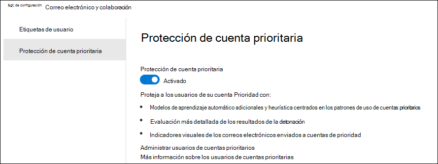
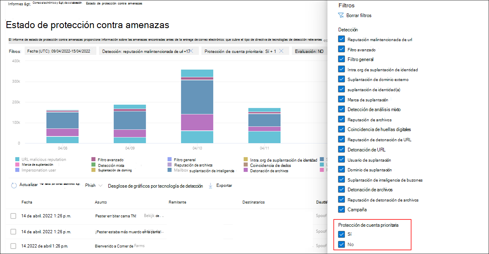
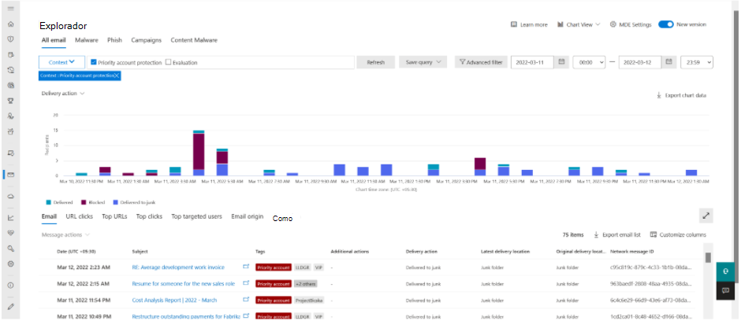

# <a name="configure-and-review-priority-accounts-in-microsoft-defender-for-office-365"></a>Configuración y revisión de cuentas de prioridad en Microsoft Defender para Office 365

[!INCLUDE [MDO Trial banner](../includes/mdo-trial-banner.md)]

**Se aplica a**
- [Plan 1 y Plan 2 de Microsoft Defender para Office 365](defender-for-office-365.md)
- [Microsoft 365 Defender](../defender/microsoft-365-defender.md)

En todas las organizaciones, hay personas críticas, como ejecutivos, líderes, administradores u otros usuarios que tienen acceso a información confidencial, propietaria o de alta prioridad. Puede etiquetar estos usuarios dentro de Microsoft Defender para Office 365 como cuentas prioritarias, lo que permite a los equipos de seguridad priorizar su enfoque en estas personas críticas. Con la protección diferenciada para las cuentas de prioridad, los usuarios etiquetados como cuentas de prioridad recibirán un mayor nivel de protección contra amenazas.

Las cuentas de prioridad son objetivo de los atacantes con más frecuencia y, por lo general, se atacan con técnicas más sofisticadas. La protección diferenciada para las cuentas de prioridad se centra en este conjunto de usuarios específico y proporciona un mayor nivel de protección mediante modelos de aprendizaje automático mejorados. Esta diferenciación en el aprendizaje y el control de mensajes proporciona el nivel más alto de protección para estas cuentas y ayuda a mantener una tasa baja de falsos positivos, ya que una alta tasa de falsos positivos también puede tener un impacto negativo en estos usuarios.

## <a name="configure-priority-account-protection"></a>Configuración de la protección de la cuenta de prioridad

La protección de la cuenta de prioridad está activada de forma predeterminada para los usuarios críticos identificados previamente. Sin embargo, el administrador de seguridad de su organización también puede activar la protección de la cuenta de prioridad siguiendo estos pasos:

1. En el portal de Microsoft 365 Defender en <https://security.microsoft.com>, vaya a **Configuración** \> **Email & protección** de **la cuenta de prioridad** de colaboración\>. Para ir directamente a la página **Priority account protection (Protección de cuenta prioritaria** ), use <https://security.microsoft.com/securitysettings/priorityAccountProtection>.

2. En la página **Protección de la cuenta de prioridad** , active **Protección de la cuenta de prioridad** (:::image type="icon" source="../../media/scc-toggle-on.png" border="false":::).

    > [!div class="mx-imgBorder"]
    > 

> [!NOTE]
> No se recomienda deshabilitar ni desactivar la protección de la cuenta de prioridad.

Si desea usar Exchange Online PowerShell para activar la protección de la cuenta de prioridad, siga estos pasos:

1. [Conéctese a Exchange Online PowerShell](/powershell/exchange/connect-to-exchange-online-powershell) y ejecute el siguiente comando:

   ```powershell
   Set-EmailTenantSettings -EnablePriorityAccountProtection $true
   ```

2. Para comprobar que la protección de la cuenta de prioridad está activada, ejecute el siguiente comando para comprobar el valor de la propiedad EnablePriorityAccountProtection:

   ```powershell
   Get-EmailTenantSettings | Format-List Identity,EnablePriorityAccountProtection
   ```

   El valor True significa que la protección de la cuenta de prioridad está activada. El valor False significa que la protección de la cuenta de prioridad está desactivada.

### <a name="assign-the-priority-account-tag-to-users"></a>Asignación de la etiqueta de cuenta de prioridad a los usuarios

Microsoft Defender para Office 365 admite cuentas de prioridad como etiquetas que se pueden usar como filtros en alertas, informes, incidentes, etc.

Para obtener más información, consulte [Etiquetas de usuario en Microsoft Defender para Office 365](user-tags.md).

## <a name="review-differentiated-protection-from-priority-account-protection"></a>Revisión de la protección diferenciada frente a la protección de cuenta prioritaria

Los efectos de la protección de la cuenta de prioridad son visibles en las siguientes características:

- [Alertas](alerts.md)
- [Directivas de alertas personalizadas](../../compliance/alert-policies.md#viewing-alerts)
- [Explorador de amenazas y detecciones en tiempo real](threat-explorer.md)
- [Informe de usuario en peligro](view-email-security-reports.md#compromised-users-report)
- [Página de la entidad de correo electrónico](mdo-email-entity-page.md#other-innovations)
- [Informe de estado de protección contra amenazas](view-email-security-reports.md#threat-protection-status-report)
- [Informe de remitentes y destinatarios principales](view-email-security-reports.md#top-senders-and-recipients-report)
- [Simulación de ataque](attack-simulation-training.md#target-users)
- [Vistas de campañas](campaigns.md)
- [Administración y envíos de usuarios](admin-submission.md)
- [Cuarentena](quarantine.md)

### <a name="threat-protection-status-report"></a>Informe de estado de protección contra amenazas

El informe **de estado de protección contra amenazas** es una vista única que reúne información sobre contenido malintencionado y correo electrónico malintencionado detectado y bloqueado por Microsoft Defender para Office 365.

Para ver el informe, siga estos pasos:

1. En el portal de Microsoft 365 Defender en <https://security.microsoft.com>, vaya a **Informes** \> **Email & colaboración** \> **Email & informes** \> de colaboración busque **Estado de protección contra amenazas** y, a continuación, haga clic en **Ver detalles**. Para ir directamente al informe, use <https://security.microsoft.com/reports/TPSAggregateReportATP>.

2. La vista predeterminada es **Ver datos por información general**. Haga clic en este valor para cambiar la vista; para ello, seleccione uno de los valores siguientes:
   - **Visualización de datos por Email \> Phish**
   - **Visualización de datos por Email \> Malware**
   - **Visualización de datos por Email \> correo no deseado**

3. Haga clic en  **Filtrar**.

4. En el control flotante **Filtros** que se abre, en la sección **Cuentas prioritarias** , seleccione **Sí**, **No** o ambos valores.

   

### <a name="threat-explorer"></a>Explorador de amenazas

El filtro de contexto del Explorador de amenazas ayuda a buscar correos electrónicos en los que la protección de la cuenta de prioridad estaba implicada en la detección del mensaje. Esto permite que los equipos de operaciones de seguridad puedan ver el valor proporcionado por esta protección. Todavía puede filtrar los mensajes por etiqueta de cuenta de prioridad para buscar todos los mensajes del conjunto específico de usuarios.

Para ver la protección adicional en el Explorador de amenazas, siga estos pasos:

1. En el portal de Microsoft 365 Defender en <https://security.microsoft.com>, vaya a Email & **Explorador** de **colaboración**\>. Para ir directamente a la página **Explorador de amenazas** , use <https://security.microsoft.com/threatexplorer>.

2. Seleccione **Contexto** en la lista desplegable y, a continuación, active la casilla situada junto a **Protección de la cuenta de prioridad**.

> [!div class="mx-imgBorder"]
> 

### <a name="email-entity-page"></a>Página de la entidad de correo electrónico

La página de entidad de correo electrónico está disponible en **el Explorador de amenazas**. Seleccione el asunto de un correo electrónico que está investigando. Se mostrará una barra dorada en la parte superior del control flotante de correo electrónico para ese correo. Seleccione esta opción para ver la nueva página.

Las pestañas de la parte superior de la página de entidad le permitirán investigar el correo electrónico de forma eficaz. Haga clic en la pestaña **Análisis** . La protección de la cuenta de prioridad aparece ahora en **Detalles de detección de amenazas**.

## <a name="more-information"></a>Más información

- [Etiquetas de usuario en Microsoft Defender para Office 365](user-tags.md)
- [Administrar y supervisar cuentas prioritarias](../../admin/setup/priority-accounts.md)
