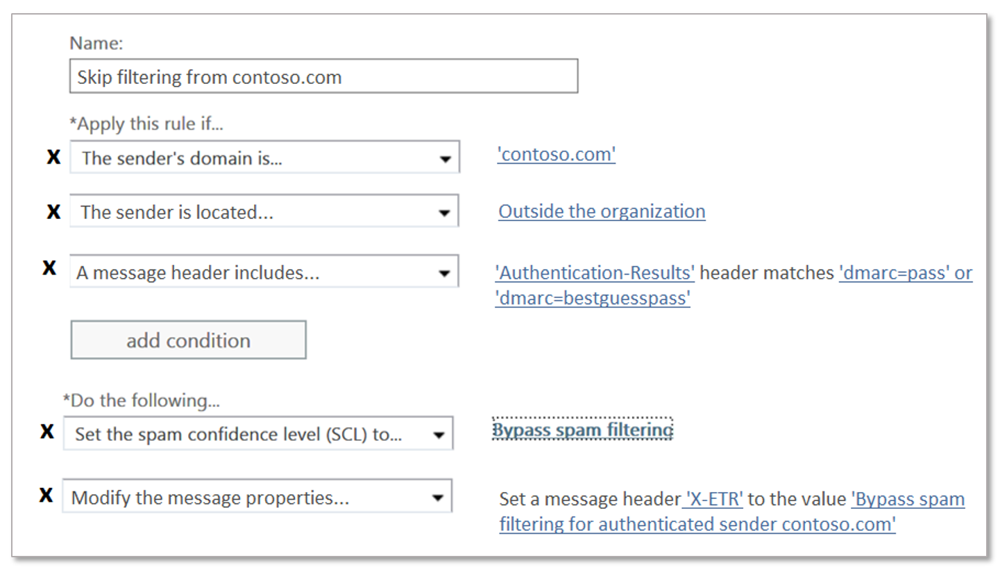

# Crear listas de remitentes seguros en Office 365Create safe sender lists in Office 365

Si es un cliente de Office 365 con buzones en Exchange online o un cliente independiente de Exchange Online Protection (EOP) sin buzones de Exchange Online, EOP ofrece varias formas de garantizar que los usuarios recibirán correo electrónico de remitentes de confianza.If you're an Office 365 customer with mailboxes in Exchange Online or a standalone Exchange Online Protection (EOP) customer without Exchange Online mailboxes, EOP offers multiple ways of ensuring that users will receive email from trusted senders. Estas opciones incluyen reglas de flujo de correo de Exchange (también conocidas como reglas de transporte), remitentes seguros de Outlook, la lista de direcciones IP permitidas (filtrado de conexiones) y listas de remitentes permitidos o listas de dominios permitidos en las directivas contra correo no deseado.These options include Exchange mail flow rules (also known as transport rules), Outlook Safe Senders, the IP Allow List (connection filtering), and allowed sender lists or allowed domain lists in anti-spam policies. De forma colectiva, puede considerar estas opciones como _listas de remitentes seguros_.Collectively, you can think of these options as _safe sender lists_.

Las listas de remitentes seguros disponibles se describen en la siguiente lista, en orden de más recomendada a mínima recomendada:The available safe sender lists are described in the following list in order from most recommended to least recommended:

1. Reglas de flujo de correoMail flow rules

2. Remitentes seguros de OutlookOutlook Safe Senders

3. Lista de direcciones IP permitidas (filtrado de la conexión)IP Allow List (connection filtering)

4. Listas de remitentes permitidos o listas de dominios permitidos (directivas contra correo no deseado)Allowed sender lists or allowed domain lists (anti-spam policies)

Las reglas de flujo de correo permiten la máxima flexibilidad para asegurarse de que solo se permiten los mensajes correctos.Mail flow rules allow the most flexibility to ensure that only the right messages are allowed. Los remitentes permitidos y las listas de dominios permitidos en las directivas contra correo no deseado no son tan seguros como la lista de direcciones IP permitidas, ya que el dominio de correo electrónico del remitente se falsifica fácilmente.Allowed sender and allowed domain lists in anti-spam policies aren't as secure as the IP Allow List, because the sender's email domain is easily spoofed. Pero la lista de direcciones IP permitidas también presenta un riesgo, ya que el correo de _cualquier_ dominio que se envíe desde esa dirección IP omitirá el filtrado de correo no deseado.But, the IP Allow List also presents a risk, because email from _any_ domain that's sent from that IP address will bypass spam filtering.

> [!IMPORTANT]
> <ul><li>Tenga cuidado y supervise *las* excepciones que se produzcan en el filtrado de correo no deseado mediante listas de remitentes seguros.Be careful and monitor *any* exceptions that you to spam filtering using safe sender lists.</li><li>Aunque puede usar listas de remitentes seguros para ayudar con falsos positivos (correo electrónico bueno marcado como correo no deseado), debe considerar el uso de listas de remitentes seguros como una solución temporal que debería evitarse si es posible.While you can use safe sender lists to help with false positives (good email marked as spam), you should consider the use of safe sender lists as a temporary solution that should be avoided if possible. No se recomienda administrar los falsos positivos mediante listas de remitentes seguros, ya que las excepciones al filtrado de correo no deseado pueden abrir la organización a través de suplantación de identidad y otros ataques.We don't recommend managing false positives by using safe sender lists, because exceptions to spam filtering can open your organization to spoofing and other attacks. Si insiste en usar listas de remitentes seguros para administrar falsos positivos, debe estar atento y mantener el tema de envío de correo no deseado [, correo no deseado y mensajes de suplantación de identidad (phishing) a Microsoft para su análisis](submit-spam-non-spam-and-phishing-scam-messages-to-microsoft-for-analysis.md) en la lista.If you insist on using safe sender lists to manage false positives, you need to be vigilant and keep the topic for [submitting spam, non-spam, and phishing mails to Microsoft for analysis](submit-spam-non-spam-and-phishing-scam-messages-to-microsoft-for-analysis.md) at the ready.</li><li>Para permitir a un dominio enviar correo electrónico no autenticado (evitar la protección contra la suplantación de identidad) pero no omitir las comprobaciones contra correo no deseado y antimalware, puede agregarlo a la [lista de remitentes seguros de AllowedToSpoof](walkthrough-spoof-intelligence-insight.md)To allow a domain to send unauthenticated email (bypass anti-spoofing protection) but not bypass anti-spam and anti-malware checks, you can add it to the [AllowedToSpoof safe sender list](walkthrough-spoof-intelligence-insight.md)</li><li>EOP y Outlook inspeccionar distintas propiedades del mensaje para determinar el remitente del mensaje.EOP and Outlook inspect different message properties to determine the sender of the message. Para obtener más información, vea la sección [consideraciones para el correo electrónico masivo](#considerations-for-bulk-email) más adelante en este tema.For more information, see the [Considerations for bulk email](#considerations-for-bulk-email) section later in this topic.</li></ul>

Por el contrario, también tiene varias opciones para bloquear el correo electrónico de fuentes específicas usando _listas de remitentes bloqueados_.In contrast, you also have several options to block email from specific sources using _blocked sender lists_. Para obtener más información, vea [Create Block Sender lists in Office 365](create-block-sender-lists-in-office-365.md).For more information, see [Create block sender lists in Office 365](create-block-sender-lists-in-office-365.md).

## Recomenda Usar reglas de flujo de correo(Recommended) Use mail flow rules

Las reglas de flujo de correo de Exchange Online y EOP independiente usan condiciones y excepciones para identificar mensajes, así como acciones para especificar lo que se debe hacer a esos mensajes.Mail flow rules in Exchange Online and standalone EOP use conditions and exceptions to identify messages, and actions to specify what should be done to those messages. Para obtener más información, vea [reglas de flujo de correo (reglas de transporte) en Exchange Online](https://docs.microsoft.com/Exchange/security-and-compliance/mail-flow-rules/mail-flow-rules).For more information, see [Mail flow rules (transport rules) in Exchange Online](https://docs.microsoft.com/Exchange/security-and-compliance/mail-flow-rules/mail-flow-rules).

En el siguiente ejemplo se supone que necesita correo electrónico de contoso.com para omitir el filtrado de correo no deseado.The following example assumes you need email from contoso.com to skip spam filtering. Para ello, configure las siguientes opciones:To do this, configure the following settings:

1. **Condición**: **el dominio del remitente** \> **es** \> contoso.com.**Condition**: **The sender** \> **domain is** \> contoso.com.

2. Configure cualquiera de las siguientes opciones:Configure either of the following settings:

   - **Condición de regla de flujo de correo**: **un encabezado** \> **de mensaje incluye cualquiera de estas palabras** \> **encabezado nombre**: `Authentication-Results` \> **valor de encabezado**: `dmarc=pass` o `dmarc=bestguesspass`.**Mail flow rule condition**: **A message header** \> **includes any of these words** \> **Header name**: `Authentication-Results` \> **Header value**: `dmarc=pass` or `dmarc=bestguesspass`.

     Esta condición comprueba el estado de autenticación del remitente del dominio de correo electrónico de envío para asegurarse de que el dominio de envío no se está falsificando.This condition checks the sender authentication status of the sending email domain to ensure that the sending domain is not being spoofed. Para obtener más información acerca de la autenticación de correo electrónico, consulte [SPF](set-up-spf-in-office-365-to-help-prevent-spoofing.md), [DKIM](use-dkim-to-validate-outbound-email.md)y [DMARC](use-dmarc-to-validate-email.md).For more information about email authentication, see [SPF](set-up-spf-in-office-365-to-help-prevent-spoofing.md), [DKIM](use-dkim-to-validate-outbound-email.md), and [DMARC](use-dmarc-to-validate-email.md).

   - Lista de direcciones IP **permitidas**: especifique la dirección IP o el intervalo de direcciones de origen en la Directiva de filtro de conexión.**IP Allow List**: Specify the source IP address or address range in the connection filter policy.
  
     Use esta configuración si el dominio de envío no tiene autenticación.Use this setting if the sending domain does not have authentication. Sea lo más restrictivo posible cuando se trata de las direcciones IP de origen en la lista de direcciones IP permitidas.Be as restrictive as possible when it comes to the source IP addresses in the IP Allow List. Se recomienda un intervalo de direcciones IP de/24 o menos (menos es mejor).We recommend an IP address range of /24 or less (less is better). No use intervalos de direcciones IP que pertenezcan a servicios de consumidor (por ejemplo, outlook.com) o infraestructuras compartidas.Do not use IP address ranges that belong to consumer services (for example, outlook.com) or shared infrastructures.

   > [!IMPORTANT]
   > <ul><li>No configure nunca configurar reglas de flujo de correo *solo* con el dominio del remitente como la condición para omitir el filtrado de correo no deseado.Never configure configure mail flow rules with *only* the sender domain as the condition to skip spam filtering. Al hacerlo, aumentará *significativamente* la probabilidad de que los intrusos puedan suplantar el dominio remitente (o suplantar la dirección de correo electrónico completa), omitir el filtrado de correo no deseado y omitir las comprobaciones de autenticación de remitente para que el mensaje llegue a la bandeja de entrada del destinatario.Doing so will *significantly* increase the likelihood that attackers can spoof the sending domain (or impersonate the full email address), skip all spam filtering, and skip sender authentication checks so the message will arrive in the recipient's Inbox.</li><li>No use dominios de su propiedad (también conocidos como dominios aceptados) o dominios populares (por ejemplo, microsoft.com) como condiciones en las reglas de flujo de correo.Do not use domains you own (also known as accepted domains) or popular domains (for example, microsoft.com) as conditions in mail flow rules. Al hacerlo, se considera un riesgo alto porque crea oportunidades para que los atacantes envíen correo electrónico que, de lo contrario, se filtraría.Doing so is considered high risk because it creates opportunities for attackers to send email that would otherwise be filtered.</li><li>Si permite una dirección IP que está detrás de una puerta de enlace de traducción de direcciones de red (NAT), debe conocer los servidores que participan en el grupo de NAT para conocer el ámbito de la lista de direcciones IP permitidas.If you allow an IP address that's behind a network address translation (NAT) gateway, you need to know the servers that are involved in the NAT pool in order to know the scope of your IP Allow List. Las direcciones IP y los participantes de NAT pueden cambiar.IP addresses and NAT participants can change. Debe comprobar periódicamente sus entradas de la lista de direcciones IP permitidas como parte de los procedimientos de mantenimiento estándar.You need to periodically check your IP Allow List entries as part of your standard maintenance procedures.</li></ul>

3. **Condiciones opcionales**:**Optional conditions**:

   - **El remitente** \> **es interno/externo** \> **fuera de la organización**: esta condición es implícita, pero se puede usar para tener en cuenta los servidores de correo electrónico locales que podrían no estar configurados correctamente.**The sender** \> **is internal/external** \> **Outside the organization**: This condition is implicit, but it's OK to use it to account for on-premises email servers that might not be correctly configured.

   - **El asunto o** \> el asunto o el cuerpo del mensaje **incluye alguna de estas** \> \<palabras clave\>: si puede restringir aún más los mensajes por palabras clave o frases en la línea de asunto o en el cuerpo del mensaje, puede usar esas palabras como condición.**The subject or body** \> **subject or body includes any of these words** \> \<keywords\>: If you can further restrict the messages by keywords or phrases in the subject line or message body, you can use those words as a condition.

4. **Acción**: configure ambas acciones en la regla:**Action**: Configure both of these actions in the rule:

   a.a. **Modificar las propiedades** \> del mensaje **establecer el nivel de confianza contra correo no deseado (SCL)** \> **omitir el filtrado de correo no deseado**.**Modify the message properties** \> **set the spam confidence level (SCL)** \> **Bypass spam filtering**.

   b.b. **Un encabezado** \> **de mensaje incluye cualquiera de estas palabras** \> **encabezado Name** \<:\> **CustomHeaderName header Value**: \<CustomHeaderValue\>.**A message header** \> **includes any of these words** \> **Header name**: \<CustomHeaderName\> **Header value**: \<CustomHeaderValue\>.

      Por ejemplo, `X-ETR: Bypass spam filtering for authenticated sender 'contoso.com'`.For example, `X-ETR: Bypass spam filtering for authenticated sender 'contoso.com'`. Si tiene más de un dominio en la regla, puede personalizar el texto del encabezado según corresponda.If you have more than one domain in the rule, you can customize the header text as appropriate.

      Cuando un mensaje omite el filtrado de correo no deseado debido a una regla de flujo `SFV:SKN` de correo, el valor del valor se marca en el encabezado **X-Forefront-antispam-Report** .When a message skips spam filtering due to a mail flow rule, the value `SFV:SKN` value is stamped in the **X-Forefront-Antispam-Report** header. Si el mensaje procede de un origen que está en la lista de direcciones IP permitidas `IPV:CAL` , también se agrega el valor.If the message is from a source that's on the IP Allow List, the value `IPV:CAL` is also added. Estos valores pueden ayudarle con la solución de problemas.These values can help you with troubleshooting.

## Usar remitentes seguros de OutlookUse Outlook Safe Senders

En lugar de una configuración de la organización, los usuarios o los administradores pueden agregar las direcciones de correo electrónico del remitente a la lista de remitentes seguros en el buzón.Instead of an organizational setting, users or admins can add the sender email addresses to the Safe Senders list in the mailbox. Para obtener instrucciones, consulte [configurar la configuración del correo electrónico no deseado en buzones de Exchange online en Office 365](configure-junk-email-settings-on-exo-mailboxes.md).For instructions, see [Configure junk email settings on Exchange Online mailboxes in Office 365](configure-junk-email-settings-on-exo-mailboxes.md).

Cuando los mensajes omiten el filtrado de correo no deseado debido a la lista de remitentes seguros de un usuario, el campo de encabezado **X-Forefront-antispam-Report** contendrá el valor `SFV:SFE`, lo que indica que se han omitido los filtros de correo no deseado, suplantación de identidad y phishing.When messages skip spam filtering due to a user's Safe Senders list, the **X-Forefront-Antispam-Report** header field will contain the value `SFV:SFE`, which indicates that spam, spoof, and phish filtering were bypassed.

## Usar la lista de direcciones IP permitidasUse the IP Allow List

Si no puede usar reglas de flujo de correo como se ha descrito anteriormente, la siguiente mejor opción es agregar el servidor o servidores de correo electrónico de origen a la lista de direcciones IP permitidas en la Directiva de filtro de conexión.If you can't use mail flow rules as previously described, the next best option is to add the source email server or servers to the IP Allow List in the connection filter policy. Para obtener más información, consulte [configurar el filtrado de conexiones en Office 365](configure-the-connection-filter-policy.md).For details, see [Configure connection filtering in Office 365](configure-the-connection-filter-policy.md).

**Notas**:**Notes**:

- Es importante que mantenga el número mínimo de direcciones IP permitidas, por lo que debe evitar usar intervalos de direcciones IP completos siempre que sea posible.It's important that you keep the number of allowed IP addresses to a minimum, so avoid using entire IP address ranges whenever possible.

- No use intervalos de direcciones IP que pertenezcan a servicios de consumidor (por ejemplo, outlook.com) o infraestructuras compartidas.Do not use IP address ranges that belong to consumer services (for example, outlook.com) or shared infrastructures.

- Revise periódicamente las entradas de la lista de direcciones IP permitidas y quite las entradas que ya no necesite.Regularly review the entries in the IP Allow List and remove the entries that you no longer need.

> [!CAUTION]
> Sin una comprobación adicional, como las reglas de flujo de correo, el correo electrónico de las fuentes de la lista de direcciones IP permitidas omite el filtrado de correo no deseado y las comprobaciones de autenticación de remitente (SPF, DKIM y DMARC).Without additional verification like mail flow rules, email from sources in the IP Allow List skips spam filtering and sender authentication (SPF, DKIM, DMARC) checks. Esto crea un riesgo alto de que los atacantes entreguen correctamente el correo electrónico a la bandeja de entrada que, de lo contrario, se filtraría.This creates a high risk of attackers successfully delivering email to the Inbox that would otherwise be filtered.

## Usar listas de remitentes permitidos o listas de dominios permitidasUse allowed sender lists or allowed domain lists

La opción menos deseable es usar la lista de remitentes permitidos o la lista de dominios permitidos en las directivas contra correo no deseado.The least desirable option is to use the allowed sender list or allowed domain list in anti-spam policies. Debe evitar esta opción *si es posible porque los* remitentes omiten todo el correo no deseado, la suplantación de identidad y la protección contra phish, y la autenticación de remitente (SPF, DKIM y DMARC).You should avoid this option *if at all possible* because senders bypass all spam, spoof, and phish protection, and sender authentication (SPF, DKIM, DMARC). Este método es el más adecuado para las pruebas temporales únicamente.This method is best used for temporary testing only. Puede encontrar los pasos detallados en [configurar directivas contra correo no deseado en el tema de Office 365](configure-your-spam-filter-policies.md) .The detailed steps can be found in [Configure anti-spam policies in Office 365](configure-your-spam-filter-policies.md) topic.

El límite máximo de estas listas es de aproximadamente 1000 entradas; Aunque solo podrá especificar 30 entradas en el portal.The maximum limit for these lists is approximately 1000 entries; although, you will only be able to enter 30 entries into the portal. Debe usar PowerShell para agregar más de 30 entradas.You must use PowerShell to add more than 30 entries.

> [!CAUTION]
> <ul><li>Este método crea un riesgo alto de que los atacantes entreguen correo electrónico a la bandeja de entrada que, de lo contrario, se filtraría.This method creates a high risk of attackers successfully delivering email to the Inbox that would otherwise be filtered.</li><li>No use dominios de su propiedad (también conocidos como dominios aceptados) o dominios populares (por ejemplo, microsoft.com) en listas de dominios permitidos.Do not use domains you own (also known as accepted domains) or popular domains (for example, microsoft.com) in allowed domain lists.</li></ul>

## Consideraciones para el correo electrónico masivoConsiderations for bulk email

Un mensaje de correo electrónico SMTP estándar está compuesto por el *sobre del mensaje* y el contenido del mensaje.A standard SMTP email message consists of a *message envelope* and message content. El sobre del mensaje contiene información necesaria para transmitir y entregar el mensaje entre servidores SMTP.The message envelope contains information that's required for transmitting and delivering the message between SMTP servers. El contenido del mensaje contiene el cuerpo del mensaje y campos de encabezado de mensaje, que se denominan de forma colectiva *encabezado del mensaje*.The message content contains message header fields (collectively called the *message header*) and the message body. El sobre del mensaje se describe en RFC 5321 y el encabezado del mensaje se describe en RFC 5322.The message envelope is described in RFC 5321, and the message header is described in RFC 5322. Los destinatarios nunca ven el sobre del mensaje real porque lo genera el proceso de transmisión del mensaje y, en realidad, no forma parte del mensaje.Recipients never see the actual message envelope because it's generated by the message transmission process, and it isn't actually part of the message.

- La `5321.MailFrom` dirección (también conocida como **correo de** la dirección de, P1 Sender o Envelope Sender) es la dirección de correo electrónico que se usa en la transmisión SMTP del mensaje.The `5321.MailFrom` address (also known as the **MAIL FROM** address, P1 sender, or envelope sender) is the email address that's used in the SMTP transmission of the message. Esta dirección de correo electrónico suele registrarse en el campo de encabezado **Return-Path** del encabezado del mensaje (aunque es posible que el remitente designe otra dirección **de correo electrónico de ruta de regreso** ).This email address is typically recorded in the **Return-Path** header field in the message header (although it's possible for the sender to designate a different **Return-Path** email address). Esta dirección de correo electrónico se usa para las comprobaciones de autenticación de remitentes (SPF, DKIM, DMARC) y, si el mensaje no se puede entregar, es el destinatario del informe de no entrega (también conocido como un mensaje NDR o de devolución).This email address is used for sender authentication checks (SPF, DKIM, DMARC), and if the message can't be delivered, it's the recipient for the non-delivery report (also known as an NDR or bounce message). 

- El `5322.From` (también conocido como dirección **de de** o remitente P2) es la dirección de correo electrónico que aparece en el campo **de encabezado de** y es la dirección de correo electrónico del remitente que se muestra en los clientes de correo electrónico.The `5322.From` (also known as the **From** address or P2 sender) is the email address in the **From** header field, and is the sender's email address that's displayed in email clients.

Con frecuencia, `5321.MailFrom` las `5322.From` direcciones y son las mismas (comunicación de persona a persona).Frequently, the `5321.MailFrom` and `5322.From` addresses are the same (person-to-person communication). No obstante, cuando el correo electrónico se envía en nombre de otra persona, las direcciones son frecuentemente diferentes.However, when email is sent on behalf of someone else, the addresses are frequently different. Esto generalmente ocurre con mucha frecuencia en mensajes de correo masivos.This usually happens most often for bulk email messages.

Por ejemplo, supongamos que Blue Yonder Airlines ha contratado el viaje de Ana para enviar su publicidad por correo electrónico.For example, suppose that Blue Yonder Airlines has hired Margie's Travel to send out its email advertising. El mensaje que recibe en la bandeja de entrada tiene las siguientes propiedades:The message you receive in your Inbox has the following properties:

- La `5321.MailFrom` dirección es blueyonder.Airlines@margiestravel.com.The `5321.MailFrom` address is blueyonder.airlines@margiestravel.com.

- La `5322.From` dirección es blueyonder@news.blueyonderairlines.com, que es lo que verá en Outlook.The `5322.From` address is blueyonder@news.blueyonderairlines.com, which is what you'll see in Outlook.

Listas de remitentes seguros y listas de dominios seguros en directivas contra correo no deseado en EOP `5321.MailFrom` , `5322.From` Inspeccione las direcciones y.Safe sender lists and safe domain lists in anti-spam policies in EOP inspect both the `5321.MailFrom` and `5322.From` addresses. Los remitentes seguros de Outlook solo `5322.From` usan la dirección.Outlook Safe Senders only uses the `5322.From` address.

Para evitar que se filtre este mensaje, puede realizar los siguientes pasos:To prevent this message from being filtered, you can take the following steps:

- Agregue blueyonder@news.blueyonderairlines.com (la `5322.From` dirección) como un remitente seguro de Outlook.Add blueyonder@news.blueyonderairlines.com (the `5322.From` address) as an Outlook Safe Sender.

- [Use una regla de flujo de correo](#recommended-use-mail-flow-rules) con una condición que busque mensajes de blueyonder@news.blueyonderairlines.com ( `5322.From` la dirección, blueyonder.Airlines@margiestravel.com ( `5321.MailFrom`el) o ambos.[Use a mail flow rule](#recommended-use-mail-flow-rules) with a condition that looks for messages from blueyonder@news.blueyonderairlines.com (the `5322.From` address, blueyonder.airlines@margiestravel.com (the `5321.MailFrom`), or both.

Para obtener más información, vea [crear listas de remitentes seguros en Office 365](create-safe-sender-lists-in-office-365.md).For more information, see [Create safe sender lists in Office 365](create-safe-sender-lists-in-office-365.md).
