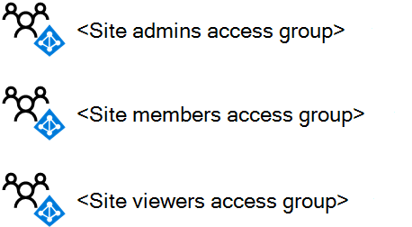
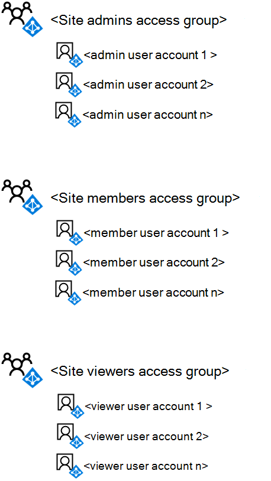
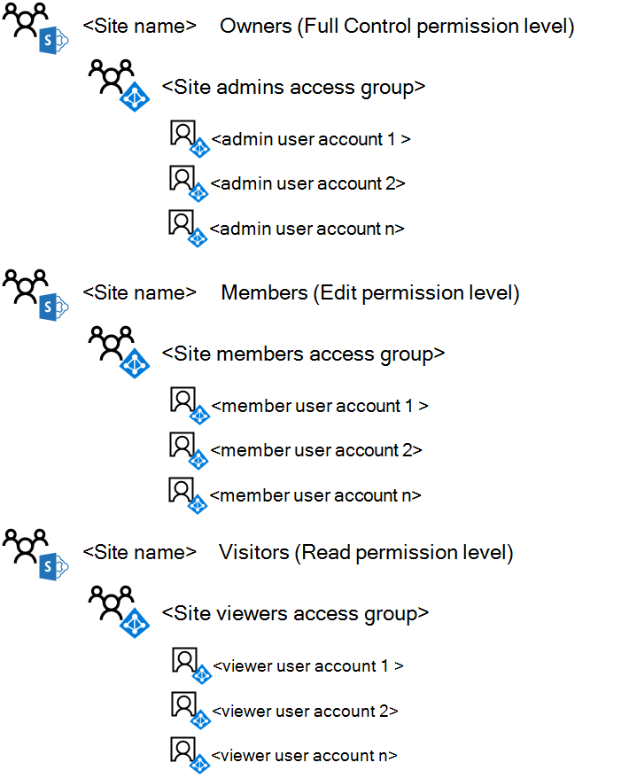

# <a name="deploy-an-isolated-sharepoint-online-team-site"></a><span data-ttu-id="452ef-103">Implementar un sitio de grupo de SharePoint Online aislado</span><span class="sxs-lookup"><span data-stu-id="452ef-103">Deploy an isolated SharePoint Online team site</span></span>

 <span data-ttu-id="452ef-104">**Resumen:** Implemente un nuevo sitio de grupo aislado de SharePoint Online con estas instrucciones paso a paso.</span><span class="sxs-lookup"><span data-stu-id="452ef-104">**Summary:** Deploy a new isolated SharePoint Online team site with these step-by-step instructions.</span></span>
  
<span data-ttu-id="452ef-105">Este artículo es una guía paso a paso para la implementación de la creación y configuración de un sitio de grupo aislado de SharePoint Online en Microsoft Office 365.</span><span class="sxs-lookup"><span data-stu-id="452ef-105">This article is a step-by-step deployment guide for creating and configuring an isolated SharePoint Online team site in Microsoft Office 365.</span></span> <span data-ttu-id="452ef-106">En estos pasos se presupone el uso de los tres grupos de SharePoint predeterminados y los niveles de permisos correspondientes, con un solo grupo de acceso basado en Azure Active Directory (AD) para cada nivel de acceso.</span><span class="sxs-lookup"><span data-stu-id="452ef-106">These steps assume the use of the three default SharePoint groups and corresponding permission levels, with a single Azure Active Directory (AD)-based access group for each level of access.</span></span>
  
## <a name="phase-1-create-and-populate-the-team-site-access-groups"></a><span data-ttu-id="452ef-107">Fase 1: crear y rellenar los grupos de acceso a sitios de grupo</span><span class="sxs-lookup"><span data-stu-id="452ef-107">Phase 1: Create and populate the team site access groups</span></span>

<span data-ttu-id="452ef-108">En esta fase, se crean los tres grupos de acceso basados en Azure AD para los tres grupos de SharePoint predeterminados y se rellenan con las cuentas de usuario adecuadas.</span><span class="sxs-lookup"><span data-stu-id="452ef-108">In this phase, you create the three Azure AD-based access groups for the three default SharePoint groups and populate them with the appropriate user accounts.</span></span>
  
> [!NOTE]
> <span data-ttu-id="452ef-109">En los pasos siguientes se supone que ya existen todas las cuentas de usuario necesarias y que se les asignan las licencias adecuadas.</span><span class="sxs-lookup"><span data-stu-id="452ef-109">The following steps assume that all necessary user accounts already exist and are assigned the appropriate licenses.</span></span> <span data-ttu-id="452ef-110">Si no es así, agréguelos y asigne licencias antes de continuar con el paso 1.</span><span class="sxs-lookup"><span data-stu-id="452ef-110">If not, please add them and assign licenses before proceeding to step 1.</span></span> 
  
### <a name="step-1-list-the-sharepoint-online-admins-for-the-site"></a><span data-ttu-id="452ef-111">Paso 1: enumerar los administradores de SharePoint Online para el sitio</span><span class="sxs-lookup"><span data-stu-id="452ef-111">Step 1: List the SharePoint Online admins for the site</span></span>

<span data-ttu-id="452ef-112">Determine el conjunto de cuentas de usuario correspondiente a los administradores de SharePoint Online para el sitio de grupo aislado.</span><span class="sxs-lookup"><span data-stu-id="452ef-112">Determine the set of user accounts corresponding to the SharePoint Online admins for the isolated team site.</span></span>
  
<span data-ttu-id="452ef-113">Si va a administrar grupos y cuentas de usuario a través de Microsoft 365 y desea usar Windows PowerShell, cree una lista de sus nombres principales de usuario (UPN) (ejemplo: belindan@contoso.com).</span><span class="sxs-lookup"><span data-stu-id="452ef-113">If you are managing user accounts and groups through Microsoft 365 and want to use Windows PowerShell, make a list of their user principal names (UPNs) (example UPN: belindan@contoso.com).</span></span>
  
### <a name="step-2-list-the-members-for-the-site"></a><span data-ttu-id="452ef-114">Paso 2: enumerar los miembros del sitio</span><span class="sxs-lookup"><span data-stu-id="452ef-114">Step 2: List the members for the site</span></span>

<span data-ttu-id="452ef-115">Determine el conjunto de cuentas de usuario correspondiente a los miembros del sitio de grupo aislado, quienes colaboran en los recursos almacenados en el sitio.</span><span class="sxs-lookup"><span data-stu-id="452ef-115">Determine the set of user accounts corresponding to the members for the isolated team site, those who will be collaborating on resources stored within the site.</span></span>
  
<span data-ttu-id="452ef-116">Si administra cuentas de usuario y grupos a través de Microsoft 365 y desea usar PowerShell, cree una lista de sus UPN.</span><span class="sxs-lookup"><span data-stu-id="452ef-116">If you are managing user accounts and groups through Microsoft 365 and want to use PowerShell, make a list of their UPNs.</span></span> <span data-ttu-id="452ef-117">Si hay muchos miembros del sitio, puede almacenar la lista de UPN en un archivo de texto y agregarlos todos con un solo comando de PowerShell.</span><span class="sxs-lookup"><span data-stu-id="452ef-117">If there are a lot of site members, you can store the list of UPNs in a text file and add them all with a single PowerShell command.</span></span>
  
### <a name="step-3-list-the-viewers-for-the-site"></a><span data-ttu-id="452ef-118">Paso 3: enumerar los visores del sitio</span><span class="sxs-lookup"><span data-stu-id="452ef-118">Step 3: List the viewers for the site</span></span>

<span data-ttu-id="452ef-119">Determine el conjunto de cuentas de usuario correspondiente a los visores del sitio de grupo aislado, las personas que pueden ver los recursos almacenados en el sitio, pero no pueden modificarlos ni colaborar directamente en su contenido.</span><span class="sxs-lookup"><span data-stu-id="452ef-119">Determine the set of user accounts corresponding to the viewers of the isolated team site, those who can view the resources stored in the site but not modify them or directly collaborate on their contents.</span></span>
  
<span data-ttu-id="452ef-120">Si administra cuentas de usuario y grupos a través de Microsoft 365 y desea usar PowerShell, cree una lista de sus UPN.</span><span class="sxs-lookup"><span data-stu-id="452ef-120">If you are managing user accounts and groups through Microsoft 365 and want to use PowerShell, make a list of their UPNs.</span></span> <span data-ttu-id="452ef-121">Si hay muchos miembros del sitio, puede almacenar la lista de UPN en un archivo de texto y agregarlos todos con un solo comando de PowerShell.</span><span class="sxs-lookup"><span data-stu-id="452ef-121">If there are a lot of site members, you can store the list of UPNs in a text file and add them all with a single PowerShell command.</span></span>
  
<span data-ttu-id="452ef-122">Los visores del sitio pueden incluir la administración ejecutiva, los asesores legales o las partes interesadas entre departamentos.</span><span class="sxs-lookup"><span data-stu-id="452ef-122">Viewers for the site might include executive management, legal counsel, or inter-departmental stakeholders.</span></span>
  
### <a name="step-4-create-the-three-access-groups-for-the-site-in-azure-ad"></a><span data-ttu-id="452ef-123">Paso 4: crear los tres grupos de acceso para el sitio en Azure AD</span><span class="sxs-lookup"><span data-stu-id="452ef-123">Step 4: Create the three access groups for the site in Azure AD</span></span>

<span data-ttu-id="452ef-124">Debe crear los siguientes grupos de acceso en Azure AD:</span><span class="sxs-lookup"><span data-stu-id="452ef-124">You need to create the following access groups in Azure AD:</span></span>
  
- <span data-ttu-id="452ef-125">Administradores de sitios (que contendrán la lista del paso 1)</span><span class="sxs-lookup"><span data-stu-id="452ef-125">Site admins (which will contain the list from step 1)</span></span>
    
- <span data-ttu-id="452ef-126">Miembros del sitio (que contendrán la lista del paso 2)</span><span class="sxs-lookup"><span data-stu-id="452ef-126">Site members (which will contain the list from step 2)</span></span>
    
- <span data-ttu-id="452ef-127">Visores del sitio (que contendrán la lista del paso 3)</span><span class="sxs-lookup"><span data-stu-id="452ef-127">Site viewers (which will contain the list from step 3)</span></span>
    
1. <span data-ttu-id="452ef-128">En el explorador, vaya a Azure portal en [https://portal.azure.com](https://portal.azure.com) e inicie sesión con las credenciales de una cuenta que se haya asignado con el rol de administrador de administración de usuarios o administrador de la compañía.</span><span class="sxs-lookup"><span data-stu-id="452ef-128">In your browser, go to the Azure portal at [https://portal.azure.com](https://portal.azure.com) and sign in with the credentials of an account that has been assigned with User Management Admin or Company Administrator role.</span></span>
    
2. <span data-ttu-id="452ef-129">En Azure Portal, haga clic en **Azure Active Directory > Grupos**.</span><span class="sxs-lookup"><span data-stu-id="452ef-129">In the Azure portal, click **Azure Active Directory > Groups**.</span></span>
    
3. <span data-ttu-id="452ef-130">En la hoja **Todos los grupos**, haga clic en **+ Nuevo grupo**.</span><span class="sxs-lookup"><span data-stu-id="452ef-130">On the **Groups - All groups** blade, click **+ New group**.</span></span>
    
4. <span data-ttu-id="452ef-131">En la hoja **nuevo grupo** :</span><span class="sxs-lookup"><span data-stu-id="452ef-131">On the **New Group** blade:</span></span>
    
    - <span data-ttu-id="452ef-132">Seleccione **Seguridad** en **Tipo de grupo**.</span><span class="sxs-lookup"><span data-stu-id="452ef-132">Select **Security** in **Group type**.</span></span>

    - <span data-ttu-id="452ef-133">Escriba el nombre del grupo en **nombre**.</span><span class="sxs-lookup"><span data-stu-id="452ef-133">Type the group name in **Name**.</span></span>

    - <span data-ttu-id="452ef-134">Escriba una descripción del grupo en **Descripción del grupo**.</span><span class="sxs-lookup"><span data-stu-id="452ef-134">Type a description of the group in **Group description**.</span></span>

    - <span data-ttu-id="452ef-135">Seleccione **Asignada** en **Tipo de pertenencia**.</span><span class="sxs-lookup"><span data-stu-id="452ef-135">Select **Assigned** in **Membership type**.</span></span>
    
5. <span data-ttu-id="452ef-136">Haga clic en **Crear** y, después, cierre la hoja **Grupo**.</span><span class="sxs-lookup"><span data-stu-id="452ef-136">Click **Create**, and then close the **Group** blade.</span></span>
    
6. <span data-ttu-id="452ef-137">Repita los pasos 3-5 para los grupos adicionales.</span><span class="sxs-lookup"><span data-stu-id="452ef-137">Repeat steps 3-5 for your additional groups.</span></span>
    
> [!NOTE]
> <span data-ttu-id="452ef-138">Debe usar el portal de Azure para crear los grupos para que tengan habilitadas las características de Office.</span><span class="sxs-lookup"><span data-stu-id="452ef-138">You need to use the Azure portal to create the groups so that they have Office features enabled.</span></span> <span data-ttu-id="452ef-139">Si un sitio aislado de SharePoint Online se configura más adelante como un sitio extremadamente confidencial con una etiqueta de Azure Information Protection para cifrar archivos y asignar permisos a grupos específicos, los grupos permitidos deben haberse creado con las características de Office habilitadas.</span><span class="sxs-lookup"><span data-stu-id="452ef-139">If a SharePoint Online isolated site is later configured as a Highly Confidential site with an Azure Information Protection label to encrypt files and assign permission to specific groups, the permitted groups must have been created with Office features enabled.</span></span> <span data-ttu-id="452ef-140">No puede cambiar la configuración de las características de Office de un grupo de Azure AD una vez creado.</span><span class="sxs-lookup"><span data-stu-id="452ef-140">You cannot change the Office features setting of an Azure AD group after it has been created.</span></span> 
  
<span data-ttu-id="452ef-141">Esta es la configuración resultante con los tres grupos de acceso al sitio.</span><span class="sxs-lookup"><span data-stu-id="452ef-141">Here is your resulting configuration with the three site access groups.</span></span>
  

  
### <a name="step-5-add-the-user-accounts-to-the-access-groups"></a><span data-ttu-id="452ef-143">Paso 5.</span><span class="sxs-lookup"><span data-stu-id="452ef-143">Step 5.</span></span> <span data-ttu-id="452ef-144">Agregar las cuentas de usuario a los grupos de acceso</span><span class="sxs-lookup"><span data-stu-id="452ef-144">Add the user accounts to the access groups</span></span>

<span data-ttu-id="452ef-145">En este paso, haga lo siguiente:</span><span class="sxs-lookup"><span data-stu-id="452ef-145">In this step, do the following:</span></span>
  
1. <span data-ttu-id="452ef-146">Agregar la lista de usuarios del paso 1 al grupo de acceso de administradores de sitios</span><span class="sxs-lookup"><span data-stu-id="452ef-146">Add the list of users from step 1 to the site admins access group</span></span>
    
2. <span data-ttu-id="452ef-147">Agregar la lista de usuarios del paso 2 al grupo de acceso de miembros del sitio</span><span class="sxs-lookup"><span data-stu-id="452ef-147">Add the list of users from step 2 to the site members access group</span></span>
    
3. <span data-ttu-id="452ef-148">Agregar la lista de usuarios del paso 3 al grupo de acceso de visores del sitio</span><span class="sxs-lookup"><span data-stu-id="452ef-148">Add the list of users from step 3 to the site viewers access group</span></span>
    
<span data-ttu-id="452ef-149">Si administra cuentas de usuario y grupos a través de los servicios de dominio de Active Directory (AD DS), agregue usuarios a los grupos de acceso adecuados mediante los procedimientos de administración de grupos y usuarios de AD DS normales y espere la sincronización con la suscripción a Microsoft 365.</span><span class="sxs-lookup"><span data-stu-id="452ef-149">If you are managing user accounts and groups through Active Directory Domain Services (AD DS), add users to the appropriate access groups using your normal AD DS user and group management procedures and wait for synchronization with your Microsoft 365 subscription.</span></span>
  
<span data-ttu-id="452ef-150">Si administra cuentas de usuario y grupos a través de Office 365, puede usar el centro de administración de Microsoft 365 o PowerShell.</span><span class="sxs-lookup"><span data-stu-id="452ef-150">If you are managing user accounts and groups through Office 365, you can use the Microsoft 365 admin center or PowerShell.</span></span> <span data-ttu-id="452ef-151">Si tiene nombres de grupo duplicados para cualquiera de los grupos de acceso, debe usar el centro de administración 365 de Microsoft.</span><span class="sxs-lookup"><span data-stu-id="452ef-151">If you have duplicate group names for any of the access groups, you should use the Microsoft 365 admin center.</span></span>
  
<span data-ttu-id="452ef-152">En el centro de administración de Microsoft 365, inicie sesión con una cuenta de usuario que tenga asignado el rol de administrador de la cuenta de usuario o de administrador de la compañía y use grupos para agregar las cuentas de usuario y los grupos adecuados a los grupos de acceso apropiados.</span><span class="sxs-lookup"><span data-stu-id="452ef-152">For the Microsoft 365 admin center, sign in with a user account that has been assigned the User Account Administrator or Company Administrator role and use Groups to add the appropriate user accounts and groups to the appropriate access groups.</span></span>
  
<span data-ttu-id="452ef-153">Para PowerShell, primero [Conéctese con el módulo Azure Active Directory PowerShell para Graph](https://docs.microsoft.com/office365/enterprise/powershell/connect-to-office-365-powershell#connect-with-the-azure-active-directory-powershell-for-graph-module).</span><span class="sxs-lookup"><span data-stu-id="452ef-153">For PowerShell, first [Connect with the Azure Active Directory PowerShell for Graph module](https://docs.microsoft.com/office365/enterprise/powershell/connect-to-office-365-powershell#connect-with-the-azure-active-directory-powershell-for-graph-module).</span></span>
  
<span data-ttu-id="452ef-154">A continuación, use el siguiente bloque de comandos para agregar una cuenta de usuario individual a un grupo de acceso:</span><span class="sxs-lookup"><span data-stu-id="452ef-154">Next, use the following command block to add an individual user account to an access group:</span></span>
  
```powershell
$userUPN="<UPN of the user account>"
$grpName="<display name of the access group>"
Add-AzureADGroupMember -RefObjectId (Get-AzureADUser | Where { $_.UserPrincipalName -eq $userUPN }).ObjectID -ObjectId (Get-AzureADGroup | Where { $_.DisplayName -eq $grpName }).ObjectID
```
<span data-ttu-id="452ef-155">Si ha guardado los UPN de cuentas de usuario para cualquiera de los grupos de acceso de un archivo de texto, puede usar el siguiente bloque de comandos de PowerShell para agregarlos todos a la vez:</span><span class="sxs-lookup"><span data-stu-id="452ef-155">If you stored the UPNs of user accounts for any of the access groups in a text file, you can use the following PowerShell command block to add them all at one time:</span></span>
  
```powershell
$grpName="<display name of the access group>"
$fileName="<path and name of the file containing the list of account UPNs>"
$grpID=(Get-AzureADGroup | Where { $_.DisplayName -eq $grpName }).ObjectID
Get-Content $fileName | ForEach { $userUPN=$_; Add-AzureADGroupMember -RefObjectId (Get-AzureADUser | Where { $_.UserPrincipalName -eq $userUPN }).ObjectID -ObjectID $grpID }
```

<span data-ttu-id="452ef-156">Para PowerShell, use el siguiente bloque de comandos para agregar un grupo individual a un grupo de acceso:</span><span class="sxs-lookup"><span data-stu-id="452ef-156">For PowerShell, use the following command block to add an individual group to an access group:</span></span>
  
```powershell
$nestedGrpName="<display name of the group to add to the access group>"
$grpName="<display name of the access group>"
Add-AzureADGroupMember -RefObjectId (Get-AzureADGroup | Where { $_.DisplayName -eq $nestedGrpName }).ObjectID -ObjectID (Get-AzureADGroup | Where { $_.DisplayName -eq $grpName }).ObjectID

```

<span data-ttu-id="452ef-157">Los resultados deben ser los siguientes:</span><span class="sxs-lookup"><span data-stu-id="452ef-157">The results should be the following:</span></span>
  
- <span data-ttu-id="452ef-158">El grupo de administradores de sitios de Azure AD contiene los grupos o cuentas de usuario de administrador del sitio</span><span class="sxs-lookup"><span data-stu-id="452ef-158">The site admins Azure AD group contains the site admin user accounts or groups</span></span>
    
- <span data-ttu-id="452ef-159">El grupo de miembros del sitio de Azure AD contiene los grupos o cuentas de usuario de los miembros del sitio</span><span class="sxs-lookup"><span data-stu-id="452ef-159">The site members Azure AD group contains the site member user accounts or groups</span></span>
    
- <span data-ttu-id="452ef-160">El grupo visores de sitio de Azure AD contiene las cuentas de usuario o los grupos que solo pueden ver el contenido del sitio</span><span class="sxs-lookup"><span data-stu-id="452ef-160">The site viewers Azure AD group contains the user accounts or groups that can only view the site contents</span></span>
    
<span data-ttu-id="452ef-161">Valide la lista de miembros del grupo para cada grupo de acceso con el centro de administración de Microsoft 365 o con el siguiente bloque de comandos de PowerShell:</span><span class="sxs-lookup"><span data-stu-id="452ef-161">Validate the list of group members for each access group with the Microsoft 365 admin center or with the following PowerShell command block:</span></span>
  
```powershell
$grpName="<display name of the access group>"
Get-AzureADGroupMember -ObjectId (Get-AzureADGroup | Where { $_.DisplayName -eq $grpName }).ObjectID | Sort UserPrincipalName | Select UserPrincipalName,DisplayName,UserType
```

<span data-ttu-id="452ef-162">Esta es la configuración resultante con los tres grupos de acceso al sitio rellenados con cuentas de usuario o grupos.</span><span class="sxs-lookup"><span data-stu-id="452ef-162">Here is your resulting configuration with the three site access groups populated with user accounts or groups.</span></span>
  

  
## <a name="phase-2-create-and-configure-the-isolated-team-site"></a><span data-ttu-id="452ef-164">Fase 2: crear y configurar el sitio de grupo aislado</span><span class="sxs-lookup"><span data-stu-id="452ef-164">Phase 2: Create and configure the isolated team site</span></span>

<span data-ttu-id="452ef-165">En esta fase, se crea el sitio de SharePoint Online aislado y se configuran los permisos para los niveles de permisos predeterminados de SharePoint Online para usar los nuevos grupos de acceso basados en Azure AD.</span><span class="sxs-lookup"><span data-stu-id="452ef-165">In this phase, you create the isolated SharePoint Online site and configure the permissions for the default SharePoint Online permission levels to use your new Azure AD-based access groups.</span></span> <span data-ttu-id="452ef-166">De forma predeterminada, los nuevos sitios de grupo incluyen un grupo de 365 de Microsoft y otros recursos relacionados, pero, en este caso, crearemos un sitio de grupo sin un grupo de Microsoft 365.</span><span class="sxs-lookup"><span data-stu-id="452ef-166">By default, new team sites include a Microsoft 365 group and other related resources, but in this case, we'll create a team site without a Microsoft 365 group.</span></span> <span data-ttu-id="452ef-167">Esto permite mantener los permisos por completo a través de SharePoint.</span><span class="sxs-lookup"><span data-stu-id="452ef-167">This allows maintaining permissions entirely through SharePoint.</span></span>
  
<span data-ttu-id="452ef-168">En primer lugar, cree el sitio de grupo de SharePoint Online con estos pasos.</span><span class="sxs-lookup"><span data-stu-id="452ef-168">First, create the SharePoint Online team site with these steps.</span></span>
  
1. <span data-ttu-id="452ef-169">Inicie sesión en el centro de administración de Microsoft 365 con una cuenta que también se usará para administrar el sitio de grupo de SharePoint Online (un administrador de SharePoint Online).</span><span class="sxs-lookup"><span data-stu-id="452ef-169">Sign in to the Microsoft 365 admin center with an account that will also be used to administer the SharePoint Online team site (a SharePoint Online administrator).</span></span> <span data-ttu-id="452ef-170">Para obtener ayuda, vea [Where to sign in to Office 365](https://support.office.com/article/e9eb7d51-5430-4929-91ab-6157c5a050b4) (Dónde iniciar sesión en Office 365).</span><span class="sxs-lookup"><span data-stu-id="452ef-170">For help, see [Where to sign in to Office 365](https://support.office.com/article/e9eb7d51-5430-4929-91ab-6157c5a050b4).</span></span>

2. <span data-ttu-id="452ef-171">En el centro de administración de Microsoft 365, en **centros de administración**, haga clic en **SharePoint**.</span><span class="sxs-lookup"><span data-stu-id="452ef-171">In the Microsoft 365 admin center, under **Admin centers**, click **SharePoint**.</span></span>

3. <span data-ttu-id="452ef-172">En el centro de administración de SharePoint, expanda **sitios** y haga clic en **sitios activos**.</span><span class="sxs-lookup"><span data-stu-id="452ef-172">In the SharePoint admin center, expand **Sites** and click **Active sites**.</span></span>

4. <span data-ttu-id="452ef-173">Haga clic en **crear**y, a continuación, elija **otras opciones**.</span><span class="sxs-lookup"><span data-stu-id="452ef-173">Click **Create**, and then choose **Other options**.</span></span>

5. <span data-ttu-id="452ef-174">En la lista **Elija una plantilla** , elija **sitio de grupo**.</span><span class="sxs-lookup"><span data-stu-id="452ef-174">In the **Choose a template** list, choose **Team site**.</span></span>
   
6. <span data-ttu-id="452ef-175">En **nombre del sitio**, escriba un nombre para el sitio de grupo.</span><span class="sxs-lookup"><span data-stu-id="452ef-175">In **Site name**, type a name for the team site.</span></span> 
    
7. <span data-ttu-id="452ef-176">En **Administrador principal**, escriba la cuenta con la que ha iniciado sesión.</span><span class="sxs-lookup"><span data-stu-id="452ef-176">In **Primary administrator**, type the account that you are logged in with.</span></span>
 
8. <span data-ttu-id="452ef-177">Haga clic en **Finalizar**.</span><span class="sxs-lookup"><span data-stu-id="452ef-177">Click **Finish**.</span></span>
    
<span data-ttu-id="452ef-178">Después, desde el nuevo sitio de grupo de SharePoint Online, configure los permisos.</span><span class="sxs-lookup"><span data-stu-id="452ef-178">Next, from the new SharePoint Online team site, configure permissions.</span></span>
  
1. <span data-ttu-id="452ef-179">En la barra de herramientas, haga clic en el icono de configuración y, luego, en **Permisos del sitio**.</span><span class="sxs-lookup"><span data-stu-id="452ef-179">In the tool bar, click the settings icon, and then click **Site permissions**.</span></span>

2. <span data-ttu-id="452ef-180">En **uso compartido del sitio**, haga clic en **cambiar el modo en que los miembros pueden compartir**.</span><span class="sxs-lookup"><span data-stu-id="452ef-180">Under **Site sharing**, click **Change how members can share**.</span></span>

3. <span data-ttu-id="452ef-181">Elija los **únicos propietarios de sitios que pueden compartir archivos, carpetas y el sitio**.</span><span class="sxs-lookup"><span data-stu-id="452ef-181">Choose the **Only site owners can share files, folders, and the site**.</span></span>

4. <span data-ttu-id="452ef-182">Establezca **permitir solicitudes de acceso** en **desactivado**.</span><span class="sxs-lookup"><span data-stu-id="452ef-182">Set **Allow access requests** to **Off**.</span></span>

5. <span data-ttu-id="452ef-183">Haga clic en **Guardar**.</span><span class="sxs-lookup"><span data-stu-id="452ef-183">Click **Save**.</span></span>
    
6. <span data-ttu-id="452ef-184">En el panel **permisos** , haga clic en **Configuración avanzada de permisos**.</span><span class="sxs-lookup"><span data-stu-id="452ef-184">In the **Permissions** pane, click **Advanced permissions settings**.</span></span>
    
7. <span data-ttu-id="452ef-185">En la pestaña **permisos** del explorador, haga clic \*\* \<en nombre del sitio> miembros\*\* en la lista.</span><span class="sxs-lookup"><span data-stu-id="452ef-185">On the **Permissions** tab of your browser, click **\<site name> Members** in the list.</span></span>
    
8. <span data-ttu-id="452ef-186">En **Personas y grupos**, haga clic en **Nuevo**.</span><span class="sxs-lookup"><span data-stu-id="452ef-186">In **People and Groups**, click **New**.</span></span>
    
9. <span data-ttu-id="452ef-187">En el cuadro de diálogo **compartir** , escriba el nombre del grupo de acceso de los miembros del sitio, selecciónelo y, a continuación, haga clic en **compartir**.</span><span class="sxs-lookup"><span data-stu-id="452ef-187">In the **Share** dialog box, type the name of the site members access group, select it, and then click **Share**.</span></span>
    
10. <span data-ttu-id="452ef-188">Haga clic en el botón Atrás del explorador.</span><span class="sxs-lookup"><span data-stu-id="452ef-188">Click the back button on your browser.</span></span>
    
11. <span data-ttu-id="452ef-189">Haga clic \*\* \<en nombre del sitio> propietarios\*\* en la lista.</span><span class="sxs-lookup"><span data-stu-id="452ef-189">Click **\<site name> Owners** in the list.</span></span>
    
12. <span data-ttu-id="452ef-190">En **Personas y grupos**, haga clic en **Nuevo**.</span><span class="sxs-lookup"><span data-stu-id="452ef-190">In **People and Groups**, click **New**.</span></span>
    
13. <span data-ttu-id="452ef-191">En el cuadro de diálogo **compartir** , escriba el nombre del grupo de acceso de administradores del sitio, selecciónelo y, a continuación, haga clic en **compartir**.</span><span class="sxs-lookup"><span data-stu-id="452ef-191">In the **Share** dialog box, type the name of the site admins access group, select it, and then click **Share**.</span></span>
    
14. <span data-ttu-id="452ef-192">Haga clic en el botón Atrás del explorador.</span><span class="sxs-lookup"><span data-stu-id="452ef-192">Click the back button on your browser.</span></span>
    
15. <span data-ttu-id="452ef-193">Haga clic \*\* \<en nombre del sitio> los visitantes\*\* de la lista.</span><span class="sxs-lookup"><span data-stu-id="452ef-193">Click **\<site name> Visitors** in the list.</span></span>
    
16. <span data-ttu-id="452ef-194">En **Personas y grupos**, haga clic en **Nuevo**.</span><span class="sxs-lookup"><span data-stu-id="452ef-194">In **People and Groups**, click **New**.</span></span>
    
17. <span data-ttu-id="452ef-195">En el cuadro de diálogo **compartir** , escriba el nombre del grupo de acceso de visores del sitio, selecciónelo y, a continuación, haga clic en **compartir**.</span><span class="sxs-lookup"><span data-stu-id="452ef-195">In the **Share** dialog box, type the name of the site viewers access group, select it, and then click **Share**.</span></span>
    
18. <span data-ttu-id="452ef-196">Cierre la pestaña **Permisos** del explorador.</span><span class="sxs-lookup"><span data-stu-id="452ef-196">Close the **Permissions** tab of your browser.</span></span>
    
<span data-ttu-id="452ef-197">Los resultados de esta configuración de permisos son los siguientes:</span><span class="sxs-lookup"><span data-stu-id="452ef-197">The results of these permission settings are:</span></span>
  
- <span data-ttu-id="452ef-198">El \*\* \<nombre del sitio>\*\* grupo de SharePoint contiene el grupo de acceso de administradores del sitio, en el que todos los miembros tienen el nivel de permisos **control total** .</span><span class="sxs-lookup"><span data-stu-id="452ef-198">The **\<site name> Owners** SharePoint group contains the site admins access group, in which all the members have the **Full control** permission level.</span></span>
    
- <span data-ttu-id="452ef-199">El \*\* \<grupo de nombres de sitio> miembros\*\* de SharePoint contiene el grupo de acceso de miembros del sitio, en el que todos los miembros tienen el nivel de permisos **Editar** .</span><span class="sxs-lookup"><span data-stu-id="452ef-199">The **\<site name> Members** SharePoint group contains the site members access group, in which all the members have the **Edit** permission level.</span></span>
    
- <span data-ttu-id="452ef-200">El \*\* \<nombre del sitio>\*\* grupo de SharePoint visitantes contiene el grupo de acceso de visores del sitio, en el que todos los miembros tienen el nivel de permisos de **lectura** .</span><span class="sxs-lookup"><span data-stu-id="452ef-200">The **\<site name> Visitors** SharePoint group contains the site viewers access group, in which all the members have the **Read** permission level.</span></span>
    
- <span data-ttu-id="452ef-201">La capacidad de los miembros para invitar a otros miembros o para que los usuarios no miembros soliciten el acceso está deshabilitada.</span><span class="sxs-lookup"><span data-stu-id="452ef-201">The ability for members to invite other members or for non-members to request access is disabled.</span></span>
    
<span data-ttu-id="452ef-202">Esta es la configuración resultante con los tres grupos de SharePoint para el sitio configurado para usar los tres grupos de acceso, que se rellenan con cuentas de usuario o grupos de Azure AD.</span><span class="sxs-lookup"><span data-stu-id="452ef-202">Here is your resulting configuration with the three SharePoint groups for the site configured to use the three access groups, which are populated with user accounts or Azure AD groups.</span></span>
  

  
<span data-ttu-id="452ef-204">Usted y los miembros del sitio, a través de la pertenencia a grupos en uno de los grupos de acceso, ahora pueden colaborar con los recursos del sitio.</span><span class="sxs-lookup"><span data-stu-id="452ef-204">You and the members of the site, through group membership in one of the access groups, can now collaborate using the resources of the site.</span></span>
  
## <a name="next-step"></a><span data-ttu-id="452ef-205">Siguiente paso</span><span class="sxs-lookup"><span data-stu-id="452ef-205">Next step</span></span>

<span data-ttu-id="452ef-206">Cuando necesite cambiar la pertenencia al grupo de acceso al sitio o crear una carpeta de documentos con permisos personalizados, vea [administrar un sitio de grupo de SharePoint Online aislado](manage-an-isolated-sharepoint-online-team-site.md).</span><span class="sxs-lookup"><span data-stu-id="452ef-206">When you need to change site access group membership or create a document folder with custom permissions, see [Manage an isolated SharePoint Online team site](manage-an-isolated-sharepoint-online-team-site.md).</span></span>
  
## <a name="see-also"></a><span data-ttu-id="452ef-207">Vea también</span><span class="sxs-lookup"><span data-stu-id="452ef-207">See Also</span></span>

[<span data-ttu-id="452ef-208">Sitios de grupo de SharePoint Online aislados</span><span class="sxs-lookup"><span data-stu-id="452ef-208">Isolated SharePoint Online team sites</span></span>](isolated-sharepoint-online-team-sites.md)
  
[<span data-ttu-id="452ef-209">Diseñar un sitio de grupo de SharePoint Online aislado</span><span class="sxs-lookup"><span data-stu-id="452ef-209">Design an isolated SharePoint Online team site</span></span>](design-an-isolated-sharepoint-online-team-site.md)
  
[<span data-ttu-id="452ef-210">Administrar un sitio de grupo de SharePoint Online aislado</span><span class="sxs-lookup"><span data-stu-id="452ef-210">Manage an isolated SharePoint Online team site</span></span>](manage-an-isolated-sharepoint-online-team-site.md)
  


