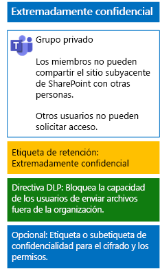

# Protección de los archivos de los equipos con etiquetas de confidencialidadProtect files in teams with sensitivity labels

A diferencia de una etiqueta de confidencialidad para datos altamente regulados que cualquier persona puede aplicar a cualquier archivo, un equipo extremadamente confidencial necesita su propia etiqueta o subetiqueta para que los archivos asignados:Unlike a sensitivity label for highly regulated data that anyone can apply to any file, a highly confidential team needs its own label or sublabel so that assigned files:

- Se cifren individualmente.Are individually encrypted.
- Contengan permisos personalizados para que solo los miembros del equipo puedan abrirlo.Contain custom permissions so that only members of the team can open it.

Para lograr este nivel extra de seguridad en los archivos almacenados en el sitio de SharePoint subyacente del equipo, debe configurar una etiqueta de confidencialidad personalizada que sea su propia etiqueta o una subetiqueta de la etiqueta general para datos altamente regulados.To accomplish this additional level of security for files stored in the underlying SharePoint site of a team, you must configure a customized sensitivity label that is either its own label or a sublabel of the general label for highly regulated data. Solo los miembros del equipo verán la etiqueta o subetiqueta personalizada en sus listas de etiquetas.Only team members will see the customized label or sublabel in their list of labels.

Use una etiqueta de confidencialidad cuando necesite un número reducido de etiquetas tanto para los equipos de uso global como para los individuales privados.Use a sensitivity label when you need a small number of labels for both global use and individual private teams. 

Use una subetiqueta de confidencialidad cuando tenga un gran número de etiquetas o quiera organizar etiquetas para equipos extremadamente confidenciales bajo la etiqueta altamente regulada.Use a sensitivity sublabel when you have a large number of labels or want to organize labels for highly confidential teams under the highly regulated label.

Siga [estas instrucciones ](https://docs.microsoft.com/microsoft-365/compliance/encryption-sensitivity-labels) para configurar una etiqueta o subetiqueta aparte con la siguiente configuración:Use [these instructions](https://docs.microsoft.com/microsoft-365/compliance/encryption-sensitivity-labels) to configure a separate label or a sublabel with the following settings:

- El nombre de la etiqueta o de la subetiqueta contiene el nombre del equipo.The name of the label or sublabel contains the name of the team
- El cifrado está habilitado.Encryption is enabled
- El grupo de Office 365 del equipo tiene permisos de coautoría.The Office 365 group for the team has Co-Author permissions

Tras crear la nueva etiqueta o subetiqueta, publíquela para los usuarios, que podrán aplicarlas a los archivos, ya sea de forma local antes de cargarlas en el equipo o más tarde, cuando el archivo se almacene en el equipo.After creating, publish the new label or sublabel for your users, who can then apply them to files either locally before uploading them to the team or later once the file is stored in the team.

Esta es la configuración del equipo extremadamente confidencial que usa etiquetas de confidencialidad para el cifrado de archivos y los permisos.Here is the configuration of the highly confidential team that uses sensitivity labels for file encryption and permissions.

## Vea tambiénSee Also

[Proteger los archivos en Microsoft TeamsSecure files in Microsoft Teams](secure-files-in-teams.md)
  
[Adopción de la nube y soluciones híbridasCloud adoption and hybrid solutions](https://docs.microsoft.com/office365/enterprise/cloud-adoption-and-hybrid-solutions)
