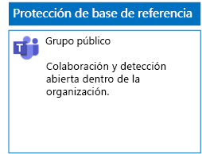
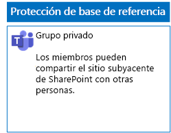
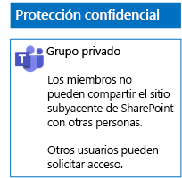
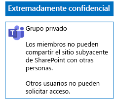

# Implementación de equipos con tres niveles de protección de archivos

Siga los pasos de este artículo para diseñar e implementar equipos de línea base, confidenciales y extremadamente confidenciales. Para más información sobre estos tres niveles de protección, vea [Proteger archivos en Microsoft Teams](secure-files-in-teams.md).
  
## Equipos de línea base

La protección de línea base incluye equipos tanto públicos como privados. Los equipos públicos son aquellos visibles y accesibles por cualquier persona de la organización. Los equipos privados son aquellos que solo los miembros del grupo de Office 365 asociado al equipo en cuestión pueden detectar y acceder a ellos. Ambos tipos de equipos permiten a los miembros compartir el sitio con otros usuarios.
  
### Público

Siga las instrucciones que se indican en [este artículo](https://support.office.com/article/create-a-team-from-scratch-174adf5f-846b-4780-b765-de1a0a737e2b) para crear un equipo de línea base con permisos y acceso públicos.

Este es el resultado de la configuración.
  

  
### Privado

Siga las instrucciones que se indican en [este artículo](https://support.office.com/article/create-a-team-from-scratch-174adf5f-846b-4780-b765-de1a0a737e2b) para crear un equipo de línea base con permisos y acceso privados.

Este es el resultado de la configuración.

  
## Equipos confidenciales

Con un equipo confidencial, se empieza por [crear un equipo privado](https://support.office.com//article/create-a-team-from-scratch-174adf5f-846b-4780-b765-de1a0a737e2b).

Después, hay que configurar el sitio de SharePoint subyacente para evitar que los miembros del equipo puedan compartirlo.

1.  En la barra de herramientas del equipo, haga clic en **Archivos**.
2.  Haga clic en los puntos suspensivos y, luego, en **Abrir en SharePoint**.
3.  En la barra de herramientas, haga clic en el sitio de SharePoint subyacente, en el icono de configuración y, luego, en **Permisos del sitio**.
4.  En el panel **Permisos del sitio**, en **Configuración de uso compartido**, haga clic en **Cambiar configuración de uso compartido**.
5.  En **Permisos de uso compartido**, seleccione **Solo los propietarios del sitio pueden compartir archivos, carpetas, además del sitio** y, luego, haga clic en **Guardar**.

Este es el resultado de la configuración.
  

 

## Equipos extremadamente confidenciales

Con un equipo extremadamente confidencial, se empieza por [crear un equipo privado](https://support.office.com//article/create-a-team-from-scratch-174adf5f-846b-4780-b765-de1a0a737e2b).

Después, hay que configurar el sitio de SharePoint subyacente para evitar que los miembros del equipo puedan compartirlo y que los usuarios no miembros del equipo puedan solicitar el acceso a este.

1.  En la barra de herramientas del equipo, haga clic en **Archivos**.
2.  Haga clic en los puntos suspensivos y, luego, en **Abrir en SharePoint**.
3.  En la barra de herramientas, haga clic en el sitio de SharePoint subyacente, en el icono de configuración y, luego, en **Permisos del sitio**.
4.  En el panel **Permisos del sitio**, en **Configuración de uso compartido**, haga clic en **Cambiar configuración de uso compartido**.
5.  En **Permisos de uso compartido**, seleccione **Solo los propietarios del sitio pueden compartir archivos, carpetas y el sitio**.
6.  Desactive **Permitir solicitudes de acceso** y, después, haga clic en **Guardar**.

Este es el resultado de la configuración.
  
  
  
## Siguiente paso

[Proteger los archivos de los equipos con etiquetas de retención y DLP](deploy-teams-retention-DLP.md)

## Vea también

[Proteger los archivos en Microsoft Teams](secure-files-in-teams.md)
  
[Adopción de la nube y soluciones híbridas](https://docs.microsoft.com/office365/enterprise/cloud-adoption-and-hybrid-solutions)
