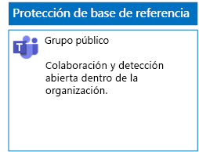
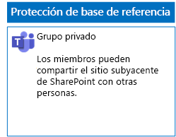
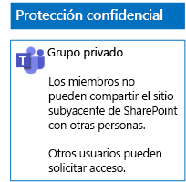
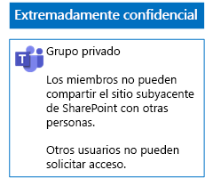

# Implementación de equipos con tres niveles de protección de archivosDeploy teams for three tiers of protection for files

Siga los pasos de este artículo para diseñar e implementar equipos de línea base, confidenciales y extremadamente confidenciales.Use the steps in this article to design and deploy baseline, sensitive, and highly confidential teams. Para más información sobre estos tres niveles de protección, vea [Proteger archivos en Microsoft Teams](secure-files-in-teams.md).For more information about these three tiers of protection, see [Secure files in Microsoft Teams](secure-files-in-teams.md).

## Equipos de línea baseBaseline teams

La protección de línea base incluye equipos tanto públicos como privados.Baseline protection includes both public and private teams. Los equipos públicos son aquellos visibles y accesibles por cualquier persona de la organización.Public teams can be discovered and accessed by anybody in the organization. Los equipos privados son aquellos que solo los miembros del grupo de Office 365 asociado al equipo en cuestión pueden detectar y acceder a ellos.Private sites can only be discovered and accessed by members of the Office 365 group associated with the team. Ambos tipos de equipos permiten a los miembros compartir el sitio con otros usuarios.Both of these types of teams allow members to share the site with others.

### PúblicoPublic

Siga las instrucciones que se indican en [este artículo](https://support.office.com/article/174adf5f-846b-4780-b765-de1a0a737e2b) para crear un Equipo de línea base con permisos y acceso públicos.Follow the instructions in [this article](https://support.office.com/article/174adf5f-846b-4780-b765-de1a0a737e2b) to create a baseline Team with public access and permissions.

Esta es la configuración resultante.Here is your resulting configuration.

### PrivatePrivate

Siga las instrucciones que se indican en [este artículo](https://support.office.com/article/174adf5f-846b-4780-b765-de1a0a737e2b) para crear un Equipo de línea base con permisos y acceso privados.Follow the instructions in [this article](https://support.office.com/article/174adf5f-846b-4780-b765-de1a0a737e2b) to create a baseline Team with private access and permissions.

Esta es la configuración resultante.Here is your resulting configuration.

## Equipos confidencialesSensitive teams

Con un equipo confidencial, se empieza por [crear un equipo privado](https://support.office.com/article/174adf5f-846b-4780-b765-de1a0a737e2b).For a sensitive team, you start by [creating a private team](https://support.office.com/article/174adf5f-846b-4780-b765-de1a0a737e2b).

Después, hay que configurar el sitio de SharePoint subyacente para evitar que los miembros del equipo puedan compartirlo.Next, you configure the underlying SharePoint site to prevent sharing by team members.

1. En la barra de herramientas del equipo, haga clic en **Archivos**.In the tool bar for the team, click **Files**.

2. Haga clic en los puntos suspensivos y, luego, en **Abrir en SharePoint**.Click the ellipsis, and then click **Open in SharePoint**.

3. En la barra de herramientas, haga clic en el sitio de SharePoint subyacente, en el icono de configuración y, luego, en **Permisos del sitio**.In the tool bar of the underlying SharePoint site, click the settings icon, and then click **Site permissions**.

4. En el panel **Permisos del sitio**, en **Configuración de uso compartido**, haga clic en **Cambiar configuración de uso compartido**.In the **Site permissions** pane, under **Sharing Settings**, click **Change sharing settings**.

5. En **Permisos de uso compartido**, seleccione **Solo los propietarios del sitio pueden compartir archivos, carpetas, además del sitio** y, luego, haga clic en **Guardar**.Under **Sharing permissions**, choose **Only site owners can share files, folders, and the site**, and then click **Save**.

Este es el resultado de la configuración.Here is your resulting configuration.

## Equipos extremadamente confidencialesHighly confidential teams

Con un equipo extremadamente confidencial, se empieza por [crear un equipo privado](https://support.office.com/article/174adf5f-846b-4780-b765-de1a0a737e2b).With a highly confidential team, you start by [creating a private team](https://support.office.com/article/174adf5f-846b-4780-b765-de1a0a737e2b).

Después, hay que configurar el sitio de SharePoint subyacente para evitar que los miembros del equipo puedan compartirlo y que los usuarios no miembros del equipo puedan solicitar el acceso a este.Next, you configure the underlying SharePoint site to prevent sharing by team members and the requesting of access by non-members of the team.

1. En la barra de herramientas del equipo, haga clic en **Archivos**.In the tool bar for the team, click **Files**.

2. Haga clic en los puntos suspensivos y, luego, en **Abrir en SharePoint**.Click the ellipsis, and then click **Open in SharePoint**.

3. En la barra de herramientas, haga clic en el sitio de SharePoint subyacente, en el icono de configuración y, luego, en **Permisos del sitio**.In the tool bar of the underlying SharePoint site, click the settings icon, and then click **Site permissions**.

4. En el panel **Permisos del sitio**, en **Configuración de uso compartido**, haga clic en **Cambiar configuración de uso compartido**.In the **Site permissions** pane, under **Sharing Settings**, click **Change sharing settings**.

5. En **Permisos de uso compartido**, seleccione **Solo los propietarios del sitio pueden compartir archivos, carpetas y el sitio**.Under **Sharing permissions**, choose **Only site owners can share files, folders, and the site**.

6. Desactive **Permitir solicitudes de acceso** y, después, haga clic en **Guardar**.Turn off **Allow access requests**, and then click **Save**.

Este es el resultado de la configuración.Here is your resulting configuration.

## Siguiente pasoNext step

[Proteger los archivos de los equipos con etiquetas de retención y DLPProtect files in teams with retention labels and DLP](deploy-teams-retention-DLP.md)

## Vea tambiénSee also

[Proteger los archivos en Microsoft TeamsSecure files in Microsoft Teams](secure-files-in-teams.md)

[Adopción de la nube y soluciones híbridasCloud adoption and hybrid solutions](https://docs.microsoft.com/office365/enterprise/cloud-adoption-and-hybrid-solutions)
