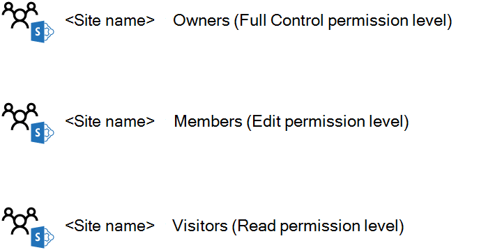
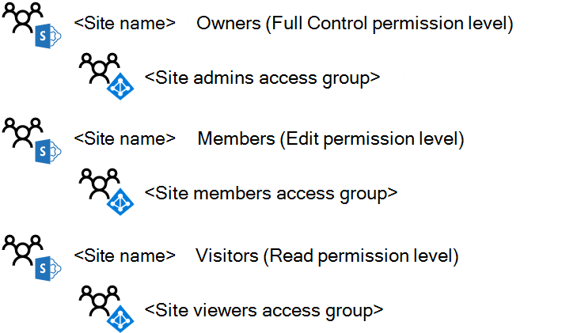
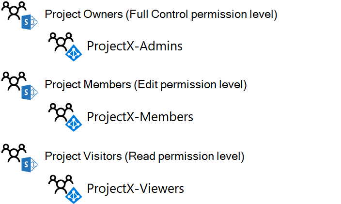

# Diseñar un sitio de grupo de SharePoint Online aisladoDesign an isolated SharePoint Online team site

 **Resumen:** Recorra el proceso de diseño de sitios de grupo de SharePoint Online aislados.**Summary:** Step through the design process for isolated SharePoint Online team sites.
  
Este artículo le guiará por las decisiones de diseño clave que debe tomar antes de crear un sitio de grupo de SharePoint Online aislado.This article takes you through the key design decisions you must make before creating an isolated SharePoint Online team site.
  
## Fase 1: determinar los grupos de SharePoint y los niveles de permisosPhase 1: Determine your SharePoint groups and permission levels

Todos los sitios de grupo de SharePoint Online se crean de forma predeterminada con los siguientes grupos de SharePoint:Every SharePoint Online team site by default is created with the following SharePoint groups:
  
- \<nombre del sitio> miembros\<site name> Members
    
- \<nombre del sitio> visitantes\<site name> Visitors
    
- \<nombre del sitio> propietarios\<site name> Owners
    
Estos grupos son independientes de los grupos de Microsoft 365 y Azure Active Directory (AD) y constituyen la base para asignar permisos a los recursos del sitio.These groups are separate from Microsoft 365 and Azure Active Directory (AD) groups and are the basis for assigning permissions for the resources of the site.
  
El conjunto de permisos específicos que determina lo que un miembro de un grupo de SharePoint puede hacer en un sitio es un nivel de permisos.The set of specific permissions that determines what a member of a SharePoint group can do in a site is a permission level. De forma predeterminada, hay tres niveles de permisos para un sitio de grupo de SharePoint Online: editar, leer y control total.There are three permission levels by default for a SharePoint Online team site: Edit, Read, and Full control. La siguiente tabla muestra la correlación predeterminada de los grupos de SharePoint y los niveles de permisos asignados:The following table shows the default correlation of SharePoint groups and assigned permission levels:
  
|**Grupo de SharePoint****SharePoint group**|**Nivel de permisos****Permission level**|
|:-----|:-----|
|\<nombre del sitio> miembros\<site name> Members    |EditEdit    |
|\<nombre del sitio> visitantes\<site name> Visitors    |LeerRead    |
|\<nombre del sitio> propietarios\<site name> Owners    |Control totalFull control    |
   
 **Procedimiento recomendado:** Puede crear grupos de SharePoint y niveles de permisos adicionales.**Best practice:** You can create additional SharePoint groups and permission levels. Sin embargo, se recomienda usar los grupos de SharePoint y los niveles de permisos predeterminados para el sitio de SharePoint Online aislado.However, we recommend using the default SharePoint groups and permission levels for your isolated SharePoint Online site.
  
Estos son los grupos de SharePoint y los niveles de permisos predeterminados.Here are the default SharePoint groups and permission levels.
  

  
## Fase 2: asignar permisos a los usuarios con grupos de accesoPhase 2: Assign permissions to users with access groups

Para asignar permisos a usuarios, puede agregar su cuenta de usuario o un grupo de Microsoft 365 o de Azure AD del que la cuenta de usuario es miembro a los grupos de SharePoint.You can assign permissions to users by adding their user account, or an Microsoft 365 or Azure AD group of which the user account is a member, to the SharePoint groups. Una vez agregadas, las cuentas de usuario, ya sea directa o indirectamente a través de la pertenencia a un grupo de Microsoft 365 o de Azure AD, se les asigna el nivel de permisos asociado con el grupo de SharePoint.Once added, the user accounts, either directly or indirectly via membership in an Microsoft 365 or Azure AD group, are assigned the permission level associated with the SharePoint group.
  
Con los grupos de SharePoint predeterminados como ejemplo:Using the default SharePoint groups as an example:
  
- Los miembros del grupo de \*\* \<SharePoint nombre> miembros\*\* , que pueden incluir cuentas de usuario y grupos, tienen asignado el nivel de permisos **Editar** .Members of the **\<site name> Members** SharePoint group, which can include both user accounts and groups, are assigned the **Edit** permission level
    
- Los miembros del \*\* \<nombre del sitio>\*\* grupo de SharePoint visitantes, que puede incluir cuentas de usuario y grupos, tienen asignado el nivel de permisos de **lectura** .Members of the **\<site name> Visitors** SharePoint group, which can include both user accounts and groups, are assigned the **Read** permission level
    
- Se asigna el nivel de permisos **control total** a los miembros del \*\* \<nombre de sitio>\*\* grupo de SharePoint, que puede incluir cuentas de usuario y grupos.Members of the **\<site name> Owners** SharePoint group, which can include both user accounts and groups, are assigned the **Full control** permission level
    
 **Procedimiento recomendado:** Aunque puede administrar permisos mediante cuentas de usuario individuales, en su lugar se recomienda usar un único grupo de Azure AD, conocido como grupo de acceso.**Best practice:** Although you can manage permissions through individual user accounts, we recommend that you use a single Azure AD group, known as an access group, instead. Esto simplifica la administración de permisos a través de la pertenencia al grupo de acceso, en lugar de administrar la lista de cuentas de usuario para cada grupo de SharePoint.This simplifies the management of permissions through membership in the access group, rather than managing the list of user accounts for each SharePoint group.
  
Los grupos de Azure AD para Microsoft 365 son distintos de los grupos de Microsoft 365.Azure AD groups for Microsoft 365 are different than Microsoft 365 groups. Los grupos de Azure AD aparecen en el centro de administración de Microsoft 365 con el **tipo** establecido en **seguridad** y no tienen una dirección de correo electrónico.Azure AD groups appear in the Microsoft 365 admin center with their **Type** set to **Security** and do not have an email address. Los grupos de Azure AD se pueden administrar dentro de:Azure AD groups can be managed within:
  
- Servicios de dominio de Active Directory (AD DS)Active Directory Domain Services (AD DS)
    
    Estos son grupos que se han creado en su infraestructura de AD DS local y sincronizados con su suscripción a Microsoft 365.These are groups that have been created in your on-premises AD DS infrastructure and synchronized to your Microsoft 365 subscription. En el centro de administración de Microsoft 365, estos grupos tienen un **Estado** **sincronizado con Active**Directory.In the Microsoft 365 admin center, these groups have a **Status** of **Synched with active directory**.
    
- Office 365Office 365
    
    Se trata de grupos que se han creado con el centro de administración de Microsoft 365, el portal de Azure o PowerShell de Microsoft.These are groups that have been created using either the Microsoft 365 admin center, the Azure portal, or Microsoft PowerShell. En el centro de administración de Microsoft 365, estos grupos tienen un **Estado** de **nube**.In the Microsoft 365 admin center, these groups have a **Status** of **Cloud**.
    
 **Procedimiento recomendado:** Si está usando AD DS local y sincronizando con la suscripción de Microsoft 365, realice la administración de usuarios y grupos con AD DS.**Best practice:** If you are using AD DS on-premises and synchronizing with your Microsoft 365 subscription, perform your user and group management with AD DS.
  
Para los sitios de grupo de SharePoint Online aislados, la estructura de grupo recomendada tiene el siguiente aspecto:For isolated SharePoint Online team sites, the recommended group structure looks like this:
  
|**Grupo de SharePoint****SharePoint group**|**Grupo de acceso basado en Azure AD****Azure AD-based access group**|**Nivel de permisos****Permission level**|
|:-----|:-----|:-----|
|\<nombre del sitio> miembros\<site name> Members    |\<nombre del sitio> miembros\<site name> Members    |EditEdit    |
|\<nombre del sitio> visitantes\<site name> Visitors    |\<nombre del sitio> visores\<site name> Viewers    |LeerRead    |
|\<nombre del sitio> propietarios\<site name> Owners    |\<nombre del sitio> administradores\<site name> Admins    |Control totalFull control    |
   
 **Procedimiento recomendado:** Aunque puede usar los grupos de Microsoft 365 o de Azure AD como miembros de los grupos de SharePoint, le recomendamos que use grupos de Azure AD.**Best practice:** Although you can use either Microsoft 365 or Azure AD groups as members of SharePoint groups, we recommend that you use Azure AD groups. Los grupos de Azure AD, administrados mediante AD DS o Microsoft 365, proporcionan más flexibilidad para usar grupos anidados para asignar permisos.Azure AD groups, managed either through AD DS or Microsoft 365, give you more flexibility to use nested groups to assign permissions.
  
Estos son los grupos predeterminados de SharePoint configurados para usar grupos de acceso basados en Azure AD.Here are the default SharePoint groups configured to use Azure AD-based access groups.
  

  
Al diseñar los tres grupos de acceso, tenga en cuenta lo siguiente:When designing the three access groups, keep the following in mind:
  
- Debe haber solo unos pocos miembros en el \*\* \<\*\* grupo de acceso de nombre de sitio> administradores, que corresponde a un número reducido de administradores de SharePoint Online que administran el sitio de grupo.There should be only a few members in the **\<site name> Admins** access group, corresponding to a small number of SharePoint Online administrators who are managing the team site.
    
- La mayoría de los miembros del sitio se encuentran en el \*\* \<nombre del sitio> miembros\*\* o \*\* \<el nombre del sitio> los visores\*\* tienen acceso a los grupos.Most of your site members are in the **\<site name> Members** or **\<site name> Viewers** access groups. Como los miembros del sitio \*\* \<\*\* en el grupo de acceso de nombre> miembros tienen la capacidad de eliminar o modificar los recursos del sitio, considere atentamente su pertenencia.Because site members in the **\<site name> Members** access group have the ability to delete or modify resources in the site, carefully consider its membership. En caso de duda, agregue el miembro de sitio al grupo de acceso de \*\* \<nombres de sitio> visores\*\* .When in doubt, add the site member to the **\<site name> Viewers** access group.
    
Este es un ejemplo de los grupos de SharePoint y los grupos de acceso para un sitio aislado denominado ProyectoX.Here is an example of the SharePoint groups and access groups for an isolated site named ProjectX.
  

  
## Fase 3: usar grupos anidados de Azure ADPhase 3: Use nested Azure AD groups

Para un proyecto limitado a un número reducido de personas, un solo nivel de grupos de acceso basado en Azure AD que se agrega a los grupos de SharePoint del sitio se ajustará a la mayoría de los escenarios.For a project confined to a small number of people, a single level of Azure AD-based access groups added to the SharePoint groups of the site will fit most scenarios. Sin embargo, si tiene un gran número de personas y esas personas ya son miembros de grupos de Azure AD establecidos, puede asignar permisos de SharePoint más fácilmente mediante grupos anidados o grupos que contengan otros grupos como miembros.However, if you have a large number of people and those people are already members of established Azure AD groups, you can more easily assign SharePoint permissions by using nested groups, or groups that contain other groups as members.
  
Por ejemplo, desea crear un sitio de grupo aislado de SharePoint Online para colaborar entre los ejecutivos de los departamentos de ventas, marketing, ingeniería, legal y soporte técnico, y los departamentos que ya tienen su propio grupo con pertenencia a la cuenta de usuario Ejecutivo.For example, you want to create an isolated SharePoint online team site for collaboration among the executives of the sales, marketing, engineering, legal, and support departments and those departments already their own groups with executive user account membership. En lugar de crear un grupo nuevo para los nuevos miembros del sitio y colocar en él todas las cuentas de usuario Ejecutiva, coloque los grupos ejecutivos existentes para cada departamento en el nuevo grupo.Rather than creating a new group for the new site members and placing all the individual executive user accounts in it, put the existing executive groups for each department in the new group.
  
 Si está compartiendo una suscripción de Microsoft 365 entre varias organizaciones, un único nivel de pertenencia al grupo de un sitio aislado para una organización podría ser difícil de administrar debido al número total de cuentas de usuario.If you are sharing a Microsoft 365 subscription between multiple organizations, a single level of group membership for an isolated site for an organization might become difficult to manage due to the sheer number of user accounts. En este caso, puede usar grupos anidados de Azure AD para cada organización que contenga los grupos dentro de sus organizaciones para administrar los permisos.In this case, you can use nested Azure AD groups for each organization that contain the groups within their organizations to manage the permissions.
  
Para usar grupos anidados de Azure AD:To use nested Azure AD groups:
  
1. Identifique o cree los grupos de Azure AD que contendrán cuentas de usuario y agregue las cuentas de usuario adecuadas como miembros.Identify or create the Azure AD groups that will contain user accounts and add the appropriate user accounts as members.
    
2. Cree el grupo de acceso de Azure AD basado en el contenedor que contendrá los otros grupos de Azure AD y agregue esos grupos como miembros.Create the container Azure AD-based access group that will contain the other Azure AD groups and add those groups as members.
    
3.  Para el nivel adecuado de acceso para el grupo de acceso del contenedor, identifique el grupo de SharePoint y el nivel de permisos correspondiente.For the appropriate level of access for the container access group, identify the SharePoint group and corresponding permission level.
    
> [!NOTE]
> No puede usar grupos anidados de Microsoft 365.You cannot use nested Microsoft 365 groups. 
  
Este es un ejemplo de grupos de Azure AD anidados para el grupo de acceso a los miembros del ProyectoX.Here is an example of nested Azure AD groups for the ProjectX member access group.
  

  
Debido a que todas las cuentas de usuario de los equipos de clientes potenciales de investigación, ingeniería y proyecto tienen como objetivo ser miembros del sitio, es más fácil agregar sus grupos de Azure AD al grupo de acceso de los miembros del ProyectoX.Because all of the user accounts in the Research, Engineering, and Project leads teams are intended to be site members, it is easier to add their Azure AD groups to the ProjectX Members access group.
  
## Siguiente pasoNext step

Cuando esté listo para crear y configurar un sitio aislado en producción, vea [implementar un sitio de grupo de SharePoint Online aislado](deploy-an-isolated-sharepoint-online-team-site.md).When you are ready to create and configure an isolated site in production, see [Deploy an isolated SharePoint Online team site](deploy-an-isolated-sharepoint-online-team-site.md).
  
## Vea tambiénSee Also

[Sitios de grupo de SharePoint Online aisladosIsolated SharePoint Online team sites](isolated-sharepoint-online-team-sites.md)
  
[Administrar un sitio de grupo de SharePoint Online aisladoManage an isolated SharePoint Online team site](manage-an-isolated-sharepoint-online-team-site.md)

[Implementar un sitio de grupo de SharePoint Online aisladoDeploy an isolated SharePoint Online team site](deploy-an-isolated-sharepoint-online-team-site.md)

