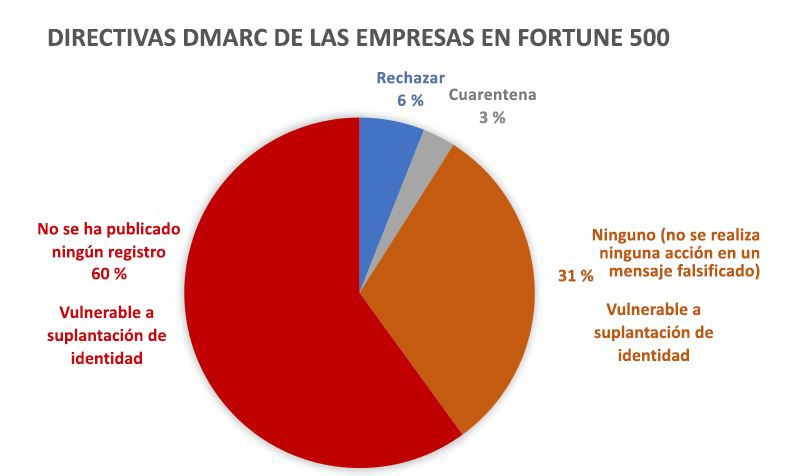
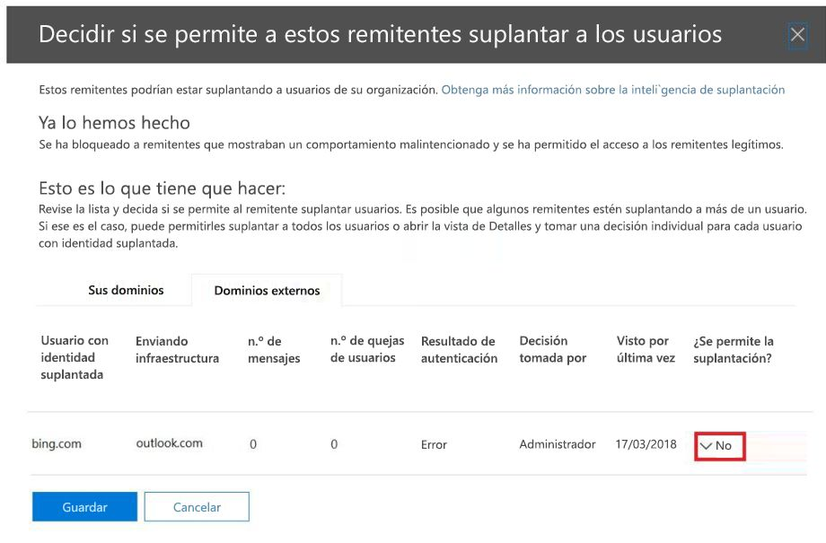

# <a name="email-authentication-in-office-365"></a><span data-ttu-id="81c75-103">Autenticación de correo electrónico en Office 365</span><span class="sxs-lookup"><span data-stu-id="81c75-103">Email authentication in Office 365</span></span>

<span data-ttu-id="81c75-104">La autenticación de correo electrónico (conocida también como validación de correo electrónico) es un grupo de normas que intentan detener la suplantación (mensajes de correo electrónico de remitentes falsos).</span><span class="sxs-lookup"><span data-stu-id="81c75-104">Email authentication (also known as email validation) is a group of standards that tries to stop spoofing (email messages from forged senders).</span></span> <span data-ttu-id="81c75-105">En Office 365 las organizaciones con buzones de Exchange Online y las organizaciones con Exchange Online Protection (EOP) independientes sin buzones de Exchange Online, EOP usa los estándares para verificar el correo electrónico entrante:</span><span class="sxs-lookup"><span data-stu-id="81c75-105">In Office 365 organizations with Exchange Online mailboxes and standalone Exchange Online Protection (EOP) organizations without Exchange Online mailboxes, EOP useses the standards to verify inbound email:</span></span>

- [<span data-ttu-id="81c75-106">SPF</span><span class="sxs-lookup"><span data-stu-id="81c75-106">SPF</span></span>](how-office-365-uses-spf-to-prevent-spoofing.md)

- [<span data-ttu-id="81c75-107">DKIM</span><span class="sxs-lookup"><span data-stu-id="81c75-107">DKIM</span></span>](support-for-validation-of-dkim-signed-messages.md)

- [<span data-ttu-id="81c75-108">DMARC</span><span class="sxs-lookup"><span data-stu-id="81c75-108">DMARC</span></span>](use-dmarc-to-validate-email.md)

<span data-ttu-id="81c75-109">La autenticación de correo electrónico comprueba que los mensajes de correo electrónico de un remitente (por ejemplo, laura@contoso.com) son legítimos y provienen de fuentes previstas para ese dominio de correo electrónico (por ejemplo, contoso.com).</span><span class="sxs-lookup"><span data-stu-id="81c75-109">Email authentication verifies that email messages from a sender (for example, laura@contoso.com) are legitimate and come from expected sources for that email domain (for example, contoso.com.)</span></span>

<span data-ttu-id="81c75-110">En el resto de este tema, se explica cómo funcionan estas tecnologías y cómo EOP las usa para comprobar el correo electrónico entrante.</span><span class="sxs-lookup"><span data-stu-id="81c75-110">The rest of this topic explains how these technologies work, and how EOP uses them to check inbound email.</span></span>

## <a name="use-email-authentication-to-help-prevent-spoofing"></a><span data-ttu-id="81c75-111">Uso de la autenticación de correo electrónico para ayudar a evitar la suplantación de identidad</span><span class="sxs-lookup"><span data-stu-id="81c75-111">Use email authentication to help prevent spoofing</span></span>

<span data-ttu-id="81c75-112">DMARC impide la suplantación mediante el examen de la dirección **De** en mensajes (la dirección de correo electrónico del remitente que verán los usuarios en su cliente de correo electrónico).</span><span class="sxs-lookup"><span data-stu-id="81c75-112">DMARC prevents spoofing by examining the **From** address in messages (the sender email address that users see in their email client).</span></span> <span data-ttu-id="81c75-113">Las organizaciones de correo electrónico de destino también pueden comprobar que el dominio de correo electrónico ha pasado SPF o DKIM, lo que significa que el dominio se ha autenticado y, por lo tanto, no está falsificado.</span><span class="sxs-lookup"><span data-stu-id="81c75-113">Destination email organizations can also verify that the email domain has passed SPF or DKIM, which means that the domain has been authenticated and is therefore not spoofed.</span></span> 

<span data-ttu-id="81c75-114">Sin embargo, el problema es que los registros SPF, DKIM y DMARC en DNS para la autenticación de correo electrónico (denominados directivas de autenticación de correo electrónico) son totalmente opcionales.</span><span class="sxs-lookup"><span data-stu-id="81c75-114">However, the problem is that SPF, DKIM, and DMARC records in DNS for email authentication (collectively known as email authentication policies) are completely optional.</span></span> <span data-ttu-id="81c75-115">Por lo tanto, aunque los dominios con directivas de autenticación de correo electrónico seguras como microsoft.com y skype.com están protegidos frente a la suplantación de identidad, los que utilizan directivas de autenticación de correo electrónico más débiles o no usan ninguna directiva son los principales objetivos para la suplantación. </span><span class="sxs-lookup"><span data-stu-id="81c75-115">Therefore, while domains with strong email authentication policies like microsoft.com and skype.com are protected from spoofing, domains that publish weaker email authentication policies, or no policy at all, are prime targets for being spoofed.</span></span>

<span data-ttu-id="81c75-116">En marzo de 2018, sólo un 9 % de los dominios de las empresas en la Fortune 500 publicaron directivas de autenticación de correo electrónico seguras.</span><span class="sxs-lookup"><span data-stu-id="81c75-116">As of March 2018, only 9% of domains of companies in the Fortune 500 publish strong email authentication policies.</span></span> <span data-ttu-id="81c75-117">Es posible que un atacante falsifique el 91 % restante de empresas.</span><span class="sxs-lookup"><span data-stu-id="81c75-117">The remaining 91% of companies might be spoofed by a attacker.</span></span> <span data-ttu-id="81c75-118">A no ser que haya otro mecanismo de filtrado de correo electrónico en contexto, el correo electrónico de los remitentes falsos de estos dominios podría entregarse a los usuarios.</span><span class="sxs-lookup"><span data-stu-id="81c75-118">Unless some other email filtering mechanism is in-place, email from spoofed senders in these domains might be delivered to users.</span></span>



<span data-ttu-id="81c75-120">La proporción de pequeñas y medianas empresas que no están en la lista Fortune 500 y que publican directivas de autenticación de correo electrónico seguras es menor y es incluso más pequeña para los dominios de correo electrónico que están fuera de Norteamérica y Europa occidental.</span><span class="sxs-lookup"><span data-stu-id="81c75-120">The proportion of small-to-medium sized companies that are not in the Fortune 500 that publish strong email authentication policies is smaller, and smaller still for email domains that are outside of North America and western Europe.</span></span>

<span data-ttu-id="81c75-121">Esto es un gran problema ya que, aunque las empresas pueden no ser conscientes de cómo funciona la autenticación de correo electrónico, los atacantes sí que la comprenden y se aprovechan de ello.</span><span class="sxs-lookup"><span data-stu-id="81c75-121">This is a big problem because while enterprises may not be aware of how email authentication works, attackers fully understand and take advantage it.</span></span> <span data-ttu-id="81c75-122">Puesto que el phishing es un problema tan importante y debido a una adopción de directivas de autenticación de correo electrónico seguras tan limitada, Microsoft usa *autenticación de correo electrónico implícita* para comprobar el correo electrónico entrante.</span><span class="sxs-lookup"><span data-stu-id="81c75-122">Because phishing is such a problem, and because of the limited adoption of strong email authentication policies, Microsoft uses *implicit email authentication* to check inbound email.</span></span>

<span data-ttu-id="81c75-123">La autenticación de correo electrónico implícita está basada en numerosas extensiones para las directivas de autenticación de correo electrónico habituales.</span><span class="sxs-lookup"><span data-stu-id="81c75-123">Implicit email authentication is built on numerous extensions to regular email authentication policies.</span></span> <span data-ttu-id="81c75-124">Entre estas extensiones se incluyen la reputación del remitente, el historial del remitente, el historial del destinatario, el análisis de comportamiento y otras técnicas avanzadas.</span><span class="sxs-lookup"><span data-stu-id="81c75-124">These extensions include sender reputation, sender history, recipient history, behavioral analysis, and other advanced techniques.</span></span> <span data-ttu-id="81c75-125">Un mensaje enviado desde un dominio que no usa las directivas de autenticación de correo electrónico se marcará como suplantación de identidad a menos que contenga otras señales que indiquen que es legítimo.</span><span class="sxs-lookup"><span data-stu-id="81c75-125">A message sent from a domain that doesn't use email authentication policies will be marked as spoof unless it contains other signals to indicate that it's legitimate.</span></span>

<span data-ttu-id="81c75-126">Para ver el anuncio general de Microsoft, vea [Un mar de phishing, parte 2: Protección contra la suplantación de identidad mejorada en Office 365](https://techcommunity.microsoft.com/t5/Security-Privacy-and-Compliance/Schooling-A-Sea-of-Phish-Part-2-Enhanced-Anti-spoofing/ba-p/176209).</span><span class="sxs-lookup"><span data-stu-id="81c75-126">To see Microsoft's general announcement, see [A Sea of Phish Part 2 - Enhanced Anti-spoofing in Office 365](https://techcommunity.microsoft.com/t5/Security-Privacy-and-Compliance/Schooling-A-Sea-of-Phish-Part-2-Enhanced-Anti-spoofing/ba-p/176209).</span></span>

## <a name="composite-authentication"></a><span data-ttu-id="81c75-127">Autenticación compuesta</span><span class="sxs-lookup"><span data-stu-id="81c75-127">Composite authentication</span></span>

<span data-ttu-id="81c75-128">Aunque SPF, DKIM y DMARC son útiles por sí mismos, no comunican de forma suficiente el estado de autenticación en caso de que un mensaje no contenga ningún registro de autenticación explícito.</span><span class="sxs-lookup"><span data-stu-id="81c75-128">While SPF, DKIM, and DMARC are all useful by themselves, they don't communicate enough authentication status in the event a message has no explicit authentication records.</span></span> <span data-ttu-id="81c75-129">Por lo tanto, Microsoft ha desarrollado un algoritmo para la autenticación de correo electrónico implícita que combina varias señales en un único valor denominado _autenticación compuesta_ ("compauth" para abreviar).</span><span class="sxs-lookup"><span data-stu-id="81c75-129">Therefore, Microsoft has developed an algorithm for implicit email authentication that combines multiple signals into a single value called _composite authentication_, or compauth for short.</span></span> <span data-ttu-id="81c75-130">El valor de autenticación compuesta se marca en el encabezado **Authentication-Results** en los encabezados de mensaje.</span><span class="sxs-lookup"><span data-stu-id="81c75-130">The compauth value is stamped into the **Authentication-Results** header in the message headers.</span></span>

> <span data-ttu-id="81c75-131">Authentication-Results:</span><span class="sxs-lookup"><span data-stu-id="81c75-131">Authentication-Results:</span></span><br/><span data-ttu-id="81c75-132">&nbsp;&nbsp;&nbsp;compauth=\<fail | pass | softpass | none\> reason=\<yyy\></span><span class="sxs-lookup"><span data-stu-id="81c75-132">&nbsp;&nbsp;&nbsp;compauth=\<fail | pass | softpass | none\> reason=\<yyy\></span></span>

<span data-ttu-id="81c75-133">Estos valores se explican en [Campos del encabezado de mensaje Authentication-results usados por la autenticación de correo electrónico de Office 365](anti-spam-message-headers.md#authentication-results-message-header-fields-used-by-office-365-email-authentication).</span><span class="sxs-lookup"><span data-stu-id="81c75-133">These values are explained at [Authentication-results message header fields used by Office 365 email authentication](anti-spam-message-headers.md#authentication-results-message-header-fields-used-by-office-365-email-authentication).</span></span>

<span data-ttu-id="81c75-134">Al examinar los encabezados de mensajes, los administradores o incluso los usuarios finales podrán determinar cómo Office 365 determinó que el remitente está falsificado.</span><span class="sxs-lookup"><span data-stu-id="81c75-134">By examining the message headers, admins or even end users can determine how Office 365 determined that the sender is spoofed.</span></span>

## <a name="why-email-authentication-is-not-always-enough-to-stop-spoofing"></a><span data-ttu-id="81c75-135">Por qué la autenticación de correo electrónico no siempre es suficiente para detener la suplantación de identidad</span><span class="sxs-lookup"><span data-stu-id="81c75-135">Why email authentication is not always enough to stop spoofing</span></span>

<span data-ttu-id="81c75-136">Depender solo de los registros de autenticación de correo electrónico para determinar si un mensaje entrante está falsificado tiene las siguientes limitaciones:</span><span class="sxs-lookup"><span data-stu-id="81c75-136">Relying only on email authentication records to determine if an incoming message is spoofed has the following limitations:</span></span>

- <span data-ttu-id="81c75-137">Es posible que el dominio remitente carezca de los registros DNS necesarios o que los registros no estén configurados correctamente.</span><span class="sxs-lookup"><span data-stu-id="81c75-137">The sending domain might lack the required DNS records, or the records are incorrectly configured.</span></span>

- <span data-ttu-id="81c75-138">El dominio de origen ha configurado correctamente los registros DNS, pero ese dominio no coincide con el dominio de la dirección De.</span><span class="sxs-lookup"><span data-stu-id="81c75-138">The source domain has correctly configured DNS records, but that domain doesn't match the domain in the From address.</span></span> <span data-ttu-id="81c75-139">SPF y DKIM no requieren que el dominio se use en la dirección De.</span><span class="sxs-lookup"><span data-stu-id="81c75-139">SPF and DKIM don't require the domain to be used in the From address.</span></span> <span data-ttu-id="81c75-140">Los intrusos y los servicios legítimos pueden registrar un dominio, configurar SPF y DKIM para el dominio, usar un dominio completamente distinto en la dirección De, y este mensaje pasará SPF y DKIM.</span><span class="sxs-lookup"><span data-stu-id="81c75-140">Attackers or legitimate services can register a domain, configure SPF and DKIM for the domain, use a completely different domain in the From address, and that message will pass SPF and DKIM.</span></span>

<span data-ttu-id="81c75-141">Las autenticaciones compuestas pueden superar estas limitaciones pasando mensajes que, de otra forma, no superarían las comprobaciones de autenticación de correo electrónico.</span><span class="sxs-lookup"><span data-stu-id="81c75-141">Composite authentication can address these limitations by passing messages that would otherwise fail email authentication checks.</span></span>

> [!NOTE]
> <span data-ttu-id="81c75-142">Como se describió anteriormente, la autenticación de correo electrónico implícita usa varias señales para determinar si un mensaje es legítimo.</span><span class="sxs-lookup"><span data-stu-id="81c75-142">As described earlier, implicit email authentication uses multiple signals to determine if a message is legitimate.</span></span> <span data-ttu-id="81c75-143">Para simplificar, los ejemplos siguientes se centran en los resultados de la autenticación de correo electrónico.</span><span class="sxs-lookup"><span data-stu-id="81c75-143">For simplicity, the following examples concentrate on email authentication results.</span></span> <span data-ttu-id="81c75-144">Otros factores de inteligencia de back-end podrían identificar mensajes que pasan la autenticación de correo electrónico como suplantados o mensajes que la pasan como legítimos.</span><span class="sxs-lookup"><span data-stu-id="81c75-144">Other back-end intelligence factors could identify messages that pass email authentication as spoofed, or messages that fail email email authentication as legitimate.</span></span>

<span data-ttu-id="81c75-145">Por ejemplo, el dominio fabrikam.com no tiene registros SPF, DKIM o DMARC.</span><span class="sxs-lookup"><span data-stu-id="81c75-145">For example, the fabrikam.com domain has no SPF, DKIM, or DMARC records.</span></span> <span data-ttu-id="81c75-146">Los mensajes de los remitentes del dominio fabrikam.com pueden producir un error en la autenticación compuesta (tenga en cuenta que el valor  y razón de `compauth`):</span><span class="sxs-lookup"><span data-stu-id="81c75-146">Messages from senders in the fabrikam.com domain can fail composite authentication (note the `compauth` value and reason):</span></span>

```text
Authentication-Results: spf=none (sender IP is 10.2.3.4)
  smtp.mailfrom=fabrikam.com; contoso.com; dkim=none
  (message not signed) header.d=none; contoso.com; dmarc=none
  action=none header.from=fabrikam.com; compauth=fail reason=001
From: chris@fabrikam.com
To: michelle@contoso.com
```

<span data-ttu-id="81c75-147">Si fabrikam.com configura un SPFF sin un registro DKIM, este mensaje no produciría un error de autenticación compuesta, porque el dominio de la dirección en De se alinea con el dominio que no ha producido un error de SPF:</span><span class="sxs-lookup"><span data-stu-id="81c75-147">If fabrikam.com configures an SPF without a DKIM record, the message can pass composite authentication, because the domain that passed SPF is aligned with the domain in the From address:</span></span>

```text
Authentication-Results: spf=pass (sender IP is 10.2.3.4)
  smtp.mailfrom=fabrikam.com; contoso.com; dkim=none
  (message not signed) header.d=none; contoso.com; dmarc=bestguesspass
  action=none header.from=fabrikam.com; compauth=pass reason=109
From: chris@fabrikam.com
To: michelle@contoso.com
```

<span data-ttu-id="81c75-148">Si fabrikam.com configura un registro DKIM sin un registro DKIM, este mensaje no produciría un error de autenticación compuesta, porque el dominio de la dirección en De se alinea con el dominio que no ha producido un error de la firma de DKIM:</span><span class="sxs-lookup"><span data-stu-id="81c75-148">If fabrikam.com configures a DKIM record without an SPF record, the message can pass composite authentication, because the domain in the passed DKIM signature is aligned with the domain in the From address:</span></span>

```text
Authentication-Results: spf=none (sender IP is 10.2.3.4)
  smtp.mailfrom=fabrikam.com; contoso.com; dkim=pass
  (signature was verified) header.d=outbound.fabrikam.com;
  contoso.com; dmarc=bestguesspass action=none
  header.from=fabrikam.com; compauth=pass reason=109
From: chris@fabrikam.com
To: michelle@contoso.com
```

<span data-ttu-id="81c75-149">Si el dominio en SPF o la firma DKIM no están alineados con el dominio de la dirección De, el mensaje puede producir un error de autenticación compuesta:</span><span class="sxs-lookup"><span data-stu-id="81c75-149">If the domain in SPF or the DKIM signature don't align with the domain in the From address, the message can fail composite authentication:</span></span>

```text
Authentication-Results: spf=none (sender IP is 192.168.1.8)
  smtp.mailfrom=maliciousdomain.com; contoso.com; dkim=pass
  (signature was verified) header.d=maliciousdomain.com;
  contoso.com; dmarc=none action=none header.from=contoso.com;
  compauth=fail reason=001
From: chris@contoso.com
To: michelle@fabrikam.com
```

## <a name="solutions-for-legitimate-senders-who-are-sending-unauthenticated-email"></a><span data-ttu-id="81c75-150">Soluciones para remitentes legítimos que envían correo electrónico sin autenticar</span><span class="sxs-lookup"><span data-stu-id="81c75-150">Solutions for legitimate senders who are sending unauthenticated email</span></span>

<span data-ttu-id="81c75-151">Office 365 realiza un seguimiento de quién está enviando correo sin autenticar en su organización.</span><span class="sxs-lookup"><span data-stu-id="81c75-151">Office 365 keeps track of who is sending unauthenticated email to your organization.</span></span> <span data-ttu-id="81c75-152">Si el servicio considera que el remitente no es legítimo, lo marcará como un error de autenticación compuesta.</span><span class="sxs-lookup"><span data-stu-id="81c75-152">If the service thinks the sender is not legitimate, it will mark it as a composite authentication failure.</span></span> <span data-ttu-id="81c75-153">Para evitar esto, puede usar las recomendaciones de esta sección.</span><span class="sxs-lookup"><span data-stu-id="81c75-153">To avoid this, you can use the recommendations in this section.</span></span>

### <a name="configure-email-authentication-for-domains-you-own"></a><span data-ttu-id="81c75-154">Configuración de la autenticación de correo electrónico para los dominios de su propiedad</span><span class="sxs-lookup"><span data-stu-id="81c75-154">Configure email authentication for domains you own</span></span>

<span data-ttu-id="81c75-155">Puede usar este método para resolver la suplantación de identidad dentro de la organización y entre dominios en caso de que es propietario o interactúa con varios espacios empresariales.</span><span class="sxs-lookup"><span data-stu-id="81c75-155">You can use this method to resolve intra-org spoofing and cross-domain spoofing in cases where you own or interact with multiple tenants.</span></span> <span data-ttu-id="81c75-156">También le ayuda a resolver la suplantación entre dominios donde envía a otros clientes de Office 365 o servicios de terceros hospedados por otros proveedores.</span><span class="sxs-lookup"><span data-stu-id="81c75-156">It also helps resolve cross-domain spoofing where you send to other customers within Office 365 or third parties that are hosted by other providers.</span></span>

- <span data-ttu-id="81c75-157">[Configure los registros de SPF](set-up-spf-in-office-365-to-help-prevent-spoofing.md) para sus dominios.</span><span class="sxs-lookup"><span data-stu-id="81c75-157">[Configure SPF records](set-up-spf-in-office-365-to-help-prevent-spoofing.md) for your domains.</span></span>

- <span data-ttu-id="81c75-158">[Configure los registros de DKIM](use-dkim-to-validate-outbound-email.md) para sus dominios principales.</span><span class="sxs-lookup"><span data-stu-id="81c75-158">[Configure DKIM records](use-dkim-to-validate-outbound-email.md) for your primary domains.</span></span>

- <span data-ttu-id="81c75-159">[Puede configurar los registros DMARC](use-dmarc-to-validate-email.md) para su dominio para determinar la lista de remitentes legítimos.</span><span class="sxs-lookup"><span data-stu-id="81c75-159">[Consider setting up DMARC records](use-dmarc-to-validate-email.md) for your domain to determine your legitimate senders.</span></span>

<span data-ttu-id="81c75-160">Microsoft no proporciona instrucciones detalladas de implementación para los registros SPF, DKIM y DMARC.</span><span class="sxs-lookup"><span data-stu-id="81c75-160">Microsoft doesn't provide detailed implementation guidelines for SPF, DKIM, and DMARC records.</span></span> <span data-ttu-id="81c75-161">Pero, hay una gran cantidad de información disponible en línea.</span><span class="sxs-lookup"><span data-stu-id="81c75-161">However, there's a lot of information available online.</span></span> <span data-ttu-id="81c75-162">También hay compañías de terceros dedicadas a ayudar a su organización a configurar los registros de autenticación de correo electrónico.</span><span class="sxs-lookup"><span data-stu-id="81c75-162">There are also 3rd party companies dedicated to helping your organization set up email authentication records.</span></span>

#### <a name="you-dont-know-all-sources-for-your-email"></a><span data-ttu-id="81c75-163">No conoce todas las fuentes del correo electrónico</span><span class="sxs-lookup"><span data-stu-id="81c75-163">You don't know all sources for your email</span></span>

<span data-ttu-id="81c75-164">Muchos dominios no publican registros de SPF porque no conocen todos los orígenes de correo electrónico de los mensajes de su dominio.</span><span class="sxs-lookup"><span data-stu-id="81c75-164">Many domains don't publish SPF records because they don't know all of the email sources for messages in their domain.</span></span> <span data-ttu-id="81c75-165">Debe empezar publicando un registro SPF que contenga las fuentes de correo que conoce, especialmente donde se encuentra el tráfico corporativo y publicar una directiva de SPF neutra, `?all`:</span><span class="sxs-lookup"><span data-stu-id="81c75-165">Start by publishing an SPF record that contains all of the email sources you know about (especially where your corporate traffic is located), and publish the neutral SPF policy `?all`.</span></span> <span data-ttu-id="81c75-166">Por ejemplo:</span><span class="sxs-lookup"><span data-stu-id="81c75-166">For example:</span></span>

```text
fabrikam.com IN TXT "v=spf1 include:spf.fabrikam.com ?all"
```

<span data-ttu-id="81c75-167">Este ejemplo significa que el correo electrónico de su infraestructura corporativa pasará la autenticación de correo electrónico, pero el correo electrónico procedente de fuentes desconocidas se revertirá a neutra.</span><span class="sxs-lookup"><span data-stu-id="81c75-167">This example means that email from your corporate infrastructure will pass email authentication, but email from unknown sources will fall back to neutral.</span></span>

<span data-ttu-id="81c75-168">Office 365 considerará el correo electrónico entrante de su infraestructura corporativa como autenticado, pero el correo electrónico procedente de orígenes que no estén identificados podría seguir marcado como suplantación de identidad (en función de si Office 365 puede autenticarlo implícitamente).</span><span class="sxs-lookup"><span data-stu-id="81c75-168">Office 365 will treat inbound email from your corporate infrastructure as authenticated, but email from unidentified sources might still be marked as spoof (depending upon whether Office 365 can implicitly authenticate it).</span></span> <span data-ttu-id="81c75-169">Pero, sigue siendo una mejora a que Office 365 marque todo el correo electrónico como suplantación de identidad.</span><span class="sxs-lookup"><span data-stu-id="81c75-169">However, this is still an improvement from all email being marked as spoof by Office 365.</span></span>

<span data-ttu-id="81c75-170">Una vez que haya empezado con una directiva de reserva SPF de `?all`, puede descubrir e incluir más orígenes de correo electrónico para los mensajes de forma gradual y, después, actualizar el registro SPF con una directiva más estricta.</span><span class="sxs-lookup"><span data-stu-id="81c75-170">Once you've gotten started with an SPF fallback policy of `?all`, you can gradually discover and include more email sources for your messages, and then update your SPF record with a stricter policy.</span></span>

### <a name="use-spoof-intelligence-to-configure-permitted-senders-of-unauthenticated-email"></a><span data-ttu-id="81c75-171">Uso de la inteligencia de suplantación de identidad para configurar los remitentes permitidos de correo electrónico sin autenticar</span><span class="sxs-lookup"><span data-stu-id="81c75-171">Use spoof intelligence to configure permitted senders of unauthenticated email</span></span>

<span data-ttu-id="81c75-172">También puede usar la [inteligencia de suplantación de identidad](learn-about-spoof-intelligence.md) para que los remitentes puedan enviar correos electrónicos sin autenticar a su organización.</span><span class="sxs-lookup"><span data-stu-id="81c75-172">You can also use [spoof intelligence](learn-about-spoof-intelligence.md) to permit senders to transmit unauthenticated messages to your organization.</span></span>

<span data-ttu-id="81c75-173">En el caso de los dominios externos, el usuario falso es el dominio de la dirección De, mientras que la infraestructura de envío es la dirección IP de origen (dividida en /24 rangos CIDR) o el dominio de la organización del registro de DNS (PTR) invertido.</span><span class="sxs-lookup"><span data-stu-id="81c75-173">For external domains, the spoofed user is the domain in the From address, while the sending infrastructure is either the source IP address (divided up into /24 CIDR ranges), or the organizational domain of the reverse DNS (PTR) record.</span></span>

<span data-ttu-id="81c75-174">En la siguiente captura de pantalla, la dirección IP de origen podría ser 131.107.18.4 con el registro PTR outbound.mail.protection.outlook.com.</span><span class="sxs-lookup"><span data-stu-id="81c75-174">In the screenshot below, the source IP might be 131.107.18.4 with the PTR record outbound.mail.protection.outlook.com.</span></span> <span data-ttu-id="81c75-175">Esto se mostraría como outlook.com para la infraestructura de envío.</span><span class="sxs-lookup"><span data-stu-id="81c75-175">This would show up as outlook.com for the sending infrastructure.</span></span>

<span data-ttu-id="81c75-176">Para permitir que este remitente envíe correos electrónicos sin autenticar, cambie de **No** a **Sí**.</span><span class="sxs-lookup"><span data-stu-id="81c75-176">To permit this sender to send unauthenticated email, change the **No** to a **Yes**.</span></span>



### <a name="create-an-allow-entry-for-the-senderrecipient-pair"></a><span data-ttu-id="81c75-178">Creación de una entrada de permiso para el par de remitente y destinatario</span><span class="sxs-lookup"><span data-stu-id="81c75-178">Create an allow entry for the sender/recipient pair</span></span>

<span data-ttu-id="81c75-179">Para omitir el filtrado de correo no deseado, algunas partes del filtrado de suplantación de identidad, pero no el filtrado de malware de remitentes específicos, consulte [Creación de listas de remitentes seguros en Office 365](create-safe-sender-lists-in-office-365.md).</span><span class="sxs-lookup"><span data-stu-id="81c75-179">To bypass spam filtering, some parts of phish filtering, but not malware filtering for specific senders, see [Create safe sender lists in Office 365](create-safe-sender-lists-in-office-365.md).</span></span>

### <a name="ask-the-sender-to-configure-email-authentication-for-domains-you-dont-own"></a><span data-ttu-id="81c75-180">Solicitar al remitente que configure de la autenticación de correo electrónico para los dominios que no son de su propiedad</span><span class="sxs-lookup"><span data-stu-id="81c75-180">Ask the sender to configure email authentication for domains you don't own</span></span>

<span data-ttu-id="81c75-181">Por el problema del correo no deseado y la suplantación de identidad, Microsoft recomienda la autenticación de correo electrónico para todas las organizaciones de correo electrónico.</span><span class="sxs-lookup"><span data-stu-id="81c75-181">Because of the problem of spam and phishing, Microsoft recommends email authentication for all email organizations.</span></span> <span data-ttu-id="81c75-182">En lugar de configurar anulaciones manuales en la organización, puede solicitar a un administrador del dominio remitente que configure los registros de autenticación de correo electrónico.</span><span class="sxs-lookup"><span data-stu-id="81c75-182">Instead of configuring manual overrides in your organization, you can ask an admin in the sending domain to configure their email authentication records.</span></span>

- <span data-ttu-id="81c75-183">Aunque no tuviesen necesidad de publicar registros de autenticación de correo electrónico en el pasado, deben hacerlo si envían correo electrónico a Microsoft.</span><span class="sxs-lookup"><span data-stu-id="81c75-183">Even if they didn't need to publish email authentication records in the past, they should do so if they send email to Microsoft.</span></span>

- <span data-ttu-id="81c75-184">Configure SPF para publicar direcciones IP de envío y configurar DKIM (si disponible) para firmar digitalmente los mensajes.</span><span class="sxs-lookup"><span data-stu-id="81c75-184">Set up SPF to publish the domain's sending IP addresses, and set up DKIM (if available) to digitally sign messages.</span></span> <span data-ttu-id="81c75-185">También deberían considerar al configuración de los registros DMARC.</span><span class="sxs-lookup"><span data-stu-id="81c75-185">They should also consider setting up DMARC records.</span></span>

- <span data-ttu-id="81c75-186">Si usan remitentes en masa para enviar mensajes de correo electrónico en su nombre, compruebe que el dominio de la dirección De (si les pertenece) se alinee con el dominio que supera el SPF o el DMARC.</span><span class="sxs-lookup"><span data-stu-id="81c75-186">If they use bulk senders to send email on their behalf, verify that the domain in the From address (if it belongs to them) aligns with the domain that passes SPF or DMARC.</span></span>

- <span data-ttu-id="81c75-187">Compruebe que las siguientes ubicaciones (si las usan) se incluyen en el registro de SPF:</span><span class="sxs-lookup"><span data-stu-id="81c75-187">Verify the following locations (if they use them) are included in the SPF record:</span></span>
  
  - <span data-ttu-id="81c75-188">Servidores de correo electrónico locales.</span><span class="sxs-lookup"><span data-stu-id="81c75-188">On-premises email servers.</span></span>
  - <span data-ttu-id="81c75-189">Correo electrónico enviado desde un proveedor de software como servicio (SaaS).</span><span class="sxs-lookup"><span data-stu-id="81c75-189">Email sent from a software-as-a-service (SaaS) provider.</span></span>
  - <span data-ttu-id="81c75-190">Correo electrónico enviado desde un servicio de hospedaje en la nube (Microsoft Azure, GoDaddy, Rackspace, Amazon Web Services, etc.).</span><span class="sxs-lookup"><span data-stu-id="81c75-190">Email sent from a cloud-hosting service (Microsoft Azure, GoDaddy, Rackspace, Amazon Web Services, etc.).</span></span>

- <span data-ttu-id="81c75-191">Para los dominios pequeños alojados en un ISP, configure el registro de SPF según las instrucciones del ISP.</span><span class="sxs-lookup"><span data-stu-id="81c75-191">For small domains that are hosted by an ISP, configure the SPF record according to the instructions from the ISP.</span></span>

<span data-ttu-id="81c75-192">Aunque puede ser difícil empezar a enviar dominios para la autenticación, con el tiempo, como más filtros de correo electrónico comienzan a eliminar o incluso rechazan su correo electrónico, deberán configurar los registros adecuados para garantizar una mejor entrega.</span><span class="sxs-lookup"><span data-stu-id="81c75-192">While it may be difficult at first to get sending domains to authenticate, over time, as more and more email filters start junking or even rejecting their email, it will cause them to set up the proper records to ensure better delivery.</span></span> <span data-ttu-id="81c75-193">Asimismo, la participación puede ayudar a luchar contra la suplantación de identidad, y puede reducir la posibilidad de que se produzca suplantación de identidad en la organización u organizaciones a las que envíen correo.</span><span class="sxs-lookup"><span data-stu-id="81c75-193">Also, their participation can help in the fight against phishing, and can reduce the possibility of phishing in their organization or organizations that they send email to.</span></span>

#### <a name="information-for-infrastructure-providers-isps-esps-or-cloud-hosting-services"></a><span data-ttu-id="81c75-194">Información para proveedores de infraestructura (ISP, ESP o servicios de hospedaje en la nube)</span><span class="sxs-lookup"><span data-stu-id="81c75-194">Information for infrastructure providers (ISPs, ESPs, or cloud hosting services)</span></span>

<span data-ttu-id="81c75-195">Si hospeda un correo electrónico de un dominio o si proporciona una infraestructura de hospedaje que puede enviar correo electrónico, haga lo siguiente:</span><span class="sxs-lookup"><span data-stu-id="81c75-195">If you host a domain's email or provide hosting infrastructure that can send email, you should do the following steps:</span></span>

- <span data-ttu-id="81c75-196">Asegúrese de que los clientes tienen documentación en la que se explica cómo deben configurar sus registros de SPF.</span><span class="sxs-lookup"><span data-stu-id="81c75-196">Ensure your customers have documentation that explains how your customers should configure their SPF records</span></span>

- <span data-ttu-id="81c75-197">Considere añadir firmas DKIM en el correo electrónico saliente, incluso si el cliente no lo configura explícitamente (firma con un dominio predeterminado).</span><span class="sxs-lookup"><span data-stu-id="81c75-197">Consider signing DKIM-signatures on outbound email, even if the customer doesn't explicitly set it up (sign with a default domain).</span></span> <span data-ttu-id="81c75-198">Puede incluso añadir dos firmas DKIM en el correo electrónico (una con el dominio del cliente, si lo ha configurado, y otra con la firma DKIM de su empresa)</span><span class="sxs-lookup"><span data-stu-id="81c75-198">You can even double-sign the email with DKIM signatures (once with the customer's domain if they have set it up, and a second time with your company's DKIM signature)</span></span>

<span data-ttu-id="81c75-199">No se garantiza la capacidad de entrega a Microsoft aunque se autentique el correo electrónico que proviene de su plataforma, pero al menos se garantiza que Microsoft no marque el correo electrónico como no deseado por no estar autenticado.</span><span class="sxs-lookup"><span data-stu-id="81c75-199">Deliverability to Microsoft is not guaranteed even if you authenticate email originating from your platform, but at least it ensures that Microsoft does not junk your email because it isn't authenticated.</span></span>

<span data-ttu-id="81c75-200">Para obtener más información sobre procedimientos recomendados de proveedores de servicio, vea [Procedimientos recomendados de mensajería móvil de M3AAWG para proveedores de servicios](https://www.m3aawg.org/sites/default/files/M3AAWG-Mobile-Messaging-Best-Practices-Service-Providers-2015-08.pdf).</span><span class="sxs-lookup"><span data-stu-id="81c75-200">For more details on service providers best practices, see [M3AAWG Mobile Messaging Best Practices for Service Providers](https://www.m3aawg.org/sites/default/files/M3AAWG-Mobile-Messaging-Best-Practices-Service-Providers-2015-08.pdf).</span></span>
