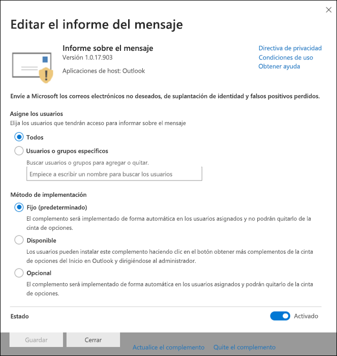

# Habilitar el complemento Notificar mensajesEnable the Report Message add-in

> [!NOTE]
> Si es administrador de una organización de Microsoft 365 con buzones de correo de Exchange Online, le recomendamos que use el portal de envíos del centro de seguridad & cumplimiento.If you're an admin in a Microsoft 365 organization with Exchange Online mailboxes, we recommend that you use the Submissions portal in the Security & Compliance Center. Para obtener más información, vea [usar el envío de administración para enviar un correo no deseado, phish, direcciones URL y archivos sospechosos a Microsoft](admin-submission.md).For more information, see [Use Admin Submission to submit suspected spam, phish, URLs, and files to Microsoft](admin-submission.md).

El complemento de mensajes de informe para Outlook y Outlook en la web (anteriormente conocido como Outlook Web App) permite a los usuarios informar fácilmente de falsos positivos (correo electrónico bueno marcado como malo) o falsos negativos (se permite correo electrónico erróneo) para Microsoft y sus filiales para el análisis.The Report Message add-in for Outlook and Outlook on the web (formerly known as Outlook Web App) enables people to easily report false positives (good email marked as bad) or false negatives (bad email allowed) to Microsoft and its affiliates for analysis. Microsoft usa estos envíos para mejorar la eficacia de las tecnologías de protección de correo electrónico.Microsoft uses these submissions to improve the effectiveness of email protection technologies.

Por ejemplo, supongamos que las personas están notificando una gran cantidad de mensajes como suplantación de identidad.For example, suppose that people are reporting a lot of messages as phishing. Esta información se Surfaces en el [Panel de seguridad](security-dashboard.md) y otros informes.This information surfaces in the [Security Dashboard](security-dashboard.md) and other reports. El equipo de seguridad de su organización puede usar esta información como indicación de que es posible que sea necesario actualizar las directivas antiphishing.Your organization's security team can use this information as an indication that anti-phishing policies might need to be updated. O bien, si los usuarios notifican un gran número de mensajes que se marcaron como correo no deseado mediante el complemento de mensajes de informe, es posible que el equipo de seguridad de la organización deba ajustar [las directivas contra correo no deseado](configure-your-spam-filter-policies.md).Or, if people are reporting a lot of messages that were flagged as junk mail as Not Junk by using the Report Message add-in, your organization's security team might need to adjust [anti-spam policies](configure-your-spam-filter-policies.md).

Además, si su organización usa [Office 365 Advanced Threat Protection Plan 1](office-365-atp.md) o [plan 2](office-365-ti.md), el complemento de mensajes de informe proporciona al equipo de seguridad de su organización información útil que puede usar para revisar y actualizar las directivas de seguridad.In addition, if your organization is using [Office 365 Advanced Threat Protection Plan 1](office-365-atp.md) or [Plan 2](office-365-ti.md), the Report Message add-in provides your organization's security team with useful information they can use to review and update security policies.

Los administradores pueden habilitar el complemento de mensajes de informe para la organización y los usuarios individuales pueden instalarlo por sí mismos.Admins can enable the Report Message add-in for the organization, and individual users can install it for themselves.

Si es un usuario individual, puede [Habilitar el complemento de mensajes de informe para usted mismo](#get-the-report-message-add-in-for-yourself).If you're an individual user, you can [enable the Report Message add-in for yourself](#get-the-report-message-add-in-for-yourself).

Si es administrador global o administrador de Exchange Online y Exchange está configurado para usar la autenticación OAuth, puede [Habilitar el complemento de mensajes de informe para su organización](#get-and-enable-the-report-message-add-in-for-your-organization).If you're a global administrator or an Exchange Online administrator, and Exchange is configured to use OAuth authentication, you can [enable the Report Message add-in for your organization](#get-and-enable-the-report-message-add-in-for-your-organization). El complemento de mensajes de informe ahora está disponible a través de la [implementación centralizada](https://docs.microsoft.com/microsoft-365/admin/manage/centralized-deployment-of-add-ins).The Report Message Add-In is now available through [Centralized Deployment](https://docs.microsoft.com/microsoft-365/admin/manage/centralized-deployment-of-add-ins).

## ¿Qué necesita saber antes de comenzar?What do you need to know before you begin?

- El complemento de mensajes de informe funciona con la mayoría de las suscripciones de Microsoft 365 y los productos siguientes:The Report Message add-in works with most Microsoft 365 subscriptions and the following products:

  - Outlook en la WebOutlook on the web
  - Outlook 2013 SP1 o posteriorOutlook 2013 SP1 or later
  - Outlook 2016 para MacOutlook 2016 for Mac
  - Outlook incluido con las aplicaciones de Microsoft 365 para empresasOutlook included with Microsoft 365 apps for Enterprise

- El complemento de mensajes de informe no está disponible actualmente para:The Report Message add-in is currently not available for:

  - Buzones de correo en organizaciones locales de ExchangeMailboxes in on-premises Exchange organizations
  - Las suscripciones GCC, GCC HIGH o DoDGCC, GCC HIGH, or DoD subscriptions

- Puede configurar los mensajes notificados para que se copien o redirijan a un buzón de correo que especifique.You can configure reported messages to be copied or redirected to a mailbox that you specify. Para obtener más información, vea [especificar un buzón para los envíos de usuarios de correo no deseado y mensajes de suplantación de identidad en Exchange Online](user-submission.md).For more information, see [Specify a mailbox for user submissions of spam and phishing messages in Exchange Online](user-submission.md).

- El explorador Web existente debe funcionar con el complemento de mensajes de informe.Your existing web browser should work with the Report Message add-in. Pero, si observa que el complemento no está disponible o no funciona como se esperaba, pruebe con otro explorador.But, if you notice the add-in is not available or not working as expected, try a different browser.

- Para las instalaciones organizativas, la organización debe estar configurada para usar la autenticación OAuth.For organizational installs, the organization needs to be configured to use OAuth authentication. Para obtener más información, vea [determinar si la implementación centralizada de complementos funciona para su organización](../../admin/manage/centralized-deployment-of-add-ins.md).For more information, see [Determine if Centralized Deployment of add-ins works for your organization](../../admin/manage/centralized-deployment-of-add-ins.md).

- Los administradores deben ser miembros del grupo de roles de administradores globales.Admins need to be a member of the Global admins role group. Para obtener más información, vea [Permisos en el Centro de seguridad y cumplimiento](permissions-in-the-security-and-compliance-center.md).For more information, see [Permissions in the Security & Compliance Center](permissions-in-the-security-and-compliance-center.md).

## Obtener el complemento de mensajes de informe para usted mismoGet the Report Message add-in for yourself

1. Vaya a Microsoft AppSource en <https://appsource.microsoft.com/marketplace/apps> y busque el complemento de mensajes de informe.Go to the Microsoft AppSource at <https://appsource.microsoft.com/marketplace/apps> and search for the Report Message add-in. Para ir directamente al complemento de mensajes de informe, vaya a <https://appsource.microsoft.com/product/office/wa104381180> .To go directly to the Report Message add-in, go to <https://appsource.microsoft.com/product/office/wa104381180>.

2. Haga clic en **obtener ahora**.Click **GET IT NOW**.

   

3. En el cuadro de diálogo que aparece, revise las condiciones de uso y la Directiva de privacidad y, a continuación, haga clic en **continuar**.In the dialog that appears, review the terms of use and privacy policy, and then click **Continue**.

4. Inicie sesión con su cuenta profesional o educativa (para uso empresarial) o su cuenta Microsoft (para uso personal).Sign in using your work or school account (for business use) or your Microsoft account (for personal use).

Una vez instalado y habilitado el complemento, verá los iconos siguientes:After the add-in is installed and enabled, you'll see the following icons:

- En Outlook, el icono tiene el siguiente aspecto:In Outlook, the icon looks like this:

  

- En Outlook en la web, el icono tiene el siguiente aspecto:In Outlook on the web, the icon looks like this:

  

Para obtener información sobre cómo usar el complemento, vea [usar el complemento de mensajes de informe](https://support.microsoft.com/office/b5caa9f1-cdf3-4443-af8c-ff724ea719d2).To learn how to use the add-in, see [Use the Report Message add-in](https://support.microsoft.com/office/b5caa9f1-cdf3-4443-af8c-ff724ea719d2).

## Obtener y habilitar el complemento de mensajes de informe para la organizaciónGet and enable the Report Message add-in for your organization

> [!NOTE]
> El complemento puede tardar hasta 12 horas en aparecer en la organización.It could take up to 12 hours for the add-in to appear in your organization.

1. En el centro de administración de Microsoft 365, vaya a la página **servicios & complementos** en <https://admin.microsoft.com/AdminPortal/Home#/Settings/ServicesAndAddIns> y, a continuación, haga clic en **implementar complemento**.In the Microsoft 365 admin center, go to the **Services & add-ins** page at <https://admin.microsoft.com/AdminPortal/Home#/Settings/ServicesAndAddIns>, and then click **Deploy Add-In**.

   

2. En el control flotante **implementar un nuevo complemento** que aparece, revise la información y, a continuación, haga clic en **siguiente**.In the **Deploy a new add-in** flyout that appears, review the information, and then click **Next**.

3. En la página siguiente, haga clic en **elegir en la tienda**.On the next page, click **Choose from the Store**.

   

4. En la página **seleccionar complemento** que aparece, haga clic en el cuadro de **búsqueda** , escriba **mensaje de informe**y, a continuación, haga clic en buscar en el icono de **Search**  .In the **Select add-in** page that appears, click in the **Search** box, enter **Report Message**, and then click **Search** . En la lista de resultados, buscar **mensaje de informe** y, a continuación, haga clic en **Agregar**.In the list of results, find **Report Message** and then click **Add**.

   

5. En el cuadro de diálogo que aparece, revise la información de licencias y privacidad y, a continuación, haga clic en **continuar**.In the dialog that appears, review the licensing and privacy information, and then click **Continue**.

6. En la página **configurar complemento** que aparece, configure las opciones siguientes:In the **Configure add-in** page that appears, configure the following settings:

   - **Usuarios asignados**: Seleccione uno de los siguientes valores:**Assigned users**: Select one of the following values:

     - **Todos** (predeterminado)**Everyone** (default)
     - **Usuarios o grupos específicos****Specific users / groups**
     - **Sólo yo****Just me**

   - **Método de implementación**: Seleccione uno de los siguientes valores:**Deployment method**: Select one of the following values:

     - **Fijo (predeterminado)**: el complemento se implementa automáticamente en los usuarios especificados y no puede quitarlo.**Fixed (Default)**: The add-in is automatically deployed to the specified users and they can't remove it.
     - **Disponible**: los usuarios pueden instalar el complemento en **casa** \> **obtener complementos** \> **administrados por el administrador**.**Available**: Users can install the add-in at **Home** \> **Get add-ins** \> **Admin-managed**.
     - **Opcional**: el complemento se implementa automáticamente para los usuarios especificados, pero puede elegir quitarlo.**Optional**: The add-in is automatically deployed to the specified users, but they can choose to remove it.

   

   Cuando haya terminado, haga clic en **implementar**.When you're finished, click **Deploy**.

7. En la página **implementar mensaje de informe** que aparece, verá un informe de progreso seguido de una confirmación de que se ha implementado el complemento.In the **Deploy Report Message** page that appears, you'll see a progress report followed by a confirmation that the add-in was deployed. Una vez que haya leído la información, haga clic en **siguiente**.After you read the information, click **Next**.

   

8. En la página **anunciar complemento** que aparece, revise la información y, a continuación, haga clic en **cerrar**.On the **Announce add-in** page that appears, review the information, and then click **Close**.

   

## Obtener información sobre cómo usar el complemento de mensajes de informeLearn how to use the Report Message add-in

Los usuarios que tengan el complemento asignado verán los iconos siguientes:People who have the add-in assigned to them will see the following icons:

- En Outlook, el icono tiene el siguiente aspecto:In Outlook, the icon looks like this:

  

- En Outlook en la web, el icono tiene el siguiente aspecto:In Outlook on the web, the icon looks like this:

  

Cuando notifique a los usuarios sobre el complemento de mensajes de informe, incluya un vínculo para [usar el complemento de mensajes de informe](https://support.microsoft.com/office/b5caa9f1-cdf3-4443-af8c-ff724ea719d2).When you notify users about the Report Message add-in, include a link to [Use the Report Message add-in](https://support.microsoft.com/office/b5caa9f1-cdf3-4443-af8c-ff724ea719d2).

## Revisión o edición de la configuración del complemento de mensajes de informeReview or edit settings for the Report Message add-in

1. En el centro de administración de Microsoft 365, vaya a la página **servicios & complementos** en <https://admin.microsoft.com/AdminPortal/Home#/Settings/ServicesAndAddIns> .In the Microsoft 365 admin center, go to the **Services & add-ins** page at <https://admin.microsoft.com/AdminPortal/Home#/Settings/ServicesAndAddIns>.

   

2. Busque y seleccione el complemento de **mensajes de informe** .Find and select the **Report Message** add-in.

3. En el control flotante de **mensaje de informe de edición** que aparece, revise y edite las opciones según corresponda para su organización.In the **Edit Report Message** flyout that appears, review and edit settings as appropriate for your organization. Cuando haya terminado, haga clic en **Guardar**.When you're finished, click **Save**.

   

## Ver y revisar los mensajes notificadosView and review reported messages

Para revisar los mensajes que los usuarios notifican a Microsoft, tiene estas opciones:To review messages that users report to Microsoft, you have these options:

- Usar el portal de envíos de administración.Use the Admin Submissions portal. Para obtener más información, vea [Ver envíos de usuarios a Microsoft](admin-submission.md#view-user-submissions-to-microsoft).For more information, see [View user submissions to Microsoft](admin-submission.md#view-user-submissions-to-microsoft).

- Crear una regla de flujo de correo (también denominada regla de transporte) para enviar copias de mensajes enviados.Create a mail flow rule (also known as a transport rule) to send copies of reported messages. Para obtener instrucciones, vea [usar reglas de flujo de correo para ver qué están notificando los usuarios a Microsoft](use-mail-flow-rules-to-see-what-your-users-are-reporting-to-microsoft.md).For instructions, see [Use mail flow rules to see what your users are reporting to Microsoft](use-mail-flow-rules-to-see-what-your-users-are-reporting-to-microsoft.md).
