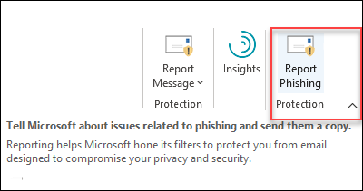
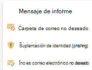

# Habilitar el complemento de suplantación de identidad de informes

[!INCLUDE [Microsoft 365 Defender rebranding](../includes/microsoft-defender-for-office.md)]

> [!NOTE]
> Si es administrador de una organización de Microsoft 365 con buzones de Exchange Online, le recomendamos que use el portal de envíos en el Centro de & cumplimiento. Para obtener más información, vea Usar envío de administrador para enviar correos sospechosos de correo no [deseado, phishing, direcciones URL y archivos a Microsoft.](admin-submission.md)

Los complementos de notificación de suplantación de identidad (phishing) para Outlook y Outlook en la Web (anteriormente conocido como Outlook Web App) permiten a los usuarios notificar fácilmente falsos positivos (correo electrónico bueno marcado como negativo) o falsos negativos (correo electrónico no deseado permitido) a Microsoft y sus filiales para su análisis.

Microsoft usa estos envíos para mejorar la eficacia de las tecnologías de protección de correo electrónico. Por ejemplo, supongamos que los usuarios están informando de muchos mensajes mediante el complemento de suplantación de identidad de informes. Esta información se muestra en el Panel [de seguridad](security-dashboard.md) y otros informes. El equipo de seguridad de su organización puede usar esta información como una indicación de que es posible que sea necesario actualizar las directivas contra suplantación de identidad.

Puede instalar el complemento Mensaje de informe o Informar de suplantación de identidad. Si desea que los usuarios informen tanto de mensajes de correo no deseado como de suplantación de identidad, implemente el complemento Informar de mensaje en su organización. Para obtener más información, vea Habilitar el complemento Mensaje [de informe.](enable-the-report-message-add-in.md)

El complemento Report Phishing ofrece la opción de notificar solo mensajes de suplantación de identidad. Los administradores pueden habilitar el complemento de suplantación de identidad de informes para la organización y los usuarios individuales pueden instalarlo por sí mismos.

Si es un usuario individual, puede habilitar el complemento de suplantación de identidad [de informes para usted mismo.](#get-the-report-phishing-add-in-for-yourself)

Si es un administrador global o un administrador de Exchange Online y Exchange está configurado para usar la autenticación de OAuth, puede habilitar el complemento de suplantación de identidad de informes para [su organización.](#get-and-enable-the-report-phishing-add-in-for-your-organization) El informe de suplantación de Add-In ya está disponible a través [de la implementación centralizada.](https://docs.microsoft.com/microsoft-365/admin/manage/centralized-deployment-of-add-ins)

## ¿Qué necesita saber antes de comenzar?

- El complemento de suplantación de identidad de informes funciona con la mayoría de las suscripciones de Microsoft 365 y los siguientes productos:

  - Outlook en la Web
  - Outlook 2013 SP1 o posterior
  - Outlook 2016 para Mac
  - Outlook incluido con aplicaciones de Microsoft 365 para empresas

- El complemento de suplantación de identidad de informes no está disponible para buzones en organizaciones de Exchange locales.

- Puede configurar los mensajes notificados para que se copien o redirijan a un buzón que especifique. Para obtener más información, consulta [Directivas de envío de usuarios.](user-submission.md)

- El explorador web existente debe funcionar con el complemento de suplantación de identidad de informes. Pero, si observa que el complemento no está disponible o no funciona como se esperaba, pruebe un explorador diferente.

- Para las instalación de la organización, la organización debe configurarse para usar la autenticación de OAuth. Para obtener más información, vea Determinar si la implementación centralizada de complementos [funciona para su organización.](../../admin/manage/centralized-deployment-of-add-ins.md)

- Los administradores deben ser miembros del grupo de roles Administradores globales. Para obtener más información, vea [Permisos en el Centro de seguridad y cumplimiento](permissions-in-the-security-and-compliance-center.md).

## Obtener el complemento de suplantación de identidad de informes por su cuenta

1. Go to the Microsoft AppSource at <https://appsource.microsoft.com/marketplace/apps> and search for the Report Phishing add-in.

2. Haga **clic en OBTENER AHORA.**

3. En el cuadro de diálogo que aparece, revise los términos de uso y la directiva de privacidad y, a continuación, haga clic en **Continuar.**

4. Inicia sesión con tu cuenta de trabajo o escuela (para uso empresarial) o tu cuenta de Microsoft (para uso personal).

Después de instalar y habilitar el complemento, verá los siguientes iconos:

- En Outlook, el icono tiene este aspecto:

  

- En Outlook en la Web, el icono tiene este aspecto:

  

## Obtener y habilitar el complemento de suplantación de identidad de informes para su organización

> [!NOTE]
> El complemento puede tardar hasta 12 horas en aparecer en la organización.

1. En el Centro de administración de Microsoft 365, vaya a Configuración, en la página Aplicaciones **integradas & Complementos** y, a continuación, haga clic en Implementar <https://admin.microsoft.com/AdminPortal/Home#/Settings/AddIns> **complemento.**

   

2. En el **menú desplegable Implementar** un nuevo complemento que aparece, revise la información y, a continuación, haga clic en **Siguiente.**

3. En la página siguiente, haga clic **en Elegir en la Tienda.**

   

4. En la página **Seleccionar complemento** que aparece, haga clic en el cuadro De búsqueda, escriba Suplantación de identidad de informe y, a continuación, haga clic **en** el icono   En la lista de resultados, busque **La suplantación** de identidad de informes y, a continuación, haga clic **en Agregar**.

5. En el cuadro de diálogo que aparece, revise la información de licencia y privacidad y, a continuación, haga clic **en Continuar.**

6. En la **página Configurar complemento que** aparece, configure las siguientes opciones:

   - **Usuarios asignados:** seleccione uno de los siguientes valores:

     - **Todos** (predeterminado)
     - **Usuarios o grupos específicos**
     - **Sólo yo**

   - **Método de implementación:** seleccione uno de los siguientes valores:

     - **Corregido (predeterminado):** el complemento se implementa automáticamente en los usuarios especificados y no pueden quitarlo.
     - **Disponible:** los usuarios pueden instalar el complemento en **Inicio** \> **Obtener complementos** \> **administrados por el administrador.**
     - **Opcional:** el complemento se implementa automáticamente en los usuarios especificados, pero pueden elegir quitarlo.

   Cuando haya terminado, haga clic **en Implementar.**

7. En la **página Implementar suplantación** de identidad de informes que aparece, verá un informe de progreso seguido de una confirmación de que el complemento se implementó. Después de leer la información, haga clic **en Siguiente**.

8. En la **página Anunciar complemento que** aparece, revise la información y, a continuación, haga clic en **Cerrar**.

## Obtenga información sobre cómo usar el complemento de suplantación de identidad de informes

Las personas que tengan asignado el complemento verán los siguientes iconos:

- En Outlook, el icono tiene este aspecto:

  

- En Outlook en la Web, el icono tiene este aspecto:

  

## Revisar o editar la configuración del complemento de suplantación de identidad de informes

1. En el Centro de administración de Microsoft 365, vaya a la página servicios **& complementos** en <https://admin.microsoft.com/AdminPortal/Home#/Settings/ServicesAndAddIns> .

2. Busque y seleccione el **complemento Detección de suplantación** de identidad (Phishing) de informes.

3. En el **control desplegable Editar suplantación** de identidad de informes que aparece, revisa y edita la configuración según corresponda a tu organización. Cuando haya terminado, haga clic en **Guardar**.

## Ver y revisar los mensajes notificados

Para revisar los mensajes que los usuarios envían a Microsoft, tiene estas opciones:

- Usa el portal de envíos de administrador. Para obtener más información, vea [Ver envíos de usuarios a Microsoft.](admin-submission.md#view-user-submissions-to-microsoft)

- Cree una regla de flujo de correo (también conocida como regla de transporte) para enviar copias de los mensajes notificados. Para obtener instrucciones, consulte Usar reglas de flujo de correo para ver lo que los [usuarios están informando a Microsoft.](use-mail-flow-rules-to-see-what-your-users-are-reporting-to-microsoft.md)