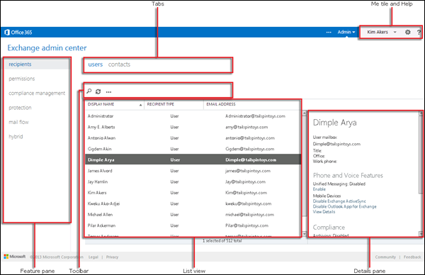

# Centro de administración de Exchange en EOP independiente

[!INCLUDE [Microsoft 365 Defender rebranding](../includes/microsoft-defender-for-office.md)]

**Se aplica a**
-  [Exchange Online Protection independiente](exchange-online-protection-overview.md)

El Centro de administración de Exchange (EAC) es una consola de administración basada en web para Exchange Online Protection (EOP) independiente.

¿Está buscando la versión de Exchange Online de este tema? Vea [Exchange admin center in Exchange Online](/exchange/exchange-admin-center).

## Abrir el EAC en EOP

Los clientes independientes de EOP pueden tener acceso al EAC mediante los siguientes métodos:

- **Desde el Centro de administración de Microsoft 365**:

  1. Vaya a <https://admin.microsoft.com> y haga clic en Mostrar **todo**.

     

  2. En la **sección Centros de administración** que aparece, haga clic en Todos los centros de **administración.**

     

  3. En la **página Todos los centros de administración** que aparece, haga clic en Exchange Online **Protection**.

- Vaya directamente a `https://admin.protection.outlook.com/ecp/` .

## Elementos comunes de la interfaz de usuario en el EAC en EOP

En esta sección se describen los elementos de la interfaz de usuario del EAC.

### Panel de características

Este es el primer nivel de navegación para la mayoría de las tareas que realizará en el EAC. El panel de características se organiza por áreas.

- **Destinatarios:** aquí es donde verá grupos y contactos externos.

- **Permisos:** aquí donde administrará los roles de administrador.

- **Administración de cumplimiento:** aquí es donde encontrará el informe de grupo de roles de administrador y el informe de registro de auditoría de administrador.

- **Protección:** aquí es donde puede administrar directivas antimalware, la directiva de filtro de conexión predeterminada y DKIM.

  > [!NOTE]
  > Debe administrar directivas antimalware y la directiva de filtro de conexión predeterminada en el Centro de seguridad & cumplimiento. Para obtener más información, vea [Configure anti-malware policies in EOP](configure-anti-malware-policies.md) y [Configure connection filtering in EOP](configure-the-connection-filter-policy.md).

- **Flujo de** correo: aquí es donde administrará las reglas de flujo de correo (también conocidas como reglas de transporte), los dominios aceptados y los conectores, así como dónde puede ir para ejecutar el seguimiento de mensajes.

- **Híbrido:** aquí es donde puede ejecutar [el](/Exchange/hybrid-configuration-wizard)Asistente para configuración híbrida y donde puede instalar el módulo [de PowerShell](/powershell/exchange/mfa-connect-to-exchange-online-powershell)de Exchange Online .

### Pestañas

Las pestañas son el segundo nivel de navegación. Las áreas de características contienen varias pestañas y cada área representa a una característica.

### Barra de herramientas

Al hacer clic en la mayoría de las pestañas, verá una barra de herramientas. La barra de herramientas tiene iconos que realizan una acción específica. La siguiente tabla describe los iconos y sus acciones.

****

|Icon|Nombre|Action|
|---|---|---|
||Agregar, nuevo|Utilice este icono para crear un nuevo objeto. Algunos de estos iconos tienen una flecha hacia abajo asociada donde puede hacer clic para mostrar objetos adicionales que puede crear.|
||Editar|Utilice este icono para editar un objeto.|
||Eliminar|Utilice este icono para eliminar un objeto. Algunos iconos eliminados tienen una flecha hacia abajo donde puede hacer clic para mostrar opciones adicionales.|
||Búsqueda|Usar este icono para abrir una casilla de búsqueda donde puede escribir una frase de búsqueda para el objeto que desee encontrar.|
||Actualizar|Utilice este icono para actualizar la vista de lista.|
||Más opciones|Use este icono para ver más acciones que puede realizar para los objetos de la pestaña. Por ejemplo, al hacer clic en este icono en **Destinatarios \> Usuarios**, se muestra la opción para realizar una **Búsqueda avanzada**.  |
||Flecha hacia arriba y flecha hacia abajo|Utilice estos iconos para mover la prioridad de un objeto hacia arriba o hacia abajo.|
||Quitar|Utilice este icono para quitar objetos de la lista.|
|

### Vista de lista

Cuando seleccione una pestaña, en la mayoría de los casos verá la vista de lista. El límite de visualización de la vista de lista del EAC es de 10.000 objetos aproximadamente. Además, la paginación se incluye para que pueda paginar los resultados.

### panel Detalles

Cuando seleccione un objeto de la vista de lista, la información acerca del objeto se muestra en el panel de detalles. En algunos casos, el panel de detalles incluye tareas de administración.

### Mosaico Yo y Ayuda

El mosaico **Yo** permite cerrar sesión en el EAC e iniciar sesión como un usuario diferente. En el **menú**  ayuda, puede realizar las siguientes acciones:

- **Ayuda:** haga  línea.
- **Comentarios:** deje comentarios.
- **Comunidad:** publique una pregunta para buscar respuestas en los foros de la comunidad.
- **Deshabilitar burbuja de ayuda:** la burbuja de ayuda muestra ayuda contextual para los campos al crear o editar un objeto. Puede desactivar el globo de Ayuda o activarlo si estaba deshabilitado.
- **Mostrar registro de comandos:** se abre una nueva ventana que muestra los comandos equivalentes de PowerShell en función de lo que configuró en EAC.

## Exploradores compatibles

Para conseguir la mejor experiencia con EAC, le recomendamos que use siempre la versión más actualizada de los exploradores, clientes de Office y aplicaciones. También le recomendamos que instale las actualizaciones de software cuando estén disponibles. Para obtener más información acerca de los exploradores compatibles y los requisitos del sistema para el servicio, vea [Requisitos del sistema para Office](https://products.office.com/office-system-requirements).

## Idiomas admitidos

Los siguientes idiomas son compatibles y están disponibles para el EAC en EOP independiente.

- Amhárico
- Árabe
- Vasco (Euskera)
- Bengalí (India)
- Búlgaro
- Catalán
- Chino (simplificado)
- Chino (tradicional)
- Croata
- Checo
- Danés
- Neerlandés
- Inglés
- Estonio
- Filipino (Filipinas)
- Finés
- Francés
- Gallego
- Alemán
- Griego
- Gujarati
- Hebreo
- Hindi
- Húngaro
- Islandés
- Indonesio
- Italiano
- Japonés
- Kannada
- Kazajo
- Kiswahili
- Coreano
- Letón
- Lituano
- Malayo (Brunei Darussalam)
- Malayo (Malasia)
- Malayalam
- Maratí
- Noruego (Bokmal)
- Noruego (Nynorsk)
- Odia
- Persa
- Polaco
- Portugués (Brasil)
- Portugués (Portugal)
- Rumano
- Ruso
- Serbio (cirílico, Serbia)
- Serbio (latino)
- Eslovaco
- Esloveno
- Español
- Sueco
- Tamil
- Telugu
- Tailandés
- Turco
- Ucraniano
- Urdu
- Vietnamita
- Galés