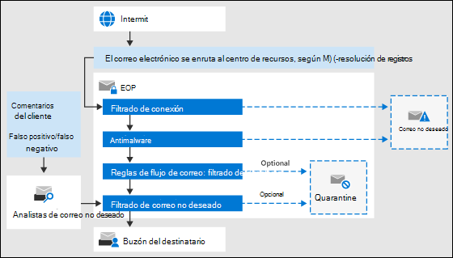

# Información general de Exchange Online ProtectionExchange Online Protection overview

Exchange Online Protection (EOP) es el servicio de filtrado basado en la nube que ayuda a proteger la organización contra el correo no deseado y el malware.Exchange Online Protection (EOP) is the cloud-based filtering service that helps protect your organization against spam and malware. EOP se incluye en todas las organizaciones de Microsoft 365 con buzones de correo de Exchange Online.EOP is included in all Microsoft 365 organizations with Exchange Online mailboxes.

Pero EOP también está disponible en los siguientes escenarios locales:But, EOP is also available in the following on-premises scenarios:

- **En un escenario independiente**: EOP proporciona protección de correo electrónico basada en la nube para su organización de Exchange local o para cualquier otra solución de correo SMTP local.**In a standalone scenario**: EOP provides cloud-based email protection for your on-premises Exchange organization or for any other on-premises SMTP email solution.

- **En una implementación híbrida**: EOP se puede configurar para proteger su entorno de correo electrónico y controlar el enrutamiento de correo cuando tiene una mezcla de buzones locales y en la nube.**In a hybrid deployment**: EOP can be configured to protect your email environment and control mail routing when you have a mix of on-premises and cloud mailboxes.

En estos escenarios, EOP puede simplificar la administración de su entorno de correo electrónico y aliviar muchas de las cargas que se incluyen en el mantenimiento de hardware y software local.In these scenarios, EOP can simplify the management of your email environment and alleviate many of the burdens that come with maintaining on-premises hardware and software.

El resto de este tema explica cómo funciona EOP en entornos independientes e híbridos.The rest of this topic explains how EOP works in standalone and hybrid environments.

## Cómo funciona EOPHow EOP works

Para comprender el funcionamiento de EOP, es muy útil ver cómo se procesa el correo entrante:To understand how EOP works, it helps to see how it processes incoming email:

- Un mensaje entrante pasa inicialmente por el filtrado de conexiones, que comprueba la reputación del remitente e inspecciona el mensaje en busca de malware.An incoming message initially passes through connection filtering, which checks the sender's reputation and inspects the message for malware. En este punto, la mayoría de los correos no deseados se interrumpen y se eliminan mediante EOP.The majority of spam is stopped at this point and deleted by EOP. Para obtener más información, consulte [Configurar filtrado de la conexión](configure-the-connection-filter-policy.md).For more information, see [Configure connection filtering](configure-the-connection-filter-policy.md).

- Los mensajes continúan a través del filtrado de directivas, donde los mensajes se evalúan con reglas de flujo de correo personalizado (también conocidas como reglas de transporte) que se crean o aplican a partir de una plantilla.Messages continue through policy filtering, where messages are evaluated against custom mail flow rules (also known as transport rules) that you create or enforce from a template. Por ejemplo, puede tener una regla que envíe una notificación a un administrador cuando llegue el correo de un remitente específico.For example, you can have a rule that sends a notification to a manager when mail arrives from a specific sender. Las comprobaciones de prevención de pérdida de datos (DLP) también se producen en este punto (Exchange Enterprise CAL con servicios).Data loss prevention (DLP) checks also occur at this point (Exchange Enterprise CAL with Services).

- A continuación, los mensajes pasan a través del filtrado contra correo no deseado (también conocido como filtrado de contenido).Next, messages pass through anti-spam filtering (also known as content filtering). Un mensaje que se determina como correo no deseado se puede enviar a la carpeta de correo no deseado o a la cuarentena de un usuario, entre otras opciones.A message that's determined to be spam can be sent to a user's Junk Email folder or to the quarantine, among other options. Para obtener más información, consulte [Configurar directivas contra correo electrónico no deseado](configure-your-spam-filter-policies.md).For more information, see [Configure anti-spam policies](configure-your-spam-filter-policies.md).

- Una vez que un mensaje pasa todas estas capas de protección correctamente, se entrega al destinatario.After a message passes all of these protection layers successfully, it's delivered to the recipient.

Para obtener más información, consulte [Order and Precedence of email Protection](how-policies-and-protections-are-combined.md).For more information, see [Order and precedence of email protection](how-policies-and-protections-are-combined.md).

### Centros de datos de EOPEOP datacenters

EOP se ejecuta en una red mundial de centros de datos que están diseñados para proporcionar la mejor disponibilidad.EOP runs on a worldwide network of datacenters that are designed to provide the best availability. Por ejemplo, si un centro de datos no está disponible, los mensajes de correo electrónico se enrutan automáticamente a otro centro de datos sin interrupciones del servicio.For example, if a datacenter becomes unavailable, email messages are automatically routed to another datacenter without any interruption in service. Los servidores de cada centro de recursos aceptan mensajes en su nombre, lo que proporciona una capa de separación entre la organización e Internet, con lo que se reduce la carga en los servidores.Servers in each datacenter accept messages on your behalf, providing a layer of separation between your organization and the internet, thereby reducing load on your servers. Gracias a esta red de alta disponibilidad, Microsoft se asegura que el correo llegue a la organización de manera puntual.Through this highly available network, Microsoft can ensure that email reaches your organization in a timely manner.

EOP realiza el equilibrio de carga entre los centros de datos, pero solo dentro de una región. Si está aprovisionado en una región, todos sus mensajes se procesarán usando el enrutamiento de correo de esa región. La siguiente lista muestra cómo funciona el enrutamiento regional de correo para los centros de datos de EOP:EOP performs load balancing between datacenters but only within a region. If you're provisioned in one region all your messages will be processed using the mail routing for that region. The following list shows the how regional mail routing works for the EOP datacenters:

- En Europa, Oriente Medio y África (EMEA), todos los buzones de Exchange Online están ubicados en centros de datos de EMEA, y todos los mensajes se enrutan a través de EMEA para el filtrado de EOP.In Europe, the Middle East, and Africa (EMEA), all Exchange Online mailboxes are located in EMEA datacenters, and all messages are routed through EMEA datacenters for EOP filtering.

- En Asia-Pacífico (APAC), todos los buzones de correo de Exchange Online se encuentran en centros de recursos de APACciones y los mensajes se enrutan actualmente a través de centros de recursos de APAC para el filtrado de EOP.In Asia-Pacific (APAC), all Exchange Online mailboxes are located in APAC datacenters, and messages are currently routed through APAC datacenters for EOP filtering.

- En América, todos los buzones de correo de Exchange Online se encuentran en centros de seguridad de Estados Unidos, con la excepción de Sudamérica, donde se usan centros de recursos de Brasil y Chile y en Canadá, en los que se usan centros de conexión de Canadá.In the Americas, all Exchange Online mailboxes are located in U.S. datacenters, with the exception of South America where datacenters in Brazil and Chile are used and in Canada where datacenters in Canada are used. Todos los mensajes de correo electrónico, incluidos los mensajes para clientes de Sudamérica y Canadá, se enrutan a través de centros de recursos locales para el filtrado de EOP; el correo electrónico en cuarentena se almacena en el centro de almacenamiento en el que se encuentra el inquilino.All email messages, including messages for customers in South America and Canada, are routed through local datacenters for EOP filtering; quarantined email is stored in the datacenter where the tenant is located.

- Para la nube de la comunidad de organismos oficiales (GCC), todos los buzones de Exchange Online están ubicados en centros de datos de Estados Unidos y los mensajes se enrutan a través de centros de datos de Estados Unidos para el filtrado de EOP.For the Government Community Cloud (GCC), all Exchange Online mailboxes are located in U.S. datacenters and all messages are routed through U.S. datacenters for EOP filtering.

## Planes y características de EOP para organizaciones de correo electrónico localesEOP plans and features for on-premises email organizations

Los planes de suscripción de EOP disponibles son los siguientes:The available EOP subscription plans are:

- **EOP independiente**: debe inscribirse en EOP para proteger su organización de correo electrónico local.**EOP standalone**: You enroll in EOP to protect your on-premises email organization.

- **Características de EOP en Exchange Online**: cualquier suscripción que incluya Exchange Online (independiente o como parte de Microsoft 365) utiliza EOP para proteger los buzones de correo de Exchange Online.**EOP features in Exchange Online**: Any subscription that includes Exchange Online (standalone or as part of Microsoft 365) uses EOP to protect your Exchange Online mailboxes.

- **Exchange Enterprise cal con servicios**: Si tiene una organización de Exchange local en la que ha comprado otras licencias de Exchange Enterprise cal con servicios, EOP forma parte de los servicios incluidos.**Exchange Enterprise CAL with Services**: If you have an on-premises Exchange organization where you've purchased additional Exchange Enterprise CAL with Services licenses, EOP is part of the included services.

Para obtener información acerca de los requisitos, límites importantes y disponibilidad de características en todos los planes de suscripción de EOP, vea la [Descripción del servicio protección en línea de Exchange](https://docs.microsoft.com/office365/servicedescriptions/exchange-online-protection-service-description/exchange-online-protection-service-description).For information about requirements, important limits, and feature availability across all EOP subscription plans, see the [Exchange Online Protection service description](https://docs.microsoft.com/office365/servicedescriptions/exchange-online-protection-service-description/exchange-online-protection-service-description).

## Configuración de EOP para organizaciones de correo electrónico localesSetting up EOP for on-premises email organizations

Configurar EOP puede ser fácil, especialmente en las compañías pequeñas con pocas reglas de cumplimiento. Sin embargo, si tiene una organización grande con muchos dominios, reglas de cumplimiento personalizadas o flujo de correo híbrido, la configuración puede llevar más tiempo e implicar más planeación.Setting up EOP can be simple, especially in the case of a small organization with a handful of compliance rules. However, if you have a large organization with multiple domains, custom compliance rules, or hybrid mail flow, set up can take more planning and time.

Si ya ha comprado EOP, vea [Configurar un servicio de EOP](set-up-your-eop-service.md) para asegurarse de completar todos los pasos necesarios para configurar EOP de modo que proteja el entorno de mensajería.If you've already purchased EOP, see [Set up your EOP service](set-up-your-eop-service.md) to ensure that you complete all the steps necessary to configure EOP to protect your messaging environment.

## Ayuda de EOP para administradoresEOP Help for admins

El contenido de la Ayuda para administradores de EOP consta de las siguientes categorías principales:The Help content for EOP administrators consists of the following top-level categories:

- [Exchange Online Protection Overview](exchange-online-protection-overview.md): presenta cómo funciona EOP y proporciona vínculos a información adicional.[Exchange Online Protection overview](exchange-online-protection-overview.md): Introduces how EOP works and provides links to additional information.

- [Características de EOP](eop-features.md): proporciona una lista de las características que están disponibles en EOP.[EOP features](eop-features.md): Provides a list of features that are available in EOP.

- [Configurar el servicio de EOP](set-up-your-eop-service.md): proporciona los pasos para configurar el servicio de EOP y vínculos a información adicional.[Set up your EOP service](set-up-your-eop-service.md): Provides steps for setting up your EOP service, and links to additional information.

- [Cambiar a EOP desde Google Postini, Barracuda Spam y virus firewall o Cisco IronPort](switch-to-eop-from-google-postini-the-barracuda-spam-and-virus-firewall-or-cisco.md): describe el proceso para cambiar a EOP desde otro producto de protección de correo electrónico.[Switch to EOP from Google Postini, the Barracuda Spam and Virus Firewall, or Cisco IronPort](switch-to-eop-from-google-postini-the-barracuda-spam-and-virus-firewall-or-cisco.md): Describes the process for switching to EOP from another email protection product.

- [Administrar destinatarios en EOP independiente](manage-recipients-in-eop.md): describe cómo administrar usuarios y grupos de correo en EOP.[Manage recipients in standalone EOP](manage-recipients-in-eop.md): Describes how to manage mail users and groups in EOP.

- [Flujo de correo en EOP](mail-flow-in-eop.md): describe cómo configurar escenarios de flujo de correo personalizados mediante conectores, cómo administrar dominios asociados con el servicio y cómo habilitar la característica de bloqueo perimetral basado en directorios (DBEB).[Mail flow in EOP](mail-flow-in-eop.md): Describes how to configure custom mail flow scenarios using connectors, how to manage domains associated with the service, and how to enable the Directory Based Edge Blocking (DBEB) feature.

- [Best Practices for Configuring EOP](best-practices-for-configuring-eop.md): describe las opciones de configuración recomendadas para después de configurar y aprovisionar el servicio.[Best practices for configuring EOP](best-practices-for-configuring-eop.md): Describes recommended configuration settings and considerations for after you set up and provision your service.

- [Informes de auditoría en EOP independiente](auditing-reports-in-eop.md): describe cómo usar los informes de auditoría para realizar un seguimiento de los cambios de configuración en el servicio.[Auditing reports in standalone EOP](auditing-reports-in-eop.md): Describes how to use auditing reports to track configuration changes to the service.

- [Protección contra correo electrónico no deseado y antimalware en EOP](anti-spam-and-anti-malware-protection.md): describe el filtrado de correo no deseado y el filtrado de malware y muestra cómo personalizarlos para satisfacer mejor las necesidades de su organización.[Anti-spam and anti-malware protection in EOP](anti-spam-and-anti-malware-protection.md): Describes spam filtering and malware filtering and shows how to customize them to best meet the needs of your organization. También se describen las tareas que los administradores y los usuarios finales pueden realizar en los mensajes en cuarentena.Also describes tasks that administrators and end users can perform on quarantined messages.

- [Informes y seguimiento de mensajes en Exchange Online Protection](reporting-and-message-trace-in-exchange-online-protection.md): describe los informes y las herramientas de solución de problemas que están disponibles.[Reporting and message trace in Exchange Online Protection](reporting-and-message-trace-in-exchange-online-protection.md): Describes the reports and troubleshooting tools that are available.

- [Centro de administración de Exchange en EOP independiente](exchange-admin-center-in-exchange-online-protection-eop.md): describe cómo tener acceso y navegar por la interfaz de administración del centro de administración de Exchange (EAC) para administrar el servicio de EOP.[Exchange admin center in standalone EOP](exchange-admin-center-in-exchange-online-protection-eop.md): Describes how to access and navigate through the Exchange admin center (EAC) management interface in order to manage your EOP service.

- [PowerShell de Exchange Online Protection](https://docs.microsoft.com/powershell/exchange/exchange-eop/exchange-online-protection-powershell): proporciona información sobre PowerShell remoto, que permite administrar el servicio EOP desde la línea de comandos.[Exchange Online Protection PowerShell](https://docs.microsoft.com/powershell/exchange/exchange-eop/exchange-online-protection-powershell): Provides information about remote PowerShell, which lets you manage your EOP service from the command line.

- [Ayuda y soporte técnico para EOP](help-and-support-for-eop.md) Proporciona información sobre cómo obtener ayuda y soporte técnico.[Help and support for EOP](help-and-support-for-eop.md) Provides information about obtaining help and technical support.
