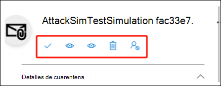
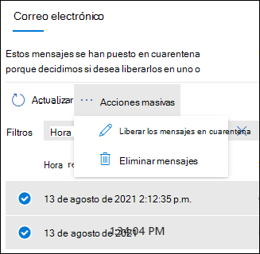

# Búsqueda y liberación de mensajes en cuarentena como usuario en EOP

[!INCLUDE [Microsoft 365 Defender rebranding](../includes/microsoft-defender-for-office.md)]

**Se aplica a**
- [Exchange Online Protection](exchange-online-protection-overview.md)
- [Plan 1 y Plan 2 de Microsoft Defender para Office 365](defender-for-office-365.md)
- [Microsoft 365 Defender](../defender/microsoft-365-defender.md)

En las organizaciones de Microsoft 365 que tienen buzones de Exchange Online o en las organizaciones con Exchange Online Protection (EOP) independientes sin buzones de Exchange Online, la cuarentena retiene los mensajes que pueden ser peligrosos o no deseados. Para más información, consulte [Cuarentena en EOP](quarantine-email-messages.md).

Como destinatario de un mensaje en cuarentena, lo que puede hacer con el mensaje como usuario normal (no administrador) se describe en la tabla siguiente:

 

****

|Motivo de la cuarentena:|Ver|Liberar|Eliminar|
|---|:---:|:---:|:---:|
|Masivo||||
|Correo no deseado||||
|Suplantación de identidad (suplantación de identidad no de alta confianza)||||
|

Puede ver y administrar los mensajes en cuarentena en el portal de Microsoft 365 Defender o, si un administrador lo ha configurado, en [notificaciones de correo no deseado para el usuario](use-spam-notifications-to-release-and-report-quarantined-messages.md).

## ¿Qué necesita saber antes de empezar?

- Para abrir el portal de Microsoft 365 Defender, vaya a <https://security.microsoft.com>. Para abrir directamente la página **Cuarentena**, use <https://security.microsoft.com/quarantine>.

- Los administradores pueden configurar cuánto tiempo se conservan los mensajes en cuarentena antes de que se eliminen de forma permanente (directivas contra correo electrónico no deseado). Los mensajes que han expirado de la cuarentena no se pueden recuperar. Para más información, consulte [Configurar directivas contra correo electrónico no deseado en EOP](configure-your-spam-filter-policies.md).

- Los administradores también pueden [configurar notificaciones de correo no deseado para el usuario final](configure-your-spam-filter-policies.md#configure-end-user-spam-notifications) en directivas contra correo no deseado. Los destinatarios del mensaje original pueden *liberar* mensajes de correo no deseado en cuarentena directamente desde estas notificaciones. Los destinatarios del mensaje original pueden *revisar* mensajes de phishing en cuarentena (mensajes de suplantación de identidad no de confianza alta) directamente desde estas notificaciones. Para obtener más información, consulte [Notificaciones de correo no deseado para el usuario final en EOP](use-spam-notifications-to-release-and-report-quarantined-messages.md).

- Los mensajes puestos en cuarentena por suplantación de identidad de alta confianza, malware o por reglas de flujo de correo (también conocidas como reglas de transporte) solo están disponibles para los administradores y no son visibles para los usuarios. Para más información, consulte [Administrar mensajes en cuarentena y archivos como administrador en EOP](manage-quarantined-messages-and-files.md).

- Únicamente puede liberar un mensaje e identificarlo como un falso positivo (deseado) una vez.

## Ver los mensajes en cuarentena

1. En el portal de Microsoft 365 Defender, vaya a **Colaboración y correos electrónicos** \> **Revisar** \> **Cuarentena**.
2. En la página **Cuarentena**, puede ordenar los resultados haciendo clic en un encabezado de columna disponible. Haga clic en **Personalizar columnas**  para cambiar las columnas que se muestran. Los valores predeterminados están marcados con un asterisco (\*):

   - **Hora de recepción**\*
   - **Asunto**\*
   - **Remitente**\*
   - **Motivo de la cuarentena**\*
   - **Estado de la versión**\*
   - **Tipo de directiva**\*
   - **Expira**\*
   - **Destinatario**
   - **Id. de mensaje**
   - **Nombre de la directiva**
   - **Tamaño del mensaje**
   - **Dirección de correo**

   Cuando haya terminado, haga clic en **Aplicar**.

3. Para filtrar los resultados, haga clic en **Filtrar**. Los siguientes filtros están disponibles en el control flotante **Filtros** que aparece:
   - **Id. de mensaje**: El identificador único global del mensaje.
   - **Dirección del remitente**
   - **Dirección del destinatario**
   - **Subject**
   - **Hora de recepción**: Escriba una **hora de incicio** y **hora de finalización** (fecha).
   - **Expiración**: Filtrar los mensajes según cuando expiran de la cuarentena:
     - **Hoy**
     - **Próximos 2 días**
     - **Próximos 7 días**
     - **Personalizado**: Introduzca una **hora de inicio** y una **hora de finalización** (fecha).
   - **Motivo de la cuarentena**:
     - **Masivo**
     - **Correo no deseado**
     - **Phishing**: El veredicto de seguridad del filtro de correo no deseado fue **suplantado** o la protección contra suplantación de identidad puso el mensaje en cuarentena ([configuración de suplantación de identidad](set-up-anti-phishing-policies.md#spoof-settings) o [protección de suplantación](set-up-anti-phishing-policies.md#impersonation-settings-in-anti-phishing-policies-in-microsoft-defender-for-office-365)).
     - **Suplantación de identidad de alta confianza**
   - **Estado de versión**: Cualquiera de los siguientes valores:
     - **Falta por revisar**
     - **Aprobado**
     - **Denegado**
     - **Liberación solicitada**
     - **Fecha de publicación**
   - **Tipo de directiva**: Filtrar mensajes por tipo de directiva:
     - **directiva antimalware**
     - **Directiva de datos adjuntos seguros**
     - **Directiva contra phishing**
     - **Directiva de correo no deseado**

   Cuando haya terminado, haga clic en **Aplicar**. Para borrar los filtros, haga clic en el  **Borrar filtros**.

4. Use el cuadro de **Búsqueda** y el valor correspondiente para buscar mensajes específicos. No se admiten los caracteres comodín. Puede buscar según los siguientes valores:
   - Id. del mensaje
   - Dirección de correo electrónico del remitente
   - Dirección de correo electrónico del destinatario
   - Asunto. Use el asunto completo del mensaje. La búsqueda no distingue entre mayúsculas y minúsculas.
   - Nombre de la directiva Use el nombre completo de la directiva. La búsqueda no distingue entre mayúsculas y minúsculas.

   Cuando haya introducido los criterios de búsqueda, pulse Entrar para filtrar los resultados.

Cuando encuentre un mensaje en cuarentena específico, seleccione el mensaje para ver los detalles del mismo y para realizar una acción (por ejemplo, ver, liberar, descargar o eliminar el mensaje).

### Ver detalles de mensajes en cuarentena

Cuando selecciona un mensaje en cuarentena de la lista, la siguiente información está disponible en el control flotante de detalles que aparece.

Cuando selecciona un mensaje de correo electrónico de la lista, aparecen los detalles de mensaje siguientes en el panel flotante **Detalles**:

- **Id. de mensaje**: El identificador único global para el mensaje.
- **Dirección del remitente**
- **Recibido**: La fecha/hora en que se ha recibido el mensaje.
- **Asunto**
- **Motivo de la cuarentena**: Muestra si un mensaje se ha identificado como **Correo no deseado**, **Masivo** o **Suplantación de identidad**.
- **Tipo de directiva**: El tipo de directiva. Por ejemplo, **Directiva contra correo electrónico no deseado**.
- **Número de destinatarios**
- **Destinatarios**: Si el mensaje contiene varios destinatarios, deberá hacer clic en **Vista previa del mensaje** o **Ver encabezado del mensaje** para ver la lista completa de destinatarios.
- **Expira**: La fecha/hora en que el mensaje se eliminará automática y permanentemente de la cuarentena.

Para actuar sobre el mensaje, consulte la siguiente sección.

> [!NOTE]
> Para permanecer en el control flotante de detalles, pero cambiar el mensaje en cuarentena que está visualizando, use las flechas arriba y abajo en la parte superior del control flotante.
>
> 

### Llevar a cabo una acción en un correo electrónico en cuarentena

Después de seleccionar un mensaje en cuarentena de la lista, las siguientes acciones están disponibles en el control flotante de detalles:

-  **Liberar correo electrónico**\*: Entrega el mensaje a su Bandeja de entrada.

-  icono Ver encabezados del mensaje **Ver encabezados del mensaje**: Seleccione este vínculo para ver el texto del encabezado del mensaje. Aparece el control flotante **Encabezado de mensaje** con los vínculos siguientes:
- **Copiar el encabezado de mensaje**: Haga clic en este vínculo para copiar el encabezado de mensaje (todos los campos de encabezado) en el portapapeles.
- **Analizador de encabezados de mensajes de Microsoft**: Para analizar los campos de encabezado y los valores en profundidad, haga clic en este vínculo para ir al Analizador de encabezados de mensajes. Pegue el encabezado del mensaje en la sección **Inserte el encabezado del mensaje que desea analizar** (CTRL+V o haga clic con el botón derecho del ratón y elija **Pegar**) y, a continuación, haga clic en **Analizar encabezados**.

Las siguientes acciones están disponibles después de hacer clic en el **Más acciones**:

-  **Vista previa de mensaje**: en el control flotante que aparece, elija una de las siguientes pestañas:
  - **Código fuente**: Muestra la versión HTML del cuerpo del mensaje con todos los vínculos desactivados.
  - **Texto sin formato**: Muestra el cuerpo del mensaje como texto sin formato.

-  **Quitar de la cuarentena**: Después de hacer clic en **Sí** en la advertencia que aparece, el mensaje se elimina inmediatamente sin enviarse a los destinatarios originales.

-  **Descargar correo electrónico**: En el control flotante que aparece, seleccione **entiendo los riesgos que conlleva la descarga de este mensaje** y, a continuación, haga clic en **Descargar** para guardar una copia local del mensaje en formato .eml.

-  Icono Bloquear remitente **Bloquear remitente**: añade el remitente a la lista de remitentes bloqueados del **Buzón**. Para más información, consulte [Bloquear un remitente de correo](https://support.microsoft.com/office/b29fd867-cac9-40d8-aed1-659e06a706e4).

\* Esta opción no está disponible para los mensajes que ya se han liberado (el valor del **estado liberado** es **Liberado**).

Si no libera o elimina el mensaje, se eliminará cuando expire el período de retención en cuarentena predeterminado (tal y como se muestra en la columna **Expiración**).

> [!NOTE]
> En un dispositivo móvil, el texto de descripción no está disponible en los iconos de acción.
>
> 
>
> Los iconos en orden y sus correspondientes descripciones se resumen en la siguiente tabla:
>
> |Icono|Descripción|
> |---:|---|
> ||**Liberar correo electrónico**|
> ||**Ver encabezados de mensaje**|
> ||**Vista previa de mensaje**|
> ||**Quitar de cuarentena**|
> ||**Bloquear remitente**|

#### Realice una acción en varios mensajes de correo electrónico en cuarentena

Cuando se seleccionan varios mensajes en cuarentena en la lista (hasta 100) haciendo clic en el área en blanco situada a la izquierda de la primera columna, aparece la lista desplegable **Acciones masivas** en la que se pueden realizar las siguientes acciones:

-  **Liberar correo mensajes**: Entrega el mensaje a su Bandeja de entrada.
- **Eliminar mensajes**: Después de hacer clic en **Sí** en la advertencia que aparece, los mensajes se elimina inmediatamente de la cuarentena sin enviarse a los destinatarios originales.
