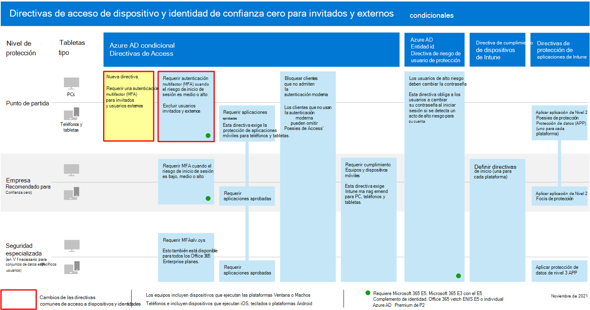

# Directivas para permitir el acceso de B2B y de invitado externo

En este artículo se describe cómo ajustar las directivas de identidad y acceso de dispositivos comunes recomendadas para permitir el acceso de usuarios externos y invitados que tienen una cuenta de Azure Active Directory (Azure AD) negocio a negocio (B2B). Esta guía se basa en las [directivas comunes de identidad y acceso a dispositivos](identity-access-policies.md).

Estas recomendaciones están diseñadas para aplicarse al nivel de **línea base** de protección. Sin embargo, también puede ajustar las recomendaciones en función de la granularidad de sus necesidades de protección **sensible** y **altamente regulada** .

Al proporcionar una ruta de acceso para las cuentas B2B para autenticarse con el inquilino de Azure AD, no se concede a estas cuentas acceso a todo el entorno. Los usuarios de B2B y sus cuentas solo tienen acceso a los recursos compartidos con ellos (como archivos) dentro de los servicios concedidos en las directivas de acceso condicional.

## Actualización de las directivas comunes para permitir y proteger el acceso de invitados y externos

Para proteger el acceso de invitados y externos con cuentas B2B de Azure AD, en el siguiente diagrama se ilustran las directivas que se deben agregar o actualizar desde las directivas comunes de identidad y acceso a dispositivos.

[Ver una versión más grande de esta imagen](https://github.com/MicrosoftDocs/microsoft-365-docs/raw/public/microsoft-365/media/microsoft-365-policies-configurations/identity-access-ruleset-guest.png)

En la siguiente tabla se enumeran las directivas que es necesario crear y actualizar. Las directivas comunes vinculan a las instrucciones de configuración asociadas en el artículo [Common Identity and Device Access Policies](identity-access-policies.md) .

|Nivel de protección|Directivas|Más información|
|---|---|---|
|**Baseline**|[Requerir MFA siempre para los usuarios externos y invitados](identity-access-policies.md#require-mfa-based-on-sign-in-risk)|Crear esta nueva Directiva y configurar: <ul><li> Para las **asignaciones > usuarios y grupos > incluir**, elija **Seleccionar usuarios y grupos** y, a continuación, seleccione **todos los usuarios externos y invitados**. </li><li> Para **las asignaciones > condiciones > inicio de sesión**, deje todas las opciones desactivadas para exigir siempre la autenticación multifactor (MFA).</li>|
||[Requerir MFA cuando el riesgo de inicio de sesión sea *medio* o *alto*](identity-access-policies.md#require-mfa-based-on-sign-in-risk)|Modifique esta directiva para excluir usuarios externos y invitados.|
||[Exigir equipos PC compatibles](identity-access-policies.md#require-compliant-pcs-but-not-compliant-phones-and-tablets)|Modifique esta directiva para excluir usuarios externos y invitados.|

Para incluir o excluir usuarios de invitado y externos en directivas de acceso condicional, para **asignaciones > usuarios y grupos > incluir** o **excluir**, compruebe **todos los usuarios externos y de invitado**.

## Más información

### Invitado y acceso externo con Microsoft Teams

Microsoft Teams define lo siguiente:

- El **acceso de invitado** usa una cuenta B2B de Azure ad que puede agregarse como miembro de un equipo y tener todo el acceso con permisos a las comunicaciones y recursos del equipo.

- El **acceso externo** es para un usuario externo que no tiene una cuenta B2B. El acceso externo puede incluir invitaciones y participación en las llamadas, chats y reuniones, pero no incluye la pertenencia al equipo ni el acceso a los recursos del equipo.

Para obtener más información, consulte la [comparación entre Guest y external Access for Teams](https://docs.microsoft.com/microsoftteams/communicate-with-users-from-other-organizations#compare-external-and-guest-access).

Consulte [recomendaciones de directivas para proteger los equipos chats, grupos y archivos](teams-access-policies.md) para obtener más información sobre cómo proteger las directivas de acceso a dispositivos e identidades para Teams.

### Requerir MFA siempre para los usuarios externos y invitados

Esta directiva solicita a los invitados que se registren en MFA en su espacio empresarial, independientemente de si están registrados para MFA en su inquilino de inicio. Al obtener acceso a los recursos de su espacio empresarial, los usuarios externos y invitados deben usar MFA para cada solicitud.

### Exclusión de invitados y usuarios externos de la MFA basada en riesgos

Si bien las organizaciones pueden aplicar directivas basadas en riesgos para los usuarios de B2B mediante Azure AD Identity Protection, hay limitaciones en la implementación de la protección de identidad de Azure AD para los usuarios de colaboración B2B en un directorio de recursos debido a la identidad existente en su directorio principal. Debido a estas limitaciones, Microsoft recomienda excluir a los usuarios invitados de las directivas de MFA basadas en riesgos y requerir que estos usuarios usen siempre la MFA.

Para obtener más información, vea [limitaciones de la protección de identidad para usuarios de colaboración B2B](https://docs.microsoft.com/azure/active-directory/identity-protection/concept-identity-protection-b2b#limitations-of-identity-protection-for-b2b-collaboration-users).

### Excluir usuarios externos y invitados de la administración de dispositivos

Solo una organización puede administrar un dispositivo. Si no excluye a los usuarios externos y invitados de las directivas que requieran el cumplimiento de dispositivos, estas directivas bloquearán a estos usuarios.

## Paso siguiente

Configure las directivas de acceso condicional para:

- [Microsoft Teams](teams-access-policies.md)
- [Exchange Online](secure-email-recommended-policies.md)
- [SharePoint](sharepoint-file-access-policies.md)
