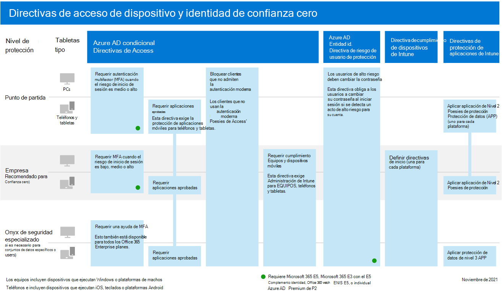

# Directivas comunes de acceso a dispositivos e identidadesCommon identity and device access policies

**Se aplica a****Applies to**
- [Exchange Online ProtectionExchange Online Protection](exchange-online-protection-overview.md)
- [Plan 1 y Plan 2 de Microsoft Defender para Office 365Microsoft Defender for Office 365 plan 1 and plan 2](defender-for-office-365.md)
- AzureAzure

En este artículo se describen las directivas recomendadas comunes para proteger el acceso Microsoft 365 los servicios en la nube, incluidas las aplicaciones locales publicadas con proxy de aplicación de Azure Active Directory (Azure AD).This article describes the common recommended policies for securing access to Microsoft 365 cloud services, including on-premises applications published with Azure Active Directory (Azure AD) Application Proxy.

En esta guía se describe cómo implementar las directivas recomendadas en un entorno recién aprovisionado.This guidance discusses how to deploy the recommended policies in a newly-provisioned environment. La configuración de estas directivas en un entorno de laboratorio independiente permite comprender y evaluar las directivas recomendadas antes de realizar el lanzamiento en los entornos de preproducción y producción.Setting up these policies in a separate lab environment allows you to understand and evaluate the recommended policies before staging the rollout to your preproduction and production environments. El entorno recién aprovisionado puede ser híbrido o solo en la nube para reflejar sus necesidades de evaluación.Your newly provisioned environment can be cloud-only or hybrid to reflect your evaluation needs.

## Conjunto de directivasPolicy set

En el siguiente diagrama se muestra el conjunto de directivas recomendado.The following diagram illustrates the recommended set of policies. Muestra a qué nivel de protección se aplica cada directiva y si las directivas se aplican a equipos, teléfonos y tabletas, o ambas categorías de dispositivos.It shows which tier of protections each policy applies to and whether the policies apply to PCs or phones and tablets, or both categories of devices. También indica dónde se configuran estas directivas.It also indicates where you configure these policies.

Este es un resumen pdf de una página con vínculos a las directivas individuales:Here's a one-page PDF summary with links to the individual policies:

   [Ver como un PDF](../../downloads/MSFT-cloud-architecture-identity-device-protection-handout.pdf) \| [Descargar como pdf](https://github.com/MicrosoftDocs/microsoft-365-docs/raw/public/microsoft-365/downloads/MSFT-cloud-architecture-identity-device-protection-handout.pdf)[View as a PDF](../../downloads/MSFT-cloud-architecture-identity-device-protection-handout.pdf) \| [Download as a PDF](https://github.com/MicrosoftDocs/microsoft-365-docs/raw/public/microsoft-365/downloads/MSFT-cloud-architecture-identity-device-protection-handout.pdf)

El resto de este artículo describe cómo configurar estas directivas.The rest of this article describes how to configure these policies.

> [!NOTE]
> Se recomienda usar la autenticación multifactor (MFA) antes de inscribir dispositivos en Intune para asegurarse de que el dispositivo está en posesión del usuario previsto.Requiring the use of multi-factor authentication (MFA) is recommended before enrolling devices in Intune to assure that the device is in the possession of the intended user. Debes inscribir dispositivos en Intune para poder aplicar directivas de cumplimiento de dispositivos.You must enroll devices in Intune before you can enforce device compliance policies.

Para darle tiempo para realizar estas tareas, se recomienda implementar las directivas de línea base en el orden que se muestra en esta tabla.To give you time to accomplish these tasks, we recommend implementing the baseline policies in the order listed in this table. Sin embargo, las directivas de MFA para niveles de protección confidenciales y altamente regulados se pueden implementar en cualquier momento.However, the MFA policies for sensitive and highly regulated levels of protection can be implemented at any time.

|Nivel de protecciónProtection level|DirectivasPolicies|Más informaciónMore information|LicenciasLicensing|
|---|---|---|---|
|**Baseline****Baseline**|[Requerir MFA cuando el riesgo de inicio de sesión *es medio* o *alto*Require MFA when sign-in risk is *medium* or *high*](#require-mfa-based-on-sign-in-risk)||Microsoft 365 E5 o Microsoft 365 E3 con el complemento seguridad E5Microsoft 365 E5 or Microsoft 365 E3 with the E5 Security add-on|
||[Bloquear a los clientes que no sean compatibles con la autenticación modernaBlock clients that don't support modern authentication](#block-clients-that-dont-support-multi-factor)|Los clientes que no usan la autenticación moderna pueden omitir las directivas de acceso condicional, por lo que es importante bloquear estas directivas.Clients that do not use modern authentication can bypass Conditional Access policies, so it's important to block these.|Microsoft 365 E3 o E5Microsoft 365 E3 or E5|
||[Los usuarios de riesgo alto tienen que cambiar la contraseñaHigh risk users must change password](#high-risk-users-must-change-password)|Fuerza a los usuarios a cambiar su contraseña al iniciar sesión si se detecta actividad de alto riesgo para su cuenta.Forces users to change their password when signing in if high-risk activity is detected for their account.|Microsoft 365 E5 o Microsoft 365 E3 con el complemento seguridad E5Microsoft 365 E5 or Microsoft 365 E3 with the E5 Security add-on|
||[Aplicar protección de datos de directivas de protección de aplicaciones (APP)Apply Application Protection Policies (APP) data protection](#apply-app-data-protection-policies)|Una directiva de Protección de aplicaciones de Intune por plataforma (Windows, iOS/iPadOS, Android).One Intune App Protection policy per platform (Windows, iOS/iPadOS, Android).|Microsoft 365 E3 o E5Microsoft 365 E3 or E5|
||[Requerir aplicaciones aprobadas y protección de aplicacionesRequire approved apps and app protection](#require-approved-apps-and-app-protection)|Aplica la protección de aplicaciones móviles para teléfonos y tabletas con iOS, iPadOS o Android.Enforces mobile app protection for phones and tablets using iOS, iPadOS, or Android.|Microsoft 365 E3 o E5Microsoft 365 E3 or E5|
||[Definir directivas de cumplimiento de dispositivosDefine device compliance policies](#define-device-compliance-policies)|Una directiva para cada plataforma.One policy for each platform.|Microsoft 365 E3 o E5Microsoft 365 E3 or E5|
||[Exigir equipos PC compatiblesRequire compliant PCs](#require-compliant-pcs-but-not-compliant-phones-and-tablets)|Aplica la administración de Intune de equipos con Windows o MacOS.Enforces Intune management of PCs using Windows or MacOS.|Microsoft 365 E3 o E5Microsoft 365 E3 or E5|
|**Confidencial****Sensitive**|[Requerir MFA cuando el riesgo de inicio de sesión *es bajo,* *medio* o *alto*Require MFA when sign-in risk is *low*, *medium*, or *high*](#require-mfa-based-on-sign-in-risk)||Microsoft 365 E5 o Microsoft 365 E3 con el complemento seguridad E5Microsoft 365 E5 or Microsoft 365 E3 with the E5 Security add-on|
||[Requerir equipos y *dispositivos* móviles compatiblesRequire compliant PCs *and* mobile devices](#require-compliant-pcs-and-mobile-devices)|Aplica la administración de Intune para equipos (Windows o MacOS) y teléfonos o tabletas (iOS, iPadOS o Android).Enforces Intune management for both PCs (Windows or MacOS) and phones or tablets (iOS, iPadOS, or Android).|Microsoft 365 E3 o E5Microsoft 365 E3 or E5|
|**Extremadamente regulado****Highly regulated**|[*Requerir* siempre MFA*Always* require MFA](#assigning-policies-to-groups-and-users)||Microsoft 365 E3 o E5Microsoft 365 E3 or E5|
|

## Asignar directivas a grupos y usuariosAssigning policies to groups and users

Antes de configurar directivas, identifique los grupos de Azure AD que está usando para cada nivel de protección.Before configuring policies, identify the Azure AD groups you are using for each tier of protection. Normalmente, la protección de línea base se aplica a todos los usuarios de la organización.Typically, baseline protection applies to everybody in the organization. Un usuario que se incluye para la línea base y la protección confidencial tendrá todas las directivas de línea base aplicadas más las directivas confidenciales.A user who is included for both baseline and sensitive protection will have all the baseline policies applied plus the sensitive policies. La protección es acumulativa y se aplica la directiva más restrictiva.Protection is cumulative and the most restrictive policy is enforced.

Una práctica recomendada es crear un grupo de Azure AD para la exclusión de acceso condicional.A recommended practice is to create an Azure AD group for Conditional Access exclusion. Agregue este grupo a todas las  directivas de acceso condicional en el valor Excluir de la configuración **Usuarios y** grupos de la **sección Asignaciones.**Add this group to all of your Conditional Access policies in the **Exclude** value of the **Users and groups** setting in the **Assignments** section. Esto le proporciona un método para proporcionar acceso a un usuario mientras soluciona problemas de acceso.This gives you a method to provide access to a user while you troubleshoot access issues. Esto se recomienda como una solución temporal solamente.This is recommended as a temporary solution only. Supervise este grupo en busca de cambios y asegúrese de que el grupo de exclusión se esté utilizando solo como se pretende.Monitor this group for changes and be sure the exclusion group is being used only as intended.

Este es un ejemplo de asignación de grupo y exclusiones para requerir MFA.Here's an example of group assignment and exclusions for requiring MFA.

Estos son los resultados:Here are the results:

- Todos los usuarios deben usar MFA cuando el riesgo de inicio de sesión es medio o alto.All users are required to use MFA when the sign-in risk is medium or high.

- Los miembros del grupo De personal ejecutivo deben usar MFA cuando el riesgo de inicio de sesión es bajo, medio o alto.Members of the Executive Staff group are required to use MFA when the sign-in risk is low, medium, or high.

  En este caso, los miembros del grupo Personal ejecutivo coinciden con las directivas de acceso condicional de línea base y confidenciales.In this case, members of the Executive Staff group match both the baseline and sensitive Conditional Access policies. Se combinan los controles de acceso para ambas directivas, que en este caso equivalen a la directiva de acceso condicional confidencial.The access controls for both policies are combined, which in this case is equivalent to the sensitive Conditional Access policy.

- Los miembros del grupo de Project secreto superior X siempre son necesarios para usar MFAMembers of the Top Secret Project X group are always required to use MFA

  En este caso, los miembros del grupo Project X coinciden con las directivas de acceso condicional de línea base y altamente reguladas.In this case, members of the Top Secret Project X group match both the baseline and highly-regulated Conditional Access policies. Los controles de acceso para ambas directivas se combinan.The access controls for both policies are combined. Dado que el control de acceso de la directiva de acceso condicional altamente regulado es más restrictivo, se usa.Because the access control for the highly-regulated Conditional Access policy is more restrictive, it is used.

Tenga cuidado al aplicar niveles más altos de protección a grupos y usuarios.Be careful when applying higher levels of protection to groups and users. Por ejemplo, los miembros del grupo top secret Project X tendrán que usar MFA cada vez que inicien sesión, incluso si no están trabajando en el contenido altamente regulado para Project X.For example, members of the Top Secret Project X group will be required to use MFA every time they sign in, even if they are not working on the highly-regulated content for Project X.

Todos los grupos de Azure AD creados como parte de estas recomendaciones deben crearse como Microsoft 365 grupos.All Azure AD groups created as part of these recommendations must be created as Microsoft 365 groups. Esto es importante para la implementación de etiquetas de confidencialidad al proteger documentos en Microsoft Teams y SharePoint.This is important for the deployment of sensitivity labels when securing documents in Microsoft Teams and SharePoint.

## Requerir MFA en función del riesgo de inicio de sesiónRequire MFA based on sign-in risk

Debe hacer que los usuarios se registren en MFA antes de requerir su uso.You should have your users register for MFA prior to requiring its use. Si tiene Microsoft 365 E5, Microsoft 365 E3 con el complemento seguridad E5, Office 365 con EMS E5 o licencias individuales de Azure AD Premium P2, puede usar la directiva de registro de MFA con Azure AD Identity Protection para requerir que los usuarios se registren en MFA.If you have Microsoft 365 E5, Microsoft 365 E3 with the E5 Security add-on, Office 365 with EMS E5, or individual Azure AD Premium P2 licenses, you can use the MFA registration policy with Azure AD Identity Protection to require that users register for MFA. El [trabajo previo incluye](identity-access-prerequisites.md) registrar todos los usuarios con MFA.The [prerequisite work](identity-access-prerequisites.md) includes registering all users with MFA.

Una vez registrados los usuarios, puede requerir MFA para iniciar sesión con una nueva directiva de acceso condicional.After your users are registered, you can require MFA for sign-in with a new Conditional Access policy.

1. Vaya al [Azure Portal](https://portal.azure.com) e inicie sesión con sus credenciales.Go to the [Azure portal](https://portal.azure.com), and sign in with your credentials.
2. En la lista de servicios de Azure, elija **Azure Active Directory**.In the list of Azure services, choose **Azure Active Directory**.
3. En la **lista Administrar,** elija **Seguridad** y, a continuación, **elija Acceso condicional.**In the **Manage** list, choose **Security**, and then choose **Conditional Access**.
4. Elija **Nueva directiva** y escriba el nombre de la nueva directiva.Choose **New policy** and type the new policy's name.

En las tablas siguientes se describe la configuración de la directiva de acceso condicional para requerir MFA en función del riesgo de inicio de sesión.The following tables describes the Conditional Access policy settings to require MFA based on sign-in risk.

En la **sección Asignaciones:**In the **Assignments** section:

|ConfiguraciónSetting|PropiedadesProperties|ValoresValues|NotasNotes|
|---|---|---|---|
|Usuarios y gruposUsers and groups|IncluirInclude|**Seleccione usuarios y grupos > usuarios y grupos:** seleccione grupos específicos que contengan cuentas de usuario dirigidas.**Select users and groups > Users and groups**:  Select specific groups containing targeted user accounts.|Comience con el grupo que incluye cuentas de usuario piloto.Start with the group that includes pilot user accounts.|
||ExcluirExclude|**Usuarios y grupos:** seleccione el grupo de excepciones acceso condicional; cuentas de servicio (identidades de aplicación).**Users and groups**: Select your Conditional Access exception group; service accounts (app identities).|La pertenencia debe modificarse según sea necesario y temporalmente.Membership should be modified on an as-needed, temporary basis.|
|Acciones o aplicaciones en la nubeCloud apps or actions|**Aplicaciones en la nube > Incluir****Cloud apps > Include**|**Seleccionar aplicaciones:** selecciona las aplicaciones a las que quieres que se aplique esta directiva.**Select apps**: Select the apps you want this policy to apply to. Por ejemplo, seleccione Exchange Online.For example, select Exchange Online.||
|CondicionesConditions|||Configure condiciones específicas de su entorno y necesidades.Configure conditions that are specific to your environment and needs.|
||Riesgo de inicio de sesiónSign-in risk||Vea las instrucciones de la tabla siguiente.See the guidance in the following table.|
|

### Configuración de condición de riesgo de inicio de sesiónSign-in risk condition settings

Aplica la configuración del nivel de riesgo en función del nivel de protección al que estás destinado.Apply the risk level settings based on the protection level you are targeting.

|Nivel de protecciónLevel of protection|Valores de nivel de riesgo necesariosRisk level values needed|ActionAction|
|---|---|---|
|Línea baseBaseline|Alto, medioHigh, medium|Compruebe ambos.Check both.|
|ConfidencialSensitive|Alto, medio, bajoHigh, medium, low|Compruebe los tres.Check all three.|
|Extremadamente reguladoHighly regulated||Deje todas las opciones desactivadas para aplicar siempre MFA.Leave all options unchecked to always enforce MFA.|
|

En la **sección Controles de** Access:In the **Access controls** section:

|ConfiguraciónSetting|PropiedadesProperties|ValoresValues|ActionAction|
|---|---|---|---|
|ConcederGrant|**Conceder acceso****Grant access**||SelectSelect|
|||**Requerir autenticación multifactor****Require Multi-factor authentication**|ChequeCheck|
||**Exigir todos los controles seleccionados****Require all the selected controls**||SelectSelect|
|

Elija **Seleccionar** para guardar la **configuración de** concesión.Choose **Select** to save the **Grant** settings.

Por último, seleccione **Activar** para **Habilitar directiva** y, a continuación, elija **Crear**.Finally, select **On** for **Enable policy**, and then choose **Create**.

También considere la posibilidad de usar la [herramienta What if](/azure/active-directory/active-directory-conditional-access-whatif) para probar la directiva.Also consider using the [What if](/azure/active-directory/active-directory-conditional-access-whatif) tool to test the policy.

## Bloquear clientes que no admiten factores múltiplesBlock clients that don't support multi-factor

Use la configuración de estas tablas para una directiva de acceso condicional para bloquear clientes que no admiten la autenticación multifactor.Use the settings in these tables for a Conditional Access policy to block clients that don't support multi-factor authentication.

Vea [este artículo](../../enterprise/microsoft-365-client-support-multi-factor-authentication.md) para obtener una lista de clientes de Microsoft 365 que admiten la autenticación multifactor.See [this article](../../enterprise/microsoft-365-client-support-multi-factor-authentication.md) for a list of clients in Microsoft 365 that do support multi-factor authentication.

En la **sección Asignaciones:**In the **Assignments** section:

|ConfiguraciónSetting|PropiedadesProperties|ValoresValues|NotasNotes|
|---|---|---|---|
|Usuarios y gruposUsers and groups|IncluirInclude|**Seleccione usuarios y grupos > usuarios y grupos:** seleccione grupos específicos que contengan cuentas de usuario dirigidas.**Select users and groups > Users and groups**:  Select specific groups containing targeted user accounts.|Comience con el grupo que incluye cuentas de usuario piloto.Start with the group that includes pilot user accounts.|
||ExcluirExclude|**Usuarios y grupos:** seleccione el grupo de excepciones acceso condicional; cuentas de servicio (identidades de aplicación).**Users and groups**: Select your Conditional Access exception group; service accounts (app identities).|La pertenencia debe modificarse según sea necesario y temporalmente.Membership should be modified on an as-needed, temporary basis.|
|Acciones o aplicaciones en la nubeCloud apps or actions|**Aplicaciones en la nube > Incluir****Cloud apps > Include**|**Seleccionar aplicaciones:** seleccione las aplicaciones correspondientes a los clientes que no admiten la autenticación moderna.**Select apps**: Select the apps corresponding to the clients that do not support modern authentication.||
|CondicionesConditions|**Aplicaciones cliente****Client apps**|Elija **Sí** para **Configurar**Choose **Yes** for **Configure** 
 Desactive las marcas de verificación para **aplicaciones de** explorador y móviles y clientes **de escritorio**Clear the check marks for **Browser** and **Mobile apps and desktop clients**||
|

En la **sección Controles de** Access:In the **Access controls** section:

|ConfiguraciónSetting|PropiedadesProperties|ValoresValues|ActionAction|
|---|---|---|---|
|ConcederGrant|**Bloquear acceso****Block access**||SelectSelect|
||**Exigir todos los controles seleccionados****Require all the selected controls**||SelectSelect|
|

Elija **Seleccionar** para guardar la **configuración de** concesión.Choose **Select** to save the **Grant** settings.

Por último, seleccione **Activar** para **Habilitar directiva** y, a continuación, elija **Crear**.Finally, select **On** for **Enable policy**, and then choose **Create**.

Considere la posibilidad de usar [la herramienta What if](/azure/active-directory/active-directory-conditional-access-whatif) para probar la directiva.Consider using the [What if](/azure/active-directory/active-directory-conditional-access-whatif) tool to test the policy.

Por Exchange Online, puede usar directivas de autenticación para deshabilitar la autenticación [básica,](/exchange/clients-and-mobile-in-exchange-online/disable-basic-authentication-in-exchange-online)lo que fuerza a todas las solicitudes de acceso de cliente a usar la autenticación moderna.For Exchange Online, you can use authentication policies to [disable Basic authentication](/exchange/clients-and-mobile-in-exchange-online/disable-basic-authentication-in-exchange-online), which forces all client access requests to use modern authentication.

## Los usuarios de riesgo alto tienen que cambiar la contraseñaHigh risk users must change password

Para asegurarse de que las cuentas comprometidas de todos los usuarios de alto riesgo se ven forzadas a realizar un cambio de contraseña al iniciar sesión, debe aplicar la siguiente directiva.To ensure that all high-risk users' compromised accounts are forced to perform a password change when signing-in, you must apply the following policy.

Inicie sesión en [Microsoft Azure Portal (https://portal.azure.com)](https://portal.azure.com/) con las credenciales de administrador y luego vaya a **Azure AD Identity Protection > Directiva de riesgo de usuario**.Log in to the [Microsoft Azure portal (https://portal.azure.com)](https://portal.azure.com/) with your administrator credentials, and then navigate to **Azure AD Identity Protection > User Risk Policy**.

En la **sección Asignaciones:**In the **Assignments** section:

|TipoType|PropiedadesProperties|ValoresValues|ActionAction|
|---|---|---|---|
|UsuariosUsers|IncluirInclude|**Todos los usuarios****All users**|SelectSelect|
|Riesgo de usuarioUser risk|**Alto****High**||SelectSelect|
|

En la segunda **sección Asignaciones:**In the second **Assignments** section:

|TipoType|PropiedadesProperties|ValoresValues|ActionAction|
|---|---|---|---|
|AccessAccess|**Permitir acceso****Allow access**||SelectSelect|
|||**Exigir cambio de contraseña****Require password change**|ChequeCheck|
|

Elija **Listo** para guardar la **configuración de Access.**Choose **Done** to save the **Access** settings.

Por último, seleccione **Activar** para **Aplicar directiva** y, a continuación, **elija Guardar**.Finally, select **On** for **Enforce policy**, and then choose **Save**.

Considere la posibilidad de usar [la herramienta What if](/azure/active-directory/active-directory-conditional-access-whatif) para probar la directiva.Consider using the [What if](/azure/active-directory/active-directory-conditional-access-whatif) tool to test the policy.

Use esta directiva junto con [Configure Azure AD password protection](/azure/active-directory/authentication/concept-password-ban-bad), que detecta y bloquea las contraseñas débiles conocidas y sus variantes y términos débiles adicionales que son específicos de su organización.Use this policy in conjunction with [Configure Azure AD password protection](/azure/active-directory/authentication/concept-password-ban-bad), which detects and blocks known weak passwords and their variants and additional weak terms that are specific to your organization. El uso de la protección con contraseña de Azure AD garantiza que las contraseñas modificadas sean seguras.Using Azure AD password protection ensures that changed passwords are strong ones.

## Aplicar directivas de protección de datos de APPApply APP data protection policies

Las APP definen qué aplicaciones se permiten y las acciones que pueden realizar con los datos de la organización.APPs define which apps are allowed and the actions they can take with your organization's data. Las opciones disponibles en APP permiten a las organizaciones adaptar la protección a sus necesidades específicas.The choices available in APP enable organizations to tailor the protection to their specific needs. Para algunos, puede que no sea obvio qué configuración de directiva es necesaria para implementar un escenario completo.For some, it may not be obvious which policy settings are required to implement a complete scenario. Para ayudar a las organizaciones a priorizar el endurecimiento de puntos de conexión de cliente móvil, Microsoft ha introducido la taxonomía para su marco de protección de datos de APP para la administración de aplicaciones móviles de iOS y Android.To help organizations prioritize mobile client endpoint hardening, Microsoft has introduced taxonomy for its APP data protection framework for iOS and Android mobile app management.

El marco de protección de datos de APP se organiza en tres niveles de configuración distintos, con cada nivel que se genera en el nivel anterior:The APP data protection framework is organized into three distinct configuration levels, with each level building off the previous level:

- **Enterprise protección de datos** básica (nivel 1) garantiza que las aplicaciones se protegen con un PIN y se cifran y realizan operaciones de borrado selectivo.**Enterprise basic data protection** (Level 1) ensures that apps are protected with a PIN and encrypted and performs selective wipe operations. Para dispositivos Android, este nivel valida la atestación del dispositivo Android.For Android devices, this level validates Android device attestation. Se trata de una configuración de nivel de entrada que proporciona un control de protección de datos similar en Exchange Online directivas de buzón de correo e introduce LA INFORMACIÓN y la población de usuarios en APP.This is an entry level configuration that provides similar data protection control in Exchange Online mailbox policies and introduces IT and the user population to APP.
- **Enterprise protección de datos** mejorada (nivel 2) presenta mecanismos de prevención de pérdida de datos de APP y requisitos mínimos del sistema operativo.**Enterprise enhanced data protection** (Level 2) introduces APP data leakage prevention mechanisms and minimum OS requirements. Esta es la configuración que se aplica a la mayoría de los usuarios móviles que acceden a datos laborales o educativos.This is the configuration that is applicable to most mobile users accessing work or school data.
- **Enterprise protección de datos alta** (nivel 3) presenta mecanismos avanzados de protección de datos, una configuración de PIN mejorada y app Mobile Threat Defense.**Enterprise high data protection** (Level 3) introduces advanced data protection mechanisms, enhanced PIN configuration, and APP Mobile Threat Defense. Esta configuración es deseable para los usuarios que tienen acceso a datos de alto riesgo.This configuration is desirable for users that are accessing high risk data.

Para ver las recomendaciones específicas para cada nivel de configuración y las aplicaciones mínimas que deben protegerse, revise Marco de protección de datos [mediante directivas de protección de aplicaciones](/mem/intune/apps/app-protection-framework).To see the specific recommendations for each configuration level and the minimum apps that must be protected, review [Data protection framework using app protection policies](/mem/intune/apps/app-protection-framework).

Con los principios descritos en Las configuraciones de identidad y acceso a [dispositivos,](microsoft-365-policies-configurations.md)los niveles de protección de línea base y protección confidencial se asignan estrechamente con la configuración de protección de datos mejorada de nivel 2 de la empresa.Using the principles outlined in [Identity and device access configurations](microsoft-365-policies-configurations.md), the Baseline and Sensitive protection tiers map closely with the Level 2 enterprise enhanced data protection settings. El nivel de protección altamente regulado se asigna estrechamente a la configuración de protección de datos alta de nivel 3 de empresa.The Highly regulated protection tier maps closely to the Level 3 enterprise high data protection settings.

|Nivel de protecciónProtection level|Directiva de protección de aplicacionesApp Protection Policy|Más informaciónMore information|
|---|---|---|
|Línea baseBaseline|[Protección de datos mejorada de nivel 2Level 2 enhanced data protection](/mem/intune/apps/app-protection-framework#level-2-enterprise-enhanced-data-protection)|La configuración de directiva aplicada en el nivel 2 incluye todas las configuraciones de directiva recomendadas para el nivel 1 y solo agrega o actualiza la siguiente configuración de directiva para implementar más controles y una configuración más sofisticada que el nivel 1.The policy settings enforced in level 2 include all the policy settings recommended for level 1 and only adds to or updates the below policy settings to implement more controls and a more sophisticated configuration than level 1.|
|ConfidencialSensitive|[Protección de datos mejorada de nivel 2Level 2 enhanced data protection](/mem/intune/apps/app-protection-framework#level-2-enterprise-enhanced-data-protection)|La configuración de directiva aplicada en el nivel 2 incluye todas las configuraciones de directiva recomendadas para el nivel 1 y solo agrega o actualiza la siguiente configuración de directiva para implementar más controles y una configuración más sofisticada que el nivel 1.The policy settings enforced in level 2 include all the policy settings recommended for level 1 and only adds to or updates the below policy settings to implement more controls and a more sophisticated configuration than level 1.|
|Altamente reguladoHighly Regulated|[Protección de datos de nivel 3 de empresa altaLevel 3 enterprise high data protection](/mem/intune/apps/app-protection-framework#level-3-enterprise-high-data-protection)|La configuración de directiva aplicada en el nivel 3 incluye toda la configuración de directiva recomendada para los niveles 1 y 2 y solo agrega o actualiza la siguiente configuración de directiva para implementar más controles y una configuración más sofisticada que el nivel 2.The policy settings enforced in level 3 include all the policy settings recommended for level 1 and 2 and only adds to or updates the below policy settings to implement more controls and a more sophisticated configuration than level 2.|
|

Para crear una nueva directiva de protección de aplicaciones para cada plataforma (iOS y Android) en Microsoft Endpoint Manager la configuración del marco de protección de datos, puede:To create a new app protection policy for each platform (iOS and Android) within Microsoft Endpoint Manager using the data protection framework settings, you can:

1. Cree manualmente las directivas siguiendo los pasos descritos en [How to create and deploy app protection policies with Microsoft Intune](/mem/intune/apps/app-protection-policies).Manually create the policies by following the steps in [How to create and deploy app protection policies with Microsoft Intune](/mem/intune/apps/app-protection-policies).
2. Importe las plantillas JSON de [Ejemplo de Intune App Protection Policy Configuration Framework](https://github.com/microsoft/Intune-Config-Frameworks/tree/master/AppProtectionPolicies) con scripts de [PowerShell de Intune.](https://github.com/microsoftgraph/powershell-intune-samples)Import the sample [Intune App Protection Policy Configuration Framework JSON templates](https://github.com/microsoft/Intune-Config-Frameworks/tree/master/AppProtectionPolicies) with [Intune's PowerShell scripts](https://github.com/microsoftgraph/powershell-intune-samples).

## Requerir aplicaciones aprobadas y protección de APLICACIONESRequire approved apps and APP protection

Para aplicar las directivas de protección de APLICACIONES que aplicó en Intune, debe crear una directiva de acceso condicional para requerir aplicaciones cliente aprobadas y las condiciones establecidas en las directivas de protección de APLICACIONES.To enforce the APP protection policies you applied in Intune, you must create a Conditional Access policy to require approved client apps and the conditions set in the APP protection policies.

La aplicación de directivas de protección de APLICACIONES requiere un conjunto de directivas descritas en Requerir directiva de protección de aplicaciones para el acceso a aplicaciones en la nube [con acceso condicional.](/azure/active-directory/conditional-access/app-protection-based-conditional-access)Enforcing APP protection policies requires a set of policies described in in [Require app protection policy for cloud app access with Conditional Access](/azure/active-directory/conditional-access/app-protection-based-conditional-access). Estas directivas se incluyen en este conjunto recomendado de directivas de configuración de identidad y acceso.These policies are each included in this recommended set of identity and access configuration policies.

Para crear la directiva de acceso condicional que requiere aplicaciones aprobadas y protección de APLICACIONES, siga el "Paso 1: Configurar una directiva de acceso condicional de Azure AD para Microsoft 365" en escenario [1: las](/azure/active-directory/conditional-access/app-protection-based-conditional-access#scenario-1-office-365-apps-require-approved-apps-with-app-protection-policies)aplicaciones de Microsoft 365 requieren aplicaciones aprobadas con directivas de protección de aplicaciones , lo que permite Outlook para iOS y Android, pero bloquea la conexión de clientes Exchange ActiveSync compatibles con OAuth a Exchange Online.To create the Conditional Access policy that requires approved apps and APP protection, follow "Step 1: Configure an Azure AD Conditional Access policy for Microsoft 365" in [Scenario 1: Microsoft 365 apps require approved apps with app protection policies](/azure/active-directory/conditional-access/app-protection-based-conditional-access#scenario-1-office-365-apps-require-approved-apps-with-app-protection-policies), which allows Outlook for iOS and Android, but blocks OAuth capable Exchange ActiveSync clients from connecting to Exchange Online.

   > [!NOTE]
   > Esta directiva garantiza que los usuarios móviles puedan tener acceso a todos los Office con las aplicaciones aplicables.This policy ensures mobile users can access all Office endpoints using the applicable apps.

Si está habilitando el acceso móvil a Exchange Online, implemente Bloquear clientes [de ActiveSync,](secure-email-recommended-policies.md#block-activesync-clients)lo que impide que los clientes Exchange ActiveSync que aprovechan la autenticación básica se conecten a Exchange Online.If you are enabling mobile access to Exchange Online, implement [Block ActiveSync clients](secure-email-recommended-policies.md#block-activesync-clients), which prevents Exchange ActiveSync clients leveraging basic authentication from connecting to Exchange Online. Esta directiva no se muestra en la ilustración de la parte superior de este artículo.This policy is not pictured in the illustration at the top of this article. Se describe y se muestra en [Recomendaciones de directiva para proteger el correo electrónico.](secure-email-recommended-policies.md)It is described and pictured in [Policy recommendations for securing email](secure-email-recommended-policies.md).

Para crear la directiva de acceso condicional que requiere Edge para iOS y Android, siga el "Paso 2: Configurar una directiva de acceso condicional de Azure AD para Microsoft 365" en escenario [2: Las](/azure/active-directory/conditional-access/app-protection-based-conditional-access#scenario-2-browser-apps-require-approved-apps-with-app-protection-policies)aplicaciones de explorador requieren aplicaciones aprobadas con directivas de protección de aplicaciones , lo que permite Edge para iOS y Android, pero bloquea que otros exploradores web de dispositivos móviles se conecten a puntos de conexión de Microsoft 365.To create the Conditional Access policy that requires Edge for iOS and Android, follow "Step 2: Configure an Azure AD Conditional Access policy for Microsoft 365" in [Scenario 2: Browser apps require approved apps with app protection policies](/azure/active-directory/conditional-access/app-protection-based-conditional-access#scenario-2-browser-apps-require-approved-apps-with-app-protection-policies), which allows Edge for iOS and Android, but blocks other mobile device web browsers from connecting to Microsoft 365 endpoints.

 Estas directivas aprovechan los controles de concesión Requerir aplicación [cliente aprobada](/azure/active-directory/conditional-access/concept-conditional-access-grant#require-approved-client-app) y Requerir directiva de protección [de aplicaciones.](/azure/active-directory/conditional-access/concept-conditional-access-grant#require-app-protection-policy)These policies leverage the grant controls [Require approved client app](/azure/active-directory/conditional-access/concept-conditional-access-grant#require-approved-client-app) and [Require app protection policy](/azure/active-directory/conditional-access/concept-conditional-access-grant#require-app-protection-policy).

Por último, el bloqueo de la autenticación heredada para otras aplicaciones cliente en dispositivos iOS y Android garantiza que estos clientes no puedan omitir las directivas de acceso condicional.Finally, blocking legacy authentication for other client apps on iOS and Android devices ensures that these clients cannot bypass Conditional Access policies. Si sigue las instrucciones de este artículo, ya configuró Clientes de bloque que no [admiten la autenticación moderna.](#block-clients-that-dont-support-multi-factor)If you're following the guidance in this article, you've already configured [Block clients that don't support modern authentication](#block-clients-that-dont-support-multi-factor).

<!---
With Conditional Access, organizations can restrict access to approved (modern authentication capable) iOS and Android client apps with Intune app protection policies applied to them. Several Conditional Access policies are required, with each policy targeting all potential users. Details on creating these policies can be found in [Require app protection policy for cloud app access with Conditional Access](/azure/active-directory/conditional-access/app-protection-based-conditional-access).

1. Follow "Step 1: Configure an Azure AD Conditional Access policy for Microsoft 365" in [Scenario 1: Microsoft 365 apps require approved apps with app protection policies](/azure/active-directory/conditional-access/app-protection-based-conditional-access#scenario-1-office-365-apps-require-approved-apps-with-app-protection-policies), which allows Outlook for iOS and Android, but blocks OAuth capable Exchange ActiveSync clients from connecting to Exchange Online.

   > [!NOTE]
   > This policy ensures mobile users can access all Office endpoints using the applicable apps.

2. If enabling mobile access to Exchange Online, implement [Block ActiveSync clients](secure-email-recommended-policies.md#block-activesync-clients), which prevents Exchange ActiveSync clients leveraging basic authentication from connecting to Exchange Online.

   The above policies leverage the grant controls [Require approved client app](/azure/active-directory/conditional-access/concept-conditional-access-grant#require-approved-client-app) and [Require app protection policy](/azure/active-directory/conditional-access/concept-conditional-access-grant#require-app-protection-policy).

3. Disable legacy authentication for other client apps on iOS and Android devices. For more information, see [Block clients that don't support modern authentication](#block-clients-that-dont-support-modern-authentication).
-->

## Definir directivas de cumplimiento de dispositivosDefine device-compliance policies

Las directivas de cumplimiento de dispositivos definen los requisitos que los dispositivos deben cumplir para determinarse como compatibles.Device-compliance policies define the requirements that devices must meet to be determined as compliant. Se crean directivas de cumplimiento de dispositivos de Intune desde el centro Microsoft Endpoint Manager administración.You create Intune device compliance policies from within the Microsoft Endpoint Manager admin center.

Debe crear una directiva para cada plataforma de PC, teléfono o tableta:You must create a policy for each PC, phone, or tablet platform:

- Administrador de dispositivos AndroidAndroid device administrator
- Android EnterpriseAndroid Enterprise
- iOS/iPadOSiOS/iPadOS
- macOSmacOS
- Windows 8.1 y posterioresWindows 8.1 and later
- Windows 10 y posterioresWindows 10 and later

Para crear directivas de cumplimiento de dispositivos, inicie sesión en el Centro de administración de Microsoft Endpoint Manager con sus credenciales de administrador y, [a](https://endpoint.microsoft.com) continuación, vaya a **Directivas** de \> **cumplimiento de** \> **dispositivos**.To create device compliance policies, log in to the [Microsoft Endpoint Manager Admin Center](https://endpoint.microsoft.com) with your administrator credentials, and then navigate to **Devices** \> **Compliance policies** \> **Policies**. Seleccione **Crear directiva**.Select **Create Policy**.

Para que las directivas de cumplimiento de dispositivos se implementen, deben asignarse a grupos de usuarios.For device compliance policies to be deployed, they must be assigned to user groups. Una directiva se asigna después de crearla y guardarla.You assign a policy after you create and save it. En el Centro de administración, seleccione la directiva y, a continuación, seleccione **Asignaciones**.In the admin center, select the policy and then select **Assignments**. Después de seleccionar los grupos que desea recibir la directiva, seleccione **Guardar** para guardar esa asignación de grupo e implementar la directiva.After selecting the groups that you want to receive the policy, select **Save** to save that group assignment and deploy the policy.

Para obtener instrucciones paso a paso sobre cómo crear directivas de cumplimiento en Intune, [consulte Create a compliance policy in Microsoft Intune](/mem/intune/protect/create-compliance-policy) en la documentación de Intune.For step-by-step guidance on creating compliance policies in Intune, see [Create a compliance policy in Microsoft Intune](/mem/intune/protect/create-compliance-policy) in the Intune documentation.

### Configuración recomendada para Windows 10 y versiones posterioresRecommended settings for Windows 10 and later

Se recomiendan las siguientes opciones de configuración para equipos que ejecutan Windows 10 y versiones posteriores, tal como se configura en paso **2: Configuración** de cumplimiento , del proceso de creación de directivas.The following settings are recommended for PCs running Windows 10 and later, as configured in **Step 2: Compliance settings**, of the policy creation process.

Para ver las reglas de evaluación > Windows servicio de **atestación** de estado del dispositivo, consulte esta tabla.For **Device health > Windows Health Attestation Service evaluation rules**, see this table.

|PropiedadesProperties|ValorValue|ActionAction|
|---|---|---|
|Requerir BitLockerRequire BitLocker|ObligatoriaRequire|SelectSelect|
|Requerir que el arranque seguro esté habilitado en el dispositivoRequire Secure Boot to be enabled on the device|ObligatoriaRequire|SelectSelect|
|Requerir integridad de códigoRequire code integrity|ObligatoriaRequire|SelectSelect|
|

Para **las propiedades del dispositivo,** especifique los valores adecuados para las versiones del sistema operativo en función de las directivas de ti y seguridad.For **Device properties**, specify appropriate values for operating system versions based on your IT and security policies.

Para **El cumplimiento de Configuration Manager,** seleccione **Requerir**.For **Configuration Manager Compliance**, select **Require**.

Para **Seguridad del sistema,** consulte esta tabla.For **System security**, see this table.

|TipoType|PropiedadesProperties|ValorValue|ActionAction|
|---|---|---|---|
|PasswordPassword|Requerir una contraseña para desbloquear dispositivos móvilesRequire a password to unlock mobile devices|ObligatoriaRequire|SelectSelect|
||Contraseñas sencillasSimple passwords|BloquearBlock|SelectSelect|
||Tipo de contraseñaPassword type|Valor predeterminado del dispositivoDevice default|SelectSelect|
||Longitud mínima de la contraseñaMinimum password length|6 6|TipoType|
||Minutos máximos de inactividad antes de que se requiera la contraseñaMaximum minutes of inactivity before password is required|1515|TipoType 
 Esta configuración es compatible con las versiones 4.0 y posteriores de Android o KNOX 4.0 y versiones posteriores.This setting is supported for Android versions 4.0 and above or KNOX 4.0 and above. Para dispositivos iOS, es compatible con iOS 8.0 y versiones posteriores.For iOS devices, it's supported for iOS 8.0 and above.|
||Expiración de contraseña (días)Password expiration (days)|4141|TipoType|
||Número de contraseñas anteriores para evitar la reutilizaciónNumber of previous passwords to prevent reuse|5 5|TipoType|
||Requerir contraseña cuando el dispositivo devuelve el estado de inactividad (móvil y holográfico)Require password when device returns from idle state (Mobile and Holographic)|ObligatoriaRequire|Disponible para Windows 10 y versiones posterioresAvailable for Windows 10 and later|
|CifradoEncryption|Cifrado del almacenamiento de datos en el dispositivoEncryption of data storage on device|ObligatoriaRequire|SelectSelect|
|Seguridad de dispositivosDevice Security|FirewallFirewall|ObligatoriaRequire|SelectSelect|
||AntivirusAntivirus|ObligatoriaRequire|SelectSelect|
||AntispywareAntispyware|ObligatoriaRequire|SelectSelect 
 Esta configuración requiere una solución anti spyware registrada con Seguridad de Windows centro.This setting requires an Anti-Spyware solution registered with Windows Security Center.|
|DefenderDefender|Microsoft Defender AntimalwareMicrosoft Defender Antimalware|ObligatoriaRequire|SelectSelect|
||Versión mínima antimalware de Microsoft DefenderMicrosoft Defender Antimalware minimum version||TipoType 
 Solo se admite para Windows 10 escritorio.Only supported for Windows 10 desktop. Microsoft recomienda versiones no más de cinco detrás de la versión más reciente.Microsoft recommends versions no more than five behind from the most recent version.|
||Firma antimalware de Microsoft Defender actualizadaMicrosoft Defender Antimalware signature up to date|ObligatoriaRequire|SelectSelect|
||Protección en tiempo realReal-time protection|ObligatoriaRequire|SelectSelect 
 Solo se admite para Windows 10 escritorioOnly supported for Windows 10 desktop|
|

#### Microsoft Defender para punto de conexiónMicrosoft Defender for Endpoint

|TipoType|PropiedadesProperties|ValorValue|ActionAction|
|---|---|---|---|
|Reglas de Microsoft Defender para endpoint en el Centro Microsoft Endpoint Manager administraciónMicrosoft Defender for Endpoint rules in the Microsoft Endpoint Manager admin center|[Requerir que el dispositivo esté en o bajo la puntuación de riesgo de la máquinaRequire the device to be at or under the machine-risk score](/mem/intune/protect/advanced-threat-protection-configure#create-and-assign-compliance-policy-to-set-device-risk-level)|MedioMedium|SelectSelect|
|

## Requerir equipos compatibles (pero no teléfonos y tabletas compatibles)Require compliant PCs (but not compliant phones and tablets)

Antes de agregar una directiva para requerir equipos compatibles, asegúrese de inscribir los dispositivos para su administración en Intune.Before adding a policy to require compliant PCs, be sure to enroll your devices for management in Intune. Se recomienda usar la autenticación multifactor antes de inscribir dispositivos en Intune para garantizar que el dispositivo está en posesión del usuario previsto.Using multi-factor authentication is recommended before enrolling devices into Intune for assurance that the device is in the possession of the intended user.

Para requerir equipos compatibles:To require compliant PCs:

1. Vaya al [Azure Portal](https://portal.azure.com) e inicie sesión con sus credenciales.Go to the [Azure portal](https://portal.azure.com), and sign in with your credentials.
2. En la lista de servicios de Azure, elija **Azure Active Directory**.In the list of Azure services, choose **Azure Active Directory**.
3. En la **lista Administrar,** elija **Seguridad** y, a continuación, **elija Acceso condicional.**In the **Manage** list, choose **Security**, and then choose **Conditional Access**.
4. Elija **Nueva directiva** y escriba el nombre de la nueva directiva.Choose **New policy** and type the new policy's name.

5. En **Asignaciones,** elija **Usuarios y grupos** e incluya a quién desea que se aplique la directiva.Under **Assignments**, choose **Users and groups** and include who you want the policy to apply to. También excluya el grupo de exclusión acceso condicional.Also exclude your Conditional Access exclusion group.

6. En **Asignaciones,** elija **Aplicaciones o acciones en la nube.**Under **Assignments**, choose **Cloud apps or actions**.

7. En **Incluir**, elija **Seleccionar aplicaciones > Seleccionar** y, a continuación, seleccione las aplicaciones deseadas en la lista Aplicaciones **en** la nube.For **Include**, choose **Select apps > Select**, and then select the desired apps from the **Cloud apps** list. Por ejemplo, seleccione Exchange Online.For example, select Exchange Online. Elija **Seleccionar** cuando haya terminado.Choose **Select** when done.

8. Para requerir equipos compatibles (pero no teléfonos y tabletas compatibles), en **Asignaciones,** **elija Condiciones > Plataformas de dispositivos**.To require compliant PCs (but not compliant phones and tablets), under **Assignments**, choose **Conditions > Device platforms**. Seleccione **Sí** para **Configurar**.Select **Yes** for **Configure**. Elija **Seleccionar plataformas de** dispositivo, **Windows** **y macOS** y, a continuación, elija **Listo**.Choose  **Select device platforms**, select **Windows** and **macOS**, and then choose **Done**.

9. En **Controles de Access,** elija **Conceder** .Under **Access controls**, choose **Grant** .

10. Elija **Conceder acceso** y, a continuación, compruebe Requerir que el dispositivo se marque como **compatible.**Choose **Grant access** and then check **Require device to be marked as compliant**. Para varios controles, seleccione **Requerir todos los controles seleccionados**.For multiple controls, select **Require all the selected controls**. Cuando se complete, elija **Seleccionar**.When complete, choose **Select**.

11. Seleccione **Activar** para **Habilitar directiva** y, a continuación, elija **Crear**.Select **On** for **Enable policy**, and then choose **Create**.

> [!NOTE]
> Asegúrate de que el dispositivo es compatible antes de habilitar esta directiva.Make sure that your device is compliant before enabling this policy. De lo contrario, podría bloquearse y no podrá cambiar esta directiva hasta que su cuenta de usuario se haya agregado al grupo de exclusión acceso condicional.Otherwise, you could get locked out and will be unable to change this policy until your user account has been added to the Conditional Access exclusion group.

## Requerir equipos y *dispositivos* móviles compatiblesRequire compliant PCs *and* mobile devices

Para requerir el cumplimiento de todos los dispositivos:To require compliance for all devices:

1. Vaya al [Azure Portal](https://portal.azure.com) e inicie sesión con sus credenciales.Go to the [Azure portal](https://portal.azure.com), and sign in with your credentials.
2. En la lista de servicios de Azure, elija **Azure Active Directory**.In the list of Azure services, choose **Azure Active Directory**.
3. En la **lista Administrar,** elija **Seguridad** y, a continuación, **elija Acceso condicional.**In the **Manage** list, choose **Security**, and then choose **Conditional Access**.
4. Elija **Nueva directiva** y escriba el nombre de la nueva directiva.Choose **New policy** and type the new policy's name.

5. En **Asignaciones,** elija **Usuarios y grupos** e incluya a quién desea que se aplique la directiva.Under **Assignments**, choose **Users and groups** and include who you want the policy to apply to. También excluya el grupo de exclusión acceso condicional.Also exclude your Conditional Access exclusion group.

6. En **Asignaciones,** elija **Aplicaciones o acciones en la nube.**Under **Assignments**, choose **Cloud apps or actions**.

7. En **Incluir**, elija **Seleccionar aplicaciones > Seleccionar** y, a continuación, seleccione las aplicaciones deseadas en la lista Aplicaciones **en** la nube.For **Include**, choose **Select apps > Select**, and then select the desired apps from the **Cloud apps** list. Por ejemplo, seleccione Exchange Online.For example, select Exchange Online. Elija **Seleccionar** cuando haya terminado.Choose **Select** when done.

8. En **Controles de Access,** elija **Conceder** .Under **Access controls**, choose **Grant** .

9. Elija **Conceder acceso** y, a continuación, compruebe Requerir que el dispositivo se marque como **compatible.**Choose **Grant access** and then check **Require device to be marked as compliant**. Para varios controles, seleccione **Requerir todos los controles seleccionados**.For multiple controls, select **Require all the selected controls**. Cuando se complete, elija **Seleccionar**.When complete, choose **Select**.

10. Seleccione **Activar** para **Habilitar directiva** y, a continuación, elija **Crear**.Select **On** for **Enable policy**, and then choose **Create**.

> [!NOTE]
> Asegúrate de que el dispositivo es compatible antes de habilitar esta directiva.Make sure that your device is compliant before enabling this policy. De lo contrario, podría bloquearse y no podrá cambiar esta directiva hasta que su cuenta de usuario se haya agregado al grupo de exclusión acceso condicional.Otherwise, you could get locked out and will be unable to change this policy until your user account has been added to the Conditional Access exclusion group.

## Paso siguienteNext step

[Más información sobre las recomendaciones de directiva para usuarios invitados y externosLearn about policy recommendations for guest and external users](identity-access-policies-guest-access.md)