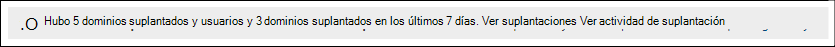

# Información de suplantación en Defender para Office 365

[!INCLUDE [Microsoft 365 Defender rebranding](../includes/microsoft-defender-for-office.md)]

**Se aplica a**
- [Plan 1 y Plan 2 de Microsoft Defender para Office 365](defender-for-office-365.md)
- [Microsoft 365 Defender](../defender/microsoft-365-defender.md)

> [!NOTE]
> Las características descritas en este artículo están en Versión preliminar, están sujetas a cambios y no están disponibles en todas las organizaciones.

La suplantación es donde el remitente de un mensaje de correo electrónico es muy similar a una dirección de correo electrónico del remitente real o esperada. Los atacantes suelen suplantar las direcciones de correo electrónico del remitente en la suplantación de identidad (phishing) u otros tipos de ataques en un esfuerzo por ganarse la confianza del destinatario. Básicamente hay dos tipos de suplantación:

- **Suplantación de dominio:** en lugar de lila@contoso.com, la dirección de correo electrónico del remitente suplantado es lila@ćóntoso.com.
- **Suplantación de usuario:** en lugar de michelle@contoso.com, la dirección de correo electrónico del remitente suplantado es rnichell@contoso.com.

La suplantación de dominio es diferente de la [suplantación](anti-spoofing-protection.md)de dominio, ya que el dominio suplantado suele ser un dominio real registrado. Los mensajes de remitentes en el dominio suplantado pueden y suelen pasar comprobaciones regulares de autenticación de correo electrónico que, de lo contrario, identificarían intentos de suplantación (SPF, DKIM y DMARC).

La protección de suplantación forma parte de la configuración de directiva contra suplantación de identidad que es exclusiva de Microsoft Defender para Office 365. Para obtener más información acerca de esta configuración, vea Configuración de suplantación en directivas contra suplantación en [Microsoft Defender para Office 365](set-up-anti-phishing-policies.md#impersonation-settings-in-anti-phishing-policies-in-microsoft-defender-for-office-365).

Puede usar la información de suplantación en el portal de Microsoft 365 Defender para identificar rápidamente los mensajes de remitentes suplantados o dominios de remitente que haya configurado para la protección de suplantación.

## ¿Qué necesita saber antes de comenzar?

- Abra el portal de Microsoft 365 Defender en <https://security.microsoft.com>. Para ir directamente a la información de suplantación en la **página Anti-phishing,** use <https://security.microsoft.com/antiphishing> . Para ir directamente a la **página Información de suplantación,** use <https://security.microsoft.com/impersonationinsight> .

- Debe tener asignados permisos en el portal de Microsoft 365 Defender para poder realizar los procedimientos descritos en este artículo:

  - **Administración de organizaciones**
  - **Administrador de seguridad**
  - **Lector de seguridad**
  - **Lector global**

  Para obtener más información, vea [Permissions in the Microsoft 365 Defender portal](permissions-in-the-security-and-compliance-center.md).

  **Nota:** Agregar usuarios al rol Azure Active Directory correspondiente en el Centro de administración de Microsoft 365 proporciona a los usuarios los permisos necesarios en el _portal_ de Microsoft 365 Defender y permisos para otras características de Microsoft 365. Para obtener más información, vea [Sobre los roles de administrador](../../admin/add-users/about-admin-roles.md).

- Habilitas y configuras la protección de suplantación en las directivas contra suplantación de identidad en Microsoft Defender para Office 365. La protección de suplantación no está habilitada de forma predeterminada. Para obtener más información, vea [Configure anti-phishing policies in Microsoft Defender for Office 365](configure-atp-anti-phishing-policies.md).

## Abra la información de suplantación en el portal de Microsoft 365 Defender identidad

1. En el portal Microsoft 365 Defender, vaya a Correo electrónico **&** directivas de colaboración & directivas de amenazas de reglas \>  \>  \>  sección \> **Anti-phishing**.

2. En la **página Anti-phishing,** la información de suplantación tiene este aspecto:

   

   La información tiene dos modos:

    - **Modo de** información: si la protección de suplantación está habilitada y configurada en cualquier directiva contra suplantación de identidad, la información muestra el número de mensajes detectados de dominios suplantados y usuarios suplantados (remitentes) en los últimos siete días. Este es el total de todos los remitentes suplantados detectados de todas las directivas contra suplantación de identidad.
    - **Modo** de suplantación: si la protección contra suplantación no está habilitada y configurada  en las directivas contra suplantación activas, la información muestra cuántos mensajes se habrían detectado mediante nuestras capacidades de protección de suplantación en los últimos siete días.

Para ver información sobre las detecciones de suplantación, haga clic en **Ver** suplantaciones en la información de suplantación.

   > [!NOTE]
   > Para obtener información acerca de la información de inteligencia suplantación, vea [Spoof intelligence insight in EOP](learn-about-spoof-intelligence.md).

## Ver información sobre mensajes de remitentes en dominios suplantados

En la **página Información de suplantación** que aparece después de hacer clic en  Ver suplantaciones en la información de suplantación, compruebe que la pestaña Dominios está seleccionada.  La **pestaña Dominios** contiene la siguiente información:

- **Dominio del remitente:** el dominio de suplantación, que es el dominio que se usó para enviar el mensaje de correo electrónico.
- **Recuento de mensajes:** el número de mensajes que han suplantado el dominio del remitente en los últimos 7 días.
- **Tipo de suplantación:** este valor muestra la ubicación detectada de la suplantación (por ejemplo, **Dominio en la dirección**).
- **Dominios** suplantados: el dominio suplantado, que debería parecerse mucho al dominio configurado para la protección de suplantación en la directiva contra suplantación.
- **Tipo de dominio:** este valor es **Dominio de empresa para** dominios internos o Dominio **personalizado** para dominios personalizados.
- **Directiva:** la directiva contra suplantación de identidad que detectó el dominio suplantado.
- **Permitido suplantar**: Uno de los siguientes valores:
  - **Sí:** el dominio se configuró como dominio de confianza (una excepción para la protección de suplantación) en la directiva contra suplantación de identidad. Se detectaron mensajes de remitentes en el dominio suplantado, pero permitidos.
  - **No:** el dominio se configuró para la protección de suplantación en la directiva contra suplantación de identidad. Los mensajes de remitentes en el dominio suplantado se detectaron y se actuaron en función de la acción para dominios suplantados en la directiva contra suplantación de identidad.

Puede hacer clic en los encabezados de columna seleccionados para ordenar los resultados.

Para filtrar los resultados, puede usar el cuadro Buscar icono de búsqueda para escribir una lista separada por comas de   resultados.

### Ver detalles sobre los mensajes de remitentes en dominios suplantados

En la **pestaña Dominios** de la página Información **de suplantación,** seleccione una de las detecciones de suplantación disponibles. El menú desplegable de detalles que aparece contiene la siguiente información y características:

- **Directiva de suplantación de selección para modificar:** Seleccione la directiva contra suplantación de identidad afectada que desea modificar. Solo están disponibles las directivas en las que se define el dominio suplantado en la directiva. Consulte la página anterior para ver qué directiva era realmente responsable de detectar el dominio suplantado (probablemente en función del destinatario y la prioridad de la directiva).
- **Agregar** a la lista de suplantación permitida: use esta alternancia para agregar o quitar el remitente de los dominios y **remitentes** de confianza (excepciones de suplantación) para la directiva contra suplantación de identidad que seleccionó:
  - Si el **valor Permitido para suplantar** esta entrada era **No**, la alternancia está desactivada. Para eximir a todos los remitentes de este dominio de la evaluación por protección de suplantación, deslice el botón de alternancia a on:  . El dominio se agrega a la **lista Dominios de** confianza en la configuración de protección de suplantación de la directiva contra suplantación de identidad.
  - Si el **valor Permitido para suplantar** esta entrada era **Sí**, la alternancia está activa. Para devolver todos los remitentes de este dominio a la evaluación mediante la protección de suplantación, deslice el botón de alternancia a desactivado:  . El dominio se quita de la **lista Dominios de** confianza en la configuración de protección de suplantación de la directiva contra suplantación de identidad.
- Por qué lo capturamos.
- Lo que necesita hacer.
- Un resumen de dominio que enumera el dominio suplantado.
- WhoIs datos sobre el remitente.
- Un vínculo para abrir el [Explorador de amenazas](threat-explorer.md) para ver detalles adicionales sobre el remitente.
- Mensajes similares del mismo remitente que se entregaron a la organización.

## Ver información sobre los mensajes de remitentes suplantados

En la **página Información de suplantación** que aparece después de hacer clic en Ver suplantaciones en la información de suplantación, haga clic en la **pestaña** Usuarios.  La **pestaña** Usuarios contiene la siguiente información:

- **Remitente:** la dirección de correo electrónico del remitente que suplantó el mensaje de correo electrónico.
- **Recuento de** mensajes: el número de mensajes del remitente que suplantó en los últimos 7 días.
- **Tipo de suplantación:** este valor **es Usuario en nombre para mostrar.**
- **Usuarios** suplantados: la dirección de correo electrónico del remitente suplantado, que debe parecerse mucho al usuario configurado para la protección de suplantación en la directiva contra suplantación.
- **Tipo de usuario:** este valor muestra el tipo de protección aplicada (por ejemplo, **Usuario protegido** o Inteligencia **de buzones).**
- **Directiva:** la directiva contra suplantación de identidad que detectó el remitente suplantado.
- **Permitido suplantar**: Uno de los siguientes valores:
  - **Sí:** el remitente se configuró como usuario de confianza (una excepción para la protección de suplantación) en la directiva contra suplantación de identidad. Se detectaron mensajes del remitente suplantado, pero permitidos.
  - **No:** el remitente se configuró para la protección de suplantación en la directiva contra suplantación de identidad. Los mensajes del remitente suplantado se detectaron y actuaron en función de la acción de los usuarios suplantados en la directiva contra suplantación de identidad.

Puede hacer clic en los encabezados de columna seleccionados para ordenar los resultados.

Para filtrar los resultados, puede usar el cuadro **Filtrar remitente** para escribir una lista separada por comas de valores para filtrar los resultados.

### Ver detalles sobre los mensajes de remitentes suplantados

En la **pestaña Usuarios** de la página Información **de suplantación,** seleccione una de las detecciones de suplantación disponibles. El menú desplegable de detalles que aparece contiene la siguiente información y características:

- **Directiva de suplantación de selección para modificar:** Seleccione la directiva contra suplantación de identidad afectada que desea modificar. Solo están disponibles las directivas en las que el remitente suplantado está definido en la directiva. Consulte la página anterior para ver qué directiva era realmente responsable de detectar el remitente suplantado (probablemente en función del destinatario y la prioridad de la directiva).
- **Agregar** a la lista de suplantación permitida: use esta alternancia para agregar o quitar el remitente de los dominios y **remitentes** de confianza (excepciones de suplantación) para la directiva contra suplantación de identidad que seleccionó:
  - Si el **valor Permitido para suplantar** esta entrada era **No**, la alternancia está desactivada. Para eximir al remitente de la evaluación mediante protección de suplantación, deslice la palanca para activar:  . El remitente se agrega a la **lista Usuarios de** confianza en la configuración de protección de suplantación de la directiva contra suplantación.
  - Si el **valor Permitido para suplantar** esta entrada era **Sí**, la alternancia está activa. Para devolver al remitente a la evaluación mediante la protección de suplantación, deslice la alternancia a desactivado:  . El remitente se quita de la **lista Usuarios de confianza** en la configuración de protección de suplantación de la directiva contra suplantación de identidad.
- Por qué lo capturamos.
- Lo que necesita hacer.
- Un resumen del remitente que enumera el remitente suplantado.
- WhoIs datos sobre el remitente.
- Un vínculo para abrir el [Explorador de amenazas](threat-explorer.md) para ver detalles adicionales sobre el remitente.
- Mensajes similares del mismo remitente que se entregaron a la organización.
