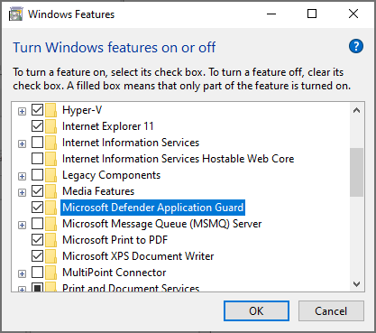
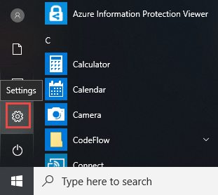
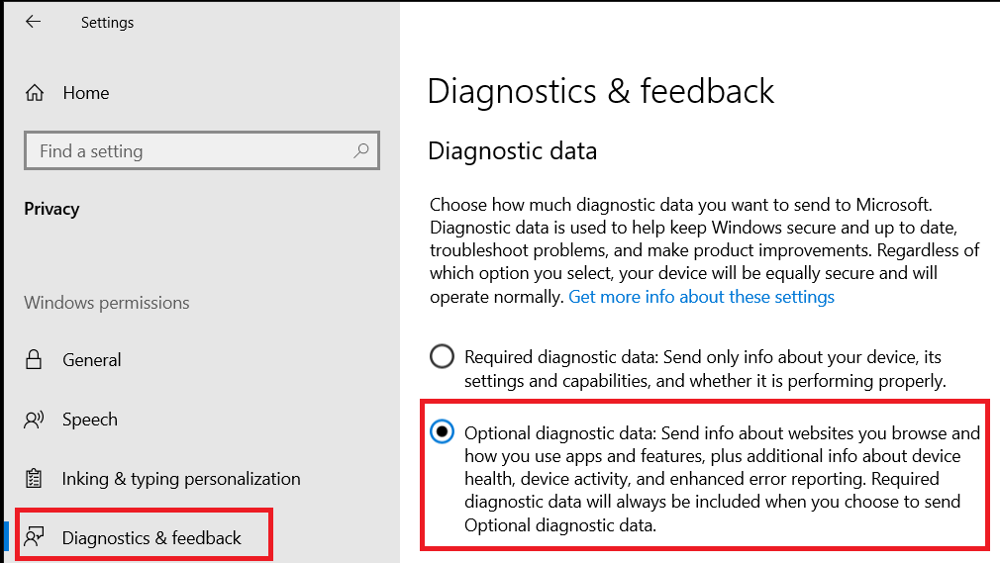
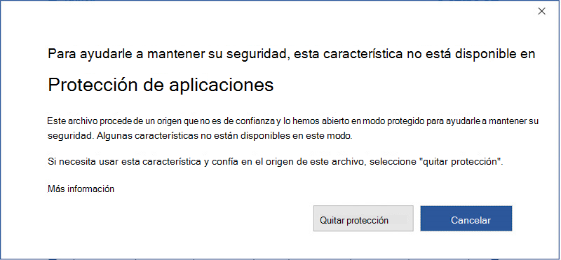

# <a name="application-guard-for-office-public-preview-for-admins"></a>Protección de aplicaciones para Office (vista previa pública) para administradores


**Se aplica a:** Word, Excel y PowerPoint para Microsoft 365, Windows 10 Enterprise

>[!IMPORTANT]
>Parte de la información se refiere a un producto previamente lanzado que se puede modificar de forma sustancial antes de su lanzamiento comercial. Microsoft makes no warranties, express or implied, with respect to the information provided here.


La protección de aplicaciones de Microsoft defender para Office (protección de aplicaciones para Office) ayuda a impedir que los archivos que no son de confianza tengan acceso a los recursos de confianza, manteniendo la empresa a salvo de nuevos ataques nuevos y emergentes. En este artículo se recorre a los administradores a través de la configuración de dispositivos para obtener una vista previa de protección de aplicaciones para Office. Proporciona información sobre los requisitos del sistema y los pasos de instalación para habilitar la protección de aplicaciones de Office en un dispositivo.

## <a name="prerequisites"></a>Requisitos previos

### <a name="minimum-hardware-requirements"></a>Requisitos mínimos de hardware

* **CPU**: 64 bits, 4 núcleos (físicos o virtuales), extensiones de virtualización (Intel VT-x o AMD-V), principales i5 equivalentes o superiores recomendados
* **Memoria física**: 8 GB de RAM
* **Disco duro**: 10 GB de espacio libre en la unidad del sistema (se recomienda SSD)

### <a name="minimum-software-requirements"></a>Requisitos mínimos de software

* **Windows 10**: Windows 10 Enterprise Edition, versión de compilación de cliente 2004 (20H1) compilación 19041
* **Office**: versión de compilación de canal de office beta 2008 16.0.13212 o posterior
* **Paquete de actualización**: actualizaciones de seguridad mensual acumuladas de Windows 10 [KB4571756](https://support.microsoft.com/help/4571756/windows-10-update-KB4571756) 

Para obtener información detallada sobre los requisitos del sistema, consulte [requisitos del sistema para la protección de aplicaciones de Microsoft defender](https://docs.microsoft.com/windows/security/threat-protection/microsoft-defender-application-guard/reqs-md-app-guard). Para obtener más información sobre las versiones de Office Insider Preview, consulte Introducción a la [implementación de las compilaciones de Office Insider](https://insider.office.com/business/deploy).

### <a name="licensing-requirements"></a>Requisitos de licencia
* Microsoft 365 E5 o Microsoft 365 E5 Security

## <a name="deploy-application-guard-for-office"></a>Implementar protección de aplicaciones para Office

### <a name="enable-application-guard-for-office"></a>Habilitar la protección de aplicaciones para Office

1.  Descargue e instale **las actualizaciones de seguridad mensuales acumulativas para Windows 10 KB4571756**. 

2.  Seleccione **protección de aplicaciones de Microsoft defender** en características de Windows y haga clic en **Aceptar**. Al habilitar la característica protección de aplicaciones, se solicitará el reinicio del sistema. Puede elegir reiniciar ahora o después del paso 3.

    
    
    La característica también se puede habilitar ejecutando el siguiente comando de PowerShell como administrador: 

    ```powershell
    Enable-WindowsOptionalFeature -online -FeatureName Windows-Defender-ApplicationGuard 
    ```

3.  Busque la protección de aplicaciones de Microsoft defender en modo administrado Directiva de grupo que se encuentra en **configuración del equipo \\ Administrative templates Administrative templates \\ Windows Components \\ Microsoft defender Application Guard**. Active esta directiva estableciendo el valor en opciones como **2** o **3** y, a continuación, seleccionando **Aceptar** o **aplicar**.

    
  
    Como alternativa, puede establecer la Directiva CSP correspondiente: 

    OMA-URI: **./Device/Vendor/msft/WindowsDefenderApplicationGuard/Settings/AllowWindowsDefenderApplicationGuard** 
    <br>Tipo de datos: **Integer** 
    <br>Valor: **2**


4.  Reinicie el sistema.

### <a name="set-diagnostics--feedback-to-send-full-data"></a>Establecer diagnóstico & comentarios para enviar datos completos

Este paso garantiza que los datos necesarios para identificar y solucionar los problemas estén llegando a Microsoft. Siga estos pasos para habilitar los diagnósticos en el dispositivo de Windows:

1.  Abra la **configuración** desde el menú Inicio.

    

2.  En **configuración de Windows**, seleccione **privacidad**.

    

3.  En privacidad, seleccione **diagnósticos & comentarios** y seleccione **datos de diagnóstico opcionales**.

    

Para obtener más información sobre la configuración de diagnóstico de Windows, consulte [Configuring Windows Diagnostic Data in your Organization](https://docs.microsoft.com/windows/privacy/configure-windows-diagnostic-data-in-your-organization#enterprise-management).

### <a name="confirm-that-application-guard-for-office-is-enabled-and-working"></a>Confirmar que la protección de aplicaciones para Office está habilitada y en funcionamiento

Antes de confirmar que la protección de aplicaciones para Office está habilitada, inicie Word, Excel o PowerPoint en un dispositivo en el que se hayan implementado las directivas. Asegúrese de que Office está activado. Es posible que deba usar su identidad de trabajo para activar el producto de Office en primer lugar.

Para confirmar que la protección de aplicaciones para Office está ahora habilitada, inicie Word, Excel o PowerPoint y abra un documento que no sea de confianza. Por ejemplo, puede abrir un documento descargado de Internet o un archivo adjunto de correo electrónico de alguien externo a su organización.

En el primer inicio de un archivo que no es de confianza, es posible que vea una pantalla de presentación de Office como la que se muestra a continuación. Es posible que se muestre durante algún tiempo mientras se activa la protección de aplicaciones para Office y se abre el archivo. Los lanzamientos posteriores de archivos que no sean de confianza deben ser más rápidos.


Después de abrirse, el archivo debería mostrar algunos indicadores visuales de que el archivo se abrió en la protección de aplicaciones de Office:

* Una llamada en la cinta

    
* El icono de la aplicación con un escudo en la barra de tareas 

    


## <a name="configure-application-guard-for-office"></a>Configurar la protección de aplicaciones para Office
Office admite las siguientes directivas que le permitirán configurar las capacidades de la protección de aplicaciones para Office. Estas directivas se pueden configurar a través de directivas de grupo o a través del servicio de directivas de nube de Office. 

>[!NOTE] 
> Estas directivas estarán disponibles próximamente.
>Además, la configuración de estas directivas puede deshabilitar algunas funcionalidades para los archivos abiertos en protección de aplicaciones para Office.

| Policy                                                                          | Descripción                                                                                                                                                                                                                                                                                             |
|---------------------------------------------------------------------------------|---------------------------------------------------------------------------------------------------------------------------------------------------------------------------------------------------------------------------------------------------------------------------------------------------------|
| Deshabilitar la protección de aplicaciones para Office                                            | Al habilitar esta Directiva, Word, Excel y PowerPoint usarán el contenedor de aislamiento de vista protegida en lugar de la protección de aplicaciones de Office. Esta Directiva se puede usar para deshabilitar temporalmente la protección de aplicaciones de Office cuando hay problemas para dejarla habilitada para el servidor perimetral.                                  |
| Deshabilitar la copia y pegado de los documentos abiertos en la protección de aplicaciones                    | Al habilitar esta Directiva, impedirá que un usuario copie y pegue contenido de un documento abierto en la protección de aplicaciones de Office a un documento abierto fuera de él.                                                                                                                                   |
| Impedir que los usuarios quiten la protección de protección de aplicaciones en archivos               | Al habilitar esta Directiva, se quitará la opción (en la experiencia de la aplicación de Office) para deshabilitar la protección de protección de aplicaciones o abrir un archivo fuera de la protección de aplicaciones. <br><br>**Nota:** Los usuarios aún pueden omitir esta directiva quitando manualmente la propiedad de marca de la web del archivo o moviendo un documento a una ubicación de confianza. |
| Restringir la impresión de los documentos abiertos en protección de aplicaciones                    | Al habilitar esta Directiva, se limitarán las impresoras que puede imprimir un usuario desde un archivo abierto en la protección de aplicaciones de Office. Por ejemplo, puede usar esta directiva para restringir que los usuarios solo puedan imprimir en PDF.                              |
| Desactivar el acceso a cámara y micrófono para los documentos abiertos en protección de aplicaciones | Al habilitar esta Directiva, se quitará el acceso de Office a la cámara y el micrófono dentro de la protección de aplicaciones de Office.                                                                                                                                                                                                     |
>[!NOTE] 
>Las siguientes directivas requerirán que el usuario cierre sesión y vuelva a iniciar sesión en Windows para que surtan efecto:
> 
> *  Deshabilitar la copia y pegado de los documentos abiertos en la protección de aplicaciones
>*  Restringir la impresión para los documentos abiertos en protección de aplicaciones
> *  Desactivar el acceso a cámara y micrófono a los documentos abiertos en protección de aplicaciones


## <a name="submit-feedback"></a>Enviar comentarios

### <a name="submit-feedback-via-feedback-hub"></a>Enviar comentarios mediante el centro de opiniones

Si encuentra algún problema al iniciar la protección de aplicaciones para Office, le recomendamos que envíe sus comentarios a través del centro de opiniones:

1.  Abra la **aplicación centro de comentarios** e inicie sesión.

2.  Si recibe un cuadro de diálogo de error mientras inicia la protección de aplicaciones, seleccione **informar a Microsoft** en el cuadro de diálogo de error para iniciar un nuevo envío de comentarios. De lo contrario, vaya a <https://aka.ms/wdagoffice-fb> para seleccionar la categoría correcta para la protección de aplicaciones y, a continuación, seleccione **+ Agregar comentarios nuevos** cerca de la parte superior derecha.

3.  Rellene el cuadro **resumir su comentarios** si todavía no está rellenado.

4.  Rellene el cuadro **explicar en más detalles** con una descripción detallada del problema que ha experimentado y los pasos que ha seguido y, a continuación, seleccione **siguiente**.

5.  Seleccione la burbuja junto a problema. Asegúrese de que la categoría seleccionada es **seguridad y privacidad \> Microsoft defender Application Guard – Office**y, a continuación, seleccione **siguiente**.

6.  Seleccione **comentarios nuevos**y, a continuación, **siguiente**.

7.  Recopile los seguimientos del problema:

    1. Expanda el icono **volver a crear mi problema** .

    2.  Si el problema se produce mientras se ejecuta la protección de aplicaciones, abra una instancia de protección de aplicaciones. Esto permite recopilar seguimientos adicionales desde el contenedor de protección de aplicaciones.

    3.  Seleccione **iniciar grabación** y espere a que el icono deje de girar y diga *Detener grabación*.

    4.  Reproduzca completamente el problema con la protección de aplicaciones. Esto puede incluir intentar iniciar una instancia de protección de aplicaciones y esperar a que se produzca un error, o reproducir un problema en una instancia de protección de aplicaciones en ejecución.

    5.  Seleccione el icono **Detener grabación** .

    6.  Mantenga abiertas las instancias de protección de aplicaciones en ejecución, incluso hasta unos minutos después de su envío, para que también se puedan recopilar los diagnósticos de los contenedores.

8.  Adjunte las capturas de pantallas relevantes o los archivos relacionados con el problema.

9.  Seleccione **Enviar**.


### <a name="submit-feedback-via-office-customer-voice"></a>Enviar comentarios a través de Office Customer Voice

También puede enviar comentarios desde Office si el problema se produce al abrir documentos de Office en la protección de aplicaciones. Consulte el [manual de Office Insider](https://insider.office.com/handbook) para enviar comentarios.

## <a name="integration-with-microsoft-defender-atp-and-office-atp"></a>Integración con ATP de Microsoft defender y Office ATP

La protección de aplicaciones para Office está integrada con la protección contra amenazas de avance de Microsoft defender (ATP) para proporcionar supervisión y alertas sobre actividades malintencionadas que ocurren en el entorno aislado.

Microsoft defender ATP es una plataforma de seguridad diseñada para ayudar a las redes empresariales a prevenir, detectar, investigar y responder a amenazas avanzadas. Para obtener más información sobre esta plataforma, visite la página de [protección contra amenazas avanzada de Microsoft defender](https://www.microsoft.com/microsoft-365/windows/microsoft-defender-atp) . Obtén más información sobre los dispositivos de incorporación a esta plataforma en [los dispositivos integrados en el servicio ATP de Microsoft defender](https://docs.microsoft.com/windows/security/threat-protection/microsoft-defender-atp/onboard-configure).

También puede configurar ATP de Office 365 para que funcione con ATP de Microsoft defender. Consulte [integrar Office 365 ATP con Microsoft defender ATP](https://docs.microsoft.com/microsoft-365/security/office-365-security/integrate-office-365-ti-with-wdatp?view=o365-worldwide).

## <a name="limitations-and-considerations"></a>Limitaciones y consideraciones

* La protección de aplicaciones para Office es un modo restringido que aísla a los documentos que no son de confianza el acceso a los recursos corporativos de confianza, la intranet, la identidad del usuario y los archivos arbitrarios presentes en el equipo. Como resultado, si un usuario intenta tener acceso a una característica que tiene una dependencia de ese acceso, por ejemplo, insertar una imagen desde un archivo local en el disco, se producirá un error y se producirá un mensaje similar al siguiente. Para permitir que un documento que no sea de confianza obtenga acceso a recursos de confianza, los usuarios deben quitar la protección de protección de aplicaciones del documento.

    

    >[!NOTE]    
    >Aconseje a los usuarios que solo quiten la protección si confían en el archivo y su origen o en dónde procede.

* El contenido activo de documentos, como las macros y los controles ActiveX, está deshabilitado en la protección de aplicaciones de Office. Los usuarios deben quitar la protección de protección de aplicaciones para habilitar el contenido activo.

* Archivos que no son de confianza abiertos desde recursos compartidos de red o archivos compartidos desde OneDrive, OneDrive para la empresa o SharePoint Online desde una organización diferente abierta como de solo lectura en la protección de aplicaciones. Los usuarios pueden guardar una copia local de estos archivos para seguir trabajando en el contenedor o quitar la protección para trabajar directamente con el archivo original.

* Los archivos que están protegidos por Information Rights Management (IRM) continúan abriéndose en la vista protegida.
* Las personalizaciones de las aplicaciones de Office en la protección de aplicaciones de Office no se conservarán después de que un usuario cierre sesión y vuelva a iniciarla o reinicie el dispositivo. 

* Solo las herramientas de accesibilidad que usan el marco de UIA pueden proporcionar una experiencia accesible para los archivos abiertos en protección de aplicaciones para Office.

* La conectividad de red es necesaria para el primer inicio de la protección de aplicaciones después de la instalación. Esto es necesario para que la protección de aplicaciones valide la licencia.
* En la sección información del documento, la *última propiedad modificada por* puede mostrar WDAGUtilityAccount como el usuario. Se trata del usuario anónimo configurado en la protección de aplicaciones, dado que la identidad del usuario de escritorio no se comparte dentro del contenedor de protección de aplicaciones. 

## <a name="performance-optimizations-for-application-guard"></a>Optimizaciones de rendimiento para protección de aplicaciones 

En esta sección se proporciona información general sobre las optimizaciones de rendimiento que se usan en la protección de aplicaciones de Office. Esta información puede ayudar a los administradores a diagnosticar informes de usuarios relacionados con el rendimiento de Office o el sistema general cuando está habilitada la protección de aplicaciones. 

La protección de aplicaciones usa un contenedor virtualizado para aislar los documentos que no son de confianza del sistema. El proceso de creación de un contenedor y la configuración del contenedor de protección de aplicaciones para abrir documentos de Office tiene una sobrecarga de rendimiento que podría afectar negativamente a la experiencia del usuario cuando los usuarios abren un documento que no es de confianza. 


Para proporcionar a los usuarios la experiencia de apertura de archivo esperada, la protección de aplicaciones usa la lógica para crear previamente un contenedor cuando se cumple la siguiente heurística en un sistema: un usuario ha abierto un archivo en la vista protegida o en la protección de aplicaciones en los últimos 28 días. 

Cuando se cumpla esta heurística, Office creará previamente un contenedor de protección de aplicaciones para el usuario después de que inicie sesión en Windows. Cuando se está realizando esta operación previa a la creación, es posible que el sistema experimente un rendimiento lento. Esto se resolverá tan pronto como finalice la operación. 


>[!NOTE] 
>Las aplicaciones de Office generan las sugerencias necesarias para la heurística utilizada previamente en la creación del contenedor a medida que un usuario las usa. Si un usuario instala Office en un nuevo sistema en el que está habilitada la protección de aplicaciones, Office no creará previamente el contenedor hasta después de que el usuario abra un documento que no sea de confianza en el sistema. El usuario observará que el primer archivo tarda más en abrirse en la protección de aplicaciones. 

## <a name="known-issues-in-preview"></a>Problemas conocidos en la versión preliminar

* Al hacer clic en los vínculos Web ( ```http``` o) no se ```https``` abre el explorador. 
* Las actualizaciones .NET provocan que los archivos no se abran en la protección de aplicaciones. Como solución alternativa, los usuarios pueden reiniciar el dispositivo cuando se produce este problema.
    Obtenga más información sobre el problema en la [recepción de un mensaje de error al intentar abrir la protección de aplicaciones de Windows Defender o el espacio aislado de Windows](https://support.microsoft.com/help/4575917/receiving-an-error-message-when-attempting-to-open-windows-defender-ap).
