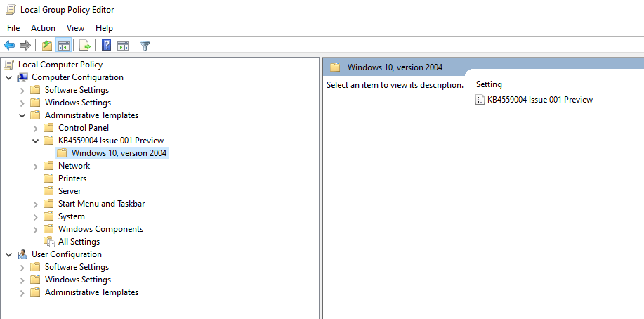

# <a name="application-guard-for-office-public-preview-for-admins"></a><span data-ttu-id="3f576-105">Protección de aplicaciones para Office (vista previa pública) para administradores</span><span class="sxs-lookup"><span data-stu-id="3f576-105">Application Guard for Office (public preview) for admins</span></span>


<span data-ttu-id="3f576-106">**Se aplica a:** Word, Excel y PowerPoint para Microsoft 365, Windows 10 Enterprise</span><span class="sxs-lookup"><span data-stu-id="3f576-106">**Applies to:** Word, Excel, and PowerPoint for Microsoft 365, Windows 10 Enterprise</span></span>

>[!IMPORTANT]
><span data-ttu-id="3f576-107">Parte de la información se refiere a un producto previamente lanzado que se puede modificar de forma sustancial antes de su lanzamiento comercial.</span><span class="sxs-lookup"><span data-stu-id="3f576-107">Some information relates to a prereleased product which may be substantially modified before it's commercially released.</span></span> <span data-ttu-id="3f576-108">Microsoft makes no warranties, express or implied, with respect to the information provided here.</span><span class="sxs-lookup"><span data-stu-id="3f576-108">Microsoft makes no warranties, express or implied, with respect to the information provided here.</span></span>


<span data-ttu-id="3f576-109">La protección de aplicaciones de Microsoft defender para Office (protección de aplicaciones para Office) ayuda a impedir que los archivos que no son de confianza tengan acceso a los recursos de confianza, manteniendo la empresa a salvo de nuevos ataques nuevos y emergentes.</span><span class="sxs-lookup"><span data-stu-id="3f576-109">Microsoft Defender Application Guard for Office (Application Guard for Office) helps prevent untrusted files from accessing trusted resources, keeping your enterprise safe from new and emerging attacks.</span></span> <span data-ttu-id="3f576-110">En este artículo se recorre a los administradores a través de la configuración de dispositivos para obtener una vista previa de protección de aplicaciones para Office.</span><span class="sxs-lookup"><span data-stu-id="3f576-110">This article walks admins through setting up devices for a preview of Application Guard for Office.</span></span> <span data-ttu-id="3f576-111">Proporciona información sobre los requisitos del sistema y los pasos de instalación para habilitar la protección de aplicaciones de Office en un dispositivo.</span><span class="sxs-lookup"><span data-stu-id="3f576-111">It provides information about system requirements and installation steps to enable Application Guard for Office on a device.</span></span>

## <a name="prerequisites"></a><span data-ttu-id="3f576-112">Requisitos previos</span><span class="sxs-lookup"><span data-stu-id="3f576-112">Prerequisites</span></span>

### <a name="minimum-hardware-requirements"></a><span data-ttu-id="3f576-113">Requisitos mínimos de hardware</span><span class="sxs-lookup"><span data-stu-id="3f576-113">Minimum hardware requirements</span></span>

* <span data-ttu-id="3f576-114">**CPU**: 64 bits, 4 núcleos (físicos o virtuales), extensiones de virtualización (Intel VT-x o AMD-V), principales i5 equivalentes o superiores recomendados</span><span class="sxs-lookup"><span data-stu-id="3f576-114">**CPU**: 64-bit, 4 cores (physical or virtual), virtualization extensions   (Intel VT-x OR AMD-V), Core i5 equivalent or higher recommended</span></span>
* <span data-ttu-id="3f576-115">**Memoria física**: 8 GB de RAM</span><span class="sxs-lookup"><span data-stu-id="3f576-115">**Physical memory**: 8-GB RAM</span></span>
* <span data-ttu-id="3f576-116">**Disco duro**: 10 GB de espacio libre en la unidad del sistema (se recomienda SSD)</span><span class="sxs-lookup"><span data-stu-id="3f576-116">**Hard disk**: 10 GB of free space on the system drive (SSD recommended)</span></span>

### <a name="minimum-software-requirements"></a><span data-ttu-id="3f576-117">Requisitos mínimos de software</span><span class="sxs-lookup"><span data-stu-id="3f576-117">Minimum software requirements</span></span>

* <span data-ttu-id="3f576-118">**Windows 10**: Windows 10 Enterprise Edition, versión de compilación de cliente 2004 (20H1) compilación 19041</span><span class="sxs-lookup"><span data-stu-id="3f576-118">**Windows 10**: Windows 10 Enterprise edition, Client Build version 2004 (20H1) build 19041</span></span>
* <span data-ttu-id="3f576-119">**Office**: versión de compilación de canal de office beta 2008 16.0.13212 o posterior</span><span class="sxs-lookup"><span data-stu-id="3f576-119">**Office**: Office Beta Channel Build version 2008 16.0.13212 or later</span></span>
* <span data-ttu-id="3f576-120">**Paquete de actualización**: actualizaciones de seguridad mensual acumuladas de Windows 10 [KB4566782](https://support.microsoft.com/help/4566782/windows-10-update-kb4566782)</span><span class="sxs-lookup"><span data-stu-id="3f576-120">**Update package**: Windows 10 cumulative monthly security updates [KB4566782](https://support.microsoft.com/help/4566782/windows-10-update-kb4566782)</span></span> 

<span data-ttu-id="3f576-121">Para obtener información detallada sobre los requisitos del sistema, consulte [requisitos del sistema para la protección de aplicaciones de Microsoft defender](https://docs.microsoft.com/windows/security/threat-protection/microsoft-defender-application-guard/reqs-md-app-guard).</span><span class="sxs-lookup"><span data-stu-id="3f576-121">For detailed system requirements, refer to [System requirements for Microsoft Defender Application Guard](https://docs.microsoft.com/windows/security/threat-protection/microsoft-defender-application-guard/reqs-md-app-guard).</span></span> <span data-ttu-id="3f576-122">Para obtener más información sobre las versiones de Office Insider Preview, consulte Introducción a la [implementación de las compilaciones de Office Insider](https://insider.office.com/business/deploy).</span><span class="sxs-lookup"><span data-stu-id="3f576-122">To learn more about Office Insider Preview builds, refer to [Getting started on deploying Office Insider builds](https://insider.office.com/business/deploy).</span></span>

### <a name="licensing-requirements"></a><span data-ttu-id="3f576-123">Requisitos de licencia</span><span class="sxs-lookup"><span data-stu-id="3f576-123">Licensing requirements</span></span>
* <span data-ttu-id="3f576-124">Microsoft 365 E5 o Microsoft 365 E5 Security</span><span class="sxs-lookup"><span data-stu-id="3f576-124">Microsoft 365 E5 or Microsoft 365 E5 Security</span></span>

## <a name="deploy-application-guard-for-office"></a><span data-ttu-id="3f576-125">Implementar protección de aplicaciones para Office</span><span class="sxs-lookup"><span data-stu-id="3f576-125">Deploy Application Guard for Office</span></span>

### <a name="enable-application-guard-for-office"></a><span data-ttu-id="3f576-126">Habilitar la protección de aplicaciones para Office</span><span class="sxs-lookup"><span data-stu-id="3f576-126">Enable Application Guard for Office</span></span>

1.  <span data-ttu-id="3f576-127">Descargue e instale **las actualizaciones de seguridad mensuales acumulativas para Windows 10 KB4566782**.</span><span class="sxs-lookup"><span data-stu-id="3f576-127">Download and install **Windows 10 cumulative monthly security updates KB4566782**.</span></span> 

2. <span data-ttu-id="3f576-128">Descargue e instale la [**protección de aplicaciones para el paquete de características habilitadas de Office**](https://download.microsoft.com/download/e/4/c/e4c1180a-fcff-462a-8324-4151c44973a8/Windows%20Preview%20-%20WDAG%20Office%20070920%2001.msi).</span><span class="sxs-lookup"><span data-stu-id="3f576-128">Download and install [**Application Guard for Office Feature enablement package**](https://download.microsoft.com/download/e/4/c/e4c1180a-fcff-462a-8324-4151c44973a8/Windows%20Preview%20-%20WDAG%20Office%20070920%2001.msi).</span></span> <span data-ttu-id="3f576-129">Este paquete instala una directiva de grupo denominada "KB4559004 Issue 001 Preview" en configuración del **equipo\Plantillas del equipo**.</span><span class="sxs-lookup"><span data-stu-id="3f576-129">This package installs a group policy called "KB4559004 Issue 001 Preview" under **Computer Configuration\Administrative Templates**.</span></span> <span data-ttu-id="3f576-130">Establezca esta directiva de grupo en **habilitado**.</span><span class="sxs-lookup"><span data-stu-id="3f576-130">Set this group policy  to **Enabled**.</span></span>
     <span data-ttu-id="3f576-131"></span><span class="sxs-lookup"><span data-stu-id="3f576-131"></span></span>

     

    <span data-ttu-id="3f576-133">También puede establecer directamente las siguientes claves del registro:</span><span class="sxs-lookup"><span data-stu-id="3f576-133">You can also directly set the following reg keys:</span></span> 
    
    ```
    reg add HKLM\SYSTEM\CurrentControlSet\Policies\Microsoft\FeatureManagement\Overrides /v 3457697930 /t REG_DWORD /d 1 
    ```
    ```
    reg add HKLM\SYSTEM\CurrentControlSet\Policies\Microsoft\FeatureManagement\Overrides /v 94539402 /t REG_DWORD /d 1 
    ```
    <span data-ttu-id="3f576-134">A continuación, ejecute este comando de PowerShell:</span><span class="sxs-lookup"><span data-stu-id="3f576-134">Then, run this PowerShell command:</span></span> 
    
    ```powershell
    Get-ScheduledTask -TaskName "ReconcileFeatures" -TaskPath "\Microsoft\Windows\Flighting\FeatureConfig\" | Start-ScheduledTask 
    ```

3.  <span data-ttu-id="3f576-135">Seleccione **protección de aplicaciones de Microsoft defender** en características de Windows y haga clic en **Aceptar**.</span><span class="sxs-lookup"><span data-stu-id="3f576-135">Select **Microsoft Defender Application Guard** under Windows Features and select **OK**.</span></span> <span data-ttu-id="3f576-136">Al habilitar la característica protección de aplicaciones, se solicitará el reinicio del sistema.</span><span class="sxs-lookup"><span data-stu-id="3f576-136">Enabling the Application Guard feature will prompt a system reboot.</span></span> <span data-ttu-id="3f576-137">Puede elegir reiniciar ahora o después del paso 4.</span><span class="sxs-lookup"><span data-stu-id="3f576-137">You can choose to reboot now or after step 4.</span></span>

    
    
    <span data-ttu-id="3f576-139">La característica también se puede habilitar ejecutando el siguiente comando de PowerShell como administrador:</span><span class="sxs-lookup"><span data-stu-id="3f576-139">The feature can also be enabled by running the following PowerShell command as administrator:</span></span> 

    ```powershell
    Enable-WindowsOptionalFeature -online -FeatureName Windows-Defender-ApplicationGuard 
    ```

4.  <span data-ttu-id="3f576-140">Busque la protección de aplicaciones de Microsoft defender en modo administrado Directiva de grupo que se encuentra en **configuración del equipo \\ Administrative templates Administrative templates \\ Windows Components \\ Microsoft defender Application Guard**.</span><span class="sxs-lookup"><span data-stu-id="3f576-140">Look for the Microsoft Defender Application Guard in Managed Mode group policy located at **Computer Configuration\\Administrative Templates\\Windows Components\\Microsoft Defender Application Guard**.</span></span> <span data-ttu-id="3f576-141">Active esta directiva estableciendo el valor en opciones como **2** o **3** y, a continuación, seleccionando **Aceptar** o **aplicar**.</span><span class="sxs-lookup"><span data-stu-id="3f576-141">Turn this policy on by setting the value under Options as **2** or **3** then selecting **OK** or **Apply**.</span></span>

    
  
    <span data-ttu-id="3f576-143">Como alternativa, puede establecer la Directiva CSP correspondiente:</span><span class="sxs-lookup"><span data-stu-id="3f576-143">Alternatively, you can set the corresponding CSP policy:</span></span> 

    <span data-ttu-id="3f576-144">OMA-URI: **./Device/Vendor/msft/WindowsDefenderApplicationGuard/Settings/AllowWindowsDefenderApplicationGuard** 
    </span><span class="sxs-lookup"><span data-stu-id="3f576-144">OMA-URI: **./Device/Vendor/MSFT/WindowsDefenderApplicationGuard/Settings/AllowWindowsDefenderApplicationGuard** 
    </span></span><br><span data-ttu-id="3f576-145">Tipo de datos: **Integer** 
</span><span class="sxs-lookup"><span data-stu-id="3f576-145">Data type: **Integer** 
</span></span><br><span data-ttu-id="3f576-146">Valor: **2**</span><span class="sxs-lookup"><span data-stu-id="3f576-146">Value: **2**</span></span>


5.  <span data-ttu-id="3f576-147">Reinicie el sistema.</span><span class="sxs-lookup"><span data-stu-id="3f576-147">Reboot the system.</span></span>

### <a name="set-diagnostics--feedback-to-send-full-data"></a><span data-ttu-id="3f576-148">Establecer diagnóstico & comentarios para enviar datos completos</span><span class="sxs-lookup"><span data-stu-id="3f576-148">Set Diagnostics & feedback to send full data</span></span>

<span data-ttu-id="3f576-149">Este paso garantiza que los datos necesarios para identificar y solucionar los problemas estén llegando a Microsoft.</span><span class="sxs-lookup"><span data-stu-id="3f576-149">This step ensures that the data necessary to identify and fix problems is reaching Microsoft.</span></span> <span data-ttu-id="3f576-150">Siga estos pasos para habilitar los diagnósticos en el dispositivo de Windows:</span><span class="sxs-lookup"><span data-stu-id="3f576-150">Follow these steps to enable diagnostics on your Windows device:</span></span>

1.  <span data-ttu-id="3f576-151">Abra la **configuración** desde el menú Inicio.</span><span class="sxs-lookup"><span data-stu-id="3f576-151">Open **Settings** from the Start menu.</span></span>

    

2.  <span data-ttu-id="3f576-153">En **configuración de Windows**, seleccione **privacidad**.</span><span class="sxs-lookup"><span data-stu-id="3f576-153">On **Windows Settings**, select **Privacy**.</span></span>

    

3.  <span data-ttu-id="3f576-155">En privacidad, seleccione **diagnósticos & comentarios** y seleccione **datos de diagnóstico opcionales**.</span><span class="sxs-lookup"><span data-stu-id="3f576-155">Under Privacy, select **Diagnostics & feedback** and select **Optional diagnostic data**.</span></span>

    

<span data-ttu-id="3f576-157">Para obtener más información sobre la configuración de diagnóstico de Windows, consulte [Configuring Windows Diagnostic Data in your Organization](https://docs.microsoft.com/windows/privacy/configure-windows-diagnostic-data-in-your-organization#enterprise-management).</span><span class="sxs-lookup"><span data-stu-id="3f576-157">For more on configuring Windows diagnostic settings, refer to [Configuring Windows diagnostic data in your organization](https://docs.microsoft.com/windows/privacy/configure-windows-diagnostic-data-in-your-organization#enterprise-management).</span></span>

### <a name="confirm-that-application-guard-for-office-is-enabled-and-working"></a><span data-ttu-id="3f576-158">Confirmar que la protección de aplicaciones para Office está habilitada y en funcionamiento</span><span class="sxs-lookup"><span data-stu-id="3f576-158">Confirm that Application Guard for Office is enabled and working</span></span>

<span data-ttu-id="3f576-159">Antes de confirmar que la protección de aplicaciones para Office está habilitada, inicie Word, Excel o PowerPoint en un dispositivo en el que se hayan implementado las directivas.</span><span class="sxs-lookup"><span data-stu-id="3f576-159">Before confirming that the Application Guard for Office is enabled, launch Word, Excel, or PowerPoint on a device where the policies have been deployed.</span></span> <span data-ttu-id="3f576-160">Asegúrese de que Office está activado.</span><span class="sxs-lookup"><span data-stu-id="3f576-160">Make sure Office is activated.</span></span> <span data-ttu-id="3f576-161">Es posible que deba usar su identidad de trabajo para activar el producto de Office en primer lugar.</span><span class="sxs-lookup"><span data-stu-id="3f576-161">You may need to use your work identity to activate the Office product first.</span></span>

<span data-ttu-id="3f576-162">Para confirmar que la protección de aplicaciones para Office está ahora habilitada, inicie Word, Excel o PowerPoint y abra un documento que no sea de confianza.</span><span class="sxs-lookup"><span data-stu-id="3f576-162">To confirm that Application Guard for Office is now enabled, launch Word, Excel, or PowerPoint and open an untrusted document.</span></span> <span data-ttu-id="3f576-163">Por ejemplo, puede abrir un documento descargado de Internet o un archivo adjunto de correo electrónico de alguien externo a su organización.</span><span class="sxs-lookup"><span data-stu-id="3f576-163">For example, you can open a document downloaded from the internet or an email attachment from someone outside your organization.</span></span>

<span data-ttu-id="3f576-164">En el primer inicio de un archivo que no es de confianza, es posible que vea una pantalla de presentación de Office como la que se muestra a continuación.</span><span class="sxs-lookup"><span data-stu-id="3f576-164">On the first launch of an untrusted file, you may see an Office splash screen like the one below.</span></span> <span data-ttu-id="3f576-165">Es posible que se muestre durante algún tiempo mientras se activa la protección de aplicaciones para Office y se abre el archivo.</span><span class="sxs-lookup"><span data-stu-id="3f576-165">It might show for some time while Application Guard for Office is being activated and the file is being opened.</span></span> <span data-ttu-id="3f576-166">Los lanzamientos posteriores de archivos que no sean de confianza deben ser más rápidos.</span><span class="sxs-lookup"><span data-stu-id="3f576-166">Subsequent launches of untrusted files should be faster.</span></span>


<span data-ttu-id="3f576-168">Después de abrirse, el archivo debería mostrar algunos indicadores visuales de que el archivo se abrió en la protección de aplicaciones de Office:</span><span class="sxs-lookup"><span data-stu-id="3f576-168">Upon being opened, the file should display a few visual indicators that the file was opened inside Application Guard for Office:</span></span>

* <span data-ttu-id="3f576-169">Una llamada en la cinta</span><span class="sxs-lookup"><span data-stu-id="3f576-169">A callout in the ribbon</span></span>

    
* <span data-ttu-id="3f576-171">El icono de la aplicación con un escudo en la barra de tareas</span><span class="sxs-lookup"><span data-stu-id="3f576-171">The application icon with a shield in the taskbar</span></span> 

    


## <a name="configure-application-guard-for-office"></a><span data-ttu-id="3f576-173">Configurar la protección de aplicaciones para Office</span><span class="sxs-lookup"><span data-stu-id="3f576-173">Configure Application Guard for Office</span></span>
<span data-ttu-id="3f576-174">Office admite las siguientes directivas que le permitirán configurar las capacidades de la protección de aplicaciones para Office.</span><span class="sxs-lookup"><span data-stu-id="3f576-174">Office supports the following policies to enable you to configure the capabilities of Application Guard for Office.</span></span> <span data-ttu-id="3f576-175">Estas directivas se pueden configurar a través de directivas de grupo o a través del servicio de directivas de nube de Office.</span><span class="sxs-lookup"><span data-stu-id="3f576-175">These policies can be configured through Group policies or through the Office cloud policy service.</span></span> 

>[!NOTE] 
> <span data-ttu-id="3f576-176">Estas directivas estarán disponibles próximamente.</span><span class="sxs-lookup"><span data-stu-id="3f576-176">These policies will become available soon.</span></span>
><span data-ttu-id="3f576-177">Además, la configuración de estas directivas puede deshabilitar algunas funcionalidades para los archivos abiertos en protección de aplicaciones para Office.</span><span class="sxs-lookup"><span data-stu-id="3f576-177">Also, configuring these policies can disable some functionalities for files opened in Application Guard for Office.</span></span>

| <span data-ttu-id="3f576-178">Policy</span><span class="sxs-lookup"><span data-stu-id="3f576-178">Policy</span></span>                                                                          | <span data-ttu-id="3f576-179">Description</span><span class="sxs-lookup"><span data-stu-id="3f576-179">Description</span></span>                                                                                                                                                                                                                                                                                             |
|---------------------------------------------------------------------------------|---------------------------------------------------------------------------------------------------------------------------------------------------------------------------------------------------------------------------------------------------------------------------------------------------------|
| <span data-ttu-id="3f576-180">Deshabilitar la protección de aplicaciones para Office</span><span class="sxs-lookup"><span data-stu-id="3f576-180">Disable Application Guard for Office</span></span>                                            | <span data-ttu-id="3f576-181">Al habilitar esta Directiva, Word, Excel y PowerPoint usarán el contenedor de aislamiento de vista protegida en lugar de la protección de aplicaciones de Office.</span><span class="sxs-lookup"><span data-stu-id="3f576-181">Enabling this policy will force Word, Excel, and PowerPoint to use the Protected View isolation container instead of Application Guard for Office.</span></span> <span data-ttu-id="3f576-182">Esta Directiva se puede usar para deshabilitar temporalmente la protección de aplicaciones de Office cuando hay problemas para dejarla habilitada para el servidor perimetral.</span><span class="sxs-lookup"><span data-stu-id="3f576-182">This policy can be used to temporarily disable Application Guard for Office when there are issues in leaving it enabled for Edge.</span></span>                                  |
| <span data-ttu-id="3f576-183">Deshabilitar la copia y pegado de los documentos abiertos en la protección de aplicaciones</span><span class="sxs-lookup"><span data-stu-id="3f576-183">Disable copy/paste for documents opened in Application Guard</span></span>                    | <span data-ttu-id="3f576-184">Al habilitar esta Directiva, impedirá que un usuario copie y pegue contenido de un documento abierto en la protección de aplicaciones de Office a un documento abierto fuera de él.</span><span class="sxs-lookup"><span data-stu-id="3f576-184">Enabling this policy will prevent a user from copying and pasting content from a document opened in Application Guard for Office to a document opened outside it.</span></span>                                                                                                                                   |
| <span data-ttu-id="3f576-185">Impedir que los usuarios quiten la protección de protección de aplicaciones en archivos</span><span class="sxs-lookup"><span data-stu-id="3f576-185">Prevent users from removing Application Guard protection on files</span></span>               | <span data-ttu-id="3f576-186">Al habilitar esta Directiva, se quitará la opción (en la experiencia de la aplicación de Office) para deshabilitar la protección de protección de aplicaciones o abrir un archivo fuera de la protección de aplicaciones.</span><span class="sxs-lookup"><span data-stu-id="3f576-186">Enabling this policy will remove the option (within the Office application experience) to disable Application Guard protection or open a file outside Application Guard.</span></span> <br><br><span data-ttu-id="3f576-187">**Nota:** Los usuarios aún pueden omitir esta directiva quitando manualmente la propiedad de marca de la web del archivo o moviendo un documento a una ubicación de confianza.</span><span class="sxs-lookup"><span data-stu-id="3f576-187">**Note:** Users can still bypass this policy by manually removing the mark-of-the-web property from the file or by moving a document to a Trusted location.</span></span> |
| <span data-ttu-id="3f576-188">Restringir la impresión de los documentos abiertos en protección de aplicaciones</span><span class="sxs-lookup"><span data-stu-id="3f576-188">Restrict printing from documents opened in Application Guard</span></span>                    | <span data-ttu-id="3f576-189">Al habilitar esta Directiva, se limitarán las impresoras que puede imprimir un usuario desde un archivo abierto en la protección de aplicaciones de Office.</span><span class="sxs-lookup"><span data-stu-id="3f576-189">Enabling this policy will limit printers a user can print to from a file opened in Application Guard for Office.</span></span> <span data-ttu-id="3f576-190">Por ejemplo, puede usar esta directiva para restringir que los usuarios solo puedan imprimir en PDF.</span><span class="sxs-lookup"><span data-stu-id="3f576-190">For example, you can use this policy to restrict users to only print to PDF.</span></span>                              |
| <span data-ttu-id="3f576-191">Desactivar el acceso a cámara y micrófono para los documentos abiertos en protección de aplicaciones</span><span class="sxs-lookup"><span data-stu-id="3f576-191">Turn off camera and microphone access for documents opened in Application Guard</span></span> | <span data-ttu-id="3f576-192">Al habilitar esta Directiva, se quitará el acceso de Office a la cámara y el micrófono dentro de la protección de aplicaciones de Office.</span><span class="sxs-lookup"><span data-stu-id="3f576-192">Enabling this policy will remove Office access to Camera and Microphone inside Application Guard for Office.</span></span>                                                                                                                                                                                                     |
>[!NOTE] 
><span data-ttu-id="3f576-193">Las siguientes directivas requerirán que el usuario cierre sesión y vuelva a iniciar sesión en Windows para que surtan efecto:</span><span class="sxs-lookup"><span data-stu-id="3f576-193">The following policies will require the user to log off and re-login to Windows to take effect:</span></span>
> 
> *  <span data-ttu-id="3f576-194">Deshabilitar la copia y pegado de los documentos abiertos en la protección de aplicaciones</span><span class="sxs-lookup"><span data-stu-id="3f576-194">Disable copy/paste for documents opened in Application Guard</span></span>
>*  <span data-ttu-id="3f576-195">Restringir la impresión para los documentos abiertos en protección de aplicaciones</span><span class="sxs-lookup"><span data-stu-id="3f576-195">Restrict printing for documents opened in Application Guard</span></span>
> *  <span data-ttu-id="3f576-196">Desactivar el acceso a cámara y micrófono a los documentos abiertos en protección de aplicaciones</span><span class="sxs-lookup"><span data-stu-id="3f576-196">Turn off camera and mic access to documents opened in Application Guard</span></span>


## <a name="submit-feedback"></a><span data-ttu-id="3f576-197">Enviar comentarios</span><span class="sxs-lookup"><span data-stu-id="3f576-197">Submit feedback</span></span>

### <a name="submit-feedback-via-feedback-hub"></a><span data-ttu-id="3f576-198">Enviar comentarios mediante el centro de opiniones</span><span class="sxs-lookup"><span data-stu-id="3f576-198">Submit feedback via Feedback Hub</span></span>

<span data-ttu-id="3f576-199">Si encuentra algún problema al iniciar la protección de aplicaciones para Office, le recomendamos que envíe sus comentarios a través del centro de opiniones:</span><span class="sxs-lookup"><span data-stu-id="3f576-199">If you encounter any issues when launching Application Guard for Office, you are encouraged to submit your feedback via Feedback Hub:</span></span>

1.  <span data-ttu-id="3f576-200">Abra la **aplicación centro de comentarios** e inicie sesión.</span><span class="sxs-lookup"><span data-stu-id="3f576-200">Open the **Feedback Hub app** and sign in.</span></span>

2.  <span data-ttu-id="3f576-201">Si recibe un cuadro de diálogo de error mientras inicia la protección de aplicaciones, seleccione **informar a Microsoft** en el cuadro de diálogo de error para iniciar un nuevo envío de comentarios.</span><span class="sxs-lookup"><span data-stu-id="3f576-201">If you get an error dialog while launching Application Guard, select **Report to Microsoft** in the error dialog to start a new feedback submission.</span></span> <span data-ttu-id="3f576-202">De lo contrario, vaya a <https://aka.ms/wdagoffice-fb> para seleccionar la categoría correcta para la protección de aplicaciones y, a continuación, seleccione **+ Agregar comentarios nuevos** cerca de la parte superior derecha.</span><span class="sxs-lookup"><span data-stu-id="3f576-202">Otherwise, navigate to <https://aka.ms/wdagoffice-fb> to select the correct category for Application Guard, then select **+ Add new feedback** near the top right.</span></span>

3.  <span data-ttu-id="3f576-203">Rellene el cuadro **resumir su comentarios** si todavía no está rellenado.</span><span class="sxs-lookup"><span data-stu-id="3f576-203">Fill in the **Summarize your feedback** box if it isn’t already filled in for you.</span></span>

4.  <span data-ttu-id="3f576-204">Rellene el cuadro **explicar en más detalles** con una descripción detallada del problema que ha experimentado y los pasos que ha seguido y, a continuación, seleccione **siguiente**.</span><span class="sxs-lookup"><span data-stu-id="3f576-204">Fill in the **Explain in more detail** box with a detailed description of the issue you experienced and what steps you took, then select **Next**.</span></span>

5.  <span data-ttu-id="3f576-205">Seleccione la burbuja junto a problema.</span><span class="sxs-lookup"><span data-stu-id="3f576-205">Select the bubble next to Problem.</span></span> <span data-ttu-id="3f576-206">Asegúrese de que la categoría seleccionada es **seguridad y privacidad \> Microsoft defender Application Guard – Office**y, a continuación, seleccione **siguiente**.</span><span class="sxs-lookup"><span data-stu-id="3f576-206">Make sure the category selected is **Security and Privacy \> Microsoft Defender Application Guard – Office**, then select **Next**.</span></span>

6.  <span data-ttu-id="3f576-207">Seleccione **comentarios nuevos**y, a continuación, **siguiente**.</span><span class="sxs-lookup"><span data-stu-id="3f576-207">Select **New feedback**, then **Next**.</span></span>

7.  <span data-ttu-id="3f576-208">Recopile los seguimientos del problema:</span><span class="sxs-lookup"><span data-stu-id="3f576-208">Collect traces about the issue:</span></span>

    1. <span data-ttu-id="3f576-209">Expanda el icono **volver a crear mi problema** .</span><span class="sxs-lookup"><span data-stu-id="3f576-209">Expand the **Recreate my problem** tile.</span></span>

    2.  <span data-ttu-id="3f576-210">Si el problema se produce mientras se ejecuta la protección de aplicaciones, abra una instancia de protección de aplicaciones.</span><span class="sxs-lookup"><span data-stu-id="3f576-210">If the issue you’re experiencing occurs while Application Guard is running, open an Application Guard instance.</span></span> <span data-ttu-id="3f576-211">Esto permite recopilar seguimientos adicionales desde el contenedor de protección de aplicaciones.</span><span class="sxs-lookup"><span data-stu-id="3f576-211">Doing this allows additional traces to be collected from within the Application Guard container.</span></span>

    3.  <span data-ttu-id="3f576-212">Seleccione **iniciar grabación** y espere a que el icono deje de girar y diga *Detener grabación*.</span><span class="sxs-lookup"><span data-stu-id="3f576-212">Select **Start recording** and wait for the tile to stop spinning and say *Stop recording*.</span></span>

    4.  <span data-ttu-id="3f576-213">Reproduzca completamente el problema con la protección de aplicaciones.</span><span class="sxs-lookup"><span data-stu-id="3f576-213">Fully reproduce the issue with Application Guard.</span></span> <span data-ttu-id="3f576-214">Esto puede incluir intentar iniciar una instancia de protección de aplicaciones y esperar a que se produzca un error, o reproducir un problema en una instancia de protección de aplicaciones en ejecución.</span><span class="sxs-lookup"><span data-stu-id="3f576-214">This might include attempting to launch an Application Guard instance and waiting until it fails, or reproducing an issue in a running Application Guard instance.</span></span>

    5.  <span data-ttu-id="3f576-215">Seleccione el icono **Detener grabación** .</span><span class="sxs-lookup"><span data-stu-id="3f576-215">Select the **Stop recording** tile.</span></span>

    6.  <span data-ttu-id="3f576-216">Mantenga abiertas las instancias de protección de aplicaciones en ejecución, incluso hasta unos minutos después de su envío, para que también se puedan recopilar los diagnósticos de los contenedores.</span><span class="sxs-lookup"><span data-stu-id="3f576-216">Keep any running Application Guard instance/s open, even until a few minutes after submission, so that container diagnostics can also be collected.</span></span>

8.  <span data-ttu-id="3f576-217">Adjunte las capturas de pantallas relevantes o los archivos relacionados con el problema.</span><span class="sxs-lookup"><span data-stu-id="3f576-217">Attach any relevant screenshots or files related to the problem.</span></span>

9.  <span data-ttu-id="3f576-218">Seleccione **Enviar**.</span><span class="sxs-lookup"><span data-stu-id="3f576-218">Select **Submit**.</span></span>


### <a name="submit-feedback-via-office-customer-voice"></a><span data-ttu-id="3f576-219">Enviar comentarios a través de Office Customer Voice</span><span class="sxs-lookup"><span data-stu-id="3f576-219">Submit feedback via Office Customer Voice</span></span>

<span data-ttu-id="3f576-220">También puede enviar comentarios desde Office si el problema se produce al abrir documentos de Office en la protección de aplicaciones.</span><span class="sxs-lookup"><span data-stu-id="3f576-220">You may also submit feedback from within Office if the issue happens when Office documents are opened in Application Guard.</span></span> <span data-ttu-id="3f576-221">Consulte el [manual de Office Insider](https://insider.office.com/handbook) para enviar comentarios.</span><span class="sxs-lookup"><span data-stu-id="3f576-221">Refer to the [Office Insider Handbook](https://insider.office.com/handbook) for submitting feedback.</span></span>

## <a name="integration-with-microsoft-defender-atp-and-office-atp"></a><span data-ttu-id="3f576-222">Integración con ATP de Microsoft defender y Office ATP</span><span class="sxs-lookup"><span data-stu-id="3f576-222">Integration with Microsoft Defender ATP and Office ATP</span></span>

<span data-ttu-id="3f576-223">La protección de aplicaciones para Office está integrada con la protección contra amenazas de avance de Microsoft defender (ATP) para proporcionar supervisión y alertas sobre actividades malintencionadas que ocurren en el entorno aislado.</span><span class="sxs-lookup"><span data-stu-id="3f576-223">Application Guard for Office is integrated with Microsoft Defender Advance Threat Protection (ATP) to provide monitoring and alerting on malicious activity happening in the isolated environment.</span></span>

<span data-ttu-id="3f576-224">Microsoft defender ATP es una plataforma de seguridad diseñada para ayudar a las redes empresariales a prevenir, detectar, investigar y responder a amenazas avanzadas.</span><span class="sxs-lookup"><span data-stu-id="3f576-224">Microsoft Defender ATP is a security platform designed to help enterprise networks prevent, detect, investigate, and respond to advanced threats.</span></span> <span data-ttu-id="3f576-225">Para obtener más información sobre esta plataforma, visite la página de [protección contra amenazas avanzada de Microsoft defender](https://www.microsoft.com/microsoft-365/windows/microsoft-defender-atp) .</span><span class="sxs-lookup"><span data-stu-id="3f576-225">For more details about this platform, visit the [Microsoft Defender Advanced Threat Protection](https://www.microsoft.com/microsoft-365/windows/microsoft-defender-atp) page.</span></span> <span data-ttu-id="3f576-226">Obtén más información sobre los dispositivos de incorporación a esta plataforma en [los dispositivos integrados en el servicio ATP de Microsoft defender](https://docs.microsoft.com/windows/security/threat-protection/microsoft-defender-atp/onboard-configure).</span><span class="sxs-lookup"><span data-stu-id="3f576-226">Learn more about onboarding devices to this platform at [Onboard devices to the Microsoft Defender ATP service](https://docs.microsoft.com/windows/security/threat-protection/microsoft-defender-atp/onboard-configure).</span></span>

<span data-ttu-id="3f576-227">También puede configurar ATP de Office 365 para que funcione con ATP de Microsoft defender.</span><span class="sxs-lookup"><span data-stu-id="3f576-227">You can also configure Office 365 ATP to work with Microsoft Defender ATP.</span></span> <span data-ttu-id="3f576-228">Consulte [integrar Office 365 ATP con Microsoft defender ATP](https://docs.microsoft.com/microsoft-365/security/office-365-security/integrate-office-365-ti-with-wdatp?view=o365-worldwide).</span><span class="sxs-lookup"><span data-stu-id="3f576-228">Refer to [Integrate Office 365 ATP with Microsoft Defender ATP](https://docs.microsoft.com/microsoft-365/security/office-365-security/integrate-office-365-ti-with-wdatp?view=o365-worldwide).</span></span>

## <a name="limitations-and-considerations"></a><span data-ttu-id="3f576-229">Limitaciones y consideraciones</span><span class="sxs-lookup"><span data-stu-id="3f576-229">Limitations and considerations</span></span>

* <span data-ttu-id="3f576-230">La protección de aplicaciones para Office es un modo restringido que aísla a los documentos que no son de confianza el acceso a los recursos corporativos de confianza, la intranet, la identidad del usuario y los archivos arbitrarios presentes en el equipo.</span><span class="sxs-lookup"><span data-stu-id="3f576-230">Application Guard for Office is a restricted mode that isolates untrusted documents from accessing trusted corporate resources, intranet, the user's identity, and arbitrary files present on the computer.</span></span> <span data-ttu-id="3f576-231">Como resultado, si un usuario intenta tener acceso a una característica que tiene una dependencia de ese acceso, por ejemplo, insertar una imagen desde un archivo local en el disco, se producirá un error y se producirá un mensaje similar al siguiente.</span><span class="sxs-lookup"><span data-stu-id="3f576-231">As a result, if a user tries to access a feature that has a dependency on such access, for example, inserting a picture from a local file on disk, it will fail and produce a prompt like the one below.</span></span> <span data-ttu-id="3f576-232">Para permitir que un documento que no sea de confianza obtenga acceso a recursos de confianza, los usuarios deben quitar la protección de protección de aplicaciones del documento.</span><span class="sxs-lookup"><span data-stu-id="3f576-232">To enable an untrusted document to access trusted resources, users must remove Application Guard protection from the document.</span></span>

    

    >[!NOTE]    
    ><span data-ttu-id="3f576-234">Aconseje a los usuarios que solo quiten la protección si confían en el archivo y su origen o en dónde procede.</span><span class="sxs-lookup"><span data-stu-id="3f576-234">Advise users to only remove protection if they trust the file and its source or where it came from.</span></span>

* <span data-ttu-id="3f576-235">El contenido activo de documentos, como las macros y los controles ActiveX, está deshabilitado en la protección de aplicaciones de Office.</span><span class="sxs-lookup"><span data-stu-id="3f576-235">Active content in documents like macros and ActiveX controls are disabled in Application Guard for Office.</span></span> <span data-ttu-id="3f576-236">Los usuarios deben quitar la protección de protección de aplicaciones para habilitar el contenido activo.</span><span class="sxs-lookup"><span data-stu-id="3f576-236">Users need to remove Application Guard protection to enable active content.</span></span>

* <span data-ttu-id="3f576-237">Archivos que no son de confianza abiertos desde recursos compartidos de red o archivos compartidos desde OneDrive, OneDrive para la empresa o SharePoint Online desde una organización diferente abierta como de solo lectura en la protección de aplicaciones.</span><span class="sxs-lookup"><span data-stu-id="3f576-237">Untrusted files opened from network shares or files shared from OneDrive, OneDrive for Business, or SharePoint Online from a different organization open as read-only in Application Guard.</span></span> <span data-ttu-id="3f576-238">Los usuarios pueden guardar una copia local de estos archivos para seguir trabajando en el contenedor o quitar la protección para trabajar directamente con el archivo original.</span><span class="sxs-lookup"><span data-stu-id="3f576-238">Users can save a local copy of such files to continue working in the container or remove protection to directly work with the original file.</span></span>

* <span data-ttu-id="3f576-239">Los archivos que están protegidos por Information Rights Management (IRM) continúan abriéndose en la vista protegida.</span><span class="sxs-lookup"><span data-stu-id="3f576-239">Files that are protected by Information Rights Management (IRM) continue to   open in Protected View.</span></span>
* <span data-ttu-id="3f576-240">Las personalizaciones de las aplicaciones de Office en la protección de aplicaciones de Office no se conservarán después de que un usuario cierre sesión y vuelva a iniciarla o reinicie el dispositivo.</span><span class="sxs-lookup"><span data-stu-id="3f576-240">Any customizations to Office applications in Application Guard for Office will not persist after a user logs off and logs back in or reboots the device.</span></span> 

* <span data-ttu-id="3f576-241">Solo las herramientas de accesibilidad que usan el marco de UIA pueden proporcionar una experiencia accesible para los archivos abiertos en protección de aplicaciones para Office.</span><span class="sxs-lookup"><span data-stu-id="3f576-241">Only Accessibility tools that use the UIA framework can provide an accessible experience for files opened in Application Guard for Office.</span></span>

* <span data-ttu-id="3f576-242">La conectividad de red es necesaria para el primer inicio de la protección de aplicaciones después de la instalación.</span><span class="sxs-lookup"><span data-stu-id="3f576-242">Network connectivity is required for the first launch of Application Guard after installation.</span></span> <span data-ttu-id="3f576-243">Esto es necesario para que la protección de aplicaciones valide la licencia.</span><span class="sxs-lookup"><span data-stu-id="3f576-243">This is required for Application Guard to validate the license.</span></span>
* <span data-ttu-id="3f576-244">En la sección información del documento, la *última propiedad modificada por* puede mostrar WDAGUtilityAccount como el usuario.</span><span class="sxs-lookup"><span data-stu-id="3f576-244">In the document's info section, the *Last Modified By* property may display WDAGUtilityAccount as the user.</span></span> <span data-ttu-id="3f576-245">Se trata del usuario anónimo configurado en la protección de aplicaciones, dado que la identidad del usuario de escritorio no se comparte dentro del contenedor de protección de aplicaciones.</span><span class="sxs-lookup"><span data-stu-id="3f576-245">This is the anonymous user configured in Application Guard given that the desktop user's identity is not shared inside the Application Guard container.</span></span> 

## <a name="performance-optimizations-for-application-guard"></a><span data-ttu-id="3f576-246">Optimizaciones de rendimiento para protección de aplicaciones</span><span class="sxs-lookup"><span data-stu-id="3f576-246">Performance optimizations for Application Guard</span></span> 

<span data-ttu-id="3f576-247">En esta sección se proporciona información general sobre las optimizaciones de rendimiento que se usan en la protección de aplicaciones de Office.</span><span class="sxs-lookup"><span data-stu-id="3f576-247">This section provides an overview of the performance optimizations used in Application Guard for Office.</span></span> <span data-ttu-id="3f576-248">Esta información puede ayudar a los administradores a diagnosticar informes de usuarios relacionados con el rendimiento de Office o el sistema general cuando está habilitada la protección de aplicaciones.</span><span class="sxs-lookup"><span data-stu-id="3f576-248">This information can help administrators diagnose reports from users related to the performance of Office or the overall system when Application Guard is enabled.</span></span> 

<span data-ttu-id="3f576-249">La protección de aplicaciones usa un contenedor virtualizado para aislar los documentos que no son de confianza del sistema.</span><span class="sxs-lookup"><span data-stu-id="3f576-249">Application Guard uses a virtualized container to isolate untrusted documents away from the system.</span></span> <span data-ttu-id="3f576-250">El proceso de creación de un contenedor y la configuración del contenedor de protección de aplicaciones para abrir documentos de Office tiene una sobrecarga de rendimiento que podría afectar negativamente a la experiencia del usuario cuando los usuarios abren un documento que no es de confianza.</span><span class="sxs-lookup"><span data-stu-id="3f576-250">The process of creating a container and setting up the Application Guard container to open Office documents has a performance overhead that might negatively impact user experience when users open an  untrusted document.</span></span> 


<span data-ttu-id="3f576-251">Para proporcionar a los usuarios la experiencia de apertura de archivo esperada, la protección de aplicaciones usa la lógica para crear previamente un contenedor cuando se cumple la siguiente heurística en un sistema: un usuario ha abierto un archivo en la vista protegida o en la protección de aplicaciones en los últimos 28 días.</span><span class="sxs-lookup"><span data-stu-id="3f576-251">To provide users with the expected file opening experience, Application Guard uses logic to pre-create a container when the following heuristic is met on a system: A user has opened a file in either Protected View or Application Guard in the past 28 days.</span></span> 

<span data-ttu-id="3f576-252">Cuando se cumpla esta heurística, Office creará previamente un contenedor de protección de aplicaciones para el usuario después de que inicie sesión en Windows.</span><span class="sxs-lookup"><span data-stu-id="3f576-252">When this heuristic is met, Office will pre-create an Application Guard container for the user after they log in to Windows.</span></span> <span data-ttu-id="3f576-253">Cuando se está realizando esta operación previa a la creación, es posible que el sistema experimente un rendimiento lento.</span><span class="sxs-lookup"><span data-stu-id="3f576-253">When this pre-create operation is in progress, the system may experience slow performance.</span></span> <span data-ttu-id="3f576-254">Esto se resolverá tan pronto como finalice la operación.</span><span class="sxs-lookup"><span data-stu-id="3f576-254">This will resolve as soon as the operation completes.</span></span> 


>[!NOTE] 
><span data-ttu-id="3f576-255">Las aplicaciones de Office generan las sugerencias necesarias para la heurística utilizada previamente en la creación del contenedor a medida que un usuario las usa.</span><span class="sxs-lookup"><span data-stu-id="3f576-255">The hints needed for the heuristic used to pre-create the container are generated by Office applications as a user uses them.</span></span> <span data-ttu-id="3f576-256">Si un usuario instala Office en un nuevo sistema en el que está habilitada la protección de aplicaciones, Office no creará previamente el contenedor hasta después de que el usuario abra un documento que no sea de confianza en el sistema.</span><span class="sxs-lookup"><span data-stu-id="3f576-256">If a user installs Office on a new system where Application Guard is enabled, Office will not pre-create the container until after the first time a user opens an untrusted document on the system.</span></span> <span data-ttu-id="3f576-257">El usuario observará que el primer archivo tarda más en abrirse en la protección de aplicaciones.</span><span class="sxs-lookup"><span data-stu-id="3f576-257">The user will observe that this first file takes longer to open in Application Guard.</span></span> 

## <a name="known-issues-in-preview"></a><span data-ttu-id="3f576-258">Problemas conocidos en la versión preliminar</span><span class="sxs-lookup"><span data-stu-id="3f576-258">Known issues in preview</span></span>

* <span data-ttu-id="3f576-259">Al hacer clic en los vínculos Web ( ```http``` o) no se ```https``` abre el explorador.</span><span class="sxs-lookup"><span data-stu-id="3f576-259">Clicking on web links (```http``` or ```https```) does not open the browser.</span></span> 
* <span data-ttu-id="3f576-260">Las actualizaciones .NET provocan que los archivos no se abran en la protección de aplicaciones.</span><span class="sxs-lookup"><span data-stu-id="3f576-260">.NET updates cause files to fail to open in Application Guard.</span></span> <span data-ttu-id="3f576-261">Como solución alternativa, los usuarios pueden reiniciar el dispositivo cuando se produce este problema.</span><span class="sxs-lookup"><span data-stu-id="3f576-261">As a workaround, users can reboot their device when this issue is encountered.</span></span>
    <span data-ttu-id="3f576-262">Obtenga más información sobre el problema en la [recepción de un mensaje de error al intentar abrir la protección de aplicaciones de Windows Defender o el espacio aislado de Windows](https://support.microsoft.com/help/4575917/receiving-an-error-message-when-attempting-to-open-windows-defender-ap).</span><span class="sxs-lookup"><span data-stu-id="3f576-262">Learn more about the issue at [Receiving an error message when attempting to open Windows Defender Application Guard or Windows Sandbox](https://support.microsoft.com/help/4575917/receiving-an-error-message-when-attempting-to-open-windows-defender-ap).</span></span>
