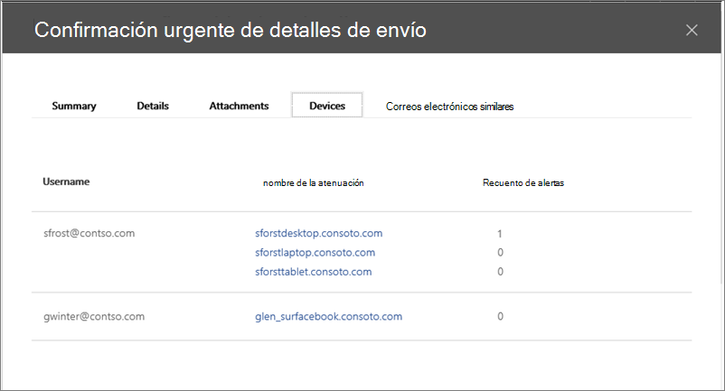

# Usar Microsoft Defender para Office 365 junto con Microsoft Defender para endpoint

[!INCLUDE [Microsoft 365 Defender rebranding](../includes/microsoft-defender-for-office.md)]

[Microsoft Defender para Office 365](defender-for-office-365.md) puede configurarse para funcionar con [Microsoft Defender para endpoint](/windows/security/threat-protection).

La integración de Microsoft Defender para Office 365 con Microsoft Defender para endpoint puede ayudar a su equipo de operaciones de seguridad a supervisar y tomar medidas rápidamente si los dispositivos de los usuarios están en riesgo. Por ejemplo, una vez habilitada la integración, el equipo de operaciones de seguridad podrá ver los dispositivos potencialmente afectados por un mensaje de correo electrónico detectado, así como cuántas alertas recientes se generaron para esos dispositivos en Microsoft Defender para endpoint.

En la siguiente imagen se muestra el aspecto **de** la pestaña Dispositivos cuando se habilita la integración de Microsoft Defender para endpoints:

En este ejemplo, puede ver que los destinatarios del mensaje de correo electrónico detectado tienen cuatro dispositivos y uno tiene una alerta. Al hacer clic en el vínculo de un dispositivo, se abre su página en el Centro de seguridad de Microsoft Defender ( <https://securitycenter.windows.com> ).

> [!TIP]
> **[Obtenga más información sobre el Centro de seguridad de Microsoft Defender](/windows/security/threat-protection/microsoft-defender-atp/use)** (también conocido como portal de Microsoft Defender para endpoints).

## Requisitos

- Su organización debe tener Microsoft Defender para Office 365 (o Office 365 E5) y Microsoft Defender para endpoint.

- Debe ser un administrador global o tener asignado un rol de administrador de seguridad (como administrador de seguridad) en el Centro de [seguridad & cumplimiento](https://protection.office.com). (Vea [Permisos en el Centro de seguridad & cumplimiento](permissions-in-the-security-and-compliance-center.md))

- Debe tener acceso a explorer (o detecciones en tiempo [real)](threat-explorer.md) en el Centro de seguridad & cumplimiento y el Centro de seguridad de Microsoft Defender.

## Para integrar Microsoft Defender para Office 365 con Microsoft Defender para endpoint

La integración de Microsoft Defender para Office 365 con Microsoft Defender para endpoint se configura mediante el Centro de seguridad & cumplimiento y el Centro de seguridad de Microsoft Defender.

1. Como administrador global o administrador de seguridad, vaya a <https://protection.office.com> e inicie sesión. (Esto le lleva al Centro de Office 365 seguridad & cumplimiento).

2. En el panel de navegación, elija **Explorador de administración de** \> **amenazas**.

   

3. En la esquina superior derecha de la pantalla, elija **Defender para Endpoint Configuración (MDE Configuración).**

4. En el cuadro de diálogo Conexión de Microsoft Defender para endpoint, active **Conectar a Microsoft Defender para Endpoint**.

   

5. Vaya al Centro de seguridad de Microsoft Defender ( <https://securitycenter.windows.com> ).

6. En la barra de navegación, **elija Configuración**. A continuación, **en General**, elija **Características avanzadas**.

7. Desplácese hacia abajo **hasta Office 365 de inteligencia** de amenazas y active la conexión.

   

## Artículos relacionados

[Capacidades de investigación y respuesta de amenazas en Office 365](office-365-ti.md)

[Microsoft Defender para Office 365](defender-for-office-365.md)

[Microsoft Defender para punto de conexión](/windows/security/threat-protection)