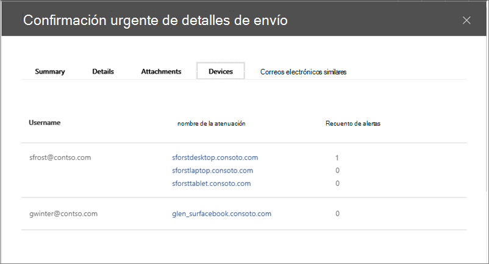
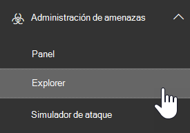
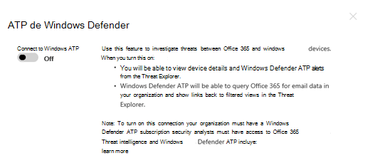
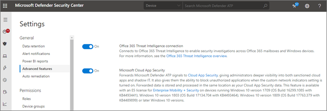

# Usar Microsoft defender para Office 365 junto con la protección contra amenazas avanzada de Microsoft defender

[!INCLUDE [Microsoft 365 Defender rebranding](../includes/microsoft-defender-for-office.md)]

[Microsoft defender para Office 365](https://docs.microsoft.com/microsoft-365/security/office-365-security/office-365-atp?view=o365-worldwide) se puede configurar para que funcione con [Microsoft defender para el punto de conexión](https://docs.microsoft.com/windows/security/threat-protection).

La integración de Microsoft defender para Office 365 con Microsoft defender para el punto de conexión puede ayudar a su equipo de operaciones de seguridad a supervisar y emprender acciones rápidamente si los dispositivos de los usuarios están expuestos. Por ejemplo, una vez habilitada la integración, el equipo de operaciones de seguridad podrá ver los dispositivos potencialmente afectados por un mensaje de correo electrónico detectado, así como el número de alertas recientes que se generaron para esos dispositivos en Microsoft defender para el punto de conexión. 

En la siguiente imagen se muestra el aspecto de la ficha **dispositivos** que tiene habilitada la integración de Microsoft defender para extremo:
  

  
En este ejemplo, puede ver que los destinatarios del mensaje de correo electrónico detectado tienen cuatro dispositivos y uno de ellos tiene una alerta. Al hacer clic en el vínculo de un dispositivo, se abre su página en el centro de seguridad de Microsoft defender ( [https://securitycenter.windows.com](https://securitycenter.windows.com) ).

> [!TIP]
> **[Obtenga más información sobre el centro de seguridad de Microsoft defender](https://docs.microsoft.com/windows/security/threat-protection/microsoft-defender-atp/use)** (también conocido como el portal ATP de Microsoft defender).
  
## Requisitos

- Su organización debe tener Microsoft defender para Office 365 (o Office 365 E5) y Microsoft defender para extremo.
    
- Debe ser administrador global o tener un rol de administrador de seguridad (como administrador de seguridad) asignado en el [centro de seguridad y &amp; cumplimiento](https://protection.office.com). (Consulte [permisos en el centro de seguridad y &amp; cumplimiento](permissions-in-the-security-and-compliance-center.md))
    
- Debe tener acceso a [exploradores (o detecciones en tiempo real)](threat-explorer.md) en el centro de seguridad & cumplimiento y el centro de seguridad de Microsoft defender.
    
## Para integrar Microsoft defender para Office 365 con Microsoft defender para el punto de conexión

La integración de Microsoft defender para Office 365 con Microsoft defender para el punto de conexión se configura mediante el centro de seguridad & cumplimiento y el centro de seguridad de Microsoft defender.
  
1. Como administrador global o administrador de seguridad, vaya a [https://protection.office.com](https://protection.office.com) e inicie sesión. (Esto le llevará al centro de cumplimiento de & de seguridad de Office 365).
    
2. En el panel de navegación, elija **Threat Management**  >  **Explorer**.  
    
3. En la esquina superior derecha de la pantalla, elija **WDATP de configuración**.
    
4. En el cuadro de diálogo Microsoft defender para conexión de extremo, Active **conectarse a ATP de Windows**.  
    
5. Vaya al centro de seguridad de Microsoft defender ( [https://securitycenter.windows.com](https://securitycenter.windows.com) ).

6. En la barra de navegación, elija **configuración**. A continuación, en **General**, elija **características avanzadas**.

7. Desplácese hacia abajo hasta **conexión de inteligencia de amenazas de 365 de Office**y active la conexión.  

## Artículos relacionados

[Capacidades de investigación y respuesta de amenazas en Office 365](office-365-ti.md)
  
[Microsoft defender para Office 365](office-365-atp.md)
  
[Microsoft defender para extremo](https://docs.microsoft.com/windows/security/threat-protection)
