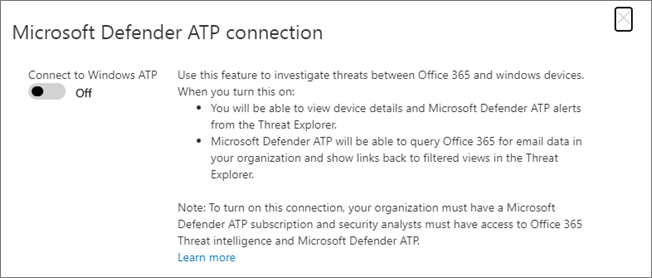

# Usar Microsoft Defender para Office 365 junto con Microsoft Defender para endpointUse Microsoft Defender for Office 365 together with Microsoft Defender for Endpoint

[!INCLUDE [Microsoft 365 Defender rebranding](../includes/microsoft-defender-for-office.md)]

[Microsoft Defender para Office 365](office-365-atp.md) se puede configurar para trabajar con [Microsoft Defender para Endpoint.](https://docs.microsoft.com/windows/security/threat-protection)[Microsoft Defender for Office 365](office-365-atp.md) can be configured to work with [Microsoft Defender for Endpoint](https://docs.microsoft.com/windows/security/threat-protection).

La integración de Microsoft Defender para Office 365 con Microsoft Defender para endpoint puede ayudar a su equipo de operaciones de seguridad a supervisar y tomar medidas rápidamente si los dispositivos de los usuarios están en riesgo.Integrating Microsoft Defender for Office 365 with Microsoft Defender for Endpoint can help your security operations team monitor and take action quickly if users' devices are at risk. Por ejemplo, una vez habilitada la integración, el equipo de operaciones de seguridad podrá ver los dispositivos potencialmente afectados por un mensaje de correo electrónico detectado, así como cuántas alertas recientes se generaron para esos dispositivos en Microsoft Defender para Endpoint.For example, once integration is enabled, your security operations team will be able to see the devices that are potentially affected by a detected email message, as well as how many recent alerts were generated for those devices in Microsoft Defender for Endpoint.

En la siguiente imagen se muestra el aspecto **que** tiene la pestaña Dispositivos para habilitar la integración de Microsoft Defender para puntos de conexión:The following image depicts what the **Devices** tab looks like have Microsoft Defender for Endpoint integration enabled:

En este ejemplo, puede ver que los destinatarios del mensaje de correo electrónico detectado tienen cuatro dispositivos y uno tiene una alerta.In this example, you can see that the recipients of the detected email message have four devices and one has an alert. Al hacer clic en el vínculo de un dispositivo, se abre su página en el Centro de seguridad de Microsoft Defender ( <https://securitycenter.windows.com> ).Clicking the link for a device opens its page in the Microsoft Defender Security Center (<https://securitycenter.windows.com>).

> [!TIP]
> **[Obtenga más información sobre el Centro de seguridad de Microsoft Defender](https://docs.microsoft.com/windows/security/threat-protection/microsoft-defender-atp/use)** (también conocido como portal de Microsoft Defender para puntos de conexión).**[Learn more about the Microsoft Defender Security Center](https://docs.microsoft.com/windows/security/threat-protection/microsoft-defender-atp/use)** (also referred to as the Microsoft Defender for Endpoint portal.)

## RequisitosRequirements

- Su organización debe tener Microsoft Defender para Office 365 (u Office 365 E5) y Microsoft Defender para Endpoint.Your organization must have Microsoft Defender for Office 365 (or Office 365 E5) and Microsoft Defender for Endpoint.

- Debe ser administrador global o tener un rol de administrador de seguridad (como administrador de seguridad) asignado en el Centro de [& cumplimiento.](https://protection.office.com)You must be a global administrator or have a security administrator role (such as Security Administrator) assigned in the [Security & Compliance Center](https://protection.office.com). (Vea [Permisos en el Centro de seguridad & cumplimiento)](permissions-in-the-security-and-compliance-center.md)(See [Permissions in the Security & Compliance Center](permissions-in-the-security-and-compliance-center.md))

- Debe tener acceso tanto al [Explorador (como a](threat-explorer.md) las detecciones en tiempo real) en el Centro de seguridad & cumplimiento y en el Centro de seguridad de Microsoft Defender.You must have access to both [Explorer (or real-time detections)](threat-explorer.md) in the Security & Compliance Center and the Microsoft Defender Security Center.

## Para integrar Microsoft Defender para Office 365 con Microsoft Defender para endpointTo integrate Microsoft Defender for Office 365 with Microsoft Defender for Endpoint

La integración de Microsoft Defender para Office 365 con Microsoft Defender para endpoint se configura mediante el Centro de seguridad & Cumplimiento y el Centro de seguridad de Microsoft Defender.Integrating Microsoft Defender for Office 365 with Microsoft Defender for Endpoint is set up by using both the Security & Compliance Center AND the Microsoft Defender Security Center.

1. Como administrador global o administrador de seguridad, vaya e <https://protection.office.com> inicie sesión.As a global administrator or a security administrator, go to <https://protection.office.com> and sign in. (Esto le lleva al Centro de seguridad y & de Office 365).(This takes you to the Office 365 Security & Compliance Center.)

2. En el panel de navegación, elija **Explorador de administración de** \> **amenazas.**In the navigation pane, choose **Threat management** \> **Explorer**.

   

3. En la esquina superior derecha de la pantalla, elija Defender para configuración de extremo **(configuración MDE).**In the upper right corner of the screen, choose **Defender for Endpoint Settings (MDE Settings)**.

4. En el cuadro de diálogo conexión de Microsoft Defender para puntos de conexión, active **Conectar a Microsoft Defender para Endpoint.**In the Microsoft Defender for Endpoint connection dialog box, turn on **Connect to Microsoft Defender for Endpoint**.

   

5. Vaya al Centro de seguridad de Microsoft Defender ( <https://securitycenter.windows.com> ).Go to the Microsoft Defender Security Center (<https://securitycenter.windows.com>).

6. En la barra de navegación, elija **Configuración.**In the navigation bar, choose **Settings**. A continuación, en **General,** elija **Características avanzadas.**Then, under **General**, choose **Advanced features**.

7. Desplácese hacia abajo hasta la conexión de inteligencia de amenazas de **Office 365** y active la conexión.Scroll down to **Office 365 Threat Intelligence connection**, and turn the connection on.

   

## Artículos relacionadosRelated articles

[Capacidades de investigación y respuesta de amenazas en Office 365Threat investigation and response capabilities in Office 365](office-365-ti.md)

[Microsoft Defender para Office 365Microsoft Defender for Office 365](office-365-atp.md)

[Microsoft Defender para punto de conexiónMicrosoft Defender for Endpoint](https://docs.microsoft.com/windows/security/threat-protection)
