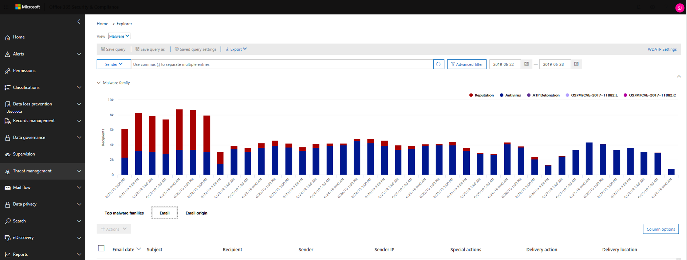
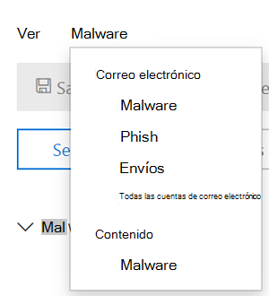
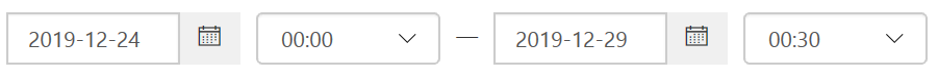

# Investigue el correo electrónico malintencionado que se entregó en Office 365

La [protección contra amenazas avanzada de Office 365](office-365-atp.md) le permite investigar las actividades que ponen en riesgo a las personas de su organización y emprender acciones para proteger a su organización. Por ejemplo, si forma parte del equipo de seguridad de su organización, puede encontrar e investigar los mensajes de correo electrónico sospechosos que se entregaron. Para ello, puede usar el [Explorador de amenazas (o detecciones en tiempo real)](threat-explorer.md).

> [!NOTE]
> Ir al artículo de corrección [aquí](remediate-malicious-email-delivered-office-365.md).

## Antes de empezar

Asegúrese de que se cumplen los siguientes requisitos:

- Su organización tiene [Office 365 de protección contra amenazas avanzada](office-365-atp.md) y [se asignan licencias a los usuarios](../../admin/manage/assign-licenses-to-users.md).

- el [registro de auditoría](../../compliance/turn-audit-log-search-on-or-off.md) está activado para su organización.

- Su organización tiene directivas definidas para protección contra correo electrónico no deseado, antimalware, antiphishing, etc. Consulte [proteger contra amenazas en Office 365](protect-against-threats.md).

- Es un administrador global o bien tiene el rol de administrador de seguridad o de la búsqueda y depuración asignado en el centro de seguridad y &amp; cumplimiento. Consulte [permisos en el centro de seguridad y &amp; cumplimiento](permissions-in-the-security-and-compliance-center.md). Para algunas acciones, también debe tener asignado un nuevo rol de vista previa.

### Vista previa de permisos de roles

Para llevar a cabo determinadas acciones, como ver los encabezados de mensajes o descargar el contenido de los mensajes de correo electrónico, debe tener un nuevo rol denominado *vista previa* agregado a otro grupo de funciones apropiado. La siguiente tabla clarifica los permisos y las funciones necesarias.

****

|Actividad|Grupo de funciones|¿Se requiere un rol de vista previa?|
|---|---|---|
|Usar el explorador de amenazas (y detecciones en tiempo real) para analizar las amenazas |Administrador global   Administrador de seguridad   Lector de seguridad|No|
|Usar el explorador de amenazas (y detecciones en tiempo real) para ver los encabezados de los mensajes de correo electrónico, así como para obtener una vista previa y descargar los mensajes de correo electrónico en cuarentena|Administrador global   Administrador de seguridad  Lector de seguridad|No|
|Usar el explorador de amenazas para ver los encabezados y descargar los mensajes de correo electrónico que se entregan a los buzones|Administrador global  Administrador de seguridad   Lector de seguridad   Preview|Sí|
|

> [!NOTE]
> La *vista previa* es un rol y no un grupo de roles; el rol de vista previa debe agregarse a un grupo de roles existente para Office 365. La función de administrador global se asigna al centro de administración de Microsoft 365 ( [https://admin.microsoft.com](https://admin.microsoft.com) ) y el administrador de seguridad y los roles de lector de seguridad se asignan en el centro de seguridad & cumplimiento ( [https://protection.office.com](https://protection.office.com) ). Para obtener más información acerca de los roles y los permisos, consulte [Permissions in the Security & Compliance Center](permissions-in-the-security-and-compliance-center.md).

## Buscar correo electrónico sospechoso entregado

El explorador de amenazas es un informe eficaz que puede servir para varios propósitos, como buscar y eliminar mensajes, identificar la dirección IP de un remitente de correo electrónico malintencionado o iniciar un incidente para una mayor investigación. El siguiente procedimiento se centra en usar el explorador para buscar y eliminar correo electrónico malintencionado de los buzones de los destinatarios.

> [!NOTE]
> Las búsquedas predeterminadas en el explorador no incluyen elementos zapped en este momento.  Esto se aplica a todas las vistas, por ejemplo, las vistas de malware o phish. Para incluir elementos de zapped, debe agregar una "acción de entrega" establecida en incluir "eliminado por ZAP". Si incluye todas las opciones, verá todos los resultados de las acciones de entrega, incluidos los elementos zapped.

1. **Vaya a Threat Explorer**: vaya a [https://protection.office.com](https://protection.office.com) e inicie sesión con su cuenta profesional o educativa para Office 365. Esto le llevará al centro de seguridad y &amp; cumplimiento.

2. En el inicio rápido de navegación izquierdo, elija **Threat Management** \> **Explorer**.

    

    Es posible que observe la nueva columna **acciones especiales** . Esta característica está destinada a comunicar a los administradores el resultado del procesamiento de un correo electrónico. Se puede tener acceso a la columna **acciones especiales** en el mismo lugar que la **acción de entrega** y la **Ubicación de entrega**. Las acciones especiales podrían actualizarse al final de la escala de tiempo de correo electrónico del explorador de amenazas, que es una nueva característica destinada a mejorar la experiencia de búsqueda para los administradores.

3. **Vistas en el explorador de amenazas**: en el menú **Ver** , elija **todo el correo electrónico**.

    

    La vista de *malware* es actualmente la predeterminada y captura mensajes de correo electrónico donde se detecta una amenaza de malware. La vista *phish* funciona de la misma manera, para phish.

    Sin embargo, en todas las vistas de *correo electrónico* se muestra cada correo recibido por la organización, independientemente de si se han detectado o no amenazas. Como puede imaginar, esta es una gran cantidad de datos, por lo que esta vista muestra un marcador de posición que le pide que se aplique un filtro. (Esta vista solo está disponible para los clientes P2 de ATP).

    La vista *envíos* muestra todos los correos enviados por el administrador o el usuario que se notificaron a Microsoft.

4. **Buscar y filtrar en el explorador de amenazas**: los filtros aparecen en la parte superior de la página en la barra de búsqueda para ayudar a los administradores en sus investigaciones. Tenga en cuenta que se pueden aplicar varios filtros a la vez y que se agregan varios valores separados por comas a un filtro para acotar la búsqueda. Recuerde:

    - Los filtros realizan una coincidencia exacta en la mayoría de las condiciones de filtrado.
    - El filtro de asunto usa una consulta Contains.
    - Los filtros de dirección URL funcionan con o sin protocolos (p. ej. https).
    - El dominio de dirección URL, la ruta de dirección URL y los filtros de dominio y ruta de acceso de dirección URL no requieren un protocolo para filtrar.
    - Debe hacer clic en el icono actualizar cada vez que cambie los valores de filtro para obtener resultados relevantes.

5. **Filtros avanzados**: con estos filtros, puede crear consultas complejas y filtrar el conjunto de datos. Al hacer clic en *filtros avanzados* , se abre un control flotante con opciones.

   El filtrado avanzado es una gran adición a las capacidades de búsqueda. Se ha agregado un valor booleano **no** Filter en el *destinatario*, el *remitente* y el *dominio del remitente* para permitir que los administradores investiguen mediante la exclusión de valores. Esta opción aparece en el parámetro Selection no *contiene ninguno de*. **No** permitirá que los administradores excluyan los buzones de correo de alertas, los buzones de respuesta predeterminados de sus investigaciones y resulte útil para los casos en los que los administradores buscan un asunto específico (Subject = "Attention") donde el destinatario se puede establecer en *ninguno de defaultMail \@ contoso.com*. Se trata de una búsqueda de valor exacta.

   

   *Filtrar por horas* ayudará a que el equipo de seguridad de su organización se despliega rápidamente. La duración de tiempo más corta permitida es de 30 minutos. Si puede restringir la acción sospechosa por período de tiempo (por ejemplo, ha pasado hace 3 horas), esto limitará el contexto y determinará con precisión el problema.

   

6. **Campos en el explorador de amenazas**: el explorador de amenazas expone mucha más información de correo relacionada con la seguridad, como la *acción de entrega*, la *Ubicación de entrega*, la *acción especial*, la *direccionalidad*, las *invalidaciones*y la *amenaza de URL*. También permite que el equipo de seguridad de su organización investigue con una mayor certeza.

    La *acción de entrega* es la acción que se realiza en un correo electrónico debido a las directivas o detecciones existentes. Estas son las posibles acciones que puede realizar un correo electrónico:

    - **Delivered** : el correo electrónico se entregó a la bandeja de entrada o a la carpeta de un usuario y el usuario puede acceder a él directamente.
    - Correo electrónico **no deseado** (entregado a correo no deseado): el correo electrónico se envió a la carpeta de correo no deseado o a la carpeta eliminada del usuario y el usuario tiene acceso a los mensajes de correo electrónico en su carpeta de correo no deseado o eliminado.
    - **Bloqueado** : todos los mensajes de correo electrónico que se hayan puesto en cuarentena, que hayan fallado o que se hayan quitado. (El usuario no tiene acceso completamente a esto).
    - **Reemplazado** : todos los correos electrónicos en los que los datos adjuntos malintencionados se reemplazan por archivos. txt que indican que el archivo adjunto era malintencionado

    **Ubicación de entrega**: el filtro de ubicación de entrega está disponible para ayudar a los administradores a comprender dónde se ha finalizado el correo malintencionado sospechoso y qué acciones se han realizado en él. Los datos resultantes se pueden exportar a la hoja de cálculo. Las ubicaciones de entrega posibles son:

    - **Bandeja de entrada o carpeta** : el correo electrónico está en la bandeja de entrada o en una carpeta específica, de acuerdo con las reglas de correo electrónico.
    - Local **o externa** : el buzón de correo no existe en la nube, pero es local.
    - **Carpeta de correo no deseado** : el correo electrónico se encuentra en la carpeta de correo no deseado de un usuario.
    - **Carpeta elementos eliminados** : el correo electrónico se encuentra en la carpeta elementos eliminados del usuario.
    - **Cuarentena** : el correo electrónico que se encuentra en cuarentena y no en el buzón de un usuario.
    - **Failed** – el correo electrónico no pudo llegar al buzón.
    - **Perdido: el** correo electrónico se perdió en algún lugar del flujo de correo.

    **Direccionalidad**: esta opción permite al equipo de operaciones de seguridad filtrar por la ' dirección ' a la que procede un correo o se dirige. Los valores de direccionalción son *entrante*, *saliente*e interno de la *organización* (correspondiente al correo que entra en su organización desde fuera, se envía fuera de su organización o se envía internamente a su organización, respectivamente). Esta información puede ayudar a los equipos de operaciones de seguridad a entanar la suplantación y la suplantación, ya que no coinciden entre el valor de la direccionalidad (por ejemplo, *Entrante*) y el dominio del remitente (que *parece* ser un dominio interno) será evidente. El valor de direccionalidad es independiente y puede ser diferente del seguimiento de mensajes. Los resultados se pueden exportar a la hoja de cálculo.

    **Invalidaciones**: este filtro recibe información que aparece en la ficha de detalles del correo y la usa para exponer dónde se han *invalidado*las directivas de usuario o de la organización, así como para permitir y bloquear el bloqueo de correo. Lo más importante de este filtro es que ayuda al equipo de seguridad de su organización a ver cuántos correos electrónicos sospechosos se han entregado debido a la configuración. Esto les da la oportunidad de modificar los bloques de permitidos y los bloques según sea necesario. Este conjunto de resultados de este filtro se puede exportar a hoja de cálculo.

    ****

    |Invalidaciones del explorador de amenazas|Significado|
    |---|---|
    |Permitido por la Directiva de la organización|Se permitió el correo al buzón tal y como lo indicó la Directiva de la organización.|
    |Bloqueado por la Directiva de la organización|Se ha bloqueado el correo para que no se entregue en el buzón como se indicó en la Directiva de la organización.|
    |Extensión de archivo bloqueada por la Directiva de la organización|El archivo se bloqueó para que no se entregue en el buzón de correo según lo indicó la Directiva de la organización.|
    |Permitido por la Directiva de usuario|El correo se permitía en el buzón tal como lo indicó la Directiva de usuario.|
    |Bloqueado por la Directiva de usuario|Se ha bloqueado el correo para que no se entregue en el buzón tal como lo indicó la Directiva de usuario.|
    |

    **Amenaza de dirección URL**: el campo de la amenaza URL se incluye en la pestaña de *detalles* de un correo electrónico para indicar la amenaza que presenta una dirección URL. Las amenazas que presenta una dirección URL pueden incluir *malware*, *phish*o *correo no deseado*, y una dirección URL *sin amenazas no* dirá *ninguna* en la sección amenazas.

7. **Vista escala de tiempo del correo electrónico**: es posible que el equipo de operaciones de seguridad necesite profundizar en los detalles del correo electrónico para investigar más. La escala de tiempo de correo electrónico permite a los administradores ver las acciones realizadas en un correo electrónico desde la entrega hasta la entrega posterior. Para ver una escala de tiempo de correo electrónico, haga clic en el asunto de un mensaje de correo electrónico y, a continuación, en correo electrónico escala de tiempo. (Aparece entre otros títulos en el panel, como resumen o detalles). Estos resultados se pueden exportar a la hoja de cálculo.

    La escala de tiempo de correo electrónico se abrirá en una tabla que muestra todos los eventos de entrega y posterior a la entrega del correo electrónico. Si no hay más acciones en el correo electrónico, debería ver un solo evento para la entrega original que indique un resultado, como *bloqueado*, con un veredicto como *phish*. Los administradores pueden exportar toda la escala de tiempo de correo electrónico, incluidos todos los detalles de la pestaña y el correo electrónico (como el asunto, el remitente, el destinatario, la red y el identificador del mensaje). La escala de tiempo del correo electrónico reduce la aleatoriedad porque hay menos tiempo dedicado a comprobar las distintas ubicaciones para tratar de comprender los eventos que han sucedido desde que llegó el correo electrónico. Cuando se producen varios eventos en, o cerca de, al mismo tiempo en un correo electrónico, esos eventos se muestran en una vista de escala de tiempo.

8. **Vista previa/descarga**: el explorador de amenazas proporciona al equipo de operaciones de seguridad los detalles que necesitan para investigar el correo electrónico sospechoso. El equipo de operaciones de seguridad puede:

    - [Compruebe la acción y la ubicación de entrega](#check-the-delivery-action-and-location).

    - [Vea la escala de tiempo del correo electrónico](#view-the-timeline-of-your-email).

### Comprobar la acción y la ubicación de la entrega

En el [Explorador de amenazas (y en detección en tiempo real)](threat-explorer.md), ahora tiene columnas de **acción de entrega** y ubicación de **entrega** en lugar de la columna de **Estado de entrega** anterior. Esto da como resultado una imagen más completa de la ubicación de los mensajes de correo electrónico. Una parte del objetivo de este cambio es facilitar las investigaciones para los equipos de operaciones de seguridad, pero el resultado neto es conocer la ubicación de los mensajes de correo electrónico con problemas de un vistazo.

El estado de entrega ahora se divide en dos columnas:

- **Acción de entrega** : ¿Cuál es el estado de este correo electrónico?

- **Ubicación de entrega** : ¿Dónde se distribuyó este correo electrónico como resultado?

La acción de entrega es la acción que se realiza en un correo electrónico debido a las directivas o detecciones existentes. Estas son las posibles acciones que puede realizar un correo electrónico:

- **Delivered** : el correo electrónico se entregó a la bandeja de entrada o a la carpeta de un usuario y el usuario puede acceder a él directamente.

- Correo electrónico **no deseado** : el correo electrónico se envió a la carpeta de correo no deseado o a la carpeta eliminada del usuario y el usuario tiene acceso a los mensajes de correo electrónico en su carpeta de correo no deseado o eliminado.

- **Bloqueado** : todos los mensajes de correo electrónico que se hayan puesto en cuarentena, que hayan fallado o que se hayan quitado. (El usuario no tiene acceso completamente a esto).

- **Reemplazado** : cualquier correo electrónico en el que los datos adjuntos malintencionados se reemplazan por archivos. txt que indican que los datos adjuntos eran malintencionados.

Ubicación de entrega muestra los resultados de las directivas y detecciones que se ejecutan después de la entrega. Está vinculado a una acción de entrega. Este campo se agregó para proporcionar información sobre la acción tomada cuando se encuentra un mensaje problemático. Estos son los valores posibles de la ubicación de entrega:

- **Bandeja de entrada o carpeta** : el correo electrónico está en la bandeja de entrada o en una carpeta (según las reglas de correo electrónico).

- Local **o externa** : el buzón de correo no existe en la nube pero es local.

- **Carpeta de correo no deseado** : el correo electrónico se encuentra en la carpeta de correo no deseado del usuario.

- **Carpeta elementos eliminados** : el correo electrónico se encuentra en la carpeta elementos eliminados del usuario.

- **Cuarentena** : el correo electrónico que se encuentra en cuarentena y no en el buzón de un usuario.

- **Failed** – el correo electrónico no pudo llegar al buzón.

- **Descartado** : el correo electrónico se pierde en algún lugar del flujo de correo.

### Ver la escala de tiempo del correo electrónico

La **escala de tiempo de correo electrónico** es un campo en el explorador de amenazas que facilita la búsqueda del equipo de operaciones de seguridad. Cuando se producen varios eventos en o cerca de la misma hora en un correo electrónico, esos eventos se muestran en una vista de escala de tiempo. Algunos de los eventos que se producen después de la entrega en el correo electrónico se capturan en la columna **acciones especiales** . La combinación de información de la escala de tiempo de un mensaje de correo electrónico con cualquier acción especial realizada tras la entrega proporciona a los administradores información sobre las directivas y el tratamiento de las amenazas (por ejemplo, dónde se enrutó el correo y, en algunos casos, qué es la evaluación final).

> [!IMPORTANT]
> Saltar a un tema de corrección [aquí](remediate-malicious-email-delivered-office-365.md).

## Temas relacionados

[Corregir el correo electrónico malintencionado entregado en Office 365](remediate-malicious-email-delivered-office-365.md)

[Protección contra amenazas avanzada de Office 365](office-365-ti.md)

[Protección contra amenazas en Office 365](protect-against-threats.md)

[Ver informes para la protección contra amenazas avanzada de Office 365](view-reports-for-atp.md)
