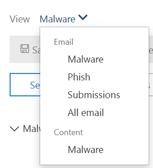

# Investigar y corregir el correo electrónico malintencionado que se entregó en Office 365Investigate and remediate malicious email that was delivered in Office 365

La [protección contra amenazas avanzada de Office 365](office-365-atp.md) le permite investigar las actividades que ponen en riesgo a las personas de su organización y emprender acciones para proteger a su organización.[Office 365 Advanced Threat Protection](office-365-atp.md) enables you to investigate activities that put people in your organization at risk, and to take action to protect your organization. Por ejemplo, si forma parte del equipo de seguridad de su organización, puede encontrar e investigar los mensajes de correo electrónico sospechosos que se entregaron.For example, if you are part of your organization's security team, you can find and investigate suspicious email messages that were delivered. Para ello, puede usar el [Explorador de amenazas (o detecciones en tiempo real)](threat-explorer.md).You can do this by using [Threat Explorer (or real-time detections)](threat-explorer.md).
  
## Antes de empezar...Before you begin...

Asegúrese de que se cumplen los siguientes requisitos:Make sure that the following requirements are met:
  
- Su organización tiene [Office 365 de protección contra amenazas avanzada](office-365-atp.md) y [se asignan licencias a los usuarios](https://docs.microsoft.com/office365/admin/subscriptions-and-billing/assign-licenses-to-users).Your organization has [Office 365 Advanced Threat Protection](office-365-atp.md) and [licenses are assigned to users](https://docs.microsoft.com/office365/admin/subscriptions-and-billing/assign-licenses-to-users).
    
- El [registro de auditoría de Office 365](../../compliance/turn-audit-log-search-on-or-off.md) está activado para su organización.[Office 365 audit logging](../../compliance/turn-audit-log-search-on-or-off.md) is turned on for your organization. 
    
- Su organización tiene directivas definidas para protección contra correo electrónico no deseado, antimalware, antiphishing, etc.Your organization has policies defined for anti-spam, anti-malware, anti-phishing, and so on. Consulte [proteger contra amenazas en Office 365](protect-against-threats.md).See [Protect against threats in Office 365](protect-against-threats.md).
    
- Es un administrador global de Office 365 o bien tiene el rol de administrador de seguridad o de búsqueda y depuración asignado en &amp; el centro de seguridad y cumplimiento.You are an Office 365 global administrator, or you have either the Security Administrator or the Search and Purge role assigned in the Security &amp; Compliance Center. Consulte [permisos en el centro de seguridad &amp; y cumplimiento de Office 365](permissions-in-the-security-and-compliance-center.md).See [Permissions in the Office 365 Security &amp; Compliance Center](permissions-in-the-security-and-compliance-center.md). Para algunas acciones, también debe tener asignado un nuevo rol de vista previa.For some actions, you must also have a new Preview role assigned. 

#### Vista previa de permisos de rolesPreview role permissions

Para realizar determinadas acciones, como ver los encabezados de mensajes o descargar el contenido de los mensajes de correo electrónico, debe tener un nuevo rol denominado *vista previa* agregada a otro grupo de roles de Office 365 adecuado.To perform certain actions, such as viewing message headers or downloading email message content, you must have a new role called *Preview* added to another appropriate Office 365 role group. La siguiente tabla clarifica los permisos y las funciones necesarias.The following table clarifies required roles and permissions.

|ActividadActivity  |Grupo de funcionesRole group |¿Se requiere un rol de vista previa?Preview role needed?  |
|---------|---------|---------|
|Usar el explorador de amenazas (y detecciones en tiempo real) para analizar las amenazasUse Threat Explorer (and real-time detections) to analyze threats     |Administrador global de Office 365Office 365 Global Administrator   Administrador de seguridadSecurity Administrator   Lector de seguridadSecurity Reader     | NoNo   |
|Usar el explorador de amenazas (y detecciones en tiempo real) para ver los encabezados de los mensajes de correo electrónico, así como para obtener una vista previa y descargar los mensajes de correo electrónico en cuarentenaUse Threat Explorer (and real-time detections) to view headers for email messages as well as preview and download quarantined email messages    |Administrador global de Office 365Office 365 Global Administrator   Administrador de seguridadSecurity Administrator  Lector de seguridadSecurity Reader   |       NoNo  |
|Usar el explorador de amenazas para ver los encabezados y descargar los mensajes de correo electrónico que se entregan a los buzonesUse Threat Explorer to view headers and download email messages delivered to mailboxes     |Administrador global de Office 365Office 365 Global Administrator  Administrador de seguridadSecurity Administrator   Lector de seguridadSecurity Reader   Vista previaPreview   |   SíYes      |

> [!NOTE]
> La *vista previa* es un rol y no un grupo de roles; el rol de vista previa debe agregarse a un grupo de roles existente para Office 365.*Preview* is a role and not a role group; the Preview role must be added to an existing role group for Office 365. El rol de administrador global de Office 365 se asigna al centro de administración[https://admin.microsoft.com](https://admin.microsoft.com)de Microsoft 365 () y los roles de administrador de seguridad y lector de seguridad se asignan en el[https://protection.office.com](https://protection.office.com)centro de seguridad & cumplimiento de Office 365 ().The Office 365 Global Administrator role is assigned the Microsoft 365 admin center ([https://admin.microsoft.com](https://admin.microsoft.com)), and the Security Administrator and Security Reader roles are assigned in the Office 365 Security & Compliance Center ([https://protection.office.com](https://protection.office.com)). Para obtener más información acerca de los roles y los permisos, consulte [Permissions in the Office 365 Security & Compliance Center](permissions-in-the-security-and-compliance-center.md).To learn more about roles and permissions, see [Permissions in the Office 365 Security & Compliance Center](permissions-in-the-security-and-compliance-center.md).

## Buscar y eliminar correo electrónico sospechoso que se entregóFind and delete suspicious email that was delivered

El explorador de amenazas es un informe eficaz que puede servir para varios propósitos, como buscar y eliminar mensajes, identificar la dirección IP de un remitente de correo electrónico malintencionado o iniciar un incidente para una mayor investigación.Threat Explorer is a powerful report that can serve multiple purposes, such as finding and deleting messages, identifying the IP address of a malicious email sender, or starting an incident for further investigation. El siguiente procedimiento se centra en usar el explorador para buscar y eliminar correo electrónico malintencionado de los buzones de los destinatarios.The following procedure focuses on using Explorer to find and delete malicious email from recipient's mailboxes.

1. **Vaya a Threat Explorer**: vaya a [https://protection.office.com](https://protection.office.com) e inicie sesión con su cuenta profesional o educativa para Office 365.**Navigate to Threat Explorer**: Go to [https://protection.office.com](https://protection.office.com) and sign in using your work or school account for Office 365. Esto le llevará al centro de &amp; seguridad y cumplimiento.This takes you to the Security &amp; Compliance Center.

2. En el inicio rápido de navegación izquierdo, elija **Threat Management** \> **Explorer**.In the left navigation quick-launch, choose **Threat management** \> **Explorer**.

    

    <!-- You may notice the new **Special actions** column. This feature is aimed at telling admins the outcome of processing an email. The **Special actions** column can be accessed in the same place as **Delivery action** and **Delivery location**. Special actions might be updated at the end of Threat Explorer's email timeline, which is a new feature aimed at making the hunting experience better for admins.-->

3. **Vistas en el explorador de amenazas**: en el menú **Ver** , elija **todo el correo electrónico**.**Views in Threat Explorer**: In the **View** menu, choose **All email**.

    

    La vista de *malware* es actualmente la predeterminada y captura mensajes de correo electrónico donde se detecta una amenaza de malware.The *Malware* view is currently the default, and captures emails where a malware threat is detected. La vista *phish* funciona de la misma manera, para phish.The *Phish* view operates in the same way, for Phish.

    Sin embargo, en todas las vistas de *correo electrónico* se muestra cada correo recibido por la organización, independientemente de si se han detectado o no amenazas.However, *All email* view lists every mail received by the organization, whether threats were detected or not. Como puede imaginar, esta es una gran cantidad de datos, por lo que esta vista muestra un marcador de posición que le pide que se aplique un filtro.As you can imagine, this is a lot of data, which is why this view shows a placeholder that asks a filter be applied. (Esta vista solo está disponible para los clientes P2 de ATP).(This view is only available for ATP P2 customers.)

    La vista *envíos* muestra todos los correos enviados por el administrador o el usuario que se notificaron a Microsoft.*Submissions* view shows up all mails submitted by admin or user that were reported to Microsoft.

4. **Buscar y filtrar en el explorador de amenazas**: los filtros aparecen en la parte superior de la página en la barra de búsqueda para ayudar a los administradores en sus investigaciones.**Search and filter in Threat Explorer**: Filters appear at the top of the page in the search bar to help admins in their investigations. Tenga en cuenta que se pueden aplicar varios filtros a la vez y que se agregan varios valores separados por comas a un filtro para acotar la búsqueda.Notice that multiple filters can be applied at the same time, and multiple comma-separated values added to a filter to narrow down the search. Recuerde:Remember:
    - Los filtros realizan una coincidencia exacta en la mayoría de las condiciones de filtrado.Filters do exact matching on most filter conditions.
    - El filtro de asunto usa una consulta Contains.Subject filter uses a CONTAINS query.
    - Los filtros de dirección URL funcionan con o sin protocolos (p. ej.URL filters work with or without protocols (ex. https).https).
    - El dominio de dirección URL, la ruta de dirección URL y los filtros de dominio y ruta de acceso de dirección URL no requieren un protocolo para filtrar.URL domain, URL path, and URL domain and path filters don't require a protocol to filter.
    - Debe hacer clic en el icono actualizar cada vez que cambie los valores de filtro para obtener resultados relevantes.You must click the Refresh icon every time you change the filter values to get relevant results.

5. **Filtros avanzados**: con estos filtros, puede crear consultas complejas y filtrar el conjunto de datos.**Advanced filters**: With these filters, you can build complex queries and filter your data set. Al hacer clic en *filtros avanzados* , se abre un control flotante con opciones.Clicking on *Advanced Filters* opens a flyout with options.

   El filtrado avanzado es una gran adición a las capacidades de búsqueda.Advanced filtering is a great addition to search capabilities. Se ha agregado un valor booleano **no** Filter en el *destinatario*, el *remitente* y el *dominio del remitente* para permitir que los administradores investiguen mediante la exclusión de valores.A boolean **NOT** filter has been introduced on *Recipient*, *Sender* and *Sender domain* to allow admins to investigate by excluding values. Esta opción aparece en el parámetro Selection no *contiene ninguno de*.This option appears under selection parameter *Contains none of*. **No** permitirá a los administradores excluir los buzones de correo de alertas, los buzones de respuesta predeterminados de sus investigaciones y es útil para los casos en los que los administradores buscan un asunto específico (Subject = "atención") donde el destinatario se puede establecer en *ninguno de defaultMail@contoso.com*.**NOT** will let admins exclude alert mailboxes, default reply mailboxes from their investigations, and is useful for cases where admins search for a specific subject (subject="Attention") where the Recipient can be set to *none of defaultMail@contoso.com*. Se trata de una búsqueda de valor exacta.This is an exact value search.

   

   *Filtrar por horas* ayudará a que el equipo de seguridad de su organización se despliega rápidamente.*Filtering by hours* will help your organization's security team drill down quickly. La duración de tiempo más corta permitida es de 30 minutos.The shortest allowed time duration is 30 minutes. Si puede restringir la acción sospechosa por período de tiempo (por ejemplo, ha pasado hace 3 horas), esto limitará el contexto y determinará con precisión el problema.If you can narrow the suspicious action by time-frame (e.g. it happened 3 hours ago), this will limit the context and help pinpoint the problem.

  

6. **Campos en el explorador de amenazas**: el explorador de amenazas expone mucha más información de correo relacionada con la seguridad, como la *acción de entrega*, la *Ubicación de entrega*, la *acción especial*, la *direccionalidad*, las *invalidaciones*y la *amenaza de URL*.**Fields in threat explorer**: Threat Explorer exposes a lot more security-related mail information such as *Delivery action*, *Delivery location*, *Special action*, *Directionality*, *Overrides*, and *URL threat*. También permite que el equipo de seguridad de su organización investigue con una mayor certeza.It also allows your organization's security team to investigate with a higher certainty. 

    La *acción de entrega* es la acción que se realiza en un correo electrónico debido a las directivas o detecciones existentes.*Delivery action* is the action taken on an email due to existing policies or detections. Estas son las posibles acciones que puede realizar un correo electrónico:Here are the possible actions an email can take:
    - **Delivered** : el correo electrónico se entregó a la bandeja de entrada o a la carpeta de un usuario y el usuario puede acceder a él directamente.**Delivered** – email was delivered to inbox or folder of a user and the user can directly access it.
    - Correo electrónico **no deseado** (entregado a correo no deseado): el correo electrónico se envió a la carpeta de correo no deseado o a la carpeta eliminada del usuario y el usuario tiene acceso a los mensajes de correo electrónico en su carpeta de correo no deseado o eliminado.**Junked** (Delivered to junk)– email was sent to either user’s junk folder or deleted folder, and the user has access to email messages in their Junk or Deleted folder.
    - **Bloqueado** : todos los mensajes de correo electrónico que se hayan puesto en cuarentena, que hayan fallado o que se hayan quitado.**Blocked** – any email messages that are quarantined, that failed, or were dropped. (El usuario no tiene acceso completamente a esto).(This is completely inaccessible by the user.)
    - **Reemplazado** : todos los correos electrónicos en los que los datos adjuntos malintencionados se reemplazan por archivos. txt que indican que el archivo adjunto era malintencionado**Replaced** – any email where malicious attachments are replaced by .txt files that state the attachment was malicious

    **Ubicación de entrega**: el filtro de ubicación de entrega está disponible para ayudar a los administradores a comprender dónde se ha finalizado el correo malintencionado sospechoso y qué acciones se han realizado en él.**Delivery location**: The Delivery location filter is available in order to help admins understand where suspected malicious mail ended-up and what actions were taken on it. Los datos resultantes se pueden exportar a la hoja de cálculo.The resulting data can be exported to spreadsheet. Las ubicaciones de entrega posibles son:Possible delivery locations are:
    - **Bandeja de entrada o carpeta** : el correo electrónico está en la bandeja de entrada o en una carpeta específica, de acuerdo con las reglas de correo electrónico.**Inbox or folder** – The email is in the Inbox or a specific folder, according to your email rules.
    - Local **o externa** : el buzón de correo no existe en la nube, pero es local.**On-prem or external** – The mailbox doesn’t exist in the Cloud but is on-premises.
    - **Carpeta de correo no deseado** : el correo electrónico se encuentra en la carpeta de correo no deseado de un usuario.**Junk folder** – The email is in a user's Junk mail folder.
    - **Carpeta elementos eliminados** : el correo electrónico se encuentra en la carpeta elementos eliminados del usuario.**Deleted items folder** – The email is in a user's Deleted items folder.
    - **Cuarentena** : el correo electrónico que se encuentra en cuarentena y no en el buzón de un usuario.**Quarantine** – The email in quarantine, and not in a user’s mailbox.
    - **Failed** – el correo electrónico no pudo llegar al buzón.**Failed** – The email failed to reach the mailbox.
    - **Perdido: el** correo electrónico se perdió en algún lugar del flujo de correo.**Dropped** – The email was lost somewhere in the mail flow.

    **Direccionalidad**: esta opción permite al equipo de operaciones de seguridad filtrar por la ' dirección ' a la que procede un correo o se dirige.**Directionality**: This option allows your security operations team to filter by the 'direction' a mail comes from, or is going. Los valores de direccionalción son *entrante*, *saliente*e interno de la *organización* (correspondiente al correo que entra en su organización desde fuera, se envía fuera de su organización o se envía internamente a su organización, respectivamente).Directionality values are *Inbound*, *Outbound*, and *Intra-org* (corresponding to mail coming into your org from outside, being sent out of your org, or being sent internally to your org, respectively). Esta información puede ayudar a los equipos de operaciones de seguridad a entanar la suplantación y la suplantación, ya que no coinciden entre el valor de la direccionalidad (por ejemplo,This information can help security operations teams spot spoofing and impersonation, because a mismatch between the Directionality value (ex. *Entrante*) y el dominio del remitente (que *parece* ser un dominio interno) será evidente.*Inbound*), and the domain of the sender (which *appears* to be an internal domain) will be evident! El valor de direccionalidad es independiente y puede ser diferente del seguimiento de mensajes.The Directionality value is separate, and can differ from, the Message Trace. Los resultados se pueden exportar a la hoja de cálculo.Results can be exported to spreadsheet.

    **Invalidaciones**: este filtro recibe información que aparece en la ficha de detalles del correo y la usa para exponer dónde se han *invalidado*las directivas de usuario o de la organización, así como para permitir y bloquear el bloqueo de correo.**Overrides**: This filter takes information that appears on the mail's details tab and uses it to expose where organizational, or user policies, for allowing and blocking mails have been *overridden*. Lo más importante de este filtro es que ayuda al equipo de seguridad de su organización a ver cuántos correos electrónicos sospechosos se han entregado debido a la configuración.The most important thing about this filter is that it helps your organization's security team see how many suspicious emails were delivered due to configuration. Esto les da la oportunidad de modificar los bloques de permitidos y los bloques según sea necesario.This gives them an opportunity to modify allows and blocks as needed. Este conjunto de resultados de este filtro se puede exportar a hoja de cálculo.This result set of this filter can be exported to spreadsheet.

|Invalidaciones del explorador de amenazasThreat Explorer Overrides  | SignificadoWhat they mean  |
|---------|---------|
|Permitido por la Directiva de la organizaciónAllowed by Org Policy     |   Se permitió el correo al buzón tal y como lo indicó la Directiva de la organización.Mail was allowed into the mailbox as directed by the organization policy.       |
|Bloqueado por la Directiva de la organizaciónBlocked by Org policy      |  Se ha bloqueado el correo para que no se entregue en el buzón como se indicó en la Directiva de la organización.Mail was blocked from delivery to the mailbox as directed by the organization policy.    |
|Extensión de archivo bloqueada por la Directiva de la organizaciónFile extension blocked by Org Policy     | El archivo se bloqueó para que no se entregue en el buzón de correo según lo indicó la Directiva de la organización.File was blocked from delivery to the mailbox as directed by the organization policy.        |
|Permitido por la Directiva de usuarioAllowed by User Policy     | El correo se permitía en el buzón tal como lo indicó la Directiva de usuario.Mail was allowed into the mailbox as directed by the user policy.        |
|Bloqueado por la Directiva de usuarioBlocked by User Policy     | Se ha bloqueado el correo para que no se entregue en el buzón tal como lo indicó la Directiva de usuario.Mail was blocked from delivery to the mailbox as directed by the user policy.        |

**Amenaza de dirección URL**: el campo de la amenaza URL se incluye en la pestaña de *detalles* de un correo electrónico para indicar la amenaza que presenta una dirección URL.**URL threat**: The URL threat field has been included on the *details* tab of an email to indicate the threat presented by a URL. Las amenazas que presenta una dirección URL pueden incluir *malware*, *phish*o *correo no deseado*, y una dirección URL *sin amenazas no* dirá *ninguna* en la sección amenazas.Threats presented by a URL can include *Malware*, *Phish*, or *Spam*, and a URL with *no threat* will say *None* in the threats section.

7. **Vista escala de tiempo del correo electrónico**: es posible que el equipo de operaciones de seguridad necesite profundizar en los detalles del correo electrónico para investigar más.**Email timeline view**: Your security operations team might need to deep-dive into email details to investigate further. La escala de tiempo de correo electrónico permite a los administradores ver las acciones realizadas en un correo electrónico desde la entrega hasta la entrega posterior.The email timeline allows admins to view actions taken on an email from delivery to post-delivery. Para ver una escala de tiempo de correo electrónico, haga clic en el asunto de un mensaje de correo electrónico y, a continuación, en correo electrónico escala de tiempo.To view an email timeline, click on the subject of an email message, and then click Email timeline. (Aparece entre otros títulos en el panel, como resumen o detalles). Estos resultados se pueden exportar a la hoja de cálculo.(It appears among other headings on the panel like Summary or Details.) These results can be exported to spreadsheet.

    La escala de tiempo de correo electrónico se abrirá en una tabla que muestra todos los eventos de entrega y posterior a la entrega del correo electrónico.Email timeline will open to a table that shows all delivery and post-delivery events for the email. Si no hay más acciones en el correo electrónico, debería ver un solo evento para la entrega original que indique un resultado, como *bloqueado*, con un veredicto como *phish*.If there are no further actions on the email, you should see a single event for the original delivery that states a result, such as *Blocked*, with a verdict like *Phish*. Los administradores pueden exportar toda la escala de tiempo de correo electrónico, incluidos todos los detalles de la pestaña y el correo electrónico (como el asunto, el remitente, el destinatario, la red y el identificador del mensaje).Admins can export the entire email timeline, including all details on the tab and email (such as, Subject, Sender, Recipient, Network, and Message ID). La escala de tiempo del correo electrónico reduce la aleatoriedad porque hay menos tiempo dedicado a comprobar las distintas ubicaciones para tratar de comprender los eventos que han sucedido desde que llegó el correo electrónico.The email timeline cuts down on randomization because there is less time spent checking different locations to try to understand events that happened since the email arrived. Cuando se producen varios eventos en, o cerca de, al mismo tiempo en un correo electrónico, esos eventos se muestran en una vista de escala de tiempo.When multiple events happen at, or close to, the same time on an email, those events show up in a timeline view.

8. **Vista previa/descarga**: el explorador de amenazas proporciona al equipo de operaciones de seguridad los detalles que necesitan para investigar el correo electrónico sospechoso.**Preview / download**: Threat Explorer gives your security operations team the details they need to investigate suspicious email. El equipo de operaciones de seguridad puede:Your security operations team can either:

    - [Compruebe la acción y la ubicación de entrega](#check-the-delivery-action-and-location).[Check the delivery action and location](#check-the-delivery-action-and-location).

    - [Vea la escala de tiempo del correo electrónico](#view-the-timeline-of-your-email).[View the timeline of your email](#view-the-timeline-of-your-email).

    ##### Comprobar la acción y la ubicación de la entregaCheck the delivery action and location

    En el [Explorador de amenazas (y en detección en tiempo real)](threat-explorer.md), ahora tiene columnas de **acción de entrega** y ubicación de **entrega** en lugar de la columna de **Estado de entrega** anterior.In [Threat Explorer (and real-time detections)](threat-explorer.md), you now have **Delivery Action** and **Delivery Location** columns instead of the former **Delivery Status** column. Esto da como resultado una imagen más completa de la ubicación de los mensajes de correo electrónico.This results in a more complete picture of where your email messages land. Una parte del objetivo de este cambio es facilitar las investigaciones para los equipos de operaciones de seguridad, pero el resultado neto es conocer la ubicación de los mensajes de correo electrónico con problemas de un vistazo.Part of the goal of this change is to make investigations easier for security operations teams, but the net result is knowing the location of problem email messages at a glance.

    El estado de entrega ahora se divide en dos columnas:Delivery Status is now broken out into two columns:

    - **Acción de entrega** : ¿Cuál es el estado de este correo electrónico?**Delivery action** - What is the status of this email?

    - **Ubicación de entrega** : ¿Dónde se distribuyó este correo electrónico como resultado?**Delivery location** - Where was this email routed as a result?

    La acción de entrega es la acción que se realiza en un correo electrónico debido a las directivas o detecciones existentes.Delivery action is the action taken on an email due to existing policies or detections. Estas son las posibles acciones que puede realizar un correo electrónico:Here are the possible actions an email can take:

    - **Delivered** : el correo electrónico se entregó a la bandeja de entrada o a la carpeta de un usuario y el usuario puede acceder a él directamente.**Delivered** – email was delivered to inbox or folder of a user and the user can directly access it.

    - Correo electrónico **no deseado** : el correo electrónico se envió a la carpeta de correo no deseado o a la carpeta eliminada del usuario y el usuario tiene acceso a los mensajes de correo electrónico en su carpeta de correo no deseado o eliminado.**Junked** – email was sent to either user's junk folder or deleted folder, and the user has access to email messages in their Junk or Deleted folder.

    - **Bloqueado** : todos los mensajes de correo electrónico que se hayan puesto en cuarentena, que hayan fallado o que se hayan quitado.**Blocked** – any email messages that are quarantined, that failed, or were dropped. (El usuario no tiene acceso completamente a esto).(This is completely inaccessible by the user.)

    - **Reemplazado** : cualquier correo electrónico en el que los datos adjuntos malintencionados se reemplazan por archivos. txt que indican que los datos adjuntos eran malintencionados.**Replaced** – any email where malicious attachments are replaced by .txt files that state the attachment was malicious.
 
    Ubicación de entrega muestra los resultados de las directivas y detecciones que se ejecutan después de la entrega.Delivery location shows the results of policies and detections that run post-delivery. Está vinculado a una acción de entrega.It's linked to a Delivery Action. Este campo se agregó para proporcionar información sobre la acción tomada cuando se encuentra un mensaje problemático.This field was added to give insight into the action taken when a problem mail is found. Estos son los valores posibles de la ubicación de entrega:Here are the possible values of delivery location:

    - **Bandeja de entrada o carpeta** : el correo electrónico está en la bandeja de entrada o en una carpeta (según las reglas de correo electrónico).**Inbox or folder** – The email is in the inbox or a folder (according to your email rules).

    - Local **o externa** : el buzón de correo no existe en la nube pero es local.**On-prem or external** – The mailbox doesn't exist on cloud but is on-premises.

    - **Carpeta de correo no deseado** : el correo electrónico se encuentra en la carpeta de correo no deseado del usuario.**Junk folder** – The email is in a user's Junk folder.

    - **Carpeta elementos eliminados** : el correo electrónico se encuentra en la carpeta elementos eliminados del usuario.**Deleted items folder** – The email is in a user's Deleted items folder.

    - **Cuarentena** : el correo electrónico que se encuentra en cuarentena y no en el buzón de un usuario.**Quarantine** – The email in quarantine, and not in a user's mailbox.

    - **Failed** – el correo electrónico no pudo llegar al buzón.**Failed** – The email failed to reach the mailbox.

    - **Descartado** : el correo electrónico se pierde en algún lugar del flujo de correo.**Dropped** – The email gets lost somewhere in the mail flow.

     ##### Ver la escala de tiempo del correo electrónicoView the timeline of your email
  
     La **escala de tiempo de correo electrónico** es un campo en el explorador de amenazas que facilita la búsqueda del equipo de operaciones de seguridad.**Email Timeline** is a field in Threat Explorer that makes hunting easier for your security operations team. Cuando se producen varios eventos en o cerca de la misma hora en un correo electrónico, esos eventos se muestran en una vista de escala de tiempo.When multiple events happen at or close to the same time on an email, those events show up in a timeline view. Algunos de los eventos que se producen después de la entrega en el correo electrónico se capturan en la columna **acciones especiales** .Some events that happen post-delivery to email are captured in the **Special actions** column. La combinación de información de la escala de tiempo de un mensaje de correo electrónico con cualquier acción especial realizada tras la entrega proporciona a los administradores información sobre las directivas y el tratamiento de las amenazas (por ejemplo, dónde se enrutó el correo y, en algunos casos, qué es la evaluación final).Combining information from the timeline of an email message with any special actions that were taken post-delivery gives admins insight into policies and threat handling (such as where the mail was routed, and, in some cases, what the final assessment was).

<!-- Reference material

1. **Navigate to Threat Explorer**: Go to [https://protection.office.com](https://protection.office.com) and sign in using your work or school account for Office 365. This takes you to the Security &amp; Compliance Center. 

2. In the left navigation quick-launch, choose **Threat management** \> **Explorer**.

3. Click on the subject of an email message, and then click **Email timeline**. (It appears among other headings on the panel like **Summary** or **Details**.)

    Once you've opened the email timeline, you should see a table that tells you the post-delivery events for that mail. In the case of no further events for the email, you should see a single event for the original delivery that states a result like **Blocked** with a verdict like **Phish**. The tab also has the option to export the entire email timeline, and this exports all the details on the tab and details on the email (things like Subject, Sender, Recipient, Network, and Message ID).

    The email timeline cuts down on randomization because there is less time spent checking different locations to try to understand events that happened since the email arrived. When multiple events happen at, or close to, the same time on an email, those events show up in a timeline view. 
    
    Some events that happen post-delivery to your mail are captured in the **Special actions** column. Combining the information from the email timeline along with special actions taken on email post-delivery gives admins insight into how their policies work, where the email was finally routed, and, in some cases, what the final assessment was. 

4. In the **View** menu, choose **All email**.

    
  
    Notice the labels that appear in the report, such as **Delivered**, **Unknown**, or **Delivered to junk**.

    
    
    (Depending on the actions that were taken on email messages for your organization, you might see other labels, such as **Blocked** or **Replaced**.)
    
5. In the report, choose **Delivered** to view only email messages that ended up in users' inboxes.

    
  
6. Below the chart, review the **Email** list below the chart.

    
  
7. In the list, choose an item to view more details about that email message. For example, you can click the subject line to view information about the sender, recipients, attachments, and other similar email messages.

    
  
8. After viewing information about email messages, select one or more items in the list to activate **+ Actions**.
    
9. Use the **+ Actions** list to apply an action, such as **Move to deleted** items. This deletes the selected messages from the recipients' mailboxes.

    

## Dealing with suspicious email messages

Malicious attackers might be sending mail to people in your organization in an attempt to phish their credentials and gain access to your corporate secrets. To help prevent this, you use the threat protection services in Office 365, including [Exchange Online Protection](exchange-online-protection-overview.md) and [Advanced Threat Protection](office-365-atp.md). However, it occasionally happens that an attacker sends email that contains a link (URL) that only later points to malicious content (such as malware). Or, you might realize too late that someone in your organization has been compromised, and while they were compromised, an attacker used their account to send email to other people in your organization. As part of dealing with either of these scenarios, you can remove suspicious email messages from user inboxes. To do that, you can use [Threat Explorer](threat-explorer.md).

## Finding re-routed email messages after actions are taken

Threat Explorer provides your security operations team with the details they need to investigate suspicious email. Your security operations team can:

- [View the email headers and download the email body](#view-the-email-headers-and-download-the-email-body) 

- [Check the delivery action and location](#check-the-delivery-action-and-location)

- [View the timeline of your email](#view-the-timeline-of-your-email)

### View the email headers and download the email body

The ability to preview email headers and download the body of an email body are powerful capabilities in Threat Explorer. Appropriate [permissions](permissions-in-the-security-and-compliance-center.md) must be assigned. See [Preview role permissions](#preview-role-permissions).

To access your message header and email download options, follow these steps: 

1. Go to [https://protection.office.com](https://protection.office.com) and sign in using your work or school account for Office 365. This takes you to the Security &amp; Compliance Center. 
    
2. In the left navigation, choose **Threat management** \> **Explorer**.

3. Click on a subject in the Threat Explorer table. 

    This opens the flyout, where both header preview and email download links are positioned.

    

> [!IMPORTANT]
> This capability doesn't show up for email messages that were never found in a user's mailbox, which can happen if an email was dropped or its delivery failed. In cases where email messages were deleted from users' mailboxes, admins see a "Mail not found" error message.
-->

## Temas relacionadosRelated topics

[Protección contra amenazas avanzada de Office 365Office 365 Advanced Threat Protection](office-365-ti.md)
  
[Protección contra amenazas en Office 365Protect against threats in Office 365](protect-against-threats.md)
  
[Ver informes para la protección contra amenazas avanzada de Office 365View reports for Office 365 Advanced Threat Protection](view-reports-for-atp.md)
