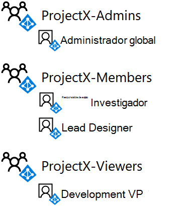
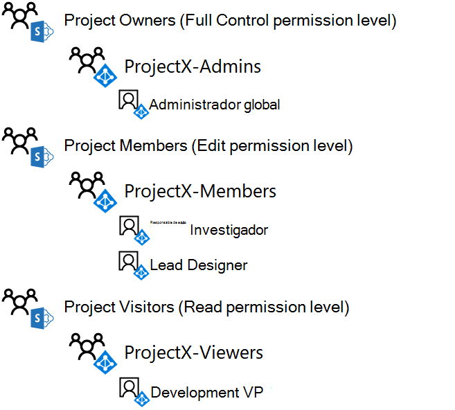

# <a name="isolated-sharepoint-online-team-site-devtest-environment"></a><span data-ttu-id="ac6eb-103">Sitio de grupo de SharePoint Online aislado en su entorno para desarrollo y pruebas</span><span class="sxs-lookup"><span data-stu-id="ac6eb-103">Isolated SharePoint Online team site dev/test environment</span></span>

 <span data-ttu-id="ac6eb-104">**Resumen**: Configure un sitio de grupo de SharePoint Online que esté aislado del resto de la organización en su entorno para desarrollo y pruebas de Office 365.</span><span class="sxs-lookup"><span data-stu-id="ac6eb-104">**Summary:** Configure a SharePoint Online team site that is isolated from the rest of the organization in your Office 365 dev/test environment.</span></span>

<span data-ttu-id="ac6eb-105">Los sitios de grupo de SharePoint Online en Office 365 son ubicaciones en las que los usuarios pueden trabajar en colaboración usando una biblioteca de documentos comunes, un bloc de notas de OneNote y otros servicios.</span><span class="sxs-lookup"><span data-stu-id="ac6eb-105">SharePoint Online team sites in Office 365 are locations for collaboration using a common document library, a OneNote notebook, and other services.</span></span> <span data-ttu-id="ac6eb-106">En muchos casos, deseará contar con un acceso amplio y una colaboración entre departamentos u organizaciones.</span><span class="sxs-lookup"><span data-stu-id="ac6eb-106">In many cases, you want wide access and collaboration across departments or organizations.</span></span> <span data-ttu-id="ac6eb-107">Sin embargo, en algunos casos, es conveniente controlar rigurosamente el acceso y los permisos de colaboración entre un pequeño grupo de personas.</span><span class="sxs-lookup"><span data-stu-id="ac6eb-107">However, in some cases, you want to tightly control the access and permissions for collaboration among a small group of people.</span></span>

<span data-ttu-id="ac6eb-108">El acceso a los sitios de grupo de SharePoint Online y lo que los usuarios pueden hacer está controlado por grupos y niveles de permisos de SharePoint.</span><span class="sxs-lookup"><span data-stu-id="ac6eb-108">Access to SharePoint Online team sites and what users can do is controlled by SharePoint groups and permission levels.</span></span> <span data-ttu-id="ac6eb-109">De forma predeterminada, los sitios de SharePoint Online cuentan con tres niveles de acceso:</span><span class="sxs-lookup"><span data-stu-id="ac6eb-109">By default, SharePoint Online sites have three levels of access:</span></span>

- <span data-ttu-id="ac6eb-110">**Miembros**, que pueden ver, crear y modificar los recursos del sitio.</span><span class="sxs-lookup"><span data-stu-id="ac6eb-110">**Members**, who can view, create, and modify resources on the site.</span></span>

- <span data-ttu-id="ac6eb-111">**Propietarios**, que tienen un control total sobre el sitio y pueden cambiar los permisos.</span><span class="sxs-lookup"><span data-stu-id="ac6eb-111">**Owners**, who have complete control of the site, including the ability to change permissions.</span></span>

- <span data-ttu-id="ac6eb-112">**Visitantes**, que únicamente pueden ver los recursos del sitio.</span><span class="sxs-lookup"><span data-stu-id="ac6eb-112">**Visitors**, who only can view resources on the site.</span></span>

<span data-ttu-id="ac6eb-113">En este artículo, se indican los pasos que se deben seguir para configurar un sitio de grupo de SharePoint Online aislado para un proyecto de investigación secreto, que llamaremos ProyectoX.</span><span class="sxs-lookup"><span data-stu-id="ac6eb-113">This article steps you through the configuration of an isolated SharePoint Online team site for a secret research project named ProjectX.</span></span> <span data-ttu-id="ac6eb-114">Los requisitos de acceso son los siguientes:</span><span class="sxs-lookup"><span data-stu-id="ac6eb-114">The access requirements are:</span></span>

- <span data-ttu-id="ac6eb-115">Solo los miembros del proyecto pueden acceder al sitio y a su contenido (documentos, Bloc de notas de OneNote y páginas), con niveles de permiso de SharePoint de edición y visualización controlados a través de la pertenencia al grupo.</span><span class="sxs-lookup"><span data-stu-id="ac6eb-115">Only members of the project can access the site and its contents (documents, OneNote Notebook, Pages), with edit and view SharePoint permission levels controlled through group membership.</span></span>

- <span data-ttu-id="ac6eb-116">Únicamente el creador del sitio y los miembros de un grupo de administradores del sitio pueden llevar a cabo tareas relacionadas con la administración, lo que incluye la modificación de los permisos del sitio.</span><span class="sxs-lookup"><span data-stu-id="ac6eb-116">Only the site creator and members of an Admins group for the site can perform site administration, which includes modifying site-level permissions.</span></span>

<span data-ttu-id="ac6eb-117">La configuración de un sitio de grupo de SharePoint Online aislado en su entorno para desarrollo y pruebas de Office 365 se divide en tres fases:</span><span class="sxs-lookup"><span data-stu-id="ac6eb-117">There are three phases to setting up an isolated SharePoint Online team site in your Office 365 dev/test environment:</span></span>

1. <span data-ttu-id="ac6eb-118">Crear el entorno para desarrollo y pruebas de Office 365.</span><span class="sxs-lookup"><span data-stu-id="ac6eb-118">Create the Office 365 dev/test environment.</span></span>

2. <span data-ttu-id="ac6eb-119">Crear los usuarios y los grupos de ProyectoX.</span><span class="sxs-lookup"><span data-stu-id="ac6eb-119">Create the users and groups for ProjectX.</span></span>

3. <span data-ttu-id="ac6eb-120">Crear un sitio de grupo de SharePoint Online para ProyectoX y aislarlo.</span><span class="sxs-lookup"><span data-stu-id="ac6eb-120">Create a new ProjectX SharePoint Online team site and isolate it.</span></span>

> [!TIP]
> <span data-ttu-id="ac6eb-121">Haga clic [aquí](https://aka.ms/catlgstack) para ver un mapa visual de todos los artículos de la pila Guía de laboratorio de pruebas de One Microsoft Cloud.</span><span class="sxs-lookup"><span data-stu-id="ac6eb-121">Click [here](https://aka.ms/catlgstack) for a visual map to all the articles in the One Microsoft Cloud Test Lab Guide stack.</span></span>

## <a name="phase-1-build-out-your-lightweight-or-simulated-enterprise-office-365-devtest-environment"></a><span data-ttu-id="ac6eb-122">Fase 1: Crear un entorno de desarrollo y pruebas ligero o de una empresa simulada de Office 365</span><span class="sxs-lookup"><span data-stu-id="ac6eb-122">Phase 1: Build out your lightweight or simulated enterprise Office 365 dev/test environment</span></span>

<span data-ttu-id="ac6eb-123">Si solo quiere crear un sitio de grupo de SharePoint Online aislado de forma ligera con los requisitos mínimos, siga las instrucciones indicadas en las fases 2 y 3 de [Office 365 dev/test Environment](https://docs.microsoft.com/office365/enterprise/office-365-dev-test-environment).</span><span class="sxs-lookup"><span data-stu-id="ac6eb-123">If you just want to create an isolated SharePoint Online team site in a lightweight way with the minimum requirements, follow the instructions in phases 2 and 3 of [Office 365 dev/test environment](https://docs.microsoft.com/office365/enterprise/office-365-dev-test-environment).</span></span>

<span data-ttu-id="ac6eb-124">Si desea crear un sitio de grupo de SharePoint Online aislado en una configuración de empresa simulada, siga las instrucciones que se indican en [DirSync para el entorno de desarrollo y pruebas de Office 365](https://docs.microsoft.com/office365/enterprise/dirsync-for-your-office-365-dev-test-environment).</span><span class="sxs-lookup"><span data-stu-id="ac6eb-124">If you want to create an isolated SharePoint Online team site in a simulated enterprise configuration, follow the instructions in [DirSync for your Office 365 dev/test environment](https://docs.microsoft.com/office365/enterprise/dirsync-for-your-office-365-dev-test-environment).</span></span>

> [!NOTE]
> <span data-ttu-id="ac6eb-125">La creación de un sitio de SharePoint Online aislado no requiere el entorno de desarrollo y pruebas de una empresa simulada, que incluye una intranet simulada conectada a Internet y la sincronización de directorios para un bosque de servicios de dominio de Active Directory (AD DS).</span><span class="sxs-lookup"><span data-stu-id="ac6eb-125">Creating an isolated SharePoint Online site does not require the simulated enterprise dev/test environment, which includes a simulated intranet connected to the Internet and directory synchronization for a Active Directory Domain Services (AD DS) forest.</span></span> <span data-ttu-id="ac6eb-126">Se proporciona aquí como opción para que pueda probar un sitio de SharePoint Online aislado y experimentar con él en un entorno que representa una organización típica.</span><span class="sxs-lookup"><span data-stu-id="ac6eb-126">It is provided here as an option so that you can test an isolated SharePoint Online site and experiment with it in an environment that represents a typical organization.</span></span>

## <a name="phase-2-create-user-accounts-and-access-groups"></a><span data-ttu-id="ac6eb-127">Fase 2: crear cuentas de usuario y grupos de acceso</span><span class="sxs-lookup"><span data-stu-id="ac6eb-127">Phase 2: Create user accounts and access groups</span></span>

<span data-ttu-id="ac6eb-128">Siga las instrucciones descritas en [Connect to office 365 PowerShell](https://docs.microsoft.com/office365/enterprise/powershell/connect-to-office-365-powershell) para conectarse a su suscripción de seguimiento de Office 365 con su cuenta de administrador global desde:</span><span class="sxs-lookup"><span data-stu-id="ac6eb-128">Use the instructions in [Connect to Office 365 PowerShell](https://docs.microsoft.com/office365/enterprise/powershell/connect-to-office-365-powershell) to connect to your Office 365 trail subscription with your global administrator account from:</span></span>

- <span data-ttu-id="ac6eb-129">Su equipo (para el entorno de desarrollo y pruebas ligero de Office 365).</span><span class="sxs-lookup"><span data-stu-id="ac6eb-129">Your computer (for the lightweight Office 365 dev/test environment).</span></span>

- <span data-ttu-id="ac6eb-130">La máquina virtual CLIENTE1 (para el entorno de desarrollo y pruebas de una empresa ficticia de Office 365).</span><span class="sxs-lookup"><span data-stu-id="ac6eb-130">The CLIENT1 virtual machine (for the simulated enterprise Office 365 dev/test environment).</span></span>

<span data-ttu-id="ac6eb-131">Para crear los nuevos grupos de acceso para el sitio de grupo de SharePoint Online para ProyectoX, ejecute estos comandos desde el símbolo del sistema del módulo de Windows Azure Active Directory para Windows PowerShell:</span><span class="sxs-lookup"><span data-stu-id="ac6eb-131">To create the new access groups for the ProjectX SharePoint Online team site, run these commands from the Windows Azure Active Directory Module for Windows PowerShell prompt:</span></span>

```powershell
$groupName="ProjectX-Members"
$groupDesc="People allowed to collaborate for ProjectX."
New-MsolGroup -DisplayName $groupName -Description $groupDesc
$groupName="ProjectX-Admins"
$groupDesc="People allowed to administer SharePoint for ProjectX."
New-MsolGroup -DisplayName $groupName -Description $groupDesc
$groupName="ProjectX-Viewers"
$groupDesc="People allowed to view the SharePoint resources for ProjectX."
New-MsolGroup -DisplayName $groupName -Description $groupDesc
```

<span data-ttu-id="ac6eb-132">Rellene el nombre de la organización (ejemplo: contosotoycompany), el código de país de dos caracteres para su ubicación y, después, ejecute los comandos siguientes desde el símbolo del sistema de Módulo Microsoft Azure Active Directory para Windows PowerShell:</span><span class="sxs-lookup"><span data-stu-id="ac6eb-132">Fill in your organization name (example: contosotoycompany), the two-character country code for your location, and then run the following commands from the Windows Azure Active Directory Module for Windows PowerShell prompt:</span></span>

```powershell
$orgName="<organization name>"
$loc="<two-character country code, such as US>"
$licAssignment= $orgName + ":ENTERPRISEPREMIUM"
$userName= "designer@" + $orgName + ".onmicrosoft.com"
New-MsolUser -DisplayName "Lead Designer" -FirstName Lead -LastName Designer -UserPrincipalName $userName -UsageLocation $loc -LicenseAssignment $licAssignment -ForceChangePassword $false
```

<span data-ttu-id="ac6eb-133">En la pantalla del comando **New-MsolUser**, anote la contraseña generada para la cuenta del responsable de diseño y guárdela en un lugar seguro.</span><span class="sxs-lookup"><span data-stu-id="ac6eb-133">From the display of the **New-MsolUser** command, note the generated password for the Lead Designer account and record it in a safe location.</span></span>

<span data-ttu-id="ac6eb-134">Ejecute los siguientes comandos desde el símbolo del sistema del Módulo de Windows Azure Active Directory para Windows PowerShell:</span><span class="sxs-lookup"><span data-stu-id="ac6eb-134">Run the following commands from the Windows Azure Active Directory Module for Windows PowerShell prompt:</span></span>

```powershell
$userName= "researcher@" + $orgName + ".onmicrosoft.com"
New-MsolUser -DisplayName "Lead Researcher" -FirstName Lead -LastName Researcher -UserPrincipalName $userName -UsageLocation $loc -LicenseAssignment $licAssignment -ForceChangePassword $false
```

<span data-ttu-id="ac6eb-135">En la pantalla del comando **New-MsolUser**, anote la contraseña generada para la cuenta del responsable de investigación y guárdela en un lugar seguro.</span><span class="sxs-lookup"><span data-stu-id="ac6eb-135">From the display of the **New-MsolUser** command, note the generated password for the Lead Researcher account and record it in a safe location.</span></span>

<span data-ttu-id="ac6eb-136">Ejecute los siguientes comandos desde el símbolo del sistema del Módulo de Windows Azure Active Directory para Windows PowerShell:</span><span class="sxs-lookup"><span data-stu-id="ac6eb-136">Run the following commands from the Windows Azure Active Directory Module for Windows PowerShell prompt:</span></span>

```powershell
$userName= "devvp@" + $orgName + ".onmicrosoft.com"
New-MsolUser -DisplayName "Development VP" -FirstName Development -LastName VP -UserPrincipalName $userName -UsageLocation $loc -LicenseAssignment $licAssignment -ForceChangePassword $false
```

<span data-ttu-id="ac6eb-137">En la pantalla del comando **New-MsolUser**, anote la contraseña generada para la cuenta del vicepresidente de investigación y guárdela en un lugar seguro.</span><span class="sxs-lookup"><span data-stu-id="ac6eb-137">From the display of the **New-MsolUser** command, note the generated password for the Development VP account and record it in a safe location.</span></span>

<span data-ttu-id="ac6eb-138">A continuación, para agregar las cuentas nuevas a los nuevos grupos de acceso, ejecute estos comandos de PowerShell desde el símbolo del sistema del módulo Windows Azure Active Directory para Windows PowerShell:</span><span class="sxs-lookup"><span data-stu-id="ac6eb-138">Next, to add the new accounts to the new access groups, run these PowerShell commands from the Windows Azure Active Directory Module for Windows PowerShell prompt:</span></span>

```powershell
$grpName="ProjectX-Members"
$userUPN="designer@" + $orgName + ".onmicrosoft.com"
Add-MsolGroupMember -GroupObjectId (Get-MsolGroup | Where { $_.DisplayName -eq $grpName }).ObjectID -GroupMemberObjectId (Get-MsolUser | Where { $_.UserPrincipalName -eq $userUPN }).ObjectID -GroupMemberType "User"
$userUPN="researcher@" + $orgName + ".onmicrosoft.com"
Add-MsolGroupMember -GroupObjectId (Get-MsolGroup | Where { $_.DisplayName -eq $grpName }).ObjectID -GroupMemberObjectId (Get-MsolUser | Where { $_.UserPrincipalName -eq $userUPN }).ObjectID -GroupMemberType "User"
$grpName="ProjectX-Admins"
Add-MsolGroupMember -GroupObjectId (Get-MsolGroup | Where { $_.DisplayName -eq $grpName }).ObjectID -GroupMemberObjectId (Get-MsolUser | Where { $_.UserPrincipalName -eq $userCredential.UserName }).ObjectID -GroupMemberType "User"
$grpName="ProjectX-Viewers"
$userUPN="devvp@" + $orgName + ".onmicrosoft.com"
Add-MsolGroupMember -GroupObjectId (Get-MsolGroup | Where { $_.DisplayName -eq $grpName }).ObjectID -GroupMemberObjectId (Get-MsolUser | Where { $_.UserPrincipalName -eq $userUPN }).ObjectID -GroupMemberType "User"
```

<span data-ttu-id="ac6eb-139">Obtener</span><span class="sxs-lookup"><span data-stu-id="ac6eb-139">Results:</span></span>

- <span data-ttu-id="ac6eb-140">El grupo de acceso de miembros del ProyectoX contiene las cuentas de usuario del investigador principal y el responsable del investigador</span><span class="sxs-lookup"><span data-stu-id="ac6eb-140">The ProjectX-Members access group contains the Lead Designer and Lead Researcher user accounts</span></span>

- <span data-ttu-id="ac6eb-141">El grupo de acceso de administradores del ProyectoX contiene la cuenta de administrador global para su suscripción de prueba</span><span class="sxs-lookup"><span data-stu-id="ac6eb-141">The ProjectX-Admins access group contains the global administrator account for your trial subscription</span></span>

- <span data-ttu-id="ac6eb-142">El grupo de acceso de visores del ProyectoX contiene la cuenta de usuario del Vicepresidente de desarrollo</span><span class="sxs-lookup"><span data-stu-id="ac6eb-142">The ProjectX-Viewers access group contains the Development VP user account</span></span>

<span data-ttu-id="ac6eb-143">En la figura 1 se muestran los grupos de acceso y su pertenencia.</span><span class="sxs-lookup"><span data-stu-id="ac6eb-143">Figure 1 shows the access groups and their membership.</span></span>

<span data-ttu-id="ac6eb-144">**Figura 1**</span><span class="sxs-lookup"><span data-stu-id="ac6eb-144">**Figure 1**</span></span>



## <a name="phase-3-create-a-new-projectx-sharepoint-online-team-site-and-isolate-it"></a><span data-ttu-id="ac6eb-146">Fase 3: Crear un sitio de grupo de SharePoint Online para ProyectoX y aislarlo</span><span class="sxs-lookup"><span data-stu-id="ac6eb-146">Phase 3: Create a new ProjectX SharePoint Online team site and isolate it</span></span>

<span data-ttu-id="ac6eb-147">Para crear un sitio de grupo de SharePoint Online para ProyectoX, siga estos pasos:</span><span class="sxs-lookup"><span data-stu-id="ac6eb-147">To create a SharePoint Online team site for ProjectX, do the following:</span></span>

1. <span data-ttu-id="ac6eb-148">Con un explorador en el equipo local (configuración ligera) o en cliente1 (configuración de empresa simulada), inicie sesión en el portal de Office 365[https://admin.microsoft.com](https://admin.microsoft.com)() con su cuenta de administrador global.</span><span class="sxs-lookup"><span data-stu-id="ac6eb-148">Using a browser on either your local computer (lightweight configuration) or on CLIENT1 (simulated enterprise configuration), sign in to the Office 365 portal ([https://admin.microsoft.com](https://admin.microsoft.com)) using your global administrator account.</span></span>

2. <span data-ttu-id="ac6eb-149">En la lista de iconos, haga clic en **SharePoint**.</span><span class="sxs-lookup"><span data-stu-id="ac6eb-149">In the list of tiles, click **SharePoint**.</span></span>

3. <span data-ttu-id="ac6eb-150">En la nueva pestaña de SharePoint del explorador, haga clic en **+ Crear sitio**.</span><span class="sxs-lookup"><span data-stu-id="ac6eb-150">On the new SharePoint tab in your browser, click **+ Create site**.</span></span>

4. <span data-ttu-id="ac6eb-151">En **Nombre del sitio de grupo**, escriba **ProyectoX**.</span><span class="sxs-lookup"><span data-stu-id="ac6eb-151">In **Team site name**, type **ProjectX**.</span></span> <span data-ttu-id="ac6eb-152">En **configuración de privacidad**, seleccione **privado: solo los miembros pueden acceder a este sitio**.</span><span class="sxs-lookup"><span data-stu-id="ac6eb-152">In **Privacy settings**, select **Private - only members can access this site**.</span></span>

5. <span data-ttu-id="ac6eb-153">En **Descripción del sitio de grupo**, escriba **Sitio de SharePoint para ProyectoX** y, a continuación, haga clic en **Siguiente**.</span><span class="sxs-lookup"><span data-stu-id="ac6eb-153">In **Team site description**, type **SharePoint site for ProjectX**, and then click **Next**.</span></span>

6. <span data-ttu-id="ac6eb-154">En el panel **¿A quién quiere agregar?**, haga clic en **Finalizar**.</span><span class="sxs-lookup"><span data-stu-id="ac6eb-154">On the **Who do you want to add**? pane, click **Finish**.</span></span>

7. <span data-ttu-id="ac6eb-155">En la nueva pestaña **ProyectoX-Inicio** del explorador, en la barra de herramientas, haga clic en el icono de configuración y, a continuación, en **Permisos del sitio**.</span><span class="sxs-lookup"><span data-stu-id="ac6eb-155">On the new **ProjectX-Home** tab in your browser, in the tool bar, click the settings icon, and then click **Site permissions**.</span></span>

8. <span data-ttu-id="ac6eb-156">En el panel **Permisos del sitio**, haga clic en **Configuración avanzada de permisos**.</span><span class="sxs-lookup"><span data-stu-id="ac6eb-156">In the **Site permissions** pane, click **Advanced permissions settings**.</span></span>

9. <span data-ttu-id="ac6eb-157">En la nueva pestaña **Permisos: ProyectoX** del explorador, haga clic en **Configuración de solicitud de acceso**.</span><span class="sxs-lookup"><span data-stu-id="ac6eb-157">In the new **Permissions: Project X** tab in your browser, click **Access Request Settings**.</span></span>

10. <span data-ttu-id="ac6eb-158">En el cuadro de diálogo **Configuración de solicitud de acceso**, desactive **Permitir que los miembros compartan el sitio y archivos y carpetas individuales** y **Permitir solicitudes de acceso** (de modo que las tres casillas estén desactivadas) y, a continuación, haga clic en **Aceptar**.</span><span class="sxs-lookup"><span data-stu-id="ac6eb-158">In the **Access Requests Settings** dialog box, clear **Allow members to share the site and individual files and folders** and **Allow access requests** (so that all three check boxes are cleared), and then click **OK**.</span></span>

11. <span data-ttu-id="ac6eb-159">Haga clic en la opción **Miembros del ProyectoX** de la lista.</span><span class="sxs-lookup"><span data-stu-id="ac6eb-159">Click **ProjectX Members** in the list.</span></span>

12. <span data-ttu-id="ac6eb-160">En la página **Personas y grupos**, haga clic en **Nuevo**.</span><span class="sxs-lookup"><span data-stu-id="ac6eb-160">On the **People and Groups** page, click **New**.</span></span>

13. <span data-ttu-id="ac6eb-161">En el cuadro de diálogo **Compartir**, escriba **Miembros del ProyectoX**, seleccione esta opción y, a continuación, haga clic en **Compartir**.</span><span class="sxs-lookup"><span data-stu-id="ac6eb-161">In the **Share** dialog box, type **ProjectX-Members**, select it, and then click **Share**.</span></span>

14. <span data-ttu-id="ac6eb-162">Haga clic en el botón Atrás del explorador.</span><span class="sxs-lookup"><span data-stu-id="ac6eb-162">Click the back button on your browser.</span></span>

15. <span data-ttu-id="ac6eb-163">Haga clic en la opción **Propietarios del ProyectoX** de la lista.</span><span class="sxs-lookup"><span data-stu-id="ac6eb-163">Click **ProjectX Owners** in the list.</span></span>

16. <span data-ttu-id="ac6eb-164">En la página **Personas y grupos**, haga clic en **Nuevo**.</span><span class="sxs-lookup"><span data-stu-id="ac6eb-164">On the **People and Groups** page, click **New**.</span></span>

17. <span data-ttu-id="ac6eb-165">En el cuadro de diálogo **Compartir**, escriba **Administradores del ProyectoX**, seleccione esta opción y, a continuación, haga clic en **Compartir**.</span><span class="sxs-lookup"><span data-stu-id="ac6eb-165">In the **Share** dialog box, type **ProjectX-Admins**, select it, and then click **Share**.</span></span>

18. <span data-ttu-id="ac6eb-166">Haga clic en el botón Atrás del explorador.</span><span class="sxs-lookup"><span data-stu-id="ac6eb-166">Click the back button on your browser.</span></span>

19. <span data-ttu-id="ac6eb-167">Haga clic en la opción **Visitantes del ProyectoX** de la lista.</span><span class="sxs-lookup"><span data-stu-id="ac6eb-167">Click **ProjectX Visitors** in the list.</span></span>

20. <span data-ttu-id="ac6eb-168">En la página **Personas y grupos**, haga clic en **Nuevo**.</span><span class="sxs-lookup"><span data-stu-id="ac6eb-168">On the **People and Groups** page, click **New**.</span></span>

21. <span data-ttu-id="ac6eb-169">En el cuadro de diálogo **Compartir**, escriba **Lectores del ProyectoX**, seleccione esta opción y, a continuación, haga clic en **Compartir**.</span><span class="sxs-lookup"><span data-stu-id="ac6eb-169">In the **Share** dialog box, type **ProjectX-Viewers**, select it, and then click **Share**.</span></span>

22. <span data-ttu-id="ac6eb-170">Cierre la pestaña **Personas y grupos** del explorador, haga clic en la pestaña **Inicio del ProyectoX** del explorador y, a continuación, cierre el panel **Permisos del sitio**.</span><span class="sxs-lookup"><span data-stu-id="ac6eb-170">Close the **People and Groups** tab in your browser, click the **ProjectX-Home** tab in your browser, and then close the **Site permissions** pane.</span></span>

<span data-ttu-id="ac6eb-171">A continuación se indican los resultados de la configuración de permisos:</span><span class="sxs-lookup"><span data-stu-id="ac6eb-171">Here are the results of configuring permissions:</span></span>

- <span data-ttu-id="ac6eb-172">El grupo de SharePoint de miembros del ProyectoX contiene solo el grupo de acceso de los miembros del ProyectoX (que solo contiene las cuentas de usuario del diseñador inicial y el responsable del investigador) y el grupo del ProyectoX (que solo contiene la cuenta de usuario de administrador global).</span><span class="sxs-lookup"><span data-stu-id="ac6eb-172">The ProjectX Members SharePoint group contains only the ProjectX-Members access group (which contains only the Lead Designer and Lead Researcher user accounts) and the ProjectX group (which contains only the global administrator user account).</span></span>

- <span data-ttu-id="ac6eb-173">El grupo de SharePoint de propietarios del ProyectoX contiene solo el grupo de acceso de administradores del ProyectoX (que solo contiene la cuenta de usuario de administrador global).</span><span class="sxs-lookup"><span data-stu-id="ac6eb-173">The ProjectX Owners SharePoint group contains only the ProjectX-Admins access group (which contains only the global administrator user account).</span></span>

- <span data-ttu-id="ac6eb-174">El grupo de SharePoint visitantes del ProyectoX contiene solo el grupo de acceso de los visores del ProyectoX (que solo contiene la cuenta de usuario del Vicepresidente de desarrollo).</span><span class="sxs-lookup"><span data-stu-id="ac6eb-174">The ProjectX Visitors SharePoint group contains only the ProjectX-Viewers access group (which contains only the Development VP user account).</span></span>

- <span data-ttu-id="ac6eb-175">Los miembros no pueden modificar los permisos del nivel del sitio (solo los miembros del grupo “Administradores del ProyectoX” pueden realizar esta acción).</span><span class="sxs-lookup"><span data-stu-id="ac6eb-175">Members cannot modify site-level permissions (this can only be done by members of the ProjectX-Admins group).</span></span>

- <span data-ttu-id="ac6eb-176">El resto de cuentas de usuario no pueden tener acceso al sitio ni a sus recursos, y tampoco pueden solicitar acceso al sitio.</span><span class="sxs-lookup"><span data-stu-id="ac6eb-176">Other user accounts cannot access the site or its resources or request access to the site.</span></span>

<span data-ttu-id="ac6eb-177">En la figura 2 se muestran los grupos de SharePoint y su pertenencia.</span><span class="sxs-lookup"><span data-stu-id="ac6eb-177">Figure 2 shows the SharePoint groups and their membership.</span></span>

<span data-ttu-id="ac6eb-178">**Figura 2**</span><span class="sxs-lookup"><span data-stu-id="ac6eb-178">**Figure 2**</span></span>



<span data-ttu-id="ac6eb-180">Ahora vamos a mostrar cómo acceder utilizando la cuenta de usuario del responsable de diseño:</span><span class="sxs-lookup"><span data-stu-id="ac6eb-180">Now let's demonstrate access using the Lead Designer user account:</span></span>

1. <span data-ttu-id="ac6eb-181">Cierre la pestaña **Inicio del ProyectoX** del explorador y, a continuación, haga clic en la pestaña **Página principal de Microsoft Office**.</span><span class="sxs-lookup"><span data-stu-id="ac6eb-181">Close the **ProjectX-Home** tab in your browser, and then click the **Microsoft Office Home** tab in your browser.</span></span>

2. <span data-ttu-id="ac6eb-182">Haga clic en el nombre de su administrador global y, a continuación, en **Cerrar sesión**.</span><span class="sxs-lookup"><span data-stu-id="ac6eb-182">Click the name of your global administrator, and then click **Sign out**.</span></span>

3. <span data-ttu-id="ac6eb-183">Inicie sesión en el portal de Office 365[https://admin.microsoft.com](https://admin.microsoft.com)() usando el nombre de cuenta del responsable de diseño y su contraseña.</span><span class="sxs-lookup"><span data-stu-id="ac6eb-183">Sign in to the Office 365 portal ([https://admin.microsoft.com](https://admin.microsoft.com)) using the Lead Designer account name and its password.</span></span>

4. <span data-ttu-id="ac6eb-184">En la lista de iconos, haga clic en **SharePoint**.</span><span class="sxs-lookup"><span data-stu-id="ac6eb-184">In the list of tiles, click **SharePoint**.</span></span>

5. <span data-ttu-id="ac6eb-p106">En la nueva pestaña **SharePoint** del explorador, escriba **ProyectoX** en el cuadro de búsqueda, active la búsqueda y, a continuación, haga clic en el sitio de grupo de **ProyectoX**. Debería ver una nueva pestaña para el sitio de grupo de ProyectoX en el explorador.</span><span class="sxs-lookup"><span data-stu-id="ac6eb-p106">On the new **SharePoint** tab in your browser, type **ProjectX** in the search box, activate the search, and then click the **ProjectX** team site. You should see a new tab in your browser for the ProjectX team site.</span></span>

6. <span data-ttu-id="ac6eb-p107">Haga clic en el icono de configuración. Fíjese en que no hay ninguna opción para **Permisos del sitio**. Esto es correcto, ya que solo los miembros del grupo Administradores del ProyectoX pueden modificar los permisos del sitio.</span><span class="sxs-lookup"><span data-stu-id="ac6eb-p107">Click the settings icon. Notice that there is no option for **Site Permissions**. This is correct because only the members of the ProjectX-Admins group can modify permissions on the site</span></span>

7. <span data-ttu-id="ac6eb-190">Abra el Bloc de notas o el editor de texto que prefiera.</span><span class="sxs-lookup"><span data-stu-id="ac6eb-190">Open Notepad or a text editor of your choice.</span></span>

8. <span data-ttu-id="ac6eb-191">Copie la dirección URL del sitio de grupo de ProyectoX y péguela en una nueva línea del Bloc de notas o su editor de texto.</span><span class="sxs-lookup"><span data-stu-id="ac6eb-191">Copy the URL of the ProjectX team site and paste it on a new line in Notepad or your text editor.</span></span>

9. <span data-ttu-id="ac6eb-192">En la pestaña **Inicio de ProyectoX** del explorador, haga clic en **Documentos**.</span><span class="sxs-lookup"><span data-stu-id="ac6eb-192">On the new **ProjectX-Home** tab in your browser, click **Documents**.</span></span>

10. <span data-ttu-id="ac6eb-193">Copie la dirección URL de la carpeta de documentos del ProyectoX y péguela en una nueva línea del Bloc de notas o del editor de texto.</span><span class="sxs-lookup"><span data-stu-id="ac6eb-193">Copy the URL of the ProjectX documents folder and paste it on a new line in Notepad or your text editor.</span></span>

11. <span data-ttu-id="ac6eb-194">En la pestaña **Documentos del ProyectoX** del explorador, haga clic en **Nuevo > Documento de Word**.</span><span class="sxs-lookup"><span data-stu-id="ac6eb-194">On the new **ProjectX-Documents** tab in your browser, click **New > Word document**.</span></span>

12. <span data-ttu-id="ac6eb-195">Escriba algún texto en la página, espere a que el estado indique **guardado**, haga clic en el botón atrás del explorador y, a continuación, actualice la página.</span><span class="sxs-lookup"><span data-stu-id="ac6eb-195">Type some text on the page, wait for the status to indicate **Saved**, click the back button on your browser, and then refresh the page.</span></span> <span data-ttu-id="ac6eb-196">Debería ver un nuevo **Documento.docx** en la carpeta **Documentos**.</span><span class="sxs-lookup"><span data-stu-id="ac6eb-196">You should see a new **Document.docx** in the **Documents** folder.</span></span>

13. <span data-ttu-id="ac6eb-197">Haga clic en el botón de puntos suspensivos del archivo **Documento.docx** y, a continuación, en **Obtener un vínculo**.</span><span class="sxs-lookup"><span data-stu-id="ac6eb-197">Click the ellipsis for the **Document.docx** document, and then click **Get a link**.</span></span>

14. <span data-ttu-id="ac6eb-198">Copie la dirección URL en el cuadro de diálogo **compartir "Document. docx"** y péguela en una nueva línea en el Bloc de notas o en el editor de texto y, a continuación, cierre el cuadro de diálogo **compartir "Document. docx"** .</span><span class="sxs-lookup"><span data-stu-id="ac6eb-198">Copy the URL in the **Share 'Document.docx'** dialog box and paste it on a new line in Notepad or your text editor, and then close the **Share 'Document.docx'** dialog box.</span></span>

15. <span data-ttu-id="ac6eb-199">Cierre las pestañas **Documentos del ProyectoX** y **SharePoint** del explorador y, a continuación, haga clic en la pestaña **Página principal de Microsoft Office**.</span><span class="sxs-lookup"><span data-stu-id="ac6eb-199">Close the **ProjectX-Documents** and **SharePoint** tabs in your browser, and then click the **Microsoft Office Home** tab.</span></span>

16. <span data-ttu-id="ac6eb-200">Haga clic en el nombre del **responsable de diseño** y, a continuación, en **Cerrar sesión**.</span><span class="sxs-lookup"><span data-stu-id="ac6eb-200">Click the **Lead Designer** name, and then click **Sign out**.</span></span>

<span data-ttu-id="ac6eb-201">Ahora vamos a mostrar cómo acceder utilizando la cuenta de usuario del Vicepresidente de desarrollo:</span><span class="sxs-lookup"><span data-stu-id="ac6eb-201">Now let's demonstrate access using the Development VP user account:</span></span>

1. <span data-ttu-id="ac6eb-202">Inicie sesión en el portal de Office 365[https://admin.microsoft.com](https://admin.microsoft.com)() con el nombre de cuenta del Vicepresidente de desarrollo y su contraseña.</span><span class="sxs-lookup"><span data-stu-id="ac6eb-202">Sign in to the Office 365 portal ([https://admin.microsoft.com](https://admin.microsoft.com)) using the Development VP account name and its password.</span></span>

2. <span data-ttu-id="ac6eb-203">En la lista de iconos, haga clic en **SharePoint**.</span><span class="sxs-lookup"><span data-stu-id="ac6eb-203">In the list of tiles, click **SharePoint**.</span></span>

3. <span data-ttu-id="ac6eb-p109">En la nueva pestaña **SharePoint** del explorador, escriba **ProyectoX** en el cuadro de búsqueda, active la búsqueda y, a continuación, haga clic en el sitio de grupo de **ProyectoX**. Debería ver una nueva pestaña para el sitio de grupo de ProyectoX en el explorador.</span><span class="sxs-lookup"><span data-stu-id="ac6eb-p109">On the new **SharePoint** tab in your browser, type **ProjectX** in the search box, activate the search, and then click the **ProjectX** team site. You should see a new tab in your browser for the ProjectX team site.</span></span>

4. <span data-ttu-id="ac6eb-206">Haga clic en **Documentos** y, a continuación, en el archivo **Documento.docx**.</span><span class="sxs-lookup"><span data-stu-id="ac6eb-206">Click **Documents**, and then click the **Document.docx** file.</span></span>

5. <span data-ttu-id="ac6eb-p110">En la pestaña **Documento.docx** del explorador, intente modificar el texto. Debería ver un mensaje con el texto **El documento es de solo lectura**. Esto ocurre porque la cuenta de usuario de vicepresidente de desarrollo solo tiene permisos de visualización en el sitio.</span><span class="sxs-lookup"><span data-stu-id="ac6eb-p110">In the **Document.docx** tab in your browser, try to modify the text. You should see a message stating **This document is read-only.** This is expected because the Development VP user account only has view permissions for the site.</span></span>

6. <span data-ttu-id="ac6eb-210">Cierre las pestañas **Documento.docx**, **Documentos del ProyectoX** y **SharePoint** del explorador.</span><span class="sxs-lookup"><span data-stu-id="ac6eb-210">Close the **Document.docx**, **ProjectX-Documents**, and **SharePoint** tabs in your browser.</span></span>

7. <span data-ttu-id="ac6eb-211">En la pestaña **Página principal de Microsoft Office**, haga clic en el nombre del **vicepresidente de desarrollo** y, a continuación, en **Cerrar sesión**.</span><span class="sxs-lookup"><span data-stu-id="ac6eb-211">Click the **Microsoft Office Home** tab, click the **Development VP** name, and then click **Sign out**.</span></span>

<span data-ttu-id="ac6eb-212">Ahora vamos a mostrar cómo acceder con una cuenta de usuario que no tiene permisos:</span><span class="sxs-lookup"><span data-stu-id="ac6eb-212">Now let's demonstrate access with a user account that has no permissions:</span></span>

1. <span data-ttu-id="ac6eb-213">Inicie sesión en el portal de Office 365[https://admin.microsoft.com](https://admin.microsoft.com)() con el nombre de cuenta usuario 3 y su contraseña.</span><span class="sxs-lookup"><span data-stu-id="ac6eb-213">Sign in to the Office 365 portal ([https://admin.microsoft.com](https://admin.microsoft.com)) using the User 3 account name and its password.</span></span>

2. <span data-ttu-id="ac6eb-214">En la lista de iconos, haga clic en **SharePoint**.</span><span class="sxs-lookup"><span data-stu-id="ac6eb-214">In the list of tiles, click **SharePoint**.</span></span>

3. <span data-ttu-id="ac6eb-p111">	En la nueva pestaña *\*SharePoint** del explorador, escriba *\*ProyectoX** en el cuadro de búsqueda y, a continuación, active la búsqueda. Debería ver el mensaje *\*No se encontró nada que coincida con la búsqueda*\*.</span><span class="sxs-lookup"><span data-stu-id="ac6eb-p111">On the new **SharePoint** tab in your browser, type **ProjectX** in the search box and then activate the search. You should see the message **Nothing here matches your search.**</span></span>

4. <span data-ttu-id="ac6eb-p112">Desde la instancia abierta del Bloc de notas o el editor de texto, copie la dirección URL del sitio del ProyectoX en la barra de direcciones del explorador y presione **Entrar**. Debería ver una página con el título **Acceso denegado**.</span><span class="sxs-lookup"><span data-stu-id="ac6eb-p112">From the open instance of Notepad or your text editor, copy the URL for the ProjectX site into the address bar of your browser and press **Enter**. You should see an **Access Denied** page.</span></span>

5. <span data-ttu-id="ac6eb-p113">Desde la instancia abierta del Bloc de notas o el editor de texto, copie la dirección URL de la carpeta de documentos del ProyectoX en la barra de direcciones del explorador y presione **Entrar**. Debería ver una página con el título **Acceso denegado**.</span><span class="sxs-lookup"><span data-stu-id="ac6eb-p113">From Notepad or your text editor, copy the URL for the ProjectX Documents folder into the address bar of your browser and press **Enter**. You should see an **Access Denied** page.</span></span>

6. <span data-ttu-id="ac6eb-p114">Desde la instancia abierta del Bloc de notas o el editor de texto, copie la dirección URL del archivo Documentos.docx en la barra de direcciones del explorador y presione **Entrar**. Debería ver una página con el título **Acceso denegado**.</span><span class="sxs-lookup"><span data-stu-id="ac6eb-p114">From Notepad or your text editor, copy the URL for the Documents.docx file into the address bar of your browser and press **Enter**. You should see an **Access Denied** page.</span></span>

7. <span data-ttu-id="ac6eb-223">Desde la pestaña **SharePoint** de su explorador, haga clic en la pestaña **Página principal de Microsoft Office**, haga clic en el nombre **Usuario 3** y, a continuación, en **Cerrar sesión**.</span><span class="sxs-lookup"><span data-stu-id="ac6eb-223">Close the **SharePoint** tab in your browser, click the **Microsoft Office Home** tab, click the **User 3** name, and then click **Sign out**.</span></span>

<span data-ttu-id="ac6eb-224">El sitio de SharePoint Online aislado ya está listo para sus experimentos adicionales.</span><span class="sxs-lookup"><span data-stu-id="ac6eb-224">Your isolated SharePoint Online site is now ready for your additional experimentation.</span></span>

## <a name="next-step"></a><span data-ttu-id="ac6eb-225">Paso siguiente</span><span class="sxs-lookup"><span data-stu-id="ac6eb-225">Next Step</span></span>

<span data-ttu-id="ac6eb-226">Cuando esté preparado para implementar un sitio de grupo de SharePoint Online aislado en producción, vea las consideraciones de diseño paso a paso en [Diseñar un sitio de grupo aislado de SharePoint Online](design-an-isolated-sharepoint-online-team-site.md).</span><span class="sxs-lookup"><span data-stu-id="ac6eb-226">When you are ready to deploy an isolated SharePoint Online team site in production, see the step-by-step design considerations in [Design an isolated SharePoint Online team site](design-an-isolated-sharepoint-online-team-site.md).</span></span>

## <a name="see-also"></a><span data-ttu-id="ac6eb-227">Vea también</span><span class="sxs-lookup"><span data-stu-id="ac6eb-227">See Also</span></span>

[<span data-ttu-id="ac6eb-228">Sitios de grupo de SharePoint Online aislados</span><span class="sxs-lookup"><span data-stu-id="ac6eb-228">Isolated SharePoint Online team sites</span></span>](isolated-sharepoint-online-team-sites.md)

[<span data-ttu-id="ac6eb-229">Guías del laboratorio de pruebas de adopción de la nube (TLG)</span><span class="sxs-lookup"><span data-stu-id="ac6eb-229">Cloud adoption Test Lab Guides (TLGs)</span></span>](https://docs.microsoft.com/office365/enterprise/cloud-adoption-test-lab-guides-tlgs)

[<span data-ttu-id="ac6eb-230">Entorno de desarrollo y pruebas de la configuración básica</span><span class="sxs-lookup"><span data-stu-id="ac6eb-230">Base Configuration dev/test environment</span></span>](https://docs.microsoft.com/office365/enterprise/base-configuration-dev-test-environment)

[<span data-ttu-id="ac6eb-231">Entorno de desarrollo y prueba de Office 365</span><span class="sxs-lookup"><span data-stu-id="ac6eb-231">Office 365 dev/test environment</span></span>](https://docs.microsoft.com/office365/enterprise/office-365-dev-test-environment)

[<span data-ttu-id="ac6eb-232">Adopción de la nube y soluciones híbridas</span><span class="sxs-lookup"><span data-stu-id="ac6eb-232">Cloud adoption and hybrid solutions</span></span>](https://docs.microsoft.com/office365/enterprise/cloud-adoption-and-hybrid-solutions)


