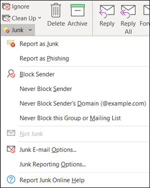
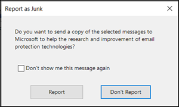

# <a name="install-and-use-the-junk-email-reporting-add-in-for-microsoft-outlook"></a><span data-ttu-id="27c87-103">Instalar y usar el complemento de notificación de correo no deseado para Microsoft Outlook</span><span class="sxs-lookup"><span data-stu-id="27c87-103">Install and use the Junk Email Reporting add-in for Microsoft Outlook</span></span>

[!INCLUDE [Microsoft 365 Defender rebranding](../includes/microsoft-defender-for-office.md)]


> [!NOTE]
> <span data-ttu-id="27c87-104">Si no usa actualmente el complemento de notificación de correo electrónico no deseado, recomendamos el [complemento de mensajes de informe en](enable-the-report-message-add-in.md) su lugar.</span><span class="sxs-lookup"><span data-stu-id="27c87-104">If you aren't currently using the Junk E-mail Reporting add-in, we recommend the [Report Message add-in](enable-the-report-message-add-in.md) instead.</span></span> <span data-ttu-id="27c87-105">Para obtener más información, consulte [Notificar mensajes y archivos a Microsoft](report-junk-email-messages-to-microsoft.md).</span><span class="sxs-lookup"><span data-stu-id="27c87-105">For more information, see [Report messages and files to Microsoft](report-junk-email-messages-to-microsoft.md).</span></span>

<span data-ttu-id="27c87-106">El complemento de notificación de correo no deseado para Microsoft Outlook permite a los usuarios enviar falsos positivos (correo electrónico bueno marcado como correo no deseado), falsos negativos (correo electrónico incorrecto permitido) y mensajes de suplantación de identidad (phishing) a Microsoft.</span><span class="sxs-lookup"><span data-stu-id="27c87-106">The Junk Email Reporting Add-in for Microsoft Outlook allows users to submit false positives (good email marked as spam), false negatives (bad email allowed) and phishing messages to Microsoft.</span></span> <span data-ttu-id="27c87-107">Si su organización no usa la protección en línea de Exchange (por ejemplo, servicios de Exchange o de correo electrónico locales que no sean Exchange Online), el envío de informes de correo no deseado no afectará al filtrado de correo no deseado.</span><span class="sxs-lookup"><span data-stu-id="27c87-107">If your organization doesn't use Exchange Online Protection (for example, on-premises Exchange or email services other than Exchange Online), your junk email report submission will not affect your spam filtering.</span></span>

<span data-ttu-id="27c87-108">En este tema se explica cómo instalar y usar el complemento de notificación de correo no deseado.</span><span class="sxs-lookup"><span data-stu-id="27c87-108">This topic explains how to install and use the Junk Email Reporting add-in.</span></span>

## <a name="what-do-you-need-to-know-before-you-begin"></a><span data-ttu-id="27c87-109">¿Qué necesita saber antes de empezar?</span><span class="sxs-lookup"><span data-stu-id="27c87-109">What do you need to know before you begin?</span></span>

- <span data-ttu-id="27c87-110">Para instalar el complemento de notificación de correo no deseado, consulte la sección [instalar el complemento de notificación de correo no deseado](#install-the-junk-email-reporting-add-in) más adelante en este tema.</span><span class="sxs-lookup"><span data-stu-id="27c87-110">To install the Junk Email Reporting add-in, see the [Install the Junk Email Reporting add-in](#install-the-junk-email-reporting-add-in) section later in this topic.</span></span>

- <span data-ttu-id="27c87-111">El complemento de notificación de correo no deseado funciona con las siguientes versiones de Outlook:</span><span class="sxs-lookup"><span data-stu-id="27c87-111">The Junk Email Reporting add-in works with the following versions of Outlook:</span></span>

  - <span data-ttu-id="27c87-112">Outlook 2013 o posterior</span><span class="sxs-lookup"><span data-stu-id="27c87-112">Outlook 2013 or later</span></span>
  - <span data-ttu-id="27c87-113">Outlook incluido con las aplicaciones de Microsoft 365 para empresas</span><span class="sxs-lookup"><span data-stu-id="27c87-113">Outlook included with Microsoft 365 Apps for enterprise</span></span>

- <span data-ttu-id="27c87-114">Para obtener más información acerca de los informes de mensajes a Microsoft, vea [Informe de mensajes y archivos a Microsoft](report-junk-email-messages-to-microsoft.md).</span><span class="sxs-lookup"><span data-stu-id="27c87-114">For more information about reporting messages to Microsoft, see [Report messages and files to Microsoft](report-junk-email-messages-to-microsoft.md).</span></span>

## <a name="use-the-junk-email-reporting-add-in-to-report-spam-and-phishing-messages"></a><span data-ttu-id="27c87-115">Usar el complemento de notificación de correo no deseado para notificar mensajes de correo no deseado y suplantación de identidad</span><span class="sxs-lookup"><span data-stu-id="27c87-115">Use the Junk Email Reporting add-in to report spam and phishing messages</span></span>

1. <span data-ttu-id="27c87-116">Para los mensajes de la bandeja de entrada o cualquier otra carpeta de correo electrónico excepto correo electrónico no deseado, use cualquiera de los métodos siguientes para notificar mensajes de correo no deseado y suplantación de identidad:</span><span class="sxs-lookup"><span data-stu-id="27c87-116">For messages in the Inbox or any other email folder except Junk Email, use any of the following methods to report spam and phishing messages:</span></span>

   - <span data-ttu-id="27c87-117">Seleccione el mensaje o abra el mensaje.</span><span class="sxs-lookup"><span data-stu-id="27c87-117">Select the message or open the message.</span></span> <span data-ttu-id="27c87-118">En la pestaña **Inicio** o **mensaje** de la cinta de opciones, haga clic en **correo no deseado**y, a continuación, seleccione **informar como correo no deseado** o **notificar como suplantación de identidad**.</span><span class="sxs-lookup"><span data-stu-id="27c87-118">In the **Home** or **Message** tab in the ribbon, click **Junk**, and then select **Report as Junk** or **Report as Phishing**.</span></span>

     

   - <span data-ttu-id="27c87-120">Haga clic con el botón derecho en el mensaje, seleccione **correo no deseado**y, a continuación, seleccione **informar como correo no deseado** o **notificar como phishing**.</span><span class="sxs-lookup"><span data-stu-id="27c87-120">Right-click on the message, select **Junk**, and then select **Report as Junk** or **Report as Phishing**.</span></span>

     

   - <span data-ttu-id="27c87-122">Seleccione varios mensajes, haga clic con el botón derecho y, a continuación, seleccione **notificar como correo no deseado** o **notificar como phishing**.</span><span class="sxs-lookup"><span data-stu-id="27c87-122">Select multiple messages, right-click, and then select **Report as Junk** or **Report as Phishing**.</span></span>

     

2. <span data-ttu-id="27c87-124">En el cuadro de diálogo que aparece, lea la información y haga clic en **Informe**.</span><span class="sxs-lookup"><span data-stu-id="27c87-124">In the dialog that appears, read the information and click **Report**.</span></span> <span data-ttu-id="27c87-125">Si cambia de opinión, haga clic en **no informar**.</span><span class="sxs-lookup"><span data-stu-id="27c87-125">If you change your mind, click **Don't Report**.</span></span>

   

   

3. <span data-ttu-id="27c87-128">Los mensajes seleccionados se enviarán a Microsoft para su análisis y:</span><span class="sxs-lookup"><span data-stu-id="27c87-128">The selected messages will be sent to Microsoft for analysis and:</span></span>

   - <span data-ttu-id="27c87-129">Se ha movido a la carpeta de correo no deseado si se ha notificado como correo no deseado.</span><span class="sxs-lookup"><span data-stu-id="27c87-129">Moved to the Junk Email folder if it was reported as spam.</span></span>
   - <span data-ttu-id="27c87-130">Se elimina si se notificó como suplantación de identidad (phishing).</span><span class="sxs-lookup"><span data-stu-id="27c87-130">Deleted if it was reported as phishing.</span></span>
   
   <span data-ttu-id="27c87-131">Para confirmar que los mensajes se han enviado, abra la carpeta **Mensajes enviados** para ver los mensajes enviados.</span><span class="sxs-lookup"><span data-stu-id="27c87-131">To confirm that the messages have been submitted, open your **Sent Items** folder to view the submitted messages.</span></span>

## <a name="use-the-junk-email-reporting-add-in-to-report-non-spam-and-phishing-messages-from-the-junk-email-folder"></a><span data-ttu-id="27c87-132">Use el complemento de notificación de correo no deseado para informar de mensajes de suplantación de identidad y de correo no deseado de la carpeta correo no deseado</span><span class="sxs-lookup"><span data-stu-id="27c87-132">Use the Junk Email Reporting add-in to report non-spam and phishing messages from the Junk Email folder</span></span>

1. <span data-ttu-id="27c87-133">En la carpeta correo electrónico no deseado, use cualquiera de los métodos siguientes para notificar falsos positivos de correo no deseado o mensajes de suplantación de identidad:</span><span class="sxs-lookup"><span data-stu-id="27c87-133">In the Junk Email folder, use any of the following methods to report spam false positives or phishing messages:</span></span>

   - <span data-ttu-id="27c87-134">Seleccione el mensaje o abra el mensaje.</span><span class="sxs-lookup"><span data-stu-id="27c87-134">Select the message or open the message.</span></span> <span data-ttu-id="27c87-135">En la pestaña **Inicio** o **mensaje** de la cinta de opciones, haga clic en **correo deseado**y, a continuación, seleccione **informar como correo no deseado** o **notificar como suplantación de identidad**.</span><span class="sxs-lookup"><span data-stu-id="27c87-135">In the **Home** or **Message** tab in the ribbon, click **Not Junk**, and then select **Report as Not Junk** or **Report as Phishing**.</span></span>

     

   - <span data-ttu-id="27c87-137">Haga clic con el botón derecho en el mensaje, haga clic en **correo**no deseado y seleccione **notificar como correo no deseado** o **informar como suplantación de identidad**.</span><span class="sxs-lookup"><span data-stu-id="27c87-137">Right-click on the message, click **Junk**, and then select **Report as Not Junk** or **Report as Phishing**.</span></span>

     

   - <span data-ttu-id="27c87-139">Seleccione varios mensajes, haga clic con el botón secundario y, a continuación, seleccione **notificar como correo no deseado** o **informar como suplantación de identidad**.</span><span class="sxs-lookup"><span data-stu-id="27c87-139">Select multiple messages, right-click, and then select **Report as Not Junk** or **Report as Phishing**.</span></span>

     

2. <span data-ttu-id="27c87-141">En el cuadro de diálogo que aparece, lea la información y haga clic en **Informe**.</span><span class="sxs-lookup"><span data-stu-id="27c87-141">In the dialog that appears, read the information and click **Report**.</span></span> <span data-ttu-id="27c87-142">Si cambia de opinión, haga clic en **no informar**.</span><span class="sxs-lookup"><span data-stu-id="27c87-142">If you change your mind, click **Don't Report**.</span></span>

   

   

3. <span data-ttu-id="27c87-145">Los mensajes seleccionados se enviarán a Microsoft para su análisis y:</span><span class="sxs-lookup"><span data-stu-id="27c87-145">The selected messages will be sent to Microsoft for analysis and:</span></span>

   - <span data-ttu-id="27c87-146">Se ha movido a la carpeta de correo no deseado si se ha notificado como correo no deseado.</span><span class="sxs-lookup"><span data-stu-id="27c87-146">Moved to the Junk Email folder if it was reported as spam.</span></span>
   - <span data-ttu-id="27c87-147">Se elimina si se notificó como suplantación de identidad (phishing).</span><span class="sxs-lookup"><span data-stu-id="27c87-147">Deleted if it was reported as phishing.</span></span>

   <span data-ttu-id="27c87-148">Para confirmar que los mensajes se han enviado, abra la carpeta **Mensajes enviados** para ver los mensajes enviados.</span><span class="sxs-lookup"><span data-stu-id="27c87-148">To confirm that the messages have been submitted, open your **Sent Items** folder to view the submitted messages.</span></span>

## <a name="install-the-junk-email-reporting-add-in"></a><span data-ttu-id="27c87-149">Instalar el complemento de notificación de correo no deseado</span><span class="sxs-lookup"><span data-stu-id="27c87-149">Install the Junk Email Reporting add-in</span></span>

- <span data-ttu-id="27c87-150">Debe tener privilegios de administrador en el equipo en el que vaya a instalar el complemento.</span><span class="sxs-lookup"><span data-stu-id="27c87-150">You need to have administrator privileges on the computer where you're installing the add-in.</span></span>

- <span data-ttu-id="27c87-151">Vaya a <https://www.microsoft.com/download/details.aspx?id=18275> y descargue el archivo. msi adecuado para su versión de Office en una ubicación que sea fácil de encontrar:</span><span class="sxs-lookup"><span data-stu-id="27c87-151">Go to <https://www.microsoft.com/download/details.aspx?id=18275> and download the appropriate .msi file for your version of Office to a location that's easy to find:</span></span>

  - <span data-ttu-id="27c87-152">**32 bits**: `Junk Reporting Add-in for Office 2007, 2010, 2013, and 2016 (32-bit).msi`</span><span class="sxs-lookup"><span data-stu-id="27c87-152">**32-bit**: `Junk Reporting Add-in for Office 2007, 2010, 2013, and 2016 (32-bit).msi`</span></span>
  - <span data-ttu-id="27c87-153">**64 bits**: `Junk Reporting Add-in for Office 2007, 2010, 2013, and 2016 (64-bit).msi`</span><span class="sxs-lookup"><span data-stu-id="27c87-153">**64-bit**: `Junk Reporting Add-in for Office 2007, 2010, 2013, and 2016 (64-bit).msi`</span></span>

- <span data-ttu-id="27c87-154">Para Outlook 2013 o versiones posteriores, el único requisito previo es Microsoft .NET Framework 2,0.</span><span class="sxs-lookup"><span data-stu-id="27c87-154">For Outlook 2013 or later, the only prerequisite is the Microsoft .NET Framework 2.0.</span></span> <span data-ttu-id="27c87-155">En Windows 10, no se instala .NET Framework 2,0 desde una descarga.</span><span class="sxs-lookup"><span data-stu-id="27c87-155">In Windows 10, you don't install the .NET Framework 2.0 from a download.</span></span>

### <a name="install-the-junk-email-reporting-add-in-using-the-setup-wizard"></a><span data-ttu-id="27c87-156">Instalar el complemento de notificación de correo no deseado mediante el Asistente para instalación</span><span class="sxs-lookup"><span data-stu-id="27c87-156">Install the Junk Email Reporting Add-in using the Setup wizard</span></span>

1. <span data-ttu-id="27c87-157">En el equipo, cierre Outlook.</span><span class="sxs-lookup"><span data-stu-id="27c87-157">On your computer, close Outlook.</span></span>

2. <span data-ttu-id="27c87-158">En Windows 10, compruebe que .NET Framework 2,0 está habilitado.</span><span class="sxs-lookup"><span data-stu-id="27c87-158">In Windows 10, verify the .NET Framework 2.0 is enabled.</span></span> <span data-ttu-id="27c87-159">Para obtener instrucciones, vea [Habilitar .NET Framework 3,5 en el panel de control](https://docs.microsoft.com/dotnet/framework/install/dotnet-35-windows-10#enable-the-net-framework-35-in-control-panel).</span><span class="sxs-lookup"><span data-stu-id="27c87-159">For instructions, see [Enable the .NET Framework 3.5 in Control Panel](https://docs.microsoft.com/dotnet/framework/install/dotnet-35-windows-10#enable-the-net-framework-35-in-control-panel).</span></span>

3. <span data-ttu-id="27c87-160">Busque el archivo. msi que ha descargado y haga doble clic en él.</span><span class="sxs-lookup"><span data-stu-id="27c87-160">Locate the .msi file you downloaded and double-click on it.</span></span>

4. <span data-ttu-id="27c87-161">En la página de **bienvenida a la instalación del complemento de notificación de correo no deseado de Microsoft**, haga clic en **Siguiente**.</span><span class="sxs-lookup"><span data-stu-id="27c87-161">On the **Welcome to Microsoft Junk Email Reporting Add-in Setup** page, click **Next**.</span></span>

5. <span data-ttu-id="27c87-162">Revise el contrato de licencia, haga clic en **acepto los términos del contrato de licencia** si está de acuerdo con los términos y, a continuación, haga clic en **siguiente**.</span><span class="sxs-lookup"><span data-stu-id="27c87-162">Review the license agreement, click **I accept the terms in the License Agreement** if you agree to the terms, and then click **Next**.</span></span>

6. <span data-ttu-id="27c87-163">Cuando el asistente se haya completado, haga clic en **Finalizar**.</span><span class="sxs-lookup"><span data-stu-id="27c87-163">When the wizard is complete, click **Finish**.</span></span>

<span data-ttu-id="27c87-164">Inicie Outlook.</span><span class="sxs-lookup"><span data-stu-id="27c87-164">Start Outlook.</span></span>

<span data-ttu-id="27c87-p109">Busque el botón **Correo no deseado** en la cinta de Outlook. Ahora podrá notificar mensajes de correo no deseado a Microsoft seleccionando los mensajes de correo no deseado en la Bandeja de entrada y haciendo clic en el botón de **Informar de correo no deseado**.</span><span class="sxs-lookup"><span data-stu-id="27c87-p109">Look for the **Junk** button on your Outlook ribbon. You can now report junk email messages to Microsoft by selecting the junk email messages in your Inbox and clicking the **Report Junk** button.</span></span>

<span data-ttu-id="27c87-p110">Elija la flecha abajo que aparece junto a **Correo no deseado** para ver más opciones, como **Notificar como suplantación de identidad (phishing)** si desea informar a Microsoft sobre correos de suplantación de identidad (phishing). En la carpeta de correo no deseado, también puede seleccionar **Notificar como correo deseado** si un correo electrónico se ha identificado incorrectamente como correo no deseado.</span><span class="sxs-lookup"><span data-stu-id="27c87-p110">Choose the down arrow next to **Junk** for more options such as **Report as Phishing** if you want to report phishing scam emails to Microsoft. In your junk mail folder, you can also select, **Report not junk** if an email was incorrectly identified as junk mail.</span></span>

### <a name="install-the-junk-email-reporting-add-in-using-silent-mode"></a><span data-ttu-id="27c87-169">Instalar el complemento de notificación de correo no deseado en modo silencioso</span><span class="sxs-lookup"><span data-stu-id="27c87-169">Install the Junk Email Reporting Add-In using Silent Mode</span></span>

1. <span data-ttu-id="27c87-170">En el equipo, cierre Outlook.</span><span class="sxs-lookup"><span data-stu-id="27c87-170">On your computer, close Outlook.</span></span>

2. <span data-ttu-id="27c87-171">En Windows 10, instale .NET Framework 2,0 mediante la ejecución del siguiente comando:</span><span class="sxs-lookup"><span data-stu-id="27c87-171">In Windows 10, install the .NET Framework 2.0 by running the following command:</span></span>

   ```dos
   DISM /Online /Enable-Feature /FeatureName:NetFx3 /All
   ```

3. <span data-ttu-id="27c87-172">Para instalar el complemento sin interacción del usuario, abra un símbolo del sistema y use la siguiente sintaxis:</span><span class="sxs-lookup"><span data-stu-id="27c87-172">To install the add-in without any user interaction, open a Command Prompt and use the following syntax:</span></span>

   ```dos
   msiexec /qn /i "<PathToMSIFile>\<MSIFile>" [MaxMessageSelection=<1-50>] [BccEmailAddress="<EmailAddress1>; <EmailAddress2>"...]
   ```

   - <span data-ttu-id="27c87-173">`MaxMessageSelection` especifica el número máximo de mensajes que puede seleccionar para un único envío.</span><span class="sxs-lookup"><span data-stu-id="27c87-173">`MaxMessageSelection` specifies the maximum number of messages that you can select for a single submission.</span></span> <span data-ttu-id="27c87-174">Los valores válidos son de 1 a 50.</span><span class="sxs-lookup"><span data-stu-id="27c87-174">Valid values are from 1 to 50.</span></span> <span data-ttu-id="27c87-175">El valor predeterminado es 15.</span><span class="sxs-lookup"><span data-stu-id="27c87-175">The default value is 15.</span></span>

   - <span data-ttu-id="27c87-176">`BccEmailAddress` especifica los destinatarios de CCO adicionales que recibirán una copia de todos los envíos de usuarios.</span><span class="sxs-lookup"><span data-stu-id="27c87-176">`BccEmailAddress` specifies additional Bcc recipients who will receive a copy of all user submissions.</span></span> <span data-ttu-id="27c87-177">El valor predeterminado está en blanco (ninguno de los destinatarios de CCO adicionales).</span><span class="sxs-lookup"><span data-stu-id="27c87-177">The default value is blank (no additional Bcc recipients).</span></span>

   <span data-ttu-id="27c87-178">En este ejemplo se instala la versión de 64 bits del complemento desde la ruta de acceso especificada con la configuración predeterminada.</span><span class="sxs-lookup"><span data-stu-id="27c87-178">This example installs the 64-bit version of the add-in from the specified path with the default settings.</span></span>

   ```dos
   msiexec /qn /i "C:\Downloads\Junk Reporting Add-in for Office 2007, 2010, 2013, and 2016 (64-bit).msi"
   ```

   <span data-ttu-id="27c87-179">En este ejemplo se instala la versión de 32 bits del complemento desde la ruta de acceso especificada con la siguiente configuración adicional:</span><span class="sxs-lookup"><span data-stu-id="27c87-179">This example installs the 32-bit version of the add-in from the specified path with the following additional settings:</span></span>

   - <span data-ttu-id="27c87-180">Se pueden seleccionar hasta 20 mensajes en un único envío.</span><span class="sxs-lookup"><span data-stu-id="27c87-180">Up to 20 messages can be selected in a single submission.</span></span>
   - <span data-ttu-id="27c87-181">junkreports@contoso.com y hollyd@treyresearch.net reciben copias CCO de todos los envíos.</span><span class="sxs-lookup"><span data-stu-id="27c87-181">junkreports@contoso.com and hollyd@treyresearch.net receive Bcc copies of all submissions.</span></span>

   ```dos
   msiexec /qn /i "C:\Downloads\Junk Reporting Add-in for Office 2007, 2010, 2013, and 2016 (32-bit).msi" MaxMessageSelection=20 BccEmailAddress="junkreports@contoso.com; hollyd@treyresearch.net"
   ```

### <a name="how-do-you-know-this-worked"></a><span data-ttu-id="27c87-182">¿Cómo saber si el proceso se completó correctamente?</span><span class="sxs-lookup"><span data-stu-id="27c87-182">How do you know this worked?</span></span>

<span data-ttu-id="27c87-183">Para comprobar que ha instalado correctamente el complemento de notificación de correo no deseado, siga estos pasos en Outlook:</span><span class="sxs-lookup"><span data-stu-id="27c87-183">To verify that you've successfully installed the Junk Email Reporting Add-in, do the any of the following steps in Outlook:</span></span>

- <span data-ttu-id="27c87-184">Seleccione el mensaje o abra el mensaje.</span><span class="sxs-lookup"><span data-stu-id="27c87-184">Select the message or open the message.</span></span> <span data-ttu-id="27c87-185">En la pestaña **Inicio** o **mensaje** de la cinta de opciones, haga clic en **correo no deseado**y compruebe que están disponibles las siguientes opciones:</span><span class="sxs-lookup"><span data-stu-id="27c87-185">In the **Home** or **Message** tab in the ribbon, click **Junk**, and verify that the following options are available:</span></span>

  - <span data-ttu-id="27c87-186">**Informar como correo no deseado**</span><span class="sxs-lookup"><span data-stu-id="27c87-186">**Report as Junk**</span></span>
  - <span data-ttu-id="27c87-187">**Informar como suplantación de identidad**</span><span class="sxs-lookup"><span data-stu-id="27c87-187">**Report as Phishing**</span></span>
  - <span data-ttu-id="27c87-188">**Opciones de informes no deseados**</span><span class="sxs-lookup"><span data-stu-id="27c87-188">**Junk Reporting Options**</span></span>
  - <span data-ttu-id="27c87-189">**Informar sobre la ayuda en línea de correo**</span><span class="sxs-lookup"><span data-stu-id="27c87-189">**Report Junk Online Help**</span></span>

  

- <span data-ttu-id="27c87-191">Haga clic con el botón derecho en el mensaje, seleccione **correo no deseado**y compruebe que están disponibles las siguientes opciones:</span><span class="sxs-lookup"><span data-stu-id="27c87-191">Right-click on the message, select **Junk**, and verify that the following options are available:</span></span>

  - <span data-ttu-id="27c87-192">**Informar como correo no deseado**</span><span class="sxs-lookup"><span data-stu-id="27c87-192">**Report as Junk**</span></span>
  - <span data-ttu-id="27c87-193">**Informar como suplantación de identidad**</span><span class="sxs-lookup"><span data-stu-id="27c87-193">**Report as Phishing**</span></span>
  - <span data-ttu-id="27c87-194">**Opciones de informes no deseados**</span><span class="sxs-lookup"><span data-stu-id="27c87-194">**Junk Reporting Options**</span></span>
  - <span data-ttu-id="27c87-195">**Informar sobre la ayuda en línea de correo**</span><span class="sxs-lookup"><span data-stu-id="27c87-195">**Report Junk Online Help**</span></span>

  

- <span data-ttu-id="27c87-197">Seleccione varios mensajes, haga clic con el botón secundario y compruebe que están disponibles las siguientes opciones:</span><span class="sxs-lookup"><span data-stu-id="27c87-197">Select multiple messages, right click, and verify that the following options are available:</span></span>

  - <span data-ttu-id="27c87-198">**Informar como correo no deseado**</span><span class="sxs-lookup"><span data-stu-id="27c87-198">**Report as Junk**</span></span>
  - <span data-ttu-id="27c87-199">**Informar como suplantación de identidad**</span><span class="sxs-lookup"><span data-stu-id="27c87-199">**Report as Phishing**</span></span>

  

- <span data-ttu-id="27c87-201">Realice las acciones anteriores de la carpeta **correo electrónico no** deseado y compruebe que las opciones anteriores de informes no **deseado** ya **no son correo no deseado**.</span><span class="sxs-lookup"><span data-stu-id="27c87-201">Do the previous actions in the **Junk Email** folder and verify the previous **Junk** reporting options are now **Not Junk**.</span></span>

  

  

  

## <a name="uninstall-the-junk-email-reporting-add-in"></a><span data-ttu-id="27c87-205">Desinstalar el complemento de notificación de correo no deseado</span><span class="sxs-lookup"><span data-stu-id="27c87-205">Uninstall the Junk Email Reporting Add-in</span></span>

<span data-ttu-id="27c87-206">Después de cerrar Outlook, use cualquiera de los siguientes procedimientos para desinstalar el complemento de notificación de correo no deseado:</span><span class="sxs-lookup"><span data-stu-id="27c87-206">After you close Outlook, use any of the following procedures to uninstall the Junk Email Reporting Add-in:</span></span>

- <span data-ttu-id="27c87-207">**Panel de control**: Presione la tecla Windows + R. En el cuadro de diálogo **Ejecutar** que se abre, escriba `control appwiz.cpl` y, a continuación, haga clic en **Aceptar**.</span><span class="sxs-lookup"><span data-stu-id="27c87-207">**Control Panel**: Press the Windows key + R. In the **Run** dialog that opens, enter `control appwiz.cpl` and then click **OK**.</span></span>

  <span data-ttu-id="27c87-208">Busque y seleccione el **complemento de notificación de correo no deseado de Microsoft** en la lista y, a continuación, haga clic en **desinstalar**.</span><span class="sxs-lookup"><span data-stu-id="27c87-208">Find and select **Microsoft Junk Email Reporting Add-in** in the list, and then click **Uninstall**.</span></span>

- <span data-ttu-id="27c87-209">**Paquete de Windows Installer**: busque o descargue el archivo. msi correspondiente y haga doble clic en él.</span><span class="sxs-lookup"><span data-stu-id="27c87-209">**Windows Installer package**: Find or download the appropriate .msi file, and double-click on it.</span></span>

  - <span data-ttu-id="27c87-210">**32 bits**: `Junk Reporting Add-in for Office 2007, 2010, 2013, and 2016 (32-bit).msi`</span><span class="sxs-lookup"><span data-stu-id="27c87-210">**32-bit**: `Junk Reporting Add-in for Office 2007, 2010, 2013, and 2016 (32-bit).msi`</span></span>

  - <span data-ttu-id="27c87-211">**64 bits**: `Junk Reporting Add-in for Office 2007, 2010, 2013, and 2016 (64-bit).msi`</span><span class="sxs-lookup"><span data-stu-id="27c87-211">**64-bit**: `Junk Reporting Add-in for Office 2007, 2010, 2013, and 2016 (64-bit).msi`</span></span>

  <span data-ttu-id="27c87-212">En el cuadro de diálogo que aparece, seleccione **quitar el complemento de notificación de correo no deseado de Microsoft para Outlook** y, a continuación, haga clic en **siguiente**.</span><span class="sxs-lookup"><span data-stu-id="27c87-212">In the dialog that appears, select **Remove Microsoft Junk Email Reporting Add-in for Outlook** and then click **Next**.</span></span>

- <span data-ttu-id="27c87-213">**Modo silencioso**: busque o descargue el archivo. msi correspondiente.</span><span class="sxs-lookup"><span data-stu-id="27c87-213">**Silent Mode**: Find or download the appropriate .msi file.</span></span> <span data-ttu-id="27c87-214">En una ventana del símbolo del sistema, reemplace \<PathToFile\> por la ubicación del archivo. msi y ejecute uno de los siguientes comandos:</span><span class="sxs-lookup"><span data-stu-id="27c87-214">In a Command Prompt window, replace \<PathToFile\> with the location of the .msi file, and run one of the following commands:</span></span>

  - <span data-ttu-id="27c87-215">**32 bits**:</span><span class="sxs-lookup"><span data-stu-id="27c87-215">**32-bit**:</span></span>

    ```dos
    msiexec /x "<PathToFile>\Junk Reporting Add-in for Office 2007, 2010, 2013, and 2016 (32-bit).msi" /qn MSIRESTARTMANAGERCONTROL="DisableShutdown"
    ```

  - <span data-ttu-id="27c87-216">**64 bits**:</span><span class="sxs-lookup"><span data-stu-id="27c87-216">**64-bit**:</span></span>

    ```dos
    msiexec /x "<PathToFile>\Junk Reporting Add-in for Office 2007, 2010, 2013, and 2016 (64-bit).msi" /qn MSIRESTARTMANAGERCONTROL="DisableShutdown"
    ```

<span data-ttu-id="27c87-217">Al abrir Outlook después de la desinstalación, las opciones de informes de suplantación de identidad (correo no deseado) no deseado deberían desaparecer.</span><span class="sxs-lookup"><span data-stu-id="27c87-217">When you open Outlook after the uninstall, the junk, not junk, and phishing reporting options should be gone.</span></span>

## <a name="troubleshooting-the-junk-email-reporting-add-in"></a><span data-ttu-id="27c87-218">Solución de problemas del complemento de notificación de correo no deseado</span><span class="sxs-lookup"><span data-stu-id="27c87-218">Troubleshooting the Junk Email Reporting add-in</span></span>

<span data-ttu-id="27c87-219">En ocasiones, es posible que experimente problemas con Outlook después de agregar el complemento de notificación de correo no deseado.</span><span class="sxs-lookup"><span data-stu-id="27c87-219">Occasionally, you might experience trouble with Outlook after adding the Junk Email Reporting Add-In.</span></span> <span data-ttu-id="27c87-220">En esta sección se describen los problemas que puede encontrar, junto con sugerencias para resolver estos problemas.</span><span class="sxs-lookup"><span data-stu-id="27c87-220">This section describes problems that you might encounter, along with tips for resolving these issues.</span></span>

### <a name="troubleshooting-for-users"></a><span data-ttu-id="27c87-221">Solución de problemas para usuarios</span><span class="sxs-lookup"><span data-stu-id="27c87-221">Troubleshooting for users</span></span>

<span data-ttu-id="27c87-222">Experimenta uno o varios de los siguientes problemas:</span><span class="sxs-lookup"><span data-stu-id="27c87-222">You experience one or more of the following problems:</span></span>

- <span data-ttu-id="27c87-223">Al hacer clic en **Informar de correo electrónico no deseado**, no ocurre ninguna acción.</span><span class="sxs-lookup"><span data-stu-id="27c87-223">Nothing happens when you click **Report Junk**</span></span>
- <span data-ttu-id="27c87-224">Outlook deja de responder después de seleccionar un mensaje de correo electrónico.</span><span class="sxs-lookup"><span data-stu-id="27c87-224">Outlook stops responding after you select an email message</span></span>
- <span data-ttu-id="27c87-225">El correo no deseado notificado no se puede entregar debido a una respuesta de "no se puede entregar".</span><span class="sxs-lookup"><span data-stu-id="27c87-225">Reported junk mail cannot be delivered due to an "undeliverable" reply</span></span>

<span data-ttu-id="27c87-226">Para solucionar este problema, siga estos pasos:</span><span class="sxs-lookup"><span data-stu-id="27c87-226">To fix this problem, do the following steps:</span></span>

1. <span data-ttu-id="27c87-227">Cierre y reinicie Outlook.</span><span class="sxs-lookup"><span data-stu-id="27c87-227">Close and restart Outlook.</span></span>
2. <span data-ttu-id="27c87-228">Cree y envíe un mensaje de prueba y compruebe que el destinatario recibe el mensaje.</span><span class="sxs-lookup"><span data-stu-id="27c87-228">Create and send a test message, and verify that the recipient received the message.</span></span>
3. <span data-ttu-id="27c87-229">Si el problema continúa, póngase en contacto con el administrador.</span><span class="sxs-lookup"><span data-stu-id="27c87-229">If the problem persists, contact your admin.</span></span>

<span data-ttu-id="27c87-230">Para otros métodos que puede usar para enviar mensajes a Microsoft, consulte [informes de mensajes y archivos a Microsoft](report-junk-email-messages-to-microsoft.md).</span><span class="sxs-lookup"><span data-stu-id="27c87-230">For other methods that you can use to submit messages to Microsoft, see [Report messages and files to Microsoft](report-junk-email-messages-to-microsoft.md).</span></span>

### <a name="troubleshooting-for-admins"></a><span data-ttu-id="27c87-231">Solución de problemas para administradores</span><span class="sxs-lookup"><span data-stu-id="27c87-231">Troubleshooting for admins</span></span>

#### <a name="problem-an-error-message-continually-appears-that-asks-users-to-contact-their-system-administrator"></a><span data-ttu-id="27c87-232">Problema: aparece continuamente un mensaje de error que pide a los usuarios que se pongan en contacto con el administrador del sistema.</span><span class="sxs-lookup"><span data-stu-id="27c87-232">Problem: An error message continually appears that asks users to contact their system administrator</span></span>

1. <span data-ttu-id="27c87-233">Compruebe o establezca la `LoggingLevel` clave del registro en el valor "verbose":</span><span class="sxs-lookup"><span data-stu-id="27c87-233">Verify or set the `LoggingLevel` registry key to the value "Verbose":</span></span>

   - <span data-ttu-id="27c87-234">**Outlook de 32 bits en Windows de 32 bits**:</span><span class="sxs-lookup"><span data-stu-id="27c87-234">**32-bit Outlook on 32-bit Windows**:</span></span>

     ```text
     Windows Registry Editor Version 5.00

     [HKEY_LOCAL_MACHINE\Software\Microsoft\Junk Email Reporting\Addins]
     "LoggingLevel"="Verbose"
     ```

   - <span data-ttu-id="27c87-235">**Outlook de 32 bits en Windows de 64 bits**:</span><span class="sxs-lookup"><span data-stu-id="27c87-235">**32-bit Outlook on 64-bit Windows**:</span></span>

     ```text
     Windows Registry Editor Version 5.00

     [HKEY_LOCAL_MACHINE\Software\Wow6432Node\Microsoft\Junk Email Reporting\Addins]
     "LoggingLevel"="Verbose"
     ```

   - <span data-ttu-id="27c87-236">**Outlook de 64**bits:</span><span class="sxs-lookup"><span data-stu-id="27c87-236">**64-bit Outlook**:</span></span>

     ```text
     Windows Registry Editor Version 5.00

     [HKEY_LOCAL_MACHINE\Software\Microsoft\Junk E-mail Reporting\Addins]
     "LoggingLevel"="Verbose"
     ```

2. <span data-ttu-id="27c87-237">Reinicie Outlook y pida a los usuarios que informen de nuevo cuando vean el mensaje de error.</span><span class="sxs-lookup"><span data-stu-id="27c87-237">Restart Outlook and ask users to report back when they see the error message.</span></span>

3. <span data-ttu-id="27c87-238">Recopile la información de registro de la siguiente ubicación:</span><span class="sxs-lookup"><span data-stu-id="27c87-238">Collect the log information found at the following location:</span></span>

   `%LOCALAPPDATA%\Microsoft\Junk Email Reporting Add-in\SpamReporterAddinLog.txt`

4. <span data-ttu-id="27c87-239">Póngase en contacto con el soporte técnico de Protección en línea de Exchange y proporcione la información de registro.</span><span class="sxs-lookup"><span data-stu-id="27c87-239">Contact Exchange Online Protection Technical Support and provide them with the log information.</span></span>

#### <a name="problem-users-selected-not-to-receive-a-confirmation-prompt-when-they-report-messages-and-now-they-want-the-prompt-back"></a><span data-ttu-id="27c87-240">Problema: los usuarios seleccionaron no recibir un mensaje de confirmación cuando notifican mensajes y ahora quieren que vuelvan a aparecer la pregunta</span><span class="sxs-lookup"><span data-stu-id="27c87-240">Problem: Users selected not to receive a confirmation prompt when they report messages, and now they want the prompt back</span></span>

1. <span data-ttu-id="27c87-241">Cree la `ConfirmReportJunk` clave del registro con el valor "true":</span><span class="sxs-lookup"><span data-stu-id="27c87-241">Create the `ConfirmReportJunk`registry key with the value "True":</span></span>

   ```text
   Windows Registry Editor Version 5.00

   HKEY_CURRENT_USER\Software\Microsoft\Junk E-mail Reporting\Preferences]
   "ConfirmReportJunk"="True"
   ```

2. <span data-ttu-id="27c87-242">Reinicie Outlook.</span><span class="sxs-lookup"><span data-stu-id="27c87-242">Restart Outlook.</span></span>
