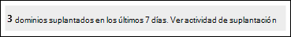

# <a name="spoof-intelligence-insight-in-eop"></a>Suplantación de información de inteligencia en EOP

[!INCLUDE [Microsoft 365 Defender rebranding](../includes/microsoft-defender-for-office.md)]

**Se aplica a**
- [Exchange Online Protection](exchange-online-protection-overview.md)
- [Plan 1 y Plan 2 de Microsoft Defender para Office 365](defender-for-office-365.md)
- [Microsoft 365 Defender](../defender/microsoft-365-defender.md)

> [!NOTE]
> Las características descritas en este artículo están en Versión preliminar, están sujetas a cambios y no están disponibles en todas las organizaciones. Si su organización no tiene las características descritas en este artículo, consulte la experiencia de administración de suplantación de identidad más antigua en Administrar remitentes suplantados con la directiva de inteligencia suplantada y la información de inteligencia suplantada en [EOP](walkthrough-spoof-intelligence-insight.md).

En Microsoft 365 con buzones de correo en organizaciones de Exchange Online o independientes de Exchange Online Protection (EOP) sin buzones de correo Exchange Online, los mensajes de correo electrónico entrantes se protegen automáticamente contra la suplantación. EOP usa **la inteligencia de** suplantación de identidad como parte de la defensa general de su organización contra el phishing. Para obtener más información, vea Protección contra [la suplantación en EOP](anti-spoofing-protection.md).

Cuando un remitente suplanta una dirección de correo electrónico, parece que es un usuario de uno de los dominios de la organización o un usuario de un dominio externo que envía correo electrónico a su organización. Los atacantes que suplanten remitentes para enviar correo no deseado o correo electrónico de suplantación de identidad deben bloquearse. Pero hay escenarios en los que los remitentes legítimos están suplantando. Por ejemplo:

- Escenarios legítimos para suplantar dominios internos:
  - Los remitentes de terceros usan su dominio para enviar correo masivo a sus propios empleados para sondeos de empresa.
  - Una empresa externa genera y envía actualizaciones de productos o publicidad en su nombre.
  - Un asistente debe enviar correo electrónico periódicamente a otra persona dentro de su organización.
  - Una aplicación interna envía notificaciones por correo electrónico.

- Escenarios legítimos para suplantar dominios externos:
  - El remitente está en una lista de correo (también conocida como lista de discusión) y la lista de correo retransmite el correo electrónico del remitente original a todos los participantes de la lista de correo.
  - Una empresa externa envía correo electrónico en nombre de otra compañía (por ejemplo, un informe automatizado o una compañía de software como servicio).

Puede usar  la información de inteligencia suplantada en el portal de Microsoft 365 Defender para identificar rápidamente remitentes suplantados que le envían correo electrónico no autenticado (mensajes de dominios que no pasan comprobaciones de SPF, DKIM o DMARC) y permitir manualmente dichos remitentes.

Al permitir que los remitentes conocidos envíen mensajes falsos desde ubicaciones conocidas, puede reducir los falsos positivos (buen correo electrónico marcado como malo). Al supervisar los remitentes suplantados permitidos, proporciona un nivel de seguridad adicional para evitar que los mensajes no seguros lleguen a la organización.

Del mismo modo, puede revisar remitentes suplantados permitidos por la inteligencia de suplantación de identidad y bloquear manualmente a esos remitentes de la información de inteligencia suplantada.

En el resto de este artículo se explica cómo usar la información de inteligencia de suplantación en el portal de Microsoft 365 Defender y en PowerShell (Exchange Online PowerShell para organizaciones de Microsoft 365 con buzones en Exchange Online; PowerShell EOP independiente para organizaciones sin buzones de Exchange Online).

> [!NOTE]
>
> - Solo los remitentes suplantados detectados por la inteligencia suplantación aparecen en la información de inteligencia suplantada. Cuando se invalida el veredicto permitir o bloquear en la información, el remitente suplantado se convierte en una entrada manual de permitir o bloquear que solo aparece en la pestaña Suplantación de identidad de la lista de permitidos o bloqueados de inquilinos.  También puede crear manualmente entradas de permitir o bloquear para remitentes suplantados antes de que los detecte la inteligencia de suplantación de identidad. Para obtener más información, consulte [Administrar la lista de permitidos y bloqueados del espacio empresarial en EOP](tenant-allow-block-list.md).
>
> - La información sobre la  suplantación de inteligencia y la pestaña Suplantación de dominio de la lista Permitir o bloquear espacio empresarial reemplazan la funcionalidad de la directiva de inteligencia suplantación de dominio que estaba disponible en la página de directiva contra correo no deseado del Centro de seguridad & cumplimiento.
>
>- La información de inteligencia suplantada muestra datos de 7 días. El cmdlet **Get-SpoofIntelligenceInsight** muestra datos de 30 días.

## <a name="what-do-you-need-to-know-before-you-begin"></a>¿Qué necesita saber antes de comenzar?

- Abra el portal de Microsoft 365 Defender en <https://security.microsoft.com/>. Para ir directamente a la **página Anti-phishing,** use <https://security.microsoft.com/antiphishing> . Para ir directamente a la **página Spoof intelligence insight,** use <https://security.microsoft.com/spoofintelligence> .

- Para conectarse al PowerShell de Exchange Online, consulte [Conexión a Exchange Online PowerShell](/powershell/exchange/connect-to-exchange-online-powershell). Para conectarse a EOP PowerShell independiente, consulte [Connect to Exchange Online Protection PowerShell](/powershell/exchange/connect-to-exchange-online-protection-powershell) (Conexión a Exchange Online Protection PowerShell).

- Debe tener permisos asignados en **Exchange Online** antes de poder realizar los procedimientos de este artículo:
  - Para modificar la directiva de inteligencia suplantada o habilitar o deshabilitar la  inteligencia suplantada, debe ser miembro de los grupos de roles Administración de la organización o Administrador **de** seguridad.
  - Para obtener acceso de solo lectura a la directiva de inteligencia suplantada, debe ser miembro de los grupos de roles Lector **global** o Lector **de** seguridad.

  Para obtener más información, consulte los [permisos en Exchange Online](/exchange/permissions-exo/permissions-exo).

  **Notas**:

  - Agregar usuarios al rol de Azure Active Directory correspondiente en el Centro de administración de Microsoft 365 proporciona a los usuarios los permisos necesarios _y_ los permisos para otras características de Microsoft 365. Para obtener más información, vea [Sobre los roles de administrador](../../admin/add-users/about-admin-roles.md).
  - El grupo de roles **Administración de organización de solo lectura** en [Exchange Online](/Exchange/permissions-exo/permissions-exo#role-groups) también proporciona acceso de solo lectura a la característica.

- Habilitas y deshabilitas la inteligencia de suplantación de identidad en directivas contra suplantación de identidad en EOP y Microsoft Defender para Office 365. La inteligencia de suplantación está habilitada de forma predeterminada. Para obtener más información, vea [Configure anti-phishing policies in EOP o](configure-anti-phishing-policies-eop.md) [Configure anti-phishing policies in Microsoft Defender for Office 365](configure-mdo-anti-phishing-policies.md).

- Para obtener la configuración recomendada para la inteligencia de suplantación de identidad, consulte Configuración de directiva [contra suplantación de identidad](recommended-settings-for-eop-and-office365-atp.md#eop-anti-phishing-policy-settings)de EOP .

## <a name="open-the-spoof-intelligence-insight-in-the-microsoft-365-defender-portal"></a>Abra la información de inteligencia de suplantación en el portal Microsoft 365 Defender búsqueda

1. En el portal Microsoft 365 Defender, vaya a Correo electrónico **&** directivas de colaboración & directivas de amenazas de reglas \>  \>  \>  sección \> **Anti-phishing**.

2. En la **página Anti-phishing,** la información de inteligencia suplantación de identidad tiene este aspecto:

   

   La información tiene dos modos:

   - **Modo de información:** si la inteligencia de suplantación está habilitada, la información muestra cuántos mensajes se detectaron mediante la inteligencia de suplantación de dominio durante los últimos siete días.
   - **Modo de** suplantación: si la inteligencia de suplantación  está deshabilitada, la información muestra cuántos mensajes se habrían detectado mediante la inteligencia de suplantación durante los últimos siete días.

Para ver información sobre las detecciones de inteligencia suplantación, haga clic en **Ver** actividad de suplantación en la información de inteligencia suplantación.

### <a name="view-information-about-spoofed-messages"></a>Ver información sobre mensajes suplantados

> [!NOTE]
> Recuerde que en esta página solo aparecen remitentes suplantados detectados por la inteligencia suplantación de identidad. Cuando se invalida el veredicto permitir o bloquear en la información, el remitente suplantado se convierte en una entrada manual de permitir o bloquear que solo aparece en la pestaña Suplantación de identidad de la lista de permitidos o bloqueados de inquilinos. 

En la **página Spoof intelligence insight** que aparece después de hacer clic en **Ver** actividad de suplantación en la información de inteligencia suplantación, la página contiene la siguiente información:

- **Usuario suplantado:** **dominio** del usuario suplantado que se muestra en el **cuadro** De de los clientes de correo electrónico. La dirección De también se conoce como `5322.From` la dirección.
- **Infraestructura de** envío: también conocida como _infraestructura_. La infraestructura de envío será uno de los siguientes valores:
  - El dominio encontrado en una búsqueda DNS inversa (registro PTR) de la dirección IP del servidor de correo electrónico de origen.
  - Si la dirección IP de origen no tiene ningún registro PTR, la infraestructura de envío se identifica como \<source IP\> /24 (por ejemplo, 192.168.100.100/24).
- **Recuento de** mensajes: el número de mensajes de  la combinación del dominio suplantado y la infraestructura de envío a la organización en los últimos 7 días.
- **Vista por última** vez: la última fecha en la que se recibió un mensaje de la infraestructura de envío que contiene el dominio suplantado.
- **Tipo de suplantación:** uno de los siguientes valores:
  - **Interno:** el remitente suplantado está en un dominio que pertenece a su organización (un [dominio aceptado).](/exchange/mail-flow-best-practices/manage-accepted-domains/manage-accepted-domains)
  - **Externo:** el remitente suplantado está en un dominio externo.
- **Action**: este valor es **Allowed** o **Blocked**:
  - **Permitido:** el dominio no pudo comprobar la autenticación explícita de correo [electrónico SPF,](how-office-365-uses-spf-to-prevent-spoofing.md) [DKIM](use-dkim-to-validate-outbound-email.md)y [DMARC](use-dmarc-to-validate-email.md)). Sin embargo, el dominio pasó nuestras comprobaciones implícitas de autenticación de correo electrónico ([autenticación compuesta](email-validation-and-authentication.md#composite-authentication)). Como resultado, no se ha realizado ninguna acción contra la suplantación en el mensaje.
  - **Bloqueado:** los mensajes de la combinación  del dominio suplantado y la infraestructura de envío se marcan como malos por la inteligencia suplantada. La acción que se toma en los mensajes suplantados se controla mediante la directiva contra suplantación de identidad predeterminada o las directivas personalizadas contra suplantación de identidad (el valor predeterminado es **Mover** mensaje a la carpeta correo no deseado ). Para obtener más información, vea [Configure anti-phishing policies in Microsoft Defender for Office 365](configure-mdo-anti-phishing-policies.md).

Puede hacer clic en los encabezados de columna seleccionados para ordenar los resultados.

Para filtrar los resultados, tiene las siguientes opciones:

- Haga clic en **el botón** Filtrar. En el **menú** desplegable Filtro que aparece, puede filtrar los resultados por:
  - **Tipo de suplantación**
  - **Action**
- Use el **cuadro Buscar** para escribir una lista separada por comas de valores de dominio suplantados o enviar valores de infraestructura para filtrar los resultados.

### <a name="view-details-about-spoofed-messages"></a>Ver detalles sobre mensajes suplantados

Al seleccionar una entrada de la lista, aparece un desplegable de detalles que contiene la siguiente información y características:

-  Permitir suplantar o bloquear la suplantación: seleccione uno de estos valores para invalidar el veredicto de suplantación de inteligencia original y mover la entrada de la información de inteligencia de suplantación de dominio a la lista de permitidos o bloqueados de inquilinos como una entrada de permitir o bloquear para la suplantación.
- Por qué lo capturamos.
- Lo que necesita hacer.
- Un resumen de dominio que incluye la mayor parte de la misma información de la página de inteligencia de suplantación principal.
- WhoIs datos sobre el remitente.
- Un vínculo para abrir [el Explorador de amenazas](threat-explorer.md) para ver detalles adicionales sobre el remitente (Microsoft Defender para Office 365).
- Mensajes similares que hemos visto en el inquilino del mismo remitente.

### <a name="about-allowed-spoofed-senders"></a>Acerca de remitentes suplantados permitidos

Un remitente suplantado permitido en la información de inteligencia de suplantación de identidad o un remitente suplantado bloqueado que cambió  manualmente a **Permitir** para suplantación solo permite mensajes de la combinación del dominio suplantado y la infraestructura de envío. No permite el correo electrónico del dominio suplantado desde ningún origen, ni permite el correo electrónico de la infraestructura de envío para ningún dominio.

Por ejemplo, el siguiente remitente suplantado puede suplantación de identidad:

- **Dominio**: gmail.com
- **Infraestructura**: tms.mx.com

Solo se permitirá la suplantación de correo electrónico de ese par de infraestructura de dominio/envío. Otros remitentes que intentan suplantar gmail.com no se permiten automáticamente. Los mensajes de remitentes de otros dominios que se originan en tms.mx.com siguen siendo comprobados por la inteligencia de suplantación de identidad y pueden bloquearse.

## <a name="use-the-spoof-intelligence-insight-in-exchange-online-powershell-or-standalone-eop-powershell"></a>Usar la información de inteligencia de suplantación en Exchange Online PowerShell o PowerShell independiente de EOP

En PowerShell, use el cmdlet **Get-SpoofIntelligenceInsight** para ver remitentes suplantados permitidos y bloqueados detectados por la inteligencia suplantación de identidad.  Para permitir o bloquear manualmente los remitentes suplantados, debe usar el cmdlet **New-TenantAllowBlockListSpoofItems.** Para obtener más información, vea [Use PowerShell to configure the Tenant Allow/Block List](tenant-allow-block-list.md#use-exchange-online-powershell-or-standalone-eop-powershell-to-configure-the-tenant-allowblock-list).

Para ver la información en la información de inteligencia suplantación, ejecute el siguiente comando:

```powershell
Get-SpoofIntelligenceInsight
```

Para obtener información detallada sobre la sintaxis y los parámetros, [vea Get-SpoofIntelligenceInsight](/powershell/module/exchange/get-spoofintelligenceinsight).

## <a name="other-ways-to-manage-spoofing-and-phishing"></a>Otras formas de administrar la suplantación de identidad y la suplantación de identidad

Sea diligente con la suplantación de identidad y la protección contra suplantación de identidad. Estas son formas relacionadas de comprobar los remitentes que suplantan su dominio y ayudar a evitar que dañen la organización:

- Compruebe el **informe de suplantación de correo**. Puede usar este informe con frecuencia para ver y ayudar a administrar remitentes suplantados. Para obtener información, vea [Spoof Detections report](view-email-security-reports.md#spoof-detections-report).

- Revise la configuración del Marco de directivas de remitente (SPF). Para obtener una introducción rápida a SPF y configurarlo rápidamente, consulte [Configuración de SPF en Microsoft 365 para evitar la suplantación de identidad](set-up-spf-in-office-365-to-help-prevent-spoofing.md). Para comprender en detalle cómo Office 365 usa SPF, o para la solución de problemas o las implementaciones no estándar (por ejemplo, implementaciones híbridas), comience con [How Office 365 uses Sender Policy Framework (SPF) to prevent spoofing](how-office-365-uses-spf-to-prevent-spoofing.md).

- Revise la configuración de Correo identificado de DomainKeys (DKIM). Debes usar DKIM además de SPF y DMARC para ayudar a evitar que los atacantes envíen mensajes que parezcan procedentes de tu dominio. DKIM le permite agregar una firma digital a los mensajes de correo electrónico en el encabezado del mensaje. Para obtener información, vea [Use DKIM to validate outbound email sent from your custom domain in Office 365](use-dkim-to-validate-outbound-email.md).

- Revise la configuración de autenticación, informes y conformidad de mensajes basada en dominio (DMARC). Implementar DMARC con SPF y DKIM ofrece protección adicional contra el correo electrónico de suplantación de identidad. DMARC permite a los sistemas que reciben los correos determinar qué hacer con los mensajes enviados desde su dominio que no superan las comprobaciones SPF o DKIM. Para obtener información, vea [Use DMARC to validate email in Office 365](use-dmarc-to-validate-email.md).
