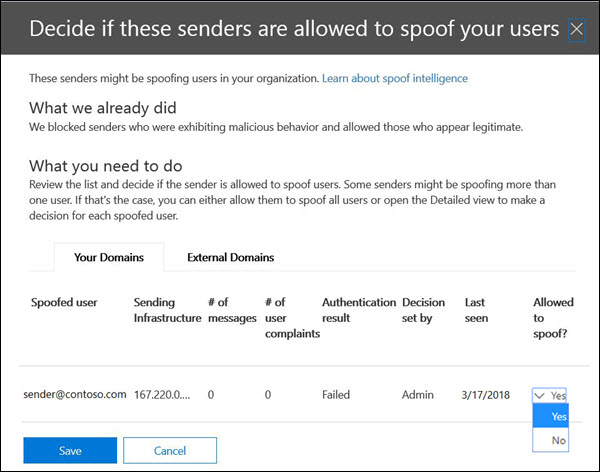

# <a name="configure-spoof-intelligence-in-eop"></a><span data-ttu-id="bb442-103">Configurar inteligencia de identidades en EOP</span><span class="sxs-lookup"><span data-stu-id="bb442-103">Configure spoof intelligence in EOP</span></span>

[!INCLUDE [Microsoft 365 Defender rebranding](../includes/microsoft-defender-for-office.md)]


<span data-ttu-id="bb442-104">En Microsoft 365 organizaciones con buzones de correo en Exchange online o en organizaciones independientes de Exchange Online Protection (EOP) sin buzones de Exchange Online, los mensajes de correo electrónico entrantes se protegen automáticamente contra la suplantación de EOP a través de EOP a partir de 2018 de octubre.</span><span class="sxs-lookup"><span data-stu-id="bb442-104">In Microsoft 365 organizations with mailboxes in Exchange Online or standalone Exchange Online Protection (EOP) organizations without Exchange Online mailboxes, inbound email messages are automatically protected against spoofing by EOP as of October 2018.</span></span> <span data-ttu-id="bb442-105">EOP usa inteligencia simulada como parte de la defensa general de la organización contra el phishing.</span><span class="sxs-lookup"><span data-stu-id="bb442-105">EOP uses spoof intelligence as part of your organization's overall defense against phishing.</span></span> <span data-ttu-id="bb442-106">Para obtener más información, vea [protección contra la suplantación de identidad en EOP](anti-spoofing-protection.md).</span><span class="sxs-lookup"><span data-stu-id="bb442-106">For more information, see [Anti-spoofing protection in EOP](anti-spoofing-protection.md).</span></span>

<span data-ttu-id="bb442-107">Cuando un remitente suplanta una dirección de correo electrónico, parece ser un usuario en uno de los dominios de la organización o un usuario de un dominio externo que envía correo electrónico a su organización.</span><span class="sxs-lookup"><span data-stu-id="bb442-107">When a sender spoofs an email address, they appear to be a user in one of your organization's domains, or a user in an external domain that sends email to your organization.</span></span> <span data-ttu-id="bb442-108">Es necesario bloquear a los intrusos que suplantan a los remitentes para enviar correo no deseado o de suplantación de identidad.</span><span class="sxs-lookup"><span data-stu-id="bb442-108">Attackers who spoof senders to send spam or phishing email need to be blocked.</span></span> <span data-ttu-id="bb442-109">Pero hay escenarios en los que los remitentes legítimos son imitación.</span><span class="sxs-lookup"><span data-stu-id="bb442-109">But there are scenarios where legitimate senders are spoofing.</span></span> <span data-ttu-id="bb442-110">Por ejemplo:</span><span class="sxs-lookup"><span data-stu-id="bb442-110">For example:</span></span>

- <span data-ttu-id="bb442-111">Escenarios legítimos para la suplantación de dominios internos:</span><span class="sxs-lookup"><span data-stu-id="bb442-111">Legitimate scenarios for spoofing internal domains:</span></span>

  - <span data-ttu-id="bb442-112">Los remitentes de terceros usan el dominio para enviar correo masivo a sus propios empleados para los sondeos de la compañía.</span><span class="sxs-lookup"><span data-stu-id="bb442-112">Third-party senders use your domain to send bulk mail to your own employees for company polls.</span></span>
  - <span data-ttu-id="bb442-113">Una compañía externa genera y envía actualizaciones de productos o publicidad en su nombre.</span><span class="sxs-lookup"><span data-stu-id="bb442-113">An external company generates and sends advertising or product updates on your behalf.</span></span>
  - <span data-ttu-id="bb442-114">Un asistente necesita regularmente enviar correo electrónico a otra persona de la organización.</span><span class="sxs-lookup"><span data-stu-id="bb442-114">An assistant regularly needs to send email for another person within your organization.</span></span>
  - <span data-ttu-id="bb442-115">Una aplicación interna envía notificaciones de correo electrónico.</span><span class="sxs-lookup"><span data-stu-id="bb442-115">An internal application sends email notifications.</span></span>

- <span data-ttu-id="bb442-116">Escenarios legítimos para imitar dominios externos:</span><span class="sxs-lookup"><span data-stu-id="bb442-116">Legitimate scenarios for spoofing external domains:</span></span>

  - <span data-ttu-id="bb442-117">El remitente está en una lista de correo (también denominada lista de discusión) y la lista de distribución retransmite el correo electrónico del remitente original a todos los participantes de la lista de distribución de correo.</span><span class="sxs-lookup"><span data-stu-id="bb442-117">The sender is on a mailing list (also known as a discussion list), and the mailing list relays email from the original sender to all the participants on the mailing list.</span></span>
  - <span data-ttu-id="bb442-118">Una compañía externa envía un correo electrónico en nombre de otra empresa (por ejemplo, un informe automatizado o una compañía de software como servicio).</span><span class="sxs-lookup"><span data-stu-id="bb442-118">An external company sends email on behalf of another company (for example, an automated report or a software-as-a-service company).</span></span>

<span data-ttu-id="bb442-119">Inteligencia de identidad suplantada, y concretamente la Directiva de inteligencia de identidad falsa predeterminada (y únicamente), ayuda a garantizar que el correo electrónico falso enviado por remitentes legítimos no se quede atrapado en los filtros de correo no deseado de EOP ni en los sistemas de correo electrónico externos, a la vez que protege a los usuarios de los ataques de phishing o spam.</span><span class="sxs-lookup"><span data-stu-id="bb442-119">Spoof intelligence, and specifically the default (and only) spoof intelligence policy, helps ensure that the spoofed email sent by legitimate senders doesn't get caught up in EOP spam filters or external email systems, while protecting your users from spam or phishing attacks.</span></span>

<span data-ttu-id="bb442-120">Puede administrar inteligencia de identidad en el centro de seguridad & cumplimiento o en PowerShell (Exchange Online PowerShell para Microsoft 365 organizaciones con buzones en Exchange Online; PowerShell de EOP independiente para organizaciones sin buzones de correo de Exchange Online).</span><span class="sxs-lookup"><span data-stu-id="bb442-120">You can manage spoof intelligence in the Security & Compliance Center, or in PowerShell (Exchange Online PowerShell for Microsoft 365 organizations with mailboxes in Exchange Online; standalone EOP PowerShell for organizations without Exchange Online mailboxes).</span></span>

## <a name="what-do-you-need-to-know-before-you-begin"></a><span data-ttu-id="bb442-121">¿Qué necesita saber antes de comenzar?</span><span class="sxs-lookup"><span data-stu-id="bb442-121">What do you need to know before you begin?</span></span>

- <span data-ttu-id="bb442-122">Abra el Centro de seguridad y cumplimiento en <https://protection.office.com/>.</span><span class="sxs-lookup"><span data-stu-id="bb442-122">You open the Security & Compliance Center at <https://protection.office.com/>.</span></span> <span data-ttu-id="bb442-123">Para ir directamente a la página **Configuración contra correo no deseado**, use <https://protection.office.com/antispam>.</span><span class="sxs-lookup"><span data-stu-id="bb442-123">To go directly to the **Anti-spam settings** page, use <https://protection.office.com/antispam>.</span></span> <span data-ttu-id="bb442-124">Para ir directamente a la página de **contra la suplantación de identidad (phishing** ), use <https://protection.office.com/antiphishing> .</span><span class="sxs-lookup"><span data-stu-id="bb442-124">To go directly to the **Anti-phishing** page, use <https://protection.office.com/antiphishing>.</span></span>

- <span data-ttu-id="bb442-125">Para conectarse al PowerShell de Exchange Online, consulte [Conexión a Exchange Online PowerShell](https://docs.microsoft.com/powershell/exchange/connect-to-exchange-online-powershell).</span><span class="sxs-lookup"><span data-stu-id="bb442-125">To connect to Exchange Online PowerShell, see [Connect to Exchange Online PowerShell](https://docs.microsoft.com/powershell/exchange/connect-to-exchange-online-powershell).</span></span> <span data-ttu-id="bb442-126">Para conectarse a EOP PowerShell independiente, consulte [Connect to Exchange Online Protection PowerShell](https://docs.microsoft.com/powershell/exchange/connect-to-exchange-online-protection-powershell) (Conexión a Exchange Online Protection PowerShell).</span><span class="sxs-lookup"><span data-stu-id="bb442-126">To connect to standalone EOP PowerShell, see [Connect to Exchange Online Protection PowerShell](https://docs.microsoft.com/powershell/exchange/connect-to-exchange-online-protection-powershell).</span></span>

- <span data-ttu-id="bb442-127">Para poder realizar los procedimientos de este tema, deberá tener asignados los permisos necesarios:</span><span class="sxs-lookup"><span data-stu-id="bb442-127">You need to be assigned permissions before you can do the procedures in this topic:</span></span>

  - <span data-ttu-id="bb442-128">Para modificar la Directiva de inteligencia de suplantación o habilitar o deshabilitar la inteligencia de identidad, debe pertenecer a uno de los siguientes grupos de roles:</span><span class="sxs-lookup"><span data-stu-id="bb442-128">To modify the spoof intelligence policy or enable or disable spoof intelligence, you need to be a member of one of the following role groups:</span></span>

    - <span data-ttu-id="bb442-129">**Administración de la organización** o **Administrador de seguridad** en el [Centro de seguridad y cumplimiento](permissions-in-the-security-and-compliance-center.md).</span><span class="sxs-lookup"><span data-stu-id="bb442-129">**Organization Management** or **Security Administrator** in the [Security & Compliance Center](permissions-in-the-security-and-compliance-center.md).</span></span>
    - <span data-ttu-id="bb442-130">**Administración de la organización** o **Administración de higiene** en [Exchange Online](https://docs.microsoft.com/Exchange/permissions-exo/permissions-exo#role-groups).</span><span class="sxs-lookup"><span data-stu-id="bb442-130">**Organization Management** or **Hygiene Management** in [Exchange Online](https://docs.microsoft.com/Exchange/permissions-exo/permissions-exo#role-groups).</span></span>

  - <span data-ttu-id="bb442-131">Para obtener acceso de solo lectura a la Directiva de inteligencia empresarial de suplantación de identidad, debe ser miembro de uno de los siguientes grupos de roles:</span><span class="sxs-lookup"><span data-stu-id="bb442-131">For read-only access to the spoof intelligence policy, you need to be a member of one of the following role groups:</span></span>

    - <span data-ttu-id="bb442-132">**Lector de seguridad** en el [Centro de seguridad y cumplimiento](permissions-in-the-security-and-compliance-center.md).</span><span class="sxs-lookup"><span data-stu-id="bb442-132">**Security Reader** in the [Security & Compliance Center](permissions-in-the-security-and-compliance-center.md).</span></span>
    - <span data-ttu-id="bb442-133">**Administración de la organización de solo visualización** en [Exchange Online](https://docs.microsoft.com/Exchange/permissions-exo/permissions-exo#role-groups).</span><span class="sxs-lookup"><span data-stu-id="bb442-133">**View-Only Organization Management** in [Exchange Online](https://docs.microsoft.com/Exchange/permissions-exo/permissions-exo#role-groups).</span></span>

- <span data-ttu-id="bb442-134">Para conocer la configuración recomendada para inteligencia de identidad, consulte [configuración predeterminada de la Directiva de protección contra suplantación de EOP](recommended-settings-for-eop-and-office365-atp.md#eop-default-anti-phishing-policy-settings).</span><span class="sxs-lookup"><span data-stu-id="bb442-134">For our recommended settings for spoof intelligence, see [EOP default anti-phishing policy settings](recommended-settings-for-eop-and-office365-atp.md#eop-default-anti-phishing-policy-settings).</span></span>

## <a name="use-the-security--compliance-center-to-manage-spoofed-senders"></a><span data-ttu-id="bb442-135">Usar el centro de seguridad & cumplimiento para administrar los remitentes suplantados</span><span class="sxs-lookup"><span data-stu-id="bb442-135">Use the Security & Compliance Center to manage spoofed senders</span></span>

> [!NOTE]
> <span data-ttu-id="bb442-136">Si tiene una suscripción de Microsoft 365 Enterprise E5 o ha comprado por separado un complemento de Microsoft defender para Office 365, también puede administrar a los remitentes que están suplantando su dominio mediante el [conocimiento de inteligencia](walkthrough-spoof-intelligence-insight.md)de ti fraudulento.</span><span class="sxs-lookup"><span data-stu-id="bb442-136">If you have an Microsoft 365 Enterprise E5 subscription or have separately purchased a Microsoft Defender for Office 365 add-on, you can also manage senders who are spoofing your domain through the [Spoof Intelligence insight](walkthrough-spoof-intelligence-insight.md).</span></span>

1. <span data-ttu-id="bb442-137">En el Centro de seguridad y cumplimiento, vaya a **Administración de amenazas** \> **Directiva** \> **Correo no deseado**.</span><span class="sxs-lookup"><span data-stu-id="bb442-137">In the Security & Compliance Center, go to **Threat management** \> **Policy** \> **Anti-spam**.</span></span>

2. <span data-ttu-id="bb442-138">En la página **configuración contra correo no deseado** , haga clic en  para expandir la **Directiva de inteligencia empresarial de suplantación**.</span><span class="sxs-lookup"><span data-stu-id="bb442-138">On the **Anti-spam settings** page, click  to expand **Spoof intelligence policy**.</span></span>

   

3. <span data-ttu-id="bb442-140">Realice una de las siguientes selecciones:</span><span class="sxs-lookup"><span data-stu-id="bb442-140">Make one of the following selections:</span></span>

   - <span data-ttu-id="bb442-141">**Revisión de los nuevos remitentes**</span><span class="sxs-lookup"><span data-stu-id="bb442-141">**Review new senders**</span></span>
   - <span data-ttu-id="bb442-142">**Mostrar los remitentes que ya he revisado**</span><span class="sxs-lookup"><span data-stu-id="bb442-142">**Show me senders I already reviewed**</span></span>

4. <span data-ttu-id="bb442-143">En el control flotante **decidir si estos remitentes pueden suplantar a los usuarios** que aparecen, seleccione una de las siguientes pestañas:</span><span class="sxs-lookup"><span data-stu-id="bb442-143">In the **Decide if these senders are allowed to spoof your users** flyout that appears, select one of the following tabs:</span></span>

   - <span data-ttu-id="bb442-144">**Sus dominios**: los remitentes suplantan a los usuarios de los dominios internos.</span><span class="sxs-lookup"><span data-stu-id="bb442-144">**Your Domains**: Senders spoofing users in your internal domains.</span></span>
   - <span data-ttu-id="bb442-145">**Dominios externos**: remitentes de suplantación de usuarios en dominios externos.</span><span class="sxs-lookup"><span data-stu-id="bb442-145">**External Domains**: Senders spoofing users in external domains.</span></span>

5. <span data-ttu-id="bb442-146">Haga clic en  en la columna **¿se permite la suplantación?** .</span><span class="sxs-lookup"><span data-stu-id="bb442-146">Click  in the **Allowed to spoof?** column.</span></span> <span data-ttu-id="bb442-147">Elija **sí** para permitir el remitente suplantado o elija **no** para marcar el mensaje como falsificado.</span><span class="sxs-lookup"><span data-stu-id="bb442-147">Choose **Yes** to allow the spoofed sender, or choose **No** to mark the message as spoofed.</span></span> <span data-ttu-id="bb442-148">La acción se controla mediante la Directiva antiphishing predeterminada o las directivas antiphishing personalizadas (el valor predeterminado es **mover el mensaje a la carpeta de correo electrónico no deseado**).</span><span class="sxs-lookup"><span data-stu-id="bb442-148">The action is controlled by the default anti-phishing policy or custom anti-phishing policies (the default value is **Move message to Junk Email folder**).</span></span> <span data-ttu-id="bb442-149">Para obtener más información, consulte [configuración de la suplantación de identidades en directivas antiphishing](set-up-anti-phishing-policies.md#spoof-settings).</span><span class="sxs-lookup"><span data-stu-id="bb442-149">For more information, see [Spoof settings in anti-phishing policies](set-up-anti-phishing-policies.md#spoof-settings).</span></span>

   

   <span data-ttu-id="bb442-151">En la lista siguiente se explican las columnas y los valores que se ven:</span><span class="sxs-lookup"><span data-stu-id="bb442-151">The columns and values that you see are explained in the following list:</span></span>

   - <span data-ttu-id="bb442-152">**Usuario suplantado**: la cuenta de usuario que se va a imitar.</span><span class="sxs-lookup"><span data-stu-id="bb442-152">**Spoofed user**: The user account that's being spoofed.</span></span> <span data-ttu-id="bb442-153">Este es el remitente del mensaje en la dirección de (también denominada `5322.From` dirección) que se muestra en los clientes de correo electrónico.</span><span class="sxs-lookup"><span data-stu-id="bb442-153">This is the message sender in the From address (also known as the `5322.From` address) that's shown in email clients.</span></span> <span data-ttu-id="bb442-154">SPF no comprueba la validez de esta dirección.</span><span class="sxs-lookup"><span data-stu-id="bb442-154">The validity of this address is not checked by SPF.</span></span>

     - <span data-ttu-id="bb442-155">En la ficha **sus dominios** , el valor contiene una sola dirección de correo electrónico o, si el servidor de correo electrónico de origen imita varias cuentas de usuario, contiene **más de una**.</span><span class="sxs-lookup"><span data-stu-id="bb442-155">On the **Your Domains** tab, the value contains a single email address, or if the source email server is spoofing multiple user accounts, it contains **More than one**.</span></span>

     - <span data-ttu-id="bb442-156">En la ficha **dominios externos** , el valor contiene el dominio del usuario falso, no la dirección de correo electrónico completa.</span><span class="sxs-lookup"><span data-stu-id="bb442-156">On the **External Domains** tab, the value contains the domain of the spoofed user, not the full email address.</span></span>

   - <span data-ttu-id="bb442-157">**Infraestructura de envío**: el dominio que se encuentra en una búsqueda DNS inversa (registro PTR) de la dirección IP del servidor de correo electrónico de origen o en la dirección IP si el origen no tiene registro PTR.</span><span class="sxs-lookup"><span data-stu-id="bb442-157">**Sending Infrastructure**: The domain found in a reverse DNS lookup (PTR record) of the source email server's IP address, or the IP address if the source has no PTR record.</span></span>

     <span data-ttu-id="bb442-158">Para obtener más información acerca de los orígenes de mensajes y los remitentes de mensajes, vea [información general sobre los estándares de mensajes de correo electrónico](how-office-365-validates-the-from-address.md#an-overview-of-email-message-standards).</span><span class="sxs-lookup"><span data-stu-id="bb442-158">For more information about message sources and message senders, see [An overview of email message standards](how-office-365-validates-the-from-address.md#an-overview-of-email-message-standards).</span></span>

   - <span data-ttu-id="bb442-159">**n.º de mensajes**: el número de mensajes de la infraestructura de envío a su organización que contienen los remitentes suplantados que se han especificado en los últimos 30 días.</span><span class="sxs-lookup"><span data-stu-id="bb442-159">**# of messages**: The number of messages from the sending infrastructure to your organization that contain the specified spoofed sender or senders within the last 30 days.</span></span>

   - <span data-ttu-id="bb442-160">**número de quejas del usuario**: quejas archivadas por los usuarios con este remitente en los últimos 30 días.</span><span class="sxs-lookup"><span data-stu-id="bb442-160">**# of user complaints**: Complaints filed by your users against this sender within the last 30 days.</span></span> <span data-ttu-id="bb442-161">Las quejas suelen estar en forma de envíos de correo no deseado a Microsoft.</span><span class="sxs-lookup"><span data-stu-id="bb442-161">Complaints are usually in the form of junk submissions to Microsoft.</span></span>

   - <span data-ttu-id="bb442-162">**Resultado de autenticación**: uno de los siguientes valores:</span><span class="sxs-lookup"><span data-stu-id="bb442-162">**Authentication result**: One of the following values:</span></span>

      - <span data-ttu-id="bb442-163">**Passed**: el remitente ha superado las comprobaciones de autenticación de correo electrónico del remitente (SPF o DKIM).</span><span class="sxs-lookup"><span data-stu-id="bb442-163">**Passed**: The sender passed sender email authentication checks (SPF or DKIM).</span></span>
      - <span data-ttu-id="bb442-164">**Error**: el remitente no pudo realizar comprobaciones de autenticación de remitente de EOP.</span><span class="sxs-lookup"><span data-stu-id="bb442-164">**Failed**: The sender failed EOP sender authentication checks.</span></span>
      - <span data-ttu-id="bb442-165">**Desconocido**: no se conoce el resultado de estas comprobaciones.</span><span class="sxs-lookup"><span data-stu-id="bb442-165">**Unknown**: The result of these checks isn't known.</span></span>

   - <span data-ttu-id="bb442-166">**Decisión definida por**: muestra quién ha determinado si la infraestructura de envío tiene permiso para suplantar al usuario:</span><span class="sxs-lookup"><span data-stu-id="bb442-166">**Decision set by**: Shows who determined if the sending infrastructure is allowed to spoof the user:</span></span>

       - <span data-ttu-id="bb442-167">**Directiva de inteligencia de identidad** (automática)</span><span class="sxs-lookup"><span data-stu-id="bb442-167">**Spoof intelligence policy** (automatic)</span></span>
       - <span data-ttu-id="bb442-168">**Administrador** (manual)</span><span class="sxs-lookup"><span data-stu-id="bb442-168">**Admin** (manual)</span></span>

   - <span data-ttu-id="bb442-169">**Último visto**: la última fecha en la que se recibió un mensaje de la infraestructura de envío que contiene al usuario suplantado.</span><span class="sxs-lookup"><span data-stu-id="bb442-169">**Last seen**: The last date when a message was received from the sending infrastructure that contains the spoofed user.</span></span>

   - <span data-ttu-id="bb442-170">¿Se **permite la suplantación?**: los valores que aparecen aquí son los siguientes:</span><span class="sxs-lookup"><span data-stu-id="bb442-170">**Allowed to spoof?**: The values that you see here are:</span></span>

     - <span data-ttu-id="bb442-171">**Sí**: los mensajes de la combinación de usuario falsificado y la infraestructura de envío están permitidos y no se tratan como correo electrónico falsificado.</span><span class="sxs-lookup"><span data-stu-id="bb442-171">**Yes**: Messages from the combination of spoofed user and sending infrastructure are allowed and not treated as spoofed email.</span></span>

     - <span data-ttu-id="bb442-172">**No**: los mensajes de la combinación de usuario falsificado y infraestructura de envío se marcan como falseados.</span><span class="sxs-lookup"><span data-stu-id="bb442-172">**No**: Messages from the combination of spoofed user and sending infrastructure are marked as spoofed.</span></span> <span data-ttu-id="bb442-173">La acción se controla mediante la Directiva antiphishing predeterminada o las directivas antiphishing personalizadas (el valor predeterminado es **mover el mensaje a la carpeta de correo electrónico no deseado**).</span><span class="sxs-lookup"><span data-stu-id="bb442-173">The action is controlled by the default anti-phishing policy or custom anti-phishing policies (the default value is **Move message to Junk Email folder**).</span></span> <span data-ttu-id="bb442-174">Vea la sección siguiente para obtener más información.</span><span class="sxs-lookup"><span data-stu-id="bb442-174">See the next section for more information.</span></span>

     - <span data-ttu-id="bb442-175">**Algunos usuarios** (**la ficha dominios** solamente): una infraestructura de envío imita a varios usuarios, donde se permiten algunos usuarios suplantados y otros no.</span><span class="sxs-lookup"><span data-stu-id="bb442-175">**Some users** (**Your Domains** tab only): A sending infrastructure is spoofing multiple users, where some spoofed users are allowed and others are not.</span></span> <span data-ttu-id="bb442-176">Use la pestaña **detalles** para ver las direcciones específicas.</span><span class="sxs-lookup"><span data-stu-id="bb442-176">Use the **Detailed** tab to see the specific addresses.</span></span>

6. <span data-ttu-id="bb442-177">En la parte inferior de la página, haga clic en **Guardar**.</span><span class="sxs-lookup"><span data-stu-id="bb442-177">At the bottom of the page, click **Save**.</span></span>

## <a name="use-powershell-to-manage-spoofed-senders"></a><span data-ttu-id="bb442-178">Usar PowerShell para administrar los remitentes suplantados</span><span class="sxs-lookup"><span data-stu-id="bb442-178">Use PowerShell to manage spoofed senders</span></span>

<span data-ttu-id="bb442-179">Para ver los remitentes permitidos y bloqueados en inteligencia de suplantación de identidad, use la siguiente sintaxis:</span><span class="sxs-lookup"><span data-stu-id="bb442-179">To view allowed and blocked senders in spoof intelligence, use the following syntax:</span></span>

```powershell
Get-PhishFilterPolicy [-AllowedToSpoof <Yes | No | Partial>] [-ConfidenceLevel <Low | High>] [-DecisionBy <Admin | SpoofProtection>] [-Detailed] [-SpoofType <Internal | External>]
```

<span data-ttu-id="bb442-180">En este ejemplo se devuelve información detallada sobre todos los remitentes a los que se les permite suplantar usuarios en los dominios.</span><span class="sxs-lookup"><span data-stu-id="bb442-180">This example returns detailed information about all senders that are allowed to spoof users in your domains.</span></span>

```powershell
Get-PhishFilterPolicy -AllowedToSpoof Yes -Detailed -SpoofType Internal
```

<span data-ttu-id="bb442-181">Para obtener información detallada acerca de la sintaxis y los parámetros, consulte [Get-PhishFilterPolicy](https://docs.microsoft.com/powershell/module/exchange/get-phishfilterpolicy).</span><span class="sxs-lookup"><span data-stu-id="bb442-181">For detailed syntax and parameter information, see [Get-PhishFilterPolicy](https://docs.microsoft.com/powershell/module/exchange/get-phishfilterpolicy).</span></span>

<span data-ttu-id="bb442-182">Para configurar los remitentes permitidos y bloqueados en inteligencia de identidad, siga estos pasos:</span><span class="sxs-lookup"><span data-stu-id="bb442-182">To configure allowed and blocked senders in spoof intelligence, follow these steps:</span></span>

1. <span data-ttu-id="bb442-183">Para capturar la lista actual de los remitentes suplantados detectados, escriba el resultado del cmdlet **Get-PhishFilterPolicy** en un archivo CSV:</span><span class="sxs-lookup"><span data-stu-id="bb442-183">Capture the current list of detected spoofed senders by writing the output of the **Get-PhishFilterPolicy** cmdlet to a CSV file:</span></span>

   ```powershell
   Get-PhishFilterPolicy -Detailed | Export-CSV "C:\My Documents\Spoofed Senders.csv"
   ```

2. <span data-ttu-id="bb442-184">Edite el archivo CSV para agregar o modificar los valores de **SpoofedUser** (dirección de correo electrónico) y **AllowedToSpoof** (sí o no).</span><span class="sxs-lookup"><span data-stu-id="bb442-184">Edit the CSV file to add or modify the **SpoofedUser** (email address) and **AllowedToSpoof** (Yes or No) values.</span></span> <span data-ttu-id="bb442-185">Guarde el archivo, lea el archivo y almacene el contenido como una variable llamada `$UpdateSpoofedSenders` :</span><span class="sxs-lookup"><span data-stu-id="bb442-185">Save the file, read the file, and store the contents as a variable named `$UpdateSpoofedSenders`:</span></span>

   ```powershell
   $UpdateSpoofedSenders = Get-Content -Raw "C:\My Documents\Spoofed Senders.csv"
   ```

3. <span data-ttu-id="bb442-186">Use la `$UpdateSpoofedSenders` variable para configurar la Directiva de inteligencia de suplantación de identidad:</span><span class="sxs-lookup"><span data-stu-id="bb442-186">Use the `$UpdateSpoofedSenders` variable to configure the spoof intelligence policy:</span></span>

   ```powershell
   Set-PhishFilterPolicy -Identity Default -SpoofAllowBlockList $UpdateSpoofedSenders
   ```

<span data-ttu-id="bb442-187">Para obtener información detallada acerca de la sintaxis y los parámetros, consulte [set-PhishFilterPolicy](https://docs.microsoft.com/powershell/module/exchange/set-phishfilterpolicy).</span><span class="sxs-lookup"><span data-stu-id="bb442-187">For detailed syntax and parameter information, see [Set-PhishFilterPolicy](https://docs.microsoft.com/powershell/module/exchange/set-phishfilterpolicy).</span></span>

## <a name="use-the-security--compliance-center-to-configure-spoof-intelligence"></a><span data-ttu-id="bb442-188">Usar el centro de seguridad & cumplimiento para configurar la inteligencia de identidad</span><span class="sxs-lookup"><span data-stu-id="bb442-188">Use the Security & Compliance Center to configure spoof intelligence</span></span>

<span data-ttu-id="bb442-189">Las opciones de configuración para inteligencia de suplantación se describen en configuración de suplantación [de identidades en directivas antiphishing](set-up-anti-phishing-policies.md#spoof-settings).</span><span class="sxs-lookup"><span data-stu-id="bb442-189">The configuration options for spoof intelligence are described in [Spoof settings in anti-phishing policies](set-up-anti-phishing-policies.md#spoof-settings).</span></span>

<span data-ttu-id="bb442-190">Puede configurar las opciones de inteligencia contra la suplantación de identidad en la Directiva de antiphishing predeterminada y también en las directivas personalizadas.</span><span class="sxs-lookup"><span data-stu-id="bb442-190">You can configure spoof intelligence settings in the default anti-phishing policy, and also in custom policies.</span></span> <span data-ttu-id="bb442-191">Para obtener instrucciones basadas en su suscripción, consulte uno de los siguientes temas:</span><span class="sxs-lookup"><span data-stu-id="bb442-191">For instructions based on your subscription, see one of the following topics:</span></span>

- <span data-ttu-id="bb442-192">[Configure las directivas contra la suplantación de identidad en EOP](configure-anti-phishing-policies-eop.md).</span><span class="sxs-lookup"><span data-stu-id="bb442-192">[Configure anti-phishing policies in EOP](configure-anti-phishing-policies-eop.md).</span></span>

- <span data-ttu-id="bb442-193">[Configure directivas antiphishing en Microsoft defender para Office 365](configure-atp-anti-phishing-policies.md).</span><span class="sxs-lookup"><span data-stu-id="bb442-193">[Configure anti-phishing policies in Microsoft Defender for Office 365](configure-atp-anti-phishing-policies.md).</span></span>

## <a name="how-do-you-know-these-procedures-worked"></a><span data-ttu-id="bb442-194">¿Cómo saber si estos procedimientos han funcionado?</span><span class="sxs-lookup"><span data-stu-id="bb442-194">How do you know these procedures worked?</span></span>

<span data-ttu-id="bb442-195">Para comprobar que ha configurado inteligencia de suplantación con remitentes a los que se permite y no se permite la suplantación, y que ha configurado la configuración de inteligencia de suplantación de identidad, siga uno de estos pasos:</span><span class="sxs-lookup"><span data-stu-id="bb442-195">To verify that you've configured spoof intelligence with senders who are allowed and not allowed to spoof, and that you've configured the spoof intelligence settings, use any of the following steps:</span></span>

- <span data-ttu-id="bb442-196">En el centro de seguridad & cumplimiento, vaya a **Threat Management** \> **Policy** \> **anti-spam** \> expanda la **Directiva inteligencia empresarial** \> seleccionar **Mostrar los remitentes que ya he revisado** \> Seleccione la pestaña **dominios** o dominios **externos** y compruebe el valor **se permite la suplantación de identidad** para el remitente.</span><span class="sxs-lookup"><span data-stu-id="bb442-196">In the Security & Compliance Center, go to **Threat management** \> **Policy** \> **Anti-spam** \> expand **Spoof intelligence policy** \> select **Show me senders I already reviewed** \> select the **Your Domains** or **External Domains** tab, and verify the **Allowed to spoof?** value for the sender.</span></span>

- <span data-ttu-id="bb442-197">En PowerShell, ejecute los siguientes comandos para ver los remitentes a los que se les permite la suplantación:</span><span class="sxs-lookup"><span data-stu-id="bb442-197">In PowerShell, run the following commands to view the senders who are allowed and not allowed to spoof:</span></span>

  ```powershell
  Get-PhishFilterPolicy -AllowedToSpoof Yes -SpoofType Internal
  Get-PhishFilterPolicy -AllowedToSpoof No -SpoofType Internal
  Get-PhishFilterPolicy -AllowedToSpoof Yes -SpoofType External
  Get-PhishFilterPolicy -AllowedToSpoof No -SpoofType External
  ```

- <span data-ttu-id="bb442-198">En PowerShell, ejecute el siguiente comando para exportar la lista de todos los remitentes suplantados a un archivo CSV:</span><span class="sxs-lookup"><span data-stu-id="bb442-198">In PowerShell, run the following command to export the list of all spoofed senders to a CSV file:</span></span>

   ```powershell
   Get-PhishFilterPolicy -Detailed | Export-CSV "C:\My Documents\Spoofed Senders.csv"
   ```

- <span data-ttu-id="bb442-199">En el centro de seguridad & cumplimiento, vaya a **Threat Management** \> **Policy** \> **anti-** phishing o **ATP anti-phishing** y realice uno de los siguientes pasos:  </span><span class="sxs-lookup"><span data-stu-id="bb442-199">In the Security & Compliance Center, go to **Threat management** \> **Policy**  \> **Anti-phishing**  or **ATP anti-phishing**, and do either of the following steps:</span></span>

  - <span data-ttu-id="bb442-200">Seleccione una directiva de la lista.</span><span class="sxs-lookup"><span data-stu-id="bb442-200">Select a policy from the list.</span></span> <span data-ttu-id="bb442-201">En el control flotante que aparece, compruebe los valores de la sección **suplantación de identidad** .</span><span class="sxs-lookup"><span data-stu-id="bb442-201">In the flyout that appears, verify the values in the **Spoof** section.</span></span>
  - <span data-ttu-id="bb442-202">Haga clic en **directiva predeterminada**.</span><span class="sxs-lookup"><span data-stu-id="bb442-202">Click **Default policy**.</span></span> <span data-ttu-id="bb442-203">En el control flotante que aparece, compruebe los valores de la sección **suplantación de identidad** .</span><span class="sxs-lookup"><span data-stu-id="bb442-203">In the flyout that appears, verify the values in the **Spoof** section.</span></span>

- <span data-ttu-id="bb442-204">En Exchange Online PowerShell, reemplace \<Name\> con la opción predeterminada de Office365 ANTIPHISH o el nombre de una directiva personalizada, y ejecute el siguiente comando para comprobar la configuración:</span><span class="sxs-lookup"><span data-stu-id="bb442-204">In Exchange Online PowerShell, replace \<Name\> with Office365 AntiPhish Default or the name of a custom policy, and run the following command to verify the settings:</span></span>

  ```PowerShell
  Get-AntiPhishPolicy -Identity "<Name>" | Format-List EnableAntiSpoofEnforcement,EnableUnauthenticatedSender,AuthenticationFailAction
  ```

## <a name="other-ways-to-manage-spoofing-and-phishing"></a><span data-ttu-id="bb442-205">Otras formas de administrar la suplantación de identidad (phishing)</span><span class="sxs-lookup"><span data-stu-id="bb442-205">Other ways to manage spoofing and phishing</span></span>

<span data-ttu-id="bb442-206">Sea Diligent sobre la suplantación de identidad y la protección contra phishing.</span><span class="sxs-lookup"><span data-stu-id="bb442-206">Be diligent about spoofing and phishing protection.</span></span> <span data-ttu-id="bb442-207">A continuación, se incluyen formas relacionadas de comprobar si los remitentes suplantan el dominio y ayudar a evitar que dañen la organización:</span><span class="sxs-lookup"><span data-stu-id="bb442-207">Here are related ways to check on senders spoofing your domain and help prevent them from damaging your organization:</span></span>

- <span data-ttu-id="bb442-208">Compruebe el **Informe de correo falsificado**.</span><span class="sxs-lookup"><span data-stu-id="bb442-208">Check the **Spoof Mail Report**.</span></span> <span data-ttu-id="bb442-209">Puede usar este informe con frecuencia para ver y ayudar a administrar los remitentes suplantados.</span><span class="sxs-lookup"><span data-stu-id="bb442-209">You can use this report often to view and help manage spoofed senders.</span></span> <span data-ttu-id="bb442-210">Para obtener información, consulte [Informe de detecciones de suplantación de identidad](view-email-security-reports.md#spoof-detections-report).</span><span class="sxs-lookup"><span data-stu-id="bb442-210">For information, see [Spoof Detections report](view-email-security-reports.md#spoof-detections-report).</span></span>

- <span data-ttu-id="bb442-211">Revise la configuración del marco de directivas de remitente (SPF).</span><span class="sxs-lookup"><span data-stu-id="bb442-211">Review your Sender Policy Framework (SPF) configuration.</span></span> <span data-ttu-id="bb442-212">Para obtener una introducción rápida a SPF y configurarlo rápidamente, consulte [Configuración de SPF en Microsoft 365 para evitar la suplantación de identidad](set-up-spf-in-office-365-to-help-prevent-spoofing.md).</span><span class="sxs-lookup"><span data-stu-id="bb442-212">For a quick introduction to SPF and to get it configured quickly, see [Set up SPF in Microsoft 365 to help prevent spoofing](set-up-spf-in-office-365-to-help-prevent-spoofing.md).</span></span> <span data-ttu-id="bb442-213">Para comprender en detalle cómo Office 365 usa SPF, o para la solución de problemas o las implementaciones no estándar (por ejemplo, implementaciones híbridas), comience con [How Office 365 uses Sender Policy Framework (SPF) to prevent spoofing](how-office-365-uses-spf-to-prevent-spoofing.md).</span><span class="sxs-lookup"><span data-stu-id="bb442-213">For a more in-depth understanding of how Office 365 uses SPF, or for troubleshooting or non-standard deployments such as hybrid deployments, start with [How Office 365 uses Sender Policy Framework (SPF) to prevent spoofing](how-office-365-uses-spf-to-prevent-spoofing.md).</span></span>

- <span data-ttu-id="bb442-214">Revise la configuración de DomainKeys Identified Mail (DKIM).</span><span class="sxs-lookup"><span data-stu-id="bb442-214">Review your DomainKeys Identified Mail (DKIM) configuration.</span></span> <span data-ttu-id="bb442-215">Debe usar DKIM además de SPF y DMARC para ayudar a evitar que los atacantes envíen mensajes que parecen provenir de su dominio.</span><span class="sxs-lookup"><span data-stu-id="bb442-215">You should use DKIM in addition to SPF and DMARC to help prevent attackers from sending messages that look like they are coming from your domain.</span></span> <span data-ttu-id="bb442-216">DKIM le permite agregar una firma digital a los mensajes de correo electrónico en el encabezado del mensaje.</span><span class="sxs-lookup"><span data-stu-id="bb442-216">DKIM lets you add a digital signature to email messages in the message header.</span></span> <span data-ttu-id="bb442-217">Para obtener más información, vea [usar DKIM para validar el correo electrónico saliente enviado desde su dominio personalizado en Office 365](use-dkim-to-validate-outbound-email.md).</span><span class="sxs-lookup"><span data-stu-id="bb442-217">For information, see [Use DKIM to validate outbound email sent from your custom domain in Office 365](use-dkim-to-validate-outbound-email.md).</span></span>

- <span data-ttu-id="bb442-218">Revise la configuración de autenticación de mensajes basada en el dominio, informes y conformidad (DMARC).</span><span class="sxs-lookup"><span data-stu-id="bb442-218">Review your Domain-based Message Authentication, Reporting, and Conformance (DMARC) configuration.</span></span> <span data-ttu-id="bb442-219">Implementar DMARC con SPF y DKIM ofrece protección adicional contra el correo electrónico de suplantación de identidad.</span><span class="sxs-lookup"><span data-stu-id="bb442-219">Implementing DMARC with SPF and DKIM provides additional protection against spoofing and phishing email.</span></span> <span data-ttu-id="bb442-220">DMARC permite a los sistemas que reciben los correos determinar qué hacer con los mensajes enviados desde su dominio que no superan las comprobaciones SPF o DKIM.</span><span class="sxs-lookup"><span data-stu-id="bb442-220">DMARC helps receiving mail systems determine what to do with messages sent from your domain that fail SPF or DKIM checks.</span></span> <span data-ttu-id="bb442-221">Para obtener más información, vea [usar DMARC para validar el correo electrónico en Office 365](use-dmarc-to-validate-email.md).</span><span class="sxs-lookup"><span data-stu-id="bb442-221">For information, see [Use DMARC to validate email in Office 365](use-dmarc-to-validate-email.md).</span></span>
