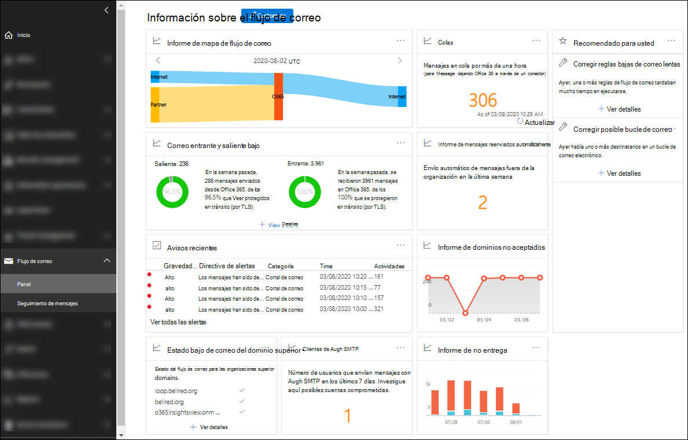

# Reportes de flujo de Correo en el Centro de seguridad y cumplimientoMail flow insights in the Security & Compliance Center

[!INCLUDE [Microsoft 365 Defender rebranding](../includes/microsoft-defender-for-office.md)]

Los administradores pueden usar el panel de flujo de correo en el centro de seguridad & cumplimiento para descubrir tendencias, información y emprender acciones para corregir problemas relacionados con el flujo de correo en su organización.Admins can use Mail flow dashboard in the Security & Compliance Center to discover trends, insights, and take actions to fix issues related to mail flow in their organization.

Los conocimientos disponibles son los siguientes:The available insights are:

- [Información de mensajes reenviados automáticamenteAuto-forwarded messages insight](mfi-auto-forwarded-messages-report.md)

- [Revisión de la información posible del bucle de correo](mfi-mail-loop-insight.md)1[Fix possible mail loop insight](mfi-mail-loop-insight.md)1

- [Corrección de las reglas de flujo de correo lenta Insight](mfi-slow-mail-flow-rules-insight.md)1[Fix slow mail flow rules insight](mfi-slow-mail-flow-rules-insight.md)1

- [Mapa de flujo de correoMail flow map](mfi-mail-flow-map-report.md)

- [Nuevos dominios que se reenvían correo electrónico Insight](mfi-new-domains-being-forwarded-email.md)2[New domains being forwarded email insight](mfi-new-domains-being-forwarded-email.md)2

- [Nuevos usuarios reenvío de correo electrónico Insight](mfi-new-users-forwarding-email.md)2[New users forwarding email insight](mfi-new-users-forwarding-email.md)2

- [Informe de dominios no aceptadosNon-accepted domain report](mfi-non-accepted-domain-report.md)

- [Informe de no entregaNon-delivery report](mfi-non-delivery-report.md)

- [Información de flujo de correo entrante y salienteOutbound and inbound mail flow insight](mfi-outbound-and-inbound-mail-flow.md)

- [Información de colasQueues insight](mfi-queue-alerts-and-queues.md)

- [Información e informes de clientes de autenticación SMTPSMTP Auth clients insight and report](mfi-smtp-auth-clients-report.md)

- [Información de estado de flujo de correo de dominio superiorTop domain mail flow status insight](mfi-domain-mail-flow-status-insight.md)

1 esta información aparece en el área **recomendada para** el panel del flujo de correo solo después de que se detecte el problema.1 This insight appears in the **Recommended for you** area of the Mail flow dashboard only after the issue is detected. De lo contrario, no lo verá.Otherwise, you won't see it.

2 esta información no aparece en el panel de flujo de correo, pero es visible en la página del [Informe de reenvío](view-mail-flow-reports.md#forwarding-report) después de que se detecte el problema.2 This insight doesn't appear on the Mail flow dashboard, but is visible on the [Forwarding report](view-mail-flow-reports.md#forwarding-report) page after the issue is detected. De lo contrario, no lo verá.Otherwise, you won't see it.

## Permisos necesarios para ver el panel de flujo de correoPermissions required to view the Mail flow dashboard

El panel de flujo de correo está disponible para los miembros de los siguientes grupos de roles:The Mail flow dashboard is available to members of the following role groups:

- **Administración** de la organización en el centro de seguridad & cumplimiento (administradores globales).**Organization Management** in the Security & Compliance Center (global admins).

- **[Administrador de Exchange](https://docs.microsoft.com/azure/active-directory/users-groups-roles/directory-assign-admin-roles#exchange-administrator)** en Azure Active Directory.**[Exchange Administrator](https://docs.microsoft.com/azure/active-directory/users-groups-roles/directory-assign-admin-roles#exchange-administrator)** in Azure Active Directory.

- **Administrador de flujo de flujo** en el centro de seguridad & cumplimiento.**MailFlow Administrator** in the Security & Compliance Center. Si la cuenta no es miembro de los grupos de funciones de administración de la organización o administrador de Exchange, tenga en cuenta los siguientes aspectos:If the account is not also a member of the Organization Management or Exchange Administrator role groups, consider the following issues:
  - El usuario debe iniciar sesión en el centro de seguridad & cumplimiento directamente en <https://protection.office.com> .The user must sign in to the Security & Compliance Center directly at <https://protection.office.com>.
  - El usuario solo tendrá permiso de solo lectura en el panel de flujo de correo.The user will only have read-only permission to the Mail flow dashboard.
  - El usuario no tendrá acceso al centro de administración de Microsoft 365.The user won't have access to the Microsoft 365 admin center.

Para obtener más información acerca de los permisos, consulte [permisos en el centro de seguridad & cumplimiento](permissions-in-the-security-and-compliance-center.md) y [proporcionar a los usuarios acceso al centro de seguridad & cumplimiento](grant-access-to-the-security-and-compliance-center.md).For more information about permissions, see [Permissions in the Security & Compliance Center](permissions-in-the-security-and-compliance-center.md) and [Give users access to the Security & Compliance Center](grant-access-to-the-security-and-compliance-center.md).

## Dónde encontrar el panel de flujo de correoWhere to find the Mail flow dashboard

Abra el centro de seguridad & cumplimiento en <https://protection.office.com> , expanda **flujo de correo** y, a continuación, seleccione **Panel**.Open the Security & Compliance Center at <https://protection.office.com>, expand **Mail flow** , and then select **Dashboard**.

Para ir directamente al panel de flujo de correo, Abra <https://protection.office.com/mailflow/dashboard> .To go directly to the Mail flow dashboard, open <https://protection.office.com/mailflow/dashboard>.
