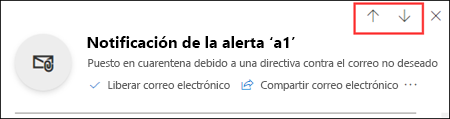
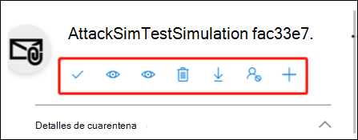
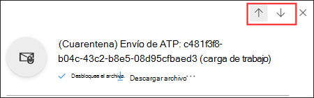

# Administración de mensajes en cuarentena y archivos como administrador en EOP

[!INCLUDE [Microsoft 365 Defender rebranding](../includes/microsoft-defender-for-office.md)]

**Se aplica a**
- [Exchange Online Protection](exchange-online-protection-overview.md)
- [Plan 1 y Plan 2 de Microsoft Defender para Office 365](defender-for-office-365.md)
- [Microsoft 365 Defender](../defender/microsoft-365-defender.md)

En las organizaciones de Microsoft 365 que tienen buzones de Exchange Online o en las organizaciones con Exchange Online Protection (EOP) independientes sin buzones de Exchange Online, la cuarentena retiene los mensajes que pueden ser peligrosos o no deseados. Para obtener más información, vea [Quarantined email messages in EOP](quarantine-email-messages.md).

Los administradores pueden ver, liberar y eliminar todos los tipos de mensajes en cuarentena para todos los usuarios. Los administradores también pueden notificar falsos positivos a Microsoft.

De forma predeterminada, solo los administradores pueden administrar mensajes que se han puesto en cuarentena como malware, phishing de elevada confianza o como resultado de reglas de flujo de correo (también conocidas como reglas de transporte). Sin embargo,  los administradores pueden usar directivas de cuarentena para definir lo que los usuarios pueden hacer a los mensajes en cuarentena en función del motivo por el que el mensaje se ha puesto en cuarentena (para las características compatibles). Para más información, consulte [Políticas de cuarentena](quarantine-policies.md).

Los administradores de organizaciones con Microsoft Defender para Office 365 también pueden administrar archivos puestos en cuarentena por Caja fuerte [Attachments for SharePoint, OneDrive y Microsoft Teams](mdo-for-spo-odb-and-teams.md).

Puede ver y administrar mensajes en cuarentena en el portal de Microsoft 365 Defender o en PowerShell (Exchange Online PowerShell para organizaciones de Microsoft 365 con buzones en Exchange Online; PowerShell de EOP independiente para organizaciones sin Exchange Online buzones de correo).

## ¿Qué necesita saber antes de empezar?

- Para abrir el portal de Microsoft 365 Defender, vaya a <https://security.microsoft.com>. Para ir directamente a la **página Cuarentena,** use <https://security.microsoft.com/quarantine> .

- Para conectarse al PowerShell de Exchange Online, consulte [Conexión a Exchange Online PowerShell](/powershell/exchange/connect-to-exchange-online-powershell). Para conectarse a EOP PowerShell independiente, consulte [Connect to Exchange Online Protection PowerShell](/powershell/exchange/connect-to-exchange-online-protection-powershell) (Conexión a Exchange Online Protection PowerShell).

- Debe tener permisos asignados en **Exchange Online** antes de poder realizar los procedimientos de este artículo:
  - Para realizar acciones en los mensajes en cuarentena para todos los usuarios, debe ser miembro de los grupos de roles Administración de la **organización,** Administrador de seguridad **o** Administrador \* de cuarentena. Para enviar mensajes a Microsoft, debe ser miembro del grupo de roles **Administrador de** seguridad.
  - Para obtener acceso de solo lectura a mensajes en cuarentena para todos los usuarios, debe ser miembro de los grupos de roles Lector **global** o Lector **de** seguridad.

  Para obtener más información, consulte los [permisos en Exchange Online](/exchange/permissions-exo/permissions-exo).

  **Notas**:

  - La adición de usuarios al rol correspondiente de Azure Active Directory en el Centro de administración de Microsoft 365 proporciona a los usuarios los permisos necesarios _y_ los permisos para otras características de Microsoft 365. Para obtener más información, consulte [Acerca de los roles de administrador](../../admin/add-users/about-admin-roles.md).
  - El grupo de roles **Administración de organización de solo lectura** en [Exchange Online](/Exchange/permissions-exo/permissions-exo#role-groups) también proporciona acceso de solo lectura a la característica.
  - \*Los miembros  del grupo de roles Administrador de cuarentena en los roles de colaboración de Correo electrónico **&** en el portal de [Microsoft 365 Defender](permissions-microsoft-365-security-center.md#email--collaboration-roles-in-the-microsoft-365-defender-portal) también deben ser miembros del grupo de roles **Administración** de higiene en [Exchange Online](/Exchange/permissions-exo/permissions-exo#role-groups) para realizar procedimientos de cuarentena en Exchange Online PowerShell.

- Los mensajes en cuarentena se conservan durante un período de tiempo predeterminado en función del motivo por el que se han puesto en cuarentena. Una vez expirado el período de retención, los mensajes se eliminan automáticamente y no se pueden recuperar. Para obtener más información, vea [Quarantined email messages in EOP and Defender for Offie 365](quarantine-email-messages.md).

## Usar el portal Microsoft 365 Defender para administrar mensajes de correo electrónico en cuarentena

### Ver correo electrónico en cuarentena

1. En el portal Microsoft 365 Defender en <https://security.microsoft.com> , vaya a Correo electrónico & **revisar** \> **cuarentena** \> . Para ir directamente a la **página Cuarentena,** use <https://security.microsoft.com/quarantine> .

2. En la **página Cuarentena,** compruebe que la **pestaña Correo** electrónico está seleccionada.

3. Para ordenar los resultados, haga clic en un encabezado de columna disponible. Haga clic en **Personalizar columnas**  para cambiar las columnas que se muestran. Los valores predeterminados están marcados con un asterisco (\*):

   - **Hora de recepción**\*
   - **Asunto**\*
   - **Remitente**\*
   - **Motivo de la cuarentena**\*
   - **Estado de la versión**\*
   - **Tipo de directiva**\*
   - **Expira**\*
   - **Destinatario**
   - **Id. de mensaje**
   - **Nombre de la directiva**
   - **Tamaño del mensaje**
   - **Dirección de correo**
   - **Etiqueta de destinatario**

   Cuando haya terminado, haga clic en **Aplicar**.

4. Para filtrar los resultados, haga clic en **Filtrar**. Los siguientes filtros están disponibles en el control flotante **Filtros** que aparece:
   - **Id. de mensaje**: El identificador único global del mensaje.

     Por ejemplo, usó [el](message-trace-scc.md) seguimiento de mensajes para buscar un mensaje que se envió a un usuario de la organización y se determina que el mensaje se ha puesto en cuarentena en lugar de entregarse. Asegúrese de incluir el valor de identificador de mensaje completo, que puede incluir corchetes angulares ( \<\> ). Por ejemplo: `<79239079-d95a-483a-aacf-e954f592a0f6@XYZPR00BM0200.contoso.com>`.

   - **Dirección del remitente**
   - **Dirección del destinatario**
   - **Subject**
   - **Hora de recepción**: Escriba una **hora de incicio** y **hora de finalización** (fecha).
   - **Expiración**: Filtrar los mensajes según cuando expiran de la cuarentena:
     - **Hoy**
     - **Próximos 2 días**
     - **Próximos 7 días**
     - **Personalizado**: Introduzca una **hora de inicio** y una **hora de finalización** (fecha).
   - **Etiqueta de destinatario**
   - **Motivo de la cuarentena**:
     - **Regla de transporte** (regla de flujo de correo)
     - **Masivo**
     - **Correo no deseado**
     - **Malware:** directivas antimalware en EOP o Caja fuerte de datos adjuntos en Defender para Office 365. El **valor tipo de** directiva indica qué característica se usó.
     - **Phishing:** el veredicto de filtro de correo no deseado era **phishing** o protección contra suplantación de identidad en cuarentena el mensaje [(](set-up-anti-phishing-policies.md#spoof-settings) configuración de suplantación de identidad o [protección de suplantación](set-up-anti-phishing-policies).
     - **Suplantación de identidad de alta confianza**
   - **Destinatario:** **Todos los usuarios** o Solo **yo**. Los usuarios finales solo pueden administrar los mensajes en cuarentena que se les envíen.
   - **Estado de versión**: Cualquiera de los siguientes valores:
     - **Falta por revisar**
     - **Aprobado**
     - **Denegado**
     - **Liberación solicitada**
     - **Fecha de publicación**
   - **Tipo de directiva**: Filtrar mensajes por tipo de directiva:
     - **directiva antimalware**
     - **Directiva de datos adjuntos seguros**
     - **Directiva contra phishing**
     - **Directiva de correo no deseado**
     - **Regla de transporte** (regla de flujo de correo)

   Cuando haya terminado, haga clic en **Aplicar**. Para borrar los filtros, haga clic en el  **Borrar filtros**.

5. Use el **cuadro Buscar** y un valor correspondiente para buscar mensajes específicos. No se admiten los caracteres comodín. Puede buscar según los siguientes valores:
   - Dirección de correo electrónico del remitente
   - Asunto. Use el asunto completo del mensaje. La búsqueda no distingue entre mayúsculas y minúsculas.

   Cuando haya introducido los criterios de búsqueda, pulse Entrar para filtrar los resultados.

Cuando encuentre un mensaje en cuarentena específico, seleccione el mensaje para ver los detalles del mismo y para realizar una acción (por ejemplo, ver, liberar, descargar o eliminar el mensaje).

#### Ver detalles de mensajes en cuarentena

Cuando selecciona un mensaje en cuarentena de la lista, la siguiente información está disponible en el control flotante de detalles que aparece.

- **Id. de mensaje**: El identificador único global para el mensaje. Disponible en el **campo de encabezado Id. de** mensaje en el encabezado del mensaje.
- **Dirección del remitente**
- **Recibido**: La fecha/hora en que se ha recibido el mensaje.
- **Asunto**
- **Motivo de cuarentena:** muestra si un mensaje se ha identificado como **Correo** no deseado **,** Masivo , **Phish**, coincide con una regla de flujo de correo (**regla** de transporte ), o si se identificó como que contiene **malware**.
- **Tipo de directiva**
- **Nombre de la directiva**
- **Número de destinatarios**
- **Destinatarios**: Si el mensaje contiene varios destinatarios, deberá hacer clic en **Vista previa del mensaje** o **Ver encabezado del mensaje** para ver la lista completa de destinatarios.
- **Etiqueta de destinatario:** para obtener más información, vea [Etiquetas de usuario en Microsoft Defender para Office 365](user-tags.md).
- **Expira**: La fecha/hora en que el mensaje se eliminará automática y permanentemente de la cuarentena.
- **Liberado para**: Todas las direcciones de correo electrónico (si corresponde) para las que el mensaje se ha liberado.
- **Todavía no se ha liberado para**: Todas las direcciones de correo electrónico (si corresponde) para las que el mensaje no se ha liberado aún.

Para actuar sobre el mensaje, consulte la siguiente sección.

> [!NOTE]
> Para permanecer en el control flotante de detalles, pero cambiar el mensaje en cuarentena que está visualizando, use las flechas arriba y abajo en la parte superior del control flotante.
>
> 

### Llevar a cabo una acción en un correo electrónico en cuarentena

Después de seleccionar un mensaje en cuarentena de la lista, las siguientes acciones están disponibles en el control flotante de detalles:

-  **Liberar correo** \* electrónico: en el panel desplegable que aparece, configure las siguientes opciones:
  - **Agregar remitente a la lista de** permitidos de la organización: seleccione esta opción para evitar que los mensajes del remitente se pongan en cuarentena.
  - Seleccione una de las opciones siguientes:
    - **Liberar a todos los destinatarios**
    - **Liberar a destinatarios específicos:** seleccione los destinatarios en el cuadro **Destinatarios** que aparece
  - **Enviar una copia de este mensaje a** otros destinatarios: seleccione esta opción y escriba las direcciones de correo electrónico del destinatario en el **cuadro** Destinatarios que aparece.

    > [!NOTE]
    > Para enviar una copia del mensaje a otros destinatarios, también debe liberar el mensaje al menos uno de los destinatarios originales (seleccione **Liberar** a todos los destinatarios o Liberar a destinatarios **específicos).**

  - Enviar el mensaje a Microsoft para mejorar la detección **(falso positivo):** esta opción está seleccionada de forma predeterminada e informa el mensaje erróneamente en cuarentena a Microsoft como falso positivo. Si el mensaje se ha puesto en cuarentena como correo no deseado, masivo, suplantación de identidad (phishing) o que contiene malware, el mensaje también se notifica al equipo de análisis de correo no deseado de Microsoft. En función de los resultados de su análisis, las reglas de filtro de correo no deseado de todo el servicio podrían ajustarse para permitir que el mensaje pase.

  - **Permitir mensajes como este:** esta opción está desactivada de forma predeterminada (  ). Actúelo ( Activar ) para evitar temporalmente que los mensajes con direcciones URL, datos adjuntos y otras propiedades similares se  pongan en cuarentena. Al activar esta opción, están disponibles las siguientes opciones:
    - **Quitar después** de : Seleccione cuánto tiempo desea permitir mensajes como este. Seleccione **de 1 día** a **30 días.** El valor predeterminado es 30.
    - **Nota opcional:** escriba una descripción útil para la allow.

  Cuando haya terminado, haga clic en **Liberar mensaje**.

  Notas sobre cómo liberar mensajes:

  - No puede liberar un mensaje al mismo destinatario más de una vez.
  - Solo los destinatarios que no hayan recibido el mensaje aparecerán en la lista de posibles destinatarios.
  - Solo los  miembros del grupo de roles Administradores de seguridad pueden ver y usar enviar el mensaje a Microsoft para mejorar la detección **(falso positivo)** y Permitir mensajes como **estas** opciones. 

-  **Compartir correo** electrónico: en el menú desplegable que aparece, agregue uno o más destinatarios para recibir una copia del mensaje. Cuando haya terminado, haga clic en **Compartir**.

Las siguientes acciones están disponibles después de hacer clic en el **Más acciones**:

-  icono Ver encabezados del mensaje **Ver encabezados del mensaje**: Seleccione este vínculo para ver el texto del encabezado del mensaje. Aparece el control flotante **Encabezado de mensaje** con los vínculos siguientes:
  - **Copiar el encabezado de mensaje**: Haga clic en este vínculo para copiar el encabezado de mensaje (todos los campos de encabezado) en el portapapeles.
  - **Analizador de encabezados de mensajes de Microsoft**: Para analizar los campos de encabezado y los valores en profundidad, haga clic en este vínculo para ir al Analizador de encabezados de mensajes. Pegue el encabezado del mensaje en la sección **Inserte el encabezado del mensaje que desea analizar** (CTRL+V o haga clic con el botón derecho del ratón y elija **Pegar**) y, a continuación, haga clic en **Analizar encabezados**.

-  **Vista previa de mensaje**: en el control flotante que aparece, elija una de las siguientes pestañas:
  - **Código fuente**: Muestra la versión HTML del cuerpo del mensaje con todos los vínculos desactivados.
  - **Texto sin formato**: Muestra el cuerpo del mensaje como texto sin formato.

-  **Eliminar de cuarentena:** después de hacer clic en **Sí** en la advertencia que aparece, el mensaje se elimina inmediatamente sin enviarse a los destinatarios originales.

-  **Descargar correo electrónico**: En el control flotante que aparece, seleccione **entiendo los riesgos que conlleva la descarga de este mensaje** y, a continuación, haga clic en **Descargar** para guardar una copia local del mensaje en formato .eml.

-  Icono Bloquear remitente **Bloquear remitente**: añade el remitente a la lista de remitentes bloqueados del **Buzón**. Para más información, consulte [Bloquear un remitente de correo](https://support.microsoft.com/office/b29fd867-cac9-40d8-aed1-659e06a706e4).

-  **Enviar solo:** informa del mensaje a Microsoft para su análisis. En el menú desplegable que aparece, elija las siguientes opciones:
  - **Seleccione el tipo de envío**: Correo **electrónico** (predeterminado), **DIRECCIÓN URL** o **Archivo**.
  - **Agregue el identificador de mensaje de red o cargue el archivo de correo** electrónico: Seleccione una de las siguientes opciones:
    - **Agregue el identificador de mensaje de** red de correo electrónico (predeterminado, con el valor correspondiente en el cuadro)
    - Upload el archivo de correo **electrónico (.msg o eml):** haga clic en Examinar archivos para buscar y seleccionar el archivo de mensaje .msg o .eml que se va a enviar. 
  - **Elija un destinatario que tuviera un** problema: seleccione uno (preferido) o más destinatarios originales del mensaje para analizar las directivas que se les aplicaron.
  - **Seleccione un motivo para enviar a Microsoft:** Elija una de las siguientes opciones:
    - **No se debería haber bloqueado (falso positivo)** (valor predeterminado): las siguientes opciones están disponibles:
      - **Permitir mensajes como este:** esta opción está desactivada de forma predeterminada (  ). Actúelo ( Activar ) para evitar temporalmente que los mensajes con direcciones URL, datos adjuntos y otras propiedades similares se  pongan en cuarentena. Al activar esta opción, están disponibles las siguientes opciones:
        - **Quitar después** de : Seleccione cuánto tiempo desea permitir mensajes como este. Seleccione **de 1 día** a **30 días.** El valor predeterminado es 30.
        - **Nota opcional:** escriba una descripción útil para la allow.
    - **Debería haber sido bloqueado (falso negativo).**

  Cuando haya terminado, haga clic en **Enviar**.

\* Esta opción no está disponible para los mensajes que ya se han liberado (el valor del **estado liberado** es **Liberado**).

Si no libera o elimina el mensaje, se eliminará cuando expire el período de retención en cuarentena predeterminado (tal y como se muestra en la columna **Expiración**).

> [!NOTE]
> En un dispositivo móvil, el texto de descripción no está disponible en los iconos de acción.
>
> 
>
> Los iconos en orden y sus correspondientes descripciones se resumen en la siguiente tabla:
>
> |Icono|Descripción|
> |---:|---|
> ||**Liberar correo electrónico**|
> ||**Compartir correo electrónico**|
> ||**Ver encabezados de mensaje**|
> ||**Vista previa de mensaje**|
> ||**Eliminar de la cuarentena**|
> ||**Descargar correo electrónico**|
> ||**Bloquear remitente**|
> ||**Enviar solo**|

#### Realice una acción en varios mensajes de correo electrónico en cuarentena

Cuando se seleccionan varios mensajes en cuarentena en la lista (hasta 100) haciendo clic en el área en blanco situada a la izquierda de la primera columna, aparece la lista desplegable **Acciones masivas** en la que se pueden realizar las siguientes acciones:

-  **Liberar mensajes:** libera mensajes a todos los destinatarios. En el menú desplegable que aparece, puede elegir las siguientes opciones, que son las mismas que al liberar un solo mensaje:
  - **Agregar remitente a la lista de permitidos de la organización**
  - **Enviar una copia de este mensaje a otros destinatarios**
  - **Enviar el mensaje a Microsoft para mejorar la detección (falso positivo)**
  - **Permitir mensajes como este:**
    - **Quitar después** de : **1 día** a **30 días**
    - **Nota opcional**

  Cuando haya terminado, haga clic en **Liberar mensaje**.

  > [!NOTE]
  > Tenga en cuenta el siguiente escenario: john@gmail.com envía un mensaje a faith@contoso.com y john@subsidiary.contoso.com. Gmail bifurca este mensaje en dos copias que se enrutan a la cuarentena como phishing en Microsoft. Un administrador libera ambos mensajes para admin@contoso.com. Se entrega el primer mensaje publicado que llega al buzón de administración. El segundo mensaje liberado se identifica como entrega duplicada y se omite. Los mensajes se identifican como duplicados si tienen el mismo identificador de mensaje y el mismo tiempo recibido.

-  **Eliminar mensajes:** después de hacer clic en **Sí** en la advertencia que aparece, los mensajes se quitan inmediatamente de la cuarentena sin que se envíen a los destinatarios originales.
-  **Descargar mensajes**
-  **Enviar solo**

## Use el portal Microsoft 365 Defender para administrar archivos en cuarentena en Defender para Office 365

> [!NOTE]
> Los procedimientos para los archivos en cuarentena de esta sección solo están disponibles para Microsoft Defender Office 365 suscriptores del Plan 1 o plan 2.

En organizaciones con Defender para Office 365, los administradores pueden administrar archivos que fueron puestos en cuarentena por Caja fuerte datos adjuntos para SharePoint, OneDrive y Microsoft Teams. Para habilitar la protección de estos archivos, vea Activar Caja fuerte datos adjuntos para [SharePoint, OneDrive y Microsoft Teams](turn-on-mdo-for-spo-odb-and-teams.md).

### Ver archivos en cuarentena

1. En el portal Microsoft 365 Defender en <https://security.microsoft.com> , vaya a Correo electrónico & **revisar** \> **cuarentena** \> . Para ir directamente a la **página Cuarentena,** use <https://security.microsoft.com/quarantine> .

2. En la **página Cuarentena,** seleccione la **pestaña Archivos** (**El correo** electrónico es la pestaña predeterminada).

3. Para ordenar los resultados, haga clic en un encabezado de columna disponible. Haga **clic en** Personalizar columnas para cambiar las columnas que se muestran. Las columnas predeterminadas se marcan con un asterisco ( \* ):
   - **Usuario**\*
   - **Ubicación**\*
   - **Nombre de archivo adjunto**\*
   - **DIRECCIÓN URL de archivo**\*
   - **File Size**.
   - **Estado de la versión**\*
   - **Expira**\*
   - **Detectado por**
   - **Modificado por hora**

   Cuando haya terminado, haga clic **en Aplicar** o **Cancelar**.

4. Para filtrar los resultados, haga clic en **Filtrar**. Los siguientes filtros están disponibles en el control flotante **Filtros** que aparece:
   - **Hora recibida:** **Hora de inicio** y Hora de **finalización** (fecha).
   - **Expira:** **Hora de inicio y** **Hora de finalización** (fecha).
   - **Motivo de cuarentena:** el único valor disponible es **Malware**.
   - **Tipo de directiva**

   Cuando haya terminado, haga clic **en Aplicar** o **Cancelar**.

Después de encontrar un archivo en cuarentena específico, seleccione el archivo para ver detalles sobre él y para realizar acciones al respecto (por ejemplo, ver, liberar, descargar o eliminar el archivo).

#### Ver detalles del archivo en cuarentena

Al seleccionar un archivo en cuarentena de la lista, la siguiente información está disponible en el control desplegable de detalles que se abre:

- **Nombre de archivo**
- **Dirección URL de** archivo: dirección URL que define la ubicación del archivo (por ejemplo, en SharePoint online).
- **Contenido malintencionado detectado en** La fecha y hora en que el archivo se ha puesto en cuarentena.
- **Expira:** la fecha en la que el archivo se eliminará de la cuarentena.
- **Detectado por**
- **¿Liberado?**
- **Nombre de malware**
- **Id. de** documento: identificador único del documento.
- **Tamaño de archivo:** en kilobytes (KB).
- **Organización** Id. único de la organización.
- **Última modificación**
- **Modified By:** el usuario que modificó por última vez el archivo.
- Valor de algoritmo hash seguro de **256 bits (SHA-256):** puede usar este valor hash para identificar el archivo en otros almacenes de reputación o en otras ubicaciones del entorno.

Para realizar acciones en el archivo, consulte la siguiente sección.

> [!NOTE]
> Para permanecer en el control desplegable de detalles, pero cambiar el archivo en cuarentena que está viendo, use las flechas arriba y abajo en la parte superior del control desplegable.
>
> 

### Realizar acciones en archivos en cuarentena

Después de seleccionar un archivo en cuarentena de la lista, las siguientes acciones están disponibles en el control desplegable de detalles:

-  **Archivo de versión:** en el panel desplegable que aparece, active o desactive Archivos de informe en Microsoft para su análisis y, a continuación, haga \* clic en **Liberar**. 
- 
-  **Descargar archivo:** en el menú desplegable que aparece, seleccione Comprender los riesgos  de descargar este archivo y, a continuación, haga clic en Descargar para guardar una copia local del archivo.
-  **Eliminar de la cuarentena:** después de hacer clic en **Sí** en la advertencia que aparece, el archivo se elimina inmediatamente.
-  Icono Bloquear remitente **Bloquear remitente**: añade el remitente a la lista de remitentes bloqueados del **Buzón**. Para más información, consulte [Bloquear un remitente de correo](https://support.microsoft.com/office/b29fd867-cac9-40d8-aed1-659e06a706e4).

\* Esta opción no está disponible para los archivos que ya se han publicado (el **valor de estado** Liberado es **Released**).

Si no libera o quita el archivo, se eliminará después de que expire el período de retención de cuarentena predeterminado (como se muestra en la **columna** Expira).

#### Realizar acciones en varios archivos en cuarentena

Al seleccionar varios archivos en cuarentena en la lista (hasta 100) haciendo clic en  el área en blanco a la izquierda de la columna **Asunto,** aparece la lista desplegable Acciones masivas donde puede realizar las siguientes acciones:

-  **Archivo de versión:** en el panel desplegable que aparece, active o desactive Archivos de informe en **Microsoft** para su análisis y, a continuación, haga clic en **Liberar**.
-  **Eliminar de la cuarentena:** después de hacer clic en **Sí** en la advertencia que aparece, el archivo se elimina inmediatamente.
-  **Descargar archivo:** en el menú desplegable que aparece, seleccione Comprender los riesgos  de descargar este archivo y, a continuación, haga clic en Descargar para guardar una copia local del archivo.

## Usar Exchange Online PowerShell o PowerShell de EOP independiente para ver y administrar mensajes y archivos en cuarentena

Los cmdlets que se usan para ver y administrar mensajes y archivos en cuarentena se describen en la siguiente lista:

- [Delete-QuarantineMessage](/powershell/module/exchange/delete-quarantinemessage)
- [Export-QuarantineMessage](/powershell/module/exchange/export-quarantinemessage)
- [Get-QuarantineMessage](/powershell/module/exchange/get-quarantinemessage)
- [Preview-QuarantineMessage:](/powershell/module/exchange/preview-quarantinemessage)tenga en cuenta que este cmdlet solo es para mensajes, no archivos en cuarentena de datos adjuntos de Caja fuerte para SharePoint, OneDrive y Microsoft Teams.
- [Release-QuarantineMessage](/powershell/module/exchange/release-quarantinemessage)

## Más información

[Preguntas más frecuentes sobre mensajes en cuarentena](quarantine-faq.yml)
