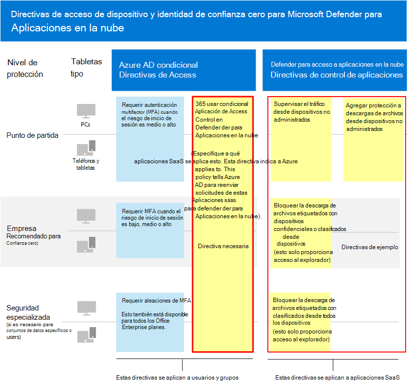
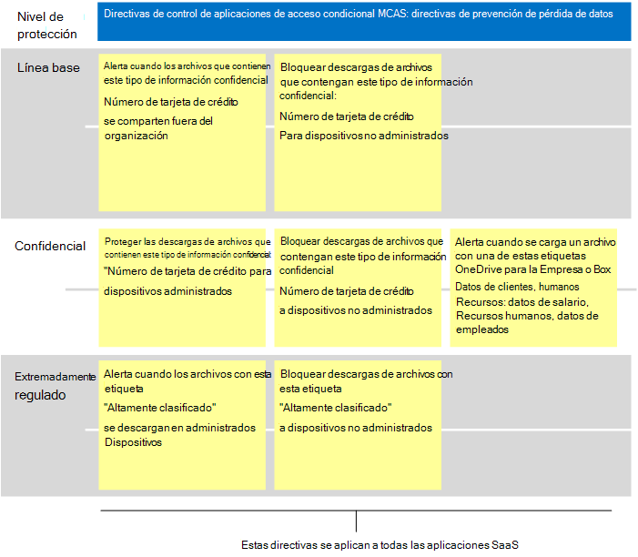

# Directivas recomendadas de Microsoft Cloud App Security para aplicaciones SaaSRecommended Microsoft Cloud App Security policies for SaaS apps
Microsoft Cloud App Security se basa en directivas de acceso condicional de Azure AD para permitir la supervisión y el control en tiempo real de acciones granulares con aplicaciones SaaS, como bloquear descargas, cargas, copiar y pegar e imprimir.Microsoft Cloud App Security builds on Azure AD conditional access policies to enable real-time monitoring and control of granular actions with SaaS apps, such as blocking downloads, uploads, copy and paste, and printing. Esta característica agrega seguridad a las sesiones que conllevan riesgos inherentes, como cuando se accede a los recursos corporativos desde dispositivos no administrados o por usuarios invitados.This feature adds security to sessions that carry inherent risk, such as when corporate resources are accessed from unmanaged devices or by guest users.

Microsoft Cloud App Security también se integra de forma nativa con Microsoft Information Protection, lo que proporciona inspección de contenido en tiempo real para buscar datos confidenciales basados en tipos de información confidencial y etiquetas de confidencialidad y tomar las medidas adecuadas.Microsoft Cloud App Security also integrates natively with Microsoft Information Protection, providing real-time content inspection to find sensitive data based on sensitive information types and sensitivity labels and to take appropriate action.

Esta guía incluye recomendaciones para estos escenarios:This guidance includes recommendations for these scenarios:

- Llevar aplicaciones SaaS a la administración de ITBring SaaS apps into IT management
- Ajustar la protección para aplicaciones SaaS específicasTune protection for specific SaaS apps
- Configurar la prevención de pérdida de datos (DLP) para ayudar a cumplir con las normativas de protección de datosConfigure data loss prevention (DLP) to help comply with data protection regulations

## Llevar aplicaciones SaaS a la administración de ITBring SaaS apps into IT management

El primer paso para usar Microsoft Cloud App Security para administrar aplicaciones SaaS es descubrirlas y luego agregarlas al inquilino de Azure AD.The first step in using Microsoft Cloud App Security to manage SaaS apps is to discover these and then add them to your Azure AD tenant. Si necesitas ayuda con la detección, consulta [Descubrir y administrar aplicaciones SaaS en la red.](/cloud-app-security/tutorial-shadow-it)If you need help with discovery, see [Discover and manage SaaS apps in your network](/cloud-app-security/tutorial-shadow-it). Después de descubrir aplicaciones, [agrégrelos a su inquilino de Azure AD](/azure/active-directory/manage-apps/add-application-portal).After you've discovered apps, [add these to your Azure AD tenant](/azure/active-directory/manage-apps/add-application-portal).

Puede empezar a administrarlos haciendo lo siguiente:You can begin to manage these by doing the following:

1. En primer lugar, en Azure AD, cree una nueva directiva de acceso condicional y configúrela para "Usar control de aplicaciones de acceso condicional".First, in Azure AD, create a new conditional access policy and configure it to "Use Conditional Access App Control." Esto redirige la solicitud a Cloud App Security.This redirects the request to Cloud App Security. Puedes crear una directiva y agregar todas las aplicaciones SaaS a esta directiva.You can create one policy and add all SaaS apps to this policy.
1. A continuación, en Cloud App Security, cree directivas de sesión.Next, in Cloud App Security, create session policies. Cree una directiva para cada control que desee aplicar.Create one policy for each control you want to apply.

Los permisos para aplicaciones SaaS suelen basarse en la necesidad empresarial de acceso a la aplicación.Permissions to SaaS apps are typically based on business need for access to the app. Estos permisos pueden ser muy dinámicos.These permissions can be highly dynamic. El uso de directivas de Cloud App Security garantiza la protección de los datos de la aplicación, independientemente de si los usuarios están asignados a un grupo de Azure AD asociado con la protección de línea base, confidencial o altamente regulada.Using Cloud App Security policies ensures protection to app data, regardless of whether users are assigned to an Azure AD group associated with baseline, sensitive, or highly regulated protection.

Para proteger los datos en toda la colección de aplicaciones SaaS, en el siguiente diagrama se muestra la directiva de acceso condicional de Azure AD necesaria y las directivas sugeridas que puede crear en Cloud App Security.To protect data across your collection of SaaS apps, the following diagram illustrates the necessary Azure AD conditional access policy plus suggested policies you can create in Cloud App Security. En este ejemplo, las directivas creadas en Cloud App Security se aplican a todas las aplicaciones SaaS que se administran.In this example, the policies created in Cloud App Security apply to all SaaS apps you are managing. Están diseñados para aplicar controles adecuados en función de si los dispositivos se administran, así como de las etiquetas de confidencialidad que ya se aplican a los archivos.These are designed to apply appropriate controls based on whether devices are managed as well as sensitivity labels that are already applied to files.

En la tabla siguiente se muestra la nueva directiva de acceso condicional que debe crear en Azure AD.The following table lists the new conditional access policy you must create in Azure AD.

|Nivel de protecciónProtection level|PolicyPolicy|Más informaciónMore information|
|---|---|---|
|Todos los niveles de protecciónAll protection levels|[Usar el control de aplicaciones de acceso condicional en Cloud App SecurityUse Conditional Access App Control in Cloud App Security](/cloud-app-security/proxy-deployment-aad#configure-integration-with-azure-ad)|Esto configura el IdP (Azure AD) para que funcione con Cloud App Security.This configures your IdP (Azure AD) to work with Cloud App Security.|
||||

En esta tabla siguiente se enumeran las directivas de ejemplo ilustradas anteriormente que puede crear para proteger todas las aplicaciones SaaS.This next table lists the example policies illustrated above that you can create to protect all SaaS apps. Asegúrese de evaluar sus propios objetivos de negocio, seguridad y cumplimiento y, a continuación, cree directivas que proporcionen la protección más adecuada para su entorno.Be sure to evaluate your own business, security, and compliance objectives and then create policies that provide the most appropriate protection for your environment.

|Nivel de protecciónProtection level|PolicyPolicy|
|---|---|
|Línea baseBaseline|Supervisar el tráfico desde dispositivos no administradosMonitor traffic from unmanaged devices 
 Agregar protección a descargas de archivos desde dispositivos no administradosAdd protection to file downloads from unmanaged devices|
|ConfidencialSensitive|Bloquear la descarga de archivos etiquetados con dispositivos confidenciales o clasificados desde dispositivos no administrados (esto solo proporciona acceso al explorador)Block download of files labeled with sensitive or classified from unmanaged devices (this provides browser only access)|
|Extremadamente reguladoHighly regulated|Bloquear la descarga de archivos etiquetados con clasificados desde todos los dispositivos (esto solo proporciona acceso al explorador)Block download of files labeled with classified from all devices (this provides browser only access)|
|||

Para obtener instrucciones de extremo a extremo para configurar el control de aplicaciones de acceso condicional, vea [Deploy Conditional Access App Control for featured apps](/cloud-app-security/proxy-deployment-aad).For end-to-end instructions for setting up Conditional Access App Control, see [Deploy Conditional Access App Control for featured apps](/cloud-app-security/proxy-deployment-aad). En este artículo se explica el proceso de creación de la directiva de acceso condicional necesaria en Azure AD y la prueba de las aplicaciones SaaS.This article walks you through the process of creating the necessary conditional access policy in Azure AD and testing your SaaS apps.

Para obtener más información, vea [Protect apps with Microsoft Cloud App Security Conditional Access App Control](/cloud-app-security/proxy-intro-aad).For more information, see [Protect apps with Microsoft Cloud App Security Conditional Access App Control](/cloud-app-security/proxy-intro-aad).

## Ajustar la protección para aplicaciones SaaS específicasTune protection for specific SaaS apps

Es posible que quieras aplicar controles y supervisión adicionales a aplicaciones SaaS específicas de tu entorno.You might want to apply additional monitoring and controls to specific SaaS apps in your environment. Cloud App Security te permite hacerlo.Cloud App Security allows you to accomplish this. Por ejemplo, si una aplicación como Box se usa en gran medida en el entorno, tiene sentido aplicar controles adicionales.For example, if an app like Box is used heavily in your environment, it makes sense to apply additional controls. O bien, si tu departamento jurídico o financiero usa una aplicación SaaS específica para datos empresariales confidenciales, puedes dirigirte a protección adicional a estas aplicaciones.Or, if your legal or finance department is using a specific SaaS app for sensitive business data, you can target extra protection to these apps.

Por ejemplo, puede proteger el entorno box con estos tipos de plantillas de directiva de detección de anomalías integradas:For example, you can protect your Box environment with these types of built-in anomaly detection policy templates:

- Actividad desde direcciones IP anónimasActivity from anonymous IP addresses
- Actividad de un país poco frecuenteActivity from infrequent country
- Actividad desde direcciones IP sospechosasActivity from suspicious IP addresses
- Desplazamiento imposibleImpossible travel
- Actividad realizada por el usuario terminado (requiere AAD como IdP)Activity performed by terminated user (requires AAD as IdP)
- Detección de malwareMalware detection
- Varios intentos de inicio de sesión con erroresMultiple failed login attempts
- Actividad ransomwareRansomware activity
- Risky Oauth AppRisky Oauth App
- Actividad de recurso compartido de archivos inusualUnusual file share activity

Estos son ejemplos.These are examples. Las plantillas de directiva adicionales se agregan de forma regular.Additional policy templates are added on a regular basis. Para obtener ejemplos de cómo aplicar protección adicional a aplicaciones específicas, consulta [Protección de aplicaciones conectadas.](/cloud-app-security/protect-connected-apps)For examples of how to apply additional protection to specific apps, see [Protecting connected apps](/cloud-app-security/protect-connected-apps).

[La forma en](/cloud-app-security/protect-box) que Cloud App Security ayuda a proteger el entorno de Box muestra los tipos de controles que pueden ayudarle a proteger los datos empresariales en Box y otras aplicaciones con datos confidenciales.[How Cloud App Security helps protect your Box environment](/cloud-app-security/protect-box) demonstrates the types of controls that can help you protect your business data in Box and other apps with sensitive data.

## Configurar la prevención de pérdida de datos (DLP) para ayudar a cumplir con las normativas de protección de datosConfigure data loss prevention (DLP) to help comply with data protection regulations

Cloud App Security puede ser una herramienta valiosa para configurar la protección de las normativas de cumplimiento.Cloud App Security can be a valuable tool for configuring protection for compliance regulations. En este caso, se crean directivas específicas para buscar datos específicos a los que se aplica un reglamento y configurar cada directiva para que tome las medidas adecuadas.In this case, you create specific policies to look for specific data that a regulation applies to and configure each policy to take appropriate action.

En la siguiente ilustración y tabla se proporcionan varios ejemplos de directivas que se pueden configurar para ayudar a cumplir con el Reglamento general de protección de datos (RGPD).The following illustration and table provide several examples of policies that can be configured to help comply with  the General Data Protection Regulation (GDPR). En estos ejemplos, las directivas buscan datos específicos.In these examples, policies look for specific data. En función de la confidencialidad de los datos, cada directiva está configurada para realizar las acciones adecuadas.Based on the sensitivity of the data, each policy is configured to take appropriate action.

|Nivel de protecciónProtection level|Directivas de ejemploExample policies|
|---|---|
|Línea baseBaseline|Alerta cuando los archivos que contienen este tipo de información confidencial (&quot;Número de tarjeta de crédito") se comparten fuera de la organizaciónAlert when files containing this sensitive information type ("Credit Card Number") are shared outside the organization 
 >bloquear las descargas de archivos que contienen este tipo de información confidencial ("Número de tarjeta de crédito") a dispositivos no administrados>Block downloads of files containing this sensitive information type ("Credit card number") to unmanaged devices|
|ConfidencialSensitive|Proteger las descargas de archivos que contienen este tipo de información confidencial ("Número de tarjeta de crédito") en dispositivos administradosProtect downloads of files containing this sensitive information type ("Credit card number") to managed devices 
 Bloquear descargas de archivos que contengan este tipo de información confidencial ("Número de tarjeta de crédito") en dispositivos no administradosBlock downloads of files containing this sensitive information type ("Credit card number") to unmanaged devices 
 Alerta cuando se carga un archivo con estas etiquetas en OneDrive para la Empresa o Box (datos del cliente, recursos humanos: datos de salario, recursos humanos, datos de empleados)Alert when a file with on of these labels is uploaded to OneDrive for Business or Box (Customer data, Human Resources: Salary Data,Human Resources, Employee data)|
|Extremadamente reguladoHighly regulated|Alerta cuando los archivos con esta etiqueta ("Altamente clasificados") se descargan en dispositivos administradosAlert when files with this label ("Highly classified") are downloaded to managed devices 
 Bloquear descargas de archivos con esta etiqueta ("Altamente clasificados") en dispositivos no administradosBlock downloads of files with this label ("Highly classified") to unmanaged devices|
|||

## Siguientes pasosNext steps

Para obtener más información acerca del uso de Cloud App Security, consulte [la documentación de Microsoft Cloud App Security](//cloud-app-security/).For more information about using Cloud App Security, see [Microsoft Cloud App Security documentation](//cloud-app-security/).
